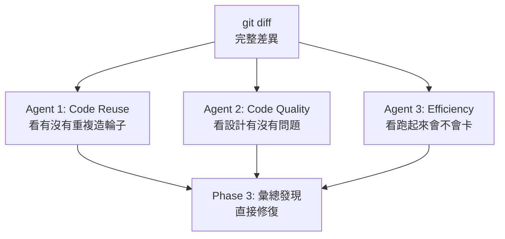

<!-- @include: @article-header.snippet.md -->

Thật ra, có một số lệnh trong Claude Code mà tôi dùng một lần rồi không thể thiếu được, nhưng khi hỏi bạn bè xung quanh thì không nhiều người biết. Loạt bài này sẽ nói về những lệnh bị đánh giá thấp nghiêm trọng — `/simplify`, `/review`, `/loop`, `/batch`.

Những lệnh này bạn chỉ cần biết là có thôi, không cần học thuộc lòng. Gõ dấu gạch chéo `/` là ra ngay, nhanh hơn nhiều so với gõ chữ.

> **Ghi chú phiên bản**: Bài này được tổng hợp dựa trên tài liệu Commands chính thức của Claude Code tháng 5 năm 2026 và hành vi client hiện tại. Các lệnh Claude Code cập nhật rất nhanh, cuối cùng hãy tham khảo `/help`, danh sách lệnh `/` và trang Commands chính thức.

## Hiểu hệ thống lệnh của Claude Code trước

Những thứ bắt đầu bằng `/` trong Claude Code, có hai tầng nguồn gốc:

- **Commands (lệnh cứng hóa)** — `/clear`, `/compact`, `/model`, `/cost`, `/help`, `/review` và các lệnh khác. Logic được viết cứng trong mã CLI, tương tác trực tiếp với terminal, không liên quan đến suy luận AI, tốc độ thực thi nhanh và không tiêu thụ Token.
- **Bundled Skills (kỹ năng tích hợp sẵn)** — `/simplify`, `/batch`, `/debug`, `/loop`, `/claude-api`. Về bản chất là khả năng dựa trên Prompt: khi gọi, Claude sẽ tải một bộ hướng dẫn Markdown cụ thể vào context, rồi điều phối các sub-agent (Sub-agents) để thực thi workflow nhiều bước.

> **Lưu ý**: `/review` là lệnh PR review tích hợp sẵn, không phải bundled skill; để xem xét đa Agent chuyên sâu nên dùng `/ultrareview`.

Dưới đây giới thiệu chi tiết về những khả năng tích hợp thực dụng này.

## /simplify: Đơn giản hóa và tái cấu trúc code

`/simplify` làm một việc rất đơn giản: xem xét code bạn vừa viết, tìm ra các vấn đề ẩn, rồi trực tiếp giúp bạn sửa. Hiện tại tài liệu chính thức đã liệt kê `/simplify` là bundled skill.

### Cơ chế hoạt động: Ba bước

**Bước 1: Xác định phạm vi xem xét.** Thường làm việc xung quanh các file thay đổi gần đây; khi không có tham số, nó chạy `git diff` để lấy thay đổi tăng dần; nếu workspace không có sửa đổi chưa commit, nó sẽ tự động xem xét commit gần nhất. Khi chỉ định tên class cụ thể (ví dụ `/simplify MarketDataService`), nó sẽ đọc toàn bộ file để xem xét toàn diện. Phạm vi cụ thể dựa trên hành vi của phiên bản Claude Code hiện tại.

**Bước 2: Song song khởi động ba Agent xem xét.** Không phải kiểm tra tuần tự từng mục mà đồng thời phái ra ba "người xem xét", mỗi người mang góc nhìn khác nhau đọc cùng một diff:



Ba Agent mỗi người phụ trách một mảng:

- **Code Reuse Agent**: Xem code của bạn có đang phát minh lại bánh xe không. Ví dụ bạn tự viết một `requireNonBlank()`, nó sẽ tìm trong dự án và phát hiện đã có một `InputValidator.requireNonBlank()` làm điều tương tự.
- **Code Quality Agent**: Xem thiết kế code có vấn đề không. Ví dụ cùng một chuỗi hardcode viết ba lần, hai method gần như giống hệt nhau, một class vừa quản lý xác thực vừa gửi email — những chỗ cần tách mà không tách, cần trừu tượng mà không trừu tượng, nó đều chỉ ra.
- **Efficiency Agent**: Xem code khi chạy có vấn đề hiệu suất không. Ví dụ tạo cùng một object liên tục trong vòng lặp, dùng `ConcurrentHashMap` trong tình huống đơn luồng, kết quả đáng ra nên cache thì mỗi lần đều tính lại.

**Bước 3: Tổng hợp và sửa.** Ba Agent mỗi người báo cáo phát hiện, Claude Code sẽ tự động đánh giá cái nào là vấn đề thật, cái nào là false positive, rồi trực tiếp sửa code.

> ⚠️ **Cảnh báo rủi ro**: `/simplify` sẽ áp dụng các sửa chữa, nhưng vẫn khuyến nghị kiểm tra lại qua diff, test và review, đặc biệt là các thay đổi liên quan đến transaction, bảo mật, concurrency. Đây là prompt-based skill, có thể đánh giá sai.

### Chỉ định hướng chú ý

Cũng có thể chỉ định hướng chú ý cho nó:

```bash
/simplify thread safety
/simplify SQL performance
/simplify exception swallowing
/simplify MarketDataService
```

Khi bạn đã biết khu vực nào đại khái có vấn đề và muốn AI giúp định vị chính xác, tính năng này rất hữu ích.

### Case thực chiến: Spring transaction không hoạt động

Có lần tôi viết một module xác thực người dùng, tự test xong chuẩn bị commit. Theo thói quen chạy một lần `/simplify` trước, nó trực tiếp giúp tôi tìm ra 6 vấn đề tiềm ẩn, sau khi xác nhận thì đúng là tất cả đều là vấn đề thực tế.


Đáng nói nhất là một vấn đề **Spring transaction không hoạt động**. Trong ba Agent, có hai Agent độc lập từ các góc độ khác nhau đều bắt được cùng một Bug.

Code vấn đề như sau — trong `WatchlistService`, method ngoài lấy lock phân tán Redis để double-check, bên trong gọi một method `protected` để thực hiện ghi database:

```java
public void initializeDefaultWatchlist(Long userId) {
    // Redis 分布式锁 + double-check（幂等）
    // ...
    doInitializeDefaultWatchlist(userId);  // 同一类内部调用
    // ...
}

@Transactional(rollbackFor = Exception.class)
protected void doInitializeDefaultWatchlist(Long userId) {
    groupService.save(defaultGroup);        // INSERT 分组
    stockService.saveBatch(initialStocks);  // INSERT 5 只股票
}
```

Cấu trúc code trông hợp lý: bên ngoài quản lý lock và idempotency, bên trong quản lý transaction. Nhưng `@Transactional` viết ở đây thực tế **hoàn toàn không có tác dụng** — vì Spring AOP dựa trên dynamic proxy, lời gọi trực tiếp trong cùng class sẽ bỏ qua proxy, annotation không được intercepted.

Điều này có nghĩa là nếu `saveBatch` ném exception ở giữa chừng, record group đã được commit bởi `save` sẽ không được rollback, database sẽ xuất hiện một group rỗng không có cổ phiếu.

> **Điều kiện tiên quyết**: Trong Spring proxy-style AOP mặc định, lời gọi trực tiếp trong cùng class sẽ bỏ qua proxy, `@Transactional` sẽ không có hiệu lực; nếu dùng AspectJ weaving hoặc gọi qua proxy object, kết luận sẽ khác.

- **Code Quality Agent** đánh dấu việc self-call làm `@Transactional` mất hiệu lực, đánh giá là mức độ cao.
- **Efficiency Agent** loại trừ khả năng lock TTL không đủ, xác định chính xác transaction không hoạt động là nguyên nhân gốc rễ.
- **Code Reuse Agent** xác nhận distributed lock tự viết không có thay thế có thể tái sử dụng, triển khai hợp lý.

Phương án sửa mà `/simplify` đưa ra là chuyển declarative transaction sang **programmatic transaction**, dùng `TransactionTemplate` để trực tiếp kiểm soát ranh giới transaction. Các cách sửa khác bao gồm: chuyển transaction method sang một Spring Bean khác, gọi qua proxy object, điều chỉnh ranh giới transaction lên method public bên ngoài.

```java
@RequiredArgsConstructor
public class WatchlistService {

    private final TransactionTemplate transactionTemplate;

    private void doInitializeDefaultWatchlist(Long userId) {
        transactionTemplate.executeWithoutResult(status -> {
            groupService.save(defaultGroup);
            stockService.saveBatch(initialStocks);
        });
    }
}
```


Lần quét này còn phát hiện thêm 5 vấn đề khác, bao gồm tái sử dụng code, bảo mật và hiệu quả:

| Phát hiện                                                                                                                                  | Agent                | Cách sửa                                                                       |
| ------------------------------------------------------------------------------------------------------------------------------------------ | -------------------- | ------------------------------------------------------------------------------ |
| Hai Controller mỗi cái định nghĩa `requireNonBlank()` riêng, trùng với `InputValidator` đã có                                              | Reuse                | Xóa method riêng, dùng `InputValidator.requireNonBlank()`                      |
| regex của exception handler mỗi lần `replaceAll` đều biên dịch lại, và class ký tự không chứa `+/=`, token base64 sẽ bị bỏ sót khi ẩn danh | Quality + Efficiency | Trích xuất thành `static final Pattern`, mở rộng class ký tự để bao phủ base64 |
| Dùng `ConcurrentHashMap` + `@Scheduled` để thủ công dọn dẹp Ticket hết hạn 30 giây                                                         | Efficiency           | Thay bằng Caffeine cache đã có trong dự án (tích hợp TTL eviction)             |
| Biến cục bộ `Map` trong method `@Bean` dùng `ConcurrentHashMap`                                                                            | Efficiency           | Đổi thành `HashMap` (đơn luồng điền, không cần thread-safe)                    |
| Lỗi chú thích: "兖底" nên là "兜底"                                                                                                        | Quality              | Sửa                                                                            |

Kết quả cuối cùng: 5 file sửa đổi, giảm ròng 38 dòng code, sửa 6 vấn đề, biên dịch một lần thành công.

### Case thực chiến: Xem xét module cụ thể

`/simplify` còn có thể chỉ định class hoặc module cụ thể để xem xét chuyên sâu:


```bash
/simplify MarketDataService
```

Tôi chạy một lần xem xét chuyên biệt trên `MarketDataService` (khoảng 570 dòng) của dự án, service dữ liệu thị trường này. Class này tổng hợp nhiều nguồn dữ liệu, cung cấp Caffeine local cache + Redis distributed cache + circuit breaker fallback. Ba Agent tìm ra 8 vấn đề, trong đó có hai vấn đề mức độ cao:

**Bug: Chu kỳ `year` bị âm thầm hạ cấp xuống `month`.** Trong method `normalizePeriod` có một switch:

```java
case "year", "yearly", "y" -> "month";  // Bug！应该是 "year"
```

Tất cả các chu kỳ khác đều được ánh xạ đúng (`day → "day"`, `week → "week"`, `month → "month"`), duy nhất `year` bị ánh xạ sang `month`. Caller yêu cầu K-line hàng năm, thực tế nhận được K-line hàng tháng, không có bất kỳ lỗi hay thông báo nào.

### Tình huống phù hợp

**Phù hợp với:**

- Tự xem xét trước khi commit PR — đặc biệt là các thay đổi liên quan đến refactoring nhiều file, để ba Agent song song quét một lần, chi phí thấp nhưng lợi ích có thể rất cao.
- Kiểm tra chất lượng sau refactoring — vừa hoàn thành một lần dọn dẹp code quy mô lớn, dùng để xác nhận không đưa vào vấn đề thiết kế mới.
- Công cụ hỗ trợ Code Review — giúp bạn phát hiện những vấn đề cần kiến thức domain mới có thể nhận ra.

**Không phù hợp lắm với:**

- Kiểm toán code toàn dự án — khi không có tham số, làm việc dựa trên `git diff`, chỉ xem xét thay đổi tăng dần.
- Thống nhất phong cách — dấu ngoặc nhọn đặt dòng nào, dùng tab hay space, đó là việc của formatter.
- Kiểm toán bảo mật — xem xét bảo mật chuyên nghiệp cần công cụ SAST.

**Sự khác biệt cốt lõi với công cụ truyền thống:** Công cụ dựa trên quy tắc truyền thống mặc định giỏi hơn trong việc phát hiện code smell chung; vấn đề ngữ nghĩa framework thường cần quy tắc chuyên biệt hoặc phân tích ngữ nghĩa. Lợi thế của `/simplify` là nó có thể **suy luận kết hợp context**, hiểu ngữ nghĩa framework.

## /review: Xem xét code

> **Ghi chú tiên quyết**: `/review` là lệnh PR review cục bộ, dùng để xem xét branch hiện tại hoặc PR được chỉ định; nếu muốn xem xét đa Agent chuyên sâu, nên dùng `/ultrareview`; xem xét bảo mật nên dùng `/security-review`.

`/review` và `/simplify` có định vị hoàn toàn khác nhau: `/simplify` là người dọn dẹp tự động, tìm thấy vấn đề thì sửa ngay; `/review` là người xem xét kỳ cựu, tìm thấy vấn đề thì liệt kê ra cho bạn xem, bạn tự quyết định có sửa không.

Nói đơn giản, `/simplify` tập trung vào **khả năng tái sử dụng, chất lượng code và hiệu quả**, thiên về dọn dẹp và cải thiện; `/review` tập trung vào **code có viết sai không**, thiên về xem xét tính đúng đắn.

### Cơ chế hoạt động

Khi thực thi `/review`, Claude Code sẽ làm ba việc:

**Bước 1: Lấy thay đổi.** Nó chạy `git diff` trước để lấy thay đổi tăng dần, hoặc đọc thay đổi remote dựa trên PR bạn chỉ định.

**Bước 2: Phân tích song song.** Claude Code song song xem xét các thay đổi, kết hợp lọc độ tin cậy để giảm false positive.

**Bước 3: Xuất báo cáo phân cấp.** Cuối cùng bạn sẽ nhận được một danh sách vấn đề phân cấp (Critical / High / Medium / Low), mỗi vấn đề kèm số dòng cụ thể, lý do và gợi ý sửa.

### Cách dùng

```bash
/review              # Xem xét PR tương ứng với branch hiện tại, hoặc ngữ cảnh PR cục bộ
/review 123          # Xem xét PR được chỉ định
```

Xem xét cấp độ file nên viết bằng ngôn ngữ tự nhiên: ví dụ "review src/auth/login.service.ts".

Sau khi xem xét xong và phát hiện vấn đề, bạn có thể trực tiếp nói "sửa tất cả vấn đề Critical", Claude sẽ tự động sửa dựa trên gợi ý xem xét.

### Chọn /review, /security-review hay /ultrareview

| Lệnh               | Phù hợp với tình huống                                                | Trọng tâm                                        |
| ------------------ | --------------------------------------------------------------------- | ------------------------------------------------ |
| `/review`          | PR thường ngày / xem xét thay đổi cục bộ                              | Tính đúng đắn, điều kiện biên, Bug tiềm ẩn       |
| `/security-review` | Module nhạy cảm như đăng nhập, thanh toán, quyền, upload, Webhook     | Injection, xác thực, rò rỉ dữ liệu, bypass quyền |
| `/ultrareview`     | Trước khi PR quan trọng lên production, muốn xem xét sâu hơn một tầng | Sandbox cloud, đa Agent, Deep Review             |

Gợi ý của tôi: PR thường dùng `/review`, thay đổi liên quan đến biên giới bảo mật chạy thêm `/security-review`, trước khi lên production core path hoặc phiên bản lớn mới cân nhắc `/ultrareview`.

### Chọn /review hay /simplify

|            | `/simplify`                                    | `/review`                                                      |
| ---------- | ---------------------------------------------- | -------------------------------------------------------------- |
| Mục tiêu   | Loại bỏ technical debt, nâng cao khả năng đọc  | Đảm bảo tính đúng đắn, phát hiện Bug                           |
| Làm gì     | Biến đổi tương đương (refactor)                | Chẩn đoán logic (phân tích)                                    |
| Kết quả    | Trực tiếp sửa code                             | Liệt kê vấn đề và gợi ý                                        |
| Điểm chú ý | Lồng nhau quá sâu, đặt tên biến, logic dư thừa | Lỗ hổng bảo mật, nút thắt hiệu suất, điều kiện biên, lỗi logic |

Chọn `/simplify`: Code chạy được nhưng liên quan đến vấn đề tái sử dụng, chất lượng code hay hiệu quả, vừa viết xong prototype muốn refactor nhanh, muốn xóa code dư thừa để tiết kiệm Token.

Chọn `/review`: Không chắc code có Bug không, kiểm tra lần cuối trước khi lên production, module quan trọng liên quan đến bảo mật hoặc tài chính, muốn xem kỹ sư kỳ cựu sẽ có ý kiến gì về code của bạn.

**Cách dùng được khuyến nghị nhất là `/review` trước rồi `/simplify` sau — đảm bảo logic đúng trước, rồi mới dọn dẹp code.**

### Case thực chiến

Có lần tôi viết một module xác thực người dùng, tự test xong chuẩn bị commit. Tiện tay chạy một lần `/review`, nó đánh dấu ba vấn đề:

**Critical: Interface reset mật khẩu không có rate limit.** Kẻ tấn công có thể gọi interface reset vô hạn để tấn công bombarding email người dùng. Điều này khi tự test thì hoàn toàn không nghĩ đến — môi trường test chỉ có một mình tôi, lấy đâu ra nhu cầu rate limit.

**High: Thời gian hết hạn Token đọc từ config nhưng không có fallback.** Nếu config item không được đặt, thời gian hết hạn sẽ thành 0, nghĩa là Token vừa tạo xong đã hết hạn. `/review` gợi ý thêm `Math.max(config.tokenExpiry, 3600)` để bảo vệ tối thiểu.

**Medium: Log in ra userId dạng plaintext.** Tuy không hẳn là thông tin nhạy cảm, nhưng trong tình huống yêu cầu compliance nghiêm ngặt vẫn nên ẩn danh tốt hơn.

Ba vấn đề, hai cái liên quan đến bảo mật. Nếu không chạy `/review`, hai vấn đề đầu sẽ đi thẳng lên production.

### Lưu ý

**Nó không quyết định thay bạn.** Khác với `/simplify`, `/review` mặc định không sửa code, chỉ đưa ra gợi ý. Với code quan trọng liên quan đến bảo mật, kiểu "xem trước rồi mới động" này cho người ta an tâm hơn.

**Nó phụ thuộc vào CLAUDE.md.** Nếu bạn không viết quy chuẩn trong `CLAUDE.md`, `/review` chỉ có thể làm xem xét chung. Viết quy chuẩn code, ưu tiên lựa chọn công nghệ, yêu cầu bảo mật của dự án vào đó, chất lượng đầu ra sẽ cao hơn nhiều.

**Nó không phải là SonarQube.** SonarQube dựa trên khớp quy tắc, `/review` có thể hiểu ngữ nghĩa framework — nó biết Spring proxy hoạt động như thế nào, biết `@Transactional` sẽ mất hiệu lực khi self-call trong cùng class. Đây là điểm mạnh hơn so với công cụ static analysis truyền thống.

## /loop: Task định kỳ và lặp tự chủ

Đây là một trong hai lệnh mạnh nhất mà cha đẻ Claude Code cho là vậy, ông ấy đã nhiều lần chia sẻ và giới thiệu.


`/loop` có thể giúp bạn chạy task định kỳ, cũng có thể giúp bạn thử đi thử lại cho đến khi hoàn thành việc.

### Giải quyết vấn đề gì

Trong phát triển hàng ngày có hai loại việc đặc biệt phiền não:

- Loại đầu là việc cần làm lặp đi lặp lại. Ví dụ mỗi nửa tiếng kiểm tra xem có PR mới cần xử lý không, mỗi sáng chạy một lần test xem có cái nào hỏng không. Những việc này không khó, nhưng hay quên.
- Loại hai là việc cần thử đi thử lại. Ví dụ sửa một Bug liên quan đến nhiều module, chuyển toàn bộ dự án từ CommonJS sang ESM. Đặc điểm của loại task này là: một lần không xong, giữa chừng sẽ có lỗi, có lỗi phải sửa, sửa xong phải xác minh lại.

`/loop` tiếp nhận cả hai loại việc này.

### Chọn phương án lập lịch nào trong ba phương án

Claude Code không chỉ có `/loop` là cơ chế định kỳ duy nhất, thực ra nó có ba bộ phương án lập lịch:

|                                   | **Cloud Task**               | **Desktop Task**           | **/loop**                                                                                                                                                      |
| --------------------------------- | ---------------------------- | -------------------------- | -------------------------------------------------------------------------------------------------------------------------------------------------------------- |
| Chạy ở đâu                        | Cloud Anthropic              | Máy của bạn                | Máy của bạn                                                                                                                                                    |
| Cần bật máy không                 | Không cần                    | Cần                        | Cần                                                                                                                                                            |
| Cần mở session không              | Không cần                    | Không cần                  | **Cần**                                                                                                                                                        |
| Còn sau khi restart không         | Còn                          | Còn                        | Cấp session; không thực thi trong lúc đóng; khi phục hồi cùng session bằng `--resume` / `--continue`, recurring task chưa hết hạn trong 7 ngày có thể phục hồi |
| Có thể truy cập file cục bộ không | Không thể (clone lại)        | Có                         | Có                                                                                                                                                             |
| MCP server                        | Cấu hình riêng cho từng task | File cấu hình và connector | Kế thừa session hiện tại                                                                                                                                       |
| Khoảng cách tối thiểu             | 1 giờ                        | 1 phút                     | 1 phút                                                                                                                                                         |

Một câu chọn lựa: **Muốn đáng tin, không muốn quản lý máy → Cloud Task; muốn đọc file cục bộ → Desktop Task; polling tạm thời, dùng nhanh → `/loop`.**

### Hai chế độ làm việc

**Chế độ 1: Lập lịch định kỳ (Cron mode)**

Nói với nó "làm gì" và "bao lâu làm một lần", đến giờ nó tự chạy:

```bash
/loop 30m /review              # Mỗi 30 phút chạy một lần xem xét code
/loop 1h "跑一遍單元測試，看看有沒有失敗的"  # Mỗi giờ kiểm tra test
/loop 5m "檢查 GitHub 上開放的 PR 狀態"    # Mỗi 5 phút xem trạng thái PR
```

Có ba cách viết khoảng cách:

| Cách viết              | Ví dụ                              | Hiệu quả                                                                                                                                        |
| ---------------------- | ---------------------------------- | ----------------------------------------------------------------------------------------------------------------------------------------------- |
| Khoảng cách ở đầu      | `/loop 30m 檢查構建狀態`           | Mỗi 30 phút                                                                                                                                     |
| "every" ở sau          | `/loop 檢查構建狀態 every 2 hours` | Mỗi 2 giờ                                                                                                                                       |
| Không viết khoảng cách | `/loop 檢查構建狀態`               | Claude động态 chọn khoảng cách thực thi tiếp theo (thường 1 phút đến 1 giờ); trong kịch bản Bedrock/Vertex AI/Microsoft Foundry cố định 10 phút |

**Chế độ 2: Lặp tự chủ (Agentic Loop)**

Trong chế độ này `/loop` không còn là timer nữa mà là "engine thử sai tự động". Bạn cho nó một mục tiêu, nó tự lên kế hoạch, thực thi, xác minh, sửa chính, lặp đi lặp lại. Phù hợp để giao chu trình "thực thi—quan sát—sửa chính—thực thi lại" cho Claude, nhưng cần viết rõ tiêu chuẩn hoàn thành, số lần thử tối đa và điều kiện dừng:

```bash
/loop "修復 auth 模塊裡所有失敗的單元測試，直到全部通過"
/loop "把 src/legacy 下所有組件遷移到 Tailwind CSS，確保頁面渲染正常"
/loop "實現支付寶支付模塊，補上單元測試，確保全部通過"
```

Ở chế độ thường, Claude viết xong code thì giao cho bạn, lỗi bạn phải tự dán lại. Ở chế độ `/loop`, nó tự đọc lỗi, tự sửa, tự chạy lại test, toàn bộ không cần bạn theo dõi.

### Năm tình huống thực tế

**1. Tự động monitor trạng thái PR.** Mỗi 5 phút lấy PR đang mở một lần, kiểm tra có conflict không, có thể merge an toàn không, tạo tóm tắt.

```bash
/loop 5m "用 gh 命令檢查開放 PR 的狀態，標記有沖突的和可以安全合並的"
```

**2. Watchdog test tự động.** Chạy test định kỳ, phát hiện test thất bại thì thử sửa. Đặc biệt hữu ích trong dự án nhiều người hợp tác — code người khác merge vào có thể âm thầm làm hỏng module của bạn.

```bash
/loop 2h "運行測試套件，發現失敗的就修復"
```

**3. Đồng bộ tài liệu dự án định kỳ.** Sửa code quên sửa tài liệu, đây là lỗi lập trình viên hay mắc nhất. Mỗi 2 giờ để `/loop` quét thay đổi code, tự động đồng bộ thay đổi vào tài liệu người dùng.

```bash
/loop 2h "檢查最近的代碼變更，更新對應的公開文檔"
```

**4. Di chuyển công nghệ quy mô lớn.** Ví dụ chuyển toàn bộ dự án từ CommonJS sang ESM, hàng chục file, chắc chắn sẽ có lỗi ở giữa. `/loop` có thể tự xử lý các lỗi này, sửa từng file một.

```bash
/loop "把項目裡所有 CommonJS 的 require/module.exports 改成 ESM 的 import/export，確保測試全部通過"
```

**5. Khởi động hàng loạt task tự động.** Có thể viết một file lệnh tùy chỉnh, liệt kê tất cả task định kỳ bên trong. Khi khởi động dự án chạy một lệnh là có thể kéo tất cả task tự động lên cùng một lúc.

### Cách quản lý task

Nói chuyện trực tiếp với Claude bằng ngôn ngữ tự nhiên là được:

```bash
我現在有哪些定時任務？
停掉那個檢查部署的任務
```

Bên dưới dùng ba công cụ để làm việc:

| Công cụ      | Làm gì                                                                 |
| ------------ | ---------------------------------------------------------------------- |
| `CronCreate` | Tạo task, nhận cron expression, prompt cần thực thi, có lặp không      |
| `CronList`   | Liệt kê tất cả task đang chạy, hiển thị ID, thời gian lập lịch, prompt |
| `CronDelete` | Xóa task theo ID                                                       |

### Chi tiết cơ chế vận hành

**Chỉ trigger khi rảnh.** Scheduler kiểm tra mỗi giây có task đến hạn không, nhưng chỉ trigger khi Claude rảnh. Nếu bạn đang trò chuyện với nó, task sẽ xếp hàng đợi lượt trò chuyện hiện tại kết thúc mới chạy.

**Có cơ chế jitter.** Ngăn tất cả task của người dùng đổ xuống API cùng một lúc. Task lặp có thể trễ tối đa 10% chu kỳ, giới hạn trên 15 phút. Nếu khoảng cách task nhỏ hơn 1 giờ, trễ tối đa nửa interval. Nếu cần trigger chính xác, nên tránh `:00` và `:30`.

**Task có hạn sử dụng.** Task lặp tự động hết hạn sau **7 ngày** kể từ khi tạo, sẽ thực thi một lần cuối rồi tự xóa. Cần chu kỳ dài hơn thì dùng Cloud hoặc Desktop scheduled task.

### Lưu ý

- **Tiêu thụ Token không thấp.** Đặc biệt là chế độ lặp tự chủ, hướng dẫn phải càng cụ thể càng tốt, tiêu chuẩn hoàn thành phải rõ ràng.
- **Chỉ có hiệu lực trong session hiện tại.** Đóng terminal hoặc thoát Claude Code, trong lúc đóng sẽ không thực thi, cũng không bù chạy. Nó không phải là thay thế cho CI/CD.
- **Nên thêm giới hạn.** Nếu mục tiêu mãi không đạt được nó sẽ chạy mãi. Thêm một câu "tối đa thử 10 lần" trong hướng dẫn.
- **Viết rõ điều kiện dừng.** Bao gồm số lần thử tối đa và tiêu chuẩn nghiệm thu (test tất cả pass/CI green/không có lint error).
- **Báo cáo trước khi thất bại.** Giới hạn thao tác ghi, tránh sửa đổi vô hạn. Các thay đổi liên quan đến path quan trọng nên commit trước rồi mới chạy `/loop`, tiện cho việc rollback.
- **Giới hạn 7 ngày.** Task lặp tự động hết hạn sau 7 ngày kể từ khi tạo, giới hạn này cũng áp dụng cho dynamic loop. Cần chu kỳ dài hơn dùng Routines hoặc Desktop scheduled tasks.

## /debug: Chạy trước khi Claude Code bản thân có vấn đề

`/debug` không phải giúp bạn debug code nghiệp vụ, mà giúp bạn kiểm tra sự cố của bản thân session Claude Code.

Ví dụ kết nối MCP bất thường, gọi tool thất bại, lệnh bị treo, quy tắc quyền không có hiệu lực, plugin tải bất thường, kiểu vấn đề này đừng vội restart, hãy chạy trước:

```bash
/debug MCP 連接一直失敗
/debug 為什麼工具調用被拒絕
/debug Claude Code 卡住不動
```

Nó sẽ bật debug log cho session hiện tại và phân tích vấn đề kết hợp với log.

> **Lưu ý**: Nếu bạn không khởi động bằng `claude --debug`, `/debug` chỉ có thể bắt log từ sau khi thực thi, lỗi trước đó có thể không thấy được.

## /batch: Điều phối nhiều task song song

Bản chất cốt lõi của `/batch` là bộ điều phối nhiều task song song, sức mạnh của nó nằm ở chỗ nó có thể **tự động phân tách và thực thi song song** một "yêu cầu lớn" phức tạp.

- **Phân tách task (Task Decomposition):** Khi bạn nói một task lớn hay nhiều yêu cầu, Claude không bắt đầu bừa bãi mà chia logic thành các **Unit (đơn vị công việc)** độc lập.
- **Làm việc song song (Parallel Workers):** Claude sẽ đồng thời khởi động nhiều Agent nền, xử lý các module chức năng khác nhau.
- **Workspace độc lập (Independent Worktrees):** Để ngăn nhiều Agent cùng sửa code gây conflict, Claude tạo **Git Worktree** độc lập cho mỗi Worker. Điều này có nghĩa là chúng sửa code trong môi trường cách ly vật lý, không ảnh hưởng lẫn nhau.

**Cách dùng rất đơn giản**:

```bash
/batch  1、移除自選股界面，直接通過分析界面來管理，每一行股票的最右側展示選項，支持刪除和分組。
  2、自選股提取一個組件、K線展示和討論室都單獨提取一個組件出來。
  3、優化提示詞管理，例如支持刪除和重命名。
  4、歷史記錄目前支持10條記錄，這塊的設計優化一下。
```

Sau khi Claude nhận được sẽ đưa ra kế hoạch phân tách trước (thường 5~30 unit), sau khi xác nhận sẽ thực thi song song trong worktree cách ly, mỗi unit thường tạo ra PR độc lập.


Sau khi mỗi Worker hoàn thành, tiến trình chính sẽ kiểm tra thay đổi của mỗi unit, cuối cùng tạo ra nhiều PR độc lập (thay vì gộp thành một PR lớn).

> ⚠️ **Cảnh báo rủi ro**: `/batch` phù hợp với task lớn có ranh giới rõ ràng, module tương đối độc lập; không phù hợp với thay đổi lớn một lần cho core path có coupling mạnh. File dùng chung (như package.json, bảng route, type chung, script migrate database) dễ bị conflict. Khuyến nghị commit workspace sạch trước khi dùng.


**Bạn có thể hiểu là:** Bạn thuê ba lập trình viên thuê ngoài (Worker) làm việc ở ba phòng khác nhau, bây giờ project manager (Main Agent) phát hiện khóa cửa ba phòng đó có vấn đề, nên ông ấy tự đến từng phòng sao chép code đã viết ra, cuối cùng giao cho bạn.

## Một số lệnh hỗ trợ dễ bị bỏ qua

Mấy lệnh trên phụ trách làm việc, nhưng khi thực sự dùng quen rồi, bạn còn thường xuyên dùng đến các lệnh hỗ trợ này.

| Lệnh               | Tác dụng                           | Tôi thường dùng khi nào                                     |
| ------------------ | ---------------------------------- | ----------------------------------------------------------- |
| `/diff`            | Xem Claude đã sửa gì thực sự       | Sau mỗi lần `/simplify`, `/batch` phải xem                  |
| `/context`         | Xem mức sử dụng context            | Khi task dài bắt đầu chậm, bắt đầu trôi nổi thì xem trước   |
| `/compact`         | Tóm tắt và nén context             | Dùng trước khi tiếp tục đẩy session dài                     |
| `/debug`           | Kiểm tra sự cố session Claude Code | Khi MCP, gọi tool, quyền bất thường dùng                    |
| `/permissions`     | Quản lý quyền tool                 | Kiểm tra trước khi chạy `/loop`, `/batch`                   |
| `/statusline`      | Cấu hình thanh trạng thái          | Khi muốn thường trực xem model, directory, context, chi phí |
| `/usage` / `/cost` | Xem lượng sử dụng và chi phí       | Xem tiêu thụ trước và sau task dài                          |

### Đừng bỏ qua quản lý context: /context và /compact

Task dài chạy lâu, Claude Code không nhất thiết là "năng lực giảm sút", nhiều khi là context bị nhét đầy quá.

Xem trước:

```bash
/context
```

Nó sẽ hiển thị tình trạng sử dụng context hiện tại, cho biết tool output, lịch sử trò chuyện, file quy tắc có làm tràn cửa sổ không.

Nếu task đã trò chuyện rất lâu nhưng vẫn muốn tiếp tục đẩy, có thể dùng:

```bash
/compact 只保留當前重構目標、已完成改動、剩余 TODO、關鍵約束
```

`/compact` sẽ tóm tắt session hiện tại, giải phóng một phần context. Làm một lần compact giữa task lớn, nhưng nhất định phải cho nó phạm vi bảo toàn rõ ràng, đừng chỉ chạy trần `/compact`.

### Đừng mở tất cả quyền: /permissions phải biết dùng

Claude Code có thể đọc file, sửa file, chạy lệnh, năng lực rất mạnh, nhưng quyền không thể mở bừa bãi.

Khuyến nghị chạy trước:

```bash
/permissions
```

Đặt các lệnh rủi ro cao thành ask hoặc deny, ví dụ xóa file, thực thi script deploy, thao tác database production, push remote branch kiểu hành động này. Đặc biệt khi bạn sắp chạy `/loop` hoặc `/batch`, càng nên siết chặt quyền trước.

Để AI tự động làm việc được, nhưng đừng để nó tự động gây họa.

### Hình thành thói quen "xem diff trước khi tin AI"

Sau khi Claude sửa xong code, đừng chỉ xem tóm tắt của nó, hãy trực tiếp chạy:

```bash
/diff
```

Nó sẽ mở interactive diff viewer, xem workspace hiện tại thực sự đã sửa những file nào, những dòng nào. Đặc biệt với các lệnh trực tiếp động vào code như `/simplify`, `/batch`, sau khi chạy xong xem diff trước, rồi mới quyết định có tiếp tục không.

## Không phải bản thân lệnh mà là tổ hợp mới thực sự tần suất cao

Ở trên đã nói về `/simplify`, `/review`, `/loop`, `/batch`, nhưng khi thực sự dùng quen rồi, bạn sẽ thấy những lệnh này có thể tổ hợp thành một workflow hoàn chỉnh:

- `/batch` phụ trách phân tách task
- `/loop` phụ trách thực thi lặp và xác minh
- `/simplify` phụ trách dọn dẹp technical debt
- `/review` phụ trách kiểm soát tính đúng đắn
- `/security-review` phụ trách bảo đảm bảo mật
- `/diff` phụ trách kiểm tra thủ công
- `/context` + `/compact` phụ trách duy trì context

Một workflow ổn định hơn là như này:

1. `/context` xem trước context có healthy không
2. `/permissions` kiểm tra cài đặt quyền có hợp lý không
3. `/batch` phân tách yêu cầu lớn thành nhiều task độc lập
4. `/loop` xử lý task phức tạp cần xác minh lặp đi lặp lại
5. `/simplify` dọn dẹp code dư thừa và technical debt
6. `/review` làm xem xét tính đúng đắn
7. Liên quan đến module nhạy cảm như đăng nhập, thanh toán, quyền, upload, Webhook, chạy thêm `/security-review`
8. `/diff` xác nhận thay đổi thủ công
9. Cuối cùng chạy test, submit PR

Qua một vòng này, có thể giảm đáng kể các thao tác cơ học, nhưng các nút quan trọng vẫn cần xem kế hoạch, xem diff, chạy test, làm final review.

## Phụ lục: Kết nối Claude Code với model nội địa

Claude Code mạnh ở toolchain và khả năng thực thi, nhưng model chính thức của Claude quá đắt, thêm vào đó Claude hiện nay dễ bị khóa tài khoản. Chúng ta có thể dùng MiniMax hoặc GLM nội địa làm model nền. Cả hai đều dùng **OpenAI compatible interface** chuẩn, quá trình kết nối rất suôn sẻ.

### 1. Lấy API Key

- Nền tảng mở MiniMax: **https://platform.minimaxi.com/user-center/basic-information/interface-key**
- Nền tảng mở GLM: **https://www.bigmodel.cn/usercenter/proj-mgmt/apikeys**


### 2. Khuyến nghị dùng CC Switch

Rất khuyến nghị cài đặt **CC Switch**, đây là một công cụ nhỏ chuyên quản lý chuyển đổi model Claude Code, hỗ trợ quản lý Skills, MCP và prompt.

Địa chỉ dự án: **https://github.com/farion1231/cc-switch**


Khởi động CC Switch, click **"+"** góc trên bên phải, chọn nhà cung cấp MiniMax/GLM được định sẵn, điền API Key, chọn model, thêm vào là xong.


### 3. Xác minh có hiệu lực không

Nhập lệnh `claude` trong bất kỳ directory nào để khởi động Claude Code, chọn **Tin tưởng thư mục này (Trust This Folder)**.


### 4. Checklist xác minh kết nối

MiniMax / GLM kết nối không phải "có thể trò chuyện" là thành công, điều quan trọng của Claude Code là gọi tool. Khuyến nghị xác minh các tính năng core sau:

- [ ] Có thể stream output ổn định không
- [ ] Có thể gọi Bash / Read / Edit / Write không
- [ ] Có thể chạy subagent không
- [ ] Có thể xử lý long context và nén không
- [ ] Có hỗ trợ gọi MCP tool không
- [ ] Có thể hoàn thành vòng lặp "sửa code → chạy test → sửa lỗi" của dự án thực không
