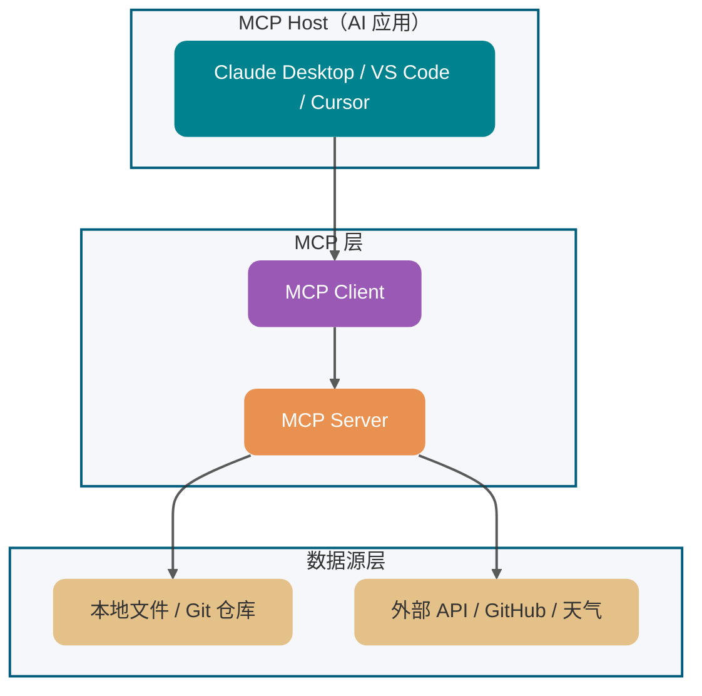
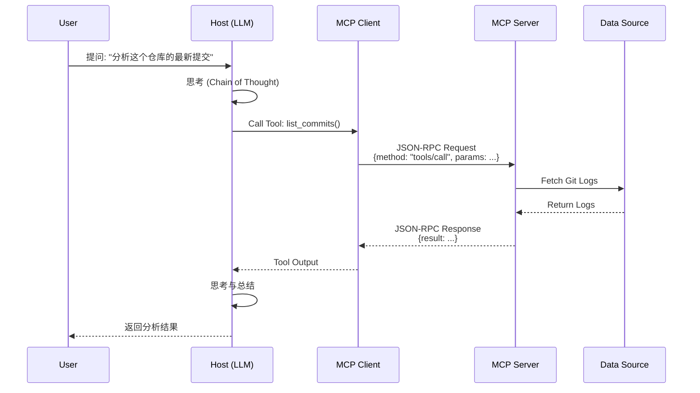

Trong bối cảnh phát triển ứng dụng LLM đang tiến hóa từ "đơn thể gọi" sang "Complex Agent", điều khiến lập trình viên đau đầu nhất thực ra không phải là việc đổi mô hình — framework đã đóng gói sẵn sự khác biệt API giữa các mô hình. **Điều thực sự khiến người ta phát điên là sự phân mảnh trong việc tích hợp công cụ**: Mỗi lần muốn cho AI dùng GitHub, file local hoặc MySQL, phải viết riêng một bộ adapter code cho Claude, GPT, DeepSeek. Thay đổi một tool interface, phải đồng bộ bảo trì vài bộ code, vừa phiền vừa dễ lỗi.

**MCP (Model Context Protocol)** ra đời chính là để chấm dứt sự hỗn loạn này. Nó được ví von hình tượng là **"cổng USB-C trong lĩnh vực AI"**, thông qua giao thức giao tiếp thống nhất, giúp lập trình viên công cụ **phát triển MCP Server một lần**, sau đó tất cả ứng dụng AI hỗ trợ MCP đều có thể tái sử dụng trực tiếp, thực sự giải phóng sự ghép nối giữa mô hình và các nguồn dữ liệu, công cụ bên ngoài.

Hôm nay hãy cùng tìm hiểu một số câu hỏi liên quan đến khái niệm cơ bản MCP. Bài viết này gần 1.6 vạn chữ, nên bookmark lại, sau khi đọc xong bạn sẽ hiểu:

1. ⭐ MCP là gì? Nó giải quyết vấn đề cốt lõi gì?
2. ⭐ MCP, Function Calling và Agent có những điểm khác biệt và liên hệ gì?
3. Bốn năng lực cốt lõi của MCP v1.0 là gì?
4. ⭐ Kiến trúc bốn tầng của MCP hoạt động như thế nào?
5. Tại sao MCP chọn JSON-RPC 2.0 thay vì RESTful?
6. ⭐️ MCP hỗ trợ những phương thức truyền dẫn nào? (stdio, Streamable HTTP)
7. ⭐ Trong môi trường production, có những best practice nào cần biết khi phát triển MCP Server?

## Khái niệm cơ bản MCP

### ⭐️ MCP là gì? Nó giải quyết vấn đề gì?

**MCP (Model Context Protocol)** là giao thức mở được Anthropic đề xuất vào năm 2024, được mệnh danh là **"chuẩn cổng USB-C trong lĩnh vực AI"**. Nó thống nhất thông qua JSON-RPC 2.0 các quy tắc giao tiếp giữa LLM với các nguồn dữ liệu/công cụ bên ngoài, giải quyết vấn đề **phức tạp và phân mảnh** trong phát triển ứng dụng AI.

Nó cho phép AI kết nối với nguồn dữ liệu (như file local, database), công cụ (như search engine, máy tính) cũng như workflow (như các prompt cụ thể), giúp nó có thể lấy thông tin quan trọng và thực thi các tác vụ cụ thể.


Trước khi MCP xuất hiện, khi các lập trình viên tích hợp công cụ cho các LLM khác nhau (OpenAI GPT, Claude, Ernie Bot, v.v.) và các hệ thống backend khác nhau, họ phải viết lượng lớn **adapter code tùy chỉnh**. Điều này dẫn đến:

- **Công việc lặp lại**: Cùng một chức năng cần triển khai lại cho từng LLM.
- **Chi phí bảo trì cao**: Thay đổi API cần cập nhật ở nhiều nơi.
- **Phân mảnh hệ sinh thái**: Thiếu tiêu chuẩn tool interface thống nhất.

MCP thông qua việc định nghĩa **giao thức giao tiếp thống nhất**, giúp công cụ được phát triển một lần có thể dùng trên nhiều LLM platform, giống như cổng USB-C giúp các thiết bị khác nhau có thể dùng chung dây sạc.

> 🌈 **Mở rộng thêm**:
>
> Giá trị cốt lõi của MCP nằm ở **decoupling và standardization**. Giống như HTTP thống nhất truyền tải web, RESTful API thống nhất service interface, MCP thống nhất cách AI tương tác với thế giới bên ngoài. Không có tầng chuẩn hóa này, mỗi lần kết nối một công cụ mới phải adapt lại API của từng nhà, việc scale về cơ bản là không thể.

### Bốn năng lực cốt lõi của MCP là gì?

MCP v1.0 định nghĩa bốn loại năng lực cốt lõi, bao phủ các tình huống chính trong tương tác giữa LLM và bên ngoài:

| **Năng lực**                  | **Tác dụng cốt lõi**                                                                                                                                                                                                                                                 | **Ví dụ tình huống thực tế**                                                                                                                                                                                                    | **Đường thất bại và ranh giới**                                                                                                                                            |
| ----------------------------- | -------------------------------------------------------------------------------------------------------------------------------------------------------------------------------------------------------------------------------------------------------------------- | ------------------------------------------------------------------------------------------------------------------------------------------------------------------------------------------------------------------------------- | -------------------------------------------------------------------------------------------------------------------------------------------------------------------------- |
| **Resources (Tài nguyên)**    | **Luồng dữ liệu chỉ đọc**. Cho phép mô hình đọc dữ liệu bên ngoài như đọc file local.                                                                                                                                                                                | Tự động đọc tài liệu trong GitHub Repo, lịch sử trong database                                                                                                                                                                  | File không tồn tại trả về JSON-RPC error code `-32004`; file lớn cần triển khai **Chunking** (khuyến nghị chunk đơn < 100KB)                                               |
| **Tools (Công cụ)**           | **Hành động có thể thực thi**. Code hoặc API mà mô hình có thể chủ động trigger.                                                                                                                                                                                     | Tự động chạy một đoạn Python script, gửi một tin nhắn trên Slack, thực thi SQL                                                                                                                                                  | **Phải thiết kế idempotent**: Phòng retry storm; timeout cần cấu hình Backoff strategy, khuyến nghị **P99 latency < 200ms**                                                |
| **Prompts (Prompt template)** | **Tập chỉ dẫn preset**. "Hướng dẫn vận hành chuẩn hóa" mà server cung cấp cho mô hình.                                                                                                                                                                               | Prompt template cho các tình huống nghiệp vụ cụ thể như "refactor đoạn code này", "tạo báo cáo tuần"                                                                                                                            | Khi render template thất bại cần trả về thông báo lỗi rõ ràng                                                                                                              |
| **Sampling (Lấy mẫu)**        | **Cho phép MCP Server yêu cầu Host end LLM thực hiện inference generation**. Điều này phá vỡ luồng dữ liệu một chiều, cho phép Server sau khi lấy dữ liệu, tận dụng năng lực LLM mạnh mẽ của Host để tóm tắt, hiểu hoặc generate, rồi trả kết quả về cho người dùng. | Phân tích log: Server đọc vài chục nghìn dòng log, yêu cầu Host LLM tóm tắt error pattern và root cause. Code review: Công cụ phân tích code trích xuất code snippet, yêu cầu Host LLM phân tích ngữ nghĩa và tạo gợi ý tối ưu. | Timeout cần retry với backoff; **P99 protocol handshake latency < 500ms** (lưu ý: không bao gồm thời gian LLM generation); cần graceful degradation khi người dùng từ chối |

> **Gợi ý kỹ thuật**: Thiết kế idempotency của Tools là cực kỳ quan trọng. Do network jitter hoặc tính không xác định của LLM inference, cùng một Tool có thể bị gọi lặp lại. Khuyến nghị đảm bảo idempotency thông qua unique request ID (idempotency-key) hoặc cơ chế dedup ở tầng nghiệp vụ (như database unique index).

### Tại sao cần MCP?

#### 1. Bù đắp điểm yếu bẩm sinh của LLM

LLM có hạn chế trong các lĩnh vực sau:

| Điểm yếu                     | Giải thích                                       | Giải pháp của MCP                     |
| ---------------------------- | ------------------------------------------------ | ------------------------------------- |
| **Tính toán chính xác**      | LLM không giỏi tính toán số                      | Gọi máy tính hoặc Excel qua Tools     |
| **Thông tin thời gian thực** | Dữ liệu huấn luyện có ngày cutoff                | Lấy dữ liệu mới nhất qua Resources    |
| **Tương tác hệ thống**       | Không thể trực tiếp thao tác file/database local | Bridge system API qua Tools           |
| **Thao tác tùy chỉnh**       | Khó thực thi logic nghiệp vụ cụ thể              | Đóng gói năng lực nghiệp vụ qua Tools |

#### 2. Đơn giản hóa độ phức tạp tích hợp

**Cách truyền thống**:

```
Mỗi LLM → Định dạng Function Calling riêng → Adapter code tùy chỉnh → Hệ thống bên ngoài
```

**Sau khi dùng MCP**:

```
Nhiều LLM → Giao thức MCP thống nhất → MCP Server phát triển một lần → Hệ thống bên ngoài
```

#### 3. Mở rộng ranh giới ứng dụng AI

MCP giúp LLM có thể:

- 📁 Truy cập file system local, xây dựng personal knowledge base
- 🗄️ Truy vấn và thao tác database (MySQL, ES, Redis)
- 🌐 Gọi external API (thời tiết, bản đồ, GitHub)
- 🤖 Kiểm soát browser và automation tools
- 📊 Thực thi phân tích dữ liệu và visualization

### ⭐️ MCP, Function Calling và Agent có những điểm khác biệt gì?

Đây là câu hỏi tần suất cao trong phỏng vấn, cần trả lời từ ba chiều **định vị, tầng bậc, quan hệ**:

| Chiều so sánh           | **MCP v1.0**                                                            | **Function Calling**                                                                                    | **Agent**                   |
| ----------------------- | ----------------------------------------------------------------------- | ------------------------------------------------------------------------------------------------------- | --------------------------- |
| **Định vị**             | **Chuẩn protocol**                                                      | **Cơ chế gọi**                                                                                          | **Khái niệm hệ thống**      |
| **Bản chất**            | Giao thức mạng tầng ứng dụng (JSON-RPC 2.0)                             | Năng lực tầng inference của LLM (ánh xạ NL→JSON)                                                        | Hệ thống thực thi tác vụ    |
| **Mô hình trạng thái**  | Có trạng thái (kết nối bền vững, hỗ trợ capability discovery+execution) | Trạng thái ẩn (duy trì context trong hội thoại nhiều lượt, như theo dõi tool_call_id của OpenAI GPT-4o) | Linh hoạt                   |
| **Đề xuất bởi**         | Anthropic (2024)                                                        | Các nhà cung cấp mô hình (OpenAI, Anthropic, v.v.)                                                      | Giới học thuật/công nghiệp  |
| **Mức độ ghép**         | Ghép lỏng (cross-platform)                                              | Ghép chặt (phụ thuộc mô hình cụ thể)                                                                    | Linh hoạt                   |
| **Cách triển khai**     | JSON-RPC thống nhất                                                     | Định dạng độc quyền của từng nhà cung cấp                                                               | Kết hợp nhiều kỹ thuật      |
| **Trường hợp ứng dụng** | Chuẩn hóa tích hợp công cụ                                              | Gọi function một lần/nhiều lần                                                                          | Tự động hóa tác vụ phức tạp |

**Sơ đồ quan hệ:**


**Ví dụ tình huống điển hình:**

| Tình huống                                           | Phương án dùng       | Giải thích                                                 |
| ---------------------------------------------------- | -------------------- | ---------------------------------------------------------- |
| Để Claude đọc file local                             | **MCP**              | Cần interface chuẩn hóa, có thể tái sử dụng cross-platform |
| Gọi weather_tool của OpenAI                          | **Function Calling** | Năng lực native của mô hình, đơn giản trực tiếp            |
| Tự động phân tích code và fix Bug                    | **Agent**            | Cần lập kế hoạch và ra quyết định nhiều bước               |
| Xây dựng công cụ knowledge base chia sẻ cho đội nhóm | **MCP**              | Phát triển một lần, dùng ở nhiều nơi                       |

> 🐛 **Hiểu nhầm thường gặp**:
>
> Hiểu nhầm: "MCP sẽ thay thế Function Calling"
>
> Sửa lại: **Function Calling thuộc về năng lực tầng inference của LLM** (ánh xạ ngôn ngữ tự nhiên thành structured JSON). Trong các mô hình như OpenAI GPT-4o, nó duy trì **hidden state** trong hội thoại nhiều lượt thông qua `tool_call_id`, không phải hoàn toàn stateless; còn **MCP là giao thức giao tiếp mạng tầng ứng dụng** (dựa trên JSON-RPC 2.0), cung cấp **capability discovery (Discovery) và execution (Execution) cross-platform chuẩn hóa**. Hai loại là quan hệ cộng tác ở các tầng và chiều khác nhau: MCP giải quyết "cách kết nối công cụ cross-platform chuẩn hóa", Function Calling giải quyết "mô hình chuyển đổi ngôn ngữ tự nhiên thành structured call như thế nào".

## Kiến trúc MCP

### ⭐️ Kiến trúc MCP bao gồm những thành phần cốt lõi nào?

MCP áp dụng **thiết kế kiến trúc phân tầng**, bao gồm bốn thành phần cốt lõi:



**Giải thích chi tiết các thành phần:**

| Thành phần      | Định vị                   | Trách nhiệm                                                         | Sản phẩm đại diện                            | Đường thất bại và chỉ số hiệu suất                                                                                                                          |
| --------------- | ------------------------- | ------------------------------------------------------------------- | -------------------------------------------- | ----------------------------------------------------------------------------------------------------------------------------------------------------------- |
| **MCP Host**    | Tầng tương tác người dùng | Chạy AI app, host LLM, quản lý MCP Client                           | Claude Desktop v1.0, VS Code (Cline), Cursor | Khi Server crash cần tự động reconnect; khuyến nghị hỗ trợ 50+ kết nối Server đồng thời                                                                     |
| **MCP Client**  | Tầng quản lý kết nối      | Thiết lập kết nối 1:1 với MCP Server, chuyển tiếp JSON-RPC requests | Tích hợp bên trong Host                      | **Đường thất bại**: Khi ngắt kết nối cần reconnect exponential backoff (ban đầu 1s, tối đa 60s); **Chỉ số**: kết nối thiết lập P99 < 100ms                  |
| **MCP Server**  | Tầng expose năng lực      | Triển khai MCP protocol, expose năng lực Resources/Tools, v.v.      | Lập trình viên phát triển dùng SDK           | **Đường thất bại**: Tài nguyên không tồn tại trả về `-32004`, không đủ quyền trả về `-32003`; **Chỉ số**: Tool call P99 < 200ms, Resources load P99 < 500ms |
| **Data Source** | Tầng dữ liệu/dịch vụ      | Cung cấp dữ liệu thực tế hoặc thực thi thao tác                     | File system, database, external API          | Cần triển khai connection pool và circuit breaker, ngăn cascading failure                                                                                   |

**Đặc điểm quan trọng:**

1. **Quan hệ một-nhiều**: Một Host có thể quản lý nhiều Client, mỗi Client tương ứng với một Server
2. **Thiết kế decoupled**: Client và Server giao tiếp qua JSON-RPC, không phụ thuộc cài đặt cụ thể
3. **Hỗ trợ đa instance**: Có thể đồng thời kết nối nhiều MCP Server chức năng khác nhau

> 🐛 **Hiểu nhầm thường gặp**:
>
> Nhiều lập trình viên cho rằng Host kết nối trực tiếp với Server. Thực ra, bên trong Host sẽ tạo instance Client độc lập cho mỗi Server được cấu hình. Thiết kế này giúp kết nối giữa các Server khác nhau không ảnh hưởng lẫn nhau.

### ⭐️ Mô tả workflow hoàn chỉnh của MCP

Workflow của MCP có thể chia thành **7 bước**:



**Giải thích chi tiết từng bước:**

| Bước                       | Mô tả                                                        | Điểm then chốt                            |
| -------------------------- | ------------------------------------------------------------ | ----------------------------------------- |
| **1. Yêu cầu người dùng**  | Người dùng gửi câu hỏi qua Host                              | Host nhận input người dùng trước tiên     |
| **2. LLM inference**       | LLM bên trong Host phán đoán có cần năng lực bên ngoài không | Dùng Chain of Thought để suy nghĩ         |
| **3. Gọi công cụ**         | LLM quyết định gọi Tool nào                                  | Khởi tạo gọi qua Client                   |
| **4. Chuyển đổi protocol** | Client chuyển đổi lời gọi thành JSON-RPC request             | Định dạng message chuẩn hóa               |
| **5. Server xử lý**        | MCP Server parse request và truy cập data source             | Người thực thi thực sự của business logic |
| **6. Trả về dữ liệu**      | Kết quả được trả về cho LLM theo đường cũ                    | JSON-RPC Response                         |
| **7. Generation cuối**     | LLM kết hợp kết quả công cụ tạo ra reply cuối cùng           | Phần cốt lõi của trải nghiệm người dùng   |

### MCP sử dụng giao thức giao tiếp nào?

MCP 用的是 JSON-RPC 2.0，选它的原因挺实在的：

MCP áp dụng **JSON-RPC 2.0** làm giao thức giao tiếp tầng ứng dụng, lý do như sau:

| Ưu điểm                | Giải thích                                                                                                                                                                                                                                                                                          |
| ---------------------- | --------------------------------------------------------------------------------------------------------------------------------------------------------------------------------------------------------------------------------------------------------------------------------------------------- |
| **Nhẹ**                | So với gRPC, JSON-RPC không cần biên dịch Protobuf cross-language và sinh stub code, giảm ngưỡng tích hợp. Nhưng là trade-off, JSON-RPC thiếu ràng buộc kiểu dữ liệu mạnh native, MCP phải phụ thuộc nặng vào JSON Schema để khai báo có cấu trúc và xác thực runtime cho input parameter của Tool. |
| **Transport-agnostic** | Có thể chạy trên nhiều transport layer như stdio, HTTP, WebSocket                                                                                                                                                                                                                                   |
| **Dễ debug**           | Định dạng plain text, dễ đọc và debug thủ công                                                                                                                                                                                                                                                      |
| **Hỗ trợ rộng rãi**    | Hầu hết ngôn ngữ lập trình đều có thư viện JSON-RPC trưởng thành                                                                                                                                                                                                                                    |

**Định dạng message JSON-RPC:**

```json
// 请求
{
  "jsonrpc": "2.0",
  "method": "tools/call",
  "params": {
    "name": "read_file",
    "arguments": { "path": "/path/to/file.txt" }
  },
  "id": 1
}

// 响应
{
  "jsonrpc": "2.0",
  "id": 1,
  "result": {
    "content": [{ "type": "text", "text": "文件内容..." }]
  },
  "error": null
}
```

和 RESTful 对比：JSON-RPC 更偏“操作”而不是“资源”，没有 HTTP 状态码、缓存那套东西，天然适合内部通信和工具调用。

| Chiều so sánh          | HTTP (RESTful)                         | JSON-RPC                         |
| ---------------------- | -------------------------------------- | -------------------------------- |
| **Mô hình ngữ nghĩa**  | Hướng tài nguyên (Resource-Oriented)   | Hướng thao tác (Action-Oriented) |
| **Cách gọi**           | GET/POST/PUT/DELETE + URI              | Tên method + tham số             |
| **Định dạng dữ liệu**  | Linh hoạt (JSON/XML/HTML)              | JSON nghiêm ngặt                 |
| **Tính năng**          | Phong phú (status code/cache/redirect) | Tối giản (chỉ RPC spec)          |
| **Trường hợp áp dụng** | Public API, Web service                | Giao tiếp nội bộ, gọi công cụ    |

> 🌈 **Đọc thêm**:
>
> - [Đặc tả chính thức JSON-RPC 2.0](https://www.jsonrpc.org/specification)
> - [A gRPC transport for the Model Context Protocol](https://cloud.google.com/blog/products/networking/grpc-as-a-native-transport-for-mcp)

### ⭐️ MCP hỗ trợ những phương thức truyền dẫn nào?

#### stdio (Standard Input/Output)

| Đặc điểm               | Giải thích                                                              |
| ---------------------- | ----------------------------------------------------------------------- |
| **Trường hợp áp dụng** | Giao tiếp inter-process local (IPC)                                     |
| **Cách triển khai**    | Host khởi động MCP Server như child process, giao tiếp qua stdin/stdout |
| **Ưu điểm**            | Cực kỳ nhẹ, không có network overhead, khởi động nhanh                  |
| **Ứng dụng điển hình** | Claude Desktop, local IDE plugin                                        |

**Gợi ý bảo mật**: Trong chế độ stdio, MCP Server và Host có cùng quyền hạn, Server độc hại có thể đọc bất kỳ file nào. Môi trường production phải áp dụng các biện pháp bảo vệ sau:

- **Cách ly cấp hệ thống**: Giới thiệu sandbox dựa trên **cgroups** và **namespace** (như Docker/gVisor), khuyến nghị giới hạn **CPU < 10%** quota, bộ nhớ < 512MB, ngăn resource exhaustion.
- **Quản lý process**: Cấu hình **SIGTERM/SIGKILL** graceful exit hook cho child process, ngăn zombie process và file descriptor leak.
- **Audit source code**: Review source code của community Server, chỉ dùng Server từ nguồn đáng tin; khuyến nghị thiết lập sandbox breakout audit log.
- **Hạn chế mạng**: Cấm kết nối mạng outbound trong sandbox, phòng chống data exfiltration.

**Streamable HTTP mode tăng cường bảo mật**:

- **Cơ chế xác thực**: Mỗi request mang header `Authorization` chuẩn, hỗ trợ OAuth 2.0 hoặc API Key authentication (HTTP+SSE cũ chỉ xác thực một lần khi thiết lập kết nối SSE, các request tiếp theo không thể authenticate từng cái).
- **Mã hóa truyền dẫn**: Bắt buộc TLS 1.3, ngăn man-in-the-middle attack.
- **Kiểm soát truy cập**: Hạn chế quyền truy cập Resources và Tools dựa trên RBAC.

#### Streamable HTTP (Khuyến nghị)

> Phiên bản MCP protocol `2025-03-26` chính thức giới thiệu phương thức truyền dẫn Streamable HTTP, thay thế HTTP+SSE cũ. HTTP+SSE cũ dùng hai endpoint (`/sse` persistent connection + `/sse/messages` gửi message), đã được **đánh dấu deprecated**, không nên dùng trong dự án mới.

| Đặc điểm               | Giải thích                                                                                                                                              |
| ---------------------- | ------------------------------------------------------------------------------------------------------------------------------------------------------- |
| **Trường hợp áp dụng** | Remote deployment, standalone service, môi trường production                                                                                            |
| **Cách triển khai**    | Single endpoint (như `/mcp`), client POST gửi JSON-RPC request, server trả về JSON response hoặc SSE stream theo nhu cầu                                |
| **Ưu điểm**            | Tương thích chuẩn tốt (load balancer, API gateway, CORS middleware out-of-the-box), mỗi request authenticate độc lập, không cần duy trì long connection |
| **Ứng dụng điển hình** | Web app, MCP service chia sẻ đội nhóm, cloud-hosted MCP Server                                                                                          |

**Cơ chế cốt lõi của Streamable HTTP**:

| Năng lực               | Giải thích                                                                                                                        |
| ---------------------- | --------------------------------------------------------------------------------------------------------------------------------- |
| **Single endpoint**    | Tất cả message client→server được gửi qua POST đến cùng endpoint (như `https://example.com/mcp`)                                  |
| **Phản hồi linh hoạt** | Server trả về `application/json` (request-response đơn giản) hoặc `text/event-stream` (streaming push, như progress notification) |
| **Session management** | Phân bổ session ID qua response header `Mcp-Session-Id`, client mang theo trong các request tiếp theo                             |
| **Khả năng phục hồi**  | Thực hiện message resend sau khi reconnect dựa trên SSE event ID + request header `Last-Event-ID`                                 |
| **Server push**        | Client có thể mở SSE stream độc lập qua GET request, nhận notification và request chủ động push từ server (tính năng tùy chọn)    |

**So sánh Streamable HTTP vs HTTP+SSE cũ**:

| Chiều so sánh          | HTTP+SSE cũ (đã deprecated)                                             | Streamable HTTP (khuyến nghị hiện tại)                              |
| ---------------------- | ----------------------------------------------------------------------- | ------------------------------------------------------------------- |
| **Số endpoint**        | Hai (`/sse` + `/sse/messages`)                                          | Một (như `/mcp`)                                                    |
| **Mô hình kết nối**    | Phải duy trì persistent SSE connection                                  | HTTP request-response chuẩn, SSE tùy chọn                           |
| **Xác thực**           | Chỉ xác thực khi thiết lập kết nối, không thể authenticate từng request | Mỗi POST request mang header `Authorization`, authenticate từng cái |
| **Cơ sở hạ tầng**      | Cần sticky session, tương thích kém với load balancer/API gateway       | Tương thích tự nhiên với cơ sở hạ tầng HTTP chuẩn                   |
| **Session management** | Không chính thức hóa                                                    | Header `Mcp-Session-Id`, lifecycle rõ ràng                          |

**Quyết định chọn lựa**:


#### Phân tích Transport Layer Exceptions và Backpressure (Cân nhắc production-grade)

| Loại rủi ro                 | Chế độ stdio                                                                                               | Chế độ Streamable HTTP                             | Biện pháp phòng thủ kỹ thuật                                                            |
| --------------------------- | ---------------------------------------------------------------------------------------------------------- | -------------------------------------------------- | --------------------------------------------------------------------------------------- |
| **Child process zombified** | Cao: Khi Server crash bất thường, Host có thể không thu hồi child process đúng cách, tạo ra Zombie Process | Thấp: Không có khái niệm child process             | Cấu hình `SIGCHLD` signal handler + `waitpid` fallback recovery                         |
| **File descriptor leak**    | Cao: stdin/stdout pipe chưa đóng sẽ gây FD Leak, cuối cùng cạn kiệt system resource                        | Thấp: HTTP connection chuẩn, framework tự quản lý  | Đặt giới hạn FD (`ulimit -n`), triển khai connection pool health check                  |
| **Connection interrupted**  | Trung: Server crash gây vỡ pipe                                                                            | Thấp: Mỗi request độc lập, tự nhiên fault-tolerant | Exponential backoff retry + circuit breaker                                             |
| **Backpressure**            | Thiếu: stdio không có flow control                                                                         | Native support: HTTP status code kiểm soát traffic | Triển khai sliding window rate limiting, trả về `429 Too Many Requests` khi vượt buffer |

## Thực hành kỹ thuật

### Có những best practice nào khi phát triển MCP Server?

#### 1. Thiết kế độ hạt công cụ (Tool Granularity)

**Nguyên tắc: Single responsibility, ngữ nghĩa rõ ràng**

| Ví dụ phản diện                  | Ví dụ chính diện                                           |
| -------------------------------- | ---------------------------------------------------------- |
| `execute_sql(sql)`               | `get_user_by_id(id)` / `list_active_orders()`              |
| `file_operation(op, path, data)` | `read_file(path)` / `write_file(path, content)`            |
| `database(action, params)`       | `query_userByEmail(email)` / `updateUserProfile(id, data)` |

**Khuyến nghị thiết kế**:

- Tên công cụ dùng dạng **verb+noun**: `get_`, `list_`, `create_`, `update_`, `delete_`.
- Kiểu tham số phải **rõ ràng và có thể xác thực**: Dùng JSON Schema để định nghĩa.
- Tránh trừu tượng hóa quá mức: Đừng nhét nhiều thao tác vào một công cụ.

#### 2. Quản lý Context Window

Năng lực Resources của MCP có thể một lần load lượng lớn văn bản, dẫn đến:

| Vấn đề              | Hậu quả                                                          | Giải pháp                                                                                                                                                                                                                                                                                                                 |
| ------------------- | ---------------------------------------------------------------- | ------------------------------------------------------------------------------------------------------------------------------------------------------------------------------------------------------------------------------------------------------------------------------------------------------------------------- |
| Context overflow    | LLM không xử lý được nội dung đầy đủ                             | Triển khai logic **Chunking**                                                                                                                                                                                                                                                                                             |
| Lost in the middle  | LLM bỏ qua nội dung ở giữa context                               | Cung cấp **Summarization**                                                                                                                                                                                                                                                                                                |
| Chi phí quá cao     | Token consumption quá lớn                                        | Triển khai **lazy loading** và **incremental sync**                                                                                                                                                                                                                                                                       |
| **Rủi ro OOM**      | **Memory overflow khiến Server bị Kill**                         | **Giới hạn nghiêm ngặt kích thước tài nguyên đơn lẻ (như < 10MB), khi vượt trả về metadata thay vì toàn văn**                                                                                                                                                                                                             |
| **Token explosion** | **Vượt context window gây truncation, mất thông tin quan trọng** | **Giới hạn độ dài ký tự tuyệt đối (như < 1MB), trả về pagination metadata, hoặc dựa vào cơ chế Context Window truncation phía Host**. **Lưu ý:** Vì MCP Server là model-agnostic, nghiêm cấm hardcode Tokenizer của mô hình cụ thể (như `tiktoken`) để tính toán trước, nếu không sẽ fail khi tích hợp LLM platform khác. |

#### 3. Xử lý lỗi và trải nghiệm người dùng

| Loại lỗi                            | Cách xử lý                                            |
| ----------------------------------- | ----------------------------------------------------- |
| **Tham số xác thực thất bại**       | Trả về gợi ý lỗi và đề xuất rõ ràng                   |
| **Không đủ quyền**                  | Giải thích quyền cần thiết và cách xin                |
| **Dịch vụ tạm thời không khả dụng** | Cung cấp cơ chế retry và thời gian phục hồi dự kiến   |
| **Thất bại một phần**               | Làm rõ thao tác nào thành công, thao tác nào thất bại |

#### 4. Bảo vệ bảo mật

| Rủi ro                       | Biện pháp bảo vệ                              |
| ---------------------------- | --------------------------------------------- |
| **Path traversal attack**    | Xác thực file path, giới hạn thư mục truy cập |
| **SQL injection**            | Dùng parameterized query, cấm ghép SQL        |
| **Rò rỉ thông tin nhạy cảm** | Xử lý ẩn danh, tránh trả về credential đầy đủ |
| **Lạm dụng tài nguyên**      | Triển khai rate limiting và quota management  |

#### 5. Debug và Monitoring

**Công cụ khuyến nghị**:

- [**MCP Inspector**](https://modelcontextprotocol.io/docs/tools/inspector): Công cụ debug chính thức, có thể mô phỏng Host gửi request

  ```bash
  npx @modelcontextprotocol/inspector node my-server.js
  ```

- **Ghi log**: Ghi lại tất cả JSON-RPC request và response
- **Performance monitoring**: Theo dõi response time, error rate, Token consumption
- **Health check**: Triển khai endpoint `/health` để monitoring

### Làm thế nào để phát triển một MCP Server tùy chỉnh?

**Quy trình phát triển:**

```
1. Chọn SDK
   ├─ TypeScript (ưu tiên chính thức)
   ├─ Python
   └─ Java (Spring AI)

2. Định nghĩa năng lực
   ├─ Resources: Expose dữ liệu nào?
   ├─ Tools: Cung cấp chức năng gì?
   └─ Prompts: Có những template thao tác phổ biến nào?

3. Triển khai business logic
   └─ Kết nối data source/service, triển khai chức năng cụ thể

4. Test local
   └─ Xác thực bằng MCP Inspector

5. Cấu hình deploy
   └─ Cấu hình lệnh khởi động Server trong Host
```

**Ví dụ nhanh (Python SDK):**

```python
from mcp.server.fastmcp import FastMCP

mcp = FastMCP("weather-server")

@mcp.tool()
def get_weather(city: str) -> str:
    """获取指定城市的天气信息"""
    # 实际业务逻辑
    return f"{city} 今天晴天，温度 25°C"

@mcp.resource("weather://forecast")
def weather_forecast() -> str:
    """返回未来一周天气预报"""
    return "未来七天天气预报..."

if __name__ == "__main__":
    mcp.run()
```

**Ví dụ cấu hình (Claude Desktop):**

```json
{
  "mcpServers": {
    "weather-server": {
      "command": "uv",
      "args": ["run", "--with", "mcp", "/path/to/weather_server.py"]
    }
  }
}
```

> ⚠️ **Gợi ý kỹ thuật**: Trong môi trường production, Python MCP Server phụ thuộc vào `mcp` SDK, dùng trực tiếp lệnh `python` toàn cục sẽ fail khi khởi động do thiếu dependency. Hãy dùng Python interpreter path trong virtual environment (như `/path/to/venv/bin/python`), hoặc khuyến nghị dùng package manager hiện đại (như `uvx` hoặc `npx`), ví dụ:
>
> ```json
> {
>   "command": "uvx",
>   "args": ["--from", "mcp", "python", "/path/to/my_server.py"]
> }
> ```
>
> Khi khởi động thất bại, có thể xem `mcp.log` của Claude Desktop để debug.

## Đọc thêm

### Tài nguyên chính thức

- [Tài liệu chính thức MCP](https://modelcontextprotocol.io/)
- [MCP GitHub repository](https://github.com/modelcontextprotocol)
- [Công cụ debug MCP Inspector](https://github.com/modelcontextprotocol/inspector)

### Tài nguyên cộng đồng

- [Awesome MCP Servers](https://github.com/punkpeye/awesome-mcp-servers)
- [MCP official SDK](https://github.com/modelcontextprotocol/servers)

### Bài viết khuyến nghị

1. [从原理到示例：Java开发玩转MCP - 阿里云开发者](https://mp.weixin.qq.com/s/TYoJ9mQL8tgT7HjTQiSdlw)
2. [MCP 实践：基于 MCP 架构实现知识库答疑系统 - 阿里云开发者](https://mp.weixin.qq.com/s/ETmbEAE7lNligcM_A_GF8A)
3. [从零开始教你打造一个MCP客户端](https://mp.weixin.qq.com/s/zYgQEpdUC5C6WSpMXY8cxw)

## Tổng kết

MCP protocol đã kéo vấn đề tích hợp công cụ phân mảnh trong phát triển ứng dụng AI lên một tầng protocol thống nhất. Qua bài viết này, chúng ta đã hệ thống hóa các kiến thức cốt lõi của MCP:

**Ôn lại các điểm cốt lõi**:

1. **MCP là gì**: "Cổng USB-C" trong lĩnh vực AI, thống nhất quy tắc giao tiếp giữa LLM và công cụ bên ngoài thông qua JSON-RPC 2.0
2. **Bốn năng lực cốt lõi**: Resources (dữ liệu chỉ đọc), Tools (hành động có thể thực thi), Prompts (chỉ dẫn preset), Sampling (yêu cầu LLM inference)
3. **Kiến trúc bốn tầng**: Host → Client → Server → Data Source, kết nối một-nhiều, model-agnostic
4. **Phương thức truyền dẫn**: stdio (local), Streamable HTTP (remote), mỗi loại có trường hợp áp dụng riêng
5. **Thực hành production-grade**: Thiết kế độ hạt công cụ, quản lý Context Window, bảo vệ bảo mật, xử lý đường thất bại

**Sự khác biệt với các khái niệm khác**:

- MCP vs Function Calling: MCP là chuẩn protocol, Function Calling là năng lực LLM
- MCP vs Agent: MCP là cơ sở hạ tầng, Agent là hệ thống tầng ứng dụng

**Khuyến nghị học tập**:

1. **Thực hành**: Viết một MCP Server đơn giản, hiểu quy trình tương tác Host-Client-Server
2. **Đọc tài liệu chính thức**: Spec MCP vẫn đang tiến hóa nhanh, hãy theo dõi tài liệu chính thức
3. **Chú ý hệ sinh thái**: Awesome MCP Servers tập hợp nhiều triển khai mã nguồn mở, là tài liệu học tốt

Hệ sinh thái MCP vẫn đang tiến hóa nhanh chóng, bản thân protocol cũng đang được cập nhật (như từ HTTP+SSE sang Streamable HTTP). Khuyến nghị bắt đầu từ việc viết một MCP Server đơn giản nhất, vừa làm vừa hiểu chi tiết protocol, hiệu quả hơn nhiều so với chỉ đọc tài liệu.
