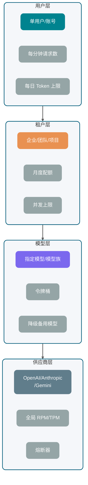
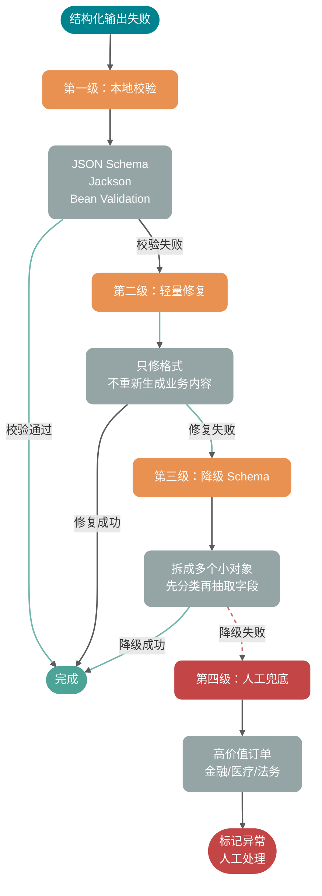

Phiên bản đầu tiên của nhiều ứng dụng AI thường rất "suôn sẻ": kết nối thông một API mô hình lớn ở local, trang web có thể thấy câu trả lời, Demo coi như chạy được.

Nhưng một khi lên production, rắc rối lập tức trở nên cụ thể:

- Người dùng chờ 8 giây vẫn không thấy ký tự đầu tiên, tưởng hệ thống treo, thẳng tay refresh trang.
- Model trả về nửa chừng JSON, frontend parse thất bại, log backend chỉ có một chuỗi `{"answer": "根因是` không đầy đủ.
- Nhà cung cấp thỉnh thoảng trả về 429, service của bạn bắt đầu retry điên cuồng, càng retry càng bị rate limit.
- Người dùng nhấn hủy, trình duyệt ngắt kết nối, nhưng backend vẫn đang tiêu thụ Token.
- Cùng một yêu cầu nghiệp vụ do retry đã thực thi hai lần, ghi database, trừ phí, gửi thông báo đều bị lặp.

Tôi đã thấy quá nhiều sự cố như vậy. Điều thực sự khó không phải là "làm thế nào để gửi một HTTP request cho model", khó khăn nằm ở **làm thế nào để quản lý API mô hình lớn như một dependency bên ngoài không ổn định, đắt tiền, bị ràng buộc bởi quota**.

Bài viết này bao gồm:

1. **Chuỗi đầy đủ**: Một AI request từ đầu vào nghiệp vụ, lắp ráp Prompt, model gateway, API nhà cung cấp đến streaming response, parse, ghi database, quan sát vận hành như thế nào.
2. **Streaming output**: Tại sao Streaming có thể giảm TTFT, SSE, WebSocket, HTTP chunked phù hợp với tình huống nào, backend xử lý hủy, timeout, ngắt stream và kết nối lại như thế nào.
3. **Retry và idempotency**: Lỗi nào có thể retry, lỗi nào không, exponential backoff, jitter, idempotency key, dedup yêu cầu và xử lý response trùng lặp thiết kế như thế nào.
4. **Rate limit và quota**: Rate limit cấp người dùng, cấp tenant, cấp model, cấp nhà cung cấp phân tầng như thế nào, ngân sách Token, xử lý 429, xếp hàng, degradation và circuit breaker triển khai như thế nào.
5. **Trả về có cấu trúc**: Giá trị kỹ thuật của JSON Mode, JSON Schema, Structured Outputs và Function Calling, cùng với chiến lược fallback khi thất bại.

Bài viết mặc định bạn hiểu các khái niệm cơ bản như Token, cửa sổ context, Temperature, Top-p. Nếu vẫn còn thắc mắc, nên đọc trước [《万字拆解 LLM 运行机制》](./llm-operation-mechanism.md) và [《大模型提示词工程实践指南》](../agent/prompt-engineering.md).

Lưu ý: Khả năng và tham số của OpenAI, Anthropic, Gemini và các nhà cung cấp khác thay đổi nhanh, hệ thống production nên quản lý động từ console, response header hoặc configuration center, thay vì phụ thuộc vào các con số tĩnh trong tài liệu.

## Một lần gọi LLM production bao gồm những giai đoạn nào?

Nhiều người khi debug vấn đề gọi mô hình lớn chỉ nhìn vào nhà cung cấp trả về gì. Góc nhìn này quá hẹp.

Một lần gọi LLM production, về bản chất là một chuỗi xuyên qua hệ thống nghiệp vụ, hệ thống context, model gateway, nhà cung cấp bên ngoài và tầng hiển thị frontend. Bất kỳ đoạn nào không được quản lý tốt, cuối cùng đều sẽ biểu hiện thành "model không ổn định".


Tách ra xem, một request thường bao gồm 8 giai đoạn:

1. **Yêu cầu nghiệp vụ đến**: Xác minh danh tính người dùng, tenant, gói dịch vụ, quyền tính năng, kích thước yêu cầu.
2. **Lắp ráp context**: Ghép System Prompt, đầu vào người dùng, lịch sử tin nhắn, bằng chứng RAG, Tool Schema, ràng buộc định dạng đầu ra.
3. **Ước tính ngân sách Token**: Ước tính Token đầu vào, dự trữ Token đầu ra, quyết định có nên cắt bớt lịch sử, nén context hay chuyển sang model nhỏ hơn không.
4. **Định tuyến model gateway**: Chọn model, nhà cung cấp, vùng, tham số timeout, chiến lược retry, bucket rate limit.
5. **Gọi API nhà cung cấp**: Trả về đồng bộ hoặc trả về theo stream, có thể qua SSE, WebSocket hoặc HTTP response body thông thường.
6. **Parse response**: Xử lý delta, finish reason, tool call, usage, từ chối, JSON có cấu trúc, gián đoạn bất thường.
7. **Ghi trạng thái**: Lưu câu trả lời đầy đủ, đoạn incremental, lượng Token, chi phí gọi, nguyên nhân thất bại và trạng thái nghiệp vụ.
8. **Quan sát và cảnh báo**: Ghi lại traceId, providerRequestId, TTFT, tổng thời gian, số lần retry, số lần 429, tỷ lệ thất bại parse.

Điều mà nhiều đội thường mắc nhất: **coi model gateway như transparent proxy**. Nó không phải là proxy, nó là mặt phẳng kiểm soát tính ổn định của ứng dụng AI.

Nếu không có gateway, mỗi hệ thống nghiệp vụ sẽ tự xử lý API Key, timeout, retry, rate limit, log, chuyển đổi nhà cung cấp. Ngắn hạn thấy tiết kiệm, dài hạn chắc chắn trở thành bộ khuếch đại sự cố. Khuyến nghị: dù phiên bản đầu tiên có nhẹ đến đâu, cũng phải thu tất cả lệnh gọi model về một `LLMGateway` thống nhất.

## Trả về đồng bộ và trả về theo stream có gì khác nhau?

Lệnh gọi đồng bộ mặc định rất dễ hiểu: backend gửi yêu cầu, sau khi model tạo ra toàn bộ nội dung, trả về kết quả đầy đủ một lần.

Streaming output là vừa tạo vừa trả về. Mỗi khi model tạo ra một đoạn văn bản hoặc một event, nhà cung cấp sẽ đẩy phần incremental đến caller qua kết nối dài. Tài liệu chính thức của OpenAI mô tả HTTP streaming trong tình huống SSE; Anthropic Messages API cũng hỗ trợ trả về event incremental qua SSE; Gemini API cũng cung cấp interface liên quan đến chuẩn, streaming và real-time. Các trường và khả năng model cụ thể sẽ thay đổi, **tham chiếu tài liệu chính thức mới nhất làm chuẩn**.

**Tại sao Streaming có thể giảm TTFT?**

TTFT (Time To First Token) là thời gian từ khi gửi yêu cầu đến khi nhận được Token đầu tiên có thể hiển thị.

Khi trả về đồng bộ, người dùng phải đợi model tạo ra câu trả lời đầy đủ. Ví dụ model cần tạo 800 Token, backend phải đợi cả 800 Token này hoàn thành mới trả về kết quả.

Khi trả về theo stream, người dùng chỉ cần đợi model bắt đầu tạo đoạn đầu tiên, là có thể thấy nội dung xuất hiện dần dần.

Streaming output không phải là phép màu về hiệu suất. Nó không làm model tính toán ít Token hơn, cũng không tự nhiên tiết kiệm tiền. Nó chỉ chia quá trình chờ đợi thành tiến trình có thể cảm nhận, khiến người dùng cảm thấy hệ thống "còn sống".

| So sánh                   | Trả về đồng bộ                                         | Trả về theo stream                                                  |
| ------------------------- | ------------------------------------------------------ | ------------------------------------------------------------------- |
| Độ trễ ký tự đầu tiên     | Cao, cần đợi kết quả đầy đủ                            | Thấp, nhận đoạn đầu tiên là có thể hiển thị                         |
| Tổng thời gian end-to-end | Phụ thuộc thời gian tạo đầy đủ                         | Thường vẫn phụ thuộc thời gian tạo đầy đủ                           |
| Trải nghiệm frontend      | Giống submit form rồi đợi kết quả                      | Giống app chat xuất hiện từng ký tự                                 |
| Triển khai backend        | Đơn giản, nhận chuỗi đầy đủ rồi xử lý                  | Phức tạp, cần xử lý event incremental, hủy, ngắt stream             |
| Parse có cấu trúc         | Đơn giản, parse JSON đầy đủ một lần                    | Cần cache nội dung đầy đủ, hoặc dùng incremental parser             |
| Tình huống phù hợp        | Văn bản ngắn, tác vụ background, giao dịch nghiêm ngặt | Chat, viết lách, tạo báo cáo, câu trả lời dài                       |
| Không phù hợp             | Câu trả lời dài có tương tác mạnh với người dùng       | Giao dịch mạnh, chuỗi bắt buộc phải xác minh kết quả đầy đủ một lần |

Kinh nghiệm của tôi: văn bản dài hướng đến hiển thị cho người dùng mặc định dùng streaming, xử lý batch background và tác vụ có cấu trúc mạnh mặc định dùng đồng bộ.

## ⭐️ Cách chọn giữa ba giao thức streaming SSE, WebSocket và HTTP chunked

Streaming output có một số phương thức mang phổ biến, đừng nhầm chúng thành một thứ.

| Phương thức  | Đặc điểm cốt lõi                                                                                    | Tình huống phù hợp                                                            | Giới hạn                                                                                               |
| ------------ | --------------------------------------------------------------------------------------------------- | ----------------------------------------------------------------------------- | ------------------------------------------------------------------------------------------------------ |
| SSE          | `EventSource` native trình duyệt, server-to-client đơn hướng push, định dạng là `text/event-stream` | Chat văn bản, incremental output model, thông báo trạng thái                  | Giao tiếp một chiều; kiểm soát hai chiều phức tạp cần HTTP request bổ sung                             |
| WebSocket    | Kết nối dài hai chiều, cả client và server đều có thể gửi tin nhắn bất cứ lúc nào                   | Giọng nói real-time, cộng tác nhiều người, cần hủy hoặc ngắt lời thường xuyên | Quản lý kết nối phức tạp hơn, gateway, xác thực, heartbeat đều phải tự quản lý                         |
| HTTP chunked | Cơ chế truyền dữ liệu theo khối của HTTP/1.1, response body gửi theo từng khối                      | Streaming proxy backend-to-backend, truyền tải cấp thấp                       | Đây là cơ chế truyền tải, không phải giao thức event ứng dụng; HTTP/2 trở đi có cơ chế streaming riêng |

Ưu điểm của SSE là đơn giản. Phía trình duyệt vài dòng code là có thể nhận event, phía server viết ra từng đoạn theo `data:` là được. MDN mô tả EventSource cũng nhấn mạnh sự khác biệt của nó với WebSocket: SSE là luồng dữ liệu một chiều từ server đến client.

WebSocket phù hợp cho tương tác real-time, phức tạp hơn. Ví dụ trong voice Agent, client phải liên tục upload audio, server phải liên tục trả về trạng thái ASR, LLM, TTS, còn phải hỗ trợ người dùng ngắt lời giữa chừng. Tình huống này dùng WebSocket tự nhiên hơn.

HTTP chunked ở cấp thấp hơn. Nhiều framework server-side trong trường hợp không có `Content-Length` sẽ dùng chunked response, nó có thể thực hiện "vừa ghi vừa gửi", nhưng không giúp bạn định nghĩa loại event, ngữ nghĩa kết nối lại, biên giới tin nhắn. Tầng nghiệp vụ vẫn phải tự thiết kế giao thức.

### Biên giới event của giao thức SSE

SSE ở tầng truyền tải vẫn là HTTP, nhưng **tầng ứng dụng là một giao thức văn bản thuần UTF-8**. Mỗi event bao gồm một số dòng trường, giữa các event phải kết thúc bằng **dòng trống**, tức là hai ký tự newline liên tiếp `\n\n`.

Các trường thường dùng như sau:

| Trường  | Tác dụng                                                                                  |
| ------- | ----------------------------------------------------------------------------------------- |
| `data`  | Payload nghiệp vụ; cho phép nhiều dòng `data:`, client sẽ ghép theo chuẩn                 |
| `event` | Tên event tùy chỉnh; loại event mặc định của trình duyệt là `message`                     |
| `id`    | Số thứ tự event; kết hợp ngữ nghĩa kết nối lại của trình duyệt có thể làm gợi ý điểm dừng |
| `retry` | Khoảng thời gian kết nối lại được đề xuất (millisecond)                                   |

**`\n\n` là ký tự phân tách event**. Chỉ cần trong "chuỗi lẽ ra thuộc cùng một đoạn incremental model" xuất hiện "newline trần", rất có thể bị client parse thành "event trước đã kết thúc, event tiếp theo bắt đầu". Đây là nguyên nhân gốc rễ khiến nhiều đội không có vấn đề trong Demo, nhưng một khi thêm Markdown hoặc danh sách vào giao diện hội thoại là bị phá vỡ.

Tôi đã dùng SSE trong knowledge base Q&A của [《SpringAI 智能面试平台+RAG 知识库》](https://javaguide.cn/zhuanlan/interview-guide.html): model vừa tạo, trình duyệt vừa hiển thị theo kiểu typewriter; chuỗi không dài, nhưng chi tiết giao thức không bỏ qua cái nào.

### Cách viết SSE trong Spring Boot + Spring AI

Cách phổ biến ở phía Java là **`Content-Type: text/event-stream`**, rồi dùng reactive stream để đẩy ra ngoài. Spring cung cấp `ServerSentEvent<T>`, tránh viết tay chuỗi `data:` và `\n\n` bị lỗi:

```java
@GetMapping(value = "/chat/stream", produces = MediaType.TEXT_EVENT_STREAM_VALUE)
public Flux<ServerSentEvent<String>> stream() {
    return Flux.interval(Duration.ofMillis(500))
        .map(seq -> ServerSentEvent.<String>builder()
            .id(Long.toString(seq))
            .event("token")
            .data("片段-" + seq)
            .retry(Duration.ofSeconds(3))
            .build());
}
```

Khi kết nối với mô hình lớn, nguồn incremental thường là interface streaming được SDK hoặc framework expose ra. Lấy Spring AI làm ví dụ, sau khi bật streaming ở phía `ChatClient` nhận được `Flux<String>`, rồi map thành SSE đẩy lên frontend:

```java
Flux<String> tokens = chatClient.prompt()
    .system(systemPrompt)
    .user(userPrompt)
    .stream()
    .content();
```

Về mặt kỹ thuật cần nắm rõ: WebMVC + `Flux` chỉ là dùng kiểu reactive ở đầu ra Controller để làm SSE, bên dưới vẫn là Servlet container. Thread pool, số kết nối và timeout vẫn phải quản lý theo "long request"; Java 21 virtual thread có thể giảm chi phí "chiếm một platform thread ngồi đợi", điều này rất hữu ích cho chuỗi tạo sinh có thể kéo dài hàng chục giây.

### SSE bị ngắt do newline trong nội dung model

Giả sử bạn nhét trực tiếp một token hoặc đoạn nào đó vào `data:`, mà đoạn đó chứa ký tự newline thực sự `\n`. Trong mắt giao thức đây là "kết thúc trường / trường mới bắt đầu", biên giới event phía frontend lập tức bị lệch.

Bài học xương máu: đừng kỳ vọng "model ít khi xuất ra newline" - danh sách, code block, câu xin lỗi xuất hiện là sẽ xảy ra trên production.

Một cách thực dụng là thỏa thuận escape ở tầng ứng dụng, ví dụ trước khi gửi đi chuyển `\n`, `\r` thành literal `\\n`, `\\r`, frontend sau khi nhận thì restore lại:

```java
.map(chunk -> ServerSentEvent.<String>builder()
    .data(chunk.replace("\n", "\\n").replace("\r", "\\r"))
    .build())
```

```typescript
const text = chunk.replace(/\\n/g, "\n").replace(/\\r/g, "\r");
```

Cách "protocol native" hơn cũng có thể làm: chia một dòng nội dung thành nhiều dòng `data:`, để client ghép lại theo chuẩn `\n` trong một dòng. Cốt lõi chọn lựa là: team phải cố định cùng một ngữ nghĩa ở server side và frontend, và phủ sóng unit test đến các đoạn "có newline, có CR, có dòng trống".

### Cấu hình streaming của Nginx và gateway

Chỉ cần phía trước có Nginx hoặc gateway loại response buffering, `text/event-stream` có thể bị gom đủ một khối rồi mới phân phát, TTFT cảm nhận ở phía người dùng lập tức quay về interface đồng bộ.

Thay đổi tối thiểu thường là:

```nginx
location /api/ {
    proxy_pass http://backend;
    proxy_buffering off;
    proxy_cache off;
    proxy_read_timeout 300s;
    proxy_set_header Connection "";
    add_header Cache-Control no-cache;
}
```

Kết hợp với `proxy_read_timeout` (hoặc cấu hình tương đương) để bảo vệ "long generation", nếu không chuỗi sẽ bị middleware ngắt tại điểm timeout im lặng.

### Bốn loại tình huống exception streaming

Những nơi dễ xảy ra vấn đề nhất trong chuỗi streaming, thường không phải là "cách bắt đầu", mà là "cách kết thúc".

**Loại một: Người dùng hủy.**

Người dùng đóng trang, nhấn dừng tạo sinh, chuyển conversation, đều nên kích hoạt hủy. Backend cần đồng thời hủy:

- Request đến API nhà cung cấp.
- Stream response đang được parse.
- Các tác vụ TTS, tool call, ghi database tiếp theo.
- Cache incremental chưa được commit.

Bài học xương máu: đừng chỉ dừng hiển thị ở frontend. Frontend dừng rồi, backend vẫn đang tạo sinh, hóa đơn vẫn chạy.

**Loại hai: Timeout.**

Timeout ít nhất chia ba tầng:

- Connection timeout: Không kết nối được nhà cung cấp.
- TTFT timeout: Đã kết nối, nhưng mãi không có event đầu tiên.
- Total duration timeout: Vẫn có output, nhưng vượt quá thời gian nghiệp vụ có thể chấp nhận.

Ba cái phải ghi riêng. TTFT timeout thường chỉ đến model xếp hàng, context quá dài hoặc nhà cung cấp bị jitter; total duration timeout có thể chỉ là người dùng để model viết quá dài.

**Loại ba: Stream bị ngắt.**

Khi stream bị ngắt, đừng vội coi nội dung nửa chừng là thành công. Cách đúng là ghi lại `finish_reason` hoặc trạng thái event cuối cùng, nếu không có dấu kết thúc bình thường, thì đánh dấu lần gọi này là `INTERRUPTED`, frontend hiển thị "đã bị ngắt, có thể tạo lại", thay vì âm thầm lưu thành câu trả lời đầy đủ.

**Loại bốn: Kết nối lại.**

`EventSource` của SSE có khả năng kết nối lại tự động, nhưng output mô hình lớn không phải bản tin tức thông thường. Sau khi kết nối lại có thể tiếp tục từ điểm dừng hay không, phụ thuộc vào server của bạn có lưu số thứ tự event, đoạn incremental và trạng thái gọi nhà cung cấp không. Trong hầu hết trường hợp, stream phía nhà cung cấp đã bị ngắt, không thể thực sự tiếp tục từ cấp Token.

Cách ổn hơn là:

- Server tạo `messageId` và `sequence` tăng dần cho mỗi streaming response.
- Các đoạn đã gửi ghi vào short-term cache.
- Khi frontend kết nối lại, trước tiên bổ sung phát lại các đoạn đã cache.
- Nếu stream nhà cung cấp đã kết thúc hoặc không hợp lệ, nhắc người dùng tạo lại, thay vì giả vờ tiếp tục liền mạch.

## Lỗi nào có thể retry, lỗi nào không?

Retry là khả năng backend engineer quen thuộc nhất nhưng cũng dễ lạm dụng nhất.

Retry API mô hình lớn có hai điểm đặc biệt:

1. **Request đắt tiền**: Request thất bại cũng có thể tiêu thụ quota, thậm chí đã tiêu thụ một phần Token.
2. **Output không xác định**: Dù Prompt giống nhau, lần trả về thứ hai cũng có thể khác lần đầu.

### Bảng đối chiếu loại lỗi

| Loại                 | Ví dụ                                                    | Có nên retry không       | Cách xử lý                                                                            |
| -------------------- | -------------------------------------------------------- | ------------------------ | ------------------------------------------------------------------------------------- |
| Network timeout      | Reset kết nối, DNS jitter, read timeout                  | Được                     | Exponential backoff + jitter, giới hạn số lần tối đa                                  |
| Provider 5xx         | 500, 502, 503, 504                                       | Được                     | Retry ngắn, vượt ngưỡng chuyển model hoặc degradation                                 |
| Provider quá tải     | Anthropic 529, lỗi overloaded tương tự                   | Được                     | Retry chậm, khi cần thiết circuit break nhà cung cấp đó                               |
| 429 rate limit       | RPM, TPM, RPD, vượt giới hạn concurrent                  | Thận trọng               | Ưu tiên xem `Retry-After` và rate limit header, xếp hàng hoặc degradation             |
| Stream bị ngắt       | Không nhận được event kết thúc bình thường               | Tùy tình huống           | Tác vụ người dùng thấy không tự động retry, tác vụ background có thể retry idempotent |
| 400 tham số sai      | Schema không hợp lệ, thiếu trường, vượt giới hạn context | Không nên                | Sửa request, đừng retry cùng payload                                                  |
| 401/403 lỗi xác thực | API Key không hợp lệ, không đủ quyền                     | Không nên                | Cảnh báo và vô hiệu hóa Key tương ứng                                                 |
| Từ chối an toàn      | Từ chối chính sách nội dung                              | Không nên                | Vào quy trình từ chối nghiệp vụ                                                       |
| Parse thất bại       | JSON không đầy đủ, kiểu trường sai                       | Có thể retry có giới hạn | Kèm nguyên nhân thất bại để sửa lần hai, tối đa 1-2 lần                               |

Tài liệu rate limit chính thức của OpenAI khuyến nghị dùng random exponential backoff cho rate limit error, đồng thời nhắc nhở request thất bại cũng tính vào giới hạn mỗi phút; tài liệu lỗi chính thức của Anthropic liệt kê rõ các loại lỗi như 429 rate limit, 500 api error, 504 timeout, 529 overloaded. Kết luận ở đây không phải dành riêng cho một nhà cung cấp nào, mà là tư duy quản trị chung cho dependency model bên ngoài.

### Exponential backoff và jitter

Cốt lõi của exponential backoff là: lần thất bại thứ 1 đợi một chút, lần thất bại thứ 2 đợi lâu hơn, lần thứ 3 lại lâu hơn nữa, cho đến khi đạt thời gian chờ tối đa hoặc số lần retry tối đa.

Cốt lõi của Jitter là: đừng để tất cả request retry cùng một lúc. Nếu không hệ thống vừa phục hồi từ rate limit, lập tức lại bị batch retry cùng lúc đó đánh sập.

Một công thức thực dụng:

```text
sleep = min(maxDelay, baseDelay * 2^retryCount) + random(0, jitter)
```

Trong production đừng quên thêm hai ràng buộc cứng:

- **Số lần retry tối đa**: Thường 2-3 lần là đủ, đừng retry vô tận.
- **Thời hạn tổng thể**: Request người dùng có SLA tổng thể, ví dụ 15 giây, đến thời điểm là thất bại, đừng vì retry kéo thành 1 phút.

### Idempotency Key và cơ chế dedup

Chỉ cần có retry, bắt buộc phải thảo luận về idempotency.

Idempotency Key có thể được tạo bởi nghiệp vụ, ví dụ:

```text
tenantId:userId:conversationId:messageId:attemptGroup
```

Sau khi server nhận request, trước tiên kiểm tra Key này đã tồn tại chưa:

- Nếu đã thành công, trả về kết quả lịch sử trực tiếp.
- Nếu đang được tạo, trả về địa chỉ subscribe của cùng streaming task.
- Nếu thất bại và cho phép retry, tạo attempt mới, nhưng vẫn gắn vào cùng tin nhắn nghiệp vụ.
- Nếu thất bại nhưng không thể retry, trả về nguyên nhân thất bại trực tiếp.

Điều này tránh được hai bẫy:

1. Người dùng nhấn liên tục "gửi lại", backend tạo nhiều lần gọi model.
2. Sau khi gateway timeout tự động retry, lần đầu thực ra đã ghi vào database rồi, lần hai lại ghi thêm một bản ghi trùng lặp.

### Xử lý response trùng lặp

Response sau khi retry có thể bị trùng lặp, xung đột hoặc chồng lấp một phần.

Đối với ứng dụng chat, nên phân biệt nhiều lần gọi model trong một tin nhắn người dùng thành:

- `message_id`: ID tin nhắn nghiệp vụ, người dùng nhìn thấy.
- `attempt_id`: ID lần thử gọi model, hệ thống nhìn thấy.
- `provider_request_id`: ID request nhà cung cấp, dùng để debug.
- `stream_sequence`: Số thứ tự đoạn incremental, dùng để dedup và bổ sung phát lại.

Khi ghi vào database, chỉ cho phép một attempt trở thành `final`. Các attempt khác giữ lại làm hồ sơ chẩn đoán, không tham gia vào context người dùng. Như vậy vừa có thể debug vấn đề, lại không làm ô nhiễm Prompt vòng tiếp theo.

## ⭐️ Tại sao cần rate limit? Cách rate limit như thế nào?

Nhận thức về rate limit của nhiều đội, bắt đầu từ khi nhận được 429 đầu tiên.

Lúc đó đã muộn rồi. Đợi nhà cung cấp chặn bạn, có nghĩa là hệ thống của bạn hoàn toàn không có quản lý capacity. 429 của nhà cung cấp là bức tường cuối cùng - nếu bạn dùng nó làm công cụ lên kế hoạch capacity, sớm muộn sẽ bị tát liên tiếp vào lúc đỉnh lưu lượng.

### Kiến trúc bốn tầng của rate limit

| Tầng             | Đối tượng giới hạn               | Mục đích cốt lõi                              | Chiến lược phổ biến                                            |
| ---------------- | -------------------------------- | --------------------------------------------- | -------------------------------------------------------------- |
| Cấp người dùng   | Người dùng hoặc tài khoản đơn lẻ | Ngăn lạm dụng, thao tác nhầm, script scraping | Số request mỗi phút, giới hạn Token hàng ngày                  |
| Cấp tenant       | Doanh nghiệp, team, dự án        | Kiểm soát chi phí gói dịch vụ và công bằng    | Quota hàng tháng, giới hạn concurrent, priority queue          |
| Cấp model        | Một model hoặc họ model cụ thể   | Tránh model hot bị đánh đầy                   | Token bucket theo chiều model, degradation sang model dự phòng |
| Cấp nhà cung cấp | OpenAI, Anthropic, Gemini, v.v.  | Bảo vệ dependency bên ngoài và API Key        | Global RPM, TPM, concurrent, circuit breaker                   |



Tài liệu rate limit chính thức của Gemini chia chiều rate limit thành RPM, input TPM, RPD, và giải thích giới hạn được áp dụng theo dự án chứ không phải theo API Key đơn lẻ; tài liệu chính thức của OpenAI cũng hiển thị rate limit header về số request, số Token, quota còn lại. Giá trị cụ thể và quan hệ model thay đổi rất nhanh, hệ thống production đừng hardcode các con số tĩnh trong tài liệu, phải quản lý động từ console, response header hoặc configuration center.

### Tại sao ngân sách Token quan trọng hơn số request

Rate limit API truyền thống thường theo QPS. Chỉ theo QPS là không đủ cho API mô hình lớn.

Chi phí của hai request có thể chênh lệch rất nhiều:

- Request A: Input 500 Token, output 100 Token.
- Request B: Input 80K Token, output 8K Token.

Cả hai đều là 1 request, nhưng áp lực lên model inference, quota nhà cung cấp và hóa đơn hoàn toàn không phải cùng một mức độ.

Vì vậy rate limit ít nhất phải xem đồng thời:

- **RPM**: Số request mỗi phút.
- **TPM**: Số Token mỗi phút.
- **Concurrent**: Số request đang được tạo sinh.
- **Kích thước context**: Input Token của một request đơn.
- **Max output**: `max_tokens` hoặc tham số tương tự.
- **Ngân sách ngày/tháng**: Tổng chi phí tenant hoặc người dùng.

Khuyến nghị: **Trừ ngân sách trước, rồi mới gửi request**.

Sau khi request vào gateway, trước tiên ước tính `input_tokens + reserved_output_tokens`, thử trừ trong các bucket người dùng, tenant, model, nhà cung cấp. Trừ không được thì đừng gửi cho nhà cung cấp, xếp hàng trực tiếp, degradation hoặc từ chối.

### So sánh các chiến lược rate limit phổ biến

| Chiến lược           | Tình huống phù hợp                            | Ưu điểm                                                 | Nhược điểm                                    |
| -------------------- | --------------------------------------------- | ------------------------------------------------------- | --------------------------------------------- |
| Fixed window         | Tác vụ background đơn giản, interface quản lý | Triển khai đơn giản, dễ thống kê                        | Biên cửa sổ dễ spike                          |
| Sliding window       | Giới hạn request cấp người dùng               | Biên mượt hơn                                           | Chi phí triển khai và lưu trữ cao hơn         |
| Token bucket         | Gọi model, ngân sách Token                    | Hỗ trợ một mức burst nhất định, hay dùng trong kỹ thuật | Tham số cần điều chỉnh                        |
| Leaky bucket         | Làm mượt lưu lượng ra nghiêm ngặt             | Output ổn định, phù hợp bảo vệ nhà cung cấp             | Trải nghiệm burst kém                         |
| Concurrent semaphore | Tạo sinh streaming, tác vụ dài                | Có thể giới hạn đồng thời chiếm kết nối                 | Không kiểm soát chi phí Token của request đơn |
| Priority queue       | Multi-tenant, multi-tier                      | Có thể bảo vệ request ưu tiên cao                       | Cần xử lý starvation và timeout               |

Trong production thường không phải chọn một, mà là kết hợp:

- Cấp người dùng: Sliding window + giới hạn Token ngày.
- Cấp tenant: Token bucket + ngân sách tháng
- Cấp model: Token bucket + concurrent semaphore
- Cấp nhà cung cấp: Global token bucket + circuit breaker
- Request streaming: Concurrent semaphore + giới hạn total duration

Để biết giới thiệu chi tiết về thuật toán rate limit, có thể tham khảo bài viết này: [服务限流详解](https://javaguide.cn/high-availability/limit-request.html).

### Nhận được 429 thì xử lý như thế nào

HTTP 429 có nghĩa là quá nhiều request. Khi backend xử lý 429, nên theo thứ tự này:

1. **Đọc `Retry-After` hoặc rate limit header của nhà cung cấp**: Có thời gian phục hồi rõ ràng thì tôn trọng nó.
2. **Đánh dấu chiều rate limit**: Có phải request count bị đầy, hay Token bị đầy, hay quota ngày bị cạn.
3. **Request ngắn có thể xếp hàng**: Ví dụ tác vụ tóm tắt background có thể vào delay queue.
4. **Request tương tác người dùng ít retry**: Khi người dùng không thể đợi, nhắc thử lại sau hoặc chuyển sang model nhẹ hơn trực tiếp.
5. **Nhà cung cấp liên tục 429 thì circuit break**: Đừng để tất cả request tiếp tục đâm vào tường.

Một chuỗi degradation điển hình:

```text
优先模型可用 -> 正常调用
优先模型 429 -> 切备用同级模型
备用模型也限流 -> 切轻量模型并缩短输出
仍不可用 -> 排队或返回"当前请求繁忙"
```

Cần tránh một hiểu nhầm ở đây: degradation không phải là âm thầm trở nên tệ hơn. Nếu model nhẹ hơn sẽ ảnh hưởng chất lượng câu trả lời, cần đánh dấu rõ ràng ở tầng nghiệp vụ, ví dụ "hiện đang ở chế độ nhanh, vấn đề phức tạp đề nghị thử lại sau".

## Tại sao cần trả về có cấu trúc?

Nhiều nghiệp vụ ban đầu viết Prompt như thế này:

```text
请分析用户问题，输出 JSON，字段包括 intent、confidence、answer。
```

Rồi backend `JSON.parse()` trực tiếp.

Điều này rất phổ biến trong giai đoạn Demo, nhưng trong môi trường production sẽ gặp các edge case:

- Model thêm một câu "好的，以下是结果" trước JSON.
- Thiếu trường.
- Viết lung tung giá trị enum.
- Số trả về thành string.
- Khi trả về theo stream chỉ nhận được nửa object.
- Khi từ chối an toàn hoàn toàn không phải business Schema.

Vì vậy cốt lõi của trả về có cấu trúc không chỉ là "trông giống JSON", quan trọng hơn là **để đầu ra của model có thể được chương trình tiêu thụ ổn định**.

### Sự khác nhau giữa JSON Mode, JSON Schema và Structured Output

| Phương thức                   | Độ ràng buộc     | Giá trị kỹ thuật                                         | Rủi ro                                                                   |
| ----------------------------- | ---------------- | -------------------------------------------------------- | ------------------------------------------------------------------------ |
| Natural language thông thường | Gần như không có | Phù hợp câu trả lời hiển thị                             | Không phù hợp program parse                                              |
| Prompt yêu cầu JSON           | Yếu              | Đơn giản, cross-model                                    | Dễ lẫn văn bản giải thích hoặc thiếu trường                              |
| JSON Mode                     | Trung bình       | Thường có thể đảm bảo cú pháp là JSON                    | Không nhất thiết phù hợp business field Schema                           |
| JSON Schema                   | Mạnh             | Trường, kiểu, bắt buộc, enum rõ ràng                     | Các nhà cung cấp khác nhau hỗ trợ subset khác nhau                       |
| Structured Outputs            | Mạnh hơn         | Nhà cung cấp tăng cường ràng buộc ở tầng decode hoặc SDK | Bị giới hạn bởi model, SDK, subset Schema                                |
| Function Calling / Tool Use   | Hướng hành động  | Phù hợp để model chọn tool và tham số                    | Không phải thay thế vạn năng cho câu trả lời ngôn ngữ tự nhiên cuối cùng |

Tài liệu chính thức Structured Outputs của OpenAI nhấn mạnh có thể để output tuân theo JSON Schema do developer cung cấp, và cung cấp cấu hình liên quan `strict`; tài liệu chính thức Gemini giải thích structured output sử dụng `response_format` và JSON Schema, và hỗ trợ là subset của JSON Schema; tài liệu chính thức Anthropic cũng cung cấp Structured Outputs và Strict tool use, hai cái giải quyết không hoàn toàn giống vấn đề. Model, trường, subset Schema cụ thể thay đổi nhanh, vẫn phải tham chiếu tài liệu chính thức mới nhất làm chuẩn.

### Sự khác biệt kỹ thuật giữa JSON thông thường và structured output

Trả về ngôn ngữ tự nhiên thông thường giống "người viết cho người xem", trả về có cấu trúc giống "service viết interface cho service".

Lấy tình huống nhận diện intent làm ví dụ:

```json
{
  "intent": "refund_request",
  "confidence": 0.86,
  "entities": {
    "order_id": "202605080001",
    "reason": "商品破损"
  },
  "need_human_review": false
}
```

Với Schema, backend có thể làm những việc này:

- `intent` chỉ có thể là enum có giới hạn.
- `confidence` bắt buộc là số.
- `order_id` có thể null, nhưng kiểu dữ liệu phải ổn định.
- `need_human_review` bắt buộc tồn tại.
- Khi parse thất bại có thể vào quy trình sửa hoặc fallback thủ công.

Đây là giá trị của trả về có cấu trúc: **biến "model generation" thành "data contract có thể xác minh"**.

### Fallback như thế nào khi structured output thất bại

Structured output vẫn có thể thất bại. Thất bại không nhất thiết là vấn đề khả năng nhà cung cấp, cũng có thể là Schema quá phức tạp, xung đột context, output bị cắt, chính sách an toàn từ chối.

Nên chia fallback thành bốn cấp:

1. **Local validation**: Dùng JSON Schema, Jackson, Bean Validation để xác minh trường và kiểu dữ liệu.
2. **Sửa nhẹ**: Chỉ để model sửa định dạng, không tạo lại nội dung nghiệp vụ.
3. **Degradation Schema**: Object phức tạp chia thành nhiều object nhỏ, hoặc phân loại trước rồi trích xuất trường.
4. **Fallback thủ công hoặc quy tắc**: Đơn hàng giá trị cao, tài chính, y tế, pháp lý không nên hoàn toàn phụ thuộc tự động sửa.



Một nguyên tắc thực dụng: khi trả về có cấu trúc thất bại, đừng nhét ngôn ngữ tự nhiên gốc vào hệ thống downstream. Có thể hiển thị cho người dùng, không có nghĩa là program có thể thực thi.

## Java backend triển khai gọi LLM như thế nào?

Dưới đây là pseudo code Java đơn giản hóa, trọng điểm không phải là binding một SDK nào đó, mà là thể hiện cấu trúc kỹ thuật: gateway thống nhất xử lý ngân sách Token, rate limit, retry, parse streaming, idempotency và quan sát.

```java
public interface LLMClient {
    LLMResponse chat(LLMRequest request);

    void stream(LLMRequest request, StreamHandler handler);
}

public interface StreamHandler {
    void onStart(String messageId);

    void onDelta(String messageId, long sequence, String delta);

    void onComplete(String messageId, LLMUsage usage);

    void onError(String messageId, Throwable error);
}

public final class LLMGateway {
    private final LLMClient client;
    private final RateLimiter rateLimiter;
    private final IdempotencyStore idempotencyStore;
    private final TokenEstimator tokenEstimator;
    private final Observation observation;

    public LLMGateway(
            LLMClient client,
            RateLimiter rateLimiter,
            IdempotencyStore idempotencyStore,
            TokenEstimator tokenEstimator,
            Observation observation) {
        this.client = client;
        this.rateLimiter = rateLimiter;
        this.idempotencyStore = idempotencyStore;
        this.tokenEstimator = tokenEstimator;
        this.observation = observation;
    }

    public LLMResponse chatWithRetry(BusinessCommand command) {
        String idemKey = command.idempotencyKey();
        IdempotencyRecord existed = idempotencyStore.find(idemKey);
        if (existed != null && existed.isSuccess()) {
            return existed.toResponse();
        }

        LLMRequest request = buildRequest(command);
        TokenBudget budget = tokenEstimator.estimate(request);
        rateLimiter.acquire(command.tenantId(), request.model(), budget);

        RetryPolicy retryPolicy = RetryPolicy.defaultPolicy();
        Throwable lastError = null;

        for (int attempt = 0; attempt <= retryPolicy.maxRetries(); attempt++) {
            String attemptId = idemKey + ":attempt:" + attempt;
            long startNanos = System.nanoTime();

            try {
                idempotencyStore.markRunning(idemKey, attemptId);
                LLMResponse response = client.chat(request.withAttemptId(attemptId));

                ParsedAnswer parsed = parseAndValidate(response.content(), command.schema());
                idempotencyStore.markSuccess(idemKey, attemptId, response, parsed);
                observation.recordSuccess(request, response.usage(), startNanos, attempt);
                return response;
            } catch (LLMException ex) {
                lastError = ex;
                observation.recordFailure(request, ex, startNanos, attempt);

                if (!retryPolicy.canRetry(ex, attempt)) {
                    idempotencyStore.markFailed(idemKey, attemptId, ex);
                    throw ex;
                }

                sleep(retryPolicy.nextDelay(ex, attempt));
            }
        }

        throw new LLMException("LLM request failed after retries", lastError);
    }

    public void stream(BusinessCommand command, StreamHandler downstream) {
        String idemKey = command.idempotencyKey();
        LLMRequest request = buildRequest(command).enableStream();
        TokenBudget budget = tokenEstimator.estimate(request);
        rateLimiter.acquire(command.tenantId(), request.model(), budget);

        String messageId = command.messageId();
        StreamBuffer buffer = new StreamBuffer(messageId);
        idempotencyStore.markRunning(idemKey, messageId);

        client.stream(request, new StreamHandler() {
            @Override
            public void onStart(String ignored) {
                downstream.onStart(messageId);
            }

            @Override
            public void onDelta(String ignored, long sequence, String delta) {
                if (buffer.seen(sequence)) {
                    return;
                }
                buffer.append(sequence, delta);
                idempotencyStore.appendDelta(messageId, sequence, delta);
                downstream.onDelta(messageId, sequence, delta);
            }

            @Override
            public void onComplete(String ignored, LLMUsage usage) {
                String fullText = buffer.fullText();
                ParsedAnswer parsed = parseAndValidate(fullText, command.schema());
                idempotencyStore.markSuccess(idemKey, messageId, fullText, parsed, usage);
                downstream.onComplete(messageId, usage);
            }

            @Override
            public void onError(String ignored, Throwable error) {
                idempotencyStore.markInterrupted(idemKey, messageId, buffer.fullText(), error);
                downstream.onError(messageId, error);
            }
        });
    }

    private LLMRequest buildRequest(BusinessCommand command) {
        return LLMRequest.builder()
                .model(command.model())
                .systemPrompt(command.systemPrompt())
                .userPrompt(command.userPrompt())
                .context(command.context())
                .responseSchema(command.schema())
                .timeout(command.timeout())
                .metadata("tenantId", command.tenantId())
                .metadata("messageId", command.messageId())
                .build();
    }

    private ParsedAnswer parseAndValidate(String content, JsonSchema schema) {
        try {
            return ParsedAnswer.fromJson(content, schema);
        } catch (Exception ex) {
            throw new NonRetryableLLMException("Structured output validation failed", ex);
        }
    }

    private void sleep(Duration duration) {
        try {
            Thread.sleep(duration.toMillis());
        } catch (InterruptedException ex) {
            Thread.currentThread().interrupt();
            throw new LLMException("Retry sleep interrupted", ex);
        }
    }
}
```

Đoạn code này có một số điểm quan trọng:

- **Đầu vào nghiệp vụ không trực tiếp gọi provider SDK**, thống nhất qua `LLMGateway`.
- **Trước tiên ước tính Token và trừ bucket rate limit**, tránh gửi xong mới phát hiện hết quota.
- **Hồ sơ idempotency bọc toàn bộ tin nhắn nghiệp vụ**, attempt chỉ là retry nội bộ hệ thống.
- **Đồng bộ và streaming xử lý riêng**, streaming phải ghi `sequence`, tránh trùng lặp khi kết nối lại bổ sung phát lại.
- **Parse có cấu trúc làm trước khi ghi database**, thất bại thì vào trạng thái thất bại, không làm ô nhiễm dữ liệu nghiệp vụ.

Trong dự án thực tế còn cần bổ sung:

- Pool API Key và định tuyến nhà cung cấp.
- Ưu tiên model và chiến lược degradation.
- Số phiên bản Prompt.
- Kiểm tra an toàn nội dung response.
- Tính toán chi phí usage.
- Căn chỉnh traceId và providerRequestId.
- Tín hiệu hủy streaming truyền đến request nhà cung cấp.
- Contract SSE outbound: cách xử lý newline và biên giới event phải nhất quán với frontend, gateway đóng buffering và nới lỏng read timeout.

## Không có chỉ số thì không có tính ổn định

Quan sát ứng dụng AI không thể chỉ ghi "gọi thành công/thất bại".

Ít nhất phải ghi các chỉ số này:

| Chỉ số              | Ý nghĩa                          | Mục đích sử dụng                                                   |
| ------------------- | -------------------------------- | ------------------------------------------------------------------ |
| TTFT                | Thời gian trả về Token đầu tiên  | Phán đoán xếp hàng, context quá dài, nhà cung cấp jitter           |
| E2E Latency         | Thời gian hoàn thành end-to-end  | Phán đoán trải nghiệm người dùng và SLA                            |
| Input Tokens        | Token đầu vào                    | Phân tích chi phí, debug context phình to                          |
| Output Tokens       | Token đầu ra                     | Phân tích chi phí, debug câu trả lời bất thường dài                |
| Retry Count         | Số lần retry                     | Nhận dạng nhà cung cấp không ổn định hoặc chiến lược quá hung hăng |
| 429 Rate            | Tỷ lệ rate limit                 | Phán đoán quota và bucket rate limit có hợp lý không               |
| Parse Failure Rate  | Tỷ lệ thất bại parse có cấu trúc | Phán đoán vấn đề Schema, Prompt, model adaption                    |
| Cancel Rate         | Tỷ lệ người dùng hủy             | Phán đoán response quá chậm hoặc generation quá dài                |
| Provider Error Rate | Tỷ lệ lỗi nhà cung cấp           | Cơ sở định tuyến, degradation, circuit breaker                     |

Trong log nên kèm theo các trường này:

```text
trace_id
tenant_id
user_id
conversation_id
message_id
attempt_id
model
provider
prompt_version
input_tokens
output_tokens
ttft_ms
latency_ms
retry_count
finish_reason
error_type
provider_request_id
```

Không có các trường này, debug trên production sẽ rất đau khổ. Người dùng nói "lúc nãy AI không trả về", bạn còn không tra được là nhà cung cấp nào, model nào, attempt nào, có nhận được delta đầu tiên chưa.

## Câu hỏi phỏng vấn

### 1. Chuỗi đầy đủ của gọi API mô hình lớn là gì

Một lần gọi bắt đầu từ yêu cầu nghiệp vụ đến, trước tiên xác minh người dùng, tenant, quyền và tham số; sau đó lắp ráp System Prompt, đầu vào người dùng, lịch sử tin nhắn, bằng chứng RAG, định nghĩa tool và output Schema; tiếp theo ước tính ngân sách Token, qua model gateway để định tuyến, rate limit, timeout, retry và chọn nhà cung cấp; sau khi nhà cung cấp trả về kết quả đồng bộ hoặc streaming event, backend parse incremental, xác minh structured output, ghi trạng thái và usage; cuối cùng ghi TTFT, tổng thời gian, error code, số lần retry, chi phí Token vào hệ thống quan sát.

Điểm cốt lõi là: **LLM call không thể chỉ coi như một HTTP request, nó là chuỗi production cần được quản trị**.

### 2. Tại sao Streaming cải thiện trải nghiệm

Streaming để model vừa tạo vừa trả về, người dùng có thể thấy Token đầu tiên sớm hơn, do đó giảm TTFT. Nó không đảm bảo tổng thời gian tạo sinh ngắn lại, cũng không tự nhiên giảm chi phí Token. Backend cần xử lý thêm hủy, timeout, ngắt stream, kết nối lại, JSON nửa chừng và ghi database incremental.

### 3. Cách chọn giữa SSE và WebSocket

Nếu chỉ là server push văn bản model xuống trình duyệt, SSE đơn giản hơn, tự nhiên phù hợp cho incremental output một chiều; khi triển khai đừng quên **`text/event-stream` nhạy cảm với newline và biên giới event**, và reverse proxy buffering sẽ biến "streaming" thành "batch". Nếu client cũng cần thường xuyên gửi data lên server, ví dụ voice stream, điều khiển real-time, cộng tác nhiều người, ngắt lời, WebSocket phù hợp hơn. HTTP chunked thuộc về cơ chế truyền tải cấp thấp hơn, tầng nghiệp vụ vẫn phải tự định nghĩa biên giới tin nhắn và loại event.

### 4. Lỗi API mô hình lớn nào có thể retry

Network timeout, reset kết nối, một phần 5xx, 504, nhà cung cấp quá tải thường có thể retry có giới hạn; 429 cần kết hợp `Retry-After`, rate limit header, xếp hàng và degradation xử lý; 400 lỗi tham số, 401/403 lỗi xác thực, từ chối an toàn nội dung thường không thể retry. Thất bại parse có cấu trúc có thể làm 1-2 lần sửa định dạng, nhưng đừng retry vô tận.

### 5. Tại sao gọi mô hình lớn bắt buộc phải làm idempotency

Vì retry, người dùng nhấn lặp lại, gateway timeout đều khiến cùng một yêu cầu nghiệp vụ bị thực thi nhiều lần. Không có Idempotency Key, có thể ghi database trùng lặp, trừ phí trùng lặp, gửi thông báo trùng lặp. Cách đúng là dùng ID tin nhắn nghiệp vụ để tạo Idempotency Key, gắn nhiều lần attempt gọi model dưới cùng một tin nhắn nghiệp vụ, chỉ cho phép một attempt trở thành kết quả cuối cùng.

### 6. Tại sao rate limit không thể chỉ theo QPS

Vì chi phí và áp lực của API mô hình lớn chủ yếu do Token quyết định. Một request 500 Token và một request 80K Token đều là 1 request, nhưng mức tiêu thụ tài nguyên chênh lệch hai bậc. Rate limit production phải đồng thời xem RPM, TPM, concurrent, kích thước context, max output và ngân sách tenant.

### 7. JSON Mode và Structured Outputs có gì khác nhau

JSON Mode tập trung hơn vào "output là JSON hợp lệ", nhưng không nhất thiết phù hợp business Schema của bạn. Structured Outputs hoặc JSON Schema ràng buộc mạnh hơn, có thể yêu cầu trường, kiểu dữ liệu, bắt buộc, enum, v.v. Function Calling hoặc Tool Use phù hợp hơn để model tạo ra tham số gọi tool. Các nhà cung cấp khác nhau hỗ trợ Schema subset khác nhau, trước khi triển khai cần xem tài liệu chính thức và viết compatibility layer.

### 8. Cách xử lý streaming structured output

Đừng vừa nhận delta vừa `JSON.parse()` object đầy đủ trực tiếp. Cách ổn hơn là: giai đoạn incremental chỉ hiển thị văn bản hoặc ghi đoạn, đợi nhận event kết thúc bình thường rồi ghép thành nội dung đầy đủ, mới làm Schema validation. Nếu nhà cung cấp hỗ trợ streaming event có cấu trúc hoặc SDK accumulator, có thể dùng accumulator chính thức; nếu không tự duy trì buffer, sequence và trạng thái kết thúc.

## Tổng kết

Tóm tắt một số phán đoán kỹ thuật từ bài viết này:

- **Model gateway là cổng vào tính ổn định**. Định tuyến, rate limit, retry, idempotency, quan sát đều được thu tại đây. Đội không có gateway, mỗi module nghiệp vụ tự xử lý API Key và logic retry, ngắn hạn tiết kiệm, dài hạn chắc chắn xảy ra sự cố.
- **Streaming giảm TTFT, không giảm tổng chi phí**. Nó cải thiện cảm nhận người dùng, nhưng hủy, timeout, ngắt stream, kết nối lại và parse JSON nửa chừng đều là vấn đề mới. SSE còn phải chú ý biên giới event, escape newline và Nginx buffering - tôi đã từng trong dự án do `proxy_buffering` chưa tắt, streaming biến thành batch.
- **Retry bắt buộc phải gắn với idempotency**. Lỗi có thể retry có giới hạn, không thể để retry tạo ra kết quả nghiệp vụ trùng lặp. Người dùng nhấn liên tục "gửi lại", nếu backend không có Idempotency Key chặn, hóa đơn Token và hồ sơ ghi database đều sẽ tăng gấp đôi.
- **Rate limit không thể chỉ theo QPS**. Một request 500 Token và một request 80K Token tạo áp lực lên nhà cung cấp chênh nhau hai bậc, bắt buộc phải đồng thời xem số request, số Token, concurrent và ngân sách.
- **Trả về có cấu trúc là data contract**. JSON Schema, Structured Outputs, Tool Use giải quyết vấn đề "để hệ thống downstream có thể tiêu thụ ổn định output model", không phải "để output trông giống JSON".
- **Không có quan sát thì không có tính ổn định**. TTFT, usage, attempt, providerRequestId, parse failure rate - khi debug trên production thiếu bất kỳ trường nào, sẽ khiến bạn mất nhiều thời gian gấp vài lần để định vị vấn đề.

Gọi API mô hình lớn, về bản chất là kết nối với một hệ thống bên ngoài thông minh nhưng đắt tiền, đôi khi xếp hàng, có thể bị rate limit, output còn cần xác minh. Làm tốt bộ quản trị kỹ thuật này, ứng dụng AI mới thực sự đi từ Demo đến production.

## Tài liệu tham khảo

- [OpenAI Streaming API responses](https://developers.openai.com/api/docs/guides/streaming-responses)
- [OpenAI Structured model outputs](https://developers.openai.com/api/docs/guides/structured-outputs)
- [OpenAI Rate limits](https://developers.openai.com/api/docs/guides/rate-limits)
- [Anthropic Streaming Messages](https://platform.claude.com/docs/en/build-with-claude/streaming)
- [Anthropic Errors](https://platform.claude.com/docs/en/api/errors)
- [Anthropic Structured outputs](https://platform.claude.com/docs/en/build-with-claude/structured-outputs)
- [Gemini Structured outputs](https://ai.google.dev/gemini-api/docs/structured-output)
- [Gemini Rate limits](https://ai.google.dev/gemini-api/docs/rate-limits)
- [MDN Using server-sent events](https://developer.mozilla.org/en-US/docs/Web/API/Server-sent_events/Using_server-sent_events)
- [MDN EventSource](https://developer.mozilla.org/en-US/docs/Web/API/EventSource)
- [Spring `ServerSentEvent` Javadoc](https://docs.spring.io/spring-framework/docs/current/javadoc-api/org/springframework/http/codec/ServerSentEvent.html)
- [MDN 429 Too Many Requests](https://developer.mozilla.org/en-US/docs/Web/HTTP/Reference/Status/429)
- [MDN Transfer-Encoding](https://developer.mozilla.org/en-US/docs/Web/HTTP/Reference/Headers/Transfer-Encoding)
