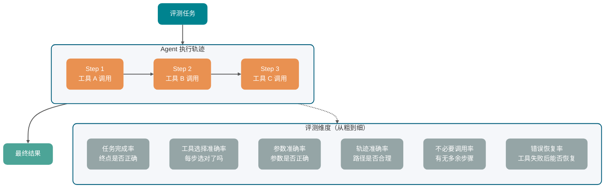
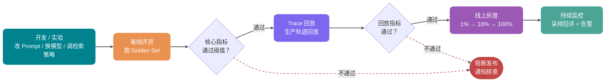

Có một đội làm dịch vụ khách hàng thông minh, họ dành ba tháng để nâng cấp knowledge base RAG từ tìm kiếm vector thuần túy lên tìm kiếm lai, sau đó thêm một tầng Reranker. Trước khi lên production, các kỹ sư đã kiểm tra vài chục câu hỏi trên máy local, cảm thấy hiệu quả đã tốt hơn đáng kể, rồi push lên production.

Một tuần sau, đội nghiệp vụ phản hồi: "Một số câu hỏi cảm giác còn kém hơn trước."

Điều phiền toái nhất trong câu này không phải là "chất lượng đã giảm", mà là không ai biết nó thực sự có giảm hay không. Chất lượng phiên bản cũ ở mức nào? Phiên bản mới có loại câu hỏi nào bị thoái lùi? Điều mà đội nghiệp vụ nói là "kém hơn trước" - đó là thoái lùi thực sự, hay là kỳ vọng của người dùng đã tăng cao hơn? Kiểm tra mới phát hiện ra rằng gần như không có dữ liệu chất lượng lịch sử nào.

Nhiều ứng dụng AI giai đoạn đầu đều như vậy: lên production theo cảm tính, đánh giá tốt xấu theo cảm tính, quyết định sau khi sửa có tiến bộ hay không cũng theo cảm tính.

Điều này giống như bay trong hộp đen vậy.

Bài viết này nói về vòng lặp khép kín hoàn chỉnh của việc đánh giá ứng dụng AI, bao gồm: tại sao benchmark công khai không thể thay thế bộ đánh giá của bạn; cách xây dựng Golden Set; đánh giá thủ công, đánh giá theo quy tắc, LLM-as-Judge phù hợp với những tình huống nào; các sai lệch và cách sử dụng đáng tin cậy của LLM-as-Judge; RAG, Agent, đầu ra có cấu trúc, chi phí độ trễ, an toàn thì nhìn vào chỉ số nào; và cách kết nối đánh giá offline, phát lại Trace, triển khai thử nghiệm và hồi quy tự động CI.

Lưu ý: Các framework đánh giá như RAGAS, TruLens, LangSmith, Langfuse đang liên tục phát triển, hệ thống production nên tham chiếu tài liệu chính thức mới nhất. Bài viết này tập trung vào phương pháp luận đánh giá và thiết kế chỉ số, không so sánh ngang các công cụ, cũng không trích dẫn các con số benchmark chưa được xác minh.

## Tại sao benchmark công khai không đủ?

Nhiều đội chọn model theo cách rất trực tiếp: mở một bảng xếp hạng đánh giá nào đó, tìm cái điểm cao nhất, tích hợp vào dùng.

Cách này có thể làm bộ lọc thô, nhưng dùng nó để phán quyết "model có làm tốt nghiệp vụ của mình không" thì thường không đáng tin.

Điều mà benchmark công khai tối ưu hóa không nhất thiết là phân phối dữ liệu của bạn. Nó thường sử dụng dataset cố định và loại nhiệm vụ cố định, thứ hạng trên các dataset này không nhất thiết suy ra được cho hành vi người dùng thực tế. Ví dụ, một ứng dụng dịch vụ khách hàng thương mại điện tử tiếng Trung, câu hỏi người dùng tập trung cao vào các tình huống đổi trả hàng, tiến độ giao hàng, quy tắc khuyến mãi, so sánh thông số sản phẩm. Khi chọn model chỉ nhìn vào bảng xếp hạng suy luận tiếng Anh, giá trị tham khảo rất hạn chế.

Còn có một vấn đề ẩn hơn: dữ liệu benchmark thường khá sạch, nhưng dữ liệu production không sạch. Đầu vào của người dùng thực tế sẽ có lỗi chính tả, từ viết tắt thông thường, văn bản lẫn hình ảnh, nhiều ngôn ngữ xen kẽ, mô tả mâu thuẫn trước sau. Hiệu suất của model trên test set sạch và hiệu suất của nó trong dữ liệu bẩn thực tế có thể chênh lệch rất nhiều.

Các mô hình thất bại trong nghiệp vụ cũng rất đặc thù. Đánh giá công khai đo lường năng lực trung bình, nhưng điều mà nghiệp vụ thực sự nhạy cảm thường không phải là điểm trung bình.

Ví dụ:

- AI đánh giá hợp đồng: Thất bại quan trọng nhất là bỏ sót điều khoản rủi ro cao, không phải điểm trôi chảy trung bình giảm 5%.
- Dịch vụ khách hàng thông minh: Thất bại quan trọng nhất là nói sai quy trình hoàn tiền, không phải điểm BLEU giảm 0.03.
- Code Agent: Thất bại quan trọng nhất là thực thi lệnh nguy hiểm, không phải độ chính xác tạo code trung bình giảm vài điểm.

Những thất bại có trọng số cao này hầu như không thể phát hiện trong benchmark tổng quát.

Vì vậy, bảng xếp hạng công khai có thể dùng để loại bỏ những model rõ ràng không phù hợp, nhưng để quyết định một model có thể lên nghiệp vụ của bạn hay không, vẫn phải dựa vào bộ đánh giá của bạn.

## Cách xây dựng Golden Set?

Golden Set là bộ test tiêu chuẩn để đo lường chất lượng ứng dụng AI. Điểm mấu chốt không phải là "mẫu thật nhiều", mà là mỗi mẫu đều có đầu vào rõ ràng và tiêu chí đánh giá đầu ra tốt hay xấu.

Tiêu chí này không nhất thiết là câu trả lời đúng duy nhất. Nó có thể là câu trả lời tham chiếu, chiều đánh giá, quy tắc xác minh, cũng có thể là một đoạn giải thích đánh giá thủ công. Miễn là có thể cho phép đánh giá tiếp theo có tiêu chuẩn nhất quán, là có giá trị.

### Dữ liệu lấy từ đâu?

**Loại nguồn đầu tiên là lấy mẫu theo tầng từ log production.**

Nếu hệ thống đã lên production, log production thường là nguồn dữ liệu giá trị nhất. Khi lấy mẫu, đừng chỉ lấy các câu hỏi tần số cao, vì câu hỏi tần số cao thường là những câu tương đối dễ xử lý. Những câu thực sự dễ gặp vấn đề thường ẩn trong các đầu vào tần số thấp, biên và bất thường.

Nên tập trung xem một số loại mẫu: người dùng đã nhấn "không hài lòng", xuất hiện câu hỏi bổ sung, cuối cùng chuyển sang người thật, và những trường hợp biên trông có vẻ "suýt thất bại".

Tôi đã gặp một lần, chúng tôi chỉ lấy mẫu từ luồng hội thoại bình thường để xây dựng Golden Set, kết quả là bỏ sót một loại truy vấn văn bản lẫn hình ảnh chiếm 8% lưu lượng production. Tỷ lệ thất bại của loại truy vấn này cao hơn trung bình 3 lần, nhưng hoàn toàn không có phủ sóng trong Golden Set. Hai phiên bản liên tiếp sau đó được gọi là "cải thiện chất lượng" thực ra đều là cải thiện giả.

**Loại nguồn thứ hai là xây dựng thủ công.**

Tính năng mới chưa lên production, hoặc một số tình huống rủi ro cao hiếm khi xuất hiện trong log, cần phải xây dựng mẫu thủ công.

Khi xây dựng thủ công, ít nhất phải phủ sóng ba loại:

- Mẫu đường dẫn bình thường: Phổ biến, kết quả rõ ràng, có thể đại diện cho chức năng chính.
- Mẫu biên: Thông tin không đầy đủ, có sự mơ hồ, kết hợp đa tình huống.
- Mẫu đối kháng: Cố tình cho model mắc lỗi, ví dụ câu hỏi ngoài lĩnh vực, yêu cầu vượt quyền, thử nghiệm Prompt injection.

**Loại nguồn thứ ba là bổ sung từ các trường hợp thất bại.**

Các trường hợp thất bại thực tế gặp phải sau khi lên production là nguồn bổ sung quý giá nhất cho Golden Set. Mỗi lần xử lý khiếu nại người dùng, nên luôn hỏi thêm một câu: Trường hợp này có thể thêm vào bộ đánh giá không?

Bổ sung từ các trường hợp thất bại giúp Golden Set liên tục phủ sóng các điểm yếu thực sự của model, thay vì dừng lại ở những tưởng tượng chủ quan ban đầu khi xây dựng.

Nếu hệ thống chưa lên production, cũng có thể dùng dữ liệu tổng hợp để khởi động lạnh. Ví dụ, trước tiên tạo ra một loạt câu hỏi, câu trả lời tham chiếu và ví dụ khó từ tài liệu knowledge base, sau đó được con người lấy mẫu kiểm tra trước khi thêm vào bộ ứng cử. Các công cụ như RAGAS cung cấp khả năng tạo test set, phù hợp để giúp bạn nhanh chóng triển khai phạm vi phủ sóng phiên bản đầu tiên.

Nhưng dữ liệu tổng hợp chỉ có thể làm phụ trợ. Nó rất dễ kế thừa thiên vị của chính model tạo ra, không phủ sóng được đầu vào bẩn và cách hỏi lạ của người dùng thực tế. Golden Set thực sự dùng cho cổng phát hành cuối cùng vẫn cần phải được liên tục hiệu chỉnh bởi log production, các trường hợp thất bại và kiểm tra thủ công.

### Bao nhiêu mẫu là đủ?

Câu hỏi này không có câu trả lời tuyệt đối, nhưng có thể có điểm khởi đầu về mặt kỹ thuật.

Golden Set ít hơn 50 mẫu sẽ có phương sai thống kê rất lớn. Một chút biến động ngẫu nhiên trong đầu ra của model có thể khiến bạn phán đoán sai hướng thay đổi chất lượng.

Từ 50 đến 200 mẫu thường có thể làm điểm khởi đầu cho nhiều tình huống. Nó có thể phủ sóng các đường dẫn chức năng chính, chi phí chạy một lần đánh giá cũng vẫn có thể kiểm soát, kết luận cơ bản có giá trị tham khảo. Khi nghiệp vụ mở rộng, dần dần mở rộng lên 500 mẫu trở lên.

Tuy nhiên, quan trọng hơn tổng số lượng là phân phối. 200 mẫu toàn là một loại câu hỏi, không bằng 100 mẫu phủ sóng 10 loại tình huống.

### Phân tầng quan trọng hơn tổng số lượng

| Phân tầng             | Nội dung điển hình                                 | Tỷ lệ đề xuất |
| --------------------- | -------------------------------------------------- | ------------- |
| Đường dẫn bình thường | Tình huống chủ đạo phổ biến, kết quả rõ ràng       | 50%           |
| Tình huống biên       | Thiếu thông tin, đa nghĩa, đa lĩnh vực             | 25%           |
| Mẫu đối kháng         | Đầu vào đặc biệt mà model dễ mắc lỗi               | 15%           |
| Thất bại trọng số cao | Loại thất bại quan trọng được nghiệp vụ định nghĩa | 10%           |

"Thất bại trọng số cao" rất dễ bị bỏ qua, nhưng thường là điều mà đội nghiệp vụ quan tâm nhất. Ví dụ, trong tình huống tuân thủ, bỏ sót nhận dạng điều khoản rủi ro, trong tình huống y tế, đưa ra lời khuyên sử dụng thuốc sai, ngay cả khi nó chỉ chiếm 10% tổng bộ đánh giá, một lần xảy ra cũng rất nghiêm trọng.

### Golden Set không phải là tài sản dùng một lần

Sản phẩm sẽ lặp đi lặp lại, người dùng sẽ thay đổi, Golden Set ban đầu cũng sẽ hết hạn. Nên thiết lập ba cơ chế:

- Xem xét hàng quý một lần: Kiểm tra có tình huống phổ biến mới nào chưa được phủ sóng không, cũng xóa các mẫu lỗi thời.
- Tự động nhập kho các trường hợp thất bại: Khi xuất hiện mô hình thất bại mới trên production, sau khi con người xác nhận thì thêm vào bộ đánh giá.
- Quản lý theo phiên bản: Golden Set phải có số phiên bản, và ghi lại cùng với phiên bản model, phiên bản Prompt. Không có số phiên bản, so sánh qua các phiên bản sẽ không có ý nghĩa.

## Ba phương pháp đánh giá

Khi có Golden Set, bước tiếp theo là chọn phương pháp đánh giá. Đánh giá thủ công, đánh giá theo quy tắc, LLM-as-Judge mỗi loại đều có tình huống phù hợp, trong thực hành thường không phải chọn một trong ba, mà là sử dụng kết hợp.

| Phương pháp           | Độ chính xác                             | Tốc độ     | Chi phí    | Nội dung đánh giá điển hình                                                                                  | Tình huống sử dụng điển hình                                                                              |
| --------------------- | ---------------------------------------- | ---------- | ---------- | ------------------------------------------------------------------------------------------------------------ | --------------------------------------------------------------------------------------------------------- |
| Đánh giá thủ công     | Cao nhất                                 | Chậm       | Cao        | Phán đoán ngữ nghĩa phức tạp, phân xử mẫu biên, phán đoán rủi ro nghiệp vụ                                   | Chú thích ban đầu Golden Set, xác minh cuối cùng tình huống rủi ro cao, chuẩn cân bằng LLM-as-Judge       |
| Đánh giá theo quy tắc | Cao (trong phạm vi quy tắc có thể mô tả) | Nhanh nhất | Thấp       | Định dạng JSON, tính toàn vẹn trường, giá trị enum, biên giá trị số, trích dẫn có tồn tại không              | Xác minh định dạng, trường enum, kiểm tra trích dẫn, biên giá trị số                                      |
| LLM-as-Judge          | Trung bình (bị ảnh hưởng bởi sai lệch)   | Nhanh      | Trung bình | Sự liên quan của câu trả lời, độ trung thực thực tế, tính đầy đủ, tính mạch lạc, giọng điệu có phù hợp không | Sự liên quan ngữ nghĩa, tính mạch lạc của câu trả lời, độ trung thực thực tế, chấm điểm đa chiều tổng hợp |

Kết hợp tương đối ổn định là: đánh giá theo quy tắc để lọc nhanh, LLM-as-Judge để phán đoán ngữ nghĩa, đánh giá thủ công để hiệu chỉnh và xác minh. Chúng không phải là mối quan hệ cạnh tranh, mà là các tầng phòng thủ khác nhau.

Còn có một con đường nặng hơn: đào tạo hoặc tinh chỉnh Judge chuyên dụng. Cách tiếp cận của ARES là đầu tiên dùng dữ liệu tổng hợp để đào tạo Judge nhẹ, sau đó dùng một lượng nhỏ mẫu chú thích thủ công để hiệu chỉnh PPI (Prediction-Powered Inference). Nó phù hợp với các hệ thống RAG có lượng đánh giá rất lớn, lĩnh vực tương đối ổn định, chi phí trực tiếp gọi model mạnh làm Judge quá cao. Đối với hầu hết các đội, có thể bắt đầu từ LLM-as-Judge tổng quát trước; khi chi phí đánh giá và tính nhất quán trở thành nút thắt, mới xem xét Judge chuyên dụng.

### Cách chọn công cụ đánh giá?

Đừng kết nối tất cả công cụ ngay từ đầu. Trước tiên hãy xem bạn muốn giải quyết loại vấn đề nào:

| Công cụ   | Phù hợp hơn cho giai đoạn nào             | Mục đích điển hình                                                                   |
| --------- | ----------------------------------------- | ------------------------------------------------------------------------------------ |
| RAGAS     | Đánh giá chỉ số RAG                       | Các chỉ số Faithfulness, Response Relevancy, Context Precision, Context Recall, v.v. |
| TruLens   | Quan sát và hàm phản hồi ứng dụng RAG/LLM | Phản hồi chất lượng Groundedness, Context Relevance, Answer Relevance, v.v.          |
| LangSmith | Vòng lặp phát triển ứng dụng LangChain    | Dataset, Trace, so sánh thực nghiệm, đánh giá hồi quy                                |
| Langfuse  | Trace production và phân tích chấm điểm   | Lấy mẫu Trace, chấm điểm thủ công, LLM-as-Judge, Score Analytics                     |

Khuyến nghị của tôi: Trước tiên hãy chạy thông Golden Set của bạn, tiêu chuẩn chấm điểm và hồ sơ phiên bản, sau đó mới kết nối công cụ. Nếu không, dù bảng điều khiển công cụ có đẹp đến đâu, cũng chỉ là trực quan hóa một lần quy trình đánh giá không ổn định.

## Cách sử dụng LLM-as-Judge đáng tin cậy?

Ý tưởng của LLM-as-Judge rất đơn giản: dùng một model ngôn ngữ thường mạnh hơn, để đánh giá đầu ra của một model khác có tốt không.

Ưu điểm của nó là có thể đánh giá câu trả lời mở, không cần viết cứng các quy tắc, chi phí cũng thấp hơn nhiều so với đánh giá thủ công. Nhưng nó có một số sai lệch đã biết, nếu không xử lý, kết quả đánh giá sẽ bị biến dạng.

### Hai chế độ

**Reference-based (có câu trả lời tham chiếu)**

Khi đánh giá, cung cấp câu trả lời chuẩn, để model Judge so sánh khoảng cách giữa câu trả lời được tạo ra và câu trả lời tham chiếu.

```text
参考答案：退款申请应在收货后 7 天内提交，超期不受理。
模型回答：您需要在收货 7 天内提出退款申请，否则无法受理。

请对以下维度打分（1-5 分）：
- 事实准确性：模型回答与参考答案的事实是否一致？
- 完整性：参考答案中的关键信息是否都在模型回答中体现？
- 措辞清晰度：模型回答是否清楚易懂？
```

**Reference-free (không có câu trả lời tham chiếu)**

Không cung cấp câu trả lời chuẩn, để Judge trực tiếp đánh giá chất lượng bản thân câu trả lời. Nó thường được dùng cho viết sáng tạo, suy luận phân tích, hoặc những tình huống mà câu trả lời tham chiếu chính nó rất khó xác định.

### Bốn loại sai lệch và hạn chế phổ biến

**Sai lệch vị trí (Position Bias)**

Khi bạn đồng thời hiển thị hai câu trả lời và để Judge chọn cái nào tốt hơn, nó có thể thiên về câu trả lời đầu tiên hoặc thứ hai, không nhất thiết hoàn toàn dựa trên phán đoán chất lượng. Xu hướng của các model khác nhau cũng khác nhau.

Cách xử lý cũng đơn giản: đánh giá hai lần, đổi thứ tự A/B, lấy kết luận nhất quán của cả hai lần; hoặc để Judge mỗi lần chỉ đánh giá một câu trả lời, không so sánh trực tiếp.

**Sai lệch dài dòng (Verbosity Bias)**

Model Judge dễ cho rằng câu trả lời dài hơn thì chất lượng cao hơn, ngay cả khi độ dài đến từ thứ vô nghĩa và lặp lại.

Cách xử lý là trong Judge Prompt ghi rõ: không xem xét độ dài, chỉ nhìn vào chất lượng thông tin. Đồng thời phải xác nhận trên validation set rằng quy tắc này thực sự có tác dụng.

**Sai lệch tự tăng cường (Self-Enhancement Bias)**

Nếu model Judge và model bị đánh giá đến từ cùng một công ty, thậm chí là cùng một model, có thể xuất hiện xu hướng khoan dung hơn với đầu ra cùng nguồn gốc.

Cần nói thận trọng ở đây. Bài báo MT-Bench quan sát thấy GPT-4 và Claude-v1 có một số sở thích về tỷ lệ thắng đối với đầu ra của chính mình, nhưng GPT-3.5 không có cùng biểu hiện; bài báo cũng nói rõ rằng, do lượng dữ liệu và sự khác biệt hạn chế, không thể trực tiếp kết luận đây là sai lệch hệ thống ổn định.

Về mặt kỹ thuật có thể xử lý thận trọng: các điểm đánh giá quan trọng dùng các nhà cung cấp khác nhau hoặc các họ model khác nhau để xác minh chéo, sau đó thêm kiểm tra lấy mẫu thủ công. Điều này không phải vì "cùng nhà cung cấp nhất định không đáng tin", mà là để giảm ảnh hưởng của sở thích của một Judge duy nhất.

**Khả năng suy luận hạn chế (Limited Reasoning Ability)**

LLM Judge không tương đương với bộ xác minh. Khi đánh giá đầu ra toán học, code, SQL, suy luận logic phức tạp, nó có thể bị lệch bởi suy luận sai trong câu trả lời được đánh giá, ngay cả khi Judge tự mình giải được bài toán.

Các tình huống như vậy tốt nhất nên sử dụng Reference-guided Judge: đưa cho Judge câu trả lời tham chiếu rõ ràng, kết quả unit test, kết quả thực thi SQL hoặc các bước suy luận quan trọng, để nó chấm điểm xung quanh bằng chứng có thể xác minh. MT-Bench cũng đề cập rằng chain-of-thought judge và reference-guided judge có thể giảm nhẹ hạn chế chấm điểm về toán học và câu hỏi suy luận. Nói cách khác, chất lượng chủ quan có thể giao cho Judge, độ chính xác khách quan nên cố gắng đưa cho nó bằng chứng.

### Cách viết Judge Prompt?

Nhiều LLM-as-Judge thất bại không phải vì model kém, mà là Prompt viết quá mơ hồ. Judge không biết tiêu chuẩn chấm điểm, chỉ có thể chấm theo cảm giác, cuối cùng mọi câu trả lời đều na ná nhau, điểm số không có sự phân biệt.

Một template Judge Prompt khá thực dụng:

```text
你是一个严格的评测员，负责评判 AI 助手的回答质量。

【用户问题】
{question}

【参考资料】（检索到的上下文，如果有）
{context}

【参考答案】（如果有，用于校准事实、数值、代码或推理正确性）
{reference_answer}

【AI 回答】
{answer}

请先按以下评估步骤检查回答，但最终只输出 JSON，不要展开完整推理过程：

Step 1：识别用户问题中的关键要求。
Step 2：对照参考资料和参考答案，检查回答中的事实断言是否有依据。
Step 3：判断回答是否直接回应问题，有没有遗漏关键要点。
Step 4：分别给每个维度打分。

请严格按照以下标准评判，每个维度独立打分，分值为 1-5 的整数：

1. 事实忠实度（Faithfulness）
   5 分：回答中所有事实断言均可在参考资料中找到依据
   3 分：大部分有依据，存在少量无法核实的推断
   1 分：包含与参考资料矛盾或无依据的事实断言

2. 答案相关性（Answer Relevance）
   5 分：直接回答了用户问题，没有不相关内容
   3 分：基本回答了问题，但有部分偏题
   1 分：未能回答用户实际问题

3. 完整性（Completeness）
   5 分：覆盖了回答这个问题所需的全部关键要点
   3 分：覆盖了主要要点，但遗漏了部分重要细节
   1 分：严重缺失关键信息

请按以下 JSON 格式输出，不要添加额外解释：
{"faithfulness": <分值>, "relevance": <分值>, "completeness": <分值>, "reasoning": "<一句话说明评分依据>"}
```

Chiều chấm điểm và mô tả càng cụ thể, phán đoán của Judge càng ổn định, tính nhất quán giữa các Judge khác nhau cũng sẽ cao hơn.

Kinh nghiệm của G-Eval cũng có thể tham khảo: trước tiên để Judge kiểm tra theo các bước đánh giá, sau đó dùng form có cấu trúc để đưa ra điểm số, thường ổn định hơn "cho điểm trực tiếp". Điểm mấu chốt ở đây không phải là để model viết chuỗi suy luận dài, mà là phân tách rõ con đường đánh giá. Đối với các nhiệm vụ phức tạp, đa ràng buộc, cần xác minh thực tế, các bước đánh giá rất có giá trị; đối với xác minh định dạng rất đơn giản, hoặc bạn đang sử dụng model suy luận có bản thân thực hiện suy luận nội bộ, các bước tường minh có thể chỉ tăng chi phí token.

## Cách đánh giá ứng dụng RAG?

Định vị vấn đề RAG đặc biệt phụ thuộc vào đánh giá theo từng đoạn. Nhiều người thấy chất lượng câu trả lời cuối cùng kém, phản ứng đầu tiên là sửa Prompt, sửa mãi không có hiệu quả, cuối cùng mới phát hiện ra là bộ truy xuất đang kéo lùi.

Đánh giá RAG bắt buộc phải chia thành hai đoạn: đánh giá truy xuất và đánh giá tạo sinh.

```mermaid
flowchart LR
    Query["用户查询"]:::client
    Retrieval["检索层\n向量检索 / 混合检索"]:::business
    Context["检索结果\n候选段落"]:::external
    Generation["生成层\n模型 + Prompt"]:::gateway
    Answer["最终回答"]:::success

    Query --> Retrieval --> Context --> Generation --> Answer

    subgraph rMetrics["检索指标"]
        direction TB
        R1["Recall@k"]:::info
        R2["Hit Rate@k"]:::info
        R3["MRR"]:::info
        R4["Context Precision / Recall"]:::info
    end

    subgraph gMetrics["生成指标"]
        direction TB
        G1["Faithfulness（事实忠实度）"]:::info
        G2["Answer Relevance（答案相关性）"]:::info
        G3["Context Usage（上下文使用度）"]:::info
        G4["Noise Sensitivity（噪声敏感度）"]:::info
    end

    Retrieval -.-> rMetrics
    Generation -.-> gMetrics

    classDef client fill:#00838F,color:#FFFFFF,stroke:none,rx:10,ry:10
    classDef business fill:#E99151,color:#FFFFFF,stroke:none,rx:10,ry:10
    classDef gateway fill:#7B68EE,color:#FFFFFF,stroke:none,rx:10,ry:10
    classDef external fill:#607D8B,color:#FFFFFF,stroke:none,rx:10,ry:10
    classDef success fill:#4CA497,color:#FFFFFF,stroke:none,rx:10,ry:10
    classDef info fill:#95A5A6,color:#FFFFFF,stroke:none,rx:10,ry:10
    linkStyle default stroke-width:2px,stroke:#333333,opacity:0.8
    linkStyle 4,5 stroke-dasharray:5 5,opacity:0.8

    style rMetrics fill:#F5F7FA,stroke:#005D7B,stroke-width:2px,rx:10,ry:10
    style gMetrics fill:#F5F7FA,stroke:#005D7B,stroke-width:2px,rx:10,ry:10
```



### Chỉ số truy xuất

**Recall@k** xem trong k kết quả truy xuất đầu tiên, có bao nhiêu phần trăm tài liệu liên quan được thu hồi.

```text
Recall@k = 被召回的相关文档数 / 总相关文档数
```

Chỉ số này rất nhạy cảm với "bỏ sót kiến thức quan trọng". Trong hỏi đáp knowledge base, Recall@3 hoặc Recall@5 là chỉ số đánh giá truy xuất rất phổ biến.

**Hit Rate@k** xem trong k kết quả đầu tiên có ít nhất một tài liệu liên quan không. Mỗi mẫu cho 0 hoặc 1, rồi lấy trung bình.

Nó phù hợp để đánh giá nhanh, không quan tâm có bao nhiêu tài liệu liên quan được thu hồi, chỉ quan tâm có nội dung liên quan nào vào context không. Tính toán đơn giản, cũng khá dễ giải thích.

**MRR (Mean Reciprocal Rank)** xem tài liệu liên quan đầu tiên xếp ở vị trí bao nhiêu. Xếp hạng càng cao, MRR càng cao.

Nếu model tạo sinh của bạn rõ ràng phụ thuộc nhiều hơn vào tài liệu ở vị trí Top, MRR sẽ phản ánh tốt hơn chất lượng truy xuất.

| Chỉ số            | Điểm chú ý                                                                 | Tình huống phù hợp                                                                        |
| ----------------- | -------------------------------------------------------------------------- | ----------------------------------------------------------------------------------------- |
| Recall@k          | Tỷ lệ phủ sóng thu hồi                                                     | Tình huống thông tin quan trọng không thể bỏ sót, như tuân thủ, pháp lý, y tế             |
| Hit Rate@k        | Có trúng hay không                                                         | Đánh giá nhanh và xác minh theo giai đoạn                                                 |
| MRR               | Xếp hạng kết quả liên quan                                                 | Tình huống model phụ thuộc nặng vào kết quả Top-1                                         |
| Precision@k       | Tỷ lệ chính xác                                                            | Tình huống ngân sách Token context hạn chẹp, cần đầu vào chính xác cao                    |
| Context Precision | Liệu context liên quan có được xếp trước không                             | Không có chú thích ID tài liệu đầy đủ, nhưng có câu hỏi, câu trả lời và context           |
| Context Recall    | Liệu thông tin trong câu trả lời tham chiếu có được context phủ sóng không | Chú thích sự liên quan cấp tài liệu quá đắt, nhưng có thể cung cấp câu trả lời tham chiếu |

Bốn chỉ số IR truyền thống đầu tiên thường cần chú thích ID tài liệu liên quan. Tức là, mỗi câu hỏi cần chú thích "tài liệu nào là nguồn câu trả lời đúng cho câu hỏi này", mới có thể phán đoán truy xuất có thực sự trúng hay không. Đây cũng là phần tốn thời gian nhất trong Golden Set.

Nếu chi phí chú thích cấp tài liệu quá cao, có thể dùng chỉ số truy xuất dựa trên LLM như RAGAS để làm giải pháp khởi đầu. Context Precision tập trung vào việc context liên quan đến câu trả lời có được xếp ở vị trí trước hơn không; Context Recall tập trung vào các tuyên bố trong câu trả lời tham chiếu, có bao nhiêu trong số đó có thể được context truy xuất hỗ trợ. Chúng không yêu cầu bạn chú thích chính xác tất cả ID tài liệu liên quan cho mỗi câu hỏi, nhưng sẽ phụ thuộc vào phán đoán của LLM, vì vậy vẫn cần kiểm tra lấy mẫu thủ công.

Còn có một điểm dễ nhầm lẫn: Trong RAGAS v0.1 đã từng có Context Utilization, về bản chất là phiên bản không có câu trả lời tham chiếu của Context Precision, đánh giá "thứ tự của context liên quan trong kết quả truy xuất", không phải "model tạo sinh có sử dụng tốt context không". Nếu bạn muốn đánh giá cái sau, nên dùng một tên tùy chỉnh, như Context Usage dưới đây.

### Chỉ số tạo sinh

Đánh giá tạo sinh thường dùng LLM-as-Judge, tập trung xem một số chiều sau.

**Faithfulness (Độ trung thực thực tế)**

Xem trong câu trả lời của model có bịa đặt nào vượt ra ngoài phạm vi kết quả truy xuất không.

Đây là một trong những chỉ số tạo sinh quan trọng nhất của ứng dụng RAG. Nếu các sự thật trong câu trả lời đều có thể tìm thấy bằng chứng từ nội dung truy xuất, Faithfulness cao; nếu model bắt đầu bổ sung nội dung không có trong kết quả truy xuất, Faithfulness thấp. RAGAS cũng có cách tiếp cận tương tự: phán đoán xem mỗi tuyên bố trong câu trả lời có thể được suy ra từ context không.

**Answer Relevance / Response Relevancy (Sự liên quan của câu trả lời)**

Xem câu trả lời có đúng trọng tâm câu hỏi của người dùng không.

Nó khác với Faithfulness. Một câu trả lời có thể hoàn toàn trung thực với nội dung truy xuất, nhưng không trả lời đúng câu hỏi thực sự của người dùng. Ví dụ, người dùng hỏi "làm thế nào để hoàn tiền", model chỉ chuyển đạt một đoạn nguyên văn chính sách hoàn hàng, không trích xuất quy trình hoạt động, loại này là không đủ sự liên quan.

**Context Usage (Độ sử dụng context, chỉ số tùy chỉnh)**

Xem nội dung được truy xuất có được sử dụng hiệu quả không.

Chỉ số này có thể chẩn đoán ngược một vấn đề khác: chất lượng truy xuất không tệ, nhưng model không dùng tốt kết quả truy xuất. Có thể là context quá dài khiến model bỏ qua nội dung ở giữa, cũng có thể là vị trí của nội dung truy xuất trong Prompt không hợp lý. Về hiện tượng Lost-in-the-Middle, có thể xem [《万字拆解 LLM 运行机制》](./llm-operation-mechanism.md).

Lưu ý, ở đây cố ý không dùng tên Context Utilization, để tránh nhầm lẫn với chỉ số cùng tên trong phiên bản lịch sử của RAGAS. Ở đây đánh giá tầng tạo sinh có sử dụng context không, không phải chất lượng sắp xếp của tầng truy xuất.

**Noise Sensitivity (Độ nhạy cảm với nhiễu)**

Xem khi kết quả truy xuất lẫn chunk không liên quan, chất lượng câu trả lời có giảm đáng kể không.

Hệ thống RAG thực tế hiếm khi chỉ nhận được "context sạch". Chỉ cần Top-k mở rộng một chút, rất dễ lẫn vào nội dung nửa liên quan hoặc thậm chí không liên quan. Noise Sensitivity cao, có nghĩa là model dễ bị nhiễu đánh lạc hướng; lúc này không nhất thiết phải đổi model trước, có thể nên điều chỉnh phân đoạn, Reranker, sắp xếp context, hoặc tăng cường ràng buộc "chỉ sử dụng tài liệu liên quan" trong Prompt.

### Hai bẫy phổ biến trong đánh giá RAG

**Bẫy một: Dùng kết quả truy xuất trực tiếp làm câu trả lời chuẩn.**

Một số người để tiết kiệm chi phí chú thích, lấy tài liệu được truy xuất trực tiếp làm câu trả lời chuẩn, rồi đánh giá độ tương đồng giữa câu trả lời được tạo ra và "câu trả lời chuẩn" này.

Điều này sẽ lẫn lộn chất lượng truy xuất và chất lượng tạo sinh. Kết quả truy xuất chỉ là ứng cử viên, không tương đương với câu trả lời đúng. Điểm số tính ra như vậy, về bản chất là đánh giá "model có lặp lại kết quả truy xuất không", không phải đánh giá "model có trả lời đúng câu hỏi không".

**Bẫy hai: Chỉ đánh giá câu trả lời cuối cùng, không phân đoạn.**

Nếu chỉ nhìn vào chất lượng câu trả lời cuối cùng, bạn không phân biệt được vấn đề đến từ truy xuất hay tạo sinh. Truy xuất kém và tạo sinh kém, biểu hiện cuối cùng đều có thể là "câu trả lời không chính xác", nhưng hướng tối ưu hoàn toàn khác nhau. Đánh giá phân đoạn không phải là tùy chọn, mà là tiền đề cơ bản để định vị vấn đề.

## Cách đánh giá ứng dụng Agent?

Đánh giá Agent khó hơn RAG. Lý do rất đơn giản: nhiệm vụ Agent thường là đa bước, kết quả cuối cùng không nhất thiết phản ánh quá trình trung gian có đúng không.

Một nhiệm vụ đã hoàn thành cuối cùng, nhưng Agent có thể đã đi theo một con đường sai, chỉ là ngẫu nhiên đến được đích. Nếu chỉ nhìn vào kết quả, lần sau đổi sang một nhiệm vụ có thay đổi nhỏ, cùng Agent đó có thể trực tiếp thất bại, bạn cũng không biết tại sao.



### Tỷ lệ hoàn thành nhiệm vụ

Đây là chỉ số trực tiếp nhất. Chia nhiệm vụ thành một số tiêu chí hoàn thành có thể xác minh, sau đó kiểm tra từng tiêu chí.

Ví dụ "giúp tôi gửi một email mời họp cho nhóm", tiêu chí hoàn thành có thể là:

- Người nhận bao gồm tất cả mọi người trong danh sách thành viên nhóm.
- Chủ đề email bao gồm từ khóa liên quan đến "cuộc họp".
- Nội dung email bao gồm thời gian và địa điểm họp.
- Email đã gửi thành công, lệnh gọi công cụ trả về trạng thái thành công.

```text
任务完成率 = 通过所有完成标准的任务数 / 总任务数
```

### Tỷ lệ chính xác lệnh gọi công cụ

Đây là chỉ số chi tiết hơn, thường phải tách ra xem:

- Tỷ lệ chính xác lựa chọn công cụ: Agent có gọi đúng công cụ không, có dùng sai công cụ không.
- Tỷ lệ chính xác tham số: Khi gọi công cụ, tham số được tạo ra có đúng không.
- Tỷ lệ gọi không cần thiết: Agent đã gọi những công cụ hoàn toàn không cần thiết nào.

Tỷ lệ gọi không cần thiết cao, có nghĩa là Agent đang "bận rộn vô ích". Điều này không chỉ lãng phí chi phí, mà còn mang lại rủi ro thất bại thêm.

### Tỷ lệ chính xác quỹ đạo

Tỷ lệ chính xác quỹ đạo nghiêm ngặt hơn tỷ lệ hoàn thành nhiệm vụ. Nó sẽ so sánh mỗi bước lệnh gọi công cụ và tham số mà Agent thực sự thực thi với quỹ đạo tham chiếu của chuyên gia, tính toán độ tương đồng giữa quỹ đạo thực tế và quỹ đạo tham chiếu.

Điều này yêu cầu chú thích trước: đối với nhiệm vụ này, Agent lý tưởng nên làm từng bước như thế nào. Chi phí thực sự cao, nhưng phù hợp cho các tình huống có yêu cầu nghiêm ngặt về đường dẫn hành vi, chẳng hạn như Agent thực thi code, Agent hoạt động tài chính, các tình huống cần kiểm toán nghiêm ngặt.

### Tỷ lệ phục hồi lỗi

Lệnh gọi công cụ không nhất thiết thành công. Khi công cụ trả về lỗi, Agent có thể nhận ra vấn đề, thử lại bằng cách khác, hoặc giải thích tình huống cho người dùng không?

```text
错误恢复率 = 工具失败后任务仍然完成的次数 / 工具失败总次数
```

Chỉ số này phản ánh tính bền vững của Agent. Agent mong manh, công cụ thất bại một lần là bị mất phương hướng; Agent được thiết kế kỹ thuật tốt, có thể phục hồi từ các thất bại công cụ. Về thiết kế thất bại lệnh gọi công cụ, có thể tham khảo chương an toàn lệnh gọi công cụ trong [《大模型结构化输出详解》](./structured-output-function-calling.md).

## Cách đánh giá đầu ra có cấu trúc?

Đánh giá đầu ra có cấu trúc tương đối cơ học, rất phù hợp để tự động hóa bằng quy tắc, không nhất thiết cần LLM-as-Judge.

Chủ yếu xem ba tầng.

**Tỷ lệ định dạng hợp lệ**: Đầu ra có phải là JSON hợp lệ không? Dùng `JSON.parse()` là có thể phát hiện, không cần thủ công.

**Tỷ lệ vượt qua Schema**: Trong JSON hợp lệ, có bao nhiêu vượt qua xác thực JSON Schema bạn định nghĩa? Nó chủ yếu kiểm tra tính toàn vẹn trường, kiểu dữ liệu, phạm vi enum.

**Tỷ lệ chính xác ngữ nghĩa trường**: Trong đầu ra vượt qua xác thực Schema, giá trị trường nghiệp vụ cốt lõi có ngữ nghĩa đúng không? Ví dụ trường phân loại có chọn đúng danh mục không, giá trị điểm độ tin cậy có trong phạm vi hợp lý không.

Khuyến nghị của tôi là chia nhỏ đến đánh giá cấp trường, không chỉ nhìn vào tỷ lệ vượt qua tổng thể. Một đối tượng có 10 trường, 9 trường đúng, 1 trường sai. Nếu trường sai là trường quan trọng, dù tỷ lệ vượt qua tổng thể trông đẹp đến đâu cũng vô dụng.

## Hệ thống chỉ số đánh giá hoàn chỉnh

Tổng hợp các loại chỉ số trên lại, có thể có được một bảng tham chiếu:

| Chiều                | Chỉ số                                | Cách tính                                                  | Tình huống áp dụng                                          |
| -------------------- | ------------------------------------- | ---------------------------------------------------------- | ----------------------------------------------------------- |
| Chất lượng truy xuất | Recall@k                              | Tỷ lệ thu hồi tài liệu liên quan                           | RAG knowledge base                                          |
|                      | Hit Rate@k                            | Có ít nhất một trúng không                                 | Xác minh nhanh RAG                                          |
|                      | MRR                                   | Xếp hạng kết quả liên quan đầu tiên                        | RAG phụ thuộc mạnh vào Top-1                                |
|                      | Precision@k                           | Tỷ lệ chính xác kết quả                                    | Tình huống ngân sách Token hạn chặp                         |
|                      | Context Precision                     | Liệu context liên quan có xếp trước không                  | Đánh giá truy xuất LLM kiểu RAGAS                           |
|                      | Context Recall                        | Liệu câu trả lời tham chiếu có được context phủ sóng không | Đánh giá RAG giai đoạn đầu thiếu chú thích ID tài liệu      |
| Chất lượng tạo sinh  | Faithfulness                          | Câu trả lời có trung thực với context không                | RAG, hỏi đáp thực tế                                        |
|                      | Answer Relevance / Response Relevancy | Câu trả lời có trả lời đúng câu hỏi không                  | Hỏi đáp tổng quát, dịch vụ khách hàng                       |
|                      | Completeness                          | Câu trả lời có phủ sóng các điểm quan trọng không          | Giải thích chính sách, hỏi đáp tuân thủ                     |
|                      | Context Usage                         | Tạo sinh có sử dụng hiệu quả context truy xuất không       | Chẩn đoán RAG truy xuất tốt nhưng câu trả lời vẫn không tốt |
|                      | Noise Sensitivity                     | Liệu context nhiễu có can thiệp câu trả lời không          | RAG Top-k lớn, context lẫn lộn                              |
| Lệnh gọi công cụ     | Tỷ lệ chính xác lựa chọn công cụ      | Công cụ đúng / tổng số lệnh gọi                            | Agent                                                       |
|                      | Tỷ lệ chính xác tham số               | Tham số đúng / tổng số tham số                             | Agent                                                       |
|                      | Tỷ lệ gọi không cần thiết             | Gọi dư thừa / tổng số lệnh gọi                             | Tối ưu hiệu quả Agent                                       |
|                      | Tỷ lệ hoàn thành nhiệm vụ             | Hoàn thành nhiệm vụ / tổng số nhiệm vụ                     | Agent E2E                                                   |
|                      | Tỷ lệ phục hồi lỗi                    | Hoàn thành sau thất bại công cụ / tổng số thất bại công cụ | Tính bền vững Agent                                         |
| Tuân thủ định dạng   | Tỷ lệ định dạng JSON hợp lệ           | JSON hợp lệ / tổng số đầu ra                               | Đầu ra có cấu trúc                                          |
|                      | Tỷ lệ vượt qua Schema                 | Vượt qua xác thực / số JSON hợp lệ                         | Đầu ra có cấu trúc                                          |
|                      | Tỷ lệ chính xác enum                  | Enum đúng / tổng số trường có enum                         | Đầu ra phân loại, trạng thái                                |
| Chi phí và độ trễ    | TTFT                                  | Thời gian trả về Token đầu tiên                            | Trải nghiệm đầu ra streaming                                |
|                      | E2E Latency                           | Thời gian hoàn thành end-to-end                            | Hiệu suất tổng thể                                          |
|                      | Input / Output Tokens                 | Lượng Token sử dụng                                        | Kiểm soát chi phí                                           |
|                      | Tỷ lệ retry                           | Số lần retry / tổng số yêu cầu                             | Chẩn đoán tính ổn định                                      |
| An toàn và tuân thủ  | Tỷ lệ từ chối                         | Từ chối an toàn / tổng số yêu cầu                          | An toàn nội dung                                            |
|                      | Tỷ lệ ảo giác                         | Đầu ra có ảo giác / tổng đầu ra                            | Hỏi đáp thực tế                                             |
|                      | Tỷ lệ tuân thủ định dạng              | Tuân thủ ràng buộc định dạng / tổng đầu ra                 | Chất lượng Prompt                                           |

Không cần chạy tất cả các chỉ số này ngay từ đầu. Trước tiên chọn 3 đến 5 chỉ số quan trọng nhất theo loại ứng dụng, đảm bảo những chỉ số này đáng tin cậy, rồi dần dần mở rộng.

## Đánh giá offline → Phát lại Trace → Triển khai thử nghiệm

Chỉ có Golden Set là chưa đủ. Đánh giá phải tạo thành vòng lặp khép kín: phát hiện vấn đề trong giai đoạn phát triển, chặn hồi quy trước khi phát hành, giám sát liên tục sau khi lên production.



### Đánh giá offline

Mỗi lần sửa Prompt, đổi model, điều chỉnh chiến lược truy xuất, trước khi lên production nên chạy một lần Golden Set, so sánh các chỉ số cốt lõi của phiên bản mới và cũ.

Ở đây có hai điểm quan trọng.

Thứ nhất, so sánh sự thay đổi tương đối, không chỉ điểm số tuyệt đối. Ví dụ Faithfulness từ 0.82 giảm xuống 0.79, có tính là hồi quy không? Cần định nghĩa ngưỡng trước.

Thứ hai, kết quả đánh giá phải ghi lại cùng với nội dung thay đổi. Lần sau gặp vấn đề tương tự, mới có thể nhanh chóng biết trong lịch sử đã xảy ra chuyện gì, thay vì đoán lại từ đầu.

### Phát lại Trace

Golden Set không phủ sóng được tất cả các tình huống production. Ý tưởng của Trace replay là: lấy mẫu yêu cầu thực tế từ hệ thống production, bao gồm đầu vào gốc và context đầy đủ, chạy lại bằng phiên bản model hoặc Prompt mới, so sánh sự khác biệt đầu ra.

Phát lại Trace yêu cầu hệ thống ghi lại context đủ đầy đủ, ví dụ tài liệu được truy xuất, kết quả lệnh gọi công cụ, phiên bản Prompt lúc đó. Nếu những thông tin này không được ghi lại, cái gọi là "phát lại" chỉ là xử lý câu hỏi cũ bằng Prompt mới, không phải thực sự tái hiện môi trường thực thi lúc đó.

Về cấu trúc ghi Trace, có thể tham khảo chương quan sát trong [《大模型 API 调用工程实践》](./llm-api-engineering.md), ở đó có thiết kế trường nhật ký đầy đủ hơn.

### Triển khai thử nghiệm

Triển khai thử nghiệm là cổng cuối cùng. Phiên bản mới trước tiên nhận một lượng nhỏ lưu lượng thực tế, rồi so sánh các chỉ số của nhóm thử nghiệm và nhóm đối chứng.

Giai đoạn triển khai thử nghiệm cần giải quyết một vấn đề thực tế: làm thế nào để đánh giá đầu ra của nhóm thử nghiệm?

- Nhiệm vụ đầu ra có cấu trúc, có thể dùng quy tắc để đánh giá tự động.
- Câu trả lời mở, có thể thực hiện đánh giá lấy mẫu LLM-as-Judge trên lưu lượng thử nghiệm, mỗi ngày chạy một đợt.
- Phản hồi thực tế của người dùng, như tỷ lệ hài lòng, tỷ lệ hỏi thêm, tỷ lệ chuyển sang người thật, có thể dùng làm chỉ số phụ.

Một ngưỡng triển khai thử nghiệm khá thực dụng là: chỉ số chất lượng cốt lõi giảm hơn 3% so với nhóm đối chứng, thì tạm dừng mở rộng và tìm nguyên nhân. Ngưỡng này không phải là giải pháp hoàn hảo, cụ thể còn phải xem rủi ro nghiệp vụ và kích thước mẫu.

### Giám sát liên tục

Sau khi triển khai thử nghiệm thông qua, đánh giá cũng không thể dừng. Phân phối dữ liệu production sẽ thay đổi, hành vi người dùng sẽ thay đổi, nội dung knowledge base sẽ được cập nhật, nhà cung cấp model cũng có thể nâng cấp phiên bản cơ sở một cách im lặng.

Nên thực hiện đánh giá lấy mẫu 3% đến 5% lưu lượng production mỗi ngày, khi các chỉ số cốt lõi giảm liên tục 3 ngày thì kích hoạt cảnh báo.

## Hồi quy tự động tích hợp vào CI

Tích hợp đánh giá offline vào CI là bước quan trọng để chuyển từ "nhớ test" thành "bắt buộc phải test".

### Ngưỡng định thế nào?

**Ngưỡng tuyệt đối**: Một chỉ số nhất định không thể thấp hơn giá trị cố định. Ví dụ Faithfulness không được thấp hơn 0.75. Nó phù hợp cho các tình huống có đường chất lượng tối thiểu rõ ràng.

**Ngưỡng tương đối**: So với phiên bản ổn định trước đó, chỉ số không thể giảm vượt quá một tỷ lệ nhất định. Ví dụ tỷ lệ hoàn thành nhiệm vụ so với baseline không được giảm quá 5%. Nó phù hợp cho giai đoạn đầu khi chất lượng vẫn đang phát triển nhanh, không khóa điểm số tuyệt đối quá chặt.

Cả hai có thể kết hợp sử dụng: ngưỡng tuyệt đối giữ đường tối thiểu, ngưỡng tương đối ngăn thoái lùi.

### Cân bằng tốc độ và độ phủ sóng như thế nào?

Chạy 500 đánh giá LLM-as-Judge trong CI có thể mất 10 đến 30 phút. Quá chậm thì nhà phát triển sẽ tìm cách bỏ qua CI.

Trong thực tế có thể phân tầng:

- Core Golden Set (dưới 50 mẫu): Mỗi PR đều chạy, dùng quy tắc và LLM-as-Judge nhanh, cố gắng có kết quả trong 3 phút.
- Full Golden Set (200 mẫu trở lên): Chạy khi merge vào main branch, hoặc chạy theo lịch mỗi ngày.
- Trace replay (1000 mẫu trở lên): Chạy hàng tuần, hoặc trước khi phát hành lớn, có thể tăng tốc bằng xử lý song song.

### Cấu trúc hồ sơ đánh giá Java backend

```java
// 评测运行记录
public record EvalRecord(
        String evalId,            // 本次评测运行 ID
        String promptVersion,     // Prompt 版本，关联 Prompt 仓库
        String modelId,           // 模型 ID，例如 gpt-4o-2024-08-06
        String datasetVersion,    // Golden Set 版本号
        String inputHash,         // 输入 hash，方便跨版本对比同一条用例
        String rawInput,          // 原始输入
        String referenceOutput,   // 参考答案（如果有）
        String actualOutput,      // 模型实际输出
        Map<String, Double> scores,    // 各维度分数，key 为维度名
        String judgeModel,        // LLM-as-Judge 使用的模型
        String judgeReasoning,    // Judge 的评分依据（便于复核）
        Instant evaluatedAt,      // 评测时间
        String gitCommit          // 对应的代码提交 SHA
) {}

// 评测运行汇总
public record EvalRunSummary(
        String runId,
        String promptVersion,
        String modelId,
        String datasetVersion,
        int totalCases,
        Map<String, Double> avgScores,       // 各维度平均分
        Map<String, Double> passRates,       // 各维度通过率（超过阈值的比例）
        Map<String, Double> baselineScores,  // 上一稳定版本的分数，用于对比
        boolean passedRegression,            // 是否通过回归检测
        List<String> regressionDetails,      // 退步的维度和幅度
        Instant startedAt,
        Instant completedAt
) {}
```

Cấu trúc này có thể hỗ trợ một số việc:

- So sánh phiên bản: Các `promptVersion` khác nhau của cùng `inputHash` có thể so sánh trực tiếp.
- Xu hướng chỉ số: Thống kê sự thay đổi của từng chiều theo `evaluatedAt`, vẽ biểu đồ xu hướng chất lượng.
- Định vị hồi quy: `gitCommit` nào đã gây ra sự giảm chỉ số nào, có thể kiểm tra theo chiều.

## Câu hỏi phỏng vấn

### 1. Tại sao không thể chỉ dựa vào benchmark công khai để đánh giá chất lượng ứng dụng AI?

Benchmark công khai sử dụng dữ liệu tổng quát sạch, trong khi dữ liệu nghiệp vụ có phân phối lĩnh vực và mô hình thất bại quan trọng riêng. Benchmark đo lường năng lực trung bình, nghiệp vụ thường nhạy cảm hơn với các thất bại cụ thể. Ngoài ra, benchmark cũng có thể bị model overfit, không thể phản ánh chính xác tình huống nghiệp vụ thực tế. Cách ổn hơn là dùng benchmark công khai để lọc thô, sau đó dùng Golden Set của bạn để xác minh nghiệp vụ.

### 2. Golden Set nên được xây dựng như thế nào?

Nguồn thường có ba loại: lấy mẫu theo tầng từ log production, đặc biệt chú ý đến các yêu cầu có tín hiệu phản hồi tiêu cực; xây dựng thủ công, phủ sóng đường dẫn bình thường, tình huống biên và mẫu đối kháng; sau khi lên production, bổ sung từ các trường hợp thất bại. Khi hệ thống khởi động lạnh có thể dùng dữ liệu tổng hợp để hỗ trợ phủ sóng, nhưng cần kiểm tra lấy mẫu thủ công, không thể thay thế log thực tế và các trường hợp thất bại. Quy mô có thể bắt đầu từ 50 đến 200 mẫu, phân tầng theo đường dẫn bình thường 50%, tình huống biên 25%, mẫu đối kháng 15%, thất bại trọng số cao 10%. Golden Set phải quản lý theo phiên bản, xem xét độ phủ sóng mỗi quý một lần.

### 3. LLM-as-Judge có những sai lệch chính nào, cách giảm nhẹ?

Chủ yếu có bốn loại vấn đề: sai lệch vị trí, model thiên về câu trả lời ở vị trí hiển thị nhất định; sai lệch dài dòng, model dễ cho rằng câu trả lời dài hơn thì tốt hơn; sai lệch tự tăng cường, model cùng nguồn gốc có thể khoan dung hơn với đầu ra của mình, nhưng bằng chứng từ bài báo không đầy đủ; khả năng suy luận hạn chế, Judge trong các bài toán toán học, code, SQL và logic phức tạp có thể bị câu trả lời sai dẫn lệch. Các cách giảm nhẹ bao gồm: khi so sánh A/B đổi thứ tự lấy kết luận nhất quán; trong Prompt ghi rõ không xem xét độ dài; tại các điểm quan trọng dùng các model khác nhau để xác minh chéo; đối với nhiệm vụ tính đúng đắn khách quan cung cấp câu trả lời tham chiếu, kết quả test hoặc kết quả thực thi; thường xuyên dùng lấy mẫu thủ công để hiệu chỉnh tiêu chuẩn chấm điểm.

### 4. Tại sao đánh giá RAG bắt buộc phải chia thành hai đoạn truy xuất và tạo sinh?

Chất lượng truy xuất kém và chất lượng tạo sinh kém, biểu hiện cuối cùng đều có thể là câu trả lời không tốt, nhưng hướng sửa chữa hoàn toàn khác nhau. Truy xuất kém phải sửa chiến lược phân đoạn, vector store, trọng số tìm kiếm lai; tạo sinh kém phải sửa Prompt, model hoặc cách chèn context. Chỉ nhìn vào kết quả E2E, rất khó định vị vấn đề đến từ đâu, tối ưu dễ đi lạc hướng.

### 5. Tại sao đánh giá Agent phức tạp hơn RAG?

Agent là nhiệm vụ đa bước, kết quả cuối cùng thành công không có nghĩa là con đường trung gian đúng. Nó có thể hoàn thành nhiệm vụ ngẫu nhiên thông qua con đường sai, nhưng đổi sang một nhiệm vụ có thay đổi nhỏ là thất bại. Do đó đánh giá Agent ngoài tỷ lệ hoàn thành nhiệm vụ, còn phải xem tỷ lệ chính xác lựa chọn công cụ, tỷ lệ chính xác tham số, tỷ lệ gọi không cần thiết và đánh giá quỹ đạo, mới có thể định vị cụ thể bước nào xảy ra vấn đề.

### 6. Đánh giá offline, phát lại Trace, triển khai thử nghiệm mỗi cái giải quyết vấn đề gì?

Đánh giá offline dùng Golden Set để hồi quy nhanh trước khi phát hành, phát hiện thoái lùi chất lượng rõ ràng. Phát lại Trace dùng quỹ đạo production thực tế để chạy lại, phát hiện các vấn đề tình huống không được bộ test offline phủ sóng. Triển khai thử nghiệm dùng lưu lượng nhỏ để nhận xác minh người dùng thực tế, phát hiện sự thay đổi phân phối dữ liệu và các vấn đề tình huống biên. Ba cái phủ sóng các giai đoạn khác nhau, không thể thay thế lẫn nhau.

### 7. Đánh giá trong CI làm thế nào để cân bằng tốc độ và độ phủ sóng?

Có thể thiết kế phân tầng. Mỗi PR chạy Core Golden Set dưới 50 mẫu, kiểm soát trong 3 phút, dùng quy tắc và LLM-as-Judge nhanh. Full Golden Set chạy khi merge vào main branch hoặc theo lịch mỗi ngày. Trace replay chạy hàng tuần hoặc trước khi phát hành, có thể tăng tốc bằng xử lý song song. Đặt đường tuyệt đối và baseline tương đối trên các chỉ số cốt lõi, vượt ngưỡng là chặn phát hành.

### 8. Nếu kết quả LLM-as-Judge và đánh giá thủ công không nhất quán thì sao?

Trước tiên phân tích các mẫu không nhất quán, tìm ra Judge ở loại tình huống nào sai lệch lớn nhất. Nguyên nhân phổ biến là chiều chấm điểm trong Judge Prompt không đủ rõ ràng, khiến nó phán đoán không nhất quán với đánh giá thủ công trên các mẫu biên. Cách sửa là dùng các mẫu không nhất quán này để hiệu chỉnh lại mô tả chấm điểm trong Judge Prompt, cho đến khi tỷ lệ nhất quán với phán đoán thủ công trên loại mẫu này đạt mức chấp nhận được, thường mục tiêu là trên 80%.

## Tổng kết

Không có bộ đánh giá của mình, rất khó có niềm tin để lên production. Benchmark công khai có thể làm bộ lọc thô, nhưng không thể thay thế đánh giá dựa trên dữ liệu nghiệp vụ của bạn. Đánh giá chất lượng ứng dụng AI theo cảm tính là một trong những bẫy dễ mắc nhất.

Giá trị của Golden Set nằm ở phân phối, không chỉ ở tổng số lượng. Mẫu biên, mẫu đối kháng và các loại thất bại trọng số cao của nghiệp vụ, thường quyết định bạn có đủ niềm tin để lên production hay không. 200 mẫu phủ sóng 10 loại tình huống, thường hữu ích hơn 500 mẫu cùng loại câu hỏi.

LLM-as-Judge có thể mở rộng quy mô đánh giá, nhưng sai lệch nhất định phải quản lý. Prompt viết càng cụ thể, sai lệch càng có thể kiểm soát; đánh giá phức tạp phải đưa cho Judge các bước rõ ràng, nhiệm vụ tính đúng đắn khách quan phải đưa câu trả lời tham chiếu hoặc bằng chứng có thể xác minh, không thể bỏ qua lấy mẫu thủ công để hiệu chỉnh.

RAG và Agent đều phải đánh giá phân đoạn. Vấn đề truy xuất dùng chỉ số truy xuất, vấn đề tạo sinh dùng chỉ số tạo sinh; các chỉ số LLM như RAGAS có thể giảm chi phí chú thích giai đoạn đầu, nhưng cần kiểm tra lấy mẫu thủ công. Agent phải xem lệnh gọi công cụ và quỹ đạo thực thi. Không phân đoạn, hướng tối ưu rất dễ đi lạc.

Cuối cùng, đánh giá phải tạo thành vòng lặp khép kín. Golden Set offline chặn hồi quy, phát lại Trace phủ sóng tình huống thực tế, triển khai thử nghiệm xác minh người dùng thực tế, CI đảm bảo mỗi lần thay đổi đều qua đánh giá. Phiên bản Prompt, phiên bản model, phiên bản dataset và điểm đánh giá cũng phải ghi lại đồng bộ, nếu không dữ liệu lịch sử chỉ là một đống con số rời rạc.

Ứng dụng AI không phải chỉ cần đánh giá vào lúc lên production, mà là từ lần đầu tiên sửa Prompt, lần đầu tiên đổi model, lần đầu tiên điều chỉnh tham số truy xuất, đã nên vào hệ thống đánh giá.

## Tài liệu tham khảo

- [Tài liệu chính thức RAGAS](https://docs.ragas.io/)
- [Danh sách chỉ số khả dụng của RAGAS](https://docs.ragas.io/en/latest/concepts/metrics/available_metrics/)
- [Tài liệu RAGAS Context Utilization](https://docs.ragas.io/en/v0.1.21/concepts/metrics/context_utilization.html)
- [Tài liệu chính thức TruLens](https://www.trulens.org/)
- [Tài liệu tính năng đánh giá LangSmith](https://docs.smith.langchain.com/)
- [Tài liệu Langfuse Evaluation Scores](https://langfuse.com/docs/evaluation/scores/overview)
- [Bài báo MT-Bench: Judging LLM-as-a-Judge with MT-Bench and Chatbot Arena](https://arxiv.org/abs/2306.05685)
- [Bài báo ARES: An Automated Evaluation Framework for Retrieval-Augmented Generation Systems](https://arxiv.org/abs/2311.09476)
- [Framework OpenAI Evals](https://github.com/openai/evals)
- [Bài báo G-Eval: NLG Evaluation using GPT-4 with Better Human Alignment](https://arxiv.org/abs/2303.16634)
