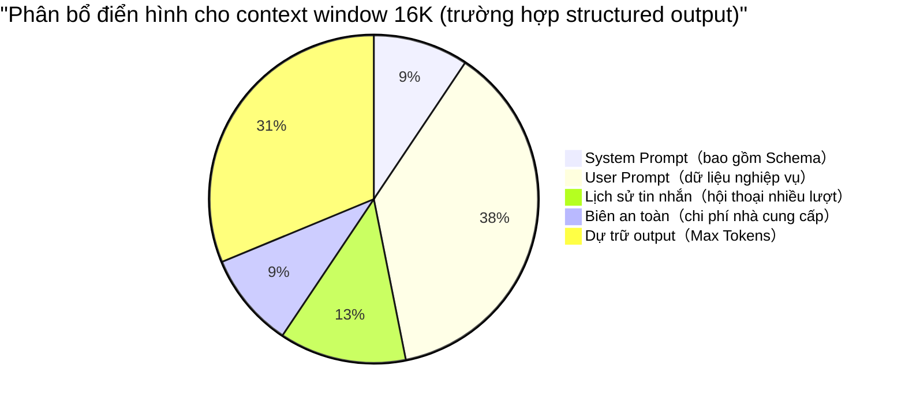

<!-- @include: @small-advertisement.snippet.md -->

Trong quá trình tìm hiểu về RAG, Agent workflow, MCP protocol và các kiến trúc phức tạp khác, tôi nhận ra một hiện tượng rất phổ biến: nhiều lập trình viên khi xây dựng Agent workflow hoặc tinh chỉnh RAG retrieval thường vấp phải những lỗi cơ bản nhất từ tham số LLM ở tầng dưới cùng. Ví dụ: tại sao đã set Temperature bằng 0 mà structured output vẫn thỉnh thoảng bị lỗi? Tại sao nhét tài liệu dài vào mô hình thì nó như "mất trí nhớ", bỏ qua những chỉ dẫn quan trọng trong System Prompt?

**Muốn xây tòa cao ốc phải vững nền móng.** Nếu không nắm rõ nguyên lý cơ bản về cách LLM xử lý dữ liệu, dù thiết kế pattern cao siêu đến đâu cũng sẽ trở nên mong manh trong môi trường production.

Vì vậy, bài viết khai sáng cơ bản này ra đời. Chúng ta sẽ tạm gác lại thiết kế kiến trúc ở tầng trên, quay về điểm khởi đầu của mọi thứ. Mô hình ngôn ngữ lớn không có phép màu, ở tầng dưới chỉ có toán học và kỹ thuật thuần túy. Tiếp theo, chúng ta sẽ mở chiếc hộp đen LLM, biến những từ khóa như Token, context window, Temperature mà bạn thường gặp khi gọi API trở thành các khái niệm kỹ thuật rõ ràng và có thể kiểm soát được. Sau khi đọc bài này bạn sẽ hiểu:

1. Mô hình ngôn ngữ lớn (LLM) thực sự đang làm gì?
2. ⭐ Token là gì? Tại sao tiếng Trung và tiếng Anh tiêu thụ Token khác nhau?
3. ⭐ Context window là gì? Tại sao có giới hạn?
4. ⭐ Các Sampling Parameters như Temperature, Top-p, Top-k ảnh hưởng đến output như thế nào?
5. Làm thế nào để lập Token budget? Input/Output được tính phí như thế nào?

## LLM thực sự đang làm gì

### Hiểu LLM trong một câu

Khi bạn gõ "Hôm nay thời tiết thật" trên bàn phím, nó sẽ tự động gợi ý "đẹp" — LLM về bản chất làm điều tương tự, chỉ là nó không nhìn vào vài ký tự trước mà nhìn vào hàng nghìn thậm chí hàng trăm nghìn ký tự trước đó, và mỗi lần chỉ "điền" một Token (mảnh văn bản), sau đó thêm nội dung vừa điền vào context, rồi tiếp tục dự đoán cái tiếp theo, cứ thế lặp đi lặp lại cho đến khi tạo ra câu trả lời hoàn chỉnh.

Quá trình này được gọi là **Autoregressive Generation (Sinh tự hồi quy)**.

Hiểu được điều này, tất cả các khái niệm sau đây đều có nền tảng:

- **Token**: Mảnh văn bản mà mô hình "điền" ở mỗi bước, chính là một Token.
- **Context window**: Lượng văn bản tối đa mà mô hình có thể "nhìn thấy" trước khi "điền".
- **Temperature / Top-p**: Chiến lược mà mô hình "chọn cái nào" trong số nhiều mảnh ứng viên.
- **Max Tokens**: Số bước tối đa bạn cho phép mô hình "điền".

Với mental model này, chúng ta sẽ lần lượt triển khai từng khái niệm.

### Bản đồ khái niệm tổng quan

Trước khi đi sâu vào từng khái niệm, hãy xem một sơ đồ luồng gọi hoàn chỉnh, giúp bạn xây dựng nhận thức tổng quan trong 30 giây:

```
Đầu vào người dùng
  ↓
[Tokenizer] → Token sequence
  ↓
Đưa vào context window (System Prompt + User Prompt + Lịch sử + RAG fragments)
  ↓                                              ↑
Suy luận mô hình (Self-attention mechanism)    [Embedding + Vector search]
  ↓                                         Truy xuất fragments liên quan từ knowledge base
logits → [Temperature/Top-p/Top-k] → Sample Token tiếp theo
  ↓
Lặp lại cho đến EOS hoặc Max Tokens
  ↓
Phân tích cú pháp & xác thực structured output
  ↓
Tiêu thụ nghiệp vụ
```

Mỗi section tiếp theo đều có thể tìm thấy vị trí tương ứng trên sơ đồ này.

### Token: "Đơn vị đọc" của mô hình

Bạn có thể hiểu Token như "đơn vị đọc của mô hình". Con người đọc chữ bằng cách đọc từng ký tự hoặc từng từ; nhưng mô hình không đọc theo ký tự hay từ — nó dùng một "quy tắc cắt chữ" riêng (gọi là Tokenizer) để cắt văn bản thành các mảnh có kích thước khác nhau, mỗi mảnh là một Token.

**Tại sao không cắt thẳng theo ký tự hay từ?** Vì mô hình cần cân bằng giữa "kích thước từ điển" và "độ dài chuỗi":

- Nếu mỗi ký tự là một Token, từ điển nhỏ nhưng chuỗi dài (mô hình cần "điền" nhiều bước hơn);
- Nếu mỗi từ là một Token, chuỗi ngắn nhưng từ điển sẽ bùng nổ (tiếng Trung có quá nhiều tổ hợp từ).

Vì vậy thực tế dùng một phương án trung gian — **thuật toán cắt subword** (như BPE, Unigram), nó giữ nguyên các từ tần suất cao, cắt các từ ít phổ biến thành các mảnh nhỏ hơn.

> **💡 Một trực giác**: Bạn có thể tưởng tượng Token như các mảnh ghép lego — "mảnh lego" phổ biến thì lớn hơn (ví dụ "xin chào" có thể là một Token), còn các từ ít dùng sẽ bị cắt thành các mảnh cơ bản nhỏ hơn để ghép lại.

**Token không phải là "một ký tự" hay "một từ" theo nghĩa chính xác**:

- Tiếng Anh có thể một từ bị cắt thành nhiều Token;
- Tiếng Trung có thể một từ bị cắt thành nhiều Token, hoặc nhiều ký tự gộp thành một Token (tùy thuộc vào tần suất và từ điển).

Do đó, trong kỹ thuật thường chỉ dùng **ước tính theo kinh nghiệm** để lập kế hoạch dung lượng, còn dùng **usage thực tế trả về từ API** (nếu nhà cung cấp hỗ trợ) để tính phí và giám sát chính xác.

**Ước tính theo kinh nghiệm (chỉ dùng cho lập kế hoạch sơ bộ)**:

- Tiếng Anh: 1 Token tương đương khoảng 3~4 ký tự (tùy loại văn bản).
- Tiếng Trung: 1 Token thường dao động trong khoảng 1~2 Hán tự (liên quan chặt chẽ đến tỷ lệ kết hợp).

Lấy dữ liệu chính thức của DeepSeek làm ví dụ: 1 ký tự tiếng Anh tiêu thụ khoảng 0.3 Token, 1 ký tự tiếng Trung tiêu thụ khoảng 0.6 Token. Quy đổi ra, 1 Token tương đương khoảng 3.3 ký tự tiếng Anh hoặc 1.7 Hán tự, phù hợp với giá trị kinh nghiệm trên.

**💡 Xu hướng chi phí**: Chi phí Token có liên quan mạnh đến phiên bản encoder (Tokenizer). Các mô hình đầu (như GPT-3.5) có tỷ lệ nén tiếng Trung thấp (khoảng 1 ký tự 1.5~2 Token). GPT-4o sử dụng Tokenizer o200k_base (từ điển khoảng 200.000), cải thiện tỷ lệ nén tiếng Trung so với cl100k_base; Qwen2.5 có từ điển khoảng 150.000, cũng được tối ưu cho các từ tiếng Trung thông dụng. Dữ liệu thực tế thay đổi theo loại văn bản: văn bản tin tức khoảng 1.5 ký tự/Token, tài liệu kỹ thuật khoảng 1.2 ký tự/Token. "Gần 1 ký tự 1 Token" chỉ áp dụng cho từ vựng tần suất cao, không nên dùng làm cơ sở ước tính chi phí. **Khi lập ngân sách chi phí, hãy tham khảo demo Tokenizer chính thức của phiên bản mô hình hiện tại, không dùng kinh nghiệm từ mô hình cũ.**

Độ chi tiết của phân tách Token ảnh hưởng trực tiếp đến khả năng hiểu của mô hình. Đặc biệt trong xử lý tiếng Trung, sự mơ hồ trong phân từ (nhiều cách cắt cho cùng một chuỗi ký tự) và độ hạt của việc cắt ký tự hiếm/thuật ngữ chuyên ngành tần suất thấp đều ảnh hưởng trực tiếp đến hiệu quả hiểu ngữ nghĩa của mô hình.

**Ví dụ về quá trình Token hóa**:

- Văn bản gốc: `你好，我是 Guide。`
- Cắt: `[你好]` `[，]` `[我是]` `[Guide]` `[。]`
- Thống kê: Văn bản gốc 12 ký tự → Số Token: 5 → Tỷ lệ nén khoảng 2.4 lần


> **⚠️ Lưu ý**: Việc cắt Token thực tế được thực hiện bởi Tokenizer của nhà cung cấp mô hình, các nhà cung cấp khác nhau có thể tạo ra các chuỗi Token khác nhau cho cùng một văn bản. Trong môi trường production, nên sử dụng công cụ Tokenizer của nhà cung cấp tương ứng để đếm chính xác.

**Token đặc biệt**: Ngoài các Token tương ứng với nội dung văn bản, mô hình còn sử dụng một số ký hiệu đặc biệt nội bộ, những ký hiệu này cũng được tính vào tổng số Token:

| Token đặc biệt               | Mục đích                                 | Ví dụ          |
| ---------------------------- | ---------------------------------------- | -------------- |
| BOS（Beginning of Sequence） | Đánh dấu bắt đầu chuỗi                   | `<s>`          |
| EOS（End of Sequence）       | Đánh dấu kết thúc chuỗi                  | `</s>`         |
| PAD（Padding）               | Điền đệm chuỗi ngắn khi xử lý theo batch | `<pad>`        |
| Ký hiệu gọi công cụ          | Ký hiệu ranh giới trong Function Calling | `<tool_call/>` |

Các Token đặc biệt này thường không hiển thị với người dùng, nhưng chiếm dụng context window. Khi cần đếm chính xác, nên sử dụng công cụ Tokenizer chính thức thay vì ước tính thủ công.

### Token đa phương thức: Hình ảnh cũng tiêu thụ Token

Các mô hình như GPT-4o, Claude 3.5, Gemini đã hỗ trợ đầu vào hình ảnh. **Hình ảnh không "miễn phí"** — nó sẽ được chuyển đổi thành một loạt Token, cũng chiếm dụng context window.

**Quy tắc ước tính sơ bộ**:

| Mô hình    | Cách tính Token hình ảnh                             | Một ảnh 1024×1024 tương đương                                        |
| ---------- | ---------------------------------------------------- | -------------------------------------------------------------------- |
| GPT-4o     | Theo độ phân giải + chế độ chi tiết                  | Độ chi tiết thấp ~85 tokens, cao ~1105~765 tokens (tùy vào cropping) |
| Claude 3.5 | Cố định ~5 tokens (thumbnail) hoặc ~85 tokens (full) | Tùy chế độ hình ảnh                                                  |
| Gemini     | Tính theo độ phân giải                               | ~258 tokens (tiêu chuẩn)                                             |

**Gợi ý kỹ thuật**:

- Khi làm multimodal RAG, cần đưa Token hình ảnh vào ngân sách
- Khi xử lý hình ảnh theo batch, lưu ý TTFT (time to first token) sẽ tăng đáng kể
- Nếu chỉ cần OCR, hãy xem xét dùng dịch vụ OCR chuyên dụng để trích xuất văn bản trước, rồi mới đưa vào mô hình dưới dạng text thuần

### ⭐ Context Window (Cửa sổ ngữ cảnh)

**Context window** (hay còn gọi là "context length") là **"Working Memory" (Bộ nhớ làm việc)** của LLM. Nó quyết định lượng văn bản (tính bằng Token) mà mô hình có thể xử lý hoặc "ghi nhớ" tại bất kỳ thời điểm nào.

- **Tính liên tục hội thoại**: Nó quyết định mô hình có thể thực hiện hội thoại nhiều lượt dài bao nhiêu mà không quên mất chi tiết ban đầu.
- **Khả năng xử lý một lần**: Nó quyết định kích thước tối đa của tài liệu, codebase hay mẫu dữ liệu mà mô hình có thể xử lý trong một lần.

"Mô hình hỗ trợ 128K/200K/1M" có nghĩa là giới hạn Token tổng cộng trong **một lần gọi** có thể đưa vào mô hình. **Hầu hết context window của mô hình bao gồm tổng input và output**, nhưng một số nhà cung cấp (như Google Gemini) đặt giới hạn riêng cho input và output, hãy tham khảo tài liệu API cụ thể. Ngoài ra, context window thường bị chiếm dụng bởi chi phí ẩn:


- **System Prompt**: Chỉ dẫn hệ thống điều chỉnh hành vi mô hình (thường ẩn với người dùng nhưng chiếm window).
- **User Prompt**: Dữ liệu và chỉ dẫn nghiệp vụ.
- **Lịch sử hội thoại nhiều lượt**: Bản ghi tin nhắn trước đây.
- **RAG retrieval fragments**: Thông tin bổ sung được truy xuất từ knowledge base bên ngoài.
- **Tool calling schema**: Định nghĩa function và cấu trúc tham số.
- **Chi phí định dạng**: Ký tự đặc biệt, ký tự xuống dòng, Markdown markup, v.v.
- **Token output do mô hình sinh ra**: **(Quan trọng)** Output cũng chiếm dụng context window.

Do đó, "nội dung nghiệp vụ hữu ích" mà bạn thực sự có thể nhét vào Prompt thường ít hơn nhiều so với giới hạn danh nghĩa.

**⚠️ Lưu ý giới hạn cứng output**: Context window ≠ độ dài sinh tối đa. Nhiều mô hình hỗ trợ input 128K hoặc thậm chí 1M, nhưng giới hạn output một lần thay đổi theo API: OpenAI Chat Completions API dùng tham số `max_tokens` (GPT-4o tối đa output 16K), một số mô hình mới hỗ trợ `max_completion_tokens` (như dòng o1), DeepSeek V3 output tối đa 8K. Cần tham khảo tài liệu API của mô hình cụ thể trước khi sử dụng.

**Xử lý hội thoại nhiều lượt trong chế độ chain-of-thought**: Trong các tình huống hội thoại nhiều lượt, `reasoning_content` (quá trình suy nghĩ) của các mô hình chain-of-thought (như DeepSeek-R1) thường **không** được tự động đưa vào context của lượt hội thoại tiếp theo. Chỉ có `content` (câu trả lời cuối cùng) mới tham gia vào hội thoại tiếp theo. Điều này có nghĩa là:

- Bạn không cần dành thêm context window cho quá trình suy nghĩ.
- Nhưng nếu hội thoại tiếp theo cần tham khảo quá trình suy luận trước, bạn phải thủ công nối `reasoning_content` vào lịch sử tin nhắn.
- SDK của một số nhà cung cấp sẽ tự động xử lý sự khác biệt này, nên tham khảo tài liệu cụ thể để xác nhận hành vi.

### ⭐ Tại sao context window có giới hạn?

Context window không phải càng lớn càng tốt, nó bị giới hạn bởi **Self-Attention Mechanism (Cơ chế tự chú ý)** của kiến trúc Transformer:

- **Chi phí tính toán tăng theo bình phương**: Nhu cầu tính toán có quan hệ bậc hai với độ dài chuỗi (O(N²)). Token input tăng gấp đôi, nhu cầu xử lý có thể tăng gấp 4. Điều này có nghĩa **context dài hơn = chi phí cao hơn + tốc độ inference chậm hơn**.
- **Độ trễ inference tăng**: Khi context dài hơn, mô hình cần chú ý đến nhiều Token lịch sử hơn khi sinh mỗi Token mới, dẫn đến tốc độ output giảm dần (đặc biệt TTFT sẽ tăng đáng kể).
- **Rủi ro bảo mật tăng**: Context dài hơn có nghĩa là bề mặt tấn công lớn hơn, mô hình có thể dễ bị ảnh hưởng bởi các cuộc tấn công "jailbreak" thông qua adversarial prompts.

**Các kỹ thuật tối ưu kỹ thuật**: Trong thực tế, FlashAttention (IO-aware exact attention), GQA/MQA (Grouped/Multi-Query Attention), Sliding Window Attention (như Mistral), Ring Attention và các kỹ thuật khác đã giảm đáng kể chi phí tính toán và bộ nhớ thực tế của long context. Nhưng độ phức tạp lý thuyết O(N²) vẫn là nút thắt cơ bản trong việc mở rộng giới hạn.

### Biểu hiện thực tế của context overflow

Khi context gần đến giới hạn hoặc nội dung quá dài, các hiện tượng phổ biến bao gồm:

- **Mô hình bỏ qua ràng buộc ban đầu**: System Prompt yêu cầu "phải output JSON" nhưng vì khoảng cách đến điểm sinh quá xa, attention không đủ dẫn đến bị bỏ qua. **Chiến lược giảm thiểu**: Lặp lại nhấn mạnh ràng buộc quan trọng ở cuối User Prompt, hoặc dùng Strict Mode của Structured Outputs để bắt buộc từ tầng giải mã.
- **Hiện tượng "Lost in the Middle"** (Liu et al., 2023): Ngay cả với mô hình 1M window, mô hình nhạy cảm nhất với thông tin ở **đầu và cuối**, tỷ lệ recall của thông tin ở **phần giữa** giảm đáng kể.
- **Câu trả lời trôi dạt**: Nửa đầu vẫn xoay quanh câu hỏi, nửa sau bắt đầu tổng kết/mở rộng/lạc đề.
- **RAG thất bại**: Quá nhiều tài liệu được truy xuất, thông tin quan trọng bị pha loãng; hoặc bị cắt ngắn dẫn đến chuỗi bằng chứng bị đứt gãy.
- **Chi phí và độ trễ tăng vọt**: Context 1M sẽ làm TTFT tăng đáng kể, và chi phí Token tăng tuyến tính.

Trong dự án này, bạn có thể thấy hai phương pháp điển hình để "kiểm soát context":

- **Cắt ngắn thông minh**: Đừng cắt ngắn chuỗi một cách thô bạo. Ví dụ như **trích xuất tóm tắt** hoặc **trích xuất thông tin quan trọng** từ nội dung CV, tránh nhét nguyên văn bản dài vào evaluation prompt.
- **Xử lý theo batch và tổng hợp hai giai đoạn**: Đánh giá phỏng vấn dài được chia theo batch đánh giá từng đoạn, rồi tổng hợp lần hai, tránh một lần gọi Token quá lớn.

Dù có window 1M, vẫn nên đặt **ngân sách mềm** (ví dụ 128K). Trừ khi cần thiết, đừng đưa toàn bộ input, để cân bằng chi phí, độ trễ và độ chính xác.

### Sự khác biệt tính phí: Input Token ≠ Output Token

Hầu hết nhà cung cấp áp dụng mức phí khác nhau cho **Input Token** và **Output Token**, thông thường giá output gấp **2~4 lần** giá input:

| Mô hình           | Giá input (/1M Tokens) | Giá output (/1M Tokens) | Tỷ lệ output/input |
| ----------------- | ---------------------- | ----------------------- | ------------------ |
| GPT-4o            | \$2.50                 | \$10.00                 | 4x                 |
| Claude 3.5 Sonnet | \$3.00                 | \$15.00                 | 5x                 |
| DeepSeek V3       | ¥0.5                   | ¥2.0                    | 4x                 |
| DeepSeek-R1       | ¥4.0                   | ¥16.0                   | 4x                 |

**Gợi ý kỹ thuật**:

- Prompt dài + output ngắn = cách gọi tiết kiệm hơn
- Trong RAG cần kiểm soát số lượng fragment được truy xuất, tránh Token input tăng đột biến
- Reasoning tokens của mô hình chain-of-thought thường tính theo giá output, chi phí cao hơn

### Prompt Caching: Giải pháp tiết kiệm chi phí cho prefix lặp lại

Khi request của bạn có **tiền tố cố định lặp lại nhiều lần** (như System Prompt, long RAG Context), bạn có thể dùng **Prompt Caching** để giảm chi phí đáng kể.

**Nguyên lý**: Nhà cung cấp sẽ cache "phần tiền tố có thể tái sử dụng" trong request của bạn. Lần request tiếp theo nếu tiền tố giống nhau, phần này không bị tính phí lại, chỉ thu "phí đọc cache" (thường là 10%~50% giá bình thường).

**Các trường hợp áp dụng điển hình**:

- Hội thoại nhiều lượt (System Prompt + History Message không đổi)
- Ứng dụng RAG (tỷ lệ lặp lại fragment cao)
- Đánh giá theo batch (cùng một System Prompt, các CV/bài viết khác nhau)

**Tình trạng hỗ trợ của các nhà cung cấp**:

| Nhà cung cấp | Tên tính năng   | Thời gian cache | Ưu đãi khi hit cache |
| ------------ | --------------- | --------------- | -------------------- |
| OpenAI       | Prompt Caching  | 5~10 phút       | ~50% giá input       |
| Anthropic    | Prompt Caching  | 5 phút          | ~10% giá input       |
| DeepSeek     | Context Caching | 10~30 phút      | ~25% giá input       |

**Khuyến nghị kỹ thuật**:

1. Đặt **nội dung không đổi lên trước** (System Prompt, định nghĩa công cụ, RAG Context), đặt **nội dung thay đổi lên sau** (User Prompt)
2. Giám sát các chỉ số `cache_read_tokens` và `cache_creation_tokens`, xác minh tỷ lệ hit cache
3. Các tác vụ batch nên hoàn thành trong khoảng thời gian cache

Dù có window 1M, vẫn nên đặt **ngân sách mềm** (ví dụ 128K). Trừ khi cần thiết, đừng đưa toàn bộ input, để cân bằng chi phí, độ trễ và độ chính xác.

### Lập Token budget cho một lần gọi

Coi "context window" như một thùng chứa có dung lượng cố định, sơ đồ dưới đây mô tả phân bổ Token budget điển hình cho một lần gọi:



> Phân bổ này chỉ mang tính minh họa, tỷ lệ thực tế cần điều chỉnh động theo tình huống nghiệp vụ.

Cách lập ngân sách thực dụng nhất là:

**window ≥ input_tokens + max_output_tokens**

Đối với mô hình chain-of-thought, công thức nên điều chỉnh thành:

**window ≥ input_tokens + reasoning_tokens + max_output_tokens**

Trong đó `reasoning_tokens` (số Token trong chuỗi suy nghĩ) khó ước tính chính xác, nên dự trữ bằng 2~3 lần `max_output_tokens`.

Trong đó `input_tokens` ít nhất bao gồm:

- system prompt (bao gồm schema / định nghĩa công cụ)
- user prompt (bao gồm văn bản thực tế sau khi thay thế biến)
- lịch sử tin nhắn (nếu bạn làm hội thoại nhiều lượt)
- RAG context (nếu bạn đã ghép vào)

Trong kỹ thuật, nên làm ngược lại khi lập ngân sách (vì output thường dễ kiểm soát hơn):

1. Đặt `max_output_tokens` trước (structured output thường không cần quá dài)
2. Dự trữ biên an toàn cho input (ví dụ thêm 10%~20% cho "chi phí phụ của nhà cung cấp": bao bọc function calling, hidden tokens, sự khác biệt encoding, v.v.)
3. Khi vượt ngân sách, dùng chiến lược "giảm input" có thể giải thích được thay vì "đặt cược mô hình sẽ tự kiềm chế":
   - Ưu tiên giảm Top-K của RAG hoặc loại trùng lặp fragment
   - Tóm tắt/cắt ngắn các trường dài (như CV, câu trả lời dài)
   - Chia tác vụ nhiều đoạn thành nhiều lần gọi (đánh giá theo batch, sinh hai giai đoạn)

## Decoding và Sampling Parameters

### Hiểu quá trình "chọn từ" trước

Ở mỗi bước, mô hình sẽ cho điểm **mỗi** Token ứng viên trong từ điển (nội bộ gọi là **logits**), điểm cao hơn có nghĩa mô hình cho rằng từ đó nên xuất hiện ở đây hơn.

Lấy ví dụ, giả sử mô hình đang điền "Hôm nay thời tiết thật\_\_", nó có thể đưa ra các điểm như sau:

| Token ứng viên | Điểm gốc (logit) |
| -------------- | ---------------- |
| đẹp            | 5.0              |
| tốt            | 3.2              |
| tuyệt          | 2.1              |
| tệ             | 0.5              |
| màu tím        | -8.0             |

Nhưng điểm gốc không phải xác suất — cần qua một phép biến đổi toán học (**softmax**) mới trở thành "xác suất mỗi ứng viên được chọn". Sau biến đổi xấp xỉ:

| Token ứng viên | Xác suất |
| -------------- | -------- |
| đẹp            | 62%      |
| tốt            | 20%      |
| tuyệt          | 10%      |
| tệ             | 5%       |
| màu tím        | ≈ 0%     |

Cuối cùng, mô hình "rút thăm" (sampling) theo phân phối xác suất này để quyết định output Token nào.

**Decoding parameters** (Temperature, Top-p, Top-k, v.v.) chính là kiểm soát trong quá trình **"cho điểm → xác suất → rút thăm"** này. Tác dụng của chúng có thể hiểu như sau:

- **Temperature**: Điều chỉnh "hình dạng" của phân phối xác suất — làm cho các lựa chọn điểm cao nổi bật hơn, hoặc làm các lựa chọn đồng đều hơn
- **Top-p / Top-k**: Loại bỏ trực tiếp các ứng viên không đáng tin, thu hẹp "hồ rút thăm"
- **Penalty series**: Hạ điểm các từ đã xuất hiện trước đó, ngăn "lặp đi lặp lại"

Dưới đây sẽ triển khai từng cái.

### ⭐ Temperature: Kiểm soát "mức độ mạo hiểm" của mô hình


Nguyên lý hoạt động của Temperature rất đơn giản: trước khi softmax, **chia** tất cả điểm cho giá trị nhiệt độ T.

**p(t) = softmax(z_t / T)**

- (T ≈ 1): Giữ nguyên phân phối gốc.
- (T < 1): Phân phối nhọn hơn, thiên về chọn Token xác suất cao hơn (ổn định hơn, ít phân tán hơn).
- (T > 1): Phân phối phẳng hơn, Token xác suất thấp dễ được lấy mẫu hơn (sáng tạo hơn, cũng dễ lệch khỏi ràng buộc hơn).

Vậy sau khi chia cho T sẽ xảy ra gì? Vẫn dùng ví dụ "Hôm nay thời tiết thật\_\_":

- **T = 0.2 (nhiệt độ thấp) — "Chế độ bảo thủ"**: Khoảng cách điểm được khuếch đại (tất cả chia cho 0.2, tương đương nhân với 5), "đẹp" vốn đã dẫn đầu sẽ tăng vọt lên ~98%, hầu như mỗi lần đều chọn nó.
- **T = 1.0 (nhiệt độ mặc định)**: Giữ nguyên phân phối gốc, "đẹp" 62%, "tốt" 20%... lấy mẫu theo xác suất bình thường.
- **T = 1.5 (nhiệt độ cao) — "Chế độ mạo hiểm"**: Khoảng cách điểm bị thu hẹp (tất cả chia cho 1.5), "đẹp" giảm xuống ~35%, "tuyệt", "tốt" thậm chí "tệ" đều có cơ hội được chọn cao hơn.

Tóm tắt một câu: **Nhiệt độ càng thấp, output càng xác định, càng "ổn định"; nhiệt độ càng cao, output càng ngẫu nhiên, càng "bùng nổ".**

**Khuyến nghị kỹ thuật (giá trị kinh nghiệm, không phải quy tắc cứng)**:

| Tình huống                              | Nhiệt độ khuyến nghị | Giải thích                                                        |
| --------------------------------------- | -------------------- | ----------------------------------------------------------------- |
| Trích xuất có cấu trúc / JSON output    | 0 ~ 0.3              | Kết hợp strict schema + chiến lược retry khi lỗi parse            |
| Đánh giá / Phân tích / Code review      | 0.4 ~ 0.8            | Cân bằng tính xác định và đa dạng biểu đạt                        |
| Nội dung sáng tạo (văn bản, brainstorm) | 0.8 ~ 1.2+           | Tăng đa dạng nhưng phải chấp nhận rủi ro tính nhất quán định dạng |

> **Muốn tính xác định?** Nếu cần unit test idempotent hoặc tái hiện kết quả, chỉ set `Temperature=0` là không đủ (lỗi dấu phẩy động GPU vẫn có thể gây ra tính không xác định). Nên đồng thời cấu hình **tham số `seed`** (như OpenAI/DeepSeek hỗ trợ). Seed cố định + nhiệt độ thấp có thể giảm tối đa biến động.
>
> Lưu ý rằng ngay cả khi cấu hình `seed`, các tình huống sau vẫn có thể gây kết quả không nhất quán:
>
> - Cập nhật phiên bản mô hình (thay đổi trọng số nền tảng)
> - Gọi xuyên vùng (các cluster khác nhau có thể triển khai phiên bản khác nhau)
> - Top-p sampling (ngay cả T=0, nếu Top-p<1 vẫn có tính ngẫu nhiên)
>
> Nên chỉ dùng LLM call trong CI/CD cho smoke test, logic cốt lõi vẫn dựa vào Mock.

### Top-p (Nucleus Sampling) và Top-k: Thu hẹp "hồ rút thăm"

Temperature điều chỉnh hình dạng phân phối xác suất, nhưng dù điều chỉnh thế nào, tất cả Token trong từ điển đều có thể được chọn về lý thuyết (dù xác suất cực thấp). Top-p và Top-k thì trực tiếp hơn — **loại thẳng các ứng viên không đáng tin ra khỏi hồ rút thăm**.

Vẫn dùng ví dụ "Hôm nay thời tiết thật\_\_":

| Token ứng viên | Xác suất | Xác suất tích lũy |
| -------------- | -------- | ----------------- |
| đẹp            | 62%      | 62%               |
| tốt            | 20%      | 82%               |
| tuyệt          | 10%      | 92%               |
| tệ             | 5%       | 97%               |
| màu tím        | ≈0%      | ≈100%             |

- **Top-k = 3**: Chỉ giữ 3 ứng viên xác suất cao nhất (đẹp, tốt, tuyệt), phân bổ lại xác suất trong 3 cái này rồi lấy mẫu. "Tệ" và "màu tím" bị loại ngay.
- **Top-p = 0.9**: Tích lũy xác suất từ cao đến thấp, giữ tập hợp nhỏ nhất vừa đạt 90%. Ở đây "đẹp + tốt + tuyệt = 92% ≥ 90%", nên giữ 3 cái này. Nếu trong một tình huống nào đó phần đầu tập trung hơn (ví dụ ứng viên đầu chiếm 95%), Top-p sẽ tự động chỉ giữ 1 cái — đây là điểm linh hoạt hơn so với Top-k.

**Sự khác biệt giữa hai loại**: Top-k cố định giữ k ứng viên, không quan tâm phân phối xác suất trông như thế nào; Top-p tự động điều chỉnh số lượng ứng viên theo xác suất. Trong thực tế **Top-p phổ biến hơn**, vì nó tự thích nghi với các phân phối xác suất khác nhau.

**Các kết hợp phổ biến**:

| Kết hợp                              | Hiệu quả                                                          | Trường hợp áp dụng                         |
| ------------------------------------ | ----------------------------------------------------------------- | ------------------------------------------ |
| T=0 (Greedy decoding)                | Luôn chọn điểm cao nhất, hoàn toàn xác định                       | Structured output, tình huống cần tái hiện |
| Nhiệt độ thấp + Top-p=0.9            | Tương đối ổn định nhưng cho phép một số biến đổi về cách diễn đạt | Báo cáo phân tích, tóm tắt                 |
| Nhiệt độ cao/trung bình + Top-p=0.95 | Đa dạng cao nhưng loại trừ các lựa chọn cực đoan                  | Viết sáng tạo, hội thoại                   |

> ⚠️ Lưu ý: Greedy decoding tuy ổn định nhất nhưng có thể dễ rơi vào vòng lặp lặp lại (ví dụ liên tục output cùng một đoạn văn).

### Max Tokens / Stop Sequences: Kiểm soát khi nào output dừng lại

Về mặt kỹ thuật cần lưu ý hai điểm:

- **Max Tokens là giới hạn cứng**: Đến giới hạn sẽ bị **cắt ngắn bắt buộc** — dù mô hình đang viết giữa chừng cũng bị "cắt đứt". Hậu quả thường gặp: JSON thiếu dấu ngoặc phải, danh sách thiếu vài mục cuối, câu viết dang dở.
- **Stop Sequences (từ dừng) là cắt mềm**: Bạn có thể chỉ định một số chuỗi (như `"\n\n"` hoặc `"```"`), mô hình sẽ tự động dừng khi tạo ra các nội dung này. Nhưng nếu stop được thiết kế không đúng, có thể cắt ngắn sớm các trường quan trọng.

Do đó, trong trường hợp structured output phải thiết kế "rủi ro cắt ngắn" như một loại đường thất bại cần có chiến lược giảm thiểu.

**Sự khác biệt tính Token trong chế độ chain-of-thought**: Đối với các mô hình hỗ trợ chain-of-thought (như DeepSeek-R1), giá trị `max_tokens` thường **bao gồm cả quá trình suy nghĩ + câu trả lời cuối cùng**. Ví dụ set `max_tokens=8192`, mô hình có thể tiêu thụ 5000 tokens cho chuỗi suy nghĩ, câu trả lời cuối chỉ còn ngân sách 3192 tokens. Do đó, trong trường hợp chain-of-thought cần dự trữ buffer lớn hơn cho quá trình suy nghĩ. Mặc định và giới hạn tối đa khác nhau đáng kể giữa các nhà cung cấp: DeepSeek-R1 mặc định 32K, tối đa 64K; giới hạn output của dòng OpenAI o1 cũng cao hơn mô hình thông thường. Hãy tham khảo tài liệu API của mô hình cụ thể trước khi sử dụng.

### Repetition / Presence / Frequency Penalty: Ngăn "lặp đi lặp lại"

Bạn có thể đã gặp trường hợp mô hình liên tục output cùng một câu, hoặc lặp đi lặp lại cùng một quan điểm trong câu trả lời dài. Các tham số Penalty được dùng để giảm thiểu vấn đề này, chúng **hạ điểm của các Token đã xuất hiện** trong quá trình giải mã:

| Tham số            | Tác dụng                                               | Hiểu thông thường                        |
| ------------------ | ------------------------------------------------------ | ---------------------------------------- |
| Repetition Penalty | Giảm xác suất của tất cả Token đã xuất hiện            | "Từ đã nói rồi, nói lại thì bị trừ điểm" |
| Presence Penalty   | Trừ điểm miễn là Token đã xuất hiện (không xét số lần) | "Khuyến khích nói chủ đề mới"            |
| Frequency Penalty  | Token xuất hiện càng nhiều lần trừ điểm càng nặng      | "Cùng một từ nói ba lần? Phạt nặng"      |

**⚠️ Bẫy kỹ thuật**:

- **Đừng thêm Penalty tùy tiện cho structured output**: Các tên trường trong JSON (như `"name"`, `"score"`) cần xuất hiện nhiều lần, thêm Repetition Penalty có thể "phạt" cả tên trường bắt buộc phải xuất hiện, dẫn đến output bị thiếu.
- **Đừng thêm Presence Penalty cho RAG Q&A**: Nó sẽ khuyến khích mô hình "nói điều gì đó mới", ngược lại làm giảm độ trung thành (faithfulness) với nội dung được truy xuất, tăng nguy cơ ảo giác.

**Khuyến nghị thận trọng**: Nếu bạn không chắc về ngữ nghĩa chính xác của các tham số này (định nghĩa có thể khác nhau giữa các nhà cung cấp), nên giữ giá trị mặc định. Dùng **nhiệt độ thấp + ràng buộc Prompt mạnh hơn + output ngắn hơn** để đạt sự ổn định sẽ dễ kiểm soát hơn là điều chỉnh Penalty.

### Giới hạn tham số trong chế độ chain-of-thought

Một số mô hình (như DeepSeek-R1, OpenAI o1) hỗ trợ "Thinking Mode" (chế độ suy nghĩ), sẽ output một đoạn quá trình suy luận nội bộ trước khi tạo câu trả lời cuối cùng. Các mô hình này có ràng buộc tham số đặc biệt:

**Các tham số sampling không được hỗ trợ**: Trong chế độ chain-of-thought, các tham số sau thường bị bỏ qua:

- `temperature`, `top_p`: Tham số kiểm soát sampling
- `presence_penalty`, `frequency_penalty`: Tham số phạt

**Lý do**: Mục tiêu thiết kế của chế độ chain-of-thought là để mô hình "tự do suy nghĩ", áp dụng chiến lược sampling cố định nội bộ của mô hình (cách thực hiện cụ thể khác nhau tùy nhà cung cấp), các tham số sampling mà người dùng truyền vào sẽ bị bỏ qua.

**Khuyến nghị kỹ thuật**:

- Khi gọi mô hình chain-of-thought, đừng dựa vào các tham số trên để kiểm soát phong cách output
- Nếu cần định dạng output ổn định hơn, nên dùng ràng buộc Prompt thay vì tham số sampling
- Chú ý sự khác biệt giữa trường `reasoning_content` (quá trình suy nghĩ) và trường `content` (câu trả lời cuối cùng) trong kết quả trả về

### ⭐ Streaming Output (Luồng)

Theo mặc định, API sẽ chờ mô hình tạo ra toàn bộ nội dung rồi trả về một lần. Streaming output thì **vừa sinh vừa trả về** — mô hình mỗi khi tạo ra một (hoặc vài) Token sẽ lập tức đẩy về cho client, người dùng nhìn thấy nội dung bắt đầu xuất hiện sớm hơn.

**Giá trị cốt lõi**: Cải thiện trải nghiệm người dùng, giảm TTFT (Time-To-First-Token).

**Làm rõ các hiểu nhầm phổ biến**:

- ❌ "Streaming output nhanh hơn" — Tổng thời gian (E2E latency) không nhất thiết giảm, tổng lượng Token mô hình sinh ra là như nhau
- ❌ "Streaming output rẻ hơn" — Tính phí Token không đổi, vẫn bị giới hạn/quota ảnh hưởng
- ⚠️ Nếu bạn cần structured output (như JSON), trong trường hợp streaming phải xử lý "JSON chưa hoàn chỉnh" ở tầng frontend/gateway — bạn có thể nhận được `{"name": "Zhang`, cần đợi stream kết thúc mới parse, hoặc dùng streaming JSON parser

### Logprobs (Log-xác suất)

Một số API (như OpenAI) hỗ trợ trả về **log-xác suất** (logprobs) của mỗi Token được sinh, có thể hiểu là "mức độ tự tin" của mô hình với Token đó: logprob càng gần 0, mô hình càng tự tin; giá trị càng nhỏ (như -5.0), mô hình càng "do dự".

**Các trường hợp ứng dụng kỹ thuật**:

- **Đánh giá độ tin cậy**: Khi trích xuất "số tiền: 1000", nếu logprob của Token tương ứng rất thấp, nghĩa là mô hình không chắc lắm, có thể cần kiểm tra thủ công.
- **Phát hiện bất thường**: Giám sát logprob trung bình của output mô hình trong môi trường production, nếu đột ngột giảm có thể báo hiệu Prompt drift hoặc dữ liệu đầu vào bất thường.
- **So sánh nhiều ứng viên**: Lấy Top-N Token ứng viên và xác suất, dùng để sửa lỗi hoặc xếp hạng lại lần hai.

**Lưu ý**: logprobs sẽ tăng kích thước response, và không phải tất cả nhà cung cấp đều hỗ trợ. Hãy tham khảo tài liệu API trước khi sử dụng.

### Bảng tra cứu nhanh tham số

Cuối cùng, tổng hợp một bảng tra cứu nhanh để bạn chọn kết hợp tham số theo tình huống:

| Tình huống                       | Temperature      | Top-p | Penalty      | Khuyến nghị khác                                  |
| -------------------------------- | ---------------- | ----- | ------------ | ------------------------------------------------- |
| JSON / Structured output         | 0 ~ 0.3          | 1.0   | Mặc định     | Kết hợp Strict Mode + chiến lược retry            |
| Code review / Phân tích kỹ thuật | 0.4 ~ 0.7        | 0.9   | Mặc định     | Kết hợp CoT Prompt                                |
| Hội thoại nhiều lượt             | 0.6 ~ 0.8        | 0.9   | Bật vừa phải | Kiểm soát độ dài lịch sử tin nhắn                 |
| Viết sáng tạo / Brainstorm       | 0.8 ~ 1.2        | 0.95  | Theo nhu cầu | Chấp nhận đa dạng output, làm tốt post-processing |
| Mô hình chain-of-thought         | — (không hỗ trợ) | —     | —            | Kiểm soát qua Prompt, không phải sampling         |

## Tổng kết

Khi chúng ta tích hợp mô hình ngôn ngữ lớn vào hệ thống nghiệp vụ như một thành phần cốt lõi, bước đầu tiên là phải bỏ bỏ trực giác nhân hóa và xây dựng góc nhìn khách quan của người kỹ sư. Nhìn lại nội dung khai sáng này, cốt lõi thực ra là xử lý tốt ba chiều đánh đổi kỹ thuật:

1. **Token là thước đo vật lý của chi phí và hiệu suất**: Nó không chỉ quyết định hóa đơn tính phí và độ trễ inference của bạn, mà còn quyết định độ hạt hiểu văn bản của mô hình. Khi lập kế hoạch dung lượng, phải tính theo Token, không phải theo số chữ.
2. **Context window là nguồn tài nguyên cực kỳ khan hiếm**: Dù mô hình tuyên bố hỗ trợ context 1M, không có nghĩa là có thể đổ dữ liệu không hạn chế. Phân bổ Token budget nghiêm ngặt cho Prompt, RAG retrieval fragments, lịch sử hội thoại và dự trữ output là bài học bắt buộc khi tiến vào môi trường production.
3. **Sampling parameters là bàn điều chỉnh của tình huống nghiệp vụ**: Nếu cần JSON output ổn định, hãy quyết đoán hạ thấp Temperature và kết hợp Schema nghiêm ngặt; nếu cần sáng tạo và brainstorm, hãy mở Temperature và Top-p một cách vừa phải. Đừng mê tín tham số mặc định, hãy tùy chỉnh theo tỷ lệ lỗi chấp nhận được của nghiệp vụ.

Nắm vững nền tảng tham số và nguyên lý này, khi bạn quay lại xem xét Agent orchestration, RAG retrieval hay MCP tool calling mà chúng ta đã đề cập trước đây, bạn sẽ nhận ra bản chất của những kiến trúc cao cấp đó, không gì khác hơn là điều phối tốt hơn những Token cơ bản này, quản lý chính xác hơn context window này.
