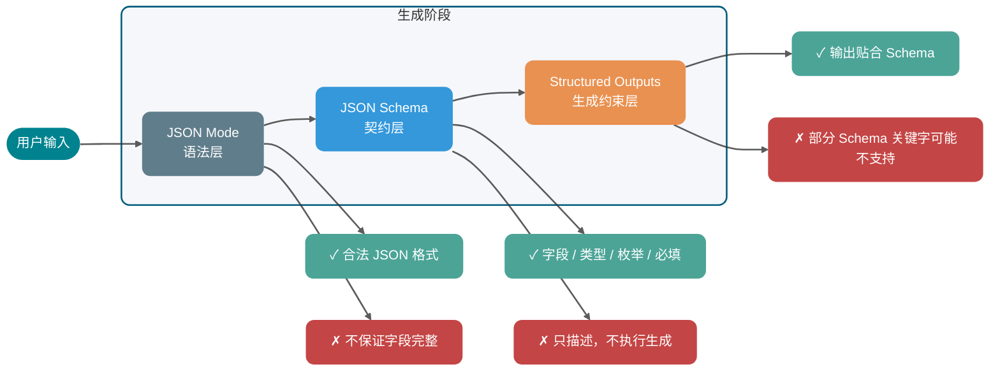
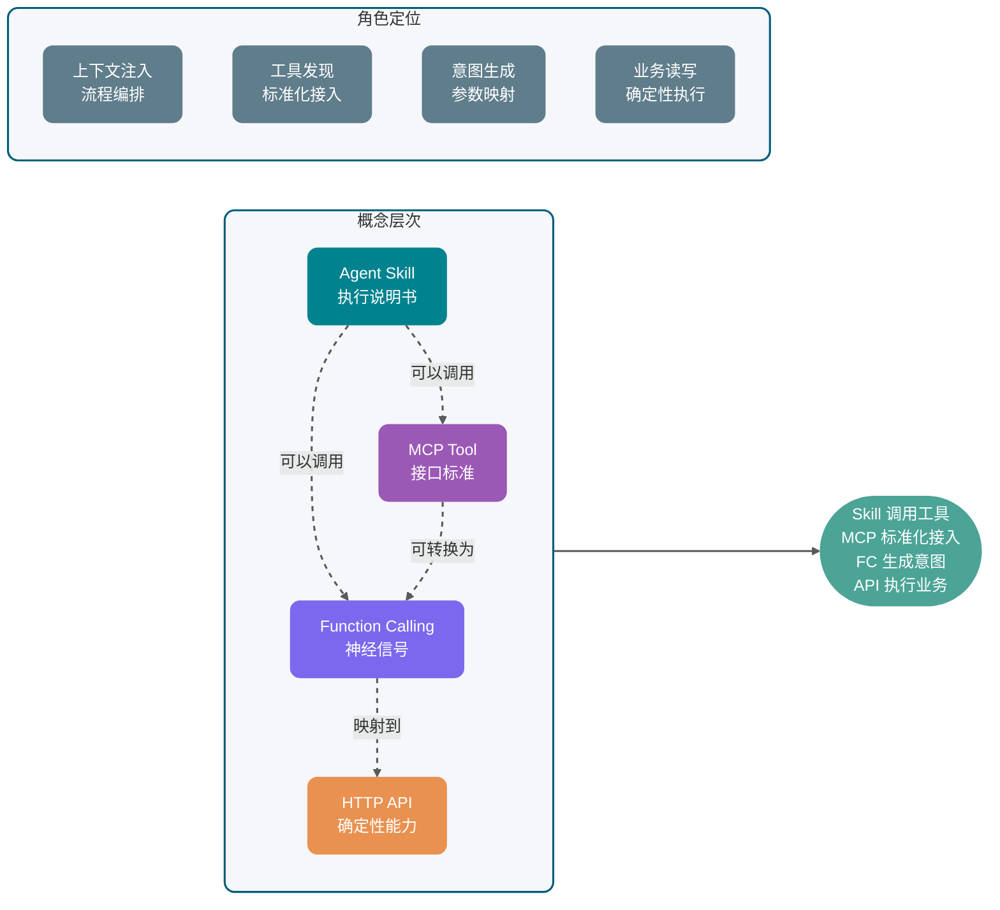
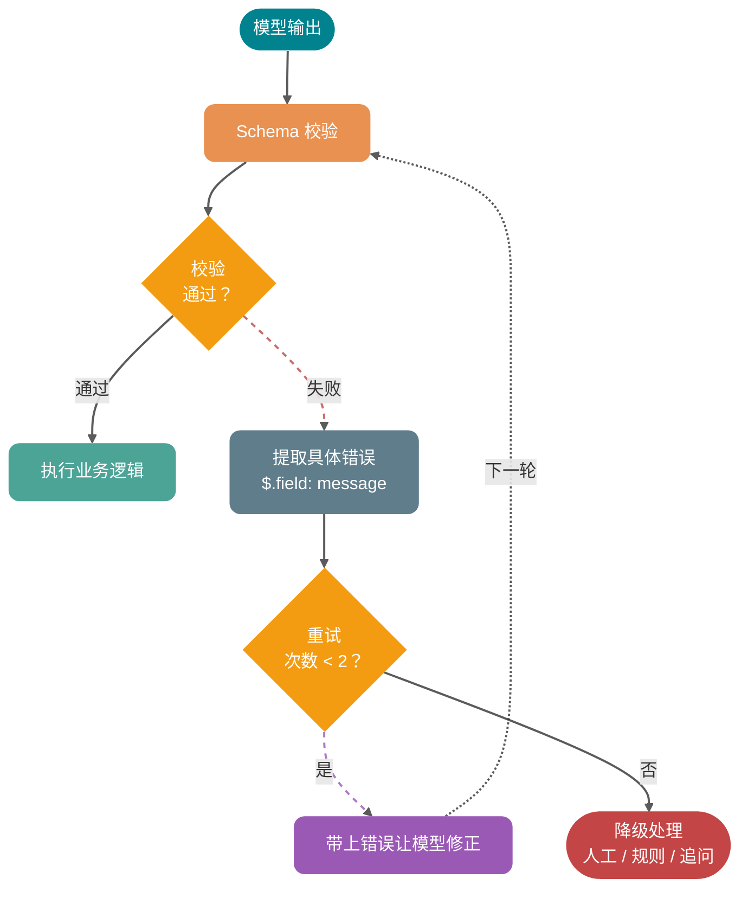
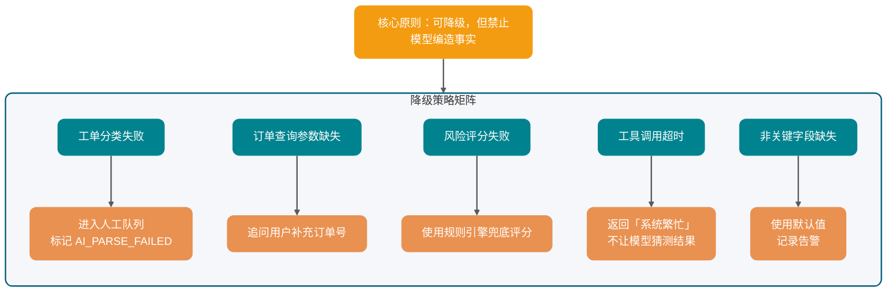

Nhiều developer lần đầu tích hợp mô hình lớn vào hệ thống nghiệp vụ đều trải qua một giai đoạn khá khó xử: Demo local chạy khá ổn, trong Prompt viết một câu "vui lòng trả về JSON", mô hình cũng ngoan ngoãn xuất ra một object; một khi vào production, vấn đề bắt đầu nổi lên.

Đôi khi nó thêm một câu "Được rồi, đây là kết quả" trước JSON; đôi khi thiếu một trường bắt buộc; đôi khi `orderId` vốn phải là số lại thành string; phức tạp hơn là khi điều kiện biên phức tạp, mô hình sẽ bổ sung một giá trị enum mà hệ thống nghiệp vụ hoàn toàn không nhận ra. Parser báo lỗi, cả pipeline đứt.

Vấn đề không phải mô hình "không nghe lời", mà là chúng ta đang nhầm **cam kết ngôn ngữ tự nhiên** thành **hợp đồng kỹ thuật**.

Vấn đề cốt lõi mà structured output cần giải quyết là nâng cấp từ "mô hình có vẻ trả về JSON" thành "dữ liệu có cấu trúc mà backend có thể tiêu thụ ổn định". RAG cần dựa vào nó để trích xuất bằng chứng, Agent cần dựa vào nó để chọn công cụ, hệ thống CSKH cần dựa vào nó để phân loại ticket, hệ thống đơn hàng cần dựa vào nó để chuyển yêu cầu ngôn ngữ tự nhiên thành tham số có thể kiểm tra.

Bài này sẽ triển khai theo một mạch chủ: trước tiên xem tại sao "chỉ dùng Prompt để đòi JSON" không ổn, sau đó xem cách dùng Schema để biến output thành hợp đồng, cuối cùng đi vào Function Calling, MCP và thực thi công cụ Java backend.

Cụ thể sẽ giải thích rõ:

1. **Tại sao "vui lòng trả về JSON" không đáng tin cậy**: format drift, thiếu trường, lỗi type, text giải thích thêm và edge case sụp đổ xảy ra như thế nào.
2. **Sự khác biệt giữa JSON Mode, JSON Schema, Structured Outputs**: mỗi cái ràng buộc gì, không ràng buộc gì.
3. **Pipeline cơ bản của Function Calling / Tool Calling**: mô hình chỉ tạo ra ý định gọi, thực sự thực thi công cụ là phía nghiệp vụ.
4. **Quan hệ giữa Function Calling, MCP Tool, HTTP API thông thường, Agent Skill**: tầng và ranh giới.
5. **Triển khai kỹ thuật của structured output**: thiết kế Schema, xác thực phía server, retry khi thất bại, chiến lược degradation và bảo mật gọi công cụ.

Lưu ý: Các sản phẩm và protocol như OpenAI, Anthropic, Gemini, MCP đều đang liên tục phát triển, hệ thống production nên lấy mô tả khả năng từ tài liệu chính thức mới nhất. Bài này không trích dẫn benchmark chưa được xác minh, cũng không đưa ra kết luận hiệu suất tuyệt đối.

## ⭐️ Tại sao "vui lòng trả về JSON" không đáng tin cậy?

Trước tiên xem một Prompt rất phổ biến:

```text
请判断下面用户反馈属于哪类工单，返回 JSON。

用户反馈：我付款成功了，但是订单一直显示待支付。
```

Mô hình có thể trả về:

```json
{
  "category": "payment",
  "priority": "high",
  "reason": "用户付款成功但订单状态未更新"
}
```

Trông có vẻ không vấn đề. Nhưng đây chỉ là "trông có vẻ".

Khi bạn tích hợp vào hệ thống backend, thứ thực sự cần là một hợp đồng có thể được chương trình tiêu thụ ổn định. Ví dụ:

- `category` chỉ có thể là `PAYMENT`, `LOGISTICS`, `AFTER_SALE`, `ACCOUNT`.
- `priority` chỉ có thể là `LOW`, `MEDIUM`, `HIGH`.
- `confidence` phải là số thập phân từ `0` đến `1`.
- `reason` có thể để trống không? Độ dài tối đa là bao nhiêu?
- Nếu input người dùng thiếu thông tin, nên trả về `NEED_MORE_INFO` hay tiếp tục đoán?

Prompt ngôn ngữ tự nhiên rất khó giữ được những ranh giới này lâu dài. Có 5 loại lỗi phổ biến.

### Format drift

Bạn yêu cầu mô hình trả về JSON, phần lớn thời gian nó sẽ trả về JSON, nhưng không có nghĩa mỗi lần đều chỉ trả về JSON.

Output phổ biến trông như thế này:

```text
以下是分类结果：
{
  "category": "PAYMENT",
  "priority": "HIGH"
}
```

Người nhìn không vấn đề, chương trình parse trực tiếp thất bại. Đặc biệt trong streaming output, context dài, hội thoại nhiều vòng, mô hình rất dễ mang lại "thói quen trả lời có giải thích" học được trước đó.

### Thiếu trường

Bạn yêu cầu:

```json
{
  "category": "PAYMENT",
  "priority": "HIGH",
  "confidence": 0.92,
  "reason": "用户已支付但订单状态未同步"
}
```

Nó có thể trả về:

```json
{
  "category": "PAYMENT",
  "reason": "用户已支付但订单状态未同步"
}
```

Điều này từ góc nhìn mô hình không nhất thiết là "lỗi". Nó có thể thấy `priority` không chắc nên bỏ qua; cũng có thể thấy `confidence` không quan trọng. Nhưng DTO deserialization backend, rule engine, ghi DB sẽ không tự điền bổ sung vì nó "không chắc".

### Lỗi type

Lỗi ẩn nhất trong structured output là type lệch:

```json
{
  "orderId": "1029384756",
  "needManualReview": "false",
  "confidence": "0.87"
}
```

Cú pháp JSON hợp lệ, nhưng business type không hợp lệ. `needManualReview` là string, không phải boolean; `confidence` là string, không phải number. Nhiều hệ thống sẽ tự động convert khi deserialization, trông có vẻ "khoan dung" hơn, thực ra sẽ nuốt yên lặng lỗi upstream, debug sau này đau đầu hơn.

### Text giải thích thêm

Mô hình tự nhiên thích giải thích, đặc biệt khi vấn đề liên quan đến sự không chắc chắn. Nó có thể bổ sung thêm bên ngoài kết quả có cấu trúc:

```text
我认为这个问题主要和支付回调有关，但还需要进一步核实。
```

Nếu đây là cho người xem, rất tốt; nếu đây là cho chương trình parse, đó là nhiễu. Trong tình huống structured output, **khả năng đọc không phải mục tiêu đầu tiên, khả năng parse mới là mục tiêu đầu tiên**.

### Edge case sụp đổ

Input người dùng càng ngăn nắp, mô hình càng ổn định; input người dùng một khi mơ hồ, mâu thuẫn hoặc có tính tấn công, cấu trúc dễ sụp đổ.

Ví dụ người dùng nói:

```text
我不想提供订单号，你们自己查。另外别给我返回 JSON，直接告诉我怎么赔。
```

Nếu không có ràng buộc mạnh, mô hình có thể đi theo người dùng, từ bỏ format gốc. Vấn đề này liên quan đến Prompt injection, context priority, quyền công cụ, không thể giải quyết chỉ bằng một câu "phải trả về JSON".

Kết luận cốt lõi: Prompt có thể biểu đạt ý định, nhưng không thể thay thế Schema, validator, cơ chế retry và kiểm soát quyền. Bản chất của structured output là đưa output mô hình lớn vào hợp đồng kỹ thuật.

## ⭐️ Làm thế nào để chuyển JSON từ yêu cầu format thành hợp đồng kỹ thuật?

Nhiều người nhầm lẫn JSON Mode, JSON Schema, Structured Outputs với nhau, phỏng vấn cũng dễ trả lời lạc. Nhưng thực ra chúng không ở cùng một tầng:

- **JSON Mode** là một chế độ output, ràng buộc mô hình trả về JSON hợp lệ.
- **JSON Schema** là một tiêu chuẩn mô tả cấu trúc, dùng để định nghĩa JSON nên chứa những trường nào, type trường là gì, trường nào bắt buộc, enum value có những gì, có cho phép trường thêm không.
- **Structured Outputs** là khả năng sinh có cấu trúc mà nhà cung cấp mô hình cung cấp, nó nhận JSON Schema hoặc Schema tương tự, cho mô hình cố gắng hoặc nghiêm ngặt bám vào cấu trúc này trong giai đoạn sinh.

Tức là JSON Schema không phải là phương thức structured output chính nó, mà là "định dạng hợp đồng" thường dùng trong structured output. Thứ thực sự cho mô hình sinh theo hợp đồng là Structured Outputs, Function Calling / Tool Calling và các khả năng model API khác.

### JSON Mode chỉ có thể đảm bảo gì?

Mục tiêu của JSON Mode thường là cho mô hình output JSON hợp lệ.

Vì vậy JSON Mode có thể giải quyết loại vấn đề này:

```text
好的，以下是结果：
{ ... }
```

Nhưng không thể ổn định giải quyết loại vấn đề này:

```json
{
  "category": "pay",
  "priority": "urgent",
  "confidence": "very high"
}
```

Đây là JSON hợp lệ, nhưng không phải dữ liệu nghiệp vụ hợp lệ.

### JSON Schema chịu trách nhiệm định nghĩa gì?

JSON Schema là một tiêu chuẩn mô tả cấu trúc tài liệu JSON. Theo tài liệu chính thức JSON Schema, `properties` dùng để định nghĩa object có những thuộc tính nào, `required` dùng để khai báo trường bắt buộc, `additionalProperties` có thể kiểm soát có cho phép trường chưa khai báo không, `enum` có thể giới hạn giá trị trong tập cố định.

Một Schema phân loại ticket có thể viết như sau:

```json
{
  "type": "object",
  "properties": {
    "category": {
      "type": "string",
      "enum": [
        "PAYMENT",
        "LOGISTICS",
        "AFTER_SALE",
        "ACCOUNT",
        "NEED_MORE_INFO"
      ],
      "description": "工单分类。信息不足时选择 NEED_MORE_INFO。"
    },
    "priority": {
      "type": "string",
      "enum": ["LOW", "MEDIUM", "HIGH"],
      "description": "处理优先级。涉及资金损失、无法下单、批量影响时优先级更高。"
    },
    "confidence": {
      "type": "number",
      "minimum": 0,
      "maximum": 1,
      "description": "分类置信度，范围为 0 到 1。"
    },
    "reason": {
      "type": "string",
      "description": "分类依据，控制在 80 个中文字符以内。"
    }
  },
  "required": ["category", "priority", "confidence", "reason"],
  "additionalProperties": false
}
```

Schema này rất có giá trị với backend, nhưng bản thân nó không khiến mô hình "tự động nghe lời". Bạn cần truyền nó cho API hỗ trợ structured output, hoặc dùng validator phía server để xác thực output mô hình.

### Structured Outputs có thể đưa ràng buộc nào về trước?

Structured Outputs thường chỉ khả năng structured output mà nhà cung cấp cung cấp. Nó sẽ truyền JSON Schema hoặc Schema tương tự vào lời gọi mô hình, cho mô hình output dữ liệu phù hợp với cấu trúc chỉ định. Các nhà cung cấp khác nhau có mức độ đảm bảo "phù hợp Schema" khác nhau: strict mode của OpenAI thực hiện ràng buộc ở giai đoạn decode, lý thuyết là zero violation về cú pháp; các nhà cung cấp khác phụ thuộc nhiều hơn vào prompting cộng với decode bias, trong tình huống long text và tool combination phức tạp vẫn có thể xảy ra enum vượt ranh giới hoặc thiếu trường.

Ở đây cần chú ý một chi tiết kỹ thuật: **subset JSON Schema mà các nhà cung cấp khác nhau hỗ trợ không hoàn toàn nhất quán**. Ví dụ một số keyword (`pattern`, `format`), `$ref` đệ quy, keyword tổ hợp (`allOf` / `oneOf` / `anyOf`) có mức hỗ trợ khác nhau trong các API khác nhau. Khi thực sự triển khai, đừng copy tất cả khả năng của đặc tả JSON Schema đầy đủ, hãy đọc tài liệu "supported schemas" hoặc định nghĩa công cụ của nhà cung cấp tương ứng trước.

### So sánh ba tầng ràng buộc trong giai đoạn sinh

| Chiều so sánh                              | JSON Mode              | JSON Schema                                         | Structured Outputs                                                |
| ------------------------------------------ | ---------------------- | --------------------------------------------------- | ----------------------------------------------------------------- |
| Bản chất                                   | Công tắc format output | Tiêu chuẩn mô tả cấu trúc dữ liệu                   | Khả năng sinh có cấu trúc của model API                           |
| Ràng buộc chính                            | JSON cú pháp hợp lệ    | Trường, type, enum, bắt buộc, thuộc tính thêm, v.v. | Output cố gắng hoặc nghiêm ngặt match Schema                      |
| Có đảm bảo trường nghiệp vụ đầy đủ không   | Không đảm bảo          | Chỉ mô tả, không thực thi sinh                      | Tùy thuộc khả năng nhà cung cấp và phạm vi hỗ trợ Schema          |
| Có chịu trách nhiệm thực thi công cụ không | Không                  | Không                                               | Không, chỉ tạo kết quả có cấu trúc                                |
| Ứng dụng điển hình                         | Output JSON đơn giản   | Định nghĩa hợp đồng dữ liệu và quy tắc xác thực     | Phân loại, trích xuất, sinh tham số hàm, kết quả trung gian Agent |
| Vẫn cần xác thực phía server               | Cần                    | Cần                                                 | Vẫn cần                                                           |


Tóm một câu: **JSON Mode quản lý cú pháp, JSON Schema quản lý hợp đồng, Structured Outputs đưa hợp đồng về trước giai đoạn sinh mô hình; nhưng dù ràng buộc phía mô hình mạnh đến đâu, xác thực phía server cũng không thể bỏ qua**.



Structured output trong kỹ thuật có hai loại điểm rơi phổ biến:

1. **Structured output phản hồi**: câu trả lời cuối cùng của mô hình chính là một JSON phù hợp Schema, ví dụ phân loại ticket, trích xuất thông tin, chấm điểm cảm xúc. Backend trực tiếp deserialization tiêu thụ.
2. **Structured output tham số công cụ**: mô hình output là tên công cụ và arguments, arguments cần phù hợp Schema tham số công cụ. Mô hình chỉ chịu trách nhiệm "gọi gì, tham số là gì", thực sự thực thi công cụ, thao tác hệ thống bên ngoài là phía nghiệp vụ.

Function Calling sẽ nói đến sau, thuộc loại thứ hai.

## ⭐️ Function Calling thực sự gọi gì?

Tên Function Calling rất dễ gây hiểu nhầm cho người mới. Nhiều người nghĩ "mô hình gọi hàm", như thể mô hình thực sự thực thi method Java của bạn.

Không phải vậy.

Mô hình không trực tiếp thực thi code backend của bạn. Nó làm: dựa vào câu hỏi người dùng và mô tả công cụ, tạo ra một ý định gọi công cụ có cấu trúc. Thực sự thực thi công cụ là nghiệp vụ service, Agent Runtime, MCP Host hoặc môi trường do nhà cung cấp host của bạn.

### Mô hình tạo ra ý định gọi

Một pipeline gọi công cụ điển hình như sau:


Phân thành các bước kỹ thuật:

1. **Đăng ký định nghĩa công cụ phía server**: bao gồm tên công cụ, mô tả mục đích, tham số Schema.
2. **Người dùng gửi yêu cầu**: ví dụ "giúp tôi tra đơn hàng 1029384756 đến đâu rồi".
3. **Mô hình chọn công cụ**: mô hình phán đoán cần gọi `query_order`, và sinh tham số `{"orderId": "1029384756"}`.
4. **Phía nghiệp vụ xác thực tham số**: xác thực type, bắt buộc, quyền,归属đơn hàng, idempotency key, v.v.
5. **Phía nghiệp vụ thực thi công cụ**: gọi hệ thống đơn hàng, DB hoặc HTTP API.
6. **Điền kết quả công cụ lại cho mô hình**: gửi lại kết quả tra cùng `tool_use_id` cho mô hình. Anthropic yêu cầu `tool_use_id` match nghiêm ngặt, Gemini 3 cũng tạo `id` duy nhất cho mỗi `functionCall`, khi điền lại phải mang theo, nếu không trong tình huống parallel call kết quả sẽ lẫn lộn.
7. **Mô hình tạo câu trả lời cuối**: mô hình chuyển kết quả có cấu trúc thành câu trả lời người có thể hiểu.

Tài liệu chính thức Anthropic giải thích pipeline này rất thẳng thắn: Claude sẽ dựa vào yêu cầu người dùng và mô tả công cụ để quyết định có gọi công cụ không, và trả về lời gọi có cấu trúc; công cụ client do ứng dụng của bạn thực thi, sau đó bạn gửi lại `tool_result`. Tài liệu chính thức Gemini cũng nhấn mạnh, Function Calling sẽ cho mô hình quyết định gọi hàm nào và cung cấp tham số, hành động thực sự gọi hàm được hoàn thành ở phía ứng dụng.

### Tại sao cần ý định gọi công cụ?

Vì giữa input ngôn ngữ tự nhiên và backend API có một tầng khoảng cách ngữ nghĩa.

Người dùng sẽ nói:

```text
我昨天买的那台咖啡机还没发货，帮我查下。
```

Backend API cần:

```json
{
  "userId": "U10086",
  "orderId": "O202605070001",
  "includeLogistics": true
}
```

Giá trị của Function Calling là cho mô hình hoàn thành ánh xạ "ý định ngôn ngữ tự nhiên → tham số có cấu trúc". Nhưng nó chỉ chịu trách nhiệm ánh xạ, không chịu trách nhiệm thay bạn bỏ qua quyền, tra DB, trừ tồn kho, gửi SMS.

Điểm mù tần suất cao: gọi công cụ không phải phép màu "cho mô hình vạn năng", nó chỉ kết nối khả năng hiểu ngữ nghĩa mà mô hình giỏi với thực thi xác định mà chương trình giỏi.

## Function Calling, MCP Tool, HTTP API, Agent Skill nên phân tầng như thế nào?

Phần này là câu hỏi tần suất cao trong phỏng vấn. Guide khuyến nghị dùng "tầng" để giải thích, đừng đặt chúng cùng tầng để so sánh.

### Trước tiên xem chúng giải quyết vấn đề tầng nào

| Khả năng                        | Định vị bản chất                                | Vấn đề giải quyết                                      | Ai thực thi                                         | Ranh giới điển hình                           |
| ------------------------------- | ----------------------------------------------- | ------------------------------------------------------ | --------------------------------------------------- | --------------------------------------------- |
| JSON Mode                       | Công tắc format output                          | Cho mô hình output JSON hợp lệ                         | Phía mô hình sinh                                   | Không đảm bảo trường và ngữ nghĩa nghiệp vụ   |
| JSON Schema                     | Tiêu chuẩn mô tả cấu trúc                       | Định nghĩa hợp đồng trường, type, enum, bắt buộc, v.v. | Bản thân không tham gia sinh, chỉ mô tả cấu trúc    | Không chịu trách nhiệm sinh và gọi bên ngoài  |
| Structured Outputs              | Khả năng sinh có cấu trúc model API             | Đưa Schema vào sinh, cho output bám cấu trúc           | Phía mô hình sinh + xác thực phía server            | Không chịu trách nhiệm gọi hệ thống bên ngoài |
| Function Calling / Tool Calling | Cơ chế sinh ý định gọi từ mô hình đến công cụ   | Ngôn ngữ tự nhiên → tên công cụ và tham số             | Thường do phía nghiệp vụ hoặc nhà cung cấp thực thi | Không bằng API bản thân                       |
| MCP                             | Protocol tích hợp công cụ và context            | Chuẩn hóa phát hiện, gọi, truy cập tài nguyên công cụ  | Hợp tác MCP Client / Server                         | Không thay thế khả năng suy luận mô hình      |
| HTTP API thông thường           | Interface dịch vụ nghiệp vụ                     | Đọc ghi nghiệp vụ xác định                             | Dịch vụ backend                                     | Không hiểu ngôn ngữ tự nhiên                  |
| Agent Skill                     | Mô tả tác vụ có thể tái sử dụng và SOP thực thi | Phối hợp luồng tác vụ phức tạp và tiêm context         | Agent thực thi theo mô tả                           | Không nhất thiết bao gồm gọi công cụ          |

### Function Calling ánh xạ đến HTTP API như thế nào?

HTTP API thông thường là interface xác định của hệ thống backend. Ví dụ:

```http
GET /api/orders/O202605070001
```

Function Calling là ý định gọi mà mô hình output. Ví dụ:

```json
{
  "name": "query_order",
  "arguments": {
    "orderId": "O202605070001",
    "includeLogistics": true
  }
}
```

Giữa hai cái thường cần một tầng thực thi công cụ để ánh xạ:

```text
模型工具调用 query_order → 服务端校验参数 → 调用 GET /api/orders/{orderId}
```

Vì vậy, Function Calling có thể bọc một tầng HTTP API, nhưng HTTP API bản thân không phải Function Calling.

### MCP Tool giải quyết tầng chuẩn hóa nào?

Function Calling là cơ chế gọi công cụ phía nhà cung cấp mô hình, format request và response của mỗi nhà sẽ có sự khác biệt.

MCP Tool là khả năng công cụ trong protocol MCP. Theo đặc tả chính thức MCP, MCP cho phép Server expose công cụ có thể được gọi bởi ngôn ngữ mô hình, công cụ chứa tên và metadata mô tả Schema của nó; message giữa MCP client và server tuân theo JSON-RPC 2.0.

Nói cách khác:

- **Function Calling giải quyết mô hình biểu đạt "tôi muốn gọi công cụ nào, tham số là gì" như thế nào**.
- **MCP giải quyết công cụ được phát hiện, mô tả, gọi và trả kết quả theo chuẩn hóa thế nào**.

Một Agent Runtime hỗ trợ MCP, có thể trước tiên phát hiện công cụ qua MCP, rồi chuyển đổi định nghĩa công cụ này sang format Function Calling của nhà cung cấp mô hình nào đó để truyền cho mô hình. Sau khi mô hình chọn công cụ, Runtime lại chuyển lời gọi thành request `tools/call` của MCP.

### Tại sao Agent Skill không phải là syntactic sugar của Function Calling?

Skills giống "sách hướng dẫn tác vụ" hơn, cốt lõi là tiêm context và phối hợp luồng.

Ví dụ một Skill "phân tích sau sự cố online" có thể viết:

1. Trước tiên đọc timeline sự cố.
2. Sau đó tra screenshot monitoring.
3. Sau đó lấy bản ghi release.
4. Cuối cùng output theo "hiện tượng, tác động, nguyên nhân gốc, hạng mục cải thiện".

Skill này trong quá trình thực thi có thể gọi MCP tool, cũng có thể gọi Function Calling tool, cũng có thể chỉ hướng dẫn mô hình phân tích văn bản thuần. Nó không phải syntactic sugar của Function Calling.

Tóm một câu: Function Calling là "tín hiệu thần kinh" tầng dưới, MCP là "tiêu chuẩn interface" tích hợp công cụ, HTTP API là "khả năng xác định" hệ thống nghiệp vụ, Skill là "sách hướng dẫn thực thi" tầng trên.



## Khi nào dùng Structured Outputs, khi nào dùng công cụ?

Ở trên đã phân tích tầng, đây chuyển sang góc độ lựa chọn kỹ thuật: bạn rốt cuộc chỉ cần kết quả có cấu trúc, hay nên cho mô hình chọn công cụ và trigger hệ thống bên ngoài?

| Chiều                           | JSON Mode                     | JSON Schema                                          | Structured Outputs                              | Function Calling / Tool Calling                              | MCP                                                                                          |
| ------------------------------- | ----------------------------- | ---------------------------------------------------- | ----------------------------------------------- | ------------------------------------------------------------ | -------------------------------------------------------------------------------------------- |
| Tầng thuộc về                   | Tầng format output mô hình    | Tầng tiêu chuẩn mô tả cấu trúc                       | Tầng sinh có cấu trúc mô hình                   | Tầng ý định công cụ mô hình                                  | Tầng protocol ứng dụng                                                                       |
| Nội dung truyền cho mô hình     | Công tắc chế độ "output JSON" | Không trực tiếp tham gia sinh                        | Định nghĩa Schema hoặc format phản hồi          | Tên công cụ, mô tả công cụ, tham số Schema                   | Thường do Host chuyển đổi rồi cho mô hình, bản thân protocol giao tiếp giữa Client và Server |
| Output mô hình                  | JSON text                     | —                                                    | Object có cấu trúc phù hợp Schema               | Tên công cụ + tham số, hoặc câu trả lời cuối                 | Không quy định trực tiếp output mô hình, quy định message MCP                                |
| Có gọi hệ thống bên ngoài không | Không                         | Không                                                | Không                                           | Sinh ý định gọi, thực thi ở bên ngoài                        | Có, MCP Client gọi MCP Server                                                                |
| Có chuẩn hóa đa mô hình không   | Triển khai mỗi nhà khác nhau  | Tiêu chuẩn thông dụng, có thể tái sử dụng đa mô hình | Schema support subset mỗi nhà khác nhau         | Format mỗi nhà khác nhau                                     | Mục tiêu chuẩn hóa tích hợp công cụ và context                                               |
| Phù hợp với                     | Text có cấu trúc đơn giản     | Định nghĩa hợp đồng dữ liệu và quy tắc xác thực      | Trích xuất dữ liệu, phân loại, sinh tham số     | Tác vụ công cụ như tra đơn hàng, gửi email, kiểm tra tồn kho | Nhiều công cụ, nhiều client, chia sẻ hệ sinh thái công cụ nhóm                               |
| Rủi ro chính                    | JSON hợp lệ nhưng trường sai  | Chỉ mô tả không thực thi, dễ bị đánh giá cao         | Schema quá phức tạp hoặc hỗ trợ không nhất quán | Gọi công cụ nhầm, tham số vượt quyền                         | Quyền Server, ranh giới bảo mật, tương thích protocol                                        |

Xu hướng thực chiến:

- Chỉ làm trích xuất dữ liệu nhẹ, có thể dùng Structured Outputs trước.
- Cần đọc ghi hệ thống nghiệp vụ, ưu tiên xem xét Function Calling / Tool Calling.
- Công cụ nhiều, client nhiều, muốn tái sử dụng đa IDE hoặc đa Agent, xem xét MCP.
- Tác vụ phức tạp có SOP cố định, xem xét Skill, lắng xuống tổ hợp công cụ và quá trình quyết định.

## ⭐️ Structured output triển khai kỹ thuật như thế nào?

Structured output không phải "thêm một tham số Schema" là xong. Môi trường production cần xem xét thiết kế Schema, tương thích version, xử lý thất bại, log và degradation.

### 1. Thiết kế Schema: một trường chỉ biểu đạt một việc

Thiết kế tệ:

```json
{
  "result": "支付问题，高优先级，需要人工处理"
}
```

Thiết kế tốt:

```json
{
  "category": "PAYMENT",
  "priority": "HIGH",
  "needManualReview": true,
  "reason": "用户已支付但订单状态未同步"
}
```

Trường càng atomic, backend càng dễ xác thực, thống kê, routing và canary.

### 2. Mô tả trường phải viết "khi nào dùng" và "khi nào không dùng"

Nhiều lỗi gọi công cụ sai, nguyên nhân gốc không phải ở khả năng suy luận mô hình, mà là mô tả trường quá mơ hồ.

Ví dụ:

```json
{
  "category": {
    "type": "string",
    "description": "工单分类"
  }
}
```

Điều này gần như vô dụng. Cách viết tốt hơn:

```json
{
  "category": {
    "type": "string",
    "enum": ["PAYMENT", "LOGISTICS", "AFTER_SALE", "ACCOUNT", "NEED_MORE_INFO"],
    "description": "工单分类。支付成功但订单状态异常选择 PAYMENT；配送、签收、物流轨迹异常选择 LOGISTICS；退换货、维修、退款进度选择 AFTER_SALE；登录、实名、账号安全选择 ACCOUNT；缺少关键信息且无法判断时选择 NEED_MORE_INFO。"
  }
}
```

Cốt lõi của mô tả công cụ không nằm ở độ dài, mà ở **ranh giới rõ ràng**.

### 3. Ưu tiên enum hơn free text

Phân loại, trạng thái, loại action, mức độ rủi ro, dùng được `enum` thì không dùng free text.

Vấn đề với free text là không kiểm soát được:

```json
{
  "priority": "urgent"
}
```

Backend rốt cuộc xử lý `urgent` như `HIGH`, hay như giá trị invalid? Nếu bạn làm fuzzy mapping phía server, tương đương với việc phân tán sự không chắc chắn của mô hình vào quy tắc nghiệp vụ.

### 4. Trường bắt buộc cần thận trọng, nhưng đừng lười biếng

Lấy ví dụ strict mode của OpenAI Structured Outputs, các ràng buộc phổ biến bao gồm: `additionalProperties: false`, tất cả thuộc tính được khai báo đều phải xuất hiện trong `required`, object phải khai báo `type` rõ ràng, và chỉ chấp nhận subset JSON Schema (một số keyword như `pattern`, `format`, `minLength`, `oneOf` có mức hỗ trợ khác nhau trong các phiên bản mô hình khác nhau). Mức độ nghiêm ngặt và phạm vi hỗ trợ của các nhà cung cấp khác nhau, trước khi triển khai hãy lấy tài liệu supported schemas chính thức và mô hình mục tiêu làm chuẩn. Loại ràng buộc này có thể nâng cao độ ổn định cấu trúc tham số, nhưng về mặt kỹ thuật cần chú ý một điểm: nếu một trường nghiệp vụ thực sự có thể thiếu, đừng để mô hình tùy tiện bịa.

Có hai cách làm phổ biến:

- Dùng `null` biểu đạt rõ ràng chưa biết, ví dụ `"refundId": null`.
- Dùng trường trạng thái biểu đạt thiếu thông tin, ví dụ `"status": "NEED_MORE_INFO"`.

Đừng để trường bị thiếu thành cách biểu đạt "chưa biết". Trường bị thiếu với backend thường là exception, không phải trạng thái nghiệp vụ.

### 5. Tương thích version: Schema cũng cần version number

Structured output một khi được nhiều service tiêu thụ, sẽ vào vấn đề quản trị interface.

Khuyến nghị thêm trường version vào Schema:

```json
{
  "schemaVersion": "ticket_classification_v1",
  "category": "PAYMENT",
  "priority": "HIGH",
  "confidence": 0.91,
  "reason": "用户已支付但订单状态未同步"
}
```

Nguyên tắc cơ bản về tương thích version:

- Thêm trường mới cố gắng chỉ làm optional extension, tránh phá vỡ consumer cũ.
- Xóa trường cần canary trước, xác nhận downstream không phụ thuộc.
- Thêm enum cần thận trọng, vì hệ thống cũ có thể không nhận ra enum mới.
- Prompt, Schema, code parse, chỉ số dashboard cần version hóa cùng nhau.

Structured output không phải một đoạn Prompt, nó là hợp đồng interface.

### 6. Retry khi xác thực thất bại: cho mô hình sửa lỗi cụ thể

Đừng thất bại rồi chạy lại nguyên câu hỏi gốc. Cách tốt hơn là phản hồi lỗi xác thực cho mô hình, cho nó chỉ sửa cấu trúc.

Ví dụ phía server phát hiện:

```text
$.priority: must be one of LOW, MEDIUM, HIGH
$.confidence: must be number
```

Vòng tiếp theo có thể cho mô hình:

```text
上一次输出没有通过 JSON Schema 校验，请只返回修正后的 JSON，不要添加解释。

校验错误：
1. priority 必须是 LOW、MEDIUM、HIGH 之一。
2. confidence 必须是 number。

原始输出：
{...}
```

Chiến lược retry:

- Tối đa retry 1 đến 2 lần.
- Mỗi lần retry mang theo lỗi xác thực cụ thể.
- Retry vẫn thất bại thì vào logic degradation.
- Tất cả mẫu thất bại ghi log, dùng sau để tối ưu Schema và Prompt.



### 7. Chiến lược degradation: đừng để một JSON kéo sập main flow

Môi trường production bắt buộc phải trả lời một câu hỏi: khi structured output thất bại, nghiệp vụ làm gì?

Chiến lược degradation phổ biến:

| Tình huống                    | Chiến lược degradation                                |
| ----------------------------- | ----------------------------------------------------- |
| Phân loại ticket thất bại     | Vào hàng đợi thủ công, đánh dấu `AI_PARSE_FAILED`     |
| Thiếu tham số tra đơn hàng    | Hỏi thêm người dùng bổ sung số đơn                    |
| Đánh giá rủi ro thất bại      | Dùng rule engine để backup đánh giá                   |
| Gọi công cụ timeout           | Trả về "hệ thống bận", không tiếp tục để mô hình đoán |
| Thiếu trường không quan trọng | Dùng giá trị mặc định, nhưng ghi alert                |



Nguyên tắc then chốt: **có thể degradation, nhưng không thể để mô hình bịa sự thật nghiệp vụ**.

## ⭐️ Bảo mật gọi công cụ được đảm bảo thế nào?

Phần nguy hiểm nhất trong Function Calling, thường xảy ra khi bạn dùng JSON do mô hình tạo ra để thao tác hệ thống thực.

Tra đơn hàng còn ổn, hoàn tiền, xóa dữ liệu, gửi SMS, thực thi SQL thì hoàn toàn không phải cùng mức độ rủi ro.

### 1. Xác thực tham số: xác thực Schema chỉ là tầng đầu tiên

Schema có thể kiểm tra type và cấu trúc, nhưng không kiểm tra được quyền nghiệp vụ.

Ví dụ:

```json
{
  "orderId": "O202605070001"
}
```

Schema chỉ biết đây là string. Nó không biết đơn hàng này có phải của người dùng hiện tại không, cũng không biết đơn hàng đã hoàn tiền chưa, càng không biết người dùng này có quyền CSKH không.

Phía server ít nhất cần làm ba tầng xác thực:

- **Xác thực cấu trúc**: type, bắt buộc, enum, độ dài, format.
- **Xác thực nghiệp vụ**:归属đơn hàng, chuyển trạng thái, tồn kho, phạm vi số tiền.
- **Xác thực quyền**: danh tính người dùng, role, tenant, phạm vi dữ liệu.

### 2. Kiểm soát quyền: không phải ai cũng có thể gọi công cụ

Đừng expose trực tiếp công cụ quản lý nội bộ cho tất cả tình huống người dùng.

Khuyến nghị phân tầng theo mức độ rủi ro:

| Mức rủi ro | Loại công cụ                                  | Chiến lược kiểm soát                                          |
| ---------- | --------------------------------------------- | ------------------------------------------------------------- |
| Thấp       | Tra thời tiết, đọc tài liệu công khai         | Rate limit cơ bản và log                                      |
| Trung      | Tra đơn hàng, tra thông tin người dùng        | Xác thực danh tính, xác thực phạm vi dữ liệu                  |
| Cao        | Hoàn tiền, phát voucher, đổi địa chỉ, gửi SMS | Xác thực quyền, xác nhận lần hai, audit                       |
| Cực cao    | Xóa dữ liệu, thực thi SQL, thao tác batch     | Mặc định cấm, qua phê duyệt thủ công hoặc backend chuyên dụng |


### 3. Xác nhận lần hai cho thao tác nhạy cảm

Mô hình có thể gợi ý hoàn tiền, nhưng không nên trực tiếp thay người dùng hoàn tiền, trừ khi nghiệp vụ cho phép rõ ràng.

Công cụ rủi ro cao có thể chia thành hai bước:

1. `prepare_refund`: tạo phương án hoàn tiền, trả về số tiền, lý do, tác động.
2. `confirm_refund`: người dùng hoặc CSKH xác nhận rồi thực thi.

Lợi ích của cách làm này: mô hình chịu trách nhiệm sắp xếp thông tin và gợi ý action, con người hoặc quy tắc nghiệp vụ chịu trách nhiệm xác nhận cuối cùng.

### 4. Idempotency: đừng để retry thành thanh toán trùng lặp

Pipeline gọi công cụ sẽ có retry: model retry, network retry, queue retry, business service retry.

Khi liên quan đến write operation bắt buộc phải thiết kế idempotency:

- Request mang `idempotencyKey`.
- DB thiết lập unique constraint.
- Interface thanh toán bên ngoài, hoàn tiền dùng idempotency number.
- Request trùng lặp trả về kết quả giống nhau, không thực thi lại.

Nếu một công cụ không thể retry an toàn, nó không nên bị Agent tùy tiện gọi.

### 5. Audit log: ghi lại ý định mô hình và kết quả thực thi

Khuyến nghị ghi:

- Input người dùng.
- Tên công cụ trúng.
- Tham số do mô hình tạo.
- Kết quả xác thực phía server.
- Business request thực sự thực thi.
- Kết quả công cụ trả về.
- Câu trả lời cuối cùng.
- traceId, userId, tenantId, schemaVersion, model.

Khi xảy ra vấn đề, bạn mới có thể trả lời: "Mô hình muốn làm gì? Server cho phép gì? Hệ thống nghiệp vụ thực sự làm gì?"

### 6. Timeout và retry: công cụ thất bại phải short circuit

Sau khi công cụ timeout, đừng để mô hình tiếp tục bịa câu trả lời dựa trên kết quả rỗng.

Khuyến nghị:

- Công cụ query đặt timeout ngắn hơn.
- Write operation thận trọng retry, bắt buộc phải cấu hình idempotency.
- Khi external dependency thất bại trả về error code rõ ràng.
- Sau khi mô hình nhận được lỗi công cụ, chỉ có thể giải thích "hiện tại không thể hoàn thành", không thể đoán kết quả.

## Ví dụ Java backend: biến tra đơn hàng thành công cụ có thể xác thực

Dưới đây dùng một công cụ tra đơn hàng làm ví dụ đầy đủ. Tình huống: người dùng hỏi trạng thái đơn hàng bằng ngôn ngữ tự nhiên, mô hình tạo lời gọi công cụ `query_order` qua Function Calling, Java service phía server xác thực tham số rồi dispatch đến order service.

### Tham số công cụ JSON Schema

```json
{
  "$schema": "https://json-schema.org/draft/2020-12/schema",
  "type": "object",
  "properties": {
    "schemaVersion": {
      "type": "string",
      "const": "query_order_v1",
      "description": "工具参数版本，当前固定为 query_order_v1。"
    },
    "orderId": {
      "type": "string",
      "pattern": "^O[0-9]{12,20}$",
      "description": "订单号，以大写字母 O 开头，后面跟 12 到 20 位数字。"
    },
    "includeLogistics": {
      "type": "boolean",
      "description": "是否需要返回物流信息。用户询问发货、配送、签收、快递时为 true。"
    },
    "idempotencyKey": {
      "type": "string",
      "minLength": 16,
      "maxLength": 80,
      "description": "本次工具调用的幂等键，由服务端或 Agent Runtime 生成。"
    }
  },
  "required": [
    "schemaVersion",
    "orderId",
    "includeLogistics",
    "idempotencyKey"
  ],
  "additionalProperties": false
}
```

Schema này có một số thiết kế có chủ ý:

- `schemaVersion` cố định là version number hiện tại (như `query_order_v1`), nâng cấp tương thích sau này có căn cứ.
- `orderId` dùng `pattern` để ràng buộc format cơ bản.
- `includeLogistics` dùng boolean, tránh mô hình output free text như `"yes"`, `"需要"`.
- `idempotencyKey` dự trữ cho write operation sau, ví dụ này là query read-only, không làm idempotency storage; khi thực sự liên quan đến write operation như hoàn tiền, trừ tồn kho, cần phối hợp Redis SETNX hoặc unique index để dedup.
- `additionalProperties: false` ngăn mô hình lén thêm trường mà server không nhận ra.

### Xác thực và dispatch phía Java server

Ví dụ dưới đây dùng Jackson để parse JSON, dùng JSON Schema Validator để xác thực cấu trúc. Trong dự án thực tế, phiên bản dependency khuyến nghị quản lý thống nhất theo project BOM hoặc kết quả security scan.

```java
package cn.javaguide.ai.tool;

import com.fasterxml.jackson.databind.JsonNode;
import com.fasterxml.jackson.databind.ObjectMapper;
import com.networknt.schema.JsonSchema;
import com.networknt.schema.JsonSchemaFactory;
import com.networknt.schema.SpecVersion;
import com.networknt.schema.ValidationMessage;

import java.math.BigDecimal;
import java.time.Instant;
import java.util.Map;
import java.util.Set;

public class ToolCallDispatcher {

    private static final ObjectMapper OBJECT_MAPPER = new ObjectMapper();

    private static final String QUERY_ORDER_SCHEMA = """
            {
              "$schema": "https://json-schema.org/draft/2020-12/schema",
              "type": "object",
              "properties": {
                "schemaVersion": {
                  "type": "string",
                  "const": "query_order_v1"
                },
                "orderId": {
                  "type": "string",
                  "pattern": "^O[0-9]{12,20}$"
                },
                "includeLogistics": {
                  "type": "boolean"
                },
                "idempotencyKey": {
                  "type": "string",
                  "minLength": 16,
                  "maxLength": 80
                }
              },
              "required": ["schemaVersion", "orderId", "includeLogistics", "idempotencyKey"],
              "additionalProperties": false
            }
            """;

    private final JsonSchema queryOrderSchema;
    private final OrderService orderService;
    private final PermissionService permissionService;
    private final AuditLogService auditLogService;

    public ToolCallDispatcher(
            OrderService orderService,
            PermissionService permissionService,
            AuditLogService auditLogService
    ) {
        JsonSchemaFactory factory = JsonSchemaFactory.getInstance(SpecVersion.VersionFlag.V202012);
        this.queryOrderSchema = factory.getSchema(QUERY_ORDER_SCHEMA);
        this.orderService = orderService;
        this.permissionService = permissionService;
        this.auditLogService = auditLogService;
    }

    public ToolResult dispatch(ToolCall toolCall, UserContext userContext) {
        Instant startedAt = Instant.now();

        try {
            ToolResult result = switch (toolCall.name()) {
                case "query_order" -> handleQueryOrder(toolCall.argumentsJson(), userContext);
                default -> ToolResult.failed("UNSUPPORTED_TOOL", "不支持的工具：" + toolCall.name());
            };

            auditLogService.record(new AuditEvent(
                    userContext.userId(),
                    toolCall.name(),
                    toolCall.argumentsJson(),
                    result.code(),
                    result.success(),
                    startedAt
            ));
            return result;
        } catch (Exception ex) {
            auditLogService.record(new AuditEvent(
                    userContext.userId(),
                    toolCall.name(),
                    toolCall.argumentsJson(),
                    ex.getClass().getSimpleName(),
                    false,
                    startedAt
            ));
            return ToolResult.failed("TOOL_EXECUTION_FAILED", "工具执行失败，请稍后重试。");
        }
    }

    private ToolResult handleQueryOrder(String argumentsJson, UserContext userContext) throws Exception {
        JsonNode arguments = OBJECT_MAPPER.readTree(argumentsJson);

        Set<ValidationMessage> errors = queryOrderSchema.validate(arguments);
        if (!errors.isEmpty()) {
            return ToolResult.failed("INVALID_ARGUMENTS", formatValidationErrors(errors));
        }

        QueryOrderArgs args = OBJECT_MAPPER.treeToValue(arguments, QueryOrderArgs.class);

        if (!permissionService.canReadOrder(userContext.userId(), args.orderId())) {
            return ToolResult.failed("FORBIDDEN", "当前用户无权查询该订单。");
        }

        OrderView order = orderService.queryOrder(args.orderId(), args.includeLogistics());
        if (order == null) {
            return ToolResult.failed("ORDER_NOT_FOUND", "未查询到该订单。");
        }

        return ToolResult.success(Map.of(
                "orderId", order.orderId(),
                "status", order.status(),
                "amount", order.amount(),
                "paidAt", order.paidAt(),
                "logistics", order.logistics()
        ));
    }

    private String formatValidationErrors(Set<ValidationMessage> errors) {
        return errors.stream()
                .map(ValidationMessage::getMessage)
                .sorted()
                .reduce((left, right) -> left + "；" + right)
                .orElse("参数不符合 Schema。");
    }

    // callId 用于回填模型：Anthropic 的 tool_use_id / Gemini 的 functionCall.id 必须原样带回
    public record ToolCall(String callId, String name, String argumentsJson) {
    }

    public record QueryOrderArgs(
            String schemaVersion,
            String orderId,
            boolean includeLogistics,
            String idempotencyKey
    ) {
    }

    public record UserContext(String userId, String tenantId) {
    }

    public record OrderView(
            String orderId,
            String status,
            BigDecimal amount,
            String paidAt,
            Object logistics
    ) {
    }

    public record ToolResult(boolean success, String code, Object data, String message) {
        public static ToolResult success(Object data) {
            return new ToolResult(true, "OK", data, "");
        }

        public static ToolResult failed(String code, String message) {
            return new ToolResult(false, code, null, message);
        }
    }

    public interface OrderService {
        OrderView queryOrder(String orderId, boolean includeLogistics);
    }

    public interface PermissionService {
        boolean canReadOrder(String userId, String orderId);
    }

    public interface AuditLogService {
        void record(AuditEvent event);
    }

    public record AuditEvent(
            String userId,
            String toolName,
            String argumentsJson,
            String resultCode,
            boolean success,
            Instant startedAt
    ) {}
}
```

Trọng tâm của đoạn code này không phải ở cách dùng một thư viện nào đó, mà ở tư thế cơ bản của tầng thực thi công cụ backend:

1. **Trước tiên dispatch theo tên công cụ**, công cụ không biết thẳng tay từ chối.
2. **Trước tiên làm xác thực JSON Schema**, sau đó deserialization thành tham số nghiệp vụ.
3. **Sau đó làm xác thực quyền**, xác nhận người dùng hiện tại có thể truy cập đơn hàng này.
4. **Công cụ trả về kết quả có cấu trúc**, cho mô hình tạo câu trả lời dựa trên sự thật.
5. **Audit toàn pipeline**, ghi lại ý định mô hình, tham số và kết quả thực thi.

Nếu bạn truyền thẳng tham số output mô hình cho order service, tương đương với việc expose cổng vào hệ thống nghiệp vụ cho một probability model.

## Trước khi go live nên kiểm tra những chi tiết kỹ thuật nào?

Trước khi structured output go live, Guide khuyến nghị duyệt qua checklist dưới đây.

### Tầng Schema

- Trường có đủ atomic không?
- Enum có bao gồm các trạng thái như "thông tin không đủ" "không cần thao tác" không?
- `required` có rõ ràng không?
- `additionalProperties` có tắt không?
- Mô tả trường có nói rõ ranh giới sử dụng không?
- Có `schemaVersion` không?

### Tầng gọi mô hình

- Có dùng Structured Outputs native của nhà cung cấp hoặc khả năng gọi công cụ strict không?
- Có kiểm soát độ dài output, tránh JSON bị cắt không?
- Có tránh dùng sampling randomness quá cao trong tác vụ structured output không?
- Có thiết kế retry Prompt cho xác thực thất bại không?

### Tầng thực thi phía server

- Có làm xác thực Schema không?
- Có làm xác thực nghiệp vụ và xác thực quyền không?
- Write operation có idempotency không?
- Thao tác rủi ro cao có xác nhận lần hai không?
- Sau khi công cụ timeout có short circuit không?
- Có audit log và traceId không?

### Tầng degradation

- Khi parse thất bại có vào hàng đợi thủ công hoặc rule backup không?
- Khi công cụ thất bại có cấm mô hình bịa kết quả không?
- Có thống kê failure rate, loại lỗi và enum invalid tần suất cao không?
- Có thể dựa vào mẫu thất bại để suy ra điểm cải thiện Schema và Prompt không?

## Những hiểu lầm phổ biến

### Hiểu lầm 1: Temperature về 0 là chắc chắn ổn định

Temperature thấp là cách làm phổ biến trên OpenAI, dòng Claude, nhưng không thể thay thế Schema. Khi context quá dài, instruction xung đột, output bị cắt, mô tả công cụ mơ hồ, structured output vẫn có thể thất bại. Ngoài ra cần chú ý, các mô hình khác nhau có khuyến nghị Temperature khác nhau - ví dụ Gemini 3 series chính thức khuyến nghị giữ mặc định `temperature=1.0`, giảm xuống thay vào đó có thể gây loop hoặc suy thoái suy luận. Khi dùng cross-vendor hãy điều chỉnh theo tài liệu mô hình mục tiêu.

### Hiểu lầm 2: Dùng Structured Outputs rồi thì không cần xác thực nữa

Không được. Khả năng nhà cung cấp giảm xác suất lỗi ở giai đoạn sinh, không có nghĩa phía server có thể bỏ ranh giới. Bạn vẫn cần phòng thủ tham số invalid, truy cập vượt quyền, request replay và xung đột trạng thái nghiệp vụ.

### Hiểu lầm 3: Schema càng phức tạp càng tốt

Schema phức tạp sẽ tăng chi phí hiểu của mô hình và tương thích nhà cung cấp. Trong thực tế khuyến nghị bắt đầu từ trường ổn định, ít dùng keyword tổ hợp phức tạp, làm tốt trường cốt lõi, enum, bắt buộc và giới hạn trường thêm trước.

### Hiểu lầm 4: Công cụ càng nhiều Agent càng mạnh

Công cụ càng nhiều, không gian chọn lựa của mô hình càng lớn, xác suất gọi nhầm cũng tăng. Thiết kế công cụ cần nhỏ và rõ ràng, công cụ lớn và toàn diện dễ làm Agent bị nhầm nhất.

### Hiểu lầm 5: Function Calling có thể bypass quyền nghiệp vụ

Function Calling chỉ là cơ chế sinh tham số. Kiểm soát quyền phải ở phía server, không thể giấu trong Prompt. "Đừng truy vấn vượt quyền" trong Prompt chỉ tính là nhắc nhở, không tính là ranh giới bảo mật.

## Câu hỏi phỏng vấn

### 1. Tại sao chỉ viết "vui lòng trả về JSON" không đáng tin cậy

Vì đây chỉ là ràng buộc ngôn ngữ tự nhiên, không phải hợp đồng kỹ thuật. Mô hình có thể output text giải thích thêm, thiếu trường, lỗi type, tạo enum không biết, hoặc quên yêu cầu format trong context phức tạp. Môi trường production cần kết hợp JSON Schema, Structured Outputs native, xác thực phía server, retry khi thất bại và chiến lược degradation.

### 2. JSON Mode và Structured Outputs khác nhau gì

JSON Mode chủ yếu đảm bảo output là JSON hợp lệ, không đảm bảo phù hợp Schema nghiệp vụ. Structured Outputs sẽ đưa Schema vào chuỗi sinh, cho output bám vào trường, type, enum, ràng buộc bắt buộc theo phạm vi hỗ trợ nhà cung cấp. Dù dùng Structured Outputs, phía server vẫn cần xác thực.

### 3. JSON Schema trong ứng dụng mô hình lớn giải quyết vấn đề gì

Nó biến "output nên trông thế nào" thành hợp đồng dữ liệu có thể xác thực. Các khả năng thường dùng bao gồm `properties`, `required`, `enum`, `additionalProperties`, `pattern`, `minimum`, `maximum`, v.v. Nó vừa có thể cung cấp ràng buộc có cấu trúc cho mô hình, cũng có thể làm xác thực backup cho phía server.

### 4. Pipeline đầy đủ của Function Calling là gì

Phía server trước tiên đăng ký định nghĩa công cụ, mô hình tạo tên công cụ và tham số dựa trên yêu cầu người dùng, phía nghiệp vụ xác thực tham số và thực thi công cụ thật, rồi điền kết quả công cụ lại cho mô hình, mô hình tạo câu trả lời cuối dựa trên kết quả. Mô hình không trực tiếp thực thi hàm, quyền thực thi ở phía nghiệp vụ hoặc phía công cụ do nhà cung cấp host.

### 5. Function Calling và MCP khác nhau gì

Function Calling là cơ chế sinh ý định gọi công cụ phía mô hình, trọng tâm là "ngôn ngữ tự nhiên chuyển thành tên công cụ và tham số như thế nào". MCP là application layer protocol, trọng tâm là "công cụ được phát hiện, mô tả, gọi và trả kết quả theo chuẩn hóa thế nào". MCP có thể chứa đựng hệ sinh thái công cụ, Function Calling có thể là một trong những khả năng cơ bản khi mô hình chọn công cụ MCP.

### 6. MCP Tool và HTTP API thông thường có quan hệ gì

HTTP API là interface dịch vụ nghiệp vụ, thường hướng đến lời gọi chương trình; MCP Tool là khả năng công cụ chuẩn hóa expose cho AI Host, có thể bên trong gọi HTTP API, DB hoặc script cục bộ. MCP giải quyết chuẩn hóa tích hợp, HTTP API giải quyết khả năng nghiệp vụ cụ thể.

### 7. Agent Skill và Function Calling có phải cùng một thứ không

Không. Skill là mô tả tác vụ có thể tái sử dụng và SOP thực thi, cốt lõi là tiêm context và phối hợp luồng. Function Calling là cơ chế gọi công cụ tầng dưới. Một Skill có thể hướng dẫn Agent gọi nhiều công cụ Function Calling hoặc MCP tool, cũng có thể hoàn toàn không gọi công cụ.

### 8. Structured output thất bại thì xử lý thế nào

Trước tiên dùng validator phía server để lấy lỗi cụ thể, sau đó phản hồi lỗi cho mô hình để retry có giới hạn. Retry vẫn thất bại thì vào degradation: hàng đợi thủ công, rule engine backup, hỏi thêm người dùng bổ sung thông tin hoặc trả về thất bại rõ ràng. Đừng để mô hình tiếp tục bịa câu trả lời khi không có căn cứ sự thật.

### 9. Tại sao gọi công cụ bắt buộc phải có quản trị bảo mật

Vì gọi công cụ sẽ thao tác hệ thống thật. Tham số hợp lệ không có nghĩa là nghiệp vụ hợp lệ, `orderId` do mô hình tạo cũng không có nghĩa là người dùng hiện tại có quyền truy cập. Bắt buộc phải làm xác thực tham số, kiểm soát quyền, xác nhận lần hai cho thao tác nhạy cảm, idempotency, audit log, kiểm soát timeout và retry.

### 10. Trong phỏng vấn tóm tắt structured output một câu như thế nào

Bản chất của structured output là thu hẹp mô hình lớn từ "tạo văn bản cho người xem" thành "tạo hợp đồng dữ liệu cho chương trình tiêu thụ"; Function Calling là trên nền hợp đồng này, chuyển đổi ý định ngôn ngữ tự nhiên thành lời gọi công cụ có thể xác thực, có thể thực thi, có thể audit.

## Tổng kết

1. **"Vui lòng trả về JSON" chỉ là gợi ý, không phải hợp đồng**. Nó không chặn được format drift, thiếu trường, lỗi type và edge case sụp đổ.
2. **JSON Mode, JSON Schema, Structured Outputs làm việc ở các tầng khác nhau**: cú pháp, hợp đồng, ràng buộc sinh, không thể đánh đồng.
3. **Function Calling không thực thi hàm**. Mô hình tạo ra ý định gọi công cụ, thực thi, xác thực, quyền và audit đều ở phía nghiệp vụ.
4. **MCP và Function Calling không xung đột**. MCP chuẩn hóa tích hợp công cụ, Function Calling giúp mô hình chọn công cụ và tạo tham số.
5. **Xác thực phía server không bao giờ được bỏ qua**. Xác thực Schema, xác thực nghiệp vụ, xác thực quyền, idempotency và audit log là đường đáy của structured output vào môi trường production.
6. **Structured output là một phần của context engineering**. Nó quyết định output mô hình có thể vào pipeline tiếp theo không, cũng quyết định Agent có thể gọi công cụ ổn định không.

## Tài liệu tham khảo

- [Tài liệu chính thức OpenAI Structured Outputs](https://platform.openai.com/docs/guides/structured-outputs)
- [Tài liệu chính thức OpenAI Function Calling](https://platform.openai.com/docs/guides/function-calling)
- [Tài liệu chính thức Anthropic Tool Use](https://platform.claude.com/docs/en/agents-and-tools/tool-use/overview)
- [Tài liệu chính thức Gemini Structured Outputs](https://ai.google.dev/gemini-api/docs/structured-output)
- [Tài liệu chính thức Gemini Function Calling](https://ai.google.dev/gemini-api/docs/function-calling)
- [Đặc tả chính thức MCP Basic Protocol](https://modelcontextprotocol.io/specification/2025-06-18/basic)
- [Đặc tả chính thức MCP Tools](https://modelcontextprotocol.io/specification/2025-06-18/server/tools)
- [Tài liệu tham khảo JSON Schema Object](https://json-schema.org/understanding-json-schema/reference/object)
- [Tài liệu tham khảo JSON Schema Enum](https://json-schema.org/understanding-json-schema/reference/enum)
