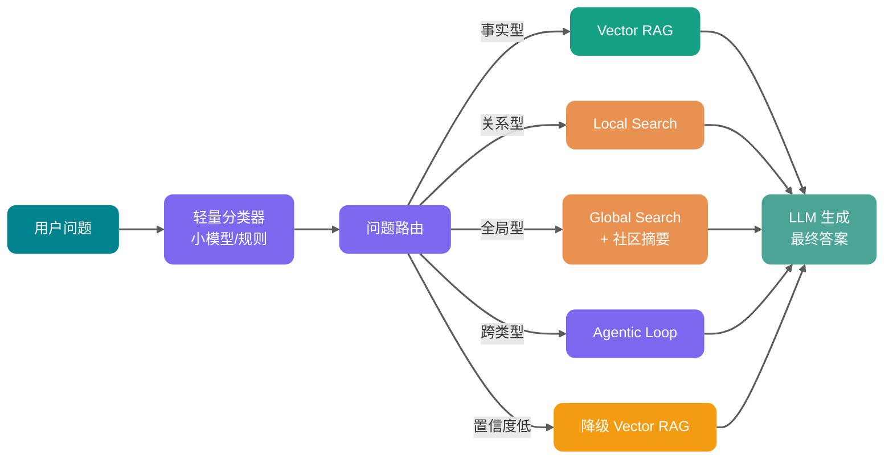

Lần đầu tiên làm hệ thống hỏi đáp cơ sở tri thức doanh nghiệp, thường sẽ trải qua một giai đoạn rất tương tự: cắt tài liệu, Embedding, vector store, thu hồi Top-K, nhét các đoạn vào mô hình lớn.

Demo rất suôn sẻ, lãnh đạo hỏi vài câu về quy chế cũng có thể trả lời. Rồi đồng nghiệp kinh doanh bất ngờ hỏi:

> "Các điểm rủi ro mà vài bộ phận này liên tục đề cập trong nửa năm vừa rồi là gì? Chúng liên quan đến nhau như thế nào?"

Vector RAG bắt đầu lực bất tòng tâm.

Nó có thể tìm ra vài đoạn tương tự, nhưng khó mà nối "bộ phận", "rủi ro", "dự án", "nhà cung cấp", "dòng thời gian" những đối tượng này thành một mạng quan hệ. Phức tạp hơn là, câu trả lời thường đến từ suy luận kết hợp nhiều tài liệu, chứ không phải một câu có sẵn trong một Chunk nào đó.

Đây chính là vấn đề GraphRAG cần giải quyết.

Dưới đây Guide sẽ phân tích rõ ràng các khái niệm cốt lõi và thực hành kỹ thuật của GraphRAG, tập trung vào sự khác biệt thực sự giữa nó và RAG vector truyền thống, khi nào nên dùng, khi nào không nên dùng.

Toàn văn gần 10.000 từ, nên lưu trước. Nội dung chính bao gồm:

1. Sự khác biệt giữa RAG và GraphRAG;
2. Quan hệ thực thể và community detection trong knowledge graph;
3. Global search và local search phù hợp với loại câu hỏi nào;
4. Quy trình triển khai kỹ thuật GraphRAG, chi phí, và những chỗ thực sự khó triển khai.

## RAG là gì?


RAG (Retrieval-Augmented Generation, Sinh tăng cường thu hồi) là framework kết hợp tìm kiếm thông tin và mô hình ngôn ngữ lớn sinh tạo.

Ý tưởng cốt lõi của nó là: trước khi để LLM trả lời câu hỏi hoặc sinh văn bản, trước tiên thu hồi ngữ cảnh liên quan từ các nguồn tri thức bên ngoài như cơ sở dữ liệu, tập tài liệu, cơ sở tri thức doanh nghiệp, rồi giao "câu hỏi gốc + ngữ cảnh thu hồi" cùng nhau cho LLM. Điều này có thể giúp model trả lời chính xác hơn, kịp thời hơn, và phù hợp hơn với tri thức lĩnh vực cụ thể.

Đối tượng thu hồi của RAG truyền thống thường là Chunk, tức các đoạn văn bản. Nó rất thích hợp để trả lời các câu hỏi "câu trả lời nằm trong vài đoạn nào đó", ví dụ hỏi đáp quy chế, hỏi đáp tài liệu API, tra cứu sự thật cục bộ trong cơ sở tri thức.

## GraphRAG là gì?


GraphRAG (Graph-based Retrieval-Augmented Generation) có thể hiểu là: **ngoài vector search truyền thống còn đưa vào knowledge graph, mô hình hóa tường minh các thực thể, quan hệ và ngữ cảnh có cấu trúc trong tài liệu. Khi thu hồi, ngoài việc thu hồi đoạn tương tự, còn thu thập bằng chứng theo quan hệ đồ thị, rồi giao cho mô hình lớn sinh câu trả lời.**

Lưu ý, trọng tâm của GraphRAG không phải "đã dùng graph database", mà là **đối tượng thu hồi đã thay đổi**.

RAG vector truyền thống thu hồi Chunk, tức các đoạn văn bản. GraphRAG thu hồi các node, edge, path, community summary trong một "mạng quan hệ tri thức", kết hợp với bằng chứng văn bản gốc để trả lời câu hỏi.

Ví dụ so sánh:

- **Vector RAG** giống như tìm vài trang nội dung tương tự theo ngữ nghĩa trong thư viện.
- **GraphRAG** giống như trước tiên sắp xếp ra sơ đồ quan hệ nhân vật, dòng thời gian sự kiện và mục lục chủ đề, rồi tìm bằng chứng theo dấu vết quan hệ.

Vector RAG giỏi phán đoán "đoạn này và câu hỏi của tôi có giống không", GraphRAG giỏi hiểu "những đối tượng này thực sự kết nối với nhau như thế nào".

## RAG vector truyền thống có giới hạn gì?


Logic cơ bản của vector RAG rất trực tiếp:

1. Cắt tài liệu thành Chunk.
2. Dùng model Embedding chuyển Chunk thành vector.
3. Khi người dùng hỏi, cũng chuyển câu hỏi thành vector.
4. Thu hồi Top-K Chunk theo độ tương tự.
5. Nhét Chunk vào LLM để sinh câu trả lời.

Phương án này rất tốt trong "hỏi đáp sự thật cục bộ". Ví dụ:

- "Quy trình hoàn tiền là gì?"
- "Quy tắc giới hạn tốc độ của một API nào đó là bao nhiêu?"
- "Cách cấu hình vector database trong Spring AI?"

Vì câu trả lời rất có thể nằm trong vài đoạn cục bộ nào đó, chỉ cần thu hồi đủ chính xác, model có thể tổng hợp ra kết quả.

Nhưng vấn đề của hỏi đáp tri thức phức tạp là: **câu trả lời thường không nằm trong một đoạn, mà trong quan hệ giữa các đoạn.**

### 1. Chunk là những hòn đảo thông tin

Cắt khối là biện pháp kỹ thuật cần thiết của vector RAG, nhưng nó tự nhiên sẽ ngắt ngữ cảnh.

Trong một tài liệu, chương một định nghĩa một hệ thống nào đó, chương ba viết người phụ trách, chương năm đề cập đến database nó phụ thuộc, chương bảy ghi lại sự cố gần đây nhất. Sau khi cắt thành Chunk, những thông tin này rải rác ở các khối văn bản khác nhau.

Vector search chỉ có thể phán đoán "khối văn bản nào giống câu hỏi nhất", mà không biết những khối văn bản này thuộc cùng một đối tượng trong nghiệp vụ.

Đây chính là điểm mù điển hình của vector RAG: **Tương tự ngữ nghĩa không bằng quan hệ đầy đủ.**

### 2. Độ tương tự vector không giỏi suy luận đa bước

Giả sử người dùng hỏi:

> "Người phụ trách hệ thống A gần đây đã tham gia những buổi phục khám sự cố nào liên quan đến chuỗi thanh toán?"

Câu hỏi này ít nhất bao gồm vài lớp nhảy:

1. Tìm hệ thống A.
2. Tìm người phụ trách hệ thống A.
3. Tìm các buổi phục khám sự cố mà người phụ trách này đã tham gia.
4. Lọc ra những buổi phục khám liên quan đến chuỗi thanh toán.

Vector RAG có thể thu hồi "mô tả hệ thống A" hoặc "phục khám sự cố thanh toán", nhưng nó không tự nhiên có khả năng mở rộng bằng chứng theo chuỗi quan hệ "hệ thống -> người phụ trách -> phục khám -> chuỗi".

### 3. Câu hỏi toàn cục rất khó trả lời bằng đoạn Top-K

Còn có một loại câu hỏi phức tạp hơn:

- "Những khiếu nại của khách hàng này chủ yếu tập trung vào những loại vấn đề nào?"
- "Rủi ro kiến trúc liên tục xuất hiện trong cơ sở tri thức công ty trong năm qua là gì?"
- "Chủ đề chiến lược chung mà vài bản báo cáo này đang chỉ ra là gì?"

Những câu hỏi này không phải tìm "vài đoạn giống nhau nhất", mà là tổng hợp, quy nạp và phân tích chủ đề toàn bộ ngữ liệu. Thu hồi Top-K chỉ nhìn thấy cửa sổ cục bộ, dễ xảy ra hai loại thất bại:

- Thu hồi đoạn quá ít, không thấy được mẫu tổng thể.
- Thu hồi đoạn quá nhiều, chi phí Token và nhiễu cùng bùng nổ.

Nhiều người lúc này sẽ điều chỉnh Top-K từ 5 lên 20, thêm rerank, thêm query rewrite. Ngắn hạn có thể cải thiện, nhưng vấn đề cơ bản vẫn còn: **Bạn vẫn đang dùng độ tương tự đoạn để giải quyết vấn đề suy luận cấu trúc.**

## Sự khác biệt bản chất giữa GraphRAG và RAG vector truyền thống


| Chiều               | RAG vector truyền thống                          | GraphRAG                                                                    |
| ------------------- | ------------------------------------------------ | --------------------------------------------------------------------------- |
| Đối tượng thu hồi   | Chunk văn bản                                    | Thực thể, quan hệ, path, community summary, đoạn gốc                        |
| Năng lực cốt lõi    | Thu hồi độ tương tự ngữ nghĩa                    | Suy luận quan hệ, duyệt đồ thị, tổng hợp chủ đề toàn cục                    |
| Cấu trúc dữ liệu    | Chủ yếu là chỉ mục vector                        | Knowledge graph + vector index + full-text index                            |
| Câu hỏi phù hợp     | Hỏi đáp sự thật cục bộ, giải thích đoạn tài liệu | Hỏi đáp quan hệ đa bước, quy nạp qua tài liệu, phân tích nghiệp vụ phức tạp |
| Khả năng giải thích | Chủ yếu dựa vào trích dẫn đoạn                   | Có thể hiển thị node, quan hệ, path và nguồn                                |
| Chi phí xây dựng    | Trung bình, trọng tâm là cắt khối và Embedding   | Cao, trọng tâm là trích xuất, disambiguation, mô hình hóa, đánh giá         |
| Độ trễ truy vấn     | Thường thấp hơn                                  | Phụ thuộc vào số lần duyệt đồ thị, community summary và gọi LLM             |
| Chi phí bảo trì     | Cập nhật Chunk và vector là đủ                   | Còn phải bảo trì thực thể, quan hệ, community và summary                    |
| Rủi ro lớn nhất     | Đoạn thu hồi không đầy đủ                        | Xây dựng đồ thị sai gây hiểu lầm có hệ thống                                |

Gợi ý thực chiến của Guide: **Đừng vì theo đuổi công nghệ mới mà ngay từ đầu đã dùng GraphRAG. Trước tiên dùng vector RAG làm baseline, thu thập các case thất bại; chỉ khi thất bại tập trung vào các vấn đề như quan hệ, đa bước, quy nạp toàn cục, thì mới đưa vào cấu trúc đồ thị.**

Bổ sung một bảng tham khảo về độ lớn số lượng (giá trị thực tế phụ thuộc nhiều vào quy mô ngữ liệu, mật độ thực thể, cấu hình):

| Chiều chi phí                  | RAG vector                    | GraphRAG (giá trị tham khảo)                                                                   |
| ------------------------------ | ----------------------------- | ---------------------------------------------------------------------------------------------- |
| **Tiêu thụ Token lập chỉ mục** | Chủ yếu Embedding             | Khoảng **5-20 lần** RAG vector (liên quan chặt đến số lớp community, mật độ thực thể)          |
| **Overhead lưu trữ**           | Vector index                  | Ba bộ index Vector + Graph + Full-text, khoảng **1,5-3 lần**                                   |
| **Độ trễ truy vấn**            | Thường thấp                   | Graph search cục bộ ×1,2-2; Global search (tổng hợp community summary) có thể đạt **5-10 lần** |
| **Tần suất bảo trì**           | Có thể cập nhật gần thực thời | Cập nhật tăng dần đồ thị thường xử lý batch hàng ngày/hàng tuần                                |

Nếu người phỏng vấn hỏi "GraphRAG và RAG thường khác nhau như thế nào", có thể trả lời như sau:

> RAG vector thông thường chủ yếu thu hồi Chunk văn bản, phù hợp với hỏi đáp sự thật cục bộ; GraphRAG sẽ mô hình hóa tường minh thực thể, quan hệ và cấu trúc chủ đề trong tài liệu thành knowledge graph, khi truy vấn không chỉ có thể tìm đoạn theo ngữ nghĩa, còn có thể dùng quan hệ đồ thị để thu hồi đa bước, hoặc dùng community summary để trả lời câu hỏi toàn cục. Ưu điểm của nó là suy luận quan hệ, quy nạp toàn cục và khả năng giải thích tốt hơn, cái giá phải trả là chi phí xây dựng, disambiguation thực thể, trích xuất quan hệ, cập nhật tăng dần và kiểm soát quyền đều phức tạp hơn.

Nếu tiếp tục hỏi "khi nào không dùng GraphRAG", có thể bổ sung:

> Nếu vấn đề chủ yếu là hỏi đáp tài liệu đơn giản, hoặc lượng dữ liệu nhỏ, quan hệ không phức tạp, vector RAG kết hợp hybrid search và rerank thường tiết kiệm hơn. GraphRAG nên dùng khi badcase của vector RAG đã rõ ràng chỉ vào các vấn đề quan hệ đa bước, quy nạp qua tài liệu và ràng buộc có cấu trúc.

## Các khái niệm cốt lõi của GraphRAG

Để hiểu GraphRAG, trước tiên tháo rời vài từ khóa quan trọng.


### Knowledge Graph: Biến tri thức thành mạng quan hệ có thể duyệt

**Knowledge Graph (Đồ thị tri thức)** về bản chất là một cấu trúc dùng "node + edge" để biểu đạt tri thức.

- **Node (Nút)**: Đại diện cho thực thể hoặc khái niệm, ví dụ người dùng, hệ thống, đơn hàng, sự cố, nhà cung cấp, điều khoản chính sách.
- **Edge (Cạnh)**: Đại diện cho quan hệ giữa các thực thể, ví dụ phụ trách, phụ thuộc, ảnh hưởng, thuộc về, gây ra, tham chiếu.
- **Property (Thuộc tính)**: Thông tin bổ sung gắn trên node hoặc edge, ví dụ thời gian, phiên bản, độ tin cậy, tài liệu nguồn.

Ví dụ:

```text
用户服务 --依赖--> Redis 集群
Redis 集群 --发生过--> 连接池耗尽事故
连接池耗尽事故 --影响--> 下单接口
张三 --负责--> 用户服务
```

Sau khi vài dòng quan hệ này được đặt vào đồ thị, hệ thống có thể trả lời:

> "Hệ thống mà Trương Tam phụ trách gần đây có những rủi ro nào ảnh hưởng đến chuỗi đặt hàng?"

Vector RAG nhìn thấy vài đoạn văn; knowledge graph nhìn thấy kết nối giữa các đối tượng với nhau.

### Thực thể: Đối tượng nghiệp vụ nhỏ nhất của GraphRAG

**Thực thể (Entity)** là node cốt lõi trong đồ thị.

Trong GraphRAG, thực thể không nhất thiết phải là "tên người, địa điểm, tổ chức" rất nghiêm ngặt như trong knowledge graph truyền thống. Nó cũng có thể là:

- Một hệ thống nghiệp vụ, ví dụ "Trung tâm đơn hàng"
- Một component kỹ thuật, ví dụ "Kafka consumer group"
- Một điều khoản quy chuẩn, ví dụ "Yêu cầu che giấu dữ liệu"
- Một chủ đề rủi ro, ví dụ "Bỏ qua quyền"
- Một sự kiện dự án, ví dụ "Stress test chuỗi thanh toán"

Trích xuất thực thể tốt hay không, trực tiếp quyết định giới hạn trên của GraphRAG. Trích thô quá, đồ thị không có chi tiết; trích vụn quá, đồ thị đầy node trùng lặp và nhiễu.

Bước này rất giống làm domain modeling. Một vài điểm quan trọng trong thực hành kỹ thuật:

- **Dùng JSON Schema để ràng buộc chặt định dạng trích xuất**: Tránh phân tích văn bản tự do, giảm chi phí hậu xử lý.
- **Ví dụ few-shot phải bao gồm ví dụ đúng, sai và trường hợp biên**: Nói cho LLM biết cái gì không nên trích.
- **Đặt giới hạn trên số thực thể tối đa**: Ngăn LLM trích quá nhiều trong văn bản dài.
- **Mỗi thực thể bắt buộc có trường `source_text_span`**: Dùng để truy xuất nguồn và kiểm tra thủ công.

### Quan hệ: Thứ GraphRAG thực sự có hơn vector RAG

**Quan hệ (Relationship)** là linh hồn của GraphRAG.

Vector RAG có thể nói cho bạn biết "Trung tâm đơn hàng" và "Sự cố thanh toán" gần về ngữ nghĩa, nhưng nó không tự nhiên nói cho bạn biết quan hệ giữa hai cái là "phụ thuộc", "ảnh hưởng", "gây ra" hay "chỉ xuất hiện đồng thời".

GraphRAG sẽ cố gắng tường minh hóa quan hệ:

```text
订单中心 --调用--> 支付网关
支付网关 --依赖--> 风控服务
风控服务 --导致过--> 交易超时
```

Có quan hệ rồi, thu hồi không chỉ là "sắp xếp theo độ tương tự", mà có thể mở rộng dọc theo path:

- Từ một thực thể tìm các thực thể lân cận.
- Từ một loại quan hệ tìm thượng/hạ lưu.
- Từ một sự cố tìm phạm vi ảnh hưởng.
- Từ một chủ đề tìm community liên quan.

Đây cũng là chìa khóa để GraphRAG xử lý được vấn đề đa bước.

### Community Detection: Tìm nhóm chủ đề từ một đống node

**Community Detection (Phát hiện cộng đồng)** là một nhiệm vụ phổ biến trong thuật toán đồ thị, mục tiêu là phân cụm một nhóm node kết nối chặt chẽ hơn trong đồ thị thành một community.

Trong GraphRAG, community có thể hiểu là "nhóm chủ đề tự nhiên hình thành trong ngữ liệu". Ví dụ trong một lô tài liệu các node này xuất hiện lặp đi lặp lại:

```text
支付网关、风控服务、交易超时、限流策略、灰度发布、告警升级
```

Quan hệ giữa chúng dày đặc, rất có thể tạo thành community "ổn định thanh toán".

Một cách làm GraphRAG phổ biến là: trước tiên trích xuất thực thể, quan hệ và các tuyên bố quan trọng từ văn bản, rồi dùng thuật toán **Community Detection** như Leiden để xây dựng community phân cấp, cuối cùng tạo summary cho mỗi community. Các thuật toán phổ biến bao gồm Leiden, Louvain, v.v. Như vậy khi truy vấn câu hỏi toàn cục, không cần nhét tất cả tài liệu gốc vào LLM, mà trước tiên xem community summary ở tầng cao hơn.

### Global Search và Local Search

Trong GraphRAG thường thấy hai từ: **Global Search (Tìm kiếm toàn cục)** và **Local Search (Tìm kiếm cục bộ)**.

Chúng tương ứng với hai loại câu hỏi hoàn toàn khác nhau.

**Local Search** phù hợp để trả lời câu hỏi xung quanh thực thể cụ thể:

- "Trung tâm đơn hàng phụ thuộc vào những service nào?"
- "Một nhà cung cấp nào đó ảnh hưởng đến những dự án nào?"
- "Chuỗi thượng/hạ lưu của một sự cố nào đó là gì?"

Luồng điển hình của nó là: trước tiên định vị thực thể, rồi mở rộng ngữ cảnh dọc theo các thực thể lân cận, path quan hệ, đoạn gốc liên quan.

**Global Search** phù hợp để trả lời câu hỏi tổng thể trải rộng qua ngữ liệu:

- "Chủ đề rủi ro liên tục xuất hiện trong lô báo cáo này là gì?"
- "Khiếu nại của CSKH chủ yếu phân thành vài loại nào?"
- "Nút thắt kiến trúc phổ biến nhất trong tài liệu nghiên cứu phát triển là gì?"

Luồng điển hình của nó là: trước tiên dùng community summary hoặc theme summary để tổng hợp, rồi để LLM quy nạp và sắp xếp.

Phân biệt bằng một câu:

- **Local search là từ một điểm mở rộng ra ngoài.**
- **Global search là trước tiên xem cấu trúc chủ đề của toàn bộ đồ thị.**

**DRIFT Search**: Phiên bản nâng cao của local search, khi mở rộng từ thực thể lân cận đồng thời đưa vào community summary làm ngữ cảnh bổ sung, cân bằng độ chính xác và tầm nhìn toàn cục. Khi câu hỏi của bạn vừa có trọng tâm thực thể vừa cần liên kết qua nhiều community, DRIFT có lợi thế hơn local search thuần túy.

| Chế độ thu hồi | Tình huống phù hợp                          | Cơ chế cốt lõi                                     |
| -------------- | ------------------------------------------- | -------------------------------------------------- |
| Basic Search   | Tra cứu sự thật thông thường                | Vector search Top-K tiêu chuẩn                     |
| Local Search   | Hỏi đáp xung quanh thực thể cụ thể          | Mở rộng từ thực thể lân cận và khái niệm liên quan |
| DRIFT Search   | Trọng tâm thực thể + liên kết qua community | Mở rộng cục bộ + ngữ cảnh community summary        |
| Global Search  | Quy nạp chủ đề toàn cục                     | Community summary Map-Reduce                       |

## Quy trình xây dựng và truy vấn của GraphRAG

### Giai đoạn xây dựng: Từ tài liệu đến đồ thị

Sơ đồ dưới đây thể hiện chuỗi cốt lõi của GraphRAG:


Giai đoạn xây dựng của GraphRAG thường bao gồm các bước sau:

| Bước                | Làm gì                                                                | Rủi ro chính                                                          |
| ------------------- | --------------------------------------------------------------------- | --------------------------------------------------------------------- |
| Phân tích tài liệu  | Trích xuất văn bản từ PDF, trang web, Markdown, bản ghi cơ sở dữ liệu | Lỗi OCR, bảng mất cấu trúc, phiên bản tài liệu hỗn loạn               |
| Cắt văn bản         | Cắt tài liệu dài thành TextUnit hoặc Chunk                            | Cắt quá vụn mất quan hệ, cắt quá thô tăng chi phí trích xuất          |
| Trích xuất thực thể | Nhận dạng hệ thống, người, tổ chức, khái niệm, sự kiện trong tài liệu | Thực thể đồng tên, bí danh, viết tắt, thực thể nhiễu                  |
| Trích xuất quan hệ  | Nhận dạng phụ thuộc, chứa đựng, ảnh hưởng, nhân quả giữa thực thể     | Hướng quan hệ sai, loại quan hệ quá tổng quát, độ tin cậy không đủ    |
| Chuẩn hóa đồ thị    | Hợp nhất thực thể trùng lặp, bổ sung thuộc tính và nguồn              | Chi phí disambiguation thực thể cao, cần quy tắc thủ công và đánh giá |
| Community detection | Tìm các nhóm chủ đề kết nối dày đặc                                   | Khi đồ thị quá thưa hoặc quá bẩn, chất lượng community sẽ giảm        |
| Sinh summary        | Tạo summary cho community, thực thể, quan hệ                          | LLM summary có thể bỏ sót ràng buộc hoặc đưa vào ảo giác              |
| Lưu vào chỉ mục     | Ghi vào graph database, vector store, full-text index                 | Cập nhật tăng dần và lọc quyền phức tạp                               |

Đây cũng là nguyên nhân căn bản chi phí triển khai GraphRAG cao: nó nâng cấp "tiền xử lý thu hồi" từ cắt khối văn bản đơn giản lên một công trình mô hình hóa tri thức và quản trị dữ liệu.

### Giai đoạn truy vấn: Trước tiên phán đoán loại câu hỏi

Bước quan trọng nhất trong giai đoạn truy vấn của GraphRAG là **định tuyến truy vấn**.

Câu hỏi người dùng đặt ra khác nhau, cách thu hồi cũng khác nhau:

| Loại câu hỏi     | Cách thu hồi phù hợp hơn                 | Ví dụ                                                                                |
| ---------------- | ---------------------------------------- | ------------------------------------------------------------------------------------ |
| Sự thật cục bộ   | Vector search hoặc local graph search    | "Timeout của một interface nào đó là bao nhiêu?"                                     |
| Quan hệ thực thể | Local graph search                       | "Trung tâm đơn hàng phụ thuộc vào những service nào?"                                |
| Suy luận đa bước | Duyệt đồ thị + vector bổ sung bằng chứng | "Người phụ trách nào đó đã tham gia những sự cố nào ảnh hưởng đến chuỗi thanh toán?" |
| Quy nạp toàn cục | Community summary + global search        | "Chủ đề rủi ro chính trong lô báo cáo này là gì?"                                    |
| Lọc chính xác    | Truy vấn đồ thị hoặc structured query    | "Những dự án nào trong Q4 2025 phụ thuộc vào nhà cung cấp A?"                        |

Sơ đồ dưới đây thể hiện ánh xạ từ loại câu hỏi đến chế độ thu hồi:


Một hệ thống trưởng thành sẽ không đẩy tất cả câu hỏi vào GraphRAG. Nhiều câu hỏi đơn giản, dùng vector search rẻ hơn, nhanh hơn, ổn định hơn.

## GraphRAG phù hợp với tình huống nào? Không phù hợp với tình huống nào?

GraphRAG phù hợp nhất với những tình huống "quan hệ quan trọng hơn độ tương tự văn bản".

Nó không phải gói nâng cấp mặc định của vector RAG, mà là một kiến trúc quản trị dữ liệu và thu hồi nặng hơn. Phán đoán có nên dùng GraphRAG không, cốt lõi không phải "công nghệ có mới không", mà là xem nguyên nhân thất bại của câu hỏi có tập trung vào quan hệ, path, chủ đề toàn cục và quy nạp qua tài liệu không.

Các tình huống điển hình phù hợp dùng GraphRAG có:

- **Hỏi đáp phức tạp của cơ sở tri thức doanh nghiệp**: Câu hỏi cần nối thông tin qua các bộ phận, quy chế, phục khám dự án, ví dụ "Quy trình này liên quan đến những bộ phận nào? Mỗi bộ phận chịu trách nhiệm gì?" "Một quy chế nào đó xung đột với những quy chế lịch sử nào?".
- **Phân tích kiến trúc IT và ảnh hưởng sự cố**: Service, interface, database, message queue, người phụ trách, cảnh báo, sự cố tự nhiên có quan hệ phụ thuộc, ví dụ "Redis cluster bất thường sẽ ảnh hưởng đến những interface lõi nào?" "Những hệ thống nào cùng phụ thuộc vào một component rủi ro cao?".
- **Tài chính, quản lý rủi ro, tuân thủ, chuỗi cung ứng**: Những lĩnh vực này quan tâm hơn đến quan hệ giữa các đối tượng, chứ không phải đoạn văn bản có tương tự không, ví dụ quan hệ giữa khách hàng và tài khoản, doanh nghiệp và người kiểm soát thực tế, nhà cung cấp và dự án, điều khoản hợp đồng và quy định pháp lý.
- **Quy nạp chủ đề qua tài liệu**: Khi bạn muốn phân tích mẫu tổng thể của bản ghi phỏng vấn, báo cáo khảo sát, phiếu CSKH, phục khám sự cố, community summary có thể trước tiên phân cụm ngữ liệu thành nhóm chủ đề, rồi để LLM quy nạp toàn cục.

Các tình huống không phù hợp dùng GraphRAG cũng rất rõ ràng:

- **Lượng dữ liệu nhỏ, câu hỏi đơn giản**: Nếu cơ sở tri thức chỉ có vài chục tài liệu, câu hỏi cơ bản đều là "một quy tắc nào đó là gì", vector RAG kết hợp hybrid search và rerank thường tiết kiệm hơn.
- **Chất lượng tài liệu quá kém**: Nếu tài liệu nguồn thiếu chủ ngữ, phiên bản hỗn loạn, thuật ngữ không thống nhất, phân tích bảng lỗi nghiêm trọng, đồ thị trích ra cũng sẽ rất bẩn. Lỗi của vector RAG thường là "tìm sai vài đoạn văn", lỗi của GraphRAG có thể là "toàn bộ mạng quan hệ bị lệch hướng".
- **Yêu cầu tính thực thời rất cao**: Trích xuất quan hệ thực thể, community detection, sinh summary đều sẽ tăng chi phí cập nhật. Nếu dữ liệu bắt buộc phải hiển thị trong giây, cần đánh giá cẩn thận chi phí cập nhật đồ thị tăng dần và làm mới summary.
- **Đội ngũ thiếu năng lực mô hình hóa đồ thị và đánh giá**: GraphRAG cần liên tục trả lời những câu hỏi như "thực thể nào đáng mô hình hóa, loại quan hệ thiết kế thế nào, thực thể disambiguation thế nào, lỗi đồ thị đánh giá thế nào, lọc quyền đặt ở đâu". Nếu không có ai chịu trách nhiệm những vấn đề này, nó rất dễ trở thành hộp đen đắt tiền nhưng không kiểm soát được.

Tóm lại một câu: Nếu nguyên nhân thất bại chỉ là "không tìm được đoạn đó", trước tiên tối ưu thu hồi; nếu nguyên nhân thất bại là "tìm được nhiều đoạn, nhưng hệ thống không hiểu quan hệ giữa chúng", thì mới cân nhắc GraphRAG.

## Neo4j GraphRAG phù hợp để giải quyết vấn đề gì?

GraphRAG không chỉ có một cách triển khai. Chính xác hơn, nó là một loại tuyến kỹ thuật "đưa cấu trúc đồ thị vào thu hồi tăng cường". So với việc offline tạo ra một bộ summary đồ thị toàn diện, Neo4j GraphRAG nghiêng về "kiến trúc thu hồi online lấy graph database làm trung tâm", phù hợp để kết nối LLM vào mạng quan hệ nghiệp vụ đã có sẵn của doanh nghiệp.

Ý tưởng cốt lõi của nó là: đặt knowledge graph trong graph database như Neo4j, đồng thời kết hợp vector index, full-text index và Cypher query. Khi truy vấn có thể trước tiên tìm node xuất phát qua vector search, rồi mở rộng neighbor, path và bằng chứng thượng/hạ lưu dọc theo quan hệ đồ thị.

Mô hình điển hình là:

1. Câu hỏi người dùng trước tiên làm Embedding hoặc keyword search.
2. Tìm thực thể hoặc node tài liệu liên quan trong đồ thị làm điểm xuất phát.
3. Dùng Cypher duyệt dọc theo quan hệ, tìm node lân cận, path và thuộc tính.
4. Lắp ráp path, thuộc tính node, đoạn gốc thành ngữ cảnh.
5. Để LLM trả lời dựa trên những bằng chứng có cấu trúc này.

Neo4j chính thức cung cấp package Python `neo4j-graphrag`, bao gồm xây dựng knowledge graph, vector index, quy trình sinh GraphRAG và nhiều loại retriever. Nó không chỉ làm "vector recall + duyệt đồ thị", mà có thể chọn chế độ thu hồi khác nhau theo loại câu hỏi.

| Chế độ thu hồi                              | Cách làm                                                                             | Câu hỏi phù hợp                                                                   |
| ------------------------------------------- | ------------------------------------------------------------------------------------ | --------------------------------------------------------------------------------- |
| **VectorRetriever**                         | Dựa trên vector index Neo4j làm similarity search, trả về node khớp và điểm số       | Vector search ngữ nghĩa thông thường, tìm thực thể ứng viên                       |
| **VectorCypherRetriever**                   | Trước tiên vector search hit node, rồi thực thi Cypher query mở rộng ngữ cảnh        | "Sau khi tìm tài liệu tương tự, kéo về cùng thực thể, path, thuộc tính liên quan" |
| **HybridRetriever / HybridCypherRetriever** | Kết hợp vector index và full-text index, khi cần dùng Cypher bổ sung ngữ cảnh đồ thị | Cơ sở tri thức doanh nghiệp quan trọng cả từ khóa lẫn ngữ nghĩa                   |
| **Text2Cypher**                             | LLM tạo Cypher theo graph Schema, kết quả truy vấn rồi giao LLM tổ chức câu trả lời  | Lọc có cấu trúc chính xác, truy vấn đa điều kiện, hỏi đáp dạng báo cáo            |
| **ToolsRetriever**                          | Bọc nhiều retriever thành tool, để LLM chọn theo ý định câu hỏi                      | Định tuyến câu hỏi phức tạp, kết hợp nhiều retriever                              |
| **Vector store ngoài + Neo4j**              | Vector lưu trong Weaviate, Pinecone, Qdrant, v.v., rồi map ngược về node Neo4j       | Đã có cơ sở hạ tầng vector, không muốn di chuyển toàn bộ vector vào Neo4j         |

Trong đó có giá trị kỹ thuật nhất là **VectorCypherRetriever** và **Text2Cypher**.

Ưu điểm của VectorCypherRetriever là ổn định: vector search chỉ chịu trách nhiệm tìm điểm xuất phát, ngữ cảnh thực sự được bổ sung bởi Cypher query có thể kiểm soát. Ví dụ sau khi hit node "payment gateway", rồi dọc theo các quan hệ `[:DEPENDS_ON]`, `[:AFFECTS]`, `[:OWNER]` lấy thượng/hạ lưu, phạm vi ảnh hưởng và người phụ trách, kết quả dễ giải thích hơn.

Ưu điểm của Text2Cypher là chính xác: nó có thể chuyển câu hỏi như "Những dự án ưu tiên cao nào trong Q4 2025 phụ thuộc vào nhà cung cấp A?" thành structured query. Nhưng loại mô hình này nhất định phải kiểm soát biên giới, ít nhất phải làm Schema whitelist, kiểm tra truy vấn, quyền read-only, giới hạn số kết quả và timeout control. Trong tình huống rủi ro cao, ưu tiên dùng query template hoặc semantic layer tool, thay vì hoàn toàn mở cho LLM tự do viết Cypher.

Ví dụ quản lý rủi ro tài chính, chuỗi cung ứng, quản lý tài sản IT, quản trị quyền, phân tích ảnh hưởng sự cố, quan hệ đối tượng trong những lĩnh vực này vốn đã rất quan trọng. Ưu điểm của Neo4j GraphRAG là: **để LLM kết nối vào quan hệ nghiệp vụ đã có, thay vì mỗi lần phải đoán quan hệ từ văn bản.**

## Còn có những triển khai liên quan đến GraphRAG nào khác?

Ngoài Neo4j, còn có vài tuyến phổ biến đáng tìm hiểu.

| Tuyến triển khai                            | Ý tưởng cốt lõi                                                                                                                                                    | Phù hợp tình huống                                                                                          |
| ------------------------------------------- | ------------------------------------------------------------------------------------------------------------------------------------------------------------------ | ----------------------------------------------------------------------------------------------------------- |
| **LangChain + Neo4j**                       | Dùng `Neo4jGraph` kết nối Neo4j, dùng component `GraphCypherQAChain` v.v. chuyển ngôn ngữ tự nhiên thành Cypher, rồi sinh câu trả lời dựa trên kết quả truy vấn    | Đã dùng LangChain / LangGraph, muốn nhanh chóng kết nối graph database vào Agent hoặc chuỗi RAG             |
| **LlamaIndex PropertyGraphIndex**           | Qua `kg_extractors` trích xuất thực thể và quan hệ từ Chunk tài liệu, xây dựng property graph index có thể truy vấn                                                | Document ingestion, index và truy vấn vốn đã trong hệ sinh thái LlamaIndex                                  |
| **FalkorDB GraphRAG SDK**                   | Dựa trên graph database hỗ trợ OpenCypher, full-text index, vector similarity và range index làm GraphRAG                                                          | Muốn thử graph database ngoài Neo4j, hoặc quan tâm hơn đến truy vấn đồ thị độ trễ thấp, đa tenant           |
| **Tự phát triển đồ thị nhẹ + vector store** | Dùng bảng nghiệp vụ hoặc bảng edge lưu ít quan hệ thực thể lõi, vector store chỉ chịu trách nhiệm thu hồi văn bản ứng viên, rồi dùng bảng quan hệ bổ sung ngữ cảnh | Phiên bản đầu tiên xác nhận GraphRAG có giá trị không, không muốn ngay từ đầu đưa vào graph database đầy đủ |

Sự khác biệt của những tuyến này không phải "cái nào cao cấp hơn", mà là bạn muốn đặt độ phức tạp ở đâu.

Nếu bạn đã có đồ thị nghiệp vụ ổn định, quan hệ thực thể rõ ràng và nhu cầu structured query khá mạnh, Neo4j GraphRAG là tuyến chính tự nhiên nhất. Nếu tech stack của bạn đã đặt cược vào LangChain hoặc LlamaIndex, ưu tiên tái dùng component graph retrieval của chúng sẽ tiết kiệm chi phí tích hợp hơn. Nếu chỉ muốn xác nhận "mở rộng quan hệ có cải thiện câu trả lời không", đồ thị nhẹ tự phát triển ngược lại phù hợp hơn cho phiên bản đầu tiên.

## Những chỗ thực sự khó triển khai GraphRAG là ở đâu?

Nơi GraphRAG dễ bị đánh giá thấp nhất, không phải bản thân graph database, mà là sau khi "biến một đống văn bản thành mạng quan hệ có thể dùng được", còn phải bảo trì nó lâu dài.

Công việc cốt lõi của vector RAG thông thường là phân tích tài liệu, cắt Chunk, viết vector, làm thu hồi. GraphRAG nhiều hơn một toàn bộ bộ quan hệ engineering: thực thể phải trích chính xác, hướng quan hệ không thể sai, đồ thị phải có thể cập nhật, quyền không thể bị rò rỉ, hiệu quả còn phải có thể đánh giá.

### 1. Thực thể dễ trích trùng, trích sai, trích quá vụn

Cùng một thực thể có thể có nhiều tên:

```text
订单中心、订单服务、order-service、OMS
```

Chúng có phải là cùng một thực thể không? Khi nào hợp nhất, khi nào tách ra?

Việc này không thể hoàn toàn phó thác cho LLM đoán. Trong sản xuất thường cần cấu hình:

- Từ điển thuật ngữ
- Bảng bí danh
- Khớp quy tắc
- Kiểm tra thủ công
- Ngưỡng độ tin cậy
- Bộ đánh giá

Disambiguation thực thể làm không tốt, đồ thị sẽ trở thành một đống node trùng lặp, đường thu hồi cũng sẽ bị đứt.

### 2. Hướng quan hệ sai một cái, câu trả lời sẽ lệch hướng có hệ thống

Quan hệ dễ sai hơn thực thể.

"A phụ thuộc B" và "B phụ thuộc A" chỉ khác một hướng, nhưng ý nghĩa kỹ thuật hoàn toàn ngược lại. Quan hệ nhân quả, quan hệ ảnh hưởng, quan hệ chứa đựng cũng rất dễ bị LLM trích sai.

Trong môi trường sản xuất, nên thêm các trường này cho quan hệ:

| Trường                     | Tác dụng                                                   |
| -------------------------- | ---------------------------------------------------------- |
| `source_doc_id`            | Truy xuất tài liệu nguồn                                   |
| `source_span`              | Truy xuất vị trí văn bản gốc                               |
| `confidence`               | Ghi lại độ tin cậy trích xuất                              |
| `relation_type`            | Kiểm soát loại quan hệ                                     |
| `updated_at`               | Hỗ trợ cập nhật tăng dần                                   |
| `extraction_model_version` | Sau khi LLM nâng cấp làm diff re-extract và A/B comparison |

Đồ thị không có truy xuất nguồn, không nên dùng trực tiếp cho hỏi đáp rủi ro cao.

### 3. Community summary không miễn phí

Phương án GraphRAG lấy community summary làm cốt lõi, điểm mạnh là quy nạp toàn cục, nhưng summary không miễn phí.

Giai đoạn xây dựng cần gọi LLM:

- Trích xuất thực thể và quan hệ.
- Sinh mô tả thực thể.
- Sinh community summary.
- Cập nhật summary liên quan khi version tiếp theo.

Nếu ngữ liệu rất lớn, chi phí lập chỉ mục có thể cao hơn đáng kể so với vector RAG thông thường. Nên trước tiên dùng ngữ liệu nhỏ xác nhận lợi ích, rồi mới quyết định có đưa vào community summary đa lớp và global search không.

### 4. Cập nhật một tài liệu, có thể kéo theo một mảng đồ thị

Vector RAG thông thường cập nhật một tài liệu, thường là xóa Chunk cũ, rồi ghi vào Chunk và vector mới.

GraphRAG cập nhật một tài liệu, có thể ảnh hưởng đến:

- Node thực thể
- Edge quan hệ
- Phân chia community
- Community summary
- Entity summary
- Vector index
- Permission index

Nếu mỗi lần đều xây dựng lại toàn bộ, chi phí cao; nếu làm cập nhật tăng dần, độ phức tạp kỹ thuật cao.

Đây cũng là nơi GraphRAG giống data engineering hơn RAG thông thường: nó không chỉ bảo trì index, mà đang bảo trì một cấu trúc tri thức liên tục thay đổi.

### 5. Lọc quyền không thể chỉ nhìn ở cấp độ tài liệu

Cơ sở tri thức doanh nghiệp không thể né tránh quyền.

Trong vector RAG, cách làm phổ biến là lọc metadata trước hoặc trong khi thu hồi. Trong GraphRAG còn phải xem xét:

- Người dùng có thể xem một node nào đó, nhưng có thể xem các neighbor của nó không?
- Người dùng có thể xem một edge nào đó, nhưng có thể xem thực thể kia mà edge kết nối không?
- Community summary có trộn vào thông tin từ tài liệu không có quyền không?
- Global summary có rò rỉ chủ đề nhạy cảm không?

Đặc biệt là community summary, nó có thể được tạo chung từ nhiều tài liệu. Nếu một phần trong đó không hiển thị được với người dùng hiện tại, summary có thể trở thành điểm rò rỉ ngầm. Chiến lược ứng phó:

- **Sinh community summary theo nhóm quyền**: Mỗi nhóm quyền sinh summary độc lập, khi truy vấn chỉ trả về community summary mà người dùng có quyền.
- **Trường truy xuất summary giữ lại tất cả ID tài liệu nguồn**: Khi truy vấn kiểm tra giao tập quyền người dùng và ID tài liệu nguồn, lọc bằng chứng không có quyền.
- **Ngữ liệu nhạy cảm cao không tham gia community aggregation**: Đi riêng kênh local search, tránh rò rỉ qua tài liệu.

## Bạn sẽ triển khai GraphRAG trong dự án như thế nào?

Guide không khuyến nghị ngay từ đầu đã dùng GraphRAG đầy đủ. Con đường ổn định hơn là tiến hóa theo giai đoạn.

### Giai đoạn một: Trước tiên làm tốt baseline vector RAG

Trước tiên làm vững năng lực cơ bản:

- Phân tích tài liệu ổn định.
- Chiến lược Chunk có thể đánh giá.
- Vector search + BM25 hybrid search.
- Rerank có thể cắm vào.
- Trích dẫn nguồn có thể truy xuất.
- Lọc quyền đáng tin cậy.

Nếu những cái này chưa làm tốt, dùng GraphRAG chỉ làm vấn đề phức tạp hơn.

### Giai đoạn hai: Thu thập case thất bại dạng quan hệ

Đừng phán đoán bằng cảm giác có cần GraphRAG không. Nên phân loại Badcase của RAG:

| Loại Badcase                           | Có phù hợp GraphRAG không               |
| -------------------------------------- | --------------------------------------- |
| Đơn giản là không thu hồi được từ khóa | Trước tiên tối ưu BM25 và query rewrite |
| Cắt Chunk không hợp lý                 | Trước tiên tối ưu Chunking              |
| Cần suy luận quan hệ thực thể          | Phù hợp đưa vào cấu trúc đồ thị         |
| Cần quy nạp chủ đề toàn cục            | Phù hợp đưa vào community summary       |
| Cần lọc chính xác và ràng buộc quyền   | Phù hợp kết hợp structured query        |

Chỉ khi badcase rõ ràng tập trung vào quan hệ và quy nạp toàn cục, GraphRAG mới có hiệu quả về chi phí.

### Giai đoạn ba: Bắt đầu từ đồ thị nhẹ

Phiên bản đầu tiên không nhất thiết phải làm knowledge graph đầy đủ.

Có thể trước tiên làm một phiên bản nhẹ:

- Chỉ trích xuất thực thể lõi, ví dụ hệ thống, interface, người phụ trách, sự cố, điều khoản quy chế.
- Chỉ giữ lại ít quan hệ giá trị cao, ví dụ phụ thuộc, phụ trách, ảnh hưởng, thuộc về, tham chiếu.
- Đồ thị chỉ dùng cho mở rộng thu hồi, không dùng trực tiếp cho phán đoán sự thật cuối cùng.
- Mỗi quan hệ đều giữ bằng chứng văn bản gốc.

Như vậy có thể xác nhận với chi phí tương đối thấp GraphRAG có thực sự cải thiện chỉ số nghiệp vụ không.

### Giai đoạn bốn: Mới đưa vào community detection và global search

Khi quy mô ngữ liệu lớn lên, và câu hỏi toàn cục tăng nhiều, mới cân nhắc community detection và community summary.

Giai đoạn này cần trọng tâm đánh giá:

- Phân chia community có phù hợp với trực giác nghiệp vụ không.
- Community summary có bỏ sót ràng buộc quan trọng không.
- Câu trả lời toàn cục có trích dẫn ổn định không.
- Summary mà người dùng quyền khác nhau thấy có an toàn không.

Nếu đánh giá không theo kịp, đừng mở global search cho tình huống rủi ro cao.

### Giai đoạn năm: Đưa vào định tuyến Hybrid RAG (Hình thái cuối cùng tùy chọn)

Sau giai đoạn bốn, hệ thống trưởng thành thường không phải GraphRAG thuần túy, mà là kiến trúc kết hợp định tuyến động theo loại câu hỏi:



Điểm thiết kế quan trọng: bộ phân loại đầu vào phải có thể giải thích, chiến lược giảm cấp phải rõ ràng, log định tuyến phải có thể truy xuất.

## Đánh giá GraphRAG triển khai thế nào?

Toàn văn nhấn mạnh tầm quan trọng của "vòng lặp đánh giá", nhưng cụ thể đánh giá thế nào? Đề xuất ba tầng:

### Chỉ số tầng thu hồi

- **Tỷ lệ thu hồi thực thể / tỷ lệ thu hồi quan hệ**: Đánh giá kết quả thu hồi có bao phủ thực thể và quan hệ cần thiết để trả lời không
- **Community consistency (tính nhất quán cộng đồng)**: Phân chia community có phù hợp với trực giác nghiệp vụ không, có thể dùng kiểm tra thủ công lấy mẫu

### Chỉ số tầng sinh

- **Faithfulness (Độ trung thực)**: Câu trả lời sinh có trung thực với ngữ cảnh thu hồi không, đề xuất dùng framework RAGAS
- **Answer Relevance (Mức độ liên quan câu trả lời)**, **Context Precision (Độ chính xác ngữ cảnh)**

### Chỉ số tầng nghiệp vụ

- **Tỷ lệ người dùng chấp nhận, tỷ lệ chuyển người thật, tỷ lệ nhấp trích dẫn**: Hiệu quả nghiệp vụ cuối cùng
- **Bộ kiểm tra hồi quy**: Đề xuất mỗi tuần thêm 20-50 câu hỏi thực từ nghiệp vụ, tích lũy dài hạn đến cấp nghìn câu

## So sánh với các tuyến tăng cường RAG khác

GraphRAG không phải tuyến tăng cường RAG duy nhất, hiểu tọa độ ngang giúp cho lựa chọn kỹ thuật:

| Phương án                                   | Vấn đề giải quyết được             | Vấn đề chưa giải quyết |
| ------------------------------------------- | ---------------------------------- | ---------------------- |
| **Multi-vector (ColBERT/Late Interaction)** | Khớp chi tiết trong Chunk          | Vấn đề quan hệ         |
| **HyDE / Query Rewriting**                  | Sự khác biệt diễn đạt query và doc | Suy luận đa bước       |
| **Self-RAG / Corrective RAG**               | Độ tin cậy câu trả lời             | Cấu trúc thu hồi       |
| **GraphRAG**                                | Quan hệ + quy nạp toàn cục         | Chi phí cao nhất       |

GraphRAG là phương án duy nhất hiện nay giải quyết có hệ thống "suy luận quan hệ + quy nạp toàn cục", nhưng cái giá cũng cao nhất.

<!-- @include: @rag-project.snippet.md -->

## Tổng kết

Giá trị của GraphRAG không phải ở chỗ nghe có vẻ cao cấp, mà ở chỗ nó bổ sung một điểm yếu cấu trúc của vector RAG truyền thống: **Vector search giỏi tìm đoạn tương tự, nhưng không giỏi hiểu quan hệ giữa các đoạn.**

GraphRAG mở rộng đối tượng thu hồi từ Chunk văn bản sang thực thể, quan hệ, path, community summary. Nó phù hợp với suy luận đa bước, phân tích ảnh hưởng, phân tích quy nhân và hỏi đáp nghiệp vụ phức tạp, nhưng cái giá là chi phí quản trị dữ liệu cao hơn. Neo4j GraphRAG phù hợp với tình huống đã có quan hệ nghiệp vụ; LangChain/LlamaIndex, v.v. phù hợp với tích hợp tech stack hiện có. Chọn tuyến nào, phụ thuộc vào tech stack, độ phức tạp mô hình đồ thị và năng lực vận hành của bạn.

Cuối cùng cho một tiêu chuẩn phán đoán rất thực tế: Nếu nguyên nhân thất bại RAG của bạn chỉ là "không tìm được đoạn đó", trước tiên tối ưu thu hồi; nếu nguyên nhân thất bại là "tìm được nhiều đoạn, nhưng hệ thống không hiểu quan hệ giữa chúng", thì mới cân nhắc GraphRAG.

## Tài liệu tham khảo

- [Neo4j：What Is GraphRAG?](https://neo4j.com/blog/genai/what-is-graphrag/)
- [Neo4j GraphRAG Python Package](https://neo4j.com/docs/neo4j-graphrag-python/current/)
- [Neo4j GraphRAG RAG User Guide](https://neo4j.com/docs/neo4j-graphrag-python/current/user_guide_rag.html)
- [LangChain Neo4j Integration](https://docs.langchain.com/oss/python/integrations/graphs/neo4j_cypher)
- [LlamaIndex PropertyGraphIndex](https://developers.llamaindex.ai/python/framework/module_guides/indexing/lpg_index_guide/)
- [FalkorDB Docs](https://docs.falkordb.com/)
- [GraphRAG：从 RAG 到 GraphRAG 的企业知识检索实践](https://juejin.cn/post/7618261670406438964)
- [RAGAS 评测框架](https://docs.ragas.io/)
