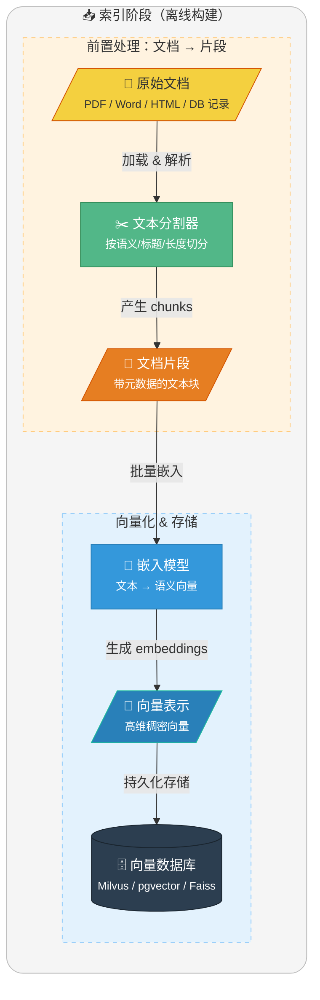
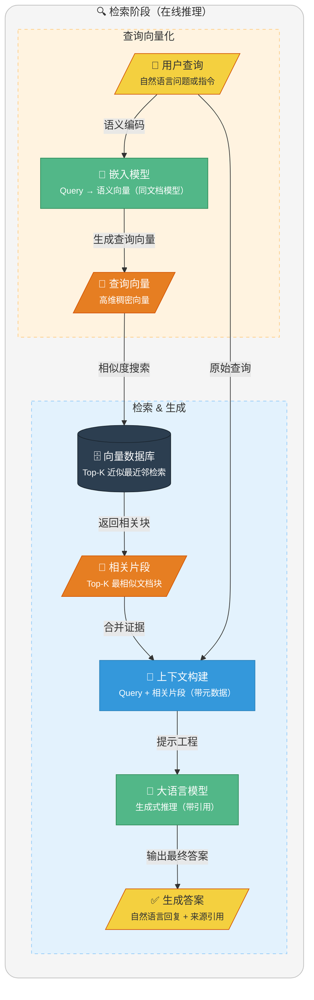

<!-- @include: @article-header.snippet.md -->

Năm ngoái khi phỏng vấn ở ByteDance, người phỏng vấn hỏi tôi: "Hệ thống hỏi đáp knowledge base trong dự án của bạn được làm như thế nào?" Tôi nói: "Gọi trực tiếp API của OpenAI, nhét tài liệu vào cho mô hình tự đọc."

Không khí im lặng đột ngột ba giây. Tôi thấy người phỏng vấn nhíu mày, mới nhận ra có gì đó không ổn — lúc đó tài liệu dự án của chúng tôi có hơn 200.000 chữ, mỗi request đều vượt giới hạn Token, và mô hình còn không nhớ nổi tài liệu API vừa cập nhật tuần trước.

Sau khi bị trượt phỏng vấn mới hiểu: đó gọi là "gọi LLM trần trụi", mà cách đúng đắn phải là RAG.

Chuyện vui là chuyện vui, RAG (Retrieval-Augmented Generation - Tạo sinh tăng cường bằng truy xuất) thực sự là công nghệ stack cốt lõi trong phát triển ứng dụng LLM hiện tại, cũng là câu hỏi thường gặp trong phỏng vấn. Hôm nay Guide chia sẻ một số câu hỏi phỏng vấn liên quan đến khái niệm cơ bản RAG, hy vọng giúp ích cho mọi người:

1. ⭐️ RAG là gì?
2. ⭐️ Tại sao cần RAG?
3. RAG được dùng phổ biến trong những trường hợp nào?
4. ⭐️ Đã có nhiều kịch bản tốt như vậy, tại sao một số doanh nghiệp vẫn thích dùng tìm kiếm truyền thống hơn RAG?
5. Nguyên lý hoạt động của RAG
6. Sự khác biệt giữa RAG và công cụ tìm kiếm truyền thống là gì?
7. ⭐️ Ưu điểm cốt lõi và hạn chế của RAG lần lượt là gì?

## ⭐️ RAG là gì?

**RAG (Retrieval-Augmented Generation, Tạo sinh tăng cường bằng truy xuất)** là một framework kết hợp công nghệ **Information Retrieval (IR - Truy xuất thông tin)** mạnh mẽ với **Large Language Model (LLM - Mô hình ngôn ngữ lớn tạo sinh)**.

Ý tưởng cốt lõi của RAG là: trước khi để LLM trả lời câu hỏi hoặc tạo văn bản, trước tiên truy xuất thông tin ngữ cảnh liên quan từ một knowledge base quy mô lớn (như database, bộ sưu tập tài liệu), sau đó cung cấp thông tin này cùng câu hỏi gốc cho LLM, từ đó "tăng cường" khả năng tạo sinh của nó, cho phép nó tạo ra câu trả lời chính xác hơn, có tính thời sự hơn và phù hợp hơn với kiến thức miền cụ thể.

## ⭐️ Tại sao cần RAG?

Dù LLM bản thân sở hữu kiến thức khổng lồ, nhưng nó vẫn đối mặt với ba thách thức cốt lõi, và RAG chính là giải pháp hiệu quả để giải quyết những thách thức này:

**1. Giải quyết vấn đề tính thời sự của kiến thức (Chống "Knowledge Cutoff")**

Kiến thức của LLM pre-trained bị cố định tại **thời điểm cắt của dữ liệu training (Knowledge Cutoff)**. Ví dụ, knowledge base của GPT-4 có thể cắt tại tháng 12 năm 2023. Đối với các sự kiện mới, kiến thức mới xảy ra sau đó, LLM không thể trực tiếp đưa ra câu trả lời chính xác. RAG thông qua **truy xuất động từ nguồn kiến thức bên ngoài**, cung cấp bổ sung kiến thức "thời gian thực" cho LLM, từ đó khắc phục vấn đề kiến thức lỗi thời.

**2. Mở thông quyền truy cập dữ liệu riêng tư (Hỗ trợ ứng dụng cấp doanh nghiệp)**

Do yêu cầu bảo mật dữ liệu và bí mật kinh doanh, **dữ liệu riêng tư** nội bộ doanh nghiệp (như tài liệu sản phẩm, knowledge base nội bộ, dữ liệu khách hàng, v.v.) không thể được LLM công khai truy cập trực tiếp. Công nghệ RAG có thể kết nối an toàn các nguồn dữ liệu riêng tư này, khi người dùng đặt câu hỏi, chỉ trích xuất thông tin đoạn trích liên quan đến câu hỏi để cung cấp cho LLM, cho phép nó trả lời dựa trên kiến thức riêng của doanh nghiệp trong điều kiện **không tiết lộ toàn bộ dữ liệu**, thực hiện ứng dụng AI cấp doanh nghiệp thực sự có thể sử dụng được.

**3. Nâng cao độ chính xác và khả năng truy vết của câu trả lời (Chống "Ảo giác mô hình")**

LLM đôi khi tạo ra **"Hallucination (Ảo giác)"**, tức là bịa đặt thông tin không phù hợp với thực tế. RAG thông qua việc cung cấp văn bản tham chiếu rõ ràng, có bằng chứng, buộc câu trả lời của LLM **dựa trên các sự thật đã truy xuất được**, giảm đáng kể tỷ lệ ảo giác xảy ra. Đồng thời, vì có thể hiển thị văn bản gốc được trích dẫn, khiến **nguồn của câu trả lời có thể truy vết, có thể xác minh**, tăng độ tin cậy của hệ thống và mức độ tin tưởng của người dùng.

## RAG được dùng phổ biến trong những trường hợp nào?

RAG (Tạo sinh tăng cường bằng truy xuất) phù hợp nhất cho các kịch bản **"câu trả lời phụ thuộc vào tài liệu bên ngoài, và tài liệu sẽ thay đổi/rất dài"**: trước tiên truy xuất nội dung liên quan từ knowledge base, rồi để mô hình lớn tạo câu trả lời dựa trên kết quả truy xuất, từ đó giảm bịa đặt, nâng cao khả năng truy vết.

Dưới đây liệt kê một số kịch bản phổ biến nhất:

- **Chatbot hỗ trợ khách hàng**: Hỏi đáp, xử lý sự cố, hướng dẫn quy trình dựa trên knowledge base sản phẩm; ví dụ: "Làm thế nào để đổi trả hàng/xuất hóa đơn?" "Mã lỗi thiết bị loại X xử lý như thế nào?"
- **Copilot cho R&D/Vận hành**: Truy xuất codebase, tài liệu API, sổ tay cảnh báo, hỗ trợ xác định vấn đề và tạo đề xuất sửa lỗi.
- **Trợ lý y tế**: Tạo đề xuất hỗ trợ sau khi truy xuất hướng dẫn/hướng dẫn thuốc/quy chuẩn bệnh viện (không đưa ra chẩn đoán cuối cùng); ví dụ: "Chống chỉ định của thuốc X là gì?" "Giải thích ý nghĩa các chỉ số xét nghiệm theo hướng dẫn".
- **Tư vấn pháp lý**: Truy xuất dựa trên điều luật/án lệ/mẫu hợp đồng, tạo giải thích điều khoản và cảnh báo rủi ro; ví dụ: "Tiền phạt vi phạm hợp đồng tính như thế nào?" "Viết điều khoản bất khả kháng an toàn hơn như thế nào?"
- **Gia sư giáo dục**: Truy xuất kiến thức từ giáo trình/bài giảng/ngân hàng đề thi, tạo giải thích và các bước ví dụ; ví dụ: "Bài này tương ứng với công thức nào? Suy luận như thế nào?"
- **Trợ lý nội bộ doanh nghiệp**: Kết nối quy chế, SOP, biên bản họp, tài liệu kỹ thuật để truy xuất/tóm tắt/so sánh; ví dụ: "Phiên bản mới nhất của quy trình X là gì?" "So sánh sự khác biệt của hai phương án và đưa ra kết luận".
- **Khác**: Nghiên cứu đầu tư/tuân thủ/kiểm toán (báo cáo/công bố/kiểm soát nội bộ); hỗ trợ bán hàng/giải pháp (sổ tay sản phẩm/mẫu hồ sơ thầu, tạo phương án và đánh dấu nguồn gốc).

## ⭐️ Đã có nhiều kịch bản tốt như vậy, tại sao một số doanh nghiệp vẫn thích dùng tìm kiếm truyền thống hơn RAG?

Vì RAG có vấn đề chi phí suy luận và độ trễ phản hồi. Trong một số kịch bản đơn giản thuần túy để "tìm file" chứ không phải "tóm tắt câu trả lời", tìm kiếm truyền thống vẫn có lợi thế hiệu quả tối ưu.

Dưới đây so sánh đơn giản hai cái:

| Chiều                        | Tìm kiếm truyền thống (hộp tìm kiếm)                           | RAG (truy xuất + tạo sinh)                                                            |
| ---------------------------- | -------------------------------------------------------------- | ------------------------------------------------------------------------------------- |
| Mục tiêu người dùng          | Tìm tài liệu/trang/file đính kèm                               | Trực tiếp nhận câu trả lời có thể đọc/tóm tắt/kết luận so sánh                        |
| Độ trễ & Chi phí             | Cực thấp, dễ mở rộng                                           | Cao hơn (truy xuất + suy luận LLM)                                                    |
| Khả năng kiểm soát/kiểm toán | Mạnh: cung cấp link văn bản gốc                                | Yếu hơn: có thể hiểu sai/tóm tắt lệch, cần trích dẫn và đánh giá                      |
| Rủi ro                       | Thấp (chủ yếu là xếp hạng recall)                              | Cao hơn (ảo giác, lỗi trích dẫn, rò rỉ ngoài quyền hạn)                               |
| Quản trị dữ liệu             | Tương đối trưởng thành (ACL, lọc trường)                       | Phức tạp hơn (lọc truy xuất + ẩn danh ngữ cảnh + log)                                 |
| Kịch bản áp dụng             | Truy xuất số/tiêu đề/từ khóa, tìm mẫu, tìm văn bản gốc quy chế | Hỗ trợ khách hàng, debug kỹ thuật, giải thích quy chế, tóm tắt so sánh cross-document |
| Thực hành tốt nhất           | ES/BM25 + lọc quyền hạn                                        | Truy xuất hỗn hợp + rerank + truy vết trích dẫn + lọc quyền hạn + vòng đánh giá       |

## Nguyên lý hoạt động của RAG

Quá trình RAG được chia thành hai giai đoạn khác nhau: **Indexing (Lập chỉ mục)** và **Retrieval (Truy xuất)**.

Ở giai đoạn indexing, tài liệu được tiền xử lý để thực hiện tìm kiếm hiệu quả ở giai đoạn truy xuất. Giai đoạn này thường bao gồm các bước sau:

1. **Input tài liệu**: Tài liệu là nguồn nội dung cần được xử lý, có thể là file văn bản, PDF, trang web, bản ghi database, v.v.
2. **Làm sạch tài liệu**: Xử lý khử nhiễu tài liệu, loại bỏ nội dung vô dụng (như HTML tag, ký tự đặc biệt).
3. **Tăng cường tài liệu**: Sử dụng dữ liệu bổ sung và metadata (như timestamp, tag phân loại) để cung cấp thêm thông tin ngữ cảnh cho các đoạn tài liệu.
4. **Phân chia tài liệu (Chunking)**: Dùng Text Splitter để phân chia tài liệu thành các đoạn văn bản nhỏ hơn (Segments), phù hợp nghiêm ngặt với giới hạn Context Window của embedding model và generation model.
5. **Biểu diễn vector (Embedding Generation)**: Thông qua embedding model (như OpenAI text-embedding-3 hoặc mô hình mã nguồn mở trên Hugging Face) ánh xạ các đoạn văn bản thành biểu diễn semantic vector (Document Embedding, tức là vector dày đặc nhiều chiều).
6. **Lưu vào vector database**: Lưu trữ embedding vector được tạo, nội dung gốc và metadata tương ứng vào vector store (như Milvus, Faiss hoặc pgvector).

Quá trình indexing thường được hoàn thành offline, ví dụ re-indexing thông qua scheduled task (như cập nhật tài liệu cuối tuần). Đối với nhu cầu động, ví dụ kịch bản người dùng upload tài liệu, indexing có thể hoàn thành online và tích hợp vào ứng dụng chính.

**Sơ đồ luồng đơn giản hóa của giai đoạn Indexing như sau**:

Retrieval thường được thực hiện online, khi người dùng submit một câu hỏi, hệ thống sẽ sử dụng các tài liệu đã được lập chỉ mục để trả lời câu hỏi. Giai đoạn này thường bao gồm các bước sau:

1. **Nhận request:** Nhận natural language query (Query) của người dùng, ví dụ một câu hỏi hoặc mô tả nhiệm vụ. Trong một số kịch bản nâng cao, hệ thống sẽ trước tiên rewrite hoặc mở rộng query gốc để nâng cao độ bao phủ của truy xuất tiếp theo.
2. **Vector hóa query:** Sử dụng Embedding Model chuyển đổi query của người dùng thành biểu diễn semantic vector (Query Embedding, tức là vector dày đặc nhiều chiều), để nắm bắt thông tin ngữ nghĩa của query.
3. **Information Retrieval (R):** Trong Embedding Store, tìm các đoạn tài liệu (Relevant Segments) liên quan nhất đến query vector thông qua tìm kiếm semantic similarity.
4. **Generation Augmentation (A):** Đưa các đoạn liên quan được truy xuất và query gốc làm ngữ cảnh input vào LLM, và sử dụng prompt phù hợp để hướng dẫn LLM trả lời câu hỏi dựa trên thông tin đã truy xuất.
5. **Output Generation (G):** Xuất phản hồi ngôn ngữ tự nhiên cho người dùng, kèm theo link tài liệu tham khảo liên quan.
6. **Phản hồi kết quả (Tùy chọn):** Nếu người dùng không hài lòng với kết quả được tạo, có thể cho phép người dùng cung cấp feedback, tối ưu hóa hiệu quả tạo sinh bằng cách điều chỉnh prompt hoặc phương thức truy xuất. Trong một số implement, hỗ trợ tương tác nhiều vòng để tiếp tục hoàn thiện câu trả lời.

**Sơ đồ luồng đơn giản hóa của giai đoạn Retrieval như sau**:

## Sự khác biệt giữa RAG và công cụ tìm kiếm truyền thống là gì?

Dù RAG và công cụ tìm kiếm truyền thống đều liên quan đến việc lấy thông tin, nhưng chúng có sự khác biệt bản chất về **cơ chế truy xuất, xử lý thông tin và hình thức bàn giao**:

1. **Cơ chế truy xuất:**
   - **Tìm kiếm truyền thống** chủ yếu dựa vào **chỉ mục đảo ngược và khớp từ vựng** (như BM25, TF-IDF), phụ thuộc mạnh vào hình thức chữ viết của từ khóa. Dù các công cụ tìm kiếm hiện đại cũng đã giới thiệu hiểu ngữ nghĩa (như BERT), nhưng core vẫn là tính toán relevance dựa trên thống kê từ vựng.
   - **RAG** thường sử dụng **tìm kiếm semantic vector**, có thể nhận dạng từ đồng nghĩa và ngữ cảnh sâu, giải quyết vấn đề khoảng cách ngữ nghĩa.
2. **Logic xử lý:**
   - **Tìm kiếm truyền thống** về bản chất là **bộ xếp hạng relevance**, sắp xếp các tài liệu ứng viên theo điểm relevance và trực tiếp hiển thị cho người dùng. Mỗi kết quả tương đối độc lập, không tích hợp thông tin cross-document.
   - **RAG** về bản chất là **bộ tổng hợp thông tin**, nó feed nhiều mảnh kiến thức (Chunks) được truy xuất vào LLM, để mô hình thực hiện quy nạp logic và tích hợp thông tin cross-document.
3. **Bàn giao kết quả:**
   - **Tìm kiếm truyền thống** cung cấp danh sách tài liệu ứng viên (gợi ý), người dùng cần đọc và lọc thêm lần nữa;
   - **RAG** cung cấp câu trả lời, có thể trực tiếp trả lời các chỉ thị phức tạp, và thông qua đánh dấu Citations (trích dẫn) vẫn đảm bảo khả năng truy vết nguồn gốc thông tin.
4. **Tính thời sự và phạm vi dữ liệu:** Tìm kiếm truyền thống phụ thuộc nhiều hơn vào crawler quy mô lớn và chỉ mục toàn web; RAG thường được dùng cho **knowledge base riêng tư hoặc miền dọc**, có thể với chi phí thấp giúp LLM có được bổ sung kiến thức thời gian thực hoặc miền cụ thể, không cần fine-tune mô hình thường xuyên.

## ⭐️ Ưu điểm cốt lõi và hạn chế của RAG lần lượt là gì?

Ưu điểm cốt lõi và hạn chế của RAG có thể phân tích từ ba chiều **quản lý kiến thức, triển khai kỹ thuật và chỉ số hiệu suất**:

**Ưu điểm cốt lõi:**

1. **Tính thời sự kiến thức và chi phí bảo trì thấp:** So với fine-tuning, RAG không cần train lại mô hình. Chỉ cần cập nhật vector database hoặc knowledge base, mô hình có thể ngay lập tức lấy thông tin mới nhất, rất phù hợp để xử lý các dữ liệu thay đổi thường xuyên như tin tức, quy định, tài liệu sản phẩm. Tính chất plug-and-play này khiến chi phí cập nhật kiến thức giảm từ hàng nghìn đô la xuống gần như bằng không.
2. **Giảm đáng kể ảo giác và cung cấp truy vết trích dẫn:** RAG chuyển đổi mô hình từ "tạo sinh dựa trên bộ nhớ tham số hóa" sang "tạo sinh dựa trên bằng chứng truy xuất được". Mỗi câu trả lời đều có nguồn thông tin rõ ràng, cung cấp **khả năng giải thích và xác minh** quan trọng. Điều này đặc biệt quan trọng cho các kịch bản yêu cầu độ chính xác cao như tuân thủ tài chính, chẩn đoán y tế, tư vấn pháp lý.
3. **Bảo mật dữ liệu và kiểm soát quyền hạn chi tiết:** Có thể triển khai **cách ly multi-tenant chính xác và kiểm soát truy cập (ACL)** ở lớp truy xuất, đảm bảo người dùng chỉ có thể truy xuất dữ liệu trong phạm vi quyền hạn của mình. So với việc "đốt cháy" dữ liệu nhạy cảm vào tham số mô hình thông qua fine-tuning (có rủi ro rò rỉ dữ liệu), kiến trúc RAG tự nhiên hỗ trợ cách ly dữ liệu và yêu cầu tuân thủ.
4. **Khả năng thích ứng miền mạnh:** Không cần train lại mô hình cho miền cụ thể, chỉ cần xây dựng domain knowledge base là có thể nhanh chóng thích nghi với kịch bản dọc, như quản lý kiến thức nội bộ doanh nghiệp, hỗ trợ kỹ thuật chuyên nghiệp, v.v.

**Hạn chế và thách thức kỹ thuật:**

1. **Phụ thuộc nghiêm trọng vào truy xuất:** Tuân theo nguyên tắc GIGO (Garbage In, Garbage Out). Nếu chất lượng thông tin đầu vào không tốt, dù mô hình downstream mạnh đến đâu cũng khó output kết quả đúng. Điều này đặc biệt rõ ràng trong hệ thống RAG. Ví dụ, nếu biểu diễn embedding ở giai đoạn truy xuất không chính xác, hoặc chiến lược chunking không hợp lý, dẫn đến nội dung được recall không liên quan đến câu hỏi, thì dù upstream downstream dùng LLM gì, câu trả lời cuối cùng cũng sẽ không đáng tin cậy.
2. **Context Window và nhiễu suy luận:** Dù Context Window đã được đẩy lên mức triệu (như giới hạn 1M của Claude 4.6 Opus), nhưng điều đó không có nghĩa là chúng ta có thể "feed bạo lực". Inject quá nhiều đoạn không liên quan (Noisy Chunks) sẽ gây ra **attention dilution (loãng chú ý)**, cản trở suy luận logic của mô hình, và gây ra **chi phí Token không cần thiết**.
3. **Tăng Time To First Token (TTFT):** Chuỗi hoàn chỉnh bao gồm "rewrite query -> vector hóa -> tìm kiếm similarity -> Rerank -> xây dựng ngữ cảnh -> tạo sinh LLM", mỗi khâu đều tăng thêm độ trễ.
4. **Độ phức tạp kỹ thuật:** Cần duy trì vector database, xử lý incremental indexing khi tài liệu cập nhật, tối ưu hóa chiến lược truy xuất, v.v., độ phức tạp tăng đáng kể so với ứng dụng LLM thuần túy.
5. **Chi phí Token văn bản dài:** Dù tiết kiệm được chi phí training, nhưng một request mang theo nhiều ngữ cảnh sẽ khiến chi phí suy luận (Input Tokens) cao hơn đáng kể so với hội thoại thông thường.

## ⭐️ Thêm câu hỏi phỏng vấn RAG thường gặp

Nội dung trên được trích từ tutorial dự án thực chiến của [Star Planet](https://javaguide.cn/about-the-author/zhishixingqiu-two-years.html) của tôi: [《Nền tảng phỏng vấn thông minh SpringAI + RAG Knowledge Base》](https://javaguide.cn/zhuanlan/interview-guide.html). Nội dung được sắp xếp như sau (đã hoàn thành, tổng cộng 130.000+ chữ)

Hai bài Spring AI và câu hỏi phỏng vấn RAG cộng lại gần 60 câu hỏi, chủ đích là toàn diện!

**Địa chỉ dự án** (Chào mừng Star để ủng hộ):

- Github: <https://github.com/Snailclimb/interview-guide>
- Gitee: <https://gitee.com/SnailClimb/interview-guide>

Code hoàn chỉnh hoàn toàn miễn phí mã nguồn mở, không có phiên bản Pro hay phiên bản trả phí!

## Tổng kết

RAG (Tạo sinh tăng cường bằng truy xuất) là một trong những công nghệ stack cốt lõi nhất của ứng dụng AI cấp doanh nghiệp hiện tại. Qua bài viết này, chúng ta đã hệ thống hóa kiến thức cốt lõi của RAG:

**Ôn lại các điểm chính**:

1. **RAG là gì**: Trước tiên truy xuất nội dung liên quan từ knowledge base, rồi để LLM tạo câu trả lời dựa trên kết quả truy xuất, từ đó giảm ảo giác, nâng cao khả năng truy vết
2. **Tại sao cần RAG**: Giải quyết ba vấn đề cốt lõi của LLM: tính thời sự kiến thức, truy cập dữ liệu riêng tư, ảo giác
3. **RAG vs Tìm kiếm truyền thống**: RAG là "bộ tổng hợp thông tin", tìm kiếm truyền thống là "bộ xếp hạng relevance"
4. **Ưu điểm cốt lõi**: Tính thời sự kiến thức, giảm ảo giác, bảo mật dữ liệu, khả năng thích ứng miền mạnh
5. **Hạn chế**: Phụ thuộc truy xuất, giới hạn context window, độ phức tạp kỹ thuật, chi phí Token

**Câu hỏi phỏng vấn thường gặp**:

- RAG là gì? Tại sao cần RAG?
- RAG và công cụ tìm kiếm truyền thống có gì khác nhau?
- Ưu điểm cốt lõi và hạn chế của RAG là gì?
- Kịch bản nào phù hợp dùng RAG? Kịch bản nào không phù hợp?

**Gợi ý học tập**:

1. **Hiểu nguyên lý**: Đừng chỉ ghi nhớ luồng của RAG, hãy hiểu tại sao mỗi bước được thiết kế như vậy
2. **Thực hành**: Xây dựng một hệ thống RAG đơn giản, từ phân chia tài liệu đến truy xuất vector đến tạo sinh LLM
3. **Chú ý tối ưu hóa**: Có nhiều điểm tối ưu hóa trong RAG (chiến lược Chunking, lựa chọn Embedding, Rerank, v.v.), mỗi điểm đều đáng nghiên cứu sâu

RAG là cầu nối giữa LLM và kiến thức doanh nghiệp, hiểu nguyên lý hoạt động và ranh giới áp dụng của nó thực tế hơn là chạy theo framework mới nhất.
