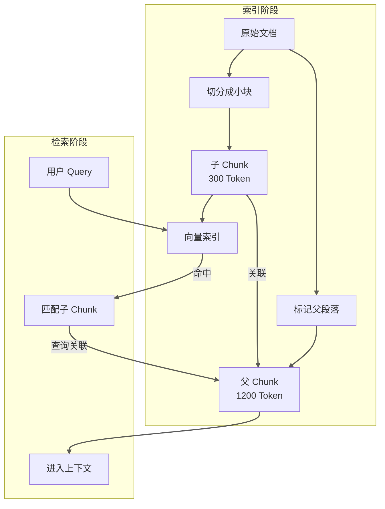
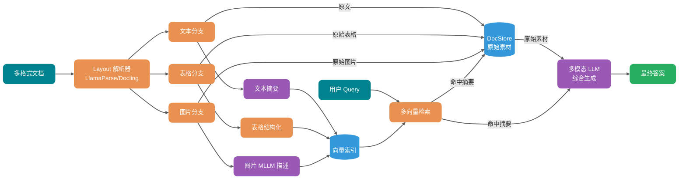

> **Quy ước thuật ngữ**: Trong bài này "Chunking" và "cắt", "Embedding" và "nhúng", "Chunk" và "khối" có cùng nghĩa, thống nhất dùng thuật ngữ để duy trì khả năng đọc.

Nhiều team lần đầu xây hệ thống RAG đều sẽ trải qua một giai đoạn rất thú vị: mua vector database đắt nhất, điều chỉnh mô hình embedding tốt nhất, sau khi lên production phát hiện câu trả lời vẫn một mớ hỗn độn.

Nguyên nhân gốc rễ thường không phải ở khâu truy vấn, mà ở thượng nguồn hơn — tài liệu hoàn toàn không được phân tích đúng, khi cắt đã tách rời các cột bảng, Chunk cắt điều kiện và kết luận thành hai nửa, header và footer trang được đưa vào chỉ mục như văn bản chính.

Nói cách khác: **Điểm nghẽn của RAG thường không phải ở tầng truy vấn, mà ở đoạn pipeline trước khi tài liệu vào chỉ mục.**

Vấn đề này đặc biệt nổi bật trong các kịch bản như PDF đa cột, cấp tiêu đề Word, liên kết trường Excel, OCR tài liệu quét. Nhiều team nghĩ đổi mô hình embedding mạnh hơn sẽ giải quyết được, thực ra chỉ là làm cho lỗi được biểu đạt ổn định hơn mà thôi.

Bài viết này sẽ phân tích pipeline này từ đầu đến cuối. Gần 1 vạn chữ, khuyên nên lưu lại, chủ yếu bao gồm mấy phần này:

1. Toàn bộ chuỗi từ khi tài liệu được tải lên đến khi vào cơ sở dữ liệu và các điểm bẫy ở từng khâu;
2. Kịch bản áp dụng và dữ liệu thực đo của các chiến lược Chunking khác nhau;
3. Tại sao mất ngữ nghĩa xảy ra và làm thế nào ứng phó;
4. Vấn đề mất cấu trúc như bảng và đa cột;
5. Kiểm tra phân tầng làm như thế nào;
6. Hình ảnh, bảng, biểu đồ làm thế nào trở thành nội dung có thể truy vấn.

## Tài liệu từ khi tải lên đến khi vào cơ sở dữ liệu phải trải qua những khâu nào?

Trước khi nói chiến lược cụ thể, hãy vẽ rõ chuỗi liên kết trước. Tài liệu từ khi tải lên đến khi vào vector database, ở giữa phải trải qua ít nhất sáu khâu:


Trong hình này có một điểm dễ bỏ qua: kiểm tra chất lượng không nên chỉ xảy ra sau khi vào cơ sở dữ liệu. Thực hiện kiểm tra lấy mẫu ở giai đoạn Chunking có thể phát hiện vấn đề sớm, tránh ghi hàng loạt dữ liệu chất lượng thấp vào vector database.

> Lưu ý: Hình này hiển thị đơn giản hóa kiểm tra ở giai đoạn Chunking, chiến lược kiểm tra phân tầng hoàn chỉnh xem phần "Làm thế nào thiết kế chiến lược kiểm tra phân tầng" ở sau, bao gồm ba tầng kiểm tra định dạng, kiểm tra phân tích và kiểm tra Chunking.

Rủi ro cốt lõi của từng khâu:

| Khâu                | Vấn đề điển hình                                                    | Ảnh hưởng cuối cùng                            |
| ------------------- | ------------------------------------------------------------------- | ---------------------------------------------- |
| Tải file lên        | Giả mạo định dạng, kích thước vượt giới hạn, encoding hỗn loạn      | Parser crash hoặc thất bại lặng lẽ             |
| Kiểm tra định dạng  | Tên extension và MIME type thực tế không khớp                       | Chọn nhầm parser                               |
| Phân tích Layout    | PDF đa cột, ô bảng merge, header footer                             | Mất cấu trúc, ngữ cảnh bị sai lệch             |
| Làm sạch loại nhiễu | Ký tự loạn, ký tự đặc biệt, dòng trắng trùng lặp, mục lục còn lại   | Nhiễu vào chỉ mục, Embedding bị méo            |
| Chunking            | Cắt đứt ngữ nghĩa, ngữ cảnh bị gián đoạn, block quá to hoặc quá nhỏ | Thu hồi không chính xác, câu trả lời thiếu sót |
| Metadata            | Không lưu nguồn, số trang, version, quyền                           | Không thể lọc, không thể trích dẫn             |
| Vào cơ sở dữ liệu   | Chiều vector không nhất quán, Token vượt giới hạn                   | Truy vấn thất bại, chỉ mục hỏng                |

Nhiều team đặt công sức vào việc đổi mô hình embedding nào, nhưng thực ra nếu dữ liệu ở bước này đã hỏng rồi, đổi mô hình chỉ làm cho hỏng ổn định hơn.

## Làm sao chọn chiến lược Chunking phù hợp?


### Cắt độ dài cố định: Đủ dùng nhưng không hoàn hảo

Cách làm thô nhất là cắt cứng theo số ký tự hoặc số Token. Ví dụ mỗi 1000 Token cắt một block, các block liền kề overlap 200 Token.

Cách này triển khai đơn giản, hành vi có thể dự đoán, trong tài liệu ngắn và kịch bản FAQ hiệu quả không tệ. Nhưng điểm yếu cứng của nó cũng rất rõ: nó không hiểu đoạn văn là gì, bảng là gì, code block là gì.

Trong thực đo, sự chênh lệch giữa cắt cố định 512-token và cắt đệ quy thực ra rất nhỏ — chỉ khoảng 2 điểm phần trăm. Đối với kịch bản xác minh nhanh tính khả thi RAG, khoảng cách này có thể không đáng để thêm độ phức tạp.

Ví dụ, trong một tài liệu chính sách viết:

> "Trừ các trường hợp sau đây, đều có thể đăng ký hoàn trả không lý do trong bảy ngày: (i) Hàng tùy chỉnh; (ii) Hàng tươi sống dễ hỏng; (iii) Hàng hóa kỹ thuật số được tải xuống trực tuyến..."

Nếu danh sách này vừa vặn nằm trên ranh giới 1000 Token, block trước có thể chỉ có "Trừ các trường hợp sau đây, đều có thể đăng ký hoàn trả không lý do trong bảy ngày", block sau chỉ có "(i) Hàng tùy chỉnh...". Nhìn riêng lẻ cái nào cũng không đầy đủ, model rất dễ hiểu sai ý.

Vì vậy cắt độ dài cố định chỉ phù hợp làm baseline, không phù hợp làm điểm kết.

### Cắt ký tự đệ quy: Giữ cấu trúc phân cấp

Cách suy nghĩ của Recursive Character Splitting (cắt ký tự đệ quy) rất trực quan: trước tiên tách đoạn văn bằng ký tự xuống dòng, đoạn văn quá lớn thì cắt bằng dấu chấm, câu vẫn quá dài thì cắt bằng khoảng trắng, từng tầng xuống dưới, cho đến khi mỗi block đều nhỏ hơn kích thước mục tiêu. Nói trắng ra là mô phỏng cách người đọc sách — xem chương trước, rồi xem đoạn, rồi xem câu.

Nếu tài liệu của bạn có tiêu đề nhưng không nhất thiết mỗi cấp đều có nội dung, hoặc đoạn văn dài ngắn không đều, cấu trúc không đều đặn này dùng cắt đệ quy rất phù hợp. Blog kỹ thuật, sổ tay sản phẩm, báo cáo nghiên cứu đều thuộc loại này.

`RecursiveCharacterTextSplitter` của LangChain là triển khai điển hình của cách suy nghĩ này. Đối với nội dung có cấu trúc như code Python, dùng block size khoảng 100 Token và overlap khoảng 15 Token có thể đạt cân bằng tốt giữa độ chính xác ngữ cảnh và recall rate. Chú ý: tham số này được tối ưu cho tài liệu code, tài liệu văn bản phổ quát khuyến nghị dùng 400-512 Token.

### Cắt ngữ nghĩa: Cắt theo ý nghĩa, nhưng có chi phí

Cắt ngữ nghĩa đi xa hơn: không cắt theo ký tự hoặc phân cấp, mà dùng mô hình embedding phán đoán độ tương tự ngữ nghĩa giữa các câu, gom những câu có ý nghĩa gần nhau thành một nhóm.

Nhưng Guide đã từng dẫm vào cái bẫy này — cắt ngữ nghĩa đặc biệt dễ tạo ra block siêu nhỏ. Trong một đánh giá, các đoạn mà cắt ngữ nghĩa tạo ra trung bình chỉ có 43 Token, block nhỏ thế này ngữ cảnh nghiêm trọng không đủ, mang đi truy vấn cơ bản là vô dụng.

Còn có vấn đề chi phí: nó cần thêm lần gọi embedding để tính độ tương tự câu, lượng tài liệu một lớn, hóa đơn rất đáng kể. Thực đo cho thấy hiệu năng cắt ngữ nghĩa cực kỳ nhạy cảm với tham số threshold và min chunk size. Đặt min_chunk_size hợp lý (ví dụ 200-400 Token) có thể tránh vấn đề đoạn siêu nhỏ, sau khi tinh chỉnh hiệu quả sẽ tốt hơn nhiều.

### Cắt theo cấu trúc tài liệu: Ranh giới ngữ nghĩa tự nhiên

Nếu tài liệu của bạn có cấu trúc rõ ràng, cắt theo cấu trúc lại là đáng tin nhất. NVIDIA đã làm một nhóm thực đo, Page-Level Chunking (cắt theo trang) trên báo cáo tài chính và tài liệu pháp lý có hiệu quả tốt nhất, độ chính xác trung bình đạt 0.648, phương sai cũng thấp nhất. Lý do đơn giản: khi ranh giới trang bản thân là ranh giới ngữ nghĩa mà tác giả tài liệu đặt ra, đừng cưỡng bức tách ra.

Tuy nhiên đừng mù quáng mê tín cắt theo trang. Ưu thế này so với cắt Token thực ra chỉ có 0.3-4.5 điểm phần trăm, và trên dataset FinanceBench, cắt 1024-token lại tốt hơn cấp trang (0.579 vs 0.566). Loại tài liệu NVIDIA test (báo cáo tài chính, tài liệu pháp lý) là kịch bản phân trang bản thân mang ngữ nghĩa — nếu PDF của bạn là loại Word xuất ra tùy tiện, cắt cấp trang sẽ không mang lại thêm lợi ích. Ngoài ra loại truy vấn cũng ảnh hưởng đến chiến lược tối ưu: truy vấn fact phù hợp block nhỏ 256-512 Token, truy vấn phân tích phù hợp cắt 1024+ Token hoặc cấp trang.

Phương thức cắt khuyến nghị tương ứng với các loại tài liệu khác nhau, Guide đã tổng hợp một bảng để tham khảo:

| Loại tài liệu | Phương thức cắt khuyến nghị      | Công cụ triển khai                |
| ------------- | -------------------------------- | --------------------------------- |
| Markdown      | Cắt theo cấp tiêu đề (H1/H2/H3)  | `MarkdownHeaderTextSplitter`      |
| HTML          | Cắt theo cấp thẻ (h1~h6, p, div) | `HTMLHeaderTextSplitter`          |
| PDF           | Cắt theo trang hoặc chương       | `chunk_by_title`, `chunk_by_page` |
| Code          | Cắt theo hàm, class, package     | `PythonCodeTextSplitter`          |
| Bài báo       | Cắt theo chương, đoạn, bảng      | Layout-aware Parser               |

### Parent-Child Chunk: Sự thỏa hiệp giữa thu hồi và ngữ cảnh

Người làm RAG sớm muộn sẽ gặp một mâu thuẫn: block nhỏ thu hồi chính xác nhưng ngữ cảnh thiếu sót, block lớn giữ nguyên vẹn nhưng nhiễu thu hồi lớn. Bạn muốn thu hồi chính xác phải cắt block nhỏ, nhưng cắt nhỏ model chỉ thấy cục bộ, trả lời dễ hiểu sai ý.

Parent-Child Chunk chính là để giải quyết mâu thuẫn này. Cách làm cụ thể là trước tiên cắt tài liệu thành block nhỏ khoảng 300 Token dùng cho vector search, rồi mỗi block nhỏ được gắn vào một đoạn cha 1200 Token. Khi truy vấn trước tiên đánh trúng block nhỏ, rồi đưa đoạn cha tương ứng vào ngữ cảnh. Như vậy vừa đảm bảo độ chính xác thu hồi, vừa giữ lại ngữ cảnh cần thiết.



Mô hình này trong tài liệu dài, tutorial, giải thích chính sách, sổ tay xử lý sự cố và các kịch bản khác hiệu quả rõ ràng. Nhược điểm là lượng lưu trữ chỉ mục sẽ tăng (mỗi Chunk con đều phải liên kết Chunk cha), khi truy vấn thêm một lần query liên kết.

### Kiểm soát overlap: Giải pháp cho vấn đề ranh giới

Dù dùng chiến lược cắt nào, ranh giới block đều là rắc rối. Hai trang liên tiếp nói cùng một việc, cuối trang trước và đầu trang sau bị số trang cắt cứng, khi truy vấn cả hai block đều thiếu một nửa.

Overlap (trùng lặp) là phương tiện tiêu chuẩn để đối phó vấn đề này, nhưng overlap cũng không phải càng lớn càng tốt. Quá nhỏ thì ranh giới ngữ nghĩa bị gián đoạn, quá lớn thì nội dung trùng lặp quá nhiều, lãng phí không gian vector còn tăng nhiễu truy vấn. Kinh nghiệm của Guide là coi nó như tham số cần điều chỉnh thủ công, không phải một giá trị cố định.

Có thực đo cho thấy, cắt thích ứng căn chỉnh theo ranh giới chủ đề logic có thể đạt hiệu quả tốt — độ chính xác đạt 87%, trong khi baseline kích thước cố định là 50%, khoảng cách có ý nghĩa thống kê (p = 0.001). Nhưng phương án thích ứng này triển khai phức tạp, không phải team nào cũng có sức làm.

Giá trị kinh nghiệm thực tế hơn như sau: văn bản phổ quát dùng block size 512 Token cộng overlap 50-100 Token, cơ bản đủ dùng; tài liệu code đừng áp dụng cứng số Token, cắt theo ranh giới hàm và class ổn định hơn; pháp lý hợp đồng cắt theo cấu trúc điều, khoản, mục, ưu tiên giữ nguyên đơn vị hiệu lực pháp lý; tài liệu có nhiều bảng dày đặc, bảng riêng là một block, tuyệt đối không thể cắt qua block.

## Mất ngữ nghĩa là gì, tại sao xảy ra?


Mất ngữ nghĩa là vấn đề dễ bị bỏ qua nhưng ảnh hưởng lớn trong hệ thống RAG. Nói đơn giản là: thông tin then chốt trong tài liệu gốc, trong quá trình phân tích, làm sạch, cắt, vào cơ sở dữ liệu bị suy yếu hoặc mất đi.

### Các kịch bản điển hình của mất ngữ nghĩa

**Kịch bản thứ nhất: Cắt đứt cấu trúc.** Một logic nghiệp vụ hoàn chỉnh bị tách ra hai Chunk. Chunk đầu nói "điều kiện đăng ký", Chunk thứ hai nói "quy trình phê duyệt", nhưng điều kiện then chốt ở giữa "nếu thỏa mãn X, cần cung cấp thêm tài liệu Y" bị cắt ở ranh giới, trở thành "thông tin còn thiếu" mà cả hai Chunk đều có.

**Kịch bản thứ hai: Bay hơi ngữ cảnh.** Chunk chỉ giữ lại nội dung văn bản, nhưng mất đi thông tin vị trí của nó trong tài liệu. Khi model đọc đến "trong ba năm qua..." không biết đang nói về "đánh giá rủi ro của nhà cung cấp nào đó" hay "giao dịch lịch sử của khách hàng nào đó", vì bối cảnh này đã bị mất khi cắt.

**Kịch bản thứ ba: Phá hủy cấu trúc bảng.** Một bảng nhiều hàng nhiều cột bị phân tích thành văn bản lộn xộn, mối quan hệ ngữ nghĩa giữa cột và cột (ai là primary key, ai là thuộc tính, ai là giá trị số) hoàn toàn mất đi.

**Kịch bản thứ tư: Biến dạng danh từ riêng.** Tài liệu viết là "SSO đăng nhập một lần", sau khi cắt trở thành "SSO đăng nhập...", khi embedding danh từ riêng bị cắt đứt, khi truy vấn hoàn toàn không khớp được.

### Bản chất của mất ngữ nghĩa

Nói cho cùng, mất ngữ nghĩa chính là cắt phá vỡ mối quan hệ phụ thuộc ngữ cảnh của văn bản gốc, trong khi mô hình Embedding chỉ có thể nhìn thấy cửa sổ cục bộ sau khi cắt.

Cơ chế attention của Transformer dù có thể xử lý phụ thuộc xa, nhưng mỗi Token cuối cùng chỉ có thể "nhìn thấy" ngữ cảnh trong Chunk của nó. Nếu thông tin then chốt vượt qua ranh giới Chunk, model sẽ không có đủ thông tin để hiểu đúng nó.

Điều này cũng giải thích tại sao Page-Level Chunking trong một số kịch bản lại có hiệu quả tốt hơn cắt tinh tế — khi trang bản thân chính là đơn vị ngữ nghĩa, cắt theo trang lại giữ lại nhiều ngữ cảnh gốc hơn.

### Chiến lược ứng phó

Cách làm trực tiếp nhất là tăng đầu vào ngữ nghĩa. Đừng chỉ đưa văn bản chính vào chỉ mục, tạo tóm tắt và biến thể câu hỏi cho mỗi Chunk cùng đưa vào chỉ mục. Người dùng hỏi "tiền hoàn trả như thế nào", tài liệu viết là "đường dẫn đăng ký hoàn tiền", hai cách diễn đạt này không trong cùng một không gian ngữ nghĩa, nhưng đều chỉ về cùng một câu trả lời. Tạo tóm tắt hoặc câu hỏi đa góc độ cho Chunk có thể tăng đáng kể xác suất đánh trúng.

Một biện pháp bị đánh giá thấp là giữ lại metadata phân cấp. Ghi lại đường dẫn chương, tiêu đề cha con, số đoạn văn và các thông tin khác trong Metadata, khi truy vấn có thể lọc theo phân cấp, khi tạo cũng có thể bổ sung lại ngữ cảnh. Phần này chi phí thấp nhưng lợi ích lớn, nhiều team lại bỏ qua.

Nếu ngân sách cho phép, có thể thử Late Chunking. Đây là cách làm tương đối mới: trước tiên mã hóa tài liệu đầy đủ qua Transformer một lần, để embedding của mỗi Token đều chứa attention toàn văn, rồi mới làm cắt và pooling trong không gian embedding. Ưu điểm là vector của mỗi Chunk đều giữ lại ngữ cảnh tài liệu đầy đủ, nhược điểm là chi phí tính toán cao, phù hợp với kịch bản lượng tài liệu không lớn nhưng yêu cầu độ chính xác cực cao.

Còn một cách suy nghĩ là dùng LLM khác để phân tích cấu trúc tài liệu, để nó cho bạn biết nên cắt như thế nào (Contextual Chunking). Cách này chi phí cũng cao, nhưng khả năng xử lý cấu trúc tài liệu phức tạp (ví dụ bảng lồng nhau, hỗn hợp hình ảnh văn bản) thực sự mạnh hơn.

## Làm thế nào xử lý vấn đề mất cấu trúc?


Mất cấu trúc là một tập con của mất ngữ nghĩa, nhưng kịch bản của nó cụ thể hơn, ảnh hưởng cũng trực tiếp hơn.

### PDF đa cột

PDF là một trong những định dạng phức tạp nhất. Nhiều PDF có văn bản chính dàn hai cột hay nhiều cột, nhưng luồng văn bản nền có thể lộn xộn — đoạn thứ ba của cột một có thể theo sau đoạn đầu tiên của cột ba, nếu đọc theo thứ tự vật lý khi phân tích sẽ thu được một đống lộn xộn. Guide đã dẫm vào không ít bẫy: có lần xử lý một bản trắng kỹ thuật đôi cột, văn bản phân tích ra thứ tự hoàn toàn sai, ghép kết luận của cột trái vào trước luận cứ của cột phải, kết quả truy vấn ra câu trả lời không ăn khớp.

Cách làm đáng tin nhất là dùng Layout-Aware Parser, loại parser này sẽ nhận dạng vị trí vật lý (tọa độ x, y), kích thước font, khoảng cách đoạn của văn bản, từ đó suy ra thứ tự đọc thực sự. LlamaParse, Docling, Marker-PDF đều hỗ trợ khả năng này.

Đối với tài liệu đặc biệt quan trọng, Guide khuyến nghị làm một vòng so sánh phân tích nhiều phiên bản — cùng một PDF chạy hai parser xem một lần, kiểm tra tính nhất quán của đầu ra. Nếu hai đầu ra khác biệt lớn, có nghĩa là kết quả phân tích không đáng tin, nên hạ cấp xử lý hoặc đánh dấu cần kiểm tra thủ công. Phương pháp này dù tốn thêm thời gian, nhưng có thể tránh đưa văn bản sai thứ tự lặng lẽ vào cơ sở tri thức.

Còn có một kịch bản dễ lật: ô merge trong báo cáo tài chính. Tiêu đề bảng trải dài cột, mục giá trị trải hàng, nếu chỉ phân tích theo luồng văn bản, cấu trúc sẽ hoàn toàn lộn xộn. Loại tài liệu này đừng cố chịu đựng, trực tiếp dùng công cụ trích xuất bảng chuyên dụng (ví dụ module TableFormer của Docling).

### Cấp tiêu đề Word

Cấu trúc tài liệu Word thường được thể hiện qua style tiêu đề (Heading 1, Heading 2, văn bản chính). Nhưng nhiều tài liệu style tiêu đề bị lạm dụng — có người dùng đoạn văn thường phóng to chữ làm tiêu đề, có người đặt văn bản chính thành Heading 3. Guide đã thấy một cái buồn cười hơn: cả bài tài liệu dùng Heading 1 toàn bộ, thông tin cấp bậc phân tích ra hoàn toàn không dùng được.

Nếu cắt theo văn bản thuần trực tiếp, cấp bậc tiêu đề sẽ hoàn toàn mất đi. Vì vậy phải dùng `python-docx` đọc thông tin style của tài liệu, theo cấp bậc style xây dựng lại cây tài liệu, rồi cắt theo cấp bậc tiêu đề, đảm bảo mỗi Chunk đều biết mình thuộc chương nào. Sau khi cắt ghi đường dẫn chương vào Metadata, dùng cho truy vấn và tạo kết quả.

```python
# 读取 Word 文档并保留标题层级
from docx import Document

def extract_sections(doc_path):
    """
    按 Word 文档标题层级提取章节内容
    """
    doc = Document(doc_path)
    current_heading = None
    current_content = []

    for para in doc.paragraphs:
        if para.style.name.startswith("Heading"):
            # 保存上一个标题下的内容
            if current_heading and current_content:
                yield {
                    "heading": current_heading,
                    "content": "\n".join(current_content),
                }
            current_heading = para.text
            current_content = []
        else:
            if para.text.strip():
                current_content.append(para.text)

    # 处理最后一个章节
    if current_heading and current_content:
        yield {
            "heading": current_heading,
            "content": "\n".join(current_content),
        }
```

### Liên kết trường Excel

Bảng tính Excel là dữ liệu có cấu trúc, nhưng cấu trúc của nó thường ẩn trong merge ô, màu sắc, công thức, chứ không phải trong văn bản.

Một lỗi phổ biến là xử lý Excel như file văn bản — đọc theo hàng, mỗi ô độc lập đưa vào chỉ mục. Làm như vậy sẽ mất đi mối quan hệ liên kết giữa cột và cột.

Cách làm đúng phụ thuộc vào mục đích sử dụng Excel:

- Bảng dữ liệu (báo cáo tài chính, báo cáo thống kê): Trích xuất theo hàng hoặc theo vùng dữ liệu thành JSON có cấu trúc, mỗi hàng là một bản ghi.
- Bảng cấu hình (bảng tham số, bảng mapping): Trích xuất ghép cặp tiêu đề và giá trị, giữ lại tên trường.
- Tài liệu hỗn hợp (vừa có văn bản mô tả vừa có bảng): Phần văn bản xử lý theo đoạn, phần bảng xử lý theo dữ liệu có cấu trúc.

### Chất lượng OCR của tài liệu quét

Xử lý tài liệu quét phức tạp hơn. Tài liệu giấy qua OCR chuyển thành văn bản kỹ thuật số, chất lượng phụ thuộc vào nhiều yếu tố như độ phân giải scan, font chữ, màu nền giấy. Kinh nghiệm thực chiến của Guide là: chỉ cần liên quan đến tài liệu quét, nhất định phải dự kiến OCR sẽ có lỗi.

Có ba điểm bẫy phổ biến nhất. Nhận dạng nhầm ký tự, số 0 và chữ O lẫn lộn, chữ Hán phồn/giản thể lẫn lộn, điều này đặc biệt chết người trong mã sản phẩm và số CMND. Sai lệch hàng, đường kẻ bảng nhận dạng không chính xác dẫn đến hàng cột sai lệch, báo cáo tài chính một khi sai lệch cả tờ là hỏng. Merge đoạn văn, văn bản các đoạn khác nhau bị gộp thành một đoạn, ngữ cảnh toàn loạn.

Vì vậy lựa chọn engine rất quan trọng. Nhất định phải dùng OCR engine hỗ trợ neural network (như Tesseract 4.x+, Google Document AI, AWS Textract), nhận dạng quang học truyền thống cơ bản có thể loại bỏ rồi. Đối với tài liệu quan trọng, Guide sẽ bật cross-validation hai OCR engine — chỗ nào kết quả của hai engine không khớp, cơ bản là nơi có lỗi nhận dạng. Ngoài ra với tài liệu dày đặc giá trị số (như báo cáo tài chính) còn phải thêm một tầng kiểm tra nhất quán giá trị số, ví dụ tổng cộng theo cột có khớp tổng cộng không.

## Làm thế nào thiết kế chiến lược kiểm tra phân tầng?


Không phải tất cả tài liệu đều có thể phân tích thành công, cũng không phải tất cả kết quả phân tích đều có thể dùng. Pipeline RAG phải có cơ chế xử lý hạ cấp, nếu không dữ liệu chất lượng thấp sẽ làm ô nhiễm toàn bộ cơ sở tri thức.

### Phân tầng kiểm tra

Guide khuyến nghị tách kiểm tra thành ba cửa ải, mỗi cửa quản việc khác nhau.

Đầu tiên là kiểm tra định dạng. Ngay sau khi file được tải lên kiểm tra extension, MIME type, kích thước file. Tầng này giải quyết vấn đề "tải lên độc hại" và "tham số lỗi", chặn chi phí thấp nhất, hiệu quả nhanh nhất.

```java
public class DocumentValidationException extends RuntimeException {
    private final ValidationErrorType errorType;
    private final String fileName;
    private final Object rejectedValue;

    public enum ValidationErrorType {
        FILE_TOO_LARGE,           // 文件大小超限
        UNSUPPORTED_FORMAT,       // 不支持的格式
        MIME_TYPE_MISMATCH,       // 扩展名与实际类型不符
        CORRUPTED_FILE,           // 文件损坏
        EMPTY_FILE,               // 空文件
        ENCODING_ERROR            // 编码错误
    }
}
```

Tiếp theo là kiểm tra phân tích. Sau khi phân tích hoàn thành kiểm tra đã trích xuất được nội dung chưa, độ dài nội dung có trong phạm vi hợp lý không, có ký tự loạn rõ ràng không.

```java
public class ParseResultValidator {

    public ValidationResult validate(DocumentParseResult parseResult) {
        List<String> errors = new ArrayList<>();

        // 空内容检查
        if (parseResult.getContent().isEmpty()) {
            errors.add("解析结果为空");
        }

        // 乱码率检查
        double garbledRate = calculateGarbledRate(parseResult.getContent());
        if (garbledRate > 0.05) {  // 超过 5% 乱码
            errors.add("乱码率过高: " + String.format("%.2f%%", garbledRate * 100));
        }

        // 内容长度异常检查
        int contentLength = parseResult.getContent().length();
        if (contentLength < 100) {
            errors.add("内容过短，可能解析失败");
        }
        if (contentLength > 10_000_000) {  // 超过 10MB 文本
            errors.add("内容过长，需要分片处理");
        }

        // 结构完整性检查（如果有结构信息）
        if (parseResult.hasStructure()) {
            validateStructure(parseResult.getStructure())
                .forEach(errors::add);
        }

        return new ValidationResult(errors);
    }
}
```

Cửa ải cuối cùng là kiểm tra Chunking. Sau khi cắt xong lấy mẫu kiểm tra chất lượng Chunk: phân phối kích thước block có hợp lý không, ranh giới có ở vị trí hợp lý không, có vấn đề cắt đứt rõ ràng không.

```java
public class ChunkingQualityReport {
    private final int totalChunks;
    private final int totalCharacters;
    private final double averageChunkSize;
    private final int minChunkSize;
    private final int maxChunkSize;
    private final double chunkSizeStdDev;

    // 警告项
    private final List<String> warnings = new ArrayList<>();
    private final List<String> errors = new ArrayList<>();

    public boolean isAcceptable() {
        // Chunk 大小标准差过大说明分布不均匀
        if (chunkSizeStdDev > averageChunkSize * 0.5) {
            warnings.add("Chunk 大小分布不均匀，标准差过大");
        }

        // 最小块过小可能是切分异常
        if (minChunkSize < 50) {
            errors.add("存在过小的 Chunk，可能切分异常");
        }

        // 最大块过大可能截断失败
        if (maxChunkSize > 5000) {
            warnings.add("存在过大的 Chunk，可能超出模型上下文");
        }

        return errors.isEmpty();
    }
}
```

### Chiến lược xử lý hạ cấp

| Loại thất bại kiểm tra        | Chiến lược xử lý                                                                       |
| ----------------------------- | -------------------------------------------------------------------------------------- |
| File rỗng                     | Từ chối nhập cơ sở dữ liệu, ghi nhật ký ngoại lệ, thông báo người tải lên              |
| Định dạng không hỗ trợ        | Từ chối nhập cơ sở dữ liệu, đề xuất chuyển đổi định dạng                               |
| Phân tích thất bại            | Vào hàng đợi xử lý thủ công, hoặc retry với parser dự phòng                            |
| Tỷ lệ ký tự loạn cao          | Thử OCR hoặc chuyển đổi định dạng, vẫn thất bại thì hạ cấp xuống văn bản thuần         |
| Chunking bất thường           | Đổi sang cắt độ dài cố định làm dự phòng                                               |
| Phân tích thành công một phần | Trích xuất phần có thể phân tích vào cơ sở dữ liệu, đánh nhãn phần không thể phân tích |

Hạ cấp không phải từ bỏ, mà là để càng nhiều dữ liệu có hiệu lực vào cơ sở tri thức càng tốt. Một PDF 100 trang, phân tích thất bại 10 trang, vẫn tốt hơn từ chối toàn bộ.

## Làm thế nào xử lý nội dung đa phương thức?

RAG truyền thống chỉ xử lý văn bản, nhưng trong tài liệu thế giới thực có rất nhiều hình ảnh, bảng, biểu đồ. Nếu những nội dung này bị bỏ qua, cơ sở tri thức sẽ không đầy đủ.

### Nội dung hình ảnh: Ba đường xử lý

Vai trò của hình ảnh trong tài liệu có hai loại: phương tiện thông tin (screenshot, flowchart, ảnh chụp) và nội dung trang trí (header, logo, watermark). Chiến lược xử lý hoàn toàn khác nhau.

Một cách làm là CLIP vector hóa + truyền lại hình ảnh gốc. Dùng mô hình CLIP chuyển hình ảnh thành vector, lưu cùng với vector văn bản vào vector database. Khi truy vấn nếu đánh trúng vector hình ảnh, kéo hình ảnh gốc từ object storage, encode thành base64 đưa vào multimodal LLM (như GPT-4o) để hiểu. Ưu điểm là hình ảnh và văn bản trong cùng một không gian ngữ nghĩa để truy vấn, nhược điểm là CLIP giỏi hình ảnh tự nhiên, khả năng hiểu screenshot và biểu đồ có hạn. Thực đo của Guide cho thấy, lượng lớn screenshot và dashboard trong tài liệu doanh nghiệp, CLIP cơ bản không xử lý được.

Một cách suy nghĩ khác là mô tả MLLM + text search. Không dùng CLIP vector hóa hình ảnh, mà dùng multimodal large model (như GPT-4o, Qwen-VL) tạo mô tả văn bản cho hình ảnh, lưu cùng hình ảnh gốc. Khi truy vấn trực tiếp khớp văn bản, sau khi đánh trúng dùng hình ảnh gốc để tăng cường tạo kết quả. Phương án này thực dụng hơn — nhiều hình ảnh trong tài liệu doanh nghiệp là screenshot, flowchart, dashboard, CLIP rất khó hiểu, nhưng MLLM có thể tạo mô tả chính xác.

Còn có một phương án kỹ thuật hơn là Multi-Vector Retriever, đây là cách làm LangChain đẩy mạnh: trước tiên dùng MLLM tạo tóm tắt có cấu trúc cho hình ảnh (ví dụ "This is a flowchart showing the order processing pipeline..."), tóm tắt vào text vector index, hình ảnh gốc lưu trong docstore. Khi truy vấn trước đánh trúng tóm tắt, rồi thông qua doc_id liên kết kéo hình ảnh gốc, encode hình ảnh gốc thành base64 sau đó đưa vào multimodal LLM để tạo kết quả.

```python
# LangChain 多向量检索示例
from langchain.retrievers import MultiVectorRetriever
from langchain.storage import InMemoryByteStore

# 摘要向量存储
vectorstore = Chroma(collection_name="summaries", embedding_function=OpenAIEmbeddings())

# 原始文档存储
docstore = InMemoryByteStore()

retriever = MultiVectorRetriever(
    vectorstore=vectorstore,
    byte_store=docstore,
    id_key="doc_id",
    search_kwargs={"k": 5}
)
# 注意：InMemoryByteStore 仅用于演示，生产环境应替换为持久化存储（如 Redis、MongoDB、S3 等）
```

### Nội dung bảng: Trích xuất có cấu trúc là cốt lõi

Bảng là vấn đề cũ khó của RAG. Phân tích PDF truyền thống sẽ chuyển bảng thành văn bản lộn xộn, mối quan hệ giữa cột và cột hoàn toàn mất đi.

Cách làm cơ bản nhất là phân tích bảng + Markdown hóa. Dùng công cụ phân tích bảng chuyên dụng (LlamaParse, Docling, TableFormer) trích xuất cấu trúc bảng, chuyển thành định dạng bảng Markdown. Bảng Markdown ít nhất giữ lại mối quan hệ hàng cột, LLM có thể hiểu tốt hơn.

```markdown
| 产品名称 | Q1 销量 | Q2 销量 | 环比增长 |
| -------- | ------- | ------- | -------- |
| 手机 A   | 10,000  | 12,000  | +20%     |
| 手机 B   | 8,000   | 7,500   | -6.25%   |
```

Nếu bảng là loại giá trị số (ví dụ báo cáo tài chính), chuyển thành định dạng JSON có cấu trúc có lợi hơn cho truy vấn và tính toán giá trị số. Có thể dùng truy vấn ngôn ngữ tự nhiên để query nội dung bảng: "Which product had the highest growth in Q2?"

```json
{
  "table_name": "Sales Quarterly Report",
  "headers": ["Product", "Q1 Sales", "Q2 Sales", "Growth Rate"],
  "rows": [
    { "product": "Phone A", "q1": 10000, "q2": 12000, "growth": "20%" },
    { "product": "Phone B", "q1": 8000, "q2": 7500, "growth": "-6.25%" }
  ]
}
```

Cách suy nghĩ đi xa hơn là mô tả bảng nhận biết ngữ cảnh. Mô tả bảng thông thường là "This is a table showing sales data...", nhưng loại mô tả này mất đi bối cảnh nghiệp vụ của bảng. Cách nhận biết ngữ cảnh là trước tiên nhận dạng chương và chủ đề nơi bảng tọa lạc, rồi dùng những thông tin bối cảnh này làm phong phú mô tả bảng. Kinh nghiệm của Guide là, chất lượng mô tả bảng trực tiếp quyết định tỷ lệ đánh trúng truy vấn, đáng dành thời gian làm tốt.

Ví dụ cùng một bảng dữ liệu bán hàng, mô tả dưới chương "Tổng kết năm khu vực Hoa Đông" nên là:

> "Bảng tổng hợp doanh số từng dòng sản phẩm khu vực Hoa Đông năm 2024, hiển thị dữ liệu bán hàng Q1/Q2 của Điện thoại A và Điện thoại B cùng tỷ lệ tăng trưởng so sánh, dùng để phân tích hiệu quả thị trường sản phẩm và xây dựng chiến lược quý tiếp theo."

Tỷ lệ đánh trúng truy vấn của hai loại mô tả chênh lệch rất lớn.

### Nội dung biểu đồ: Caption và ngữ cảnh cũng quan trọng

Biểu đồ (đường, cột, pie, flowchart) phức tạp hơn hình ảnh thông thường, vì chúng thường có tiêu đề, nhãn trục, chú thích và các siêu dữ liệu khác.

Điểm mấu chốt xử lý biểu đồ:

1. Trích xuất siêu dữ liệu biểu đồ đầy đủ. Tiêu đề, nhãn trục, chú thích, đơn vị, nguồn dữ liệu — thiếu những thông tin này model rất khó hiểu biểu đồ đang nói gì.
2. Tạo caption mô tả. Không phải "Revenue chart", mà là "Biểu đồ đường hiển thị xu hướng doanh thu hàng quý công ty từ 2020-2024, doanh thu Q4 2024 đạt đỉnh 12.5 tỷ".
3. Nhận dạng mối quan hệ giữa biểu đồ và nội dung khác. Biểu đồ thường phục vụ để minh họa cho một luận điểm, văn bản trên và dưới thường chứa diễn giải then chốt.

### Chuỗi RAG đa phương thức hoàn chỉnh



Cách suy nghĩ của chuỗi này là: tóm tắt dùng để truy vấn, văn bản gốc dùng để tạo kết quả. Trong vector index lưu tóm tắt có cấu trúc (hoặc mô tả), còn nội dung đa phương thức gốc lưu trong docstore, khi truy vấn đánh trúng mới lấy ra đưa cho multimodal LLM để tổng hợp.

## Làm thế nào xây từ đầu pipeline xử lý tài liệu?


Nếu bạn muốn xây từ đầu một pipeline xử lý tài liệu RAG cấp enterprise, đề xuất của Guide là đi từng bước, đừng nghĩ một bước đến nơi.

Trước tiên chạy thông tài liệu text (Markdown, HTML, TXT), để nó chạy ổn định qua toàn bộ quy trình phân tích, cắt, chỉ mục, nhập cơ sở dữ liệu. Bước này trọng tâm xác minh: parser có thể trích xuất đúng cấp bậc tiêu đề không, phân phối kích thước Chunk có như kỳ vọng không, Metadata có đầy đủ không. Chuỗi text chưa ổn đã vội lên PDF, sau này toàn là bẫy.

Sau khi text ổn rồi mới tấn công PDF. PDF là định dạng chủ lực của tài liệu doanh nghiệp, bảng, biểu đồ, đa cột là vùng thảm họa. Khuyến nghị đưa vào Layout-Aware Parser (LlamaParse hoặc Docling), trước tiên xác minh chất lượng trích xuất bảng và hình ảnh trên số lượng tài liệu nhỏ, rồi dần mở rộng phạm vi bao phủ. Bài học xương máu của Guide: tuyệt đối đừng đem toàn bộ PDF lên production trực tiếp, trước tiên chạy thông 10 mẫu rồi nói.

Sau khi chuỗi text ổn định, mới đưa vào xử lý đa phương thức cho hình ảnh và bảng. Thứ tự ưu tiên xem kịch bản nghiệp vụ — nếu tỷ lệ hình ảnh và bảng trong tài liệu cao (ví dụ báo cáo tài chính, sổ tay sản phẩm), thì cần làm ưu tiên; nếu chủ yếu là tài liệu chữ, có thể hoãn lại.

Bước cuối cùng là vòng khép kín chất lượng, cũng là khâu dễ bị cắt bỏ nhất. Trước khi nhập cơ sở dữ liệu thêm kiểm tra lấy mẫu: dùng một loạt Query thực tế của người dùng chạy thu hồi định kỳ, so sánh độ trung thực nội dung trước và sau phân tích, liên tục lặp lại parser và chiến lược cắt. Pipeline không có kiểm tra chất lượng lên production tương đương cho cơ sở tri thức ăn rác.

## Tóm tắt

Xử lý tài liệu RAG không phải vấn đề "điều chỉnh tham số", mà là kỹ thuật hệ thống. Mỗi khâu đều có thách thức đặc thù riêng:

- Tầng phân tích: Cần hiểu cấu trúc tài liệu, Layout-Aware là khả năng cơ bản.
- Tầng làm sạch: Cần loại nhiễu nhưng không mất thông tin, ký tự loạn và nội dung trùng lặp là kẻ thù chính.
- Tầng Chunking: Cần tìm điểm cân bằng giữa tính toàn vẹn ngữ nghĩa và độ chính xác thu hồi, không có giá trị vạn năng, chỉ có thích ứng kịch bản.
- Tầng Metadata: Cần lưu đủ thông tin ngữ cảnh, nguồn, version, quyền, đường dẫn phân cấp đều là ràng buộc cứng của truy vấn và tạo kết quả.
- Tầng đa phương thức: Hình ảnh và bảng là phương tiện quan trọng của thông tin, không thể đơn giản bỏ qua, cần chiến lược trích xuất và mô tả chuyên dụng.

Cuối cùng nhớ một câu: **Giới hạn trên của RAG do chất lượng dữ liệu quyết định, giới hạn dưới do chiến lược truy vấn quyết định**. Làm tốt pipeline xử lý dữ liệu còn hiệu quả hơn đổi một trăm mô hình embedding.

## Tài liệu tham khảo

- [Databricks: Mastering Chunking Strategies for RAG](https://community.databricks.com/t5/technical-blog/the-ultimate-guide-to-chunking-strategies-for-rag-applications/ba-p/113089)
- [Firecrawl: Best Chunking Strategies for RAG in 2026](https://www.firecrawl.dev/blog/best-chunking-strategies-rag)
- [Premiere AI: RAG Chunking Strategies 2026 Benchmark Guide](https://blog.premai.io/rag-chunking-strategies-the-2026-benchmark-guide/)
- [Weaviate: Chunking Strategies to Improve LLM RAG Pipeline Performance](https://weaviate.io/blog/chunking-strategies-for-rag)
- [Omdena: Document Parsing for RAG - A Complete Guide for 2026](https://www.omdena.com/blog/document-parsing-for-rag)
- [DataCamp: Multimodal RAG - A Hands-On Guide](https://www.datacamp.com/tutorial/multimodal-rag)
- [LangChain: Multi-Vector Retriever for RAG on Tables, Text, and Images](https://www.langchain.com/blog/semi-structured-multi-modal-rag)
- [Procycons: PDF Data Extraction Benchmark 2025](https://procycons.com/en/blogs/pdf-data-extraction-benchmark/)
- [LlamaIndex: Mastering PDF Parsing](https://www.llamaindex.ai/blog/mastering-pdfs-extracting-sections-headings-paragraphs-and-tables-with-cutting-edge-parser-faea18870125)
