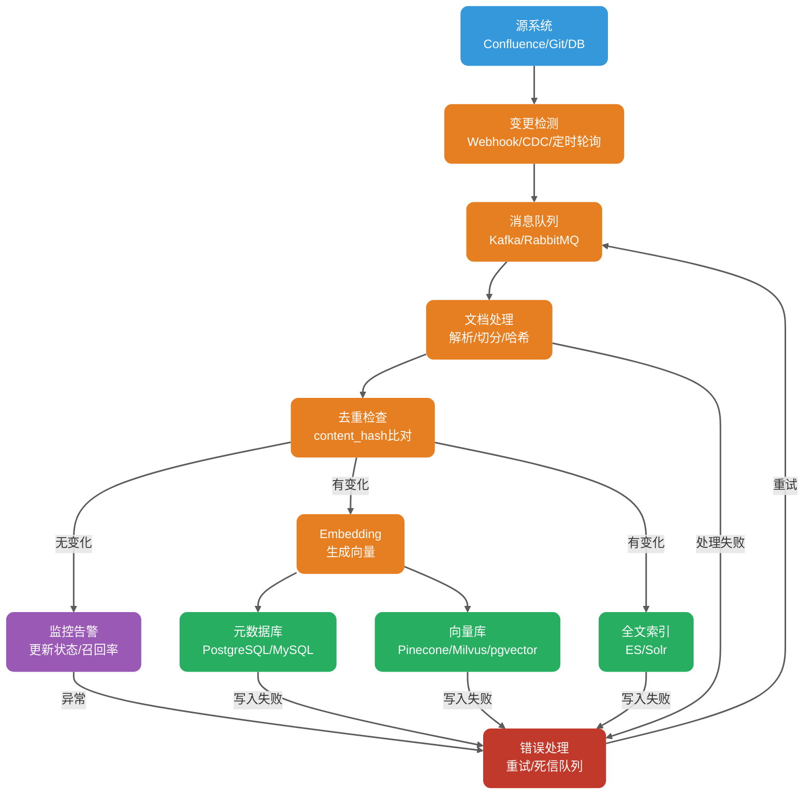
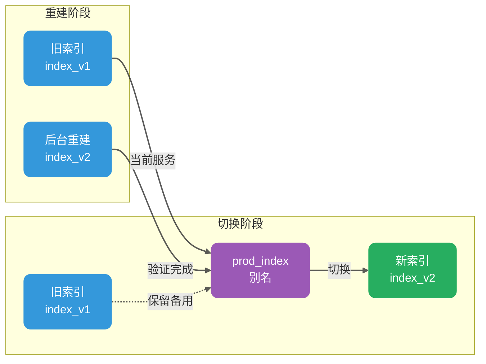

Sau khi hệ thống RAG cơ sở tri thức doanh nghiệp đầu tiên đi vào hoạt động, nhiều team sẽ gặp phải một vấn đề rất thực tế: tài liệu đã cập nhật, câu trả lời vẫn cũ.

Lúc này đừng vội đổ lỗi cho LLM. Nguyên nhân phổ biến hơn là cơ sở tri thức không được đồng bộ cập nhật, hoặc quy trình cập nhật chỉ làm "ghi nội dung mới" mà không xử lý các chi tiết như phiên bản cũ, quyền, tính nhất quán chỉ mục. Sau khi tài liệu thay đổi thường xuyên, vấn đề càng rõ ràng hơn: mỗi lần xây dựng lại chỉ mục toàn bộ, chi phí và thời gian không chịu nổi; chỉ cập nhật phần thay đổi, lại sợ bỏ sót block cũ; chỉ chèn vector mới, không dọn dẹp phiên bản cũ, nội dung hết hạn vẫn tiếp tục được thu hồi; đổi mô hình Embedding, dữ liệu lịch sử có cần lập chỉ mục lại toàn bộ không, cũng tránh không được.

Đằng sau những vấn đề này, thực ra là tính động, tính chính xác, tính nhất quán, khả năng rollback, khả năng quan sát của cơ sở tri thức RAG chưa được xử lý tốt.

Bài viết này nói về thực hành kỹ thuật cập nhật cơ sở tri thức RAG, toàn bộ gần 8000 chữ. Trọng tâm xem mấy vấn đề sau:

1. Cập nhật cơ sở tri thức rốt cuộc cần giải quyết gì;
2. Tại sao tính nhất quán mô hình Embedding là quy tắc cứng đầu tiên;
3. Metadata thiết kế như thế nào mới hỗ trợ cập nhật tăng dần và rollback version;
4. Thêm mới, sửa đổi, xóa tài liệu đồng bộ vào vector database và chỉ mục full-text như thế nào;
5. Cập nhật tăng dần và xây dựng lại toàn bộ phù hợp với kịch bản nào; Phát hành gray, rollback và khả năng quan sát triển khai như thế nào;
6. Một số điểm thường gặp nhất trong production.

## Cập nhật cơ sở tri thức cần giải quyết những vấn đề gì?

Trước khi nói phương án cụ thể, hãy nói rõ mục tiêu trước.

**Cập nhật cơ sở tri thức cần giải quyết không phải là "viết một tác vụ đồng bộ như thế nào", mà là sau khi cập nhật, hệ thống trả lời vẫn có thể duy trì chính xác, nhanh, không vượt quyền, và khi có vấn đề có thể định vị, có thể khôi phục.**

Tính động có nghĩa là tài liệu đã thay đổi, chỉ mục phải có thể theo kịp. "Kịp thời" này không nhất thiết phải là cấp giây, có thể là cấp phút, cũng có thể là cấp ngày, tùy thuộc vào yêu cầu thời gian thực của nghiệp vụ. Thư viện quy định nội bộ có thể đồng bộ một lần mỗi ngày là đủ, cơ sở tri thức dịch vụ khách hàng và điều khoản tuân thủ có thể cần nhanh hơn.

Tính chính xác có nghĩa là nội dung được thu hồi sau khi cập nhật phải nhất quán với tài liệu hiện tại, không thể tài liệu đã thay đổi mà model vẫn trích dẫn phiên bản cũ. Vấn đề này một khi xảy ra, người dùng cảm nhận rất rõ ràng.

Tính nhất quán phức tạp hơn. Cùng một tài liệu có các phiên bản khác nhau, vector database, metadata database, full-text search lại là các hệ thống khác nhau, bất kỳ đầu nào bị bỏ sót ghi hay chậm trễ đều có thể dẫn đến kết quả không nhất quán.

Khả năng rollback là để khi có sự cố có thể nhanh chóng chuyển về trạng thái lành mạnh trước đó, chứ không phải nhờ sửa dữ liệu thủ công tạm thời. Khả năng quan sát yêu cầu quá trình cập nhật có thể giám sát, kết quả cập nhật có thể đánh giá, nguyên nhân thất bại có thể truy vết đến từng khâu cụ thể.

Những mục tiêu này trông như là lẽ thường, nhưng nhiều dự án chỉ làm bước đầu tiên "cập nhật", các bước sau hoàn toàn dựa vào may mắn. Kết quả là tài liệu sửa mười phiên bản, câu trả lời vẫn dừng ở phiên bản đầu tiên; xóa một tài liệu nhạy cảm, vài tháng sau vẫn có thể được thu hồi ra.

## Tại sao mô hình Embedding phải duy trì nhất quán?

Điểm này cần đề cập riêng: mô hình Embedding dùng khi lập chỉ mục phải nhất quán với mô hình dùng khi truy vấn.

Mô hình Embedding sẽ chuyển văn bản thành vector, không gian vector của các mô hình khác nhau không thể dùng chung. Cùng một câu dùng `text-embedding-3-small` của OpenAI mã hóa, và dùng `all-MiniLM-L6-v2` của sentence-transformers mã hóa, vector thu được không có tính so sánh. Nếu lập chỉ mục dùng mô hình A, truy vấn dùng mô hình B, tương đương tính độ tương tự trong hai không gian khác nhau.

Biểu hiện cụ thể còn phụ thuộc vào chiều vector. Nếu chiều khác nhau, thông thường không thể đưa vào cùng một chỉ mục, nhiều vector database sẽ từ chối chèn hoặc truy vấn trực tiếp. Nếu chiều giống nhau nhưng mô hình khác nhau, điểm độ tương tự cũng không có tính so sánh, kết quả thu hồi không đáng tin. Đây không phải "ngẫu nhiên" đơn giản, mà là toàn bộ cơ sở xếp hạng đã hỏng.

Trong production có hai kịch bản dễ bỏ qua nhất.

**Kịch bản đầu tiên là nâng cấp mô hình.** Phía nghiệp vụ thấy mô hình mới hiệu quả hơn, muốn chuyển từ `text-embedding-3-small` sang `text-embedding-3-large`. Điều này có nghĩa là dữ liệu lịch sử phải mã hóa lại, lập chỉ mục lại. Về mặt kỹ thuật có thể dùng song song hai chỉ mục và chuyển lưu lượng gray để giảm rủi ro, nhưng bước xây dựng lại này không thể tránh.

**Kịch bản thứ hai là trộn lẫn mô hình local và mô hình API.** Môi trường test dùng sentence-transformers local, môi trường production dùng OpenAI API. Sự khác biệt này đặc biệt phổ biến trong cộng tác team, test nhìn có vẻ bình thường, sau khi lên production tỷ lệ thu hồi giảm thẳng đứng.

Cách làm ổn định hơn là ghi thông tin mô hình Embedding vào metadata, mỗi lần truy vấn đều kiểm tra version mô hình. Khi không khớp, hoặc từ chối truy vấn, hoặc ghi log cảnh báo và hạ cấp xuống chiến lược thu hồi thận trọng hơn.

| Trường                    | Giải thích      | Ví dụ                    |
| ------------------------- | --------------- | ------------------------ |
| `embedding_model`         | Tên mô hình     | `text-embedding-3-large` |
| `embedding_model_version` | Version mô hình | `2025-01-15`             |
| `embedding_dimension`     | Chiều vector    | `3072`                   |

Khi mô hình Embedding cần nâng cấp, khuyến nghị thực hiện theo quy trình dưới đây:

1. Xây dựng lại tất cả dữ liệu bằng mô hình mới trong chỉ mục mới.
2. Chỉ mục mới cũ chạy song song một thời gian, so sánh tỷ lệ thu hồi và chất lượng câu trả lời.
3. Sau khi xác nhận chỉ mục mới ổn định, chuyển lưu lượng sang chỉ mục mới thông qua alias chỉ mục.
4. Giữ lại chỉ mục cũ một thời gian, dùng cho rollback nhanh.
5. Sau khi xác nhận không có vấn đề, mới xóa chỉ mục cũ.

Cách suy nghĩ này rất giống blue-green deployment cơ sở dữ liệu: đừng sửa tại chỗ, trước tiên xây một bộ mới, sau khi xác minh thông qua mới chuyển.

## Làm thế nào thiết kế hệ thống metadata hỗ trợ cập nhật?

Thiết kế metadata tốt là điều kiện tiên quyết cho cập nhật tăng dần và rollback. Nhiều hệ thống RAG chạy mãi sẽ "mất trí nhớ", không phải vì không biết nội dung tài liệu, mà là không biết vector này tương ứng với tài liệu nào, phiên bản nào, nhập vào lúc nào, quyền là gì.

Mỗi Chunk ít nhất phải mang những metadata sau:

```json
{
  "doc_id": "doc-uuid-001",
  "chunk_id": "chunk-uuid-001",
  "content_hash": "sha256:abc123...",
  "version_id": 3,
  "chunk_strategy": "semantic",
  "chunk_size": 512,
  "chunk_overlap": 50,
  "source_id": "confluence-page-123",
  "source_type": "confluence",
  "title": "订单中心接口文档",
  "section_path": "技术文档 / 订单系统 / 接口规范",
  "page": 5,
  "tenant_id": "tenant-001",
  "acl": ["role:admin", "team:order-team"],
  "created_at": "2025-03-01T10:00:00Z",
  "updated_at": "2025-04-15T14:30:00Z",
  "embedding_model": "text-embedding-3-large",
  "embedding_model_version": "2025-01-15",
  "embedding_dimension": 3072,
  "is_deleted": false
}
```

Chiến lược cắt phải được versioning. Cách cắt, tỷ lệ overlap, cách phân tích một khi thay đổi, ảnh hưởng không nhỏ hơn mô hình Embedding, cũng nên kích hoạt xây dựng lại hoặc gray hai chỉ mục. Ghi lại các trường `chunk_strategy`, `chunk_size`, `chunk_overlap`, sau này đánh giá và rollback mới có cơ sở.

`content_hash` là cốt lõi của cập nhật tăng dần. Đây không phải hash file, mà là hash của nội dung chính văn bản tài liệu hoặc nội dung Chunk. Có vài thuật toán phổ biến: MD5 tốc độ nhanh nhưng có rủi ro collision, phù hợp cho kịch bản không nhạy cảm với collision; SHA-256 rủi ro collision cực thấp, khuyến nghị dùng trong production hơn; SimHash phù hợp để phán đoán nội dung có đại thể giống nhau không, thường dùng để loại bỏ trùng lặp trang web, nhưng không thể định vị chính xác điểm thay đổi cụ thể.

Trong môi trường production, `content_hash` chủ yếu dùng để phán đoán "đoạn văn bản này có thay đổi không". Tính hash khi nhập cơ sở dữ liệu, so sánh với bản ghi đã có trong database. Nếu nhất quán, tức là nội dung không thay đổi, có thể bỏ qua Embedding; nếu không nhất quán, phải mã hóa lại.

`version_id` ghi số lần sửa đổi tài liệu. Mỗi lần tài liệu cập nhật, `version_id` tăng thêm một. Nó phối hợp với `content_hash`, có thể theo dõi lịch sử thay đổi, cũng tiện rollback.

`is_deleted` là nhãn xóa mềm, cũng là điểm thường gặp nhất. Nhiều team khi xóa tài liệu, xóa trực tiếp bản ghi trong vector database. Vấn đề là sự kiện xóa không được bảo lưu, khi cùng một tài liệu được tải lên lại, hệ thống rất khó phán đoán đây là tài liệu mới hay tài liệu lịch sử được tải lên lại. Sau khi thêm `is_deleted`, logic sẽ rõ ràng hơn nhiều: khi nhận được sự kiện xóa, đặt `is_deleted` thành `true`; khi nhận được sự kiện tải lên lại, đặt lại thành `false` và tính lại `content_hash`; khi truy vấn mặc định chỉ giữ lại bản ghi `is_deleted = false`.

Xóa mềm không chỉ để phân biệt tài liệu mới cũ, nó còn để lại cửa sổ đệm cho kiểm toán, khôi phục xóa nhầm, xóa vật lý chậm trễ, tính nhất quán xuyên hệ thống.

`tenant_id` và `acl` là cơ sở của kiểm soát đa tenant và quyền. Khi truy vấn ưu tiên thực hiện pre-filter ACL tenant và độ hạt thô ở giai đoạn truy vấn, tránh tài liệu không có quyền chiếm dụng Top-K, ảnh hưởng chất lượng thu hồi. Quyền phức tạp, ví dụ quyền động, kế thừa xuyên tenant, có thể thực hiện xác thực lần hai trước khi trả về tham chiếu, ngăn tham chiếu vượt quyền.

## Thêm mới, sửa đổi, xóa tài liệu đồng bộ như thế nào?

Tài liệu từ hệ thống nguồn đến vector database, ở giữa sẽ trải qua nhiều khâu. Bất kỳ khâu nào có vấn đề đều sẽ dẫn đến dữ liệu không nhất quán.



Ở đây cần đặc biệt chú ý thành công một phần. Vector database, metadata database, full-text search thường không trong cùng một transaction domain, một lần ghi ba đầu rất có thể xảy ra thành công một phần. Cách làm ổn định hơn là lấy metadata database làm source of truth, ghi lại trạng thái index của từng Chunk, ví dụ `index_status = 'ready' / 'partial_failed'`. Tác vụ bù đắp nền định kỳ retry đầu thất bại, rồi thông qua reconciliation quét chênh lệch.

### Thêm mới tài liệu

Thêm mới là đơn giản nhất trong ba loại thao tác. Quy trình thông thường là: phân tích tài liệu, trích xuất chính văn, tiêu đề, cấu trúc phân cấp; cắt Chunk theo chiến lược đã định; tính `content_hash` của từng Chunk; kiểm tra hash đã tồn tại chưa; nếu không tồn tại thì tạo vector, ghi vào vector database, metadata database, full-text search.

Idempotency rất quan trọng. Thao tác thêm mới phải có thể thực thi lặp lại. Dù message queue gửi trùng cùng một message, hoặc worker crash restart rồi xử lý lại, đều không nên tạo ra bản ghi trùng lặp.

### Sửa đổi tài liệu

Sửa đổi phức tạp hơn thêm mới, vấn đề then chốt là dữ liệu phiên bản cũ phải làm gì.

Cách làm được khuyến nghị hơn là xóa mềm phiên bản cũ, rồi ghi vào phiên bản mới:

1. Truy vấn metadata database theo `doc_id`, tìm danh sách `chunk_id` của phiên bản cũ.
2. Đánh dấu Chunk cũ là `is_deleted = true`, hoặc xóa vật lý trực tiếp.
3. Ghi vào Chunk và vector phiên bản mới.

Nếu vector database hỗ trợ cập nhật nguyên tử dựa trên primary key, ví dụ upsert của Milvus, có thể ghi đè trực tiếp bản ghi cùng primary key. Nhưng chú ý, upsert chỉ có thể ghi đè entity cùng primary key. Nếu tài liệu cắt lại sau số lượng Chunk hoặc `chunk_id` thay đổi, vẫn cần dọn dẹp phiên bản cũ còn lại theo `doc_id + version_id`.

Nếu không hỗ trợ cập nhật nguyên tử, chỉ có thể xóa bản ghi cũ trước, rồi ghi bản ghi mới. Giữa hai bước sẽ có một cửa sổ rất ngắn, truy vấn có thể đồng thời đánh trúng nội dung mới cũ. Vì vậy nghiệp vụ rủi ro cao cần phối hợp lọc version hoặc chuyển đổi alias, tránh người dùng nhìn thấy kết quả hỗn hợp.

Một điểm thường gặp là chỉ ghi vector mới, không xóa vector cũ.

Tôi đã thấy không ít dự án gặp vấn đề như vậy: tài liệu sửa 10 lần, vector database để lại 10 phiên bản. Khi người dùng truy vấn, kết quả khớp nhất lại có thể là nội dung cũ phiên bản thứ 3, model sẽ trả lời dựa trên thông tin lỗi thời. Thao tác sửa đổi phải bao gồm bước dọn dẹp vector cũ, nếu không cơ sở tri thức sẽ liên tục sai lệch.

### Xóa tài liệu

Xóa có thể chia thành xóa mềm và xóa vật lý.

Xóa mềm là đặt nhãn `is_deleted` thành `true`. Đây là cách làm được khuyến nghị hơn, vì nó bảo lưu lịch sử thay đổi, hỗ trợ khôi phục khi xóa nhầm.

Xóa vật lý là xóa hoàn toàn bản ghi khỏi vector database, metadata database, full-text search. Thông thường khuyến nghị sau khi xóa mềm đợi một thời gian, ví dụ 30 ngày, xác nhận không có vấn đề mới thực hiện xóa vật lý.

Xóa mềm tiện khôi phục và kiểm toán, nhưng sẽ tăng chi phí lưu trữ và chi phí lọc. Xóa vật lý triệt để hơn, phù hợp xóa tuân thủ, xóa dữ liệu nhạy cảm, nhưng chi phí khôi phục cao. Trên production phổ biến hơn là "xóa mềm + xóa vật lý chậm trễ + nhật ký kiểm toán xóa". Nếu là tài liệu nhạy cảm, còn phải dọn dẹp cache rerank, cache ngữ cảnh LLM và các cache bên cạnh khác.

Xóa còn có một vấn đề ẩn: "dữ liệu ma" sau khi thay đổi quyền. Ví dụ một tài liệu ban đầu tất cả nhân viên đều xem được, sau đó sửa thành "chỉ quản lý cấp cao xem được". Nếu `acl` cũ trong vector database không được cập nhật, khi nhân viên thông thường truy vấn vẫn có thể thu hồi được tài liệu này. Cách làm đúng là thay đổi quyền kích hoạt tài liệu lập chỉ mục lại, đảm bảo `acl` trong metadata là mới nhất. Nếu vector database hỗ trợ cập nhật nguyên tử trường ACL, cũng có thể không xây dựng lại vector, chỉ cập nhật metadata.

## Cập nhật tăng dần và xây dựng lại toàn bộ phù hợp với kịch bản nào?

Trong môi trường production, câu hỏi này rất phổ biến. Kinh nghiệm của tôi là: cập nhật tăng dần chịu trách nhiệm thay đổi hàng ngày, xây dựng lại toàn bộ định kỳ chịu trách nhiệm sức khỏe dài hạn.

| Chiều kích             | Cập nhật tăng dần                            | Xây dựng lại toàn bộ                                                                                |
| ---------------------- | -------------------------------------------- | --------------------------------------------------------------------------------------------------- |
| Điều kiện kích hoạt    | Sự kiện thay đổi tài liệu                    | Tác vụ định kỳ hoặc kích hoạt thủ công                                                              |
| Phạm vi bao phủ        | Chỉ tài liệu có thay đổi                     | Toàn bộ cơ sở tri thức                                                                              |
| Chi phí tính toán      | Thấp, chỉ xử lý phần thay đổi                | Cao, cần xử lý tất cả dữ liệu                                                                       |
| Độ trễ cập nhật        | Thấp, có thể gần thời gian thực              | Cao, có thể cần vài giờ                                                                             |
| Tính nhất quán dữ liệu | Phụ thuộc độ chính xác phát hiện thay đổi    | Cần dựa trên snapshot hệ thống nguồn hoặc timestamp version để đảm bảo nhất quán với hệ thống nguồn |
| Kịch bản phù hợp       | Thay đổi hàng ngày, cập nhật tần suất cao    | Nâng cấp mô hình, điều chỉnh chiến lược, khôi phục sự cố                                            |
| Rủi ro chính           | Bỏ sót phát hiện thay đổi dẫn đến dữ liệu cũ | Dịch vụ không khả dụng trong thời gian xây dựng lại                                                 |

### Cập nhật tăng dần phù hợp với kịch bản nào?

Cập nhật tăng dần phù hợp với kịch bản tần suất thay đổi tài liệu vừa phải, có yêu cầu về thời gian thực, quy mô cơ sở tri thức tương đối lớn. Ví dụ vài chục đến vài trăm lần thay đổi tài liệu mỗi ngày, nghiệp vụ có thể chấp nhận đồng bộ cấp phút, chi phí xây dựng lại toàn bộ lại tương đối cao.

Cập nhật tăng dần phụ thuộc vào cơ chế phát hiện thay đổi. Có ba phương án phổ biến:

1. Webhook / Event-driven: Hệ thống nguồn, ví dụ Confluence, Git, database, chủ động cung cấp thông báo thay đổi, hệ thống RAG subscribe và xử lý. Độ trễ thấp nhất, nhưng yêu cầu hệ thống nguồn hỗ trợ.
2. CDC (Change Data Capture): Theo dõi binlog hoặc log thay đổi của database, nắm bắt sự thay đổi dữ liệu. Phù hợp với nguồn dữ liệu có cấu trúc.
3. Polling định kỳ: Theo khoảng thời gian cố định, ví dụ mỗi 5 phút quét hệ thống nguồn, so sánh timestamp `updated_at`. Triển khai đơn giản, nhưng có độ trễ, cũng sẽ tạo áp lực cho hệ thống nguồn.

Trong production ổn định hơn là event-driven + polling làm dự phòng. Event-driven xử lý tăng dần hàng ngày, polling dùng để ngăn bỏ sót phát hiện. Ở giữa thêm message queue, ví dụ Kafka, RocketMQ, dùng để tách rời hệ thống nguồn và quy trình xử lý RAG.

### Xây dựng lại toàn bộ phù hợp với kịch bản nào?

Xây dựng lại toàn bộ thường dùng cho mấy loại tình huống sau:

- Nâng cấp mô hình Embedding. Đây là yêu cầu cứng, không thể tránh.
- Điều chỉnh chiến lược Chunk. Ví dụ từ cố định 500 Token đổi sang cắt ngữ nghĩa, dữ liệu lịch sử cũng cần cắt lại theo chiến lược mới.
- Thay đổi cấu trúc dữ liệu. Ví dụ thêm hoặc sửa trường metadata.
- Khôi phục sự cố nghiêm trọng. Chuỗi tăng dần lâu dài bị hỏng, dữ liệu đã rõ ràng cũ.
- Bảo trì sức khỏe định kỳ. Một số vector database sau khi xóa tần suất cao sẽ để lại tombstone xóa đánh dấu, mảnh vỡ chỉ mục, thậm chí xuất hiện thoái hóa thu hồi. Biểu hiện cụ thể liên quan đến loại chỉ mục, triển khai sản phẩm, ví dụ sản phẩm dựa trên HNSW + cơ chế dọn dẹp tombstone, tốt nhất kiểm tra tài liệu vector database tương ứng để xác nhận.

Xây dựng lại toàn bộ lo nhất là gián đoạn dịch vụ. Cách làm ổn định hơn là chuyển đổi alias chỉ mục:



Các bước đại khái như sau:

1. Dịch vụ truy vấn truy cập qua alias chỉ mục `prod_index`, chỉ mục cũ là `index_v1`.
2. Nền khởi động tác vụ xây dựng lại, xây dựng chỉ mục mới `index_v2`.
3. Sau khi chỉ mục mới xác minh thông qua, trỏ alias `prod_index` vào `index_v2`. Cơ chế alias của Milvus / Zilliz hỗ trợ chuyển đổi giữa các collection, các vector database khác có khả năng tương đương hay không cần xác nhận riêng.
4. Giữ lại chỉ mục cũ `index_v1` một thời gian, ví dụ 7 ngày, dùng cho rollback nhanh.
5. Sau khi xác nhận không có vấn đề, xóa chỉ mục cũ.

### Chiến lược trạng thái ổn định khuyến nghị trong production

Kết hợp ổn định hơn là: tăng dần thời gian thực + xây dựng lại toàn bộ định kỳ + xây dựng lại khẩn cấp do event-driven.

Tăng dần thời gian thực chịu trách nhiệm nắm bắt sự kiện thay đổi qua Webhook hoặc CDC, cập nhật vector database càng sớm càng tốt. Xây dựng lại toàn bộ định kỳ chịu trách nhiệm dọn dẹp dữ liệu còn lại, sửa lỗi tích lũy, đảm bảo tính toàn vẹn dữ liệu, có thể thực thi theo tuần hoặc theo tháng. Xây dựng lại khẩn cấp thì dùng cho các thay đổi rủi ro cao như nâng cấp mô hình, thay đổi chiến lược, điều chỉnh quyền quy mô lớn.

Kết hợp này không hoa lệ, nhưng có thể đồng thời cân bằng tính thời gian thực và sức khỏe dài hạn.

## Làm thế nào để chuỗi cập nhật ổn định và đáng tin cậy?

### Cập nhật idempotent: Người bạn tốt của message queue

Message queue tự nhiên sẽ có gửi trùng. Jitter mạng, consumer crash restart, offset không được commit, đều có thể khiến cùng một message được tiêu thụ lặp lại.

Trọng tâm của cập nhật idempotent là cơ sở loại bỏ trùng lặp. Đáng tin cậy hơn là dựa trên `doc_id + content_hash` hoặc `doc_id + version_id` làm unique constraint. Nhưng cần chú ý, trong kịch bản đồng thời, "truy vấn trước rồi ghi" đơn giản không đủ an toàn, khi hai message giống nhau hoặc bị đảo thứ tự đến cùng lúc, vẫn có thể ghi đè lẫn nhau hoặc ghi trùng.

Cách làm ổn định hơn có vài loại:

1. Dựa vào unique constraint: Xây unique index với `doc_id + content_hash` hoặc `doc_id + version_id`, khi chèn để database từ chối trùng lặp.
2. Optimistic lock / distributed lock: Trước khi ghi phiên bản mới lấy lock trước, ngăn ghi đè đồng thời.
3. Transactional outbox: Sự kiện thay đổi ghi vào bảng outbox trước, rồi consumer xử lý idempotent.

Dưới đây là ví dụ dựa trên unique constraint:

```python
def process_document_change(event):
    doc_id = event['doc_id']
    content = event['content']
    version_id = event.get('version_id', 1)
    chunk_hash = compute_hash(content)

    # 基于 doc_id + chunk_hash 构造唯一 chunk_id（确定性）
    chunk_id = f"{doc_id}_{version_id}_{compute_hash(content[:100])}"

    # 尝试插入，利用数据库唯一约束幂等
    try:
        db.execute("""
            INSERT INTO chunks (doc_id, chunk_id, content_hash, version_id, is_deleted)
            VALUES (:doc_id, :chunk_id, :content_hash, :version_id, false)
            ON CONFLICT (doc_id, chunk_id) DO NOTHING
        """, {
            'doc_id': doc_id,
            'chunk_id': chunk_id,
            'content_hash': chunk_hash,
            'version_id': version_id
        })
        # 只有插入成功才继续处理（冲突说明内容未变）
        if db.rowcount == 0:
            logger.info(f"Doc {doc_id} already exists, skipping")
            return

        # 生成向量并写入
        embedding = embedding_model.encode(content)
        vector_db.upsert(doc_id, chunk_id, embedding, {
            'doc_id': doc_id,
            'content_hash': chunk_hash,
            'version_id': version_id,
            'updated_at': now()
        })
    except Exception as e:
        logger.error(f"Failed to process {doc_id}: {e}")
        raise
```

Trọng điểm của đoạn code này là dùng unique constraint của database để đảm bảo idempotency, không phải truy vấn trước rồi ghi. Trong kịch bản đồng thời, hai message đến cùng lúc, database sẽ từ chối chèn trùng lặp, không để application layer tự đoán ai trước ai sau.

### Xử lý sự kiện bị đảo thứ tự

Thứ tự gửi của message queue không nhất thiết luôn như mong đợi. Trong chuỗi cập nhật RAG, nhận v3 trước rồi nhận v2 rất phổ biến. Nếu không xử lý đảo thứ tự, phiên bản cũ có thể ghi đè phiên bản mới.

Thông thường cần làm vài việc:

1. Mỗi sự kiện tài liệu mang `source_version`, `updated_at` hoặc `revision` tăng đơn điệu, dùng để phán đoán mới cũ.
2. Trước khi ghi kiểm tra `event.version >= current_version`, sự kiện cũ loại bỏ trực tiếp hoặc ghi vào nhật ký kiểm toán.
3. Tiêu thụ có thứ tự theo partition cho cùng một `doc_id`, ví dụ Kafka key dùng `doc_id`, đảm bảo message của cùng một tài liệu rơi vào cùng một partition.
4. Theo dõi điểm dữ liệu loại bỏ đảo thứ tự, tiện phát hiện sự kiện hệ thống nguồn bất thường.

### Retry thất bại và dead letter queue

Bất kỳ khâu nào trong chuỗi xử lý đều có thể thất bại: jitter mạng, giới hạn tốc độ API, vector database tạm thời không khả dụng, ngoại lệ parser đều có thể xảy ra.

Chiến lược ổn định hơn là exponential backoff retry + dead letter queue dự phòng.

```python
def process_with_retry(event, max_retries=3):
    for attempt in range(max_retries):
        try:
            process_document_change(event)
            return  # 成功，直接返回
        except TransientError as e:
            wait_time = 2 ** attempt  # 指数退避：2s, 4s, 8s
            logger.warning(f"Attempt {attempt + 1} failed: {e}, retrying in {wait_time}s")
            time.sleep(wait_time)
        except PermanentError as e:
            # 永久性错误（如格式错误），不重试，直接打入死信队列
            logger.error(f"Permanent error, sending to DLQ: {e}")
            dlq.send(event, reason=str(e))
            return

    # 超过最大重试次数，打入死信队列并告警
    logger.error(f"Max retries exceeded for {event['doc_id']}")
    dlq.send(event, reason="max_retries_exceeded")
    alert.trigger(f"Document update failed after {max_retries} retries: {event['doc_id']}")
```

Phân loại lỗi rất quan trọng. Lỗi nhất thời như timeout mạng, giới hạn tốc độ API có thể retry; lỗi vĩnh viễn như lỗi định dạng, thiếu trường không nên retry lặp đi lặp lại, retry bao nhiêu lần cũng không thành công, chỉ lãng phí tài nguyên.

Message trong dead letter queue không thể cứ để chất đống. Khuyến nghị Review định kỳ, ví dụ một tuần xem một lần, sau khi sửa nguyên nhân mới gửi lại.

### Cơ chế rollback: Kênh khẩn cấp khi có vấn đề

Rollback không phải thuốc hối hận, mà là kênh khẩn cấp. Cơ chế rollback tốt phải cho phép người vận hành nhanh chóng chuyển về trạng thái lành mạnh trước đó.

Rollback chuyển đổi alias chỉ mục là đơn giản nhất. Sau khi chuyển alias, nếu chỉ mục mới có vấn đề, trỏ alias về chỉ mục cũ là xong. Điều kiện tiên quyết là chỉ mục cũ chưa bị xóa.

Rollback nâng cấp mô hình, cần ghi lại `model_name` và `model_version` của mô hình cũ trước khi nâng cấp. Nếu mô hình mới biểu hiện bất thường, chuyển lại mô hình cũ, đồng thời kích hoạt xây dựng lại toàn bộ dựa trên mô hình cũ.

Rollback version dữ liệu có thể dùng trường `updated_at` và `version_id`. Khi cần rollback về một thời điểm, khôi phục từ snapshot lịch sử. Snapshot có thể là snapshot của vector database, cũng có thể đặt trong object storage độc lập.

Rollback quyền cần thận trọng hơn. Nếu thay đổi quyền dẫn đến rò rỉ dữ liệu, bước đầu tiên không phải từ từ sửa chỉ mục, mà là ngay lập tức chặn phạm vi ảnh hưởng: tắt cổng truy vấn cơ sở tri thức hoặc tenant liên quan, vô hiệu hóa chỉ mục có vấn đề, bắt buộc xác thực quyền trước khi tham chiếu. Chỉ khi không thể xác định phạm vi ảnh hưởng mới xem xét dừng dịch vụ toàn cầu.

```python
def rollback_to_version(target_version_id):
    # 查询目标版本的快照
    snapshot = get_snapshot(version_id=target_version_id)
    if not snapshot:
        raise ValueError(f"No snapshot found for version {target_version_id}")

    # 停止服务
    service.set_status('maintenance')

    # 恢复快照
    vector_db.restore(snapshot)

    # 重启服务
    service.set_status('active')

    # 发送告警
    alert.trigger(f"System rolled back to version {target_version_id}")
```

### Phát hành gray: Chiến lược mới cần xác minh lưu lượng nhỏ trước

Chiến lược cập nhật cơ sở tri thức cũng cần phát hành gray như phát hành APP, đừng làm một phát.

Có vài cách gray phổ biến: gray theo số lượng tài liệu, ví dụ trước cập nhật 10% tài liệu; gray theo người dùng, ví dụ trước cho 5% người dùng xem kết quả chỉ mục mới; gray theo loại câu hỏi, ví dụ trước xác minh truy vấn chính xác loại nhạy cảm hơn với thay đổi chỉ mục này.

Trong thời gian gray cần tập trung theo dõi những chỉ số này. Ngưỡng dưới đây chỉ là ví dụ, môi trường production cần hiệu chỉnh dựa trên đường cơ sở lịch sử, bộ đánh giá offline và kết quả A/B trực tuyến, không thể sao chép trực tiếp.

| Chỉ số                        | Ý nghĩa                                            | Ngưỡng cảnh báo |
| ----------------------------- | -------------------------------------------------- | --------------- |
| `retrieval_hit_rate@10`       | Tỷ lệ 10 kết quả thu hồi đầu chứa câu trả lời đúng | Giảm > 5%       |
| `avg_answer_latency`          | Độ trễ trả lời trung bình                          | Tăng > 20%      |
| `citation_accuracy`           | Độ chính xác trích dẫn                             | Giảm > 3%       |
| `user_feedback_negative_rate` | Tỷ lệ phản hồi tiêu cực của người dùng             | Tăng > 2%       |

Bất kỳ chỉ số then chốt nào kích hoạt cảnh báo đều nên tạm dừng gray, debug vấn đề trước. Đừng đợi đến khi lên toàn bộ mới phát hiện chất lượng thu hồi giảm.

## Cập nhật cơ sở tri thức có những điểm thường gặp nào?

### Điểm 1: Chỉ chèn vector mới, không xóa vector cũ

Đây là vấn đề phổ biến nhất. Tài liệu bị sửa 5 lần, vector database để lại 5 phiên bản. Khi người dùng truy vấn thu hồi phiên bản cũ, model trả lời dựa trên thông tin lỗi thời.

Cách giải quyết rất đơn giản nhưng bắt buộc phải làm: khi sửa tài liệu đồng thời xử lý vector cũ. Có thể trước khi ghi vector mới, dọn dẹp bản ghi cũ theo `doc_id` trước.

### Điểm 2: Trộn lẫn mô hình Embedding

Lập chỉ mục dùng mô hình A, truy vấn dùng mô hình B, không gian vector hoàn toàn không tương thích.

Cách giải quyết là coi `embedding_model` và `embedding_model_version` là metadata bắt buộc. Trước khi truy vấn kiểm tra version mô hình, không khớp thì từ chối hoặc hạ cấp.

### Điểm 3: Chiến lược Chunk thay đổi, nhưng dữ liệu lịch sử không xây dựng lại

Từ cắt độ dài cố định đổi sang cắt ngữ nghĩa, từ 500 Token đổi sang 800 Token, chỉ có hiệu lực với tài liệu mới, dữ liệu lịch sử vẫn là chiến lược cũ. Điều này sẽ dẫn đến trong một cơ sở tri thức có lẫn nhiều bộ logic cắt, đánh giá thu hồi cũng sẽ trở nên rất lộn xộn.

Cách giải quyết là thay đổi chiến lược Chunk kích hoạt xây dựng lại toàn bộ. Đây không phải vấn đề tăng dần có thể giải quyết được.

### Điểm 4: Tài liệu bị xóa nhưng vẫn được thu hồi

Xóa mềm không làm tốt, hoặc logic xóa chỉ xử lý vector database, không xử lý full-text search.

Thao tác xóa phải nhất quán ba đầu: vector database, metadata database, full-text search đều phải xử lý đồng bộ. Cách làm ổn định hơn là dùng outbox pattern ghi sự kiện thay đổi, consumer thực thi idempotent; rồi thông qua reconciliation định kỳ so sánh hệ thống nguồn, metadata database, vector database, full-text search, sửa các trường hợp xóa sót, ghi sót và sự kiện bị đảo thứ tự.

### Điểm 5: Metadata quyền không đồng bộ

Quyền tài liệu từ "công khai" sửa thành "chỉ quản trị viên xem được", nhưng trường `acl` trong vector database không được cập nhật.

Thay đổi quyền phải kích hoạt tài liệu lập chỉ mục lại. Nếu vector database hỗ trợ cập nhật nguyên tử trường ACL, có thể chỉ cập nhật metadata mà không xây dựng lại vector, nhưng điều kiện tiên quyết là vector database có khả năng này.

### Điểm 6: Phát hiện thay đổi bị bỏ sót

Webhook bỏ sót gửi, CDC chậm trễ, khoảng thời gian polling quá lớn, đều sẽ dẫn đến tài liệu đã thay đổi nhưng chỉ mục chưa thay đổi.

Cách giải quyết là event-driven + polling làm dự phòng. Đồng thời thiết lập theo dõi độ tươi dữ liệu, định kỳ kiểm tra `updated_at` trong hệ thống nguồn và vector database. Nếu thời gian hệ thống nguồn mới hơn thời gian chỉ mục vượt ngưỡng, kích hoạt cảnh báo, khi cần thiết tự động lập chỉ mục lại.

## Làm thế nào đảm bảo khả năng quan sát của cập nhật cơ sở tri thức?

Chuỗi cập nhật cơ sở tri thức phải có giám sát, nếu không thì chạy mù. Tài liệu có cập nhật không, bước nào thất bại, thất bại sau có bù đắp không, không thể dựa vào phàn nàn của người dùng mới phát hiện.

Chỉ số giám sát then chốt có thể bắt đầu từ những cái này:

| Chỉ số                        | Giải thích                                                                   | Ngưỡng cảnh báo khuyến nghị |
| ----------------------------- | ---------------------------------------------------------------------------- | --------------------------- |
| `index_lag_seconds`           | Thời gian từ thay đổi tài liệu đến hoàn thành chỉ mục                        | > 5 phút                    |
| `failed_updates_total`        | Số lượng thao tác cập nhật thất bại tích lũy                                 | > 0 kéo dài 10 phút         |
| `dlq_size`                    | Tồn đọng hiện tại của dead letter queue                                      | > 100                       |
| `retrieval_hit_rate`          | Độ chính xác thu hồi                                                         | Giảm so với kỳ trước > 5%   |
| `stale_docs_count`            | Số lượng tài liệu cũ, hệ thống nguồn đã cập nhật nhưng chỉ mục chưa cập nhật | > 10                        |
| `source_to_queue_lag_seconds` | Độ trễ từ thay đổi hệ thống nguồn đến sự kiện vào hàng đợi                   | > 1 phút                    |
| `queue_to_index_lag_seconds`  | Độ trễ từ sự kiện vào hàng đợi đến hoàn thành chỉ mục                        | > 5 phút                    |
| `index_success_rate`          | Tỷ lệ thành công chỉ mục                                                     | < 99%                       |
| `partial_index_count`         | Số tài liệu ghi một phần thành công nhưng chưa hoàn thành                    | > 0 kéo dài 30 phút         |
| `acl_mismatch_count`          | Số lượng ACL hệ thống nguồn và ACL chỉ mục không nhất quán                   | > 0                         |

Mỗi thao tác cập nhật đều nên ghi nhật ký kiểm toán, bao gồm `doc_id`, `change_type` (thêm mới / sửa đổi / xóa), `timestamp`, `operator` (tự động / thủ công), `result` (thành công / thất bại), `error_message`. Khi thực sự có vấn đề, những trường này giúp bạn nhanh chóng định vị bản ghi nào, khâu nào, khi nào thất bại.

## Tóm tắt

Cập nhật cơ sở tri thức RAG không chỉ là viết một tác vụ định kỳ để lập chỉ mục lại. Nó liên quan đến phát hiện thay đổi, tính nhất quán dữ liệu, ghi idempotent, kiểm soát version, phát hành gray, cơ chế rollback và khả năng quan sát.

Vài kết luận có thể ghi nhớ.

Tính nhất quán mô hình Embedding là quy tắc cứng. Đổi mô hình phải xây dựng lại toàn bộ chỉ mục, không được lười biếng.

Thiết kế metadata là điều kiện tiên quyết của cập nhật tăng dần. `doc_id`, `content_hash`, `version_id`, `is_deleted` những trường này là cơ sở của cập nhật idempotent, theo dõi version và rollback.

Thao tác xóa phải nhất quán ba đầu. Vector database, metadata database, full-text search đều phải xử lý đồng bộ, nếu không sớm muộn sẽ xuất hiện dữ liệu ma.

Cập nhật tăng dần chịu trách nhiệm thay đổi hàng ngày, xây dựng lại toàn bộ chịu trách nhiệm bảo trì sức khỏe định kỳ. Hai cái phối hợp với nhau, hệ thống mới không dễ bị trôi dạt lâu dài.

Chuyển đổi alias chỉ mục là cách làm phổ biến của gray cấp production và rollback. Trước tiên xây chỉ mục mới, sau khi xác minh mới chuyển, giữ lại chỉ mục cũ một thời gian để dự phòng.

Idempotent, retry, dead letter queue là cơ sở độ tin cậy của chuỗi cập nhật. Khả năng quan sát là hàng rào cuối cùng: không biết cập nhật có thành công không thì tương đương không cập nhật.

Bảo trì cơ sở tri thức RAG không phải làm một lần trước khi lên production là xong, mà là sau khi lên production mới thực sự bắt đầu.

## Tài liệu tham khảo

- [How to Update RAG Knowledge Base Without Rebuilding Everything](https://particula.tech/blog/update-rag-knowledge-without-rebuilding)
- [RAG Knowledge Base Management: Updates & Refresh](https://apxml.com/courses/optimizing-rag-for-production/chapter-7-rag-scalability-reliability-maintainability/rag-knowledge-base-updates)
- [RAG in Practice: Versioning, Observability, and Evaluation in Production](https://pub.towardsai.net/rag-in-practice-exploring-versioning-observability-and-evaluation-in-production-systems-85dc28e1d9a8)
- [RAG in Production: Deployment Strategies & Practical Considerations](https://coralogix.com/ai-blog/rag-in-production-deployment-strategies-and-practical-considerations/)
- [23 RAG Pitfalls and How to Fix Them](https://www.nb-data.com/p/23-rag-pitfalls-and-how-to-fix-them)
- [Incremental Indexing Strategies for Large RAG Systems](https://medium.com/@vasanthancomrads/incremental-indexing-strategies-for-large-rag-systems-e3e5a9e2ced7)
- [RAG Series: Embedding Versioning with pgvector](https://www.dbi-services.com/blog/rag-series-embedding-versioning-with-pgvector-why-event-driven-architecture-is-a-precondition-to-ai-data-workflows/)
