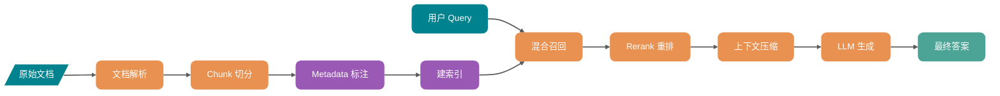
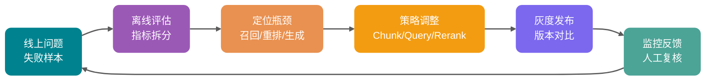
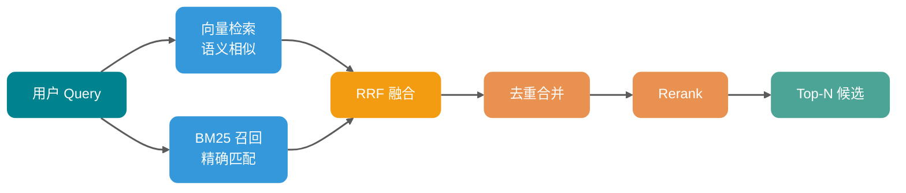
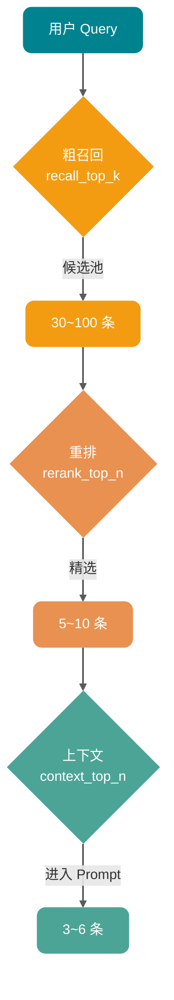
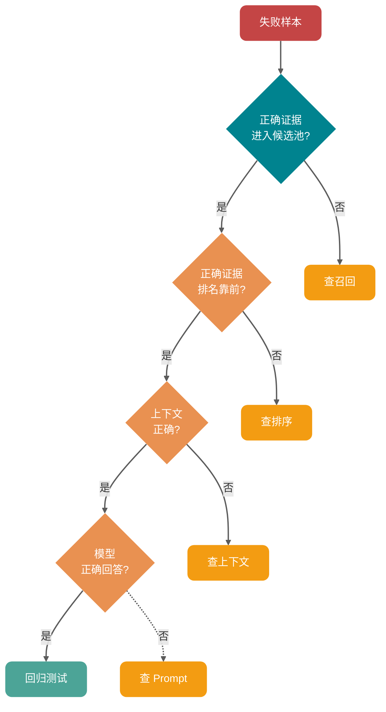

Lần đầu tiên làm RAG, trải nghiệm của nhiều người khá giống nhau: tài liệu đã được cắt, vector store đã được xây dựng, Top-K cũng đã tăng lên, vậy mà model vẫn nói sai một cách đàng hoàng.

Điều khó chịu hơn là, vấn đề có thể nằm ở nhiều khâu như phân tích tài liệu, cắt Chunk, chất lượng ngữ cảnh, chứ không chỉ đơn thuần là tham số embedding hay Top-K.

Khi tinh chỉnh hệ thống hỏi đáp cơ sở tri thức doanh nghiệp, rất dễ rơi vào một lầm tưởng: ban đầu điên cuồng thay model embedding, kết quả tỷ lệ lỗi trực tuyến không giảm đáng kể. Khi tháo rời các mẫu thất bại ra xem mới phát hiện, 60% vấn đề căn bản không phải do độ tương tự vector không đủ, mà là bảng PDF bị phân tích sai, Chunk cắt rời điều kiện và kết luận, hoặc đoạn văn đúng không có trong pool ứng viên trước khi xếp hạng lại.

Kinh nghiệm đầu tiên trong tối ưu RAG là: **Về bản chất, đây là một công trình hệ thống kết hợp dữ liệu, cắt khối, lập chỉ mục, thu hồi, xếp hạng lại, ngữ cảnh, sinh, đánh giá - không phải điều chỉnh tham số đơn điểm.**

Bài viết này sẽ phân tích các phương pháp tối ưu của từng khâu trong chuỗi này. Gần 15.000 từ, nên lưu lại. Nội dung chính:

1. Tại sao tối ưu RAG không thể chỉ nhìn vào embedding, Top-K và tham số mô hình lớn
2. Vai trò của từng khâu: Chunk, Metadata, Hybrid Search, Query Rewrite, Rerank, nén ngữ cảnh, đánh giá câu trả lời
3. Khi gặp hiệu quả RAG kém trong môi trường sản xuất, nên theo con đường nào để xử lý và hội tụ

## RAG tối ưu thực sự đang tối ưu cái gì?

Hãy thiết lập đúng mô hình tư duy trước.

RAG giống một dây chuyền xử lý bằng chứng: tài liệu gốc được phân tích, làm sạch, cắt khối, gán nhãn, lập chỉ mục; khi câu hỏi người dùng đến, trải qua hiểu truy vấn, thu hồi, xếp hạng lại, xây dựng ngữ cảnh, rồi mới giao cho LLM tạo câu trả lời.

Bất kỳ khâu nào trong chuỗi này có vấn đề, đều sẽ lan truyền xuống hạ lưu.

| Khâu               | Vấn đề điển hình                                                | Biểu hiện cuối cùng                                                |
| ------------------ | --------------------------------------------------------------- | ------------------------------------------------------------------ |
| Phân tích tài liệu | Bảng bị lệch, tiêu đề bị mất, thiếu số trang                    | Trích dẫn câu trả lời không chính xác, điều kiện quan trọng bị mất |
| Cắt Chunk          | Khối quá lớn, quá nhỏ, ranh giới ngữ nghĩa bị cắt               | Thu hồi nhiều nhiễu, hoặc đoạn thu hồi thiếu ngữ cảnh              |
| Metadata           | Không lưu nguồn, thời gian, quyền, chương mục                   | Không thể lọc, không thể trích dẫn, dễ vượt quyền                  |
| Thu hồi            | Chỉ dùng vector search, bỏ qua từ khóa và điều kiện có cấu trúc | Bỏ sót mã lỗi, SKU, số phiên bản, danh từ riêng                    |
| Xếp hạng lại       | Nhét trực tiếp Top-K vào model                                  | Đoạn đúng bị xếp sau, model không thấy điểm chính                  |
| Ngữ cảnh           | Không loại trùng, không nén, không sắp xếp                      | Lãng phí Token, model bị nhiễu loạn                                |
| Sinh               | Prompt không giới hạn biên giới bằng chứng                      | Câu trả lời có vẻ trôi chảy, nhưng trích dẫn và sự thật không khớp |
| Đánh giá           | Chỉ xem trải nghiệm chủ quan, không xây dựng bộ kiểm tra        | Thay đổi dựa trên cảm giác, liên tục rollback trực tuyến           |

**Mục tiêu của tối ưu RAG là nâng cao tính khả dụng, truy xuất nguồn gốc và ổn định của câu trả lời cuối cùng, không phải làm cho mỗi khâu trông có vẻ cao cấp.**

Một tiêu chuẩn phán đoán thô nhưng hữu dụng:

- Với câu hỏi người dùng đặt ra, bằng chứng đúng có được thu hồi không?
- Bằng chứng đúng có được xếp ở vị trí đủ cao không?
- Nội dung đưa vào ngữ cảnh có đủ ít, đủ chính xác không?
- Model có trả lời nghiêm ngặt dựa trên bằng chứng không?
- Mỗi thay đổi có được xác minh qua bộ mẫu cố định không?

5 câu hỏi này quan trọng hơn nhiều so với "dùng vector store nào tốt hơn".

## Vòng lặp tối ưu RAG

RAG cấp sản xuất nhất định phải có vòng lặp khép kín. Không có đánh giá và phát lại, dù có nhiều kỹ thuật đến đâu cũng chỉ là dự đoán mù.

Điều quan trọng của sơ đồ này không phải là bản thân quy trình, mà là hai chữ: **phát lại**.

Mỗi lần điều chỉnh kích thước Chunk, chiến lược viết lại, model Rerank, tham số Top-K, đều nên chạy lại trên cùng một tập câu hỏi, so sánh Context Recall, Context Precision, Faithfulness, Answer Relevancy, độ trễ và chi phí.

Không có phát lại, không biết được tốt lên hay chỉ là thay đổi kiểu sai.

## Quản trị dữ liệu trước, rồi mới nói đến tối ưu thu hồi

Nguyên nhân thất bại của nhiều hệ thống RAG là "dữ liệu được thu hồi từ đầu đã sai", chứ không phải "thu hồi không chính xác".

### Phân tích tài liệu quyết định giới hạn trên

PDF, Word, HTML, Markdown, bản ghi cơ sở dữ liệu, nhật ký công việc - nhìn qua đều là văn bản, nhưng cấu trúc thực tế khác nhau rất nhiều. Đặc biệt là bảng PDF, hình ảnh, header/footer, chú thích, bảng trải dài qua trang, nếu chỉ dùng trích xuất văn bản thông thường, kết quả thường gặp là:

- Mất quan hệ cột trong bảng, giá cả, phiên bản, điều kiện lẫn lộn với nhau.
- Header/footer được viết lại vào mỗi Chunk, làm ô nhiễm không gian vector.
- Hình ảnh và sơ đồ quy trình bị mất hoàn toàn, câu trả lời thiếu các bước quan trọng.
- Hệ thống cấp tiêu đề biến mất, model không biết một đoạn thuộc chương mục nào.

Đối với tài liệu nghiên cứu phát triển, tài liệu chính sách, hướng dẫn sản phẩm, **chất lượng phân tích thường quan trọng hơn việc thay model embedding**.

Một gợi ý thực tế:

| Loại tài liệu      | Cách xử lý được đề xuất                                | Mục tiêu cốt lõi               |
| ------------------ | ------------------------------------------------------ | ------------------------------ |
| Markdown / HTML    | Giữ nguyên cấp tiêu đề, danh sách, khối code           | Không phá vỡ cấu trúc tự nhiên |
| Tài liệu PDF       | Phân tích nội dung, bảng, số trang, chú thích hình ảnh | Bảo toàn ranh giới bằng chứng  |
| Tài liệu dạng bảng | Chuyển thành bản ghi có cấu trúc hoặc bảng Markdown    | Bảo toàn quan hệ trường        |
| Tài liệu code      | Phân cấp theo gói, lớp, phương thức, chú thích         | Bảo toàn ngữ nghĩa gọi hàm     |
| Phiếu/Nhật ký chat | Cắt theo phiên, thời gian, vai trò                     | Bảo toàn thứ tự ngữ cảnh       |

Nếu trong nguồn dữ liệu có nhiều bảng và hình ảnh, có thể cân nhắc đưa vào OCR hoặc mô hình đa phương thức để mô tả có cấu trúc khi cần thiết, nhưng cần chú ý đến chi phí và độ trễ. Không nên mê tín "đẩy tất cả cho mô hình hình ảnh", ưu tiên xử lý tài liệu có giá trị cao và mẫu thất bại tần suất cao.

### Vai trò của Metadata

Metadata không phải dùng để hiển thị trên trang quản trị, nó là ràng buộc cứng của thu hồi và chuỗi bằng chứng của câu trả lời.

Tối thiểu nên lưu các trường này cho mỗi Chunk:

- `source_id`: ID tài liệu gốc, tiện cho truy xuất và loại trùng.
- `source_type`: PDF, trang web, phiếu công việc, code, bản ghi cơ sở dữ liệu, v.v.
- `title`: Tiêu đề tài liệu.
- `section_path`: Đường dẫn chương mục, ví dụ "Chính sách đổi trả / Phạm vi hậu mãi / Hàng hóa đặc biệt".
- `page`: Số trang hoặc vị trí đoạn.
- `created_at` / `updated_at`: Lọc thời gian và phán đoán phiên bản cũ/mới.
- `tenant_id` / `acl`: Kiểm soát đa người thuê và quyền.
- `business_tags`: Dòng sản phẩm, ngôn ngữ, khu vực, phiên bản, module.

Một điểm mù tần suất cao là: **vector search trước, rồi mới lọc quyền**.

Điều này rất nguy hiểm. Giả sử vector store trả về Top-10, trong đó 8 bản ghi người dùng không có quyền, sau khi lọc chỉ còn 2, hệ thống sẽ nghĩ "chỉ thu hồi được 2 nội dung liên quan". Tệ hơn là, nếu logic lọc viết sai, còn có thể nhét nội dung vượt quyền vào ngữ cảnh.

Cách làm ổn định hơn là: **có thể lọc trước thì lọc trước**. Dùng Metadata thu hẹp phạm vi thu hồi trước, rồi mới làm vector hoặc hybrid search. Ví dụ: giới hạn `tenant_id`, loại tài liệu, phạm vi phiên bản, thời gian cập nhật trước, rồi mới vào tính toán độ tương tự.

## Chiến lược Chunk: Đừng cắt vụn kiến thức

Chunking là nền móng của RAG. Nền móng lệch rồi, sau dù có xếp hạng lại cũng khó cứu vãn.

### Kích thước Chunk không có giá trị vạn năng

Nhiều hướng dẫn thích cho một giá trị mặc định: 512, 800, 1000 Token. Giá trị này chỉ có thể dùng làm điểm khởi đầu, không thể làm kết luận.

Chunk quá nhỏ, dễ mất ngữ cảnh. Ví dụ một câu "Các trường hợp trên không áp dụng đổi trả trong 7 ngày" bị cắt sang khối tiếp theo, khối trước sẽ trở thành bằng chứng gây hiểu nhầm.

Chunk quá lớn, lại kéo theo nhiều nội dung không liên quan. Điểm thu hồi có thể cao vì một câu nào đó rất liên quan, nhưng model đọc được là cả một đoạn nội dung hỗn tạp, tỷ lệ tín hiệu/nhiễu lại giảm.

Kinh nghiệm của Guide:

- FAQ, chính sách ngắn, mô tả interface: có thể bắt đầu từ 200 đến 500 Token.
- Tài liệu kỹ thuật, hướng dẫn, tài liệu giải pháp: có thể bắt đầu từ 400 đến 800 Token.
- Quy định, hợp đồng, chính sách tài chính: quan tâm hơn đến tính đầy đủ của điều khoản, ưu tiên cắt theo tiêu đề, điều, khoản, mục.
- Cơ sở tri thức code: không nên chỉ cắt theo Token, ưu tiên cắt theo file, lớp, hàm, khối chú thích.

Câu trả lời thực sự vẫn do bộ đánh giá đưa ra. Xây dựng các chỉ mục khác nhau với 3 đến 5 bộ tham số Chunk, dùng cùng một tập câu hỏi so sánh Context Recall, Context Precision, tỷ lệ trả lời đúng và số Token ngữ cảnh trung bình.

### Cắt ngữ nghĩa phù hợp với tài liệu ổn định

Ý tưởng cắt ngữ nghĩa là: không cắt cơ học theo số ký tự, mà dựa trên tiêu đề, đoạn văn, độ tương tự câu hoặc ranh giới ngữ nghĩa để cắt.

Nó phù hợp với những tình huống này:

- Chủ đề tài liệu hỗn tạp, một trang liên tiếp nói nhiều khái niệm.
- Câu hỏi người dùng thiên về loại khái niệm, không phải tra một trường nào đó.
- Tần suất cập nhật cơ sở tri thức không cao, có thể chấp nhận tiền xử lý offline phức tạp hơn.

Nó không phù hợp với những tình huống này:

- Tài liệu cập nhật tăng dần thường xuyên, mỗi lần phân cụm lại tốn kém.
- Cấu trúc tài liệu vốn đã rất rõ ràng, ví dụ cấp tiêu đề Markdown.
- Truy vấn chủ yếu là tìm chính xác số, trường, trạng thái, mục cấu hình.

Cắt ngữ nghĩa không nhất thiết càng thông minh càng tốt. Nếu cơ sở tri thức của bạn là tài liệu interface, cắt theo OpenAPI path, method, bảng tham số, thường đáng tin cậy hơn phân cụm embedding câu.

### Parent-Child Chunk là sự dung hòa rất thực tế

Một mẫu thường dùng là: **khối nhỏ chịu trách nhiệm thu hồi, khối lớn chịu trách nhiệm sinh**.

Ví dụ cắt tài liệu thành child Chunk 300 Token để vector search, nhưng mỗi child Chunk được gắn vào một đoạn cha 1200 Token. Khi thu hồi, trước tiên hit khối nhỏ, rồi đặt đoạn cha tương ứng vào ngữ cảnh.

Ưu điểm rõ ràng:

- Khối nhỏ dễ hit chính xác câu hỏi hơn.
- Khối cha giữ lại ngữ cảnh cần thiết, giảm hiểu sai nội dung.
- Kiểm soát tốt hơn so với việc tăng Top-K một cách mù quáng.

Phù hợp với các tình huống như tài liệu dài, hướng dẫn, giải thích chính sách, sách hướng dẫn sự cố.

### Tăng thêm điểm vào ngữ nghĩa cho Chunk

Một số câu hỏi người dùng và diễn đạt trong tài liệu gốc rất khác nhau. Người dùng hỏi "tiền trả lại như thế nào", tài liệu viết là "đường dẫn yêu cầu hoàn tiền". Lúc này có thể thêm biểu diễn bổ sung ở giai đoạn lập chỉ mục:

- Tạo tóm tắt cho mỗi Chunk, cả tóm tắt và toàn văn đều vào chỉ mục.
- Tạo các câu hỏi có thể được trả lời cho mỗi Chunk, dùng vector câu hỏi hỗ trợ thu hồi.
- Tạo vector tiêu đề cho chương mục, để câu hỏi khái niệm hit chủ đề trước.
- Tạo mô tả có cấu trúc cho code hoặc bảng, tránh toàn văn khó embed.

Các phương pháp này về bản chất là mở thêm nhiều điểm vào cho Chunk. Chi phí là tăng chi phí xây dựng cơ sở, vì vậy nên ưu tiên dùng trên cơ sở tri thức có giá trị cao, không bật tất cả một cách mù quáng.

## Tối ưu thu hồi: Đừng chỉ dựa vào độ tương tự vector

Thu hồi của RAG đơn giản thường là: chuyển câu hỏi người dùng thành embedding, rồi vector store Top-K. Phương án này có thể chạy demo, nhưng trong sản xuất sẽ nhanh chóng gặp giới hạn.

### Hybrid Search là lựa chọn mặc định trong sản xuất

Vector search giỏi tương tự ngữ nghĩa, BM25 giỏi khớp chính xác từ khóa. Hai cái là quan hệ bổ sung, không phải thay thế.

| Loại truy vấn                                               | Hiệu suất vector search              | Hiệu suất BM25           | Đề xuất                 |
| ----------------------------------------------------------- | ------------------------------------ | ------------------------ | ----------------------- |
| "Cách hủy đăng ký"                                          | Có thể khớp "tắt tự động gia hạn"    | Có thể không khớp        | Giữ vector recall       |
| "Mã lỗi E1027"                                              | Có thể thu hồi lỗi tổng quát         | Hit chính xác mã lỗi     | Phải giữ keyword recall |
| "Thông số model ABX-4421"                                   | Dễ tìm model tương tự                | Hit chính xác SKU        | Phải giữ keyword recall |
| "Sự khác biệt giữa các chính sách từ chối thread pool Java" | Hiểu ngữ nghĩa tốt hơn               | Có thể khớp từ khóa      | Hybrid ổn định hơn      |
| "Chính sách giá v3.2 mới nhất"                              | Cần điều kiện ngữ nghĩa và thời gian | Có thể khớp số phiên bản | Metadata + Hybrid       |

Cách làm phổ biến của Hybrid Search là thu hồi hai luồng rồi hợp nhất:

- Vector search trả về ứng viên tương tự ngữ nghĩa.
- BM25 hoặc sparse vector trả về ứng viên từ khóa.
- Hợp nhất bằng RRF hoặc điểm số gia quyền được chuẩn hóa.
- Loại trùng ứng viên sau hợp nhất, rồi vào Rerank.

Tài liệu chính thức của Microsoft Azure AI Search, Google Vertex AI Vector Search, Weaviate đều coi Hybrid Search và RRF là cách hợp nhất phổ biến. Ưu điểm của RRF là không cần so sánh cưỡng bức điểm BM25 và điểm cosine vector, hợp nhất theo vị trí xếp hạng, gánh nặng điều chỉnh tham số thấp hơn.

Nhưng đừng thần thánh hóa Hybrid Search.

Nếu tài liệu của bạn có cấu trúc cao, từ khóa rất ít, mức tăng của Hybrid có thể có hạn; nếu truy vấn của bạn chứa nhiều mã lỗi, model sản phẩm, mục cấu hình, danh từ riêng, chỉ dùng vector search rất dễ lật.

### Query Rewrite: Làm câu hỏi có thể tìm kiếm được trước

Câu hỏi của người dùng thường không được viết cho hệ thống tìm kiếm.

Họ sẽ nói:

- "Lỗi này sửa thế nào?"
- "Tiền có trả lại được không?"
- "Vấn đề giới hạn tốc độ trực tuyến đó có phải lại xuất hiện không?"

Những câu hỏi này đối với con người có ngữ cảnh, nhưng với hệ thống tìm kiếm lại rất mơ hồ. Mục tiêu của Query Rewrite là: **không thay đổi ý định người dùng, viết lại câu hỏi thành diễn đạt phù hợp hơn cho thu hồi**.

Các chiến lược phổ biến như sau:

| Chiến lược          | Tình huống áp dụng                            | Ví dụ                                                                                               |
| ------------------- | --------------------------------------------- | --------------------------------------------------------------------------------------------------- |
| Viết lại chuẩn hóa  | Miệng, viết tắt, thiếu ngữ cảnh               | "Tiền có trả lại không" viết thành "chính sách hoàn tiền, điều kiện hoàn tiền, quy trình hoàn tiền" |
| Multi-Query         | Diễn đạt có thể có nhiều cách nói             | Đồng thời tìm "hủy đăng ký" "tắt tự động gia hạn" "dừng gói thành viên"                             |
| Query Decomposition | Câu hỏi chứa nhiều câu hỏi con                | Tách "so sánh phí và xử lý tranh chấp Stripe và Square" thành 4 câu hỏi con                         |
| Step-back Query     | Câu hỏi quá chi tiết, thiếu bối cảnh          | Trước tìm "quy tắc tính phí đăng ký", rồi trả lời câu hỏi hủy cụ thể                                |
| HyDE                | Truy vấn quá ngắn, hình thức khác xa tài liệu | Trước tạo câu trả lời giả định, rồi dùng vector câu trả lời giả định tìm kiếm tài liệu thực         |
| Self-Query          | Câu hỏi chứa điều kiện lọc                    | Trích xuất năm và bộ lọc danh mục từ "tìm chính sách liên quan Java năm 2025"                       |

MultiQueryRetriever, SelfQueryRetriever và các component khác của LangChain chính là hiện thực hóa kỹ thuật của những ý tưởng này.

Có một cạm bẫy ở đây: **Query Rewrite phải giữ lại câu hỏi gốc**. Đừng chỉ dùng truy vấn đã viết lại. Về mặt kỹ thuật, có thể để query gốc và query viết lại cùng thu hồi, rồi hợp nhất kết quả. Nếu không, một khi model viết lại hiểu sai ý định, các thu hồi sau đều lệch.

### Top-K không phải càng lớn càng tốt

Tăng Top-K một cách mù quáng là hành động phổ biến nhất trong tinh chỉnh RAG, cũng là hành động dễ tạo ra nhiễu nhất.

Top-K lớn lên, đúng là có thể tăng tỷ lệ thu hồi. Nhưng nó cũng mang lại 3 tác dụng phụ:

- Ứng viên nhiều hơn, độ trễ Rerank tăng.
- Ngữ cảnh dài hơn, chi phí Token tăng.
- Nội dung không liên quan nhiều hơn, model dễ bị nhiễu hơn.

Cách làm hợp lý hơn là phân tầng thiết lập:

- `recall_top_k`: Pool ứng viên thu hồi thô, ví dụ 30 đến 100.
- `rerank_top_n`: Giữ lại sau xếp hạng lại, ví dụ 5 đến 10.
- `context_top_n`: Cuối cùng vào ngữ cảnh, ví dụ 3 đến 6.

Nói cách khác, Top-K nên được quản lý theo từng giai đoạn, không phải một tham số quản lý từ đầu đến cuối.

## Rerank: Sắp xếp lại "liên quan" thành "có thể trả lời"

Vector search dùng tư duy mô hình dual-tower: query và document được encode riêng, rồi tính khoảng cách vector. Nó nhanh, nhưng không đủ chi tiết.

Rerank thường dùng Cross-Encoder hoặc mô hình xếp hạng lại chuyên dụng, đặt query và document ứng viên cùng nhau để chấm điểm. Nó chậm hơn một chút, nhưng có thể đánh giá chi tiết hơn "đoạn văn này có thực sự trả lời được câu hỏi này không".

### Tại sao Rerank có ích?

Độ tương tự vector giống như "hai đoạn này ngữ nghĩa có gần không", Rerank giống như "đoạn này có trả lời được câu hỏi này không".

Lấy ví dụ:

Người dùng hỏi: "Tại sao thread pool lại kích hoạt chính sách từ chối?"

Vector recall có thể tìm ra những đoạn này:

1. Mô tả các tham số cốt lõi của thread pool.
2. Danh sách enum các chính sách từ chối.
3. Điều kiện kích hoạt chính sách từ chối khi hàng đợi đầy, số thread đạt maximumPoolSize.
4. Code ví dụ sử dụng thread pool.

Điều 1, 2 ngữ nghĩa rất gần, nhưng điều 3 mới là cốt lõi câu trả lời. Giá trị của Rerank là đưa điều 3 lên trên.

### Rerank đặt ở đâu?

Chuỗi được đề xuất là:

1. Lọc trước Metadata.
2. Hybrid Search thu hồi thô 30 đến 100 bản ghi.
3. Loại trùng và hợp nhất các đoạn liền kề.
4. Rerank chọn ra 5 đến 10 bản ghi.
5. Nén ngữ cảnh rồi đưa vào Prompt.

Nếu trong pool ứng viên không có câu trả lời đúng, Rerank cũng không cứu được. Vì vậy trước Rerank phải xem Context Recall. Nhiều người trực tiếp dùng reranker mà thấy không có hiệu quả, nguyên nhân gốc là giai đoạn thu hồi thô đã không tìm ra tài liệu đúng.

### Chọn LLM Rerank hay Reranker chuyên dụng?

| Phương án              | Ưu điểm                                             | Nhược điểm                                                | Tình huống áp dụng                               |
| ---------------------- | --------------------------------------------------- | --------------------------------------------------------- | ------------------------------------------------ |
| Cross-Encoder Reranker | Phán đoán liên quan tinh tế, chi phí kiểm soát được | Cần chọn model, có thể có thiên lệch ngôn ngữ và lĩnh vực | Chuỗi sản xuất chung                             |
| LLM chấm điểm          | Khả năng giải thích mạnh, quy tắc linh hoạt         | Chậm, đắt, ổn định bị ảnh hưởng bởi Prompt                | Lưu lượng nhỏ, giá trị cao, phán đoán phức tạp   |
| Xếp hạng theo quy tắc  | Rẻ, kiểm soát được                                  | Chỉ xử lý được quy tắc rõ ràng                            | Thời gian, quyền, phiên bản, ưu tiên nguồn       |
| Xếp hạng kết hợp       | Linh hoạt, phù hợp với nghiệp vụ phức tạp           | Độ phức tạp kỹ thuật cao                                  | Cơ sở tri thức doanh nghiệp, CSKH, cảnh tuân thủ |

Gợi ý của Guide: **Mặc định dùng reranker chuyên dụng làm chuỗi chính, dùng quy tắc bổ sung ràng buộc nghiệp vụ, dùng LLM chấm điểm để đánh giá offline hoặc xử lý dự phòng giá trị cao.**

## Kỹ thuật ngữ cảnh: Đừng biến model thành thùng rác

Chặng cuối của RAG là xây dựng ngữ cảnh, không phải bản thân thu hồi.

Kết quả thu hồi không phải càng nhiều càng tốt. Mặc dù cửa sổ ngữ cảnh của LLM ngày càng dài, nhưng sự chú ý, độ trễ, chi phí và tỷ lệ tín hiệu/nhiễu vẫn là ràng buộc cứng. Nhét càng nhiều ngữ cảnh không liên quan, model càng dễ gặp các vấn đề sau:

- Nắm bắt sai bằng chứng, dùng đoạn tương tự nhưng không liên quan làm căn cứ.
- Bỏ qua thông tin quan trọng ở vị trí giữa.
- Câu trả lời dài nhưng không tập trung.
- Trích dẫn sai nguồn.
- Chi phí và độ trễ ký tự đầu tiên tăng đáng kể.

**Mục tiêu của kỹ thuật ngữ cảnh là dành số Token hạn chế cho bằng chứng có thể trả lời câu hỏi tốt nhất.**

### Nén ngữ cảnh

Nén ngữ cảnh không phải tóm tắt đơn giản, mà là lọc bằng chứng xung quanh query hiện tại.

Có 3 cách phổ biến:

| Cách nén                       | Cách làm                                         | Rủi ro                                   |
| ------------------------------ | ------------------------------------------------ | ---------------------------------------- |
| Trích xuất có chọn lọc         | Chỉ giữ lại câu gốc liên quan đến câu hỏi        | Có thể bỏ sót điều kiện ẩn               |
| Tóm tắt liên quan đến truy vấn | Nén đoạn dài thành tóm tắt xung quanh câu hỏi    | Có thể đưa vào thiên lệch viết lại       |
| Trích xuất có cấu trúc         | Trích xuất trường, điều kiện, kết luận, ngoại lệ | Phụ thuộc vào thiết kế Schema trích xuất |

ContextualCompressionRetriever của LangChain chính là tư duy kết hợp "retriever cơ bản + compressor". Khi triển khai thực tế, có thể trước tiên làm lọc quy tắc và loại trùng rẻ tiền, rồi mới nén LLM cho các đoạn dài, tránh gọi model cho mỗi Chunk.

### Thứ tự ngữ cảnh cũng ảnh hưởng đến câu trả lời

Đừng ngẫu nhiên ghép kết quả thu hồi theo thứ tự trả về.

Chiến lược sắp xếp hợp lý hơn:

- Bằng chứng liên quan nhất đặt trước.
- Các đoạn liền kề trong cùng một tài liệu cố gắng giữ thứ tự gốc.
- Các đoạn mâu thuẫn nhau ghi chú thời gian cập nhật và phiên bản.
- Đoạn được trích dẫn giữ thông tin nguồn.
- Bằng chứng độ tin cậy thấp không trộn lẫn với bằng chứng độ tin cậy cao.

Nếu câu hỏi cần so sánh qua nhiều tài liệu, có thể tổ chức ngữ cảnh theo "nhóm chủ đề"; nếu câu hỏi cần phân tích theo thời gian, có thể tổ chức theo dòng thời gian; nếu câu hỏi là xử lý sự cố, có thể tổ chức theo "triệu chứng, nguyên nhân, bước xử lý, lưu ý".

Đây chính là điểm cụ thể của Context Engineering trong RAG: **không chỉ quyết định thu hồi cái gì, mà còn quyết định kết quả thu hồi vào model theo cấu trúc nào.**

### Prompt phải giới hạn biên giới bằng chứng

RAG sinh Prompt ít nhất phải làm rõ 4 quy tắc:

- Chỉ trả lời dựa trên ngữ cảnh đã cho.
- Khi ngữ cảnh không đủ, nói rõ không thể phán đoán.
- Mỗi kết luận quan trọng cố gắng đính kèm nguồn.
- Không dùng tài liệu tương tự làm sự thật hiện tại.

Mấy điều này trông đơn giản, nhưng rất quan trọng. Nhiều ảo giác không phải do model không biết, mà là Prompt chưa nói cho nó "khi bằng chứng không đủ có thể từ chối trả lời".

## Đánh giá: Không đánh giá, tối ưu chỉ là dự đoán mù

Đánh giá RAG phải tháo rời mà xem. Chỉ nhìn điểm câu trả lời cuối cùng, khó biết được đúng khâu nào bị hỏng.

### Xây dựng bộ đánh giá tối thiểu

Không cần ngay từ đầu đã làm vài nghìn mẫu. Bắt đầu từ 50 đến 100 câu hỏi giá trị cao trước:

- Câu hỏi người dùng tần suất cao.
- Câu hỏi thất bại trực tuyến.
- Câu hỏi quan trọng của nghiệp vụ.
- Câu hỏi suy luận đa bước.
- Câu hỏi khớp chính xác, ví dụ mã lỗi, số phiên bản, SKU.
- Câu hỏi dễ vượt quyền hoặc lỗi thời.
- Câu hỏi nên từ chối trả lời.

Mỗi mẫu tốt nhất bao gồm:

- `question`: Câu hỏi gốc của người dùng.
- `golden_answer`: Câu trả lời lý tưởng.
- `golden_context`: Đoạn bằng chứng hoặc tài liệu nên được hit.
- `metadata_filter`: Điều kiện lọc cần thiết.
- `answer_type`: Hỏi đáp sự thật, mô tả quy trình, so sánh, từ chối, tóm tắt, v.v.

### Chỉ số thu hồi và chỉ số sinh tách biệt

| Chỉ số            | Đối tượng đo                 | Giải thích                                                 |
| ----------------- | ---------------------------- | ---------------------------------------------------------- |
| Hit Rate@K        | Thu hồi                      | Bằng chứng đúng có xuất hiện trong K kết quả đầu không     |
| MRR               | Sắp xếp                      | Bằng chứng đúng đầu tiên được xếp cao đến đâu              |
| Context Recall    | Hoàn chỉnh thu hồi           | Bằng chứng cần thiết để trả lời có được tìm đủ không       |
| Context Precision | Độ thuần ngữ cảnh            | Bao nhiêu nội dung đưa vào ngữ cảnh thực sự liên quan      |
| Faithfulness      | Độ trung thực sinh           | Câu trả lời có được ngữ cảnh hỗ trợ không                  |
| Answer Relevancy  | Mức độ liên quan câu trả lời | Câu trả lời có thực sự trả lời câu hỏi người dùng không    |
| Citation Accuracy | Độ chính xác trích dẫn       | Vị trí trích dẫn có hỗ trợ kết luận tương ứng không        |
| Latency / Cost    | Chỉ số kỹ thuật              | P95 độ trễ, Token, thời gian xếp hạng lại, tỷ lệ cache hit |

RAGAS, DeepEval, LangSmith và các công cụ khác đều hỗ trợ đánh giá xung quanh mức độ liên quan ngữ cảnh, độ trung thực, mức độ liên quan câu trả lời. Tài liệu RAGAS tách biệt khá rõ ràng các chỉ số như Context Precision, Context Recall, Faithfulness, Response Relevancy; DeepEval cũng hỗ trợ kết hợp chỉ số thu hồi và sinh thành kiểm tra end-to-end.

Nhưng cần nhớ: **LLM-as-a-Judge không phải trọng tài chân lý, nó chỉ là tín hiệu hỗ trợ.**

Trước khi lên tuyến, ít nhất phải lấy mẫu con người kiểm tra thủ công một loạt kết quả, hiệu chỉnh xem bộ đánh giá tự động có thiên lệch với câu trả lời dài không, có bỏ qua lỗi trích dẫn không, có không nhạy cảm với thuật ngữ chuyên ngành tiếng Trung không.

### Mỗi thay đổi đều phải version hóa

Nên ghi lại các version này:

- Version bộ phân tích tài liệu.
- Version chiến lược Chunk.
- Version model Embedding.
- Version tham số chỉ mục.
- Version Prompt Query Rewrite.
- Version model Rerank.
- Version Prompt sinh.
- Version bộ đánh giá.

Nếu không, hôm nay hiệu quả tốt lên, ngày mai cập nhật cơ sở tri thức lại kém đi, bạn sẽ khó biết được bước nào đã đưa vào hồi quy.

## Lỗi phổ biến

### Lỗi một: Chỉ điều chỉnh embedding

Embedding rất quan trọng, nhưng nó không phải tất cả.

Nếu bảng PDF bị phân tích sai, Chunk cắt mất điều kiện, Metadata không lọc quyền, trong ứng viên thu hồi không có tài liệu đúng, dù thay model embedding đắt tiền đến đâu cũng chỉ làm lỗi ổn định hơn.

Cách làm đúng: Trước tiên dùng bộ đánh giá phán đoán là vấn đề thu hồi, sắp xếp, ngữ cảnh hay sinh, rồi mới quyết định có cần thay embedding không.

### Lỗi hai: Không đánh giá

"Tôi cảm thấy tốt hơn nhiều" không phải chỉ số.

Thay đổi của RAG thường là cục bộ tốt lên, tổng thể lại kém đi. Ví dụ sau khi tăng Top-K một số câu hỏi có thể trả lời được, nhưng một số câu hỏi khác bắt đầu bị nhiễu loạn. Nếu không có bộ mẫu cố định, bạn chỉ nhớ những trường hợp tốt lên.

Cách làm đúng: Xây dựng bộ đánh giá tối thiểu, ít nhất bao gồm câu hỏi tần suất cao, câu hỏi thất bại, câu hỏi khớp chính xác, câu hỏi từ chối.

### Lỗi ba: Mù quáng tăng Top-K

Tăng Top-K không phải miễn phí.

Nó sẽ tăng chi phí xếp hạng lại, Prompt Token, độ trễ model, còn giảm tỷ lệ tín hiệu/nhiễu ngữ cảnh. Nhiều khi nên tăng pool ứng viên thu hồi thô, rồi dùng Rerank và nén để lọc nhiễu, thay vì nhét thêm nội dung trực tiếp vào model.

Cách làm đúng: Phân biệt thu hồi thô Top-K, xếp hạng lại Top-N, ngữ cảnh Top-N.

### Lỗi bốn: Nhét ngữ cảnh không liên quan vào model

Cửa sổ ngữ cảnh không phải kho hàng, càng không phải thùng rác.

Ngữ cảnh không liên quan sẽ pha loãng sự chú ý, cũng sẽ tạo ra căn cứ sai cho model. Đặc biệt khi nhiều phiên bản chính sách, tài liệu sản phẩm tương tự, đoạn liền kề nhưng không liên quan trộn lẫn với nhau, model rất dễ tổng hợp ra câu trả lời có vẻ hợp lý nhưng thực tế sai.

Cách làm đúng: Loại trùng, nén, sắp xếp theo độ mạnh bằng chứng, và làm rõ phiên bản và nguồn.

### Lỗi năm: Bỏ qua khả năng từ chối trả lời

RAG không nên lúc nào cũng đưa ra câu trả lời.

Khi độ tin cậy kết quả thu hồi thấp, bằng chứng mâu thuẫn nhau, người dùng không có quyền truy cập tài liệu quan trọng, hệ thống nên từ chối, hỏi thêm hoặc chuyển lên người xử lý, thay vì tạo ra một câu trả lời trôi chảy.

Cách làm đúng: Sau thu hồi thêm phán đoán chất lượng bằng chứng, khi độ tin cậy thấp kích hoạt viết lại truy vấn, mở rộng phạm vi, tìm kiếm bên ngoài hoặc từ chối trả lời.

## Một quy trình xử lý sự cố có thể triển khai

Cuối cùng đưa ra một quy trình xử lý sự cố mà Guide khuyến nghị. Khi hiệu quả RAG trực tuyến kém, đừng ngay lập tức sửa Prompt hay thay model, hãy đi theo thứ tự dưới đây.

### Bước một: Phân loại mẫu thất bại

Trước tiên xem 20 đến 50 câu hỏi thất bại, phân chúng thành vài loại:

- Hoàn toàn không thu hồi được tài liệu đúng.
- Đã thu hồi tài liệu đúng, nhưng xếp hạng thấp.
- Tài liệu đúng vào ngữ cảnh, nhưng câu trả lời không dùng đến.
- Câu trả lời dùng ngữ cảnh, nhưng hiểu sai.
- Trích dẫn nguồn không tồn tại hoặc không liên quan.
- Nên từ chối nhưng cố trả lời.
- Lỗi lọc quyền, thời gian, phiên bản.

Giá trị của bước này rất cao, vì mỗi loại vấn đề có hướng sửa chữa hoàn toàn khác nhau.

### Bước hai: Trước tiên xem bằng chứng đúng có vào pool ứng viên không

Nếu trong Top-50 thu hồi thô đều không có bằng chứng đúng, ưu tiên kiểm tra:

- Tài liệu có được nhập kho không.
- Tài liệu có được phân tích đúng không.
- Chunk có cắt đứt sự thật quan trọng không.
- Lọc Metadata có quá chặt không.
- Query có cần viết lại, phân tách hay HyDE không.
- Có cần BM25 hay Hybrid Search không.

Lúc này đừng vội dùng Rerank. Trong pool ứng viên không có câu trả lời, xếp hạng lại chỉ là sắp xếp lại lỗi.

### Bước ba: Bằng chứng đúng trong pool ứng viên nhưng không vào ngữ cảnh

Nếu bằng chứng đúng trong Top-50, nhưng không trong ngữ cảnh cuối cùng, trọng tâm kiểm tra:

- Model Rerank có phù hợp ngôn ngữ và lĩnh vực không.
- Input Rerank có bị cắt ngắn quá dài không.
- Hợp nhất điểm số có làm kết quả từ khóa bị ép xuống không.
- Hợp nhất Chunk liền kề có kéo theo nhiễu không.
- `rerank_top_n` có quá nhỏ không.

Loại vấn đề này thường được giải quyết qua xếp hạng lại, trọng số hợp nhất, kích thước pool ứng viên và chiến lược loại trùng.

### Bước bốn: Ngữ cảnh đúng nhưng câu trả lời sai

Nếu bằng chứng đúng đã được đưa vào Prompt, model vẫn trả lời sai, trọng tâm kiểm tra:

- Prompt có yêu cầu trả lời dựa trên ngữ cảnh không.
- Ngữ cảnh có phiên bản mâu thuẫn nhau không.
- Bằng chứng có bị chìm ở vị trí giữa ngữ cảnh không.
- Câu hỏi có cần suy luận đa bước hoặc bảng so sánh không.
- Có cần output có cấu trúc và ràng buộc trích dẫn không.
- Có cần nén trước rồi mới sinh không.

Lúc này mới nên trọng tâm điều chỉnh Prompt, thứ tự ngữ cảnh, nén và model sinh.

### Bước năm: Xây dựng kiểm tra hồi quy

Mỗi khi sửa một mẫu thất bại, thêm nó vào bộ đánh giá.

Hệ thống RAG sợ nhất "sửa A hỏng B". Chỉ khi mẫu thất bại liên tục được tích lũy, hệ thống mới ngày càng điều chỉnh ngày càng ổn định.

## Gợi ý tinh chỉnh sản xuất

Nếu bạn muốn xây một bộ RAG doanh nghiệp từ đầu, Guide gợi ý triển khai theo thứ tự ưu tiên này:

1. Trước tiên làm quản trị dữ liệu: đảm bảo phân tích tài liệu, loại nhiễu, cấp tiêu đề, số trang, bảng, Metadata chính xác.
2. Xây dựng bộ đánh giá tối thiểu: trước tiên chạy thông quy trình phát lại với 50 câu hỏi thực.
3. Điều chỉnh chiến lược Chunk: so sánh chiều dài cố định, cắt có cấu trúc, Parent-Child, cắt ngữ nghĩa.
4. Đưa vào Hybrid Search: vector recall chịu trách nhiệm ngữ nghĩa, BM25 hoặc sparse vector chịu trách nhiệm từ chính xác.
5. Thêm Query Rewrite: ưu tiên xử lý câu nói miệng, viết tắt, đa ý định và đa bước.
6. Thêm Rerank: thu hồi thô mở rộng pool ứng viên, sau xếp hạng lại chỉ giữ bằng chứng chất lượng cao.
7. Làm nén ngữ cảnh: loại trùng, cắt bớt, tóm tắt, trích xuất có cấu trúc, kiểm soát Token và nhiễu.
8. Hoàn thiện ràng buộc sinh: bằng chứng không đủ thì từ chối, kết luận quan trọng kèm trích dẫn.
9. Phân tán và giám sát: ghi chỉ số theo phiên bản, liên tục thu thập mẫu thất bại.

Quy trình này không hào nhoáng, nhưng có thể hội tụ.

## Tóm lược điểm chính

Tối ưu RAG không đơn giản như "thay một model embedding mạnh hơn". Tinh chỉnh thực sự hiệu quả, phải tháo rời theo chuỗi đầy đủ:

- **Dữ liệu quyết định giới hạn trên**: Phân tích, làm sạch, bảo toàn cấu trúc, Metadata là nền móng.
- Chunk quyết định độ hạt thu hồi: Đừng mê tín kích thước mặc định, hãy dùng bộ đánh giá để chọn tham số.
- Hybrid Search nâng cao độ bền: Vector chịu trách nhiệm ngữ nghĩa, BM25 chịu trách nhiệm khớp chính xác.
- Query Rewrite giải quyết khác biệt diễn đạt: Viết lại, phân tách, HyDE, Self-Query đều là cách làm câu hỏi có thể tìm kiếm được hơn.
- Rerank quyết định thứ tự bằng chứng: Thu hồi thô phải đủ, xếp hạng lại phải chính xác.
- Kỹ thuật ngữ cảnh quyết định tỷ lệ tín hiệu/nhiễu: Nén, loại trùng, sắp xếp, trích dẫn quan trọng hơn nhét nội dung mù quáng.
- Đánh giá quyết định có thể tối ưu liên tục không: Không có bộ kiểm tra, không có phát lại, không có chỉ số, chỉ có thể điều chỉnh bằng cảm giác.

Cuối cùng nhớ một câu: **Bottleneck của RAG thường không nằm ở một tham số nào đó, mà trên toàn bộ con đường từ tài liệu gốc đến câu trả lời cuối cùng.**

## Tài liệu tham khảo

- [Production RAG: The Five Decisions Behind Every System That Works](https://www.bestblogs.dev/article/899eff0a)
- [RAG 优化字典：20 种 RAG 优化方法全解析](https://cloud.tencent.com/developer/article/2634637)
- [Weaviate Hybrid Search Documentation](https://docs.weaviate.io/weaviate/concepts/search/hybrid-search)
- [Microsoft Azure AI Search: Hybrid Search RRF](https://learn.microsoft.com/en-us/azure/search/hybrid-search-ranking)
- [Google Vertex AI Vector Search: Hybrid Search](https://docs.cloud.google.com/vertex-ai/docs/vector-search/about-hybrid-search)
- [Cohere Rerank Documentation](https://docs.cohere.com/docs/rerank-overview)
- [LangChain Retriever API Documentation](https://api.python.langchain.com/en/latest/langchain/retrievers.html)
- [RAGAS Metrics Documentation](https://docs.ragas.io/en/stable/concepts/metrics/available_metrics/context_precision/)
- [DeepEval RAG Evaluation Guide](https://deepeval.com/guides/guides-rag-evaluation)
