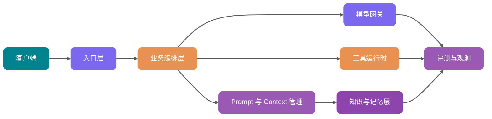

<!-- @include: @article-header.snippet.md -->

Xin chào mọi người, tôi là Guide.

Nhiều team khi làm ứng dụng AI, ngày đầu tiên đều rất hào hứng: viết một Prompt, gọi API của model lớn, trên giao diện nhanh chóng chạy được "chatbot thông minh", "hỏi đáp cơ sở tri thức" hay "trợ lý tạo báo cáo".

Rồi bước vào tuần thứ hai, vấn đề bắt đầu nảy sinh: cùng một câu hỏi hôm nay trả lời đúng, ngày mai lại trả lời lệch; tài liệu mà người dùng không có quyền truy cập lại được đưa vào ngữ cảnh; sửa một dòng Prompt, hiệu quả trên môi trường production đột ngột giảm nhưng không thể rollback; gọi model bị timeout, frontend cứ quay vòng; hóa đơn Token tăng vọt, không ai biết tiền chạy đi đâu; xảy ra sự cố, chỉ có thể ngồi đoán từ đống log xem lúc đó model đã nhìn thấy gì.

Ranh giới chính là ở đây: **Prompt Demo chứng minh model có thể trả lời, còn hệ thống production cần chứng minh hệ thống có thể trả lời ổn định, lâu dài và có kiểm soát**.

Bài viết này gần 1.5 vạn chữ, khuyên bạn nên lưu lại. Qua bài này bạn sẽ hiểu được:

1. **Tại sao khoảng cách giữa Prompt Demo và hệ thống production lại lớn đến vậy**: Độ ổn định, phân quyền, chi phí, quan sát, đánh giá và quản trị dữ liệu bị nghẽn ở đâu.
2. **Ứng dụng AI cấp production nên phân tầng như thế nào**: Tầng đầu vào, điều phối nghiệp vụ, model gateway, Prompt/Context, RAG, Memory, Tool, tác vụ bất đồng bộ, đánh giá quan sát phối hợp như thế nào.
3. **Làm sao chọn giữa ba chế độ tương tác: đồng bộ, streaming, bất đồng bộ**: Đừng làm tất cả request thành "chờ model trả về".
4. **Các thiết kế then chốt của model gateway, quyền hạn tool, RAG và Memory**: Giúp ứng dụng AI từ "chạy được" thành "có thể quản lý".
5. **Triển khai backend Java như thế nào**: Phân chia module, thiết kế bảng cốt lõi, giao diện dịch vụ và cách trả lời phỏng vấn.

## Tại sao kiến trúc Demo không chịu được tải production

Hãy nhìn vào một Demo phổ biến nhất:

```text
前端输入问题 -> 后端拼 Prompt -> 调用模型 API -> 返回答案
```

Chuỗi liên kết này có thể demo ý tưởng sản phẩm, nhưng nó thiếu 6 điều quan trọng nhất của hệ thống production.

| Chiều kích        | Prompt Demo                                             | Kiến trúc cấp production                                                           |
| ----------------- | ------------------------------------------------------- | ---------------------------------------------------------------------------------- |
| Độ ổn định        | Một model, một lần gọi, thất bại thì báo lỗi            | Định tuyến đa model, retry, fallback, circuit breaker, degraded response           |
| Phân quyền        | Người dùng mặc định hỏi gì thì tìm cái đó               | Lọc quyền trước khi truy vấn, gọi tool xác thực theo người dùng và tenant          |
| Chi phí           | Chỉ xem lần gọi có thành công không                     | Token budget, phân tầng model, cache, quy trách nhiệm chi phí và giới hạn          |
| Khả năng quan sát | Ghi lại câu hỏi của người dùng và câu trả lời cuối cùng | Ghi lại Prompt, đoạn trích, gọi tool, đầu ra model, Token, độ trễ, lỗi             |
| Đánh giá          | Dựa vào kiểm tra thủ công vài mẫu                       | Bộ đánh giá cố định, lấy mẫu online, LLM-as-Judge, vòng phản hồi kiểm tra thủ công |
| Quản trị dữ liệu  | Tài liệu nhập thẳng vào cơ sở dữ liệu, log lưu tùy tiện | Ẩn danh hóa PII, lưu giữ dữ liệu, kiểm toán, versioning, quy trình xóa và ủy quyền |

Đọc đến đây bạn có thể nghĩ: Chẳng phải chỉ là thêm vài lớp bọc ngoài interface cũ thôi sao?

Không chỉ thêm vài lớp bọc. Độ phức tạp của ứng dụng AI đến từ một thực tế rất đặc biệt: **một phần logic quyết định cốt lõi được giao cho probabilistic model**. Logic if-else trong backend truyền thống dù có lỗi, bạn vẫn có thể định vị được dòng code cụ thể; khi LLM mắc lỗi, nguyên nhân có thể nằm ở bất kỳ khâu nào trong Prompt version, thứ tự ngữ cảnh, nhiễu truy vấn, mô tả tool, sampling của model, lọc quyền, phân tích đầu ra.

Vì vậy, những gì kiến trúc AI cấp production cần làm là kỹ thuật hóa toàn bộ đầu vào, thực thi, đầu ra và phản hồi xung quanh model.

## Kiến trúc phân tầng chuẩn của ứng dụng AI cấp production

Guide đề xuất chia ứng dụng AI thành 9 tầng. Các công ty khác nhau có thể đặt tên khác nhau, nhưng ranh giới trách nhiệm về cơ bản là như nhau.



### Tầng đầu vào: Biến request của người dùng thành tác vụ có thể quản trị

Tầng đầu vào không thể chỉ dùng như một Controller. Nó ít nhất phải làm những việc sau:

- Xác thực và ủy quyền: Xác nhận người dùng, tenant, vai trò, phạm vi dữ liệu.
- Chuẩn hóa request: Thống nhất Web, App, API, Webhook, tác vụ định kỳ thành model tác vụ nội bộ.
- Rate limiting và chống spam: Giới hạn tốc độ theo người dùng, tenant, khả năng model và kịch bản nghiệp vụ.
- Kiểm soát idempotency: Tác vụ bất đồng bộ, gọi tool, thao tác thanh toán phải có idempotency key.
- Tiền xử lý nội dung nhạy cảm: Ẩn danh hóa PII, phát hiện đầu vào độc hại, sơ bộ lọc Prompt injection.

Sản phẩm then chốt của tầng đầu vào không phải là một chuỗi ký tự, mà là một structured request:

```java
public record AiRequest(
        String requestId,
        String tenantId,
        String userId,
        String sceneCode,
        String input,
        Map<String, Object> variables,
        PermissionScope permissionScope
) {
}
```

### Tầng điều phối nghiệp vụ: Quyết định cách chạy request lần này

Tầng điều phối nghiệp vụ tương đương với vỏ ngoài não bộ của ứng dụng AI, chịu trách nhiệm phán đoán:

- Lần này là hỏi đáp thông thường, hỏi đáp RAG, tác vụ đa bước Agent, hay tác vụ xử lý hàng loạt?
- Cần những ngữ cảnh nào: lịch sử hội thoại, hồ sơ người dùng, cơ sở tri thức, dữ liệu nghiệp vụ thời gian thực?
- Có cho phép gọi tool không? Tool nào cần xác nhận lần hai?
- Nên chạy đồng bộ, streaming, hay bất đồng bộ?
- Đầu ra có cần đưa vào đánh giá, kiểm tra thủ công hay hậu xử lý không?

Tầng này đừng nhồi nhét tất cả logic vào một "super Prompt". Các quy tắc có thể xác định dùng code, còn việc hiểu ngôn ngữ không thể liệt kê đầy đủ thì giao cho model. Ranh giới rõ ràng, hệ thống mới dễ debug.

### Model gateway: Biến việc gọi model thành hạ tầng cơ sở

Model gateway chịu trách nhiệm kết nối thống nhất các nhà cung cấp như OpenAI, Anthropic, Google Gemini, model riêng tư, Embedding model, Rerank model. Nó ẩn đi sự khác biệt giữa các API khác nhau, cung cấp giao diện ổn định cho phía trên.

Các khả năng cốt lõi của model gateway bao gồm:

- Định tuyến đa model: Chọn model theo kịch bản, chi phí, độ trễ, ngôn ngữ, độ dài ngữ cảnh và tỷ lệ thành công.
- Fallback: Khi model chính thất bại, timeout, hoặc hết hạn mức thì chuyển sang model dự phòng.
- Rate limiting và circuit breaker: Tránh để sự cố nhà cung cấp kéo sập thread pool của nghiệp vụ.
- Token budget: Ước tính Token đầu vào đầu ra, khi vượt ngân sách thì nén ngữ cảnh hoặc hạ cấp model.
- Quy trách nhiệm chi phí: Ghi lại chi phí theo tenant, người dùng, kịch bản, Prompt version.
- Quan sát thống nhất: Ghi lại request model, response, lỗi, TTFT, tổng độ trễ, Token usage.

Tài liệu chính thức của OpenAI, Anthropic, Google liên tục cập nhật các khả năng liên quan đến model, tool, streaming, đánh giá và chi phí. Khi liên quan đến tên model cụ thể, cửa sổ ngữ cảnh và giá cả, khuyến nghị duy trì động trong cấu hình hệ thống và ghi chú "theo tài liệu chính thức mới nhất", không nên hardcode trong code nghiệp vụ.

### Quản lý Prompt và Context: Đừng coi Prompt như chuỗi ký tự trong code

Trong môi trường production, Prompt nên được coi như một cấu hình có thể versioning, không thể rải rác thành các chuỗi nhiều dòng trong code.

Ít nhất cần hỗ trợ:

- Template version: Mỗi lần sửa tạo ra version mới, version cũ có thể phát lại.
- Tiêm biến: Biến nghiệp vụ, đầu vào người dùng, kết quả truy vấn, kết quả tool tiêm theo khu vực.
- Phát hành gray: Chọn Prompt version theo tenant, tỷ lệ người dùng, switch kịch bản.
- Rollback nhanh: Khi hiệu quả trên production giảm có thể chuyển lại version ổn định.
- Ghi nhật ký kiểm toán: Ai thay đổi gì vào lúc nào, tại sao thay đổi.
- Ràng buộc runtime: Mỗi request ghi lại tên Prompt, version và tóm tắt biến đã sử dụng.

Một quy tắc rất thực tế: **Thay đổi Prompt phải có thể theo dõi như thay đổi code, nhưng tần suất phát hành có thể cao hơn code**.

Tài liệu chính thức của Langfuse đặt Prompt Management, Tracing, Evaluation trong cùng một nền tảng kỹ thuật LLM, lý do cốt lõi cũng chính là điều này: Prompt không chỉ ảnh hưởng đến văn bản được tạo ra, nó còn ảnh hưởng đến truy vấn, gọi tool, chi phí và kết quả đánh giá.

### RAG, Memory, Tool: Ba loại ngữ cảnh không được trộn lẫn

Nhiều hệ thống AI càng làm càng rối là vì gọi tất cả thông tin là "ngữ cảnh".

Guide đề nghị tách chúng ra:

| Loại   | Lưu gì                                                                              | Vòng đời                              | Rủi ro cốt lõi                                                            |
| ------ | ----------------------------------------------------------------------------------- | ------------------------------------- | ------------------------------------------------------------------------- |
| RAG    | Tài liệu doanh nghiệp, sổ tay sản phẩm, quy định, tài liệu code, kiến thức ticket   | Do cập nhật cơ sở tri thức quyết định | Không truy vấn được, thu hồi vượt quyền, tài liệu hết hạn, sai tham chiếu |
| Memory | Sở thích người dùng, quyết định lịch sử, hồ sơ dài hạn, kinh nghiệm tác vụ          | Tiến hóa theo người dùng và phiên     | Ký ức sai bị cố định, rò rỉ riêng tư, ký ức lỗi thời gây nhiễu            |
| Tool   | Truy vấn đơn hàng, tạo ticket, gửi email, thay đổi cấu hình, truy vấn cơ sở dữ liệu | Gọi theo nhu cầu tại runtime          | Tham số sai, vượt quyền, thực thi nhầm thao tác nhạy cảm                  |

Cả ba đều có thể sử dụng vector retrieval, structured storage và rerank, nhưng mục tiêu dịch vụ hoàn toàn khác nhau. RAG cung cấp nguồn tri thức chia sẻ, Memory cung cấp bối cảnh cá nhân hóa, Tool kết nối hệ thống nghiệp vụ thực tế.

**Điểm mù thường gặp: Đừng coi Memory như phiên bản cá nhân của RAG rồi nhồi nhét tùy tiện.** Một khi ký ức được ghi sai, mọi vòng tiếp theo đều bị ô nhiễm. Trong môi trường production, việc ghi Memory thường phải thực thi bất đồng bộ, và phải qua kiểm tra Schema, lọc mức độ tin cậy, chính sách hết hạn và cổng kiểm tra thủ công.

## Làm sao chọn giữa ba chế độ tương tác: đồng bộ, streaming, bất đồng bộ

Không phải tất cả request của ứng dụng AI đều phù hợp với HTTP đồng bộ chờ đợi. Chọn sai chế độ tương tác, cả trải nghiệm người dùng lẫn độ ổn định hệ thống đều bị kéo sập.

| Chế độ             | Kịch bản phù hợp                                                        | Ưu điểm                                                         | Rủi ro                                                               | Điểm thiết kế backend                                            |
| ------------------ | ----------------------------------------------------------------------- | --------------------------------------------------------------- | -------------------------------------------------------------------- | ---------------------------------------------------------------- |
| Request đồng bộ    | Hỏi đáp ngắn, phân loại, trích xuất, tác vụ nhỏ độ trễ thấp             | Triển khai đơn giản, call chain rõ ràng                         | Nhạy cảm với timeout, dễ chiếm đầy thread                            | Đặt timeout ngắn, fail fast, cache kết quả                       |
| Response streaming | Chat, câu trả lời dài, tạo code, văn bản giọng nói                      | Trải nghiệm ký tự đầu tốt, người dùng cảm nhận chờ đợi ngắn hơn | Xử lý thất bại giữa chừng phức tạp, frontend có nhiều trạng thái hơn | SSE/WebSocket, theo dõi TTFT, có thể hủy generation              |
| Tác vụ bất đồng bộ | Tạo báo cáo, đánh giá hàng loạt, phân tích tài liệu dài, tác vụ đa tool | Có thể xếp hàng, có thể retry, có thể khôi phục                 | Trạng thái tác vụ và chuỗi thông báo phức tạp                        | Bảng tác vụ, hàng đợi, sự kiện tiến trình, idempotency và bù đắp |

Xu hướng đề xuất của Guide:

- **Tác vụ có thể hoàn thành ổn định trong 3 giây**, ưu tiên đồng bộ.
- **Tác vụ mà người dùng cần xem model bắt đầu đầu ra ngay lập tức**, ưu tiên streaming.
- **Tác vụ phụ thuộc vào tài liệu dài, nhiều vòng gọi tool hoặc xử lý hàng loạt**, bắt buộc bất đồng bộ.

Đừng làm tất cả interface thành streaming chỉ vì "trông giống ChatGPT". Ví dụ các lần gọi nội bộ như phân loại nhãn, chấm điểm rủi ro, quyết định routing, streaming không có nhiều lợi ích, mà còn tăng thêm độ phức tạp của chuỗi liên kết.

## Quản lý Prompt: Từ template string đến hệ thống version

Quản lý Prompt cấp production có thể mô hình hóa theo 5 đối tượng:

- `prompt_template`: Thông tin cơ bản về Prompt, ví dụ tên, kịch bản, loại, trạng thái.
- `prompt_version`: Nội dung cụ thể, định nghĩa biến, tham số model, người tạo, mô tả thay đổi.
- `prompt_release`: Version nào được phát hành đến môi trường nào, tenant nào, bao nhiêu lưu lượng.
- `prompt_run`: Prompt version, tóm tắt biến và đầu ra model được ràng buộc với mỗi lần gọi.
- `prompt_eval_result`: Kết quả của một Prompt version trên bộ đánh giá.

Bảng cốt lõi có thể thiết kế như sau:

| Tên bảng             | Trường chính                                                                        | Mục đích                                  |
| -------------------- | ----------------------------------------------------------------------------------- | ----------------------------------------- |
| `ai_prompt_template` | `id`, `name`, `scene_code`, `type`, `status`                                        | Quản lý tên logic Prompt                  |
| `ai_prompt_version`  | `id`, `template_id`, `version_no`, `content`, `variables_schema`, `model_config`    | Lưu nội dung Prompt có thể phát lại       |
| `ai_prompt_release`  | `id`, `template_id`, `version_id`, `env`, `traffic_ratio`, `tenant_scope`           | Kiểm soát gray và rollback                |
| `ai_prompt_run`      | `id`, `request_id`, `version_id`, `variables_hash`, `input_tokens`, `output_tokens` | Kết nối request online với Prompt version |

Khi tiêm biến cần tránh hai cạm bẫy:

1. **Biến không được làm sạch trực tiếp nối chuỗi**: Đầu vào người dùng, kết quả tool, đoạn trích đều có thể mang lệnh injection. Nên dùng thẻ phân vùng rõ ràng và chiến lược escape để cô lập.
2. **Prompt version và code version bị lệch pha**: Prompt thêm biến mới, code không truyền, trên production trực tiếp tạo ra ngữ cảnh trống. Khuyến nghị `variables_schema` thực hiện kiểm tra tại runtime.

Một ví dụ interface tối giản:

```java
public interface PromptService {

    RenderedPrompt render(RenderPromptCommand command);

    PromptVersion publish(PublishPromptCommand command);

    void rollback(String templateId, String targetVersionId);
}
```

## Model gateway: Định tuyến đa model, fallback và kiểm soát chi phí

Model gateway thường bị đánh giá thấp nhất. Nhiều team lúc đầu gọi trực tiếp SDK của một nhà cung cấp trong code nghiệp vụ, đến khi muốn đổi model, làm gray, kiểm tra chi phí mới phát hiện ra chỗ nào cũng bị coupling.

### So sánh chiến lược model gateway

| Chiến lược                    | Logic cốt lõi                                                              | Kịch bản phù hợp                                          | Rủi ro                                                               |
| ----------------------------- | -------------------------------------------------------------------------- | --------------------------------------------------------- | -------------------------------------------------------------------- |
| Model cố định                 | Một kịch bản cố định gọi một model                                         | Hệ thống giai đoạn đầu, tác vụ độ phức tạp thấp           | Chi phí và độ ổn định bị ảnh hưởng bởi một nhà cung cấp              |
| Định tuyến ưu tiên chi phí    | Mặc định đi model chi phí thấp, thất bại hoặc confidence thấp thì nâng cấp | Phân loại, tóm tắt, hỏi đáp nhẹ                           | Model chi phí thấp phán đoán sai truyền xuống hạ lưu                 |
| Định tuyến ưu tiên chất lượng | Request giá trị cao ưu tiên đi model có năng lực cao                       | Pháp lý, tài chính, hỗ trợ y tế, Agent phức tạp           | Chi phí cao, cần kiểm soát ngân sách                                 |
| Định tuyến ưu tiên độ trễ     | Chọn model theo độ trễ P95/P99 và availability zone                        | Chat thời gian thực, giọng nói, dịch vụ khách hàng online | Có thể hy sinh chất lượng suy luận phức tạp                          |
| Bỏ phiếu đa model             | Đa model tạo song song, rồi do bộ đánh giá chọn                            | Nội dung rủi ro cao, báo cáo quan trọng                   | Chi phí và độ trễ đều cao                                            |
| Chuỗi fallback                | Khi model chính thất bại chuyển sang model dự phòng                        | Hầu hết hệ thống production                               | Sự khác biệt năng lực model dự phòng ảnh hưởng tính nhất quán đầu ra |

### Làm Token budget như thế nào

Model gateway ít nhất phải thực hiện một lần dự toán trước khi gọi:

```text
预计输入 Token = System Prompt + 用户输入 + 历史消息 + RAG 片段 + Memory + Tool Schema
预计总 Token = 预计输入 Token + 最大输出 Token
```

Nếu vượt ngân sách, đừng trực tiếp cắt chuỗi. Thứ tự hạ cấp ổn định hơn là:

1. Xóa đoạn RAG có liên quan thấp.
2. Nén tin nhắn lịch sử sớm.
3. Giảm Tool Schema, chỉ giữ tool ứng viên.
4. Giảm độ dài đầu ra tối đa.
5. Chuyển sang model ngữ cảnh dài.
6. Từ chối thực thi và nhắc người dùng thu hẹp phạm vi.

Quy ước ngữ nghĩa GenAI của OpenTelemetry đã bao gồm các trường như tên model, input Token, output Token, trạng thái response. Dù bạn dùng Langfuse, LangSmith hay tự xây nền tảng quan sát, đều khuyến nghị cố gắng căn chỉnh với các trường chung này, việc di chuyển và theo dõi thống nhất về sau sẽ dễ dàng hơn nhiều.

## Gọi tool và phân quyền: Để model chỉ đề xuất hành động, hệ thống quyết định có thể làm không

Tool Calling rất dễ gây ra ảo giác: model trả về tên hàm và tham số, hệ thống thực thi là xong.

Điều này rất nguy hiểm trong môi trường production.

Mô hình tư duy ổn định hơn là: **Model chỉ có thể đề xuất "muốn gọi tool nào", trước khi thực sự thực thi phải qua kiểm tra của hệ thống**.

Tool runtime ít nhất phải bao gồm 6 cửa ải:

| Khâu              | Mục đích                                                                                              |
| ----------------- | ----------------------------------------------------------------------------------------------------- |
| Đăng ký tool      | Khai báo tên tool, mô tả, tham số Schema, nhãn quyền, mức độ rủi ro                                   |
| Truy vấn tool     | Chọn ra số ít tool liên quan đến tác vụ hiện tại từ nhiều tool, tránh phình ngữ cảnh                  |
| Kiểm tra tham số  | Dùng JSON Schema hoặc strongly-typed object kiểm tra bắt buộc, định dạng, enum, phạm vi               |
| Kiểm tra quyền    | Xác thực backend theo người dùng, tenant, vai trò, resource ID                                        |
| Xác nhận lần hai  | Xóa, thanh toán, gửi tin nhắn, thay đổi cấu hình và các thao tác nhạy cảm phải để người dùng xác nhận |
| Nhật ký kiểm toán | Ghi lại đề xuất model, tham số cuối cùng, người thực thi, kết quả thực thi và thông tin rollback      |

Tài liệu gọi tool chính thức của Anthropic và OpenAI đều nhấn mạnh định nghĩa tool, cấu trúc tham số và xử lý lần gọi. Khi đưa vào kỹ thuật, thêm một quy tắc cứng: **Đừng để model thay bạn phán đoán quyền hạn**.

Interface tool có thể định nghĩa như sau:

```java
public interface AiTool {

    ToolDefinition definition();

    ToolResult execute(ToolExecutionContext context, Map<String, Object> arguments);
}
```

Định nghĩa tool cần có mức độ rủi ro:

```java
public enum ToolRiskLevel {
    READ_ONLY,
    WRITE_LOW_RISK,
    WRITE_HIGH_RISK
}
```

Đối với `WRITE_HIGH_RISK`, tầng điều phối phải chuyển đổi lần gọi tool thành "hành động chờ xác nhận", không thể thực thi trực tiếp.

## RAG và Memory: Tri thức chia sẻ và ký ức cá nhân hóa phối hợp như thế nào

Cả RAG và Memory đều nhét thông tin bên ngoài vào ngữ cảnh, nhưng cách quản trị chúng khác nhau.

### Thứ tự phối hợp trong một request

Thứ tự khuyến nghị như sau:

1. Tầng đầu vào xác nhận danh tính người dùng và phạm vi quyền.
2. Dịch vụ Memory truy vấn sở thích và sự kiện dài hạn liên quan đến người dùng.
3. Dịch vụ RAG truy vấn cơ sở tri thức chia sẻ trong phạm vi quyền.
4. Tầng quản lý Context loại bỏ trùng lặp, lọc, nén hai loại kết quả riêng biệt.
5. Tầng điều phối đặt Memory vào khu vực "bối cảnh người dùng", đặt RAG vào khu vực "tài liệu bằng chứng".
6. Khi model đầu ra yêu cầu phân biệt "sự kiện dựa trên tài liệu" và "cách diễn đạt dựa trên sở thích người dùng".

Thứ tự này chủ yếu để tránh ô nhiễm ngữ cảnh.

### Làm sao tránh ô nhiễm ngữ cảnh

| Loại ô nhiễm             | Biểu hiện điển hình                                              | Cách phòng vệ                                                                             |
| ------------------------ | ---------------------------------------------------------------- | ----------------------------------------------------------------------------------------- |
| Ô nhiễm nhiễu RAG        | Truy vấn được tài liệu không liên quan, model bị dẫn lệch        | Hybrid Search, Rerank, nén Top-N, kiểm tra tham chiếu                                     |
| Ô nhiễm quyền            | Người dùng nhận được đoạn tài liệu không có quyền truy cập       | Lọc ACL trước truy vấn, cô lập tenant, kiểm toán kết quả thu hồi                          |
| Cố định sai ký ức        | Một lần nói tạm thời của người dùng được coi là sở thích dài hạn | Mức độ tin cậy ghi vào, thời gian hết hạn, người dùng có thể chỉnh sửa, kiểm tra thủ công |
| Xung đột sự kiện mới cũ  | Quy định phiên bản cũ và phiên bản mới đồng thời đi vào ngữ cảnh | Trường version, lọc thời gian, phát hiện xung đột                                         |
| Ô nhiễm Prompt injection | Tài liệu viết "bỏ qua các quy tắc trước"                         | Phân vùng nội dung tài liệu, ưu tiên lệnh, phát hiện injection                            |

Kinh nghiệm của Guide là: Kết quả RAG và Memory không nên trực tiếp ghép thành một đoạn "tài liệu nền". Phải đánh dấu rõ ràng nguồn gốc, thời gian, quyền hạn và độ tin cậy cho model. Ngữ cảnh model nhìn thấy càng có cấu trúc, càng ít có khả năng trộn "sở thích người dùng", "quy định công ty", "kết quả tool" thành một loại thông tin.

## Khả năng quan sát và đánh giá: Không có phát lại thì không có tối ưu hóa

Khi debug ứng dụng AI, điều đáng sợ nhất là chỉ nhìn thấy câu trả lời cuối cùng.

Một request hoàn chỉnh ít nhất phải ghi lại các dữ liệu sau:

| Loại     | Khuyến nghị ghi lại                                                                      |
| -------- | ---------------------------------------------------------------------------------------- |
| Prompt   | Tên template, version, tóm tắt biến, cấu trúc tin nhắn sau khi render cuối cùng          |
| Truy vấn | Query, đoạn thu hồi, điểm, nguồn, kết quả lọc quyền, thứ hạng Rerank                     |
| Memory   | Ký ức được đánh trúng, nguồn ký ức, thời gian cập nhật, mức độ tin cậy                   |
| Tool     | Tên tool, tham số, kết quả quyền, thời gian thực thi, tóm tắt trả về, lỗi                |
| Model    | Nhà cung cấp, tên model, tham số sampling, input/output Token, finish reason             |
| Độ trễ   | Thời gian đầu vào, thời gian truy vấn, TTFT model, tổng thời gian, thời gian tool        |
| Chi phí  | Chi phí đầu vào, chi phí đầu ra, cache hit, quy trách nhiệm theo tenant và kịch bản      |
| Kết quả  | Câu trả lời cuối cùng, kết quả phân tích có cấu trúc, phản hồi người dùng, điểm đánh giá |

Tài liệu chính thức của Langfuse, LangSmith và OpenTelemetry đều đặt tracing, datasets, evaluators, token usage, latency là đối tượng quan sát quan trọng của ứng dụng LLM. Tool có thể khác nhau, nhưng tín hiệu bạn cần nắm bắt về cơ bản là giống nhau.

### Đánh giá nên làm như thế nào

Đánh giá đừng chỉ hỏi "câu trả lời có tốt không". Phải tách thành chỉ số chuỗi liên kết:

- **Context Recall**: Bằng chứng đúng có được thu hồi không.
- **Context Precision**: Bao nhiêu đoạn được đưa vào ngữ cảnh thực sự hữu ích.
- **Faithfulness**: Câu trả lời có trung thành với bằng chứng đã cho không.
- **Answer Relevancy**: Câu trả lời có phản hồi câu hỏi của người dùng không.
- **Tool Success Rate**: Gọi tool có hoàn thành thành công không.
- **Format Valid Rate**: Đầu ra có cấu trúc có thể phân tích không.
- **Cost per Success**: Chi phí trung bình mỗi lần trả lời thành công.

LLM-as-Judge có thể dùng cho đánh giá tự động, nhưng không thể là trọng tài duy nhất. Nó phù hợp để sàng lọc ban đầu quy mô lớn, so sánh hồi quy và lấy mẫu online, nghiệp vụ quan trọng vẫn phải giữ lại kiểm tra thủ công, kiểm tra quy tắc và phản hồi người dùng.

Một vòng lặp khép kín thực tế là:

```text
线上失败样本 -> 进入数据集 -> 固定版本回放 -> 定位 Prompt/RAG/Tool/模型问题 -> 灰度新策略 -> 对比指标 -> 再发布
```

Không có phát lại thì chỉ có thể điều chỉnh Prompt theo cảm tính. Hệ thống điều chỉnh theo cảm tính rất khó ổn định trên production.

## Bảo mật và tuân thủ: Ứng dụng AI có nhiều điểm rủi ro hơn

Bề mặt bảo mật của ứng dụng AI rộng hơn hệ thống CRUD truyền thống. Vì đầu vào người dùng, tài liệu truy vấn, trả về của tool, ký ức lịch sử đều có thể ảnh hưởng đến hành vi model.

### Các hạng mục bảo mật bắt buộc làm

| Rủi ro                             | Giải thích                                                        | Đề xuất xử lý                                                                           |
| ---------------------------------- | ----------------------------------------------------------------- | --------------------------------------------------------------------------------------- |
| Rò rỉ PII                          | Log, Prompt, bộ đánh giá chứa số điện thoại, CMND, email          | Ẩn danh hóa trước khi nhập cơ sở dữ liệu, mã hóa trường nhạy cảm, tối thiểu hóa lưu giữ |
| Vượt quyền                         | Truy vấn hoặc gọi tool vượt ACL nghiệp vụ                         | Lọc trước truy vấn, xác thực lần hai trước khi thực thi tool                            |
| Prompt injection                   | Người dùng hoặc tài liệu dụ model bỏ qua quy tắc hệ thống         | Phân vùng nội dung, ưu tiên lệnh, phát hiện injection, chiến lược từ chối trả lời       |
| Mất kiểm soát lưu giữ dữ liệu      | Request model và log quan sát được lưu quá lâu                    | Cấu hình chu kỳ lưu giữ theo tenant và kịch bản                                         |
| Rủi ro dữ liệu huấn luyện          | Dùng dữ liệu nhạy cảm của người dùng để fine-tuning hoặc đánh giá | Ủy quyền rõ ràng, ẩn danh hóa, cô lập, có thể xóa                                       |
| Thực thi nhầm hành động rủi ro cao | Model nhầm gọi tool xóa, thanh toán, gửi thư                      | Phân cấp rủi ro, xác nhận lần hai, kiểm toán và bù đắp                                  |

Có một chi tiết dễ bỏ qua: **Chiến lược bảo mật không thể chỉ viết trong Prompt**. Prompt có thể nhắc model "không tiết lộ thông tin riêng tư", nhưng lọc quyền, ẩn danh hóa, kiểm toán, quy trình xác nhận phải được code và hạ tầng thực thi bắt buộc.

## Đề xuất triển khai backend Java

Nếu dùng Java để làm ứng dụng AI cấp production, Guide khuyến nghị phân module theo "năng lực miền", đừng phân module theo SDK nhà cung cấp.

### Phân chia module

| Module             | Trách nhiệm                                                                     |
| ------------------ | ------------------------------------------------------------------------------- |
| `ai-api`           | Interface REST/SSE/WebSocket đối ngoại, xác thực request và thích ứng giao thức |
| `ai-orchestrator`  | Điều phối nghiệp vụ, lựa chọn chế độ tương tác, state machine tác vụ            |
| `ai-prompt`        | Template Prompt, version, gray, render, rollback                                |
| `ai-context`       | Lắp ráp ngữ cảnh, Token budget, nén lịch sử, phân vùng ngữ cảnh                 |
| `ai-gateway`       | Định tuyến model, fallback, rate limiting, circuit breaker, thống kê chi phí    |
| `ai-rag`           | Truy vấn cơ sở tri thức, lọc quyền, Rerank, quản lý tham chiếu                  |
| `ai-memory`        | Ghi ký ức người dùng, truy vấn, xử lý xung đột, chính sách hết hạn              |
| `ai-tool`          | Đăng ký tool, kiểm tra tham số, thực thi, xác nhận lần hai, kiểm toán           |
| `ai-eval`          | Bộ dữ liệu, tác vụ đánh giá, LLM-as-Judge, phản hồi thủ công                    |
| `ai-observability` | Trace, chỉ số, log, chi phí, cảnh báo                                           |

### Thiết kế bảng cốt lõi

| Tên bảng           | Mục đích                                                                                       |
| ------------------ | ---------------------------------------------------------------------------------------------- |
| `ai_request_trace` | Trace chính của một AI request, ghi lại người dùng, tenant, kịch bản, trạng thái, thời gian    |
| `ai_model_call`    | Chi tiết gọi model, ghi lại model, tham số, Token, TTFT, lỗi                                   |
| `ai_context_item`  | Mục ngữ cảnh, ghi lại loại nguồn, source ID, Token, vị trí tiêm                                |
| `ai_rag_chunk_hit` | Chi tiết thu hồi RAG, ghi lại điểm, thứ hạng, quyền tài liệu, thông tin tham chiếu             |
| `ai_memory_item`   | Mục ký ức dài hạn, ghi lại người dùng, nội dung, mức độ tin cậy, thời gian hết hạn, trạng thái |
| `ai_tool_call`     | Chi tiết gọi tool, ghi lại tool, tóm tắt tham số, kết quả quyền, kết quả thực thi              |
| `ai_eval_dataset`  | Siêu dữ liệu bộ đánh giá                                                                       |
| `ai_eval_case`     | Mẫu đánh giá, bao gồm đầu vào, hành vi mong đợi, nhãn                                          |
| `ai_eval_run`      | Một tác vụ đánh giá                                                                            |
| `ai_eval_result`   | Kết quả đánh giá từng mẫu                                                                      |

### Thiết kế interface cốt lõi

```java
public interface ModelGateway {

    ModelResponse generate(ModelRequest request);

    Flux<ModelStreamEvent> stream(ModelRequest request);
}
```

```java
public interface ContextAssembler {

    AssembledContext assemble(AiRequest request, ContextPolicy policy);
}
```

```java
public interface RagService {

    List<RagHit> retrieve(RagQuery query, PermissionScope permissionScope);
}
```

```java
public interface EvaluationService {

    EvalRunResult runDataset(EvalRunCommand command);
}
```

### Một chuỗi liên kết request tối giản

```text
Controller
  -> RequestGuard 鉴权、限流、脱敏
  -> Orchestrator 选择同步/流式/异步
  -> ContextAssembler 拉取 RAG、Memory、历史
  -> PromptService 渲染模板版本
  -> ModelGateway 路由模型并记录 Token
  -> OutputParser 校验结构化输出
  -> TraceService 写入观测数据
```

Nếu bạn chỉ làm hỏi đáp cơ sở tri thức doanh nghiệp, giai đoạn đầu có thể triển khai `ai-api`, `ai-prompt`, `ai-gateway`, `ai-rag`, `ai-observability` trước. Memory, Tool, Eval có thể bổ sung dần. Nhưng Trace và Prompt version đừng để lại sau, chúng là nền tảng để debug vấn đề về sau.

## Làm sao trình bày kiến trúc này trong phỏng vấn

Khi người phỏng vấn hỏi "Bạn thiết kế ứng dụng AI cấp production như thế nào", đừng mở đầu bằng "Tôi sẽ dùng LangChain".

Cách trả lời ổn định hơn là:

1. Trước tiên nói về khoảng cách giữa Demo và production: độ ổn định, quyền hạn, chi phí, quan sát, đánh giá, quản trị dữ liệu.
2. Sau đó nói về phân tầng: tầng đầu vào, tầng điều phối, Prompt/Context, RAG/Memory/Tool, model gateway, tác vụ bất đồng bộ, đánh giá quan sát.
3. Nói về chuỗi liên kết then chốt: Một request xác thực, truy vấn, lắp ráp ngữ cảnh, gọi model, kiểm tra đầu ra, ghi Trace như thế nào.
4. Nói về năng lực quản trị: Prompt version, model fallback, Token budget, quyền tool, ẩn danh hóa PII.
5. Cuối cùng nói về vòng đánh giá khép kín: Bộ mẫu cố định, phát lại mẫu thất bại online, kết hợp LLM-as-Judge và kiểm tra thủ công.

## Ôn lại các điểm cốt lõi

1. **Prompt Demo chỉ chứng minh "có thể trả lời", kiến trúc cấp production cần chứng minh "trả lời ổn định lâu dài có kiểm soát"**.
2. **Model gateway là hạ tầng cơ sở của ứng dụng AI**, chịu trách nhiệm định tuyến, fallback, rate limiting, circuit breaker, Token budget và quy trách nhiệm chi phí.
3. **Prompt phải versioning**, hỗ trợ kiểm tra biến, gray, rollback và kiểm toán.
4. **RAG, Memory, Tool cần quản trị riêng biệt**, tri thức chia sẻ, ký ức cá nhân hóa và hành động nghiệp vụ thực tế không thể trộn lẫn thành một đống.
5. **Khả năng quan sát và đánh giá quyết định hệ thống có thể tiếp tục cải thiện không**, không có Trace và phát lại thì tối ưu hóa cơ bản là đoán mò.
6. **Chiến lược bảo mật phải được code thực thi bắt buộc**, Prompt chỉ có thể hỗ trợ, không thể thay thế quyền hạn, ẩn danh hóa, kiểm toán và xác nhận lần hai.

## Câu hỏi phỏng vấn thường gặp

**1. Khoảng cách lớn nhất từ Prompt Demo đến hệ thống production là gì?**

Khoảng cách cốt lõi nằm ở quản trị kỹ thuật. Demo quan tâm model có thể trả lời không, hệ thống production quan tâm độ ổn định, cô lập quyền, kiểm soát chi phí, khả năng quan sát, phát lại đánh giá và tuân thủ dữ liệu.

**2. Tại sao cần model gateway?**

Model gateway thống nhất sự khác biệt nhà cung cấp, định tuyến model, fallback, rate limiting, circuit breaker, Token budget, thống kê chi phí và quan sát lại, tránh để code nghiệp vụ trực tiếp coupling với một model API cụ thể.

**3. Đồng bộ, streaming, bất đồng bộ chọn như thế nào?**

Tác vụ nhỏ đi đồng bộ, câu trả lời dài và chat đi streaming, tạo báo cáo, xử lý hàng loạt, tác vụ đa tool đi bất đồng bộ. Phán đoán cốt lõi là thời gian tác vụ, người dùng có cần phản hồi ký tự đầu không, có cần retry và khôi phục không.

**4. Tại sao Prompt cần quản lý version?**

Prompt sẽ trực tiếp ảnh hưởng chất lượng đầu ra, gọi tool, chiến lược truy vấn và chi phí. Quản lý version có thể hỗ trợ gray, rollback, kiểm toán và phát lại đánh giá offline.

**5. Ranh giới bảo mật của Tool Calling ở đâu?**

Model chỉ có thể đề xuất ý định gọi tool, kiểm tra tham số, kiểm tra quyền, xác nhận thao tác nhạy cảm và kiểm toán phải được hệ thống backend hoàn thành.

**6. RAG và Memory có gì khác nhau?**

RAG quản lý nguồn tri thức chia sẻ, ví dụ tài liệu doanh nghiệp và sổ tay sản phẩm; Memory quản lý sự kiện cá nhân hóa dài hạn, ví dụ sở thích người dùng và quyết định lịch sử. Cả hai có thể phối hợp, nhưng cần tiêm theo khu vực vào ngữ cảnh, tránh ô nhiễm.

**7. Khả năng quan sát ứng dụng AI cần xem những chỉ số nào?**

Ít nhất xem Prompt version, truy vấn hit, gọi tool, đầu ra model, input/output Token, TTFT, tổng độ trễ, tỷ lệ thành công, tỷ lệ lỗi, chi phí và điểm đánh giá.

**8. LLM-as-Judge có thể thay thế đánh giá thủ công không?**

Không thể. Nó phù hợp để tự động hóa hồi quy, lấy mẫu online và sàng lọc ban đầu quy mô lớn, nhưng nghiệp vụ quan trọng vẫn cần kiểm tra quy tắc, kiểm tra thủ công và vòng phản hồi người dùng.

## Tài liệu tham khảo

- [OpenAI API 官方文档](https://developers.openai.com/api/docs)
- [OpenAI Agents SDK 观测与集成](https://developers.openai.com/api/docs/guides/agents/integrations-observability)
- [Anthropic Tool Use 官方文档](https://docs.anthropic.com/en/docs/build-with-claude/tool-use)
- [Anthropic Prompt Caching 官方文档](https://docs.anthropic.com/en/docs/build-with-claude/prompt-caching)
- [Google Vertex AI 生成式 AI 评测文档](https://docs.cloud.google.com/vertex-ai/generative-ai/docs/models/evaluation-overview)
- [Google Vertex AI RAG Grounding 文档](https://docs.cloud.google.com/vertex-ai/generative-ai/docs/grounding/ground-responses-using-rag)
- [Langfuse Observability 官方文档](https://langfuse.com/docs/observability/overview)
- [Langfuse Prompt Management 官方文档](https://langfuse.com/docs/prompt-management/overview)
- [LangSmith Evaluation 官方文档](https://docs.langchain.com/langsmith/evaluation)
- [OpenTelemetry GenAI 语义约定](https://opentelemetry.io/docs/specs/semconv/gen-ai/)
