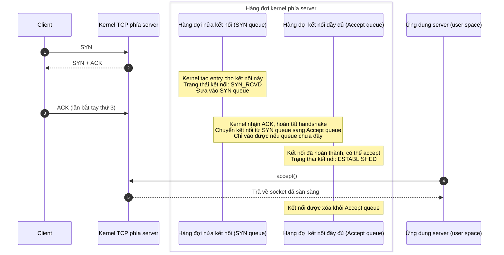
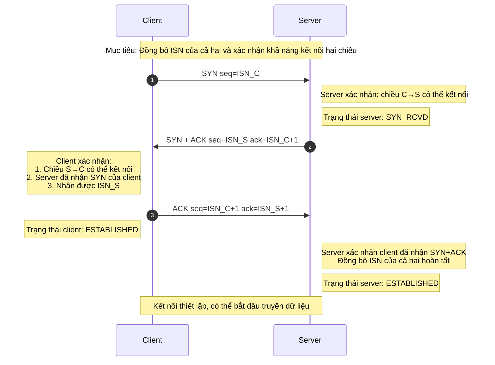
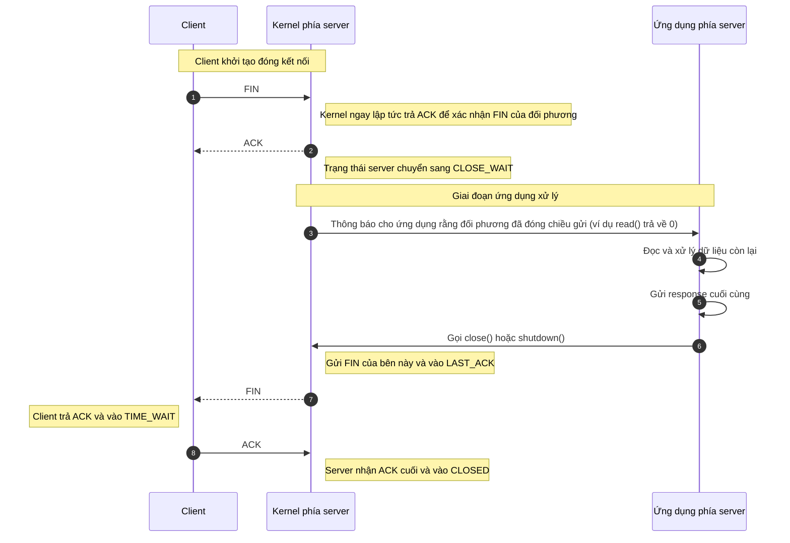

TCP (Transmission Control Protocol) là giao thức tầng vận chuyển **hướng kết nối** (connection-oriented) và **đáng tin cậy** (reliable). "Đáng tin cậy" thể hiện ở: giao nhận theo thứ tự, phát hiện lỗi, truyền lại khi mất gói, kiểm soát luồng và kiểm soát tắc nghẽn. Để xây dựng một kênh kết nối logic đáng tin cậy trên mạng không đáng tin cậy, TCP phải hoàn thành quá trình thiết lập kết nối trước khi truyền dữ liệu, tức là **bắt tay 3 lần (Three-way Handshake)**.

## Thiết lập kết nối — TCP bắt tay 3 lần


Thiết lập một kết nối TCP cần "bắt tay 3 lần", thiếu bất kỳ bước nào cũng không được:

1. **Lần bắt tay thứ nhất (SYN)**: Client gửi một segment SYN (Synchronize Sequence Numbers) đến server, trong đó chứa số thứ tự khởi đầu (Initial Sequence Number — ISN) được client tạo ngẫu nhiên, ví dụ seq=x. Sau khi gửi, client chuyển sang trạng thái **SYN_SENT**, chờ xác nhận từ server.
2. **Lần bắt tay thứ hai (SYN+ACK)**: Khi nhận được segment SYN, nếu đồng ý thiết lập kết nối, server gửi lại cho client một segment xác nhận. Segment này chứa hai thông tin quan trọng:
   - **SYN**: Server cũng cần đồng bộ ISN của mình, do đó segment cũng chứa ISN do server tạo ngẫu nhiên, ví dụ seq=y.
   - **ACK** (Acknowledgement): Xác nhận đã nhận được request của client. Acknowledgement number được đặt là ISN của client cộng 1, tức là ack=x+1.
   - Sau khi gửi segment này, server chuyển sang trạng thái **SYN_RCVD** (còn gọi là SYN_RECV).
3. **Lần bắt tay thứ ba (ACK)**: Sau khi nhận được segment SYN+ACK từ server, client gửi segment xác nhận cuối cùng đến server. Segment này chứa acknowledgement number ack=y+1. Sau khi gửi, client chuyển sang trạng thái **ESTABLISHED**. Sau khi server nhận được segment ACK này, cũng chuyển sang trạng thái **ESTABLISHED**.

Đến đây, cả hai bên đều xác nhận kết nối đã được thiết lập, kết nối TCP tạo thành công và có thể bắt đầu truyền dữ liệu hai chiều.

### Hàng đợi nửa kết nối và hàng đợi kết nối đầy đủ là gì?



Trong quá trình TCP bắt tay 3 lần, kernel phía server thường dùng hai hàng đợi để quản lý các connection request (chi tiết triển khai có thể khác nhau giữa các hệ điều hành/phiên bản kernel; ví dụ dưới đây là hành vi Linux phổ biến):

1. **Hàng đợi nửa kết nối** (còn gọi là SYN Queue):
   - Lưu các request "chưa hoàn tất handshake": Server nhận SYN và trả SYN+ACK, kết nối vào SYN_RCVD, chờ ACK cuối từ client.
   - Nếu không nhận được ACK, kernel sẽ gửi lại SYN+ACK theo chính sách retransmit, cuối cùng timeout và dọn dẹp.
   - Tham số liên quan phổ biến: `net.ipv4.tcp_max_syn_backlog`; trong tình huống SYN Flood có thể kết hợp `net.ipv4.tcp_syncookies`.
2. **Hàng đợi kết nối đầy đủ** (còn gọi là Accept Queue):
   - Lưu các kết nối "handshake đã hoàn tất nhưng ứng dụng chưa accept": Server nhận ACK cuối, kết nối chuyển thành `ESTABLISHED` và vào Accept Queue, chờ tầng ứng dụng gọi `accept()` để lấy đi.
   - Capacity của queue bị ảnh hưởng bởi cả `listen(fd, backlog)` và giới hạn hệ thống `net.core.somaxconn`; trong thực tế giới hạn hiệu quả thường xấp xỉ `min(backlog, somaxconn)` (hành vi cụ thể phụ thuộc phiên bản kernel).

Tổng kết:

| Hàng đợi                         | Vai trò                             | Trạng thái  | Điều kiện rời queue                |
| -------------------------------- | ----------------------------------- | ----------- | ---------------------------------- |
| Hàng đợi nửa kết nối (SYN Queue) | Lưu kết nối chưa hoàn tất handshake | SYN_RCVD    | Nhận được ACK / Retransmit timeout |
| Hàng đợi đầy đủ (Accept Queue)   | Lưu kết nối đã hoàn tất handshake   | ESTABLISHED | Được tầng ứng dụng accept() lấy đi |

Khi Accept Queue đầy, `net.ipv4.tcp_abort_on_overflow` ảnh hưởng đến chiến lược xử lý:

- `0` (mặc định): Thường không làm kết nối fail nhanh ngay, để lại bộ đệm thời gian cho ứng dụng (có thể biểu hiện là client retry/timeout).
- `1`: Trực tiếp trả lời client bằng `RST`, làm kết nối fail nhanh.

Khi SYN Queue đầy, nếu đã bật `tcp_syncookies`, server có thể không cấp phát entry thông thường trong SYN queue cho kết nối đó, mà thay vào đó tính toán và trả lại một **SYN Cookie**. Chỉ khi nhận được ACK cuối hợp lệ, thông tin kết nối cần thiết mới được "tái tạo". Đây là một trong các biện pháp chủ yếu chống **SYN Flood**.

### Tại sao cần bắt tay 3 lần?

Mục đích cốt lõi của TCP bắt tay 3 lần là thiết lập một kênh giao tiếp **đáng tin cậy** và **full-duplex** giữa client và server. Điều này cần đạt được hai mục tiêu chính:

**1. Xác nhận khả năng gửi/nhận của cả hai bên và đồng bộ ISN (Initial Sequence Number)**



TCP dựa vào số thứ tự (SEQ) và số xác nhận (ACK) để đảm bảo dữ liệu **có thứ tự, không trùng lặp, có thể retransmit**. Bắt tay 3 lần thông qua việc trao đổi và xác nhận ISN của cả hai bên, giúp hai đầu thống nhất về "bắt đầu gửi/nhận dữ liệu từ số thứ tự nào", đồng thời làm cho quá trình handshake tạo thành vòng kín, tránh việc chỉ dựa vào thông tin một chiều đã vào trạng thái established.

Sau ba lần trao đổi này, cả hai bên đều xác nhận chức năng gửi/nhận của nhau hoạt động bình thường và hoàn thành đồng bộ ISN, đặt nền tảng cho việc truyền dữ liệu đáng tin cậy tiếp theo.

Ghi nhớ nhanh xác nhận năng lực qua 3 lần bắt tay:

1. C→S: SYN → S xác nhận: C có thể gửi, S có thể nhận (C→S thông).
2. S→C: SYN+ACK → C xác nhận: S có thể gửi, C có thể nhận, và S đã nhận SYN của C (SEQ đối phương + 1).
3. C→S: ACK → S xác nhận: C đã nhận SYN+ACK của S, handshake khép vòng, kết nối thiết lập.

**2. Ngăn chặn các connection request đã hết hiệu lực bị thiết lập nhầm**

```mermaid
sequenceDiagram
    participant C as Client
    participant S as Server

    Note over C,S: Kịch bản: SYN cũ bị trễ trên mạng

    C->>S: 1. Gửi SYN (request cũ - đang bị trễ)
    Note over C: Client timeout, bỏ request này

    C->>S: 2. Gửi SYN (request mới)
    S-->>C: 3. Thiết lập kết nối và giải phóng bình thường...

    rect rgb(255, 240, 240)
        Note right of S: Lúc này, SYN cũ mới đến server
        S->>C: 4. Gửi SYN+ACK (cho request cũ)

        alt Nếu là【Bắt tay 2 lần】
            Note right of S: (Giả sử server coi kết nối đã thiết lập sau khi trả SYN+ACK)
            Note right of S: ❌ Thiết lập kết nối nhầm (Ghost Connection)<br/>Cấp phát bộ nhớ/tài nguyên, gây lãng phí
        else Nếu là【Bắt tay 3 lần】
            Note left of C: Client không có trạng thái kết nối này / gói tin không mong đợi
            C->>S: 5. Gửi RST (reset) hoặc bỏ qua

            Note right of S: 【Kết quả phía server】<br/>Nhận RST thì dọn dẹp ngay;<br/>Hoặc không nhận ACK thì retransmit và cuối cùng timeout dọn dẹp
            Note right of S: ✅ Tránh thiết lập kết nối nhầm, bảo vệ tài nguyên
        end
    end
```

Hãy tưởng tượng: Client gửi connection request đầu tiên (SYN1) bị trễ trên mạng, client gửi lại request thứ hai (SYN2) và thiết lập kết nối thành công, sau khi truyền dữ liệu xong kết nối được giải phóng. Lúc này, SYN1 bị trễ mới đến server.

- **Nếu là bắt tay 2 lần**: Server nhận SYN1 hết hiệu lực này sẽ nhầm tưởng là connection request mới, lập tức cấp phát tài nguyên và thiết lập kết nối. Nhưng điều này khiến server đơn phương duy trì một kết nối không hợp lệ, lãng phí tài nguyên hệ thống, vì client sẽ không có bất kỳ phản hồi nào.
- **Với lần bắt tay thứ ba**: Server nhận SYN1 hết hiệu lực và trả SYN+ACK, sẽ chờ xác nhận cuối (ACK) từ client. Vì client hiện tại không có ý định kết nối, nó sẽ bỏ qua SYN+ACK này hoặc gửi RST (Reset). Như vậy, server không nhận được ACK lần bắt tay 3, cuối cùng sẽ timeout đóng kết nối lỗi này, tránh lãng phí tài nguyên.

Do đó, bắt tay 3 lần là bước **tối thiểu và cần thiết** để đảm bảo độ tin cậy của kết nối TCP. Nó không chỉ xác nhận khả năng giao tiếp của cả hai bên mà còn thêm một bước xác nhận cuối để ngăn chặn các request lịch sử bị trễ hay trùng lặp trên mạng gây ảnh hưởng đến việc thiết lập kết nối.

### Lần bắt tay thứ 2 đã gửi ACK rồi, tại sao còn gửi thêm SYN?

ACK trong lần bắt tay thứ 2 dùng để xác nhận "server đã thực sự nhận được SYN của client" (tức xác nhận request C→S đã đến nơi). Còn SYN kèm theo dùng để đồng bộ ISN của server với client và yêu cầu client xác nhận (tức thiết lập và xác nhận quá trình thiết lập chiều S→C). Chỉ khi ISN của cả hai bên đều được đồng bộ hoàn tất, việc truyền dữ liệu đáng tin cậy tiếp theo (theo thứ tự, retransmit, loại trùng) mới có điểm xuất phát chung.

Tóm lại: ACK dùng để nói "tôi đã nhận được SYN của bạn", SYN dùng để nói "tôi cũng muốn đồng bộ của tôi, hãy xác nhận nhé".

> SYN (Synchronize Sequence Numbers) là tín hiệu handshake dùng khi TCP/IP thiết lập kết nối. Khi thiết lập kết nối TCP bình thường giữa client và server, client đầu tiên gửi message SYN, server trả lời bằng SYN-ACK để xác nhận đã nhận, cuối cùng client phản hồi bằng message ACK (Acknowledgement). Như vậy kết nối TCP đáng tin cậy giữa client và server mới được thiết lập, dữ liệu mới có thể truyền tải giữa client và server.

### Có thể mang dữ liệu trong quá trình bắt tay 3 lần không?

Trong quá trình TCP bắt tay 3 lần, lần bắt tay thứ 3 có thể mang dữ liệu (client đã vào trạng thái ESTABLISHED sau khi gửi ACK xác nhận), điều này được đề cập trong tài liệu RFC 793. Tức là khi đã hoàn tất hai lần bắt tay đầu, giao thức TCP cho phép bắt đầu truyền dữ liệu từ lần bắt tay thứ 3.

Nếu gói ACK xác nhận của lần bắt tay thứ 3 bị mất, nhưng client đã bắt đầu gửi gói mang dữ liệu, thì khi server nhận được gói mang dữ liệu này, nếu gói đó có cờ ACK, server sẽ coi đó là xác nhận hợp lệ của lần bắt tay thứ 3. Như vậy, kết nối được coi là đã thiết lập, server sẽ xử lý gói dữ liệu đó và tiếp tục luồng truyền dữ liệu bình thường.

## Ngắt kết nối — TCP vẫy tay 4 lần


Ngắt một kết nối TCP cần "vẫy tay 4 lần", thiếu bất kỳ bước nào cũng không được:

1. **Lần vẫy tay thứ nhất (FIN)**: Khi client (hoặc bất kỳ bên nào) quyết định đóng kết nối, nó gửi đến server một segment có cờ **FIN** (Finish), cho biết đã không còn dữ liệu để gửi nữa. Segment này chứa số thứ tự seq=u. Sau khi gửi, client chuyển sang trạng thái **FIN-WAIT-1**.
2. **Lần vẫy tay thứ hai (ACK)**: Server nhận được segment FIN, lập tức trả lại một segment xác nhận **ACK**. Acknowledgement number là ack=u+1. Sau khi gửi, server chuyển sang trạng thái **CLOSE-WAIT**. Client nhận được ACK này chuyển sang trạng thái **FIN-WAIT-2**. Lúc này kết nối TCP ở trạng thái **Half-Close (nửa đóng)**: kênh gửi từ client đến server đã đóng, nhưng kênh gửi từ server đến client vẫn có thể truyền dữ liệu.
3. **Lần vẫy tay thứ ba (FIN)**: Khi server xác nhận tất cả dữ liệu cần gửi đã được gửi xong, nó cũng gửi đến client một segment **FIN**, cho biết cũng đã sẵn sàng đóng kết nối. Segment này cũng chứa số thứ tự seq=y. Sau khi gửi, server chuyển sang trạng thái **LAST-ACK**, chờ xác nhận cuối từ client.
4. **Lần vẫy tay thứ tư**: Client nhận được segment FIN từ server, trả lại segment xác nhận **ACK** cuối cùng, acknowledgement number là ack=y+1. Sau khi gửi, client chuyển sang trạng thái **TIME-WAIT**. Server nhận được ACK này lập tức chuyển sang trạng thái **CLOSED**, hoàn tất việc đóng kết nối. Client sẽ chờ ở trạng thái **TIME-WAIT** trong thời gian **2MSL** (Maximum Segment Lifetime — Thời gian sống tối đa của segment) rồi mới chuyển sang trạng thái **CLOSED**.

Trong quá trình vẫy tay 4 lần, kết nối có thể ở trạng thái **Half-Close (nửa đóng)**: **Bên gửi FIN trước không gửi thêm dữ liệu ứng dụng nữa**, nhưng **bên kia vẫn có thể tiếp tục gửi nốt dữ liệu còn lại**, cho đến khi bên đó cũng gửi FIN và hoàn tất ACK tiếp theo.

### Tại sao cần vẫy tay 4 lần?

TCP là giao tiếp full-duplex: hai chiều gửi độc lập với nhau. Khi ngắt kết nối, thường cần "tôi không gửi nữa" và "bạn cũng không gửi nữa" được bên kia xác nhận riêng biệt, do đó thường thể hiện thành bốn segment (FIN/ACK/FIN/ACK). Điều này cũng tương ứng với thực tế "hai bên xác nhận cúp máy riêng biệt".

Ví dụ: A và B đang nói chuyện điện thoại, cuộc trò chuyện sắp kết thúc.

1. **Lần vẫy tay thứ nhất**: A nói "Tôi không còn gì để nói nữa" (A gửi FIN)
2. **Lần vẫy tay thứ hai**: B trả lời "Tôi biết rồi", nhưng B có thể vẫn còn điều muốn nói, A không thể yêu cầu B kết thúc cuộc gọi theo nhịp của mình (B trả ACK, nhưng có thể còn muốn nói thêm)
3. **Lần vẫy tay thứ ba**: Vậy là B nói thêm một hồi nữa, cuối cùng B nói "Tôi nói xong rồi" (B gửi FIN)
4. **Lần vẫy tay thứ tư**: A trả lời "Tôi biết rồi", cuộc gọi mới coi là kết thúc (A trả ACK).

### Tại sao không thể gộp ACK và FIN của server thành 3 lần vẫy tay?



Lý do chính là: thời điểm kích hoạt **trả ACK** và **gửi FIN** thường không đồng bộ.

- Khi server nhận FIN của client, kernel TCP stack sẽ lập tức trả ACK, xác nhận "tôi đã nhận được request đóng của bạn". Lúc này server vào CLOSE_WAIT, chờ ứng dụng của bên này xử lý xong công việc còn lại.
- Chỉ khi ứng dụng server xử lý xong và gọi `close()/shutdown()`, kernel mới gửi FIN của bên này.
- Do đó "kernel tự động trả ACK" và "ứng dụng quyết định gửi FIN" bị tách rời về thời gian, thường không thể gộp lại. Chỉ khi server vừa hay cũng sẵn sàng đóng ngay lập tức, mới có thể xảy ra trường hợp FIN+ACK được gộp trong một segment.

### Nếu ACK của server trong lần vẫy tay thứ 2 không đến được client thì sao?

- **Trạng thái client**: Sau khi client gửi `FIN` đầu tiên, chuyển sang **FIN_WAIT_1** và khởi động retransmit timer.
- **Logic retransmit**: Nếu trong thời gian timeout không nhận được `ACK` xác nhận `FIN` đó từ đối phương, client sẽ retransmit `FIN`.
- **Xử lý phía server**: Nếu server nhận được `FIN` trùng lặp, thường sẽ gửi lại `ACK`. Nếu do vấn đề mạng mà ACK cứ không đến được, client sau khi vượt quá một ngưỡng retry/timeout nhất định có thể báo lỗi hoặc bỏ cuộc (phụ thuộc vào triển khai và các tham số như `tcp_retries2`).

### Tại sao sau lần vẫy tay thứ 4, client cần chờ 2\*MSL mới vào trạng thái CLOSED?

Trong lần vẫy tay thứ 4, ACK mà client gửi cho server có thể bị mất. Nếu vì lý do nào đó server không nhận được ACK, server sẽ gửi lại FIN. Nếu client nhận được FIN trong thời gian 2\*MSL, client sẽ gửi lại ACK và chờ thêm 2MSL nữa, ngăn server liên tục gửi lại FIN vì không nhận được ACK.

> **MSL (Maximum Segment Lifetime)**: Thời gian sống tối đa của một segment trên mạng. 2MSL là thời gian tối đa cần cho một lần gửi và một lần trả lời. Nếu cho đến hết 2MSL, client vẫn không nhận lại FIN nào, client suy luận rằng ACK đã được server nhận thành công, và kết thúc kết nối TCP.

## Tài liệu tham khảo

- 《Mạng máy tính (Phiên bản 7)》
- 《Giải thích HTTP bằng hình ảnh》
- TCP and UDP Tutorial: <https://www.9tut.com/tcp-and-udp-tutorial>
- Phân tích chi tiết hàng đợi nửa kết nối và hàng đợi kết nối đầy đủ của TCP qua sự cố thực tế: <https://mp.weixin.qq.com/s/YpSlU1yaowTs-pF6R43hMw>

<!-- @include: @article-footer.snippet.md -->
