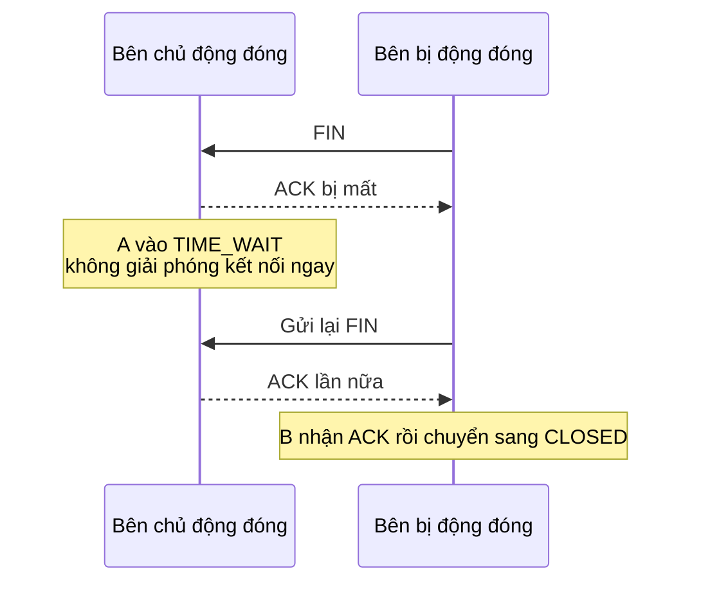

Bước cuối cùng trong quá trình đóng kết nối TCP 4 bước bắt tay, sau khi bên chủ động đóng gửi ACK xong không đóng ngay lập tức, mà chuyển sang trạng thái `TIME_WAIT`, mặc định phải đợi 60 giây.

60 giây này thường bị hiểu nhầm: có người cho rằng đây là lãng phí tài nguyên, có người muốn tắt cưỡng bức bằng tham số kernel, có người nhầm lẫn khi troubleshoot giữa `CLOSE_WAIT` và `TIME_WAIT`.

Bài viết này trả lời những câu hỏi phổ biến nhất trên môi trường production:

1. `TIME_WAIT` đang đợi cái gì?
2. Khi `TIME_WAIT` tích lũy nhiều, liệu có thực sự gây ra vấn đề không?
3. `tcp_tw_reuse` có thể bật tùy tiện không?
4. Làm thế nào để phân biệt `TIME_WAIT` và `CLOSE_WAIT`?

## TIME_WAIT không chỉ đơn giản là "đợi thêm một chút rồi đóng"

ACK đã được gửi rồi, tại sao vẫn phải giữ cổng thêm vài chục giây?

Sau khi bên chủ động đóng gửi ACK cuối cùng, không giải phóng kết nối ngay, mà chuyển sang `TIME_WAIT`. Trong sơ đồ trạng thái kết nối của RFC 9293 cũng có thể thấy, `TIME_WAIT` sẽ xóa TCB sau timeout 2MSL và chuyển sang `CLOSED`.

Cần lưu ý một chi tiết: không phải "ai nhận FIN thì người đó vào TIME_WAIT". Bên bị động đóng sau khi nhận FIN, thường sẽ chuyển vào `CLOSE_WAIT` trước, chờ ứng dụng xử lý xong dữ liệu còn lại rồi gọi `close()` hoặc `shutdown()`. Trường hợp phổ biến hơn là bên chủ động đóng nhận FIN cuối cùng từ đối phương, trả lại ACK cuối cùng, rồi chuyển vào `TIME_WAIT`.

**Bên nào chủ động đóng kết nối, bên đó dễ bị vào TIME_WAIT hơn.** Ví dụ, client chủ động ngắt kết nối HTTP ngắn, `TIME_WAIT` thường xuất hiện ở phía client; nếu server chủ động ngắt kết nối, server cũng có thể tích lũy nhiều `TIME_WAIT`.

Trông có vẻ chỉ đợi thêm một lúc, nhưng thực ra đang giải quyết hai vấn đề.

## Lý do thứ nhất: Cho ACK cuối cùng cơ hội được cứu vãn

Sau khi bên chủ động đóng gửi ACK cuối cùng, nếu ACK này bị mất trong mạng, bên bị động đóng sẽ nghĩ FIN của mình chưa được xác nhận, nên sẽ gửi lại FIN. Nếu bên chủ động đóng vẫn còn trong `TIME_WAIT`, có thể trả lại ACK lần nữa; nếu đã chuyển sang `CLOSED`, có thể sẽ trả RST, khiến đối phương cảm nhận như là đóng bất thường hoặc kết nối bị reset.



**MSL (Maximum Segment Lifetime)** là thời gian tồn tại tối đa của một segment trong mạng. 2MSL không phải là RTT tối đa của một cặp request-response, mà là cửa sổ đợi thận trọng: vừa để lại cơ hội xử lý khi FIN được gửi lại do ACK cuối bị mất, vừa đảm bảo các gói tin trễ từ kết nối cũ biến mất khỏi mạng.

Cần lưu ý, MSL trong RFC là khái niệm ở tầng giao thức, các hệ thống cụ thể có thể triển khai khác nhau. Trong các triển khai Linux phổ biến, thời gian giữ `TIME_WAIT` thường là 60 giây. Còn một điều hiểu nhầm phổ biến: `tcp_fin_timeout` kiểm soát timeout `FIN_WAIT_2` của orphaned connection, không phải `TIME_WAIT`. Để giảm áp lực cổng do `TIME_WAIT` gây ra, hãy ưu tiên xem xét tái sử dụng kết nối, phạm vi cổng, bên chủ động đóng và điều kiện `tcp_tw_reuse`, thay vì cố dùng `tcp_fin_timeout` để rút ngắn `TIME_WAIT`.

## Lý do thứ hai: Không để gói tin cũ lẫn vào kết nối mới

Kết nối TCP được định danh bằng bộ tứ: IP nguồn, cổng nguồn, IP đích, cổng đích. Nếu kết nối cũ vừa đóng, ngay lập tức tạo kết nối mới với cùng bộ tứ đó, các gói tin trễ từ kết nối cũ có thể rơi đúng vào cửa sổ nhận của kết nối mới, bị xử lý như dữ liệu của kết nối mới.

Ví dụ:

```text
Kết nối cũ: client:50000 -> server:443
Gói tin SEQ=301 do server gửi đi lạc trong mạng, chưa đến.

Sau khi kết nối cũ đóng, client nhanh chóng tái sử dụng cổng nguồn đó:
Kết nối mới: client:50000 -> server:443

Lúc này SEQ=301 cũ đến client.
Nếu nó rơi đúng vào cửa sổ nhận của kết nối mới, có thể bị nhận nhầm.
```

Không gian số thứ tự TCP là 0 đến 2^32 - 1, sẽ wrap around theo modulo 2^32, nên không thể chỉ dựa vào số thứ tự để phân biệt gói mới và gói cũ mãi mãi. Các hệ thống thực tế còn có timestamp, PAWS (Protection Against Wrapped Sequences), ISN ngẫu nhiên, v.v. để bảo vệ, nhưng chúng không phải là giải pháp vạn năng "thay thế hoàn toàn TIME_WAIT". RFC 1337 cũng thảo luận về rủi ro TIME_WAIT do gói tin cũ trùng lặp gây ra.

## TIME_WAIT tích lũy nhiều có thực sự gây vấn đề không?

`TIME_WAIT` bản thân là trạng thái bình thường. Vấn đề thực sự thường xảy ra khi bên chủ động đóng trong thời gian ngắn tạo ra nhiều kết nối đến cùng một IP đích + cổng đích, khiến các cổng tạm thời cục bộ bị chiếm hết.

Phạm vi cổng tạm thời cục bộ trên Linux có thể xem và điều chỉnh qua `net.ipv4.ip_local_port_range`. Phạm vi mặc định theo tài liệu kernel upstream là `32768 60999`, thực tế cần kiểm tra trên máy:

```bash
cat /proc/sys/net/ipv4/ip_local_port_range
```

Nếu client trong thời gian ngắn liên tục kết nối đến cùng IP đích + cổng đích, và các kết nối cũ đều đang ở `TIME_WAIT`, cổng tạm thời cục bộ có thể bị chiếm hết, dẫn đến không thể cấp phát cổng nguồn cho kết nối mới, lỗi thường thấy là:

```text
Cannot assign requested address
```

Có thể phán đoán theo hướng sau:

- **Nếu thấy nhiều TIME_WAIT trên server**: Trước tiên xem server có chủ động đóng kết nối không, ví dụ server chủ động ngắt kết nối ngắn, gateway chủ động đóng kết nối upstream, connection pool chủ động loại bỏ kết nối.
- **Nếu thấy nhiều TIME_WAIT trên client hoặc gateway**: Tập trung xem có bùng nổ kết nối ngắn không, connection pool có được tái sử dụng không, HTTP keep-alive có bật không, upstream có thường xuyên ngắt kết nối không.

Có thể ước tính thô:

```text
Giới hạn kết nối ngắn đến cùng IP:Port ≈ Số cổng tạm thời / Thời gian giữ TIME_WAIT
```

Ví dụ phạm vi cổng mặc định `32768~60999`, khoảng 2.8 vạn cổng. Nếu `TIME_WAIT` giữ khoảng 60 giây, thì giới hạn tạo kết nối ngắn liên tục đến cùng IP:Port khoảng vài trăm QPS. Kết quả thực tế còn bị ảnh hưởng bởi tái sử dụng kết nối, giữ cổng, NAT, chính sách kernel và quy tắc tái sử dụng bộ tứ khác nhau, không thể chỉ nhìn tổng số `TIME_WAIT` mà kết luận.

## Tại sao không nên bật tcp_tw_reuse tùy tiện?

`tcp_tw_reuse` cho phép tái sử dụng `TIME_WAIT` socket cho kết nối mới chủ động khi giao thức cho là an toàn. Trông có vẻ là lối tắt giảm áp lực cổng, nhưng loại tham số này thay đổi chiến lược đợi gói tin cũ của TCP, không thể dùng như công tắc thông thường.

Cần xem xét ba tầng:

1. **Nó phụ thuộc vào timestamp và các điều kiện khác để đánh giá "gói tin mới có đủ mới không"**. Timestamp có thể lọc một phần gói tin cũ, nhưng không bao phủ được tất cả các trường hợp bất thường. RFC 1337 thảo luận kỹ về rủi ro trạng thái `TIME_WAIT` bị kết thúc sớm bởi RST cũ và các gói tin tương tự. Nếu segment dữ liệu cũ rơi vào cửa sổ chấp nhận của kết nối mới, có thể gây nhầm lẫn dữ liệu mới cũ; ảnh hưởng của ACK cũ phụ thuộc vào số thứ tự, cửa sổ và chi tiết triển khai, không nên xếp cùng rủi ro ngắt kết nối với RST cũ.
2. **Trong tài liệu Linux upstream hiện tại, `tcp_tw_reuse` có thể nhận giá trị 0/1/2, giá trị mặc định là 2**, nghĩa là chỉ cho phép lưu lượng loopback tái sử dụng; `1` mới là bật toàn cục. Nhưng tài liệu kernel cũ, man page của các distro hoặc tài liệu lịch sử có thể vẫn ghi "mặc định tắt", thực tế phải kiểm tra `sysctl net.ipv4.tcp_tw_reuse` trên máy. Tài liệu kernel cũng cảnh báo rõ, không nên sửa đổi nếu không có tư vấn chuyên gia hoặc nhu cầu rõ ràng.
3. **Đừng nhầm `tcp_tw_reuse` với `tcp_tw_recycle` đã bị deprecated**. `tcp_tw_recycle` trong môi trường NAT sẽ gây xung đột timestamp, nhiều kết nối bị drop bất thường, và đã bị gỡ bỏ từ Linux 4.12 trở đi. Nhiều bài viết cũ vẫn khuyến nghị bật cả `tcp_tw_reuse` và `tcp_tw_recycle`, loại cấu hình này không nên sao chép.

Nói ngắn gọn: `tcp_tw_reuse` có thể thảo luận, nhưng phải kết hợp phiên bản Linux, có phải loopback không, có qua NAT không, có bật timestamp không, có thực sự bị cạn kiệt cổng không để phán đoán. Những gì có thể giải quyết ở tầng ứng dụng, hãy ưu tiên giải quyết ở tầng ứng dụng.

## TIME_WAIT và CLOSE_WAIT: Một cái đợi bình thường, một cái giống như ứng dụng chưa dọn dẹp xong

Khi troubleshoot trạng thái kết nối, `CLOSE_WAIT` thường đáng lo ngại hơn `TIME_WAIT`.

Sau khi nhận FIN từ đối phương, kernel phía mình sẽ trả ACK, rồi chuyển sang `CLOSE_WAIT`, chờ ứng dụng xử lý xong dữ liệu còn lại rồi gọi `close()` hoặc `shutdown()`. Trong Java service, `CLOSE_WAIT` tích lũy thường liên quan đến kết nối không được đóng đúng cách. Ví dụ, viết Socket thủ công, HTTP client không close response body, nhánh exception return sớm, connection pool không trả lại kết nối, đều có thể khiến kernel đã ACK FIN của đối phương nhưng ứng dụng mãi không gọi close.

Có thể phán đoán theo hướng này trước:

- **TIME_WAIT**: Bên chủ động đóng đang đợi 2MSL, thường là một phần thiết kế giao thức.
- **CLOSE_WAIT**: Bên bị động đóng đã biết đối phương không gửi nữa, nhưng ứng dụng phía mình vẫn chưa đóng socket. Khi tích lũy nhiều, ưu tiên nghi ngờ code ứng dụng không giải phóng kết nối, thread bị block, connection pool归还 bất thường, luồng đọc/ghi không đến finally.

| Trạng thái | Bên thường xuất hiện | Ý nghĩa                                              | Hướng troubleshoot                                                                          |
| ---------- | -------------------- | ---------------------------------------------------- | ------------------------------------------------------------------------------------------- |
| TIME_WAIT  | Bên chủ động đóng    | Đợi cơ hội gửi lại ACK cuối, đợi gói tin cũ biến mất | Kết nối ngắn, connection pool, keep-alive, phạm vi cổng                                     |
| CLOSE_WAIT | Bên bị động đóng     | Đối phương đã đóng, ứng dụng phía mình chưa close    | Code có giải phóng socket không, thread có bị block không, connection pool có bị leak không |

## Khi troubleshoot đừng chỉ nhìn số lượng, hãy xem ai đang chủ động đóng trước


Khi thấy nhiều `TIME_WAIT` hoặc `CLOSE_WAIT`, có thể dùng một số lệnh sau để xác định hướng:

`ss` là lệnh do `iproute2` cung cấp trên Linux, macOS mặc định không có. Nếu môi trường phát triển của bạn là macOS, có thể dùng `netstat` và `lsof` thay thế.

```bash
# Linux：查看各 TCP 状态数量
ss -ant | awk 'NR>1 {cnt[$1]++} END {for (s in cnt) print s, cnt[s]}'

# macOS：查看各 TCP 状态数量
netstat -anp tcp | awk '$1 ~ /^tcp/ {cnt[$NF]++} END {for (s in cnt) print s, cnt[s]}'

# Linux：查看 TIME-WAIT 主要集中在哪些目标
ss -ant state time-wait | awk 'NR>1 {print $5}' | sort | uniq -c | sort -nr | head

# macOS：查看 TIME-WAIT 主要集中在哪些远端
netstat -anp tcp | awk '$1 ~ /^tcp/ && $NF=="TIME_WAIT" {print $(NF-1)}' | sort | uniq -c | sort -nr | head

# Linux：查看 CLOSE-WAIT 对应哪个进程（需要 sudo 才能看到进程信息）
sudo ss -tanp state close-wait

# macOS：查看 CLOSE-WAIT 对应哪个进程
sudo lsof -nP -iTCP -sTCP:CLOSE_WAIT

# Linux：查看监听 socket 的 accept queue 情况
ss -ltn
```


Cách phán đoán từ lệnh:

- **TIME_WAIT tập trung ở một dịch vụ đích**: Kiểm tra có quá nhiều kết nối ngắn không, HTTP connection reuse có hoạt động không, cấu hình connection pool có quá nhỏ không, connection pool có bị destroy thường xuyên không, hoặc đối phương có thường xuyên chủ động ngắt kết nối không.
- **CLOSE_WAIT tập trung ở một process cục bộ**: Ưu tiên kiểm tra code ứng dụng, đặc biệt là nhánh exception có đóng response body, socket hoặc connection object không.
- **Recv-Q của LISTEN socket gần bằng Send-Q trong thời gian dài**: Tập trung troubleshoot accept queue bị tắc nghẽn, xem ứng dụng có accept kịp thời không, thread pool có bị block không, backlog có cấu hình quá nhỏ không.
- Nếu là gateway, proxy, crawler, client stress test, `TIME_WAIT` phổ biến hơn; nếu là Java service rò rỉ kết nối dependency nội bộ, `CLOSE_WAIT` phổ biến hơn.

## Khuyến nghị tối ưu hóa có kiểm soát

Troubleshoot theo thứ tự ưu tiên:

1. **Ưu tiên giảm kết nối ngắn không cần thiết**: Bật HTTP keep-alive, tái sử dụng connection pool.
2. **Xác định ai đang chủ động đóng kết nối**: Server, client, gateway, connection pool đều có thể là bên chủ động đóng.
3. **Kiểm tra giải phóng tài nguyên phía ứng dụng**: Đặc biệt là HTTP response body, Socket, database connection, việc trả lại connection pool connection.
4. **Mở rộng phạm vi cổng cục bộ**: Chỉ xem xét điều chỉnh `ip_local_port_range` khi client thực sự có kết nối ngắn rất nhiều và có bằng chứng cạn kiệt cổng.
5. **Cuối cùng mới xem tham số kernel**: `tcp_tw_reuse`, `tcp_abort_on_overflow`, `tcp_syncookies` đều phải kết hợp phiên bản Linux, mô hình kết nối business, có qua NAT không, có bị tấn công không, có dữ liệu quan sát thực tế không để phán đoán, không nên sao chép cấu hình từ mạng.

`TIME_WAIT` nhiều, chưa chắc là sự cố; `CLOSE_WAIT` nhiều, thường cần xem code trước. Hai trạng thái này trông đều giống "kết nối chưa đóng sạch", nhưng hướng xử lý vấn đề hoàn toàn khác nhau.

## Tham khảo

- RFC 9293: Transmission Control Protocol (TCP)：<https://www.rfc-editor.org/rfc/rfc9293>
- RFC 1337: TIME-WAIT Assassination Hazards in TCP：<https://www.rfc-editor.org/rfc/rfc1337>
- Linux kernel ip-sysctl documentation：<https://www.kernel.org/doc/Documentation/networking/ip-sysctl.txt>
- SoByte - Tại sao TCP cần trạng thái TIME_WAIT：<https://www.sobyte.net/post/2022-10/tcp-time-wait/>

<!-- @include: @article-footer.snippet.md -->
