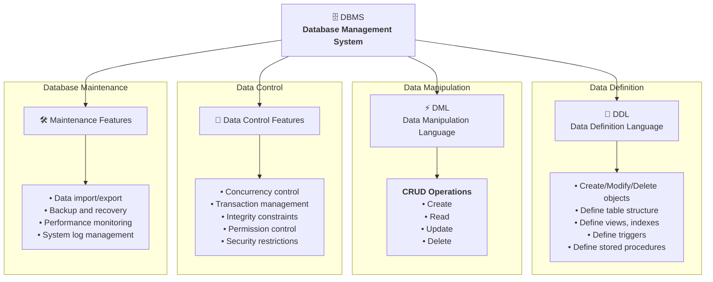
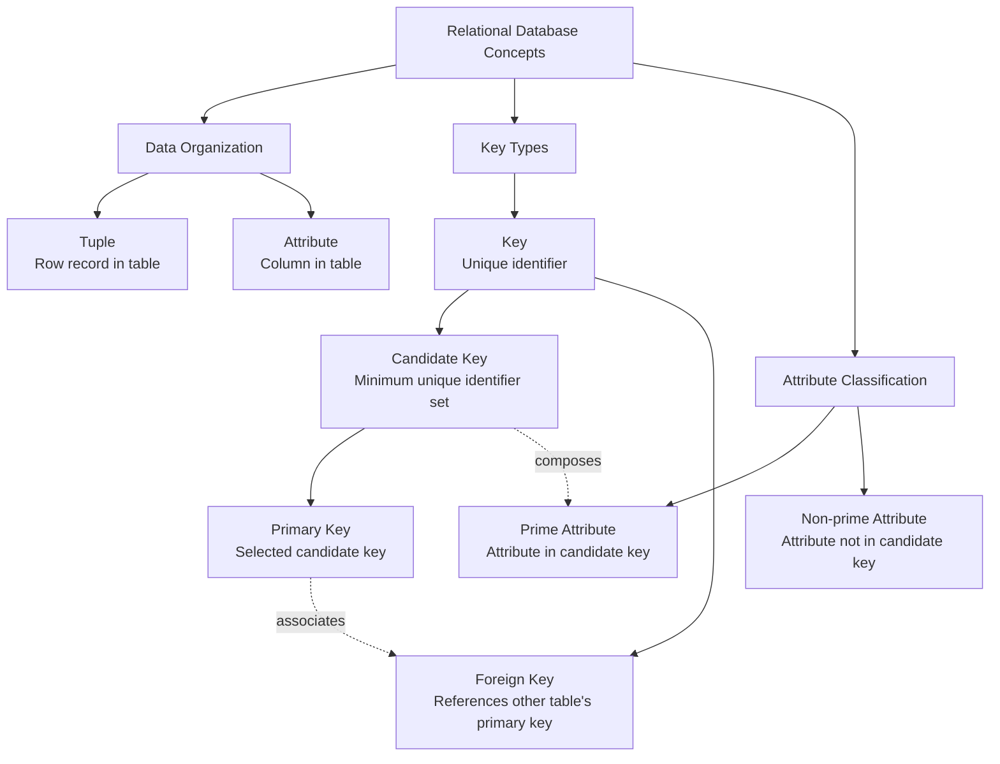
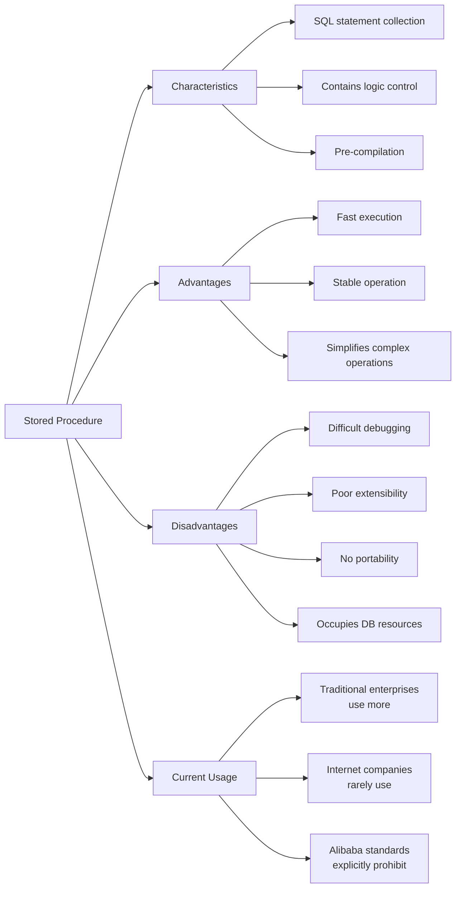
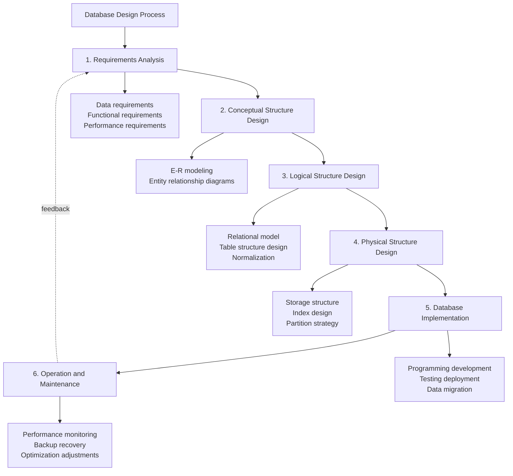

<!-- @include: @small-advertisement.snippet.md -->

Kiến thức cơ bản về database — phần này nhất định phải hiểu và ghi nhớ. Mặc dù phần này chỉ là theoretical knowledge, nhưng rất quan trọng — đây là nền tảng để học MySQL sau này.

## Database, DBMS, Database System, DBA là gì?

Bốn khái niệm này mô tả các tầng khác nhau từ data bản thân đến quản lý toàn bộ hệ thống. Chúng ta có thể dùng ví dụ thư viện để liên kết chúng lại:

- **Database (DB):** Giống như tất cả sách và tài liệu trên các kệ sách trong thư viện. Về mặt kỹ thuật, database là tập hợp dữ liệu có cấu trúc được tổ chức, mô tả và lưu trữ theo một data model nhất định. Đây là core thông tin chúng ta cuối cùng muốn truy cập.
- **Database Management System (DBMS):** Giống như toàn bộ hệ thống quản lý thư viện — quy tắc phân loại sách, quy trình mượn trả, hệ thống kiểm tra an ninh v.v. Về mặt kỹ thuật, DBMS là một large software như MySQL, Oracle, PostgreSQL. Trách nhiệm cốt lõi là tổ chức và lưu trữ dữ liệu một cách khoa học, truy xuất và duy trì dữ liệu hiệu quả. Nó che giấu sự phức tạp của file operations tầng dưới, cung cấp một bộ standard interfaces (như SQL) để thao tác dữ liệu, và xử lý concurrency control, transaction management, permission control v.v.
- **Database System (DBS):** Giống như toàn bộ thư viện đang hoạt động bình thường. Đây là một concept lớn hơn, bao gồm không chỉ DB và DBMS, mà còn cả hardware, applications và người dùng.
- **Database Administrator (DBA):** Giống như giám đốc thư viện, chịu trách nhiệm cho toàn bộ database system hoạt động bình thường. Trách nhiệm rất rộng, bao gồm database design, installation, monitoring, performance tuning, backup and recovery, security management v.v.

DB và DBMS thường bị nhầm lẫn. Đây là điểm cần lưu ý: **Khi chúng ta nói "dùng MySQL database", thực ra là dùng MySQL (DBMS) để quản lý một hoặc nhiều databases (DB).**

## DBMS Có Những Chức Năng Chính Nào?

DBMS thường cung cấp bốn core functions:

1. **Data Definition**: Đây là nền tảng của DBMS. Nó cung cấp Data Definition Language (DDL) để tạo, modify và delete các objects khác nhau trong database. Không chỉ là defining table structure (field names, data types), mà còn includes defining views, indexes, triggers, stored procedures v.v.
2. **Data Manipulation**: Đây là chức năng chúng ta dùng nhiều nhất hàng ngày. Cung cấp Data Manipulation Language (DML), core chính là các thao tác CRUD quen thuộc. Cho phép thao tác và truy xuất dữ liệu trong database một cách thuận tiện.
3. **Data Control**: Đây là chìa khóa đảm bảo dữ liệu đúng đắn, an toàn và đáng tin cậy. Thường bao gồm concurrency control, transaction management, integrity constraints, permission control, security restrictions.
4. **Database Maintenance**: Phần này để đảm bảo database system hoạt động ổn định lâu dài. Bao gồm data import/export, database backup and recovery, performance monitoring and analysis, system log management v.v.

## Bạn Biết Những Loại DBMS Nào?

### Relational Databases

Ngoài relational databases (RDBMS) phổ biến nhất như MySQL (open source first choice), PostgreSQL (most features), Oracle (enterprise-grade) — based on strict table structures và SQL, ideal for structured data và scenarios requiring transaction guarantees like banking transactions, order systems.

Những năm gần đây, để đáp ứng nhu cầu massive data, high concurrency và diverse data structures của internet applications, đã xuất hiện nhiều NoSQL và NewSQL databases.

### NoSQL Databases

Common feature: For extreme performance and horizontal scaling, compromising on some aspects (usually transactions).

**1. Key-value databases, represented by Redis.**

- **Characteristics**: Extremely simple data model — a huge Map accessing Value via Key. In-memory operations, extremely high performance.
- **Applicable scenarios**: Ideal for caching, session storage, counters and other scenarios with extreme read-write performance requirements.

**2. Document databases, represented by MongoDB.**

- **Characteristics**: Stores semi-structured documents (like JSON/BSON), flexible structure, no need to pre-define table structure.
- **Applicable scenarios**: Especially suitable for businesses with changing data structures and rapid iteration, like user profiling, CMS, log storage.

**3. Column-family databases, represented by HBase, Cassandra.**

- **Characteristics**: Data stored by column families rather than rows. Extremely high performance for reading few columns across many rows.
- **Applicable scenarios**: Designed for massive data storage and analysis. Ideal for big data analysis, monitoring data storage, recommendation systems requiring high-throughput writes and range scans.

**4. Graph databases, represented by Neo4j.**

- **Characteristics**: Data model is Nodes and Edges, specially designed for storing and querying complex relationships between entities.
- **Applicable scenarios**: In social networks (friend relationships), recommendation engines (user-product relationships), knowledge graphs, fraud detection (money flow relationships), performance far exceeds relational databases.

### NewSQL Databases

Since NoSQL doesn't support transactions, many systems requiring high data security (like financial systems, order systems, trading systems) are not suitable for it. However, these systems often need to store massive data.

These systems usually can only be improved by buying more powerful computers or using database middleware. But the former costs too much money, the latter costs too much development effort.

So **NewSQL** emerged!

Simply put, NewSQL is: **Distributed storage + SQL + Transactions**. NewSQL has both NoSQL's ability to manage massive data and maintains traditional database features supporting ACID and SQL. Therefore, NewSQL can also be called **Distributed Relational Database**.

Some design goals of NewSQL databases:

1. **Scale Out**: Improve system load capacity by adding machines (vs Scale Up which upgrades hardware).
2. **Strict Consistency**: At any moment, data across all nodes is the same.
3. **High Availability**: System can almost always provide service.
4. **Standard SQL Support**: PostgreSQL, MySQL, Oracle and other relational databases support SQL.
5. **Transactions (ACID)**: Atomicity, Consistency, Isolation, Durability.
6. **Compatible with mainstream relational databases**: Compatible with MySQL, Oracle, PostgreSQL.
7. **Cloud Native**: Deployable toolized and automated in public, private, hybrid clouds.
8. **HTAP (Hybrid Transactional/Analytical Processing)**: Supports mixed OLTP and OLAP processing.

NewSQL database representatives: Google's F1/Spanner, Alibaba's [OceanBase](https://open.oceanbase.com/), PingCAP's [TiDB](https://pingcap.com/zh/product-community/).

## Tuple, Key, Candidate Key, Primary Key, Foreign Key, Prime Attribute, Non-prime Attribute là gì?

In relational database theory, understanding these core concepts is crucial for database design and normalization.

### Basic Concepts

- **Tuple**: Basic unit in relational databases, corresponding to a row record in a 2D table. Each tuple contains complete information for one entity. For example in a student table, each student's complete info (student ID, name, age, etc.) forms one tuple.
- **Key**: One or more attributes that can uniquely identify tuples in a relation. Primary purpose is ensuring data uniqueness and integrity.

### Key Classifications

- **Candidate Key**: Minimum set of attributes that can uniquely identify a tuple. Any proper subset cannot uniquely identify the tuple. A relation may have multiple candidate keys. For example, if "student_id" can uniquely identify students, and "id_card_no" can also uniquely identify students, then both {student_id} and {id_card_no} are candidate keys.
- **Primary Key (主码/主键)**: One candidate key selected to uniquely identify tuples in a relation. Each relation can only have one primary key, but may have multiple candidate keys. Selection considerations: simplicity, stability, no business meaning.
- **Foreign Key (外码/外键)**: An attribute or attribute group in one relation corresponding to the primary key of another relation. Used to establish and maintain associations between two relations, implementing referential integrity. For example, if "student_id" in a course selection table references the primary key "student_id" of the student table, then "student_id" in the course table is a foreign key.

### Attribute Classifications

- **Prime Attribute**: An attribute contained in any candidate key. If a relation has multiple candidate keys, all attributes appearing in these candidate keys are prime attributes. For example, in worker relation (employee_id, id_card_no, name, gender, department), if both {employee_id} and {id_card_no} are candidate keys, then both "employee_id" and "id_card_no" are prime attributes.
- **Non-prime Attribute**: Attributes not contained in any candidate key. In the above worker relation, "name", "gender", "department" are all non-prime attributes.

## What is an ER Diagram?

When doing a project, definitely try to draw ER diagrams to organize database design. Interviewers often ask about this when discussing your projects.

**ER diagram** stands for Entity Relationship Diagram, providing methods to represent entity types, attributes and relationships.

ER diagrams consist of 3 elements:

- **Entity**: Usually real-world business objects (logical objects also okay). For a campus management system, entities include students, teachers, courses, classes, etc. In ER diagrams, entities are represented by rectangles.
- **Attribute**: Properties an entity has, describing the elements that compose the entity. For product design this can be understood as fields. In ER diagrams, attributes are represented by ellipses.
- **Relationship**: The relationship between entities, represented by diamonds in ER diagrams. Not only business associations, but also quantitative relationships like "one class has many students".

The diagram below shows a student course selection ER diagram. Each student can choose multiple courses, and the same course can be chosen by multiple students — many-to-many (M:N) relationship. Also, the other two relationships are 1-to-1 (1:1) and 1-to-many (1:N).

```mermaid
erDiagram
    STUDENT {
        string student_id PK "Student ID"
        string name "Name"
        string gender "Gender"
        date birth_date "Birth Date"
        string department "Department"
    }

    COURSE {
        string course_id PK "Course ID"
        string course_name "Course Name"
        string location "Location"
        string instructor "Instructor"
        float credits "Credits"
    }

    ENROLLMENT {
        string student_id FK "Student ID"
        string course_id FK "Course ID"
        float grade "Grade"
    }

    STUDENT ||--o{ ENROLLMENT : "enrolls in"
    COURSE ||--o{ ENROLLMENT : "has enrollments"
```

## Database Normal Forms (Normalization)

There are 3 database normal forms:

- **1NF (First Normal Form)**: Attributes cannot be further divided.
- **2NF (Second Normal Form)**: On basis of 1NF, eliminates partial functional dependencies of non-prime attributes on the key.
- **3NF (Third Normal Form)**: On basis of 2NF, eliminates transitive functional dependencies of non-prime attributes on the key.

### 1NF

Attributes (corresponding to fields in table) cannot be further divided — a field can only be one value, cannot be split into multiple other fields. **1NF is the most basic requirement of all relational databases** — tables created in relational databases always satisfy 1NF.

### 2NF

2NF on basis of 1NF eliminates partial functional dependencies of non-prime attributes on the key. As shown below, 2NF adds a primary key column to 1NF. Non-prime attributes all depend on the primary key.

Some important concepts:

- **Functional Dependency**: If in a table, when attribute (or attribute group) X's value is determined, Y's value is also necessarily determined, then Y functionally depends on X, written X → Y.
- **Partial Functional Dependency**: If X→Y, and there exists a proper subset X0 of X such that X0→Y, then Y partially functionally depends on X.
- **Full Functional Dependency**: In a relation, if a non-prime data item depends on all keys, it's full functional dependency.
- **Transitive Functional Dependency**: In relation schema R(U), if X determines Y, Y determines Z, and X doesn't contain Y, Y doesn't determine X, then Z transitively functionally depends on X.

### 3NF

3NF on basis of 2NF eliminates transitive functional dependencies of non-prime attributes on the key. Database designs meeting 3NF requirements **basically** solve problems of data redundancy, insertion anomalies, modification anomalies, and deletion anomalies.

## Primary Key vs Foreign Key Differences

From definition and attributes:

- **Primary Key**: Core purpose is uniquely identifying each row of data in a table. Primary key column values must be unique and cannot be null. One table can only have one primary key. Ensures entity integrity.
- **Foreign Key**: Core purpose is establishing and enforcing associative relationships between two tables. A foreign key column in one table must correspond to a candidate key value (usually primary key) in another table, or be NULL. Foreign key values can be duplicate and can be null. One table can have multiple foreign keys. Ensures referential integrity.

Simple e-commerce example: Two tables: `users` and `orders`.

- In `users`, `user_id` column is the **primary key**. Each user's `user_id` is unique.
- In `orders`, `order_id` is its own **primary key**. It also has a `user_id` column — this is a **foreign key** referencing `users` table's `user_id`.

This foreign key constraint ensures:

1. You cannot create an order not belonging to any known user.
2. You cannot delete a user who has placed orders (unless cascade delete is set).

## Why Not Recommend Foreign Keys and Cascades?

Alibaba Java Development Manual says:

> 【Mandatory】Foreign keys and cascades are not allowed. All foreign key concepts must be resolved at the application layer.

Why not use foreign keys? Most people might answer:

1. **Increased complexity**: Every DELETE or UPDATE must consider foreign key constraints, making development painful and test data inconvenient. Foreign key master-slave relationships are fixed — if requirements change and a field no longer needs to relate to other tables, it causes many problems.
2. **Extra work**: Database needs to maintain foreign keys. Any add/delete/update on foreign key fields requires triggering related checks to ensure data consistency and correctness, consuming database resources. Maintaining at application layer reduces database pressure.
3. **Unfriendly to database sharding**: Foreign keys don't work with sharding.
4. ……

But foreign keys also have benefits:

1. Ensures database data consistency and integrity.
2. Cascade operations are convenient, reducing application code.
3. ……

So don't blindly abandon foreign key concept. If system doesn't involve sharding and concurrency isn't very high, foreign keys can still be considered.

## What Are Stored Procedures?

Stored procedures are pre-compiled SQL statement collections in databases. They encapsulate multiple SQL statements and program logic control statements (like IF-ELSE, WHILE loops) together, forming a reusable database object.

**Advantages of stored procedures:**

In traditional enterprise applications, stored procedures have some practical value. When business logic is complex and requires many SQL statements for one operation, encapsulating them into stored procedures simplifies the calling process. Since stored procedures are compiled and stored in the database when created, no recompilation is needed at execution time, providing better performance than dynamic SQL. Once debugged, operations are relatively stable and reliable.

**Limitations of stored procedures:**

In modern internet architectures, stored procedures are used less and less. Main reasons: difficult to debug, lacking mature debugging tools; poor extensibility, business logic changes require modifying database objects; poor portability, different databases have different stored procedure syntax; occupies database resources, increasing database server load; version management difficulties.

**Industry standards:**

For these reasons, many internet company development standards explicitly restrict or prohibit stored procedures. For example, Alibaba Java Development Manual explicitly prohibits stored procedures, recommending business logic be placed at the application layer.

## DROP vs DELETE vs TRUNCATE Differences

**DROP command:**

- Syntax: `DROP TABLE table_name`
- Function: Completely deletes the entire table including table structure, data, indexes, triggers, constraints and all related objects
- Use case: When table is no longer needed

**TRUNCATE command:**

- Syntax: `TRUNCATE TABLE table_name`
- Function: Clears all data in table but keeps table structure
- Characteristic: Auto-increment fields (AUTO_INCREMENT) reset to initial value (usually 1)
- Use case: When need to quickly clear table data but keep structure

**DELETE command:**

- Syntax: `DELETE FROM table_name WHERE condition`
- Function: Deletes rows meeting the condition; without WHERE deletes all data
- Characteristic: Auto-increment fields don't reset, continue incrementing
- Use case: When need to selectively delete some data

`TRUNCATE`, `DELETE` without WHERE, and `DROP` all delete table data. But **`TRUNCATE` and `DELETE` only delete data, not table structure. Executing `DROP` also deletes the table structure — the table no longer exists.**

### Effect on Table Structure

- `DROP`: Deletes table structure and all data; table ceases to exist
- `TRUNCATE`: Only deletes data, preserves table structure and definition
- `DELETE`: Only deletes data, preserves table structure and definition

### Triggers

- `DELETE` triggers related DELETE triggers
- `TRUNCATE` and `DROP` don't trigger DELETE triggers

### Transactions and Rollback

- `DROP` and `TRUNCATE` are DDL operations, take effect immediately, cannot be rolled back
- `DELETE` is DML operation, can be rolled back (in transactions)

### Execution Speed

Generally: `DROP` > `TRUNCATE` > `DELETE` (I haven't actually tested this).

- `DELETE` generates database binlog logs, logging consumes time but enables data rollback recovery.
- `TRUNCATE` doesn't generate database logs, so faster than `DELETE`. Also resets auto-increment values and restores indexes to initial size.
- `DROP` releases all space occupied by the table.

Tips: You should focus more on use cases rather than execution efficiency.

## DML vs DDL Differences

- **DML** (Data Manipulation Language) refers to operations on table records in databases, mainly including insert, update, delete and query — most frequently used by developers.
- **DDL** (Data Definition Language) refers to operations for creating, deleting, modifying objects inside databases. The biggest difference from DML is that DML only operates on data inside tables, not table definitions or structure changes, and doesn't involve other objects. DDL is mostly used by DBAs; general developers rarely use it.

Additionally, since `SELECT` doesn't destroy tables, some places distinguish it as Data Query Language (DQL).

## What Are the Steps of Database Design?

### 1. Requirements Analysis

**Goal**: Deeply understand and analyze user requirements, clarify system boundaries

**Main work**: Collect and analyze data requirements; determine data volume and update frequency; clarify functional requirements; define performance requirements; determine security requirements.

**Outputs**: Requirements specification document, initial data dictionary

### 2. Conceptual Structure Design

**Goal**: Convert requirements into information-world conceptual model

**Main work**: Identify entities; define attributes; establish relationships; draw E-R diagrams.

**Outputs**: E-R diagrams, conceptual data model documentation

### 3. Logical Structure Design

**Goal**: Convert conceptual model to logical model supported by specific DBMS

**Main work**: Convert E-R diagrams to relational model; normalization processing; define integrity constraints; optimize model.

**Outputs**: Logical data model, table structure design documentation

### 4. Physical Structure Design

**Goal**: Determine physical storage plan and access methods for data

**Main work**: Choose storage engine; design index strategy; partition design; determine storage parameters; formulate backup strategy.

**Outputs**: Physical design documentation, index design plan

### 5. Database Implementation

**Goal**: Convert design into actual running database system

**Main work**: Create database and table structure; develop stored procedures and triggers (if needed); write application interfaces; import initial data; system integration testing; user training and documentation.

**Outputs**: Database scripts, test reports, user manuals

### 6. Operation and Maintenance

**Goal**: Ensure stable and efficient operation of database system

**Main work**: Daily monitoring; performance optimization; data backup and recovery; security management; capacity planning; change management.

**Outputs**: Operations reports, optimization plans, change records

### Design Principles

Throughout the design process, follow: data independence principle, integrity principle, security principle, scalability principle, and standardization principle.

## References

- <https://blog.csdn.net/rl529014/article/details/48391465>
- <https://www.zhihu.com/question/24696366/answer/29189700>
- <https://blog.csdn.net/bieleyang/article/details/77149954>

<!-- @include: @article-footer.snippet.md -->
