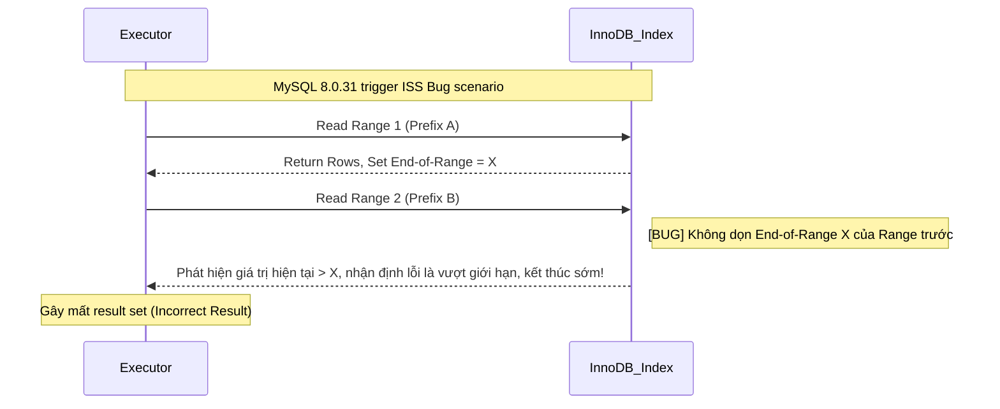

Trong tối ưu hiệu năng database, index là một trong những biện pháp tối ưu trực tiếp và hiệu quả nhất. Tuy nhiên, **có index không có nghĩa là nhất định dùng được index**. Trong phát triển thực tế, chúng ta thường gặp tình huống: rõ ràng đã tạo index trên field, nhưng query vẫn chậm như sên. Phân tích bằng `EXPLAIN` thì phát hiện đang full table scan.

Nguyên nhân dẫn đến index invalidation rất đa dạng — có cả vấn đề cách viết SQL lẫn thiết kế index không phù hợp. Một số tình huống invalidation là rõ ràng (như vi phạm leftmost prefix principle), một số lại rất ẩn (như implicit type conversion). Nếu không nắm rõ các tình huống này, rất dễ tạo ra performance bottleneck tiềm ẩn trên production.

Bài này sẽ hệ thống hóa các tình huống index invalidation phổ biến trong MySQL, phân tích cơ chế nguyên lý đằng sau, cung cấp gợi ý tối ưu tương ứng — giúp bạn nhanh chóng xác định và giải quyết vấn đề index invalidation trong phát triển và troubleshoot hàng ngày.

### SELECT \* Query (Trade-off chi phí)

- **Định nghĩa cốt lõi**: Bản thân `SELECT *` **không trực tiếp gây index invalidation**. Đây là kiểu query "non-covering index". Nếu điều kiện `WHERE` match index, index vẫn được xem xét ban đầu.
- **Quyết định dựa trên chi phí table lookup**: Khi query cần field không có trong index tree, MySQL phải lấy primary key để tra clustered index lấy toàn bộ hàng (table lookup). Optimizer so sánh chi phí "index scan + table lookup" với "trực tiếp full table scan". Nếu tỷ lệ kết quả query trên tổng data tương đối cao (thường ngưỡng 20%~30%), optimizer cho rằng sequential IO của full table scan hiệu quả hơn random IO của table lookup, dẫn đến **chủ động bỏ index**.
- **Trade-off tình huống**:
  - **Covering index scenario**: Nếu query chỉ cần field được covering index bao phủ, dùng covering index tránh được table lookup, hiệu năng tốt nhất.
  - **Khi table lookup không tránh được**: Nếu nghiệp vụ thực sự cần nhiều non-index field, `SELECT field_cần_thiết` là đủ. Khi cần hầu hết field, readability code có thể quan trọng hơn micro-optimization "tiết kiệm vài field", lúc đó dùng `SELECT *` cũng không sao.
- **Khuyến nghị**: Ưu tiên `SELECT field_cần_thiết`, đạt covering index là tốt nhất. Nếu cần nhiều field và table lookup không tránh được, không nhất thiết phải "tiết kiệm field" một cách giáo điều.

### Vi phạm Leftmost Prefix Principle

- **Định nghĩa cốt lõi**: Leftmost prefix matching principle nghĩa là khi dùng composite index, MySQL match các field trong query condition theo thứ tự field trong index từ trái sang phải. Nếu query condition match field ngoài cùng bên trái của index, MySQL dùng index để filter data.
- **Hiệu ứng gián đoạn của range query**: Trong composite index, nếu một field dùng range query (như >, <, BETWEEN, `LIKE "abc%"`), field đó và các column trước nó có thể match bình thường và dùng cho việc định vị chính xác trong index. Nhưng các column sau field đó không thể dùng index để định vị nhanh (không thể dùng binary search kiểu ref). Vì trong cấu trúc B+Tree index, chỉ khi leading column hoàn toàn bằng nhau thì các column tiếp theo mới có thứ tự. Một khi leading column trở thành range, các column tiếp theo trong toàn bộ scan interval sẽ ở trạng thái tương đối không có thứ tự, dẫn đến mất khả năng định vị chính xác. Tuy nhiên, trong MySQL 5.6 trở đi, các column tiếp theo này không hoàn toàn vô hiệu mà bị giáng cấp xuống dùng **Index Condition Pushdown (ICP)** — trực tiếp filter điều kiện trong quá trình range scan để giảm số lần table lookup.
- **Index Skip Scan (ISS)**: MySQL 8.0.13 giới thiệu **Index Skip Scan (ISS)**, cho phép khi thiếu leftmost prefix, enumerate tất cả Distinct value của leading column để scan index tree tiếp theo theo dạng nhảy bước.
  - **Bug cần tránh**: Trong **MySQL 8.0.31**, ISS có Bug nghiêm trọng ([[Bug #109145]](https://bugs.mysql.com/bug.php?id=109145)) — khi đọc cross Range không dọn dẹp giá trị boundary cũ, có thể khiến query **mất data trực tiếp**.
  - **Khuyến nghị**: ISS hoạt động tốt nhất khi leading column có cardinality cực thấp (như giới tính, status enum). Trong production, **tuyệt đối không dựa vào ISS để bù đắp cho thiết kế index kém**. Phải điều chỉnh thứ tự composite index hoặc bổ sung điều kiện leading column để đáp ứng leftmost prefix.

**Sơ đồ failure path của Index Skip Scan:**



Ví dụ invalidation:

```sql
-- Index: (sname, s_code, address)
SELECT * FROM students WHERE s_code = 1;                  -- Bỏ qua leading column sname, index invalidation
SELECT * FROM students WHERE sname = 'A' AND address = 'Shanghai'; -- Bỏ qua middle column, chỉ sname dùng index (ICP có thể optimize filter)
SELECT * FROM students WHERE sname = 'A' AND s_code > 1 AND address = 'Shanghai'; -- Sau range query, address không dùng được cho định vị, chỉ dùng để filter
```

### Tính toán, Function hoặc Type Conversion trên Index Column

- **Định nghĩa cốt lõi**: B+Tree index lưu **giá trị gốc** của field. Một khi áp dụng function (như `ABS()`, `DATE()`) hay arithmetic operation cho index column trong điều kiện `WHERE`, giá trị của column đó đã thay đổi về mặt logic.
- **Hiệu ứng phá vỡ tính có thứ tự**: Vì B+Tree được sắp xếp dựa trên giá trị gốc, kết quả sau khi xử lý qua function là **không có thứ tự** trong index tree. Database không thể dùng binary search để định vị nhanh, phải bị buộc thực hiện full table scan.
- **Functional Index**: MySQL 8.0 hỗ trợ **Functional Index** — có thể tạo index cho giá trị sau tính toán, nhưng tình huống sử dụng hạn chế. Ưu tiên vẫn là optimize cách viết SQL.

Ví dụ invalidation:

```sql
SELECT * FROM students WHERE height + 1 = 170;            -- Tính toán trên index column
SELECT * FROM students WHERE DATE(create_time) = '2022-01-01'; -- Dùng function trên index column
```

Gợi ý tối ưu:

```sql
SELECT * FROM students WHERE height = 169;                -- Chuyển việc tính toán sang vế phải
SELECT * FROM students WHERE create_time BETWEEN '2022-01-01 00:00:00' AND '2022-01-01 23:59:59';
```

### LIKE Fuzzy Query bắt đầu bằng Wildcard

- **Định nghĩa cốt lõi**: Query `LIKE` phải bắt đầu bằng ký tự cụ thể mới có thể dùng tính có thứ tự của index, ví dụ `WHERE sname LIKE 'Guide%';`. Vì B+ tree được sắp xếp từ trái sang phải. Wildcard đầu (`%`) phá vỡ tính có thứ tự, không thể xác định điểm bắt đầu.
- **Cơ chế invalidation của prefix wildcard**: Nếu bắt đầu bằng `%` (như `'%abc'`), vì index được sắp xếp theo ký tự từ trái sang phải, prefix không xác định có nghĩa là có thể xuất hiện ở bất kỳ vị trí nào trong index tree, dẫn đến không thể xác định điểm bắt đầu của scan interval.
- **Khuyến nghị**:
  - Nếu bắt buộc phải fuzzy query hoàn toàn, hãy chỉ query các column được covering index bao phủ. Lúc đó `EXPLAIN` sẽ hiển thị `type: index` (Index Full Scan) — dù scan toàn bộ cây nhưng không cần table lookup, vẫn tốt hơn `ALL`.
  - Fuzzy search quy mô lớn cho business cốt lõi nên triển khai qua **Elasticsearch** hoặc search engine khác.

Ví dụ invalidation:

```sql
SELECT * FROM students WHERE sname LIKE '%Guide';          -- Prefix fuzzy, full table scan
SELECT * FROM students WHERE sname LIKE '%Guide%';         -- Both-side fuzzy, full table scan
```

### OR Connection và Index Merge

- **Định nghĩa cốt lõi**: Trong nhiều điều kiện kết nối bằng `OR`, chỉ cần **bất kỳ column nào không có index**, MySQL sẽ bỏ tất cả index và thực hiện full table scan.
- **Cơ chế Index Merge**: Nếu cả hai bên `OR` đều có index, MySQL 5.1+ có thể trigger tối ưu **Index Merge** — scan hai index riêng biệt rồi lấy union. Tuy nhiên nếu data volume sau khi filter qua cả hai index đều lớn, chi phí merge result set có thể cao hơn full table scan, vẫn bỏ index.
- **Khuyến nghị**:
  - Ưu tiên rewrite `OR` thành `UNION ALL`. `UNION ALL` cho phép mỗi phần query độc lập dùng index, và tránh được vấn đề optimizer ước tính chi phí `OR` không chính xác.
  - Lưu ý: Chỉ dùng `UNION ALL` khi chắc chắn result set không trùng lặp, ngược lại dùng `UNION` (liên quan đến deduplication bằng temporary table, có overhead thêm).

Ví dụ invalidation:

```sql
-- Giả sử cả sname và address đều có index, nhưng mỗi cái match 30%+ data
SELECT * FROM students WHERE sname = 'Student 1' OR address = 'Shanghai'; -- Có thể bỏ index, full table scan

-- Khuyến nghị rewrite thành
SELECT * FROM students WHERE sname = 'Student 1'
UNION ALL
SELECT * FROM students WHERE address = 'Shanghai'; -- Mỗi cái dùng index riêng
```

**Cách verify**: Trong `EXPLAIN` nếu xuất hiện `type: index_merge` và `Extra: Using union; Using where`, nghĩa là đang dùng Index Merge.

### IN / NOT IN dùng không đúng

**Độ dài list của `IN`**:

- `eq_range_index_dive_limit` (mặc định **200**) không trực tiếp gây index invalidation mà ảnh hưởng đến **chiến lược ước tính số row**:
  - **<= 200**: MySQL dùng **Index Dive** (đào sâu vào index tree để dò) để ước tính chính xác số row — ước tính chi phí chính xác, index nhiều khả năng hữu hiệu.
  - **> 200**: Khi độ dài list `IN` vượt quá `eq_range_index_dive_limit` (MySQL 5.7.4+ mặc định là 200), optimizer chuyển từ Index Dive chính xác sang ước tính dựa trên `index_statistics`. Nếu thống kê cardinality của bảng đã cũ, có thể gây ước tính chi phí bất thường, từ đó bỏ Range Scan mà chọn full table scan.
- Có thể khắc phục bằng cách tăng `eq_range_index_dive_limit` hoặc rewrite thành `JOIN` temporary table.

**`NOT IN`**:

- **Constant list** (như `NOT IN (1,2,3)`): Thường full table scan vì cần duyệt toàn bộ B+ tree để chứng minh "không có trong tập hợp".
- **Subquery associated index column**: `WHERE id NOT IN (SELECT user_id FROM orders WHERE user_id > 1000)` có thể dùng index `user_id` của bảng `orders`.
- **Thay thế khuyến nghị**: Ưu tiên dùng `NOT EXISTS` hoặc `LEFT JOIN / IS NULL` — hiệu năng tốt hơn và ngữ nghĩa rõ hơn.

Ví dụ invalidation:

```sql
SELECT * FROM students WHERE s_code IN (1, 2, 3, ..., 500); -- List quá dài, có thể chuyển sang statistical estimation gây nhận định sai
SELECT * FROM students WHERE s_code NOT IN (1, 2, 3);     -- Constant list, full table scan
```

### Implicit Type Conversion

Đây là pitfall ẩn nhất trong phát triển — **chiều convert quyết định sống còn của index**.

| Tình huống                        | Ví dụ               | Chiều conversion                               | Index có hiệu lực không |
| --------------------------------- | ------------------- | ---------------------------------------------- | ----------------------- |
| **String column + numeric value** | `varchar_col = 123` | String convert sang number (trên index column) | ❌ Invalidation         |
| **Numeric column + string value** | `int_col = '123'`   | String convert sang number (trên constant)     | ✅ Hiệu lực             |

**Điểm quan trọng**:

- Chỉ khi **conversion xảy ra trên index column** thì index mới invalidation.
- Khi string so sánh với number, MySQL mặc định convert string thành **float (DOUBLE)** để so sánh (xem [MySQL official docs rule 7](https://dev.mysql.com/doc/refman/8.0/en/type-conversion.html)). Implicit type conversion trên index column tương đương áp dụng conversion function không thể đảo ngược lên index column, phá vỡ tính có thứ tự của B+ tree, dẫn đến chỉ có thể full table scan.
- `int_col = '123'` sẽ được chuyển thành `int_col = CAST('123' AS DOUBLE)` — conversion xảy ra ở phía constant, không ảnh hưởng đến việc dùng index.

**Đọc thêm**: [MySQL Implicit Conversion gây Index Invalidation](https://javaguide.cn/database/mysql/index-invalidation-caused-by-implicit-conversion.html)

### Pitfall tối ưu ORDER BY Sorting

Dù điều kiện `WHERE` chính xác, nếu xử lý `ORDER BY` không tốt vẫn có thể xảy ra slow query.

**Điều kiện trigger `Using filesort`**:

- Field sort không có trong index
- Thứ tự index không nhất quán với `ORDER BY` (như index `(a,b)` nhưng `ORDER BY b,a`)
- `WHERE` và `ORDER BY` dùng index khác nhau
- Sort column chứa non-index column trong `SELECT *` (cần table lookup sort)

**Phương án tối ưu**:

- Dùng **covering index** để đồng thời thỏa mãn `WHERE` và `ORDER BY`. Ví dụ index `(name, age)`, query `SELECT name, age FROM users WHERE name = 'A' ORDER BY age`.
- Điều chỉnh thứ tự index để match `ORDER BY`.

**Cách verify**: `Using filesort` xuất hiện trong cột `Extra` của `EXPLAIN` nghĩa là đã trigger sorting.

### Tổng kết

Bài này hệ thống hóa các tình huống index invalidation phổ biến trong MySQL. Từ cơ chế tầng dưới, có thể quy thành hai loại cốt lõi:

**1. SQL viết xung đột với logic tầng dưới (phá vỡ tính có thứ tự của B+Tree)**

Loại vấn đề này phổ biến nhất. Bản chất là điều kiện query khiến B+Tree tầng dưới mất khả năng định vị nhanh bằng "binary search".

- **Vi phạm leftmost prefix principle**: Bỏ qua leading column của composite index, hoặc gặp range query (`>`, `<`, `BETWEEN`, `LIKE "abc%"`) dẫn đến các column sau gián đoạn định vị chính xác, giáng cấp xuống range scan + filter.
- **Xử lý index column**: Tính toán toán học hay áp dụng function cho index column ở vế trái `WHERE`, làm dữ liệu gốc thay đổi về mặt logic, ở trạng thái không có thứ tự trong index tree.
- **Implicit type conversion (ẩn và nguy hiểm)**: Khi "column kiểu string" so sánh với "giá trị kiểu number", MySQL mặc định áp dụng conversion function lên column, trực tiếp phá vỡ tính có thứ tự của cây.
- **LIKE fuzzy query prefix wildcard**: Như `LIKE "%abc"` — tính không xác định của prefix ký tự khiến optimizer không thể lock điểm bắt đầu của scan interval.
- **ORDER BY sorting pitfall**: Sort column không match index, chiều sort không nhất quán với cấu trúc index, v.v. trigger extra memory hoặc disk sorting (`Using filesort`).

**2. Quyết định chi phí của Optimizer (trade-off dựa trên I/O cost)**

Loại vấn đề này không phải bản thân index không dùng được, mà là MySQL optimizer sau khi tính toán cho rằng "không dùng index thường" thì overhead tổng thể nhỏ hơn. **Cần đặc biệt lưu ý: Optimizer chọn full table scan hay table lookup thường là quyết định cost đúng đắn, không phải "vấn đề hiệu năng"**.

- **Table lookup là hiện tượng bình thường**: Khi query cần field không được covering index bao phủ, table lookup là thao tác bình thường không thể tránh. Index filter + table lookup lấy business field là query pattern tiêu chuẩn, không phải biểu hiện "hiệu năng kém". Chỉ khi số lần table lookup quá nhiều (như data hit vượt 20%~30%) và có phương án full table scan tốt hơn mới cần quan tâm.
- **Full table scan có thể là lựa chọn tối ưu**: Optimizer chọn full table scan thường là quyết định hợp lý dựa trên tính toán chi phí. Khi index selectivity thấp (data hit lớn), sequential IO của full table scan thường hiệu quả hơn random IO của index table lookup. Đây không phải index "invalidation", mà là optimizer chọn execution path tốt hơn.
- **Trade-off tình huống `SELECT *`**: Ưu tiên `SELECT field_cần_thiết`, đạt covering index là tốt nhất. Nếu cần nhiều non-index field và table lookup không tránh được, không nhất thiết phải "tiết kiệm field" theo kiểu giáo điều.
- **Điều kiện `OR` gây full table scan**: Chỉ cần bất kỳ bên nào của `OR` không có index tương ứng là sẽ trigger full table scan. Dù cả hai bên đều có index, nếu chi phí dự kiến của Index Merge quá cao vẫn sẽ bị bỏ.
- **`IN` list quá dài gây ước tính sai**: Khi độ dài `IN` list vượt quá ngưỡng hệ thống (mặc định 200), optimizer chuyển từ Index Dive chính xác sang statistical estimation thô, rất dễ ước tính chi phí thực thi sai do thông tin thống kê cũ.

**Khuyến nghị thực chiến**:

1. **Hình thành thói quen phân tích `EXPLAIN`**: Sau khi viết SQL phức tạp, nhất thiết dùng `EXPLAIN` để phân tích execution plan, chú trọng đến field `type`, `key`, `rows`, `Extra`. **Lưu ý**: `type: ALL` không nhất thiết là vấn đề, có thể là quyết định đúng đắn của optimizer.
2. **Chọn query strategy theo tình huống**:
   - Nếu field query được covering index bao phủ, ưu tiên dùng covering index tránh table lookup.
   - Nếu bắt buộc phải lấy nhiều non-index field, tránh tách thành nhiều lần query chỉ để "tiết kiệm field" — giảm network round trip.
3. **Chuẩn hóa sử dụng data type**: Giữ điều kiện query nhất quán với kiểu field, tránh implicit type conversion.
4. **Thiết kế composite index hợp lý**: Sắp xếp thứ tự field theo tần suất query và selectivity, ưu tiên đáp ứng tình huống query tần suất cao.
5. **Fuzzy search quy mô lớn cân nhắc ES**: Với fuzzy query cả hai đầu (`%keyword%`), khuyến nghị dùng Elasticsearch và các search engine khác.

Index optimization là kỹ năng cơ bản của database performance optimization, nhưng cũng cần cân nhắc dựa trên tình huống nghiệp vụ thực tế và phân bố dữ liệu. Hiểu rõ nguyên nhân cốt lõi của index invalidation mới có thể nhanh chóng xác định và giải quyết khi gặp vấn đề hiệu năng.

**Đọc thêm**:

- [Giải thích chi tiết MySQL Index](https://javaguide.cn/database/mysql/mysql-index.html)
- [Phân tích MySQL Execution Plan](https://javaguide.cn/database/mysql/mysql-query-execution-plan.html)
- [MySQL Implicit Conversion gây Index Invalidation](https://javaguide.cn/database/mysql/index-invalidation-caused-by-implicit-conversion.html)
