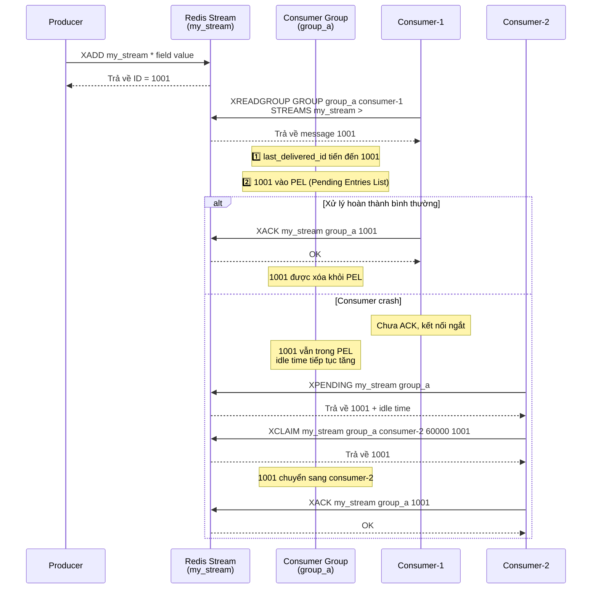

Nói kết luận trước: **Có thể, nhưng tùy tình huống cụ thể. So với các MQ chuyên nghiệp (như Kafka, RabbitMQ) vẫn còn một số điểm thiếu sót.**

Trước khi bắt đầu chính thức, hãy xem: **Một production-grade MQ cần có những khả năng cốt lõi nào?**

| Chiều năng lực               | Định nghĩa                                                 | Chỉ số/Đặc điểm chính                                    |
| :--------------------------- | :--------------------------------------------------------- | :------------------------------------------------------- |
| **Persistence**              | Message không bị mất sau khi ghi dù process/node bị lỗi    | Sync flush/multi-replica confirm, RPO ≈ 0                |
| **At-least-once delivery**   | Message cuối cùng được consume, cho phép trùng lặp         | Cần kết hợp với consumer idempotency                     |
| **Consume confirmation**     | Consumer thông báo tường minh xử lý thành công             | ACK mechanism, timeout retry, dead-letter queue          |
| **Message retry**            | Consume fail có thể tự động redeliver                      | Backoff strategy, max retry count, dead-letter transfer  |
| **Consumer Group**           | Nhiều consumer hợp tác consume, tự động failover           | In-group load balancing, partition assignment, Rebalance |
| **Message backlog capacity** | Buffer capacity khi production rate > consumption rate     | Disk storage, TTL, backlog alert                         |
| **Order guarantee**          | Message được consume theo thứ tự gửi                       | Partition ordered/global ordered, penalty for disorder   |
| **Scalability**              | Horizontal scale để tăng throughput hoặc disaster recovery | Sharding mechanism, stateless Broker, dynamic scale      |

Redis cung cấp nhiều cách triển khai MQ, từ `List` ban đầu đến `Pub/Sub`, rồi đến cấu trúc dữ liệu `Stream` mới được thêm trong Redis 5.0 (dựa trên ordered linked list, hỗ trợ consumer group và ACK mechanism, dùng để xây dựng lightweight message queue).

### Giai đoạn 1: Dùng cấu trúc dữ liệu List ban đầu

**Trước Redis 2.0, nếu muốn dùng Redis làm message queue, chỉ có thể triển khai qua List.**

Dùng `RPUSH/LPOP` hoặc `LPUSH/RPOP` có thể triển khai message queue phiên bản đơn giản:

```bash
# Producer sản xuất message
> RPUSH myList msg1 msg2
(integer) 2
> RPUSH myList msg3
(integer) 3
# Consumer consume message
> LPOP myList
"msg1"
```

Tuy nhiên dùng `RPUSH/LPOP` hay `LPUSH/RPOP` như vậy có vấn đề hiệu năng — phải liên tục polling gọi `RPOP` hay `LPOP` để consume message. Khi List rỗng, phần lớn polling request đều là request không hiệu quả, lãng phí nhiều tài nguyên hệ thống.

Do đó Redis còn cung cấp lệnh blocking read như `BLPOP`, `BRPOP` (những lệnh có B — Blocking đều là blocking) và hỗ trợ tham số timeout. Nếu List rỗng, Redis server không trả kết quả ngay mà chờ có data mới trong List mới trả về, hoặc chờ tối đa thời gian timeout rồi trả về null. Nếu đặt timeout là 0 thì chờ vô thời hạn cho đến khi pop được message.

```bash
# Timeout 10s
# Nếu có data trả về ngay, ngược lại chờ tối đa 10 giây
> BRPOP myList 10
null
```

List triển khai message queue quá đơn giản — các tính năng như message confirmation mechanism phải tự triển khai. **Chết người nhất là: Không hỗ trợ một message được nhiều consumer consume (broadcast). Và message một khi được lấy ra là mất, nếu consumer xử lý thất bại thì message mất vĩnh viễn.**

### Giai đoạn 2: Giới thiệu Pub/Sub (Publish/Subscribe) mode

**Redis 2.0 giới thiệu tính năng Pub/Sub, giải quyết vấn đề List triển khai message queue không có broadcast mechanism.**


Pub/Sub giới thiệu khái niệm **Channel (Kênh)** — cơ chế publish/subscribe được triển khai dựa trên Channel này.

Pub/Sub liên quan đến hai vai trò: Publisher và Subscriber (cũng gọi là consumer):

- Publisher gửi message vào Channel chỉ định qua `PUBLISH`.
- Subscriber đăng ký Channel mình quan tâm qua `SUBSCRIBE`. Subscriber có thể đăng ký một hoặc nhiều Channel.

Tức là nhiều consumer có thể đăng ký cùng một Channel. Producer publish message vào Channel đó, tất cả subscriber đều nhận được.

Khởi động 3 Redis client để demo đơn giản:


Pub/Sub hỗ trợ cả unicast lẫn broadcast, còn hỗ trợ simple regex matching cho Channel.

Pub/Sub có một nhược điểm chết người: **Fire-and-forget — không có bất kỳ persistence hay reliability guarantee nào**. Nếu khi publish message có consumer nào đó offline, hoặc network bị ngắt một cái, message đó với consumer đó là mất vĩnh viễn. Ngoài ra còn **không có ACK mechanism** — không thể biết consumer có xử lý thành công hay không, chưa nói đến **message backlog**. Do đó Pub/Sub chỉ phù hợp với các real-time notification yêu cầu reliability cực thấp — tuyệt đối không dùng cho bất kỳ business message queue nghiêm túc nào.

### Giai đoạn 3: Redis 5.0 thêm mới Stream

Redis 5.0 bổ sung cấu trúc dữ liệu `Stream`. Đây là ordered message log được triển khai dựa trên Radix Tree, hỗ trợ consumer group và ACK mechanism tự nhiên, có thể dùng để xây dựng lightweight message queue.

**Tại sao dùng Radix Tree?** Nhiều người thắc mắc tại sao không tiếp tục dùng `List/LinkedList`?

1. **Memory compression cực độ**: Message ID của `Stream` (như `1625000000000-0`) có thứ tự cao và prefix overlap rất nhiều. Radix Tree là compressed prefix tree — merge các node có cùng prefix. Còn `List/LinkedList` mỗi element phải có linked list node overhead đầy đủ và không thể tận dụng tính lặp lại prefix của ID để tiết kiệm space.
2. **Retrieval hiệu quả**: Khi xử lý backlog hàng triệu message, Radix Tree duy trì query efficiency rất cao — đây cũng là nền tảng để `Stream` hỗ trợ range query data lớn (`XRANGE`). Ngược lại `List/LinkedList` chỉ có thể thao tác từ hai đầu, không thể query hiệu quả theo ID range, thực thi `XRANGE` cần duyệt toàn bộ list.

Stream học hỏi các concept cốt lõi của professional MQ như Kafka:

1. **Consumer Groups**: Triển khai load balancing message giữa nhiều consumer, hỗ trợ automatic failover.
2. **Persistence**: Có thể đảm bảo message không bị mất khi Redis restart qua RDB và AOF (phụ thuộc vào cấu hình `appendfsync`, mode `everysec` thường mất tối đa 1 giây data).
3. **ACK mechanism**: Sau khi consumer xử lý xong message, cần `XACK` thủ công để xác nhận. Nếu không message sẽ được giữ lại trong `Pending List`. Điều này đảm bảo message được consume thành công ít nhất một lần.
4. **Message replay và transfer**: Hỗ trợ `XRANGE` replay message theo time range và `XCLAIM` chuyển message đang pending sang consumer khác xử lý.

> 🌈 Lịch sử phiên bản:
>
> - Redis 8.2: `XACKDEL`, `XDELEX`, `XADD` và `XTRIM` cung cấp fine-grained control về cách stream operation tương tác với nhiều consumer group, đơn giản hóa coordination xử lý message giữa các ứng dụng khác nhau.
> - Redis 8.6: Hỗ trợ idempotent message processing (at-most-once production), ngăn duplicate entry khi dùng at-least-once delivery mode. Tính năng này cho phép reliable message commit và tự động deduplication.

Cấu trúc của `Stream` như dưới:


Đây là ordered message linked list. Mỗi message có unique ID và nội dung tương ứng. ID là kết hợp timestamp và sequence number để đảm bảo tính duy nhất và tăng dần của message. Nội dung là một hoặc nhiều cặp key-value (tương tự kiểu dữ liệu cơ bản Hash), dùng để lưu dữ liệu message.

Giải thích ngắn gọn các khái niệm trong hình:

- `Consumer Group`: Consumer group dùng để tổ chức và quản lý nhiều consumer. Consumer group bản thân không xử lý message mà phân phối message cho consumer, để consumer thực sự consume.
- `last_delivered_id`: Con trỏ xác định vị trí consume hiện tại của consumer group. Bất kỳ consumer nào trong group đọc message đều làm `last_delivered_id` tiến về phía trước.
- `pending_ids`: Ghi lại ID của các message đã được client consume nhưng chưa ACK.

Dưới đây là các lệnh phổ biến khi dùng `Stream` làm message queue:

- `XADD`: Thêm message mới vào stream.
- `XREAD`: Đọc message từ stream.
- `XREADGROUP`: Đọc message từ consumer group.
- `XRANGE`: Đọc message từ stream theo phạm vi message ID.
- `XREVRANGE`: Tương tự `XRANGE` nhưng trả kết quả theo thứ tự ngược.
- `XDEL`: Xóa message khỏi stream.
- `XTRIM`: Trim độ dài stream, có thể chỉ định trim strategy (`MAXLEN`/`MINID`).
- `XLEN`: Lấy độ dài stream.
- `XGROUP CREATE`: Tạo consumer group.
- `XGROUP DESTROY`: Xóa consumer group.
- `XGROUP DELCONSUMER`: Xóa một consumer khỏi consumer group.
- `XGROUP SETID`: Đặt last delivered message ID mới cho consumer group.
- `XACK`: Xác nhận message đã được xử lý trong consumer group.
- `XPENDING`: Query các message đang pending (chưa được xác nhận) trong consumer group.
- `XCLAIM`: Chuyển message đang pending từ một consumer sang consumer khác.
- `XINFO`: Lấy thông tin chi tiết về stream (`XINFO STREAM`), consumer group (`XINFO GROUPS`) hay consumer (`XINFO CONSUMERS`).

Sequence diagram dưới đây minh họa message flow và ACK mechanism của Stream consumer group:



Tổng thể, `Stream` đã có thể đáp ứng các yêu cầu cơ bản của message queue. Tuy nhiên khi dùng `Stream` thực tế cần chú ý:

1. **Giới hạn persistence**: Stream của Redis 5.0 phụ thuộc vào async persistence RDB/AOF, khi fault recovery có thể mất message chưa persist gần đây (phụ thuộc cấu hình `appendfsync`). Mode `everysec` của AOF thường mất tối đa 1 giây data.
2. **Message backlog bị giới hạn**: Stream data của Redis được lưu trong memory, bị giới hạn bởi memory capacity của server. So với Kafka lưu dựa trên disk, Redis Stream không phù hợp với tình huống backlog khổng lồ.
3. **Quản lý consumer group**: Thông tin trạng thái của Consumer Group (như `last_delivered_id`) cần bảo trì định kỳ. Message pending không được xử lý lâu ngày sẽ chiếm memory.

Bảng dưới là so sánh Redis Stream với các MQ phổ biến:

| Chiều               | Redis Stream                          | RabbitMQ                                                   | Kafka                                                            | In-memory queue                            |
| :------------------ | :------------------------------------ | :--------------------------------------------------------- | :--------------------------------------------------------------- | :----------------------------------------- |
| **Throughput**      | Cao (vạn QPS)                         | Trung bình (vạn QPS)                                       | **Cực cao (triệu QPS, scale qua partition)**                     | Cực cao (giới hạn bởi CPU/memory)          |
| **Latency**         | **Cực thấp (sub-millisecond)**        | **Thấp (microsecond/millisecond, real-time tốt)**          | Trung bình (millisecond, bị batch processing ảnh hưởng)          | Cực thấp (nanosecond/microsecond)          |
| **Persistence**     | Hỗ trợ (RDB/AOF async)                | Hỗ trợ (disk)                                              | **Hỗ trợ mạnh (native disk sequential write)**                   | Không                                      |
| **Message backlog** | Trung bình (giới hạn memory)          | Trung bình (hiệu năng giảm rõ khi backlog nhiều)           | **Rất tốt (TB-level disk storage, hiệu năng ổn định)**           | Kém (dễ OOM)                               |
| **Message replay**  | Hỗ trợ (theo ID/time)                 | **Không hỗ trợ (chế độ queue truyền thống)**               | **Hỗ trợ mạnh (theo Offset/time)**                               | Không hỗ trợ                               |
| **Reliability**     | Trung bình (rủi ro mất data với AOF)  | **Cao (cơ chế Confirm/xác nhận chín chắn)**                | **Cực cao (multi-replica + strong consistency config)**          | Thấp                                       |
| **Ops complexity**  | Thấp (chỉ cần ops Redis)              | Trung bình (môi trường Erlang, cluster management)         | Cao (phụ thuộc ZK hoặc KRaft)                                    | Cực thấp                                   |
| **Use case**        | Lightweight, low-latency, đã có Redis | **Routing phức tạp, high reliability, financial business** | **Big data, log aggregation, high-throughput stream processing** | In-process decoupling, extreme performance |

### Tổng kết

**Quay lại câu hỏi ban đầu: Redis rốt cuộc có làm MQ được không?**

- **Nếu nghiệp vụ đơn giản, lượng nhỏ, muốn extreme performance** và có thể chịu xác suất cực nhỏ mất data — dùng **Redis Stream** là giải pháp tối ưu. Vì tiết kiệm chi phí deploy và bảo trì MQ, có thể tái sử dụng Redis component hiện có (hầu hết project cần MQ thường cũng cần Redis).
- **Nếu là business cấp tài chính, data khổng lồ, cần đảm bảo nghiêm ngặt không mất message** — bắt buộc chọn **Kafka, RabbitMQ** hay các MQ trưởng thành hơn.

Để đọc thêm các điểm kiến thức Redis tần suất cao và tổng hợp câu hỏi phỏng vấn, có thể đọc các bài này:

- [Tổng hợp câu hỏi phỏng vấn Redis thường gặp (Phần 1)](https://javaguide.cn/database/redis/redis-questions-01.html)
- [Tổng hợp câu hỏi phỏng vấn Redis thường gặp (Phần 2)](https://javaguide.cn/database/redis/redis-questions-02.html)
- [Làm thế nào để triển khai Delayed Task dựa trên Redis](https://javaguide.cn/database/redis/redis-delayed-task.html)
- [Giải thích chi tiết 5 kiểu dữ liệu cơ bản của Redis](https://javaguide.cn/database/redis/redis-data-structures-01.html)
- [Giải thích chi tiết 3 kiểu dữ liệu đặc biệt của Redis](https://javaguide.cn/database/redis/redis-data-structures-02.html)
- [Tại sao Redis dùng Skip List để triển khai Sorted Set](https://javaguide.cn/database/redis/redis-skiplist.html)
- [Giải thích chi tiết cơ chế Redis Persistence](https://javaguide.cn/database/redis/redis-persistence.html)
- [Giải thích chi tiết Redis Memory Fragmentation](https://javaguide.cn/database/redis/redis-memory-fragmentation.html)
- [Tổng hợp các nguyên nhân gây Block Redis thường gặp](https://javaguide.cn/database/redis/redis-common-blocking-problems-summary.html)

Project [《SpringAI Intelligent Interview Platform + RAG Knowledge Base》](https://javaguide.cn/zhuanlan/interview-guide.html) của tôi dùng Redis Stream làm message queue. Trong tình huống của project, đây gần như là lựa chọn phù hợp nhất — hoàn toàn đủ dùng.


