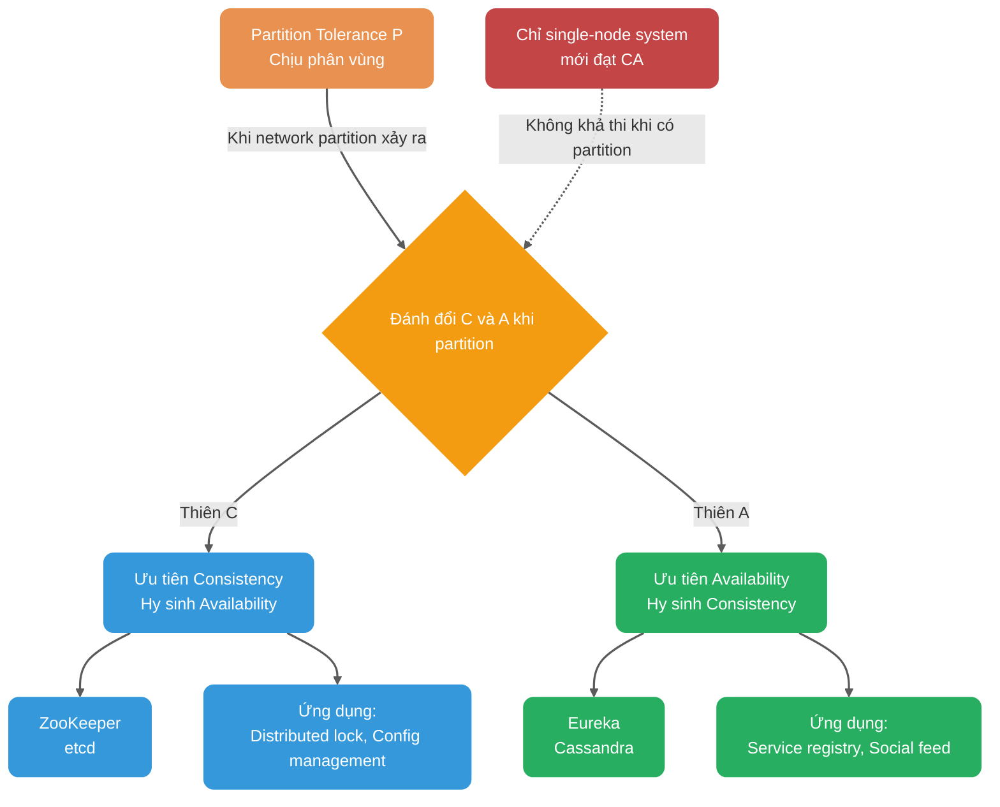
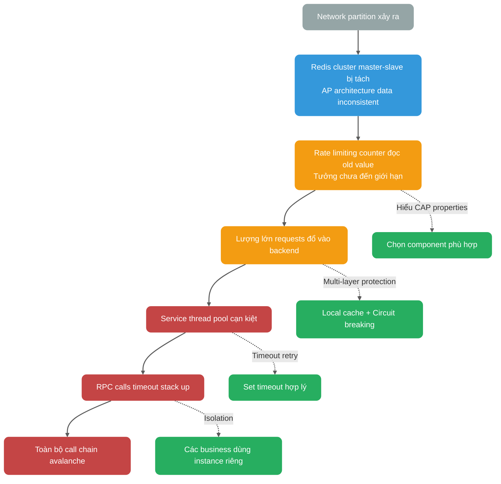
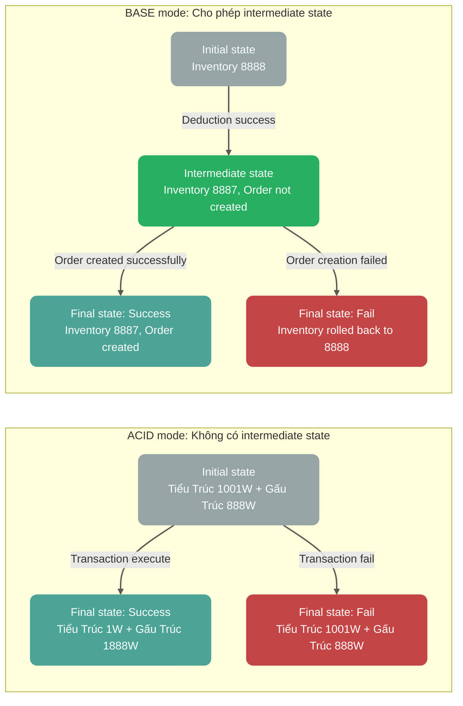
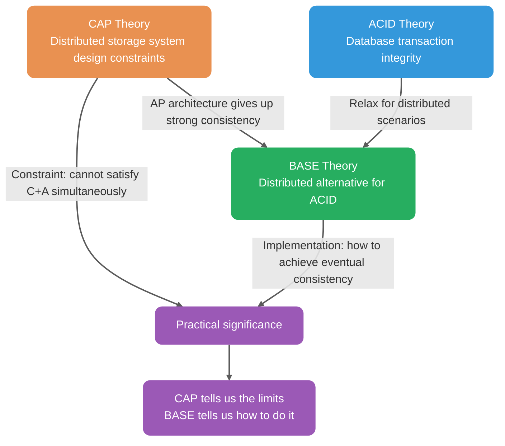

<!-- @include: @small-advertisement.snippet.md -->

Những ai đã trải qua technical interviews chắc chắn rất quen thuộc với hai lý thuyết CAP & BASE!

Ngày xưa đi phỏng vấn, không nói quá, hễ hỏi đến distributed systems là interviewer gần như đều hỏi hai lý thuyết nền tảng này. Một là vì đây là kiến thức bắt buộc phải có khi học distributed systems, hai là vì nhiều interviewer khá quen với chúng (dễ hỏi).

Chúng ta rất cần nắm rõ hai lý thuyết này và có thể giải thích chúng theo cách hiểu của bản thân.

## CAP Theorem

[CAP theorem](https://zh.wikipedia.org/wiki/CAP%E5%AE%9A%E7%90%86) ra đời năm 2000, được đề xuất bởi Giáo sư Eric Brewer của UC Berkeley tại hội thảo PODC (Principles of Distributed Computing), vì vậy CAP theorem còn được gọi là **Brewer's theorem**.

2 năm sau, Seth Gilbert và Nancy Lynch của MIT đã công bố bằng chứng cho Brewer's conjecture, CAP theory chính thức trở thành định lý trong lĩnh vực distributed systems.

### Giới thiệu

CAP theorem thảo luận về Consistency (nhất quán), Availability (sẵn sàng) và Partition Tolerance (chịu phân vùng).

> **Lưu ý quan trọng**: Thuật ngữ "thiên CP / thiên AP" dưới đây chỉ là mô tả trực quan. Theo định nghĩa chính thống của CAP (C=Linearizability, A=mọi non-faulty node đều phải respond), nhiều hệ thống không thể phân loại rõ ràng — cùng một hệ thống, các operations khác nhau có đặc tính consistency/availability khác nhau, nhiều hệ thống không đáp ứng hoàn toàn cả CAP-C lẫn CAP-A.


Khi đề xuất CAP conjecture, Brewer không đưa ra định nghĩa chặt chẽ cho **Consistency**, **Availability**, **Partition Tolerance**.

Do đó có nhiều cách hiểu về CAP. Cách giải thích phổ biến và được khuyến nghị nhất như sau:

Trong khoa học máy tính lý thuyết, CAP theorem phát biểu rằng đối với một distributed system, khi thiết kế read/write operations, chỉ có thể đồng thời đáp ứng 2 trong 3 điều kiện sau:

- **Consistency (Nhất quán)**: Trong ngữ cảnh chứng minh của Gilbert/Lynch (2002), C trong CAP chỉ **Atomic Consistency**, thường đồng nghĩa với **Linearizability (tuyến tính nhất quán)**. Tức là mọi operations được linearize theo thứ tự thời gian thực, nghĩa là khi write operation hoàn thành, tất cả read operations tiếp theo phải trả về giá trị đã được ghi (hoặc giá trị mới hơn). **Lưu ý**: Consistency ở đây khác với Consistency trong ACID của database (thỏa mãn integrity constraints), ACID-C chỉ việc trạng thái database trước và sau transaction thỏa mãn integrity constraints.
- **Availability (Sẵn sàng)**: Mỗi non-faulty node phải trả về response cho mọi request (không bàn đến tốc độ respond). **Lưu ý**: Đây là định nghĩa nghiêm ngặt trong CAP theory, không bao gồm các metrics latency/SLA trong engineering (như "trả về trong 1s").
- **Partition Tolerance (Chịu phân vùng)**: P trong CAP về bản chất là giả định asynchronous network (có thể delay/packet loss/partition), không phải feature mà bạn "chọn có hay không". Sự đánh đổi thực sự là: khi partition xảy ra, bạn phải chọn giữa **linear consistency (CAP's Consistency=Linearizability)** và **CAP-Availability (mọi non-faulty node đều phải respond non-error cho requests)**.

**Network partition là gì?**

Trong distributed system, nhiều nodes được kết nối với nhau qua network, nhưng do một số sự cố (ví dụ một số nodes bị lỗi mạng), một số nodes không thể kết nối với nhau nữa, toàn bộ network chia thành các vùng riêng lẻ — đây gọi là **network partition**.


### Không phải "chọn 2 trong 3"

Khi giải thích định luật này, hầu hết mọi người thường nói đơn giản: "Bạn chỉ có thể đồng thời đạt được 2 trong 3: consistency, availability, partition tolerance, không thể đạt cả 3". Thực tế đây là cách giải thích gây hiểu nhầm, và 12 năm sau khi CAP ra đời, cha đẻ của CAP đã viết lại paper năm 2012.

> **Khi network partition xảy ra, nếu chúng ta muốn tiếp tục phục vụ, thì chỉ có thể chọn 1 trong 2: strong consistency hoặc availability.**
>
> Tóm lại: Partition tolerance P trong CAP không phải bắt buộc, nhưng khi chọn thỏa mãn P, trên cơ sở đó chỉ có thể thỏa mãn Availability A hoặc Consistency C.

**Tại sao không thể chọn CA architecture?**

Vì distributed systems không thể tách rời network communication, và network failures là chuyện bình thường:

- Heartbeat detection có thể miss do network jitter, gây phán đoán sai node failure
- Trong quá trình data sync, packet loss có thể dẫn đến inconsistency, hệ thống sẽ retry liên tục để đạt nhất quán, gây request blocking

**Do đó, trong asynchronous network model (partition có thể xảy ra), khi partition xảy ra, phải chọn giữa linear consistency và CAP-availability.** Chỉ có single-node system mới đảm bảo được CA — vì chỉ có một node, sau khi data được ghi, mọi request đều thấy cùng dữ liệu; chỉ cần node đó còn sống, system vẫn available.

Hình dưới cho thấy sự đánh đổi cốt lõi của CAP và xu hướng của các hệ thống phổ biến:



Cần giới thiệu **PACELC theory** (extension của CAP) để giải thích toàn diện hơn:

PACELC theory do Daniel J. Abadi đề xuất: **Nếu có Partition (P), phải chọn giữa Availability (A) và Consistency (C); otherwise (E, Else), phải chọn giữa Latency (L) và Consistency (C).**

```mermaid
flowchart TB
    %% 核心语义配色
    classDef question fill:#95A5A6,color:#FFFFFF,stroke:none,rx:10,ry:10
    classDef choice fill:#E99151,color:#FFFFFF,stroke:none,rx:10,ry:10
    classDef consistency fill:#3498DB,color:#FFFFFF,stroke:none,rx:10,ry:10
    classDef availability fill:#27AE60,color:#FFFFFF,stroke:none,rx:10,ry:10
    classDef latency fill:#9B59B6,color:#FFFFFF,stroke:none,rx:10,ry:10

    Q{Có Partition P không?}:::question

    Q -->|Có Partition| PAC[Đánh đổi A và C]:::choice
    Q -->|Không (Else)| ELC[Đánh đổi L và C]:::choice

    PAC --> PA[Chọn Availability A<br/>Cassandra AP]:::availability
    PAC --> PC[Chọn Consistency C<br/>ZooKeeper CP]:::consistency

    ELC --> LC[Chọn Low Latency L<br/>MySQL async replication]:::latency
    ELC --> EC[Chọn Strong Consistency C<br/>MySQL semi-sync replication]:::consistency

    linkStyle default stroke-width:2px,stroke:#333333,opacity:0.8
```

Ý nghĩa thực tế: Ngay cả khi không có network partition, distributed systems vẫn cần đánh đổi giữa low latency (async replication) và strong consistency (sync replication). Ví dụ:

- **Cassandra**: Có thể điều chỉnh read/write consistency level (ONE/QUORUM/ALL) để cân bằng giữa latency và consistency
- **MySQL master-slave**: Có thể chọn async replication (low latency) hoặc semi-sync replication (strong consistency)

ZooKeeper, HBase là CP architecture; Cassandra, Eureka là AP architecture; Nacos hỗ trợ cả CP lẫn AP architecture.

**Việc chọn CP hay AP phụ thuộc vào business scenario, không có câu trả lời tuyệt đối**: Ví dụ với các scenario yêu cầu strong consistency như distributed lock, config management sẽ chọn CP; với các scenario ưu tiên high availability như microservice registry center sẽ chọn AP.

**Thêm một điểm bổ sung**: Khi không có partition, có thể đồng thời đạt linear consistency và CAP-availability ("sẽ respond"); nhưng về mặt engineering thường vẫn phải đánh đổi giữa latency và consistency (đây là nội dung phần ELC trong PACELC theory).

### Phạm vi áp dụng của CAP Theory

**Kết luận quan trọng**: CAP theory chủ yếu thảo luận về sự đánh đổi giữa consistency và availability của một data object đơn lẻ trong replica replication scenarios.

| Phù hợp mô hình thảo luận CAP           | Cần phân tích ở cấp độ shard/object/operation             |
| --------------------------------------- | --------------------------------------------------------- |
| Redis master-slave/sentinel cluster     | Business systems (stateless services)                     |
| MySQL master-slave/multi-master cluster | Redis-Cluster (mỗi shard vẫn có replicas)                 |
| MongoDB replica set                     | MongoDB-Cluster (sharding + replicas)                     |
| ZooKeeper, etcd                         | Sharding (cross-shard transactions cần coordination thêm) |
| Kafka, RocketMQ                         | Hầu hết microservice applications\*                       |

**Giải thích**:

- **CAP discussion model**: Replica replication semantics của single register (single read/write register)
- **Complex systems**: Cần phân tách thành "mỗi object/partition/operation" để thảo luận về consistency semantics
- **Sharding + replicas**: Mỗi shard trong sharded system thường vẫn có replica replication, sự đánh đổi consistency/availability vẫn tồn tại

> **Mối liên hệ sâu giữa business systems và CAP**:
>
> Bản thân business systems không liên quan đến replica sync, nhưng **chịu ảnh hưởng sâu sắc từ CAP properties của underlying components**. Bỏ qua điều này sẽ dẫn đến Cascading Failure khi network partition xảy ra.
>
> **Business scenarios bị ảnh hưởng bởi CAP properties**:
>
> | Business Scenario              | Underlying Component                | Ảnh hưởng của CP component                                  | Ảnh hưởng của AP component                      |
> | ------------------------------ | ----------------------------------- | ----------------------------------------------------------- | ----------------------------------------------- |
> | RPC routing                    | Registry center (như Nacos CP mode) | Không available trong thời gian đăng ký, request bị từ chối | Có thể route đến instance đã offline, cần retry |
> | Distributed lock               | Redis (AP) / ZooKeeper (CP)         | Performance thấp hơn nhưng đáng tin                         | Performance cao nhưng lock có thể invalid       |
> | Rate limiting/circuit breaking | Redis counter                       | Có thể đọc old count, rate limiting fail                    | Tương tự                                        |
> | Cache update                   | Redis master-slave                  | Có thể mất data khi master-slave switch                     | Tương tự                                        |
> | Message consumption            | Kafka                               | Consumer progress sync chậm, duplicate consumption          | Tương tự                                        |
>
> **Khuyến nghị thực tế**: Business developers không cần "thực hành" CAP theory, nhưng **phải hiểu CAP theory** để:
>
> - Chọn component phù hợp (CP hoặc AP) cho các business scenarios khác nhau
> - Hiểu hành vi của component được chọn khi network partition xảy ra
> - Thiết kế fault tolerance phù hợp với business requirements (retry, circuit breaking, degradation)

Nhiều developers nghĩ họ đang "thực hành CAP theory", thực tế họ chỉ đang lựa chọn trên các components có sẵn (dùng CP hay AP), chứ không thực sự thực hành lý thuyết đó. Những người thực sự cần thực hành CAP là các engineers phát triển distributed storage components như Redis, MySQL.

### Áp dụng tư tưởng CAP trong business

Ngoài việc phát triển distributed storage components, trong business development, hầu hết là **lựa chọn** architecture phù hợp chứ không phải thực hành CAP theory:

| Scenario                          | Lựa chọn thiên CP                     | Lựa chọn thiên AP                    | Business trade-off                              |
| --------------------------------- | ------------------------------------- | ------------------------------------ | ----------------------------------------------- |
| Database master-slave replication | Sync replication (strong consistency) | Async replication (high performance) | Data consistency vs Response speed              |
| Distributed lock                  | ZooKeeper (strong consistency)        | Redis (high performance)             | Lock reliability vs Acquisition speed           |
| Service registry center           | ZooKeeper, Consul (CP mode)           | Eureka, Nacos (AP mode)              | Registration accuracy vs Discovery availability |
| Rate limiting counter             | Redis (strong consistency commands)   | Redis (allow expiration)             | Rate limiting precision vs Performance          |

**Selection principles**:

- **Ưu tiên performance**: Nghiêng về components cho phép async replication, write vào master node là return success, response nhanh; nhưng có risk mất data/đọc old data, cần kết hợp retry mechanism
- **Ưu tiên data safety**: Nghiêng về components yêu cầu majority confirmation, write cần chờ quorum nodes confirm, response chậm; nhưng giảm risk mất data

**Lưu ý**: Mất data hay không phụ thuộc nhiều hơn vào persistence, replication confirmation strategy, fault model, không thể chỉ dựa vào "CP/AP label" để phán đoán.

**Cascading failure case**:

Một scenario điển hình về cascading failure do bỏ qua CAP:



**Biện pháp bảo vệ**:

1. **Hiểu CAP properties của underlying components**: Biết hành vi của component khi network partition xảy ra
2. **Multi-layer protection**: Không chỉ phụ thuộc vào một component, kết hợp local cache, circuit breaking, degradation
3. **Timeout và retry**: Set timeout hợp lý, tránh chờ vô hạn
4. **Isolation mechanism**: Các business khác nhau dùng các instances riêng của underlying components, tránh fault spreading

### Ví dụ ứng dụng CAP thực tế

Ở đây mình lấy registry center làm ví dụ để khám phá ứng dụng thực tế của CAP. Để mọi người dễ hiểu, mình dùng Dubbo làm ví dụ.

Hình dưới là architecture diagram của Dubbo. **Registry trong đó đóng vai trò gì? Cung cấp services gì?**

Registry chịu trách nhiệm register và lookup service addresses, đóng vai trò như directory service. Service providers và consumers chỉ tương tác với registry khi startup, registry không forward requests nên pressure nhẹ.


Các components phổ biến có thể dùng làm registry: ZooKeeper, Eureka, Nacos...

#### ZooKeeper 3.8.x (CP Architecture)

ZooKeeper thiên về **CP architecture**. ZooKeeper 3.x cung cấp **Linearizable Writes** thông qua ZAB protocol, nhưng read behavior cần phân biệt:

- **Sync reads**: Force sync với Leader, đảm bảo linearizability.
- **Regular reads**: Mặc định cung cấp **Sequential Consistency**, đảm bảo thứ tự global update operations, client view trong cùng session không bao giờ bị rollback, nhưng có thể đọc data cũ (có read lag).

> **Điểm khác biệt quan trọng**: Sequential Consistency ≠ Eventual Consistency. Regular reads của ZooKeeper đảm bảo mọi clients thấy cùng **thứ tự updates** (global zxid order), chỉ có read lag; còn eventual consistency không đảm bảo global order, chỉ đảm bảo eventually converge. Default reads của ZK giống "stale-but-ordered" reads (sequential/session guarantees rất strong), không phải eventual consistency kiểu Dynamo.

Khi Leader election đang diễn ra hoặc số Follower nodes không đủ Quorum (N/2+1), ZooKeeper sẽ từ chối service để duy trì consistency, biểu hiện là unavailable (hy sinh A).

Trong multi-node deployment, cluster dùng Quorum mode: majority nodes (n/2+1) phải đồng ý thay đổi mới có hiệu lực.

ZooKeeper cung cấp Watcher mechanism (async notification về changes) và version mechanism (zxid kiểm tra freshness) để giảm read lag.

Failure paths và state machine behavior:

| Failure scenario                     | System state                           | Client behavior                                                                                    |
| ------------------------------------ | -------------------------------------- | -------------------------------------------------------------------------------------------------- |
| Quorum failure (majority nodes down) | **LOOKING** state, Leader election     | Write requests rejected, read requests may return stale data or timeout                            |
| Follower partitioned from Leader     | Follower enters **ELECTION** state     | Follower cannot participate in voting, but can respond to reads (stale data)                       |
| Leader partitioned from majority     | Leader auto-demotes, cluster re-elects | Original Leader's writes lost, client needs retry (detect zxid rollback)                           |
| Watcher lost                         | Network jitter or GC pressure          | Client needs retry (exponential backoff + Jitter), monitor `Watches` queue to prevent backpressure |

#### Eureka (AP Architecture)

Eureka dùng AP architecture: peer nodes, duy trì data consistency thông qua Peer replication/sync (periodic full pull + incremental update), không có Leader election. **Lưu ý**: Trong Spring Cloud ecosystem, 1.x dependency form phổ biến hơn trong lịch sử; Netflix/eureka 2.x vẫn đang được maintained và liên tục release.

Failure paths và state machine behavior:

| Failure scenario                                               | System state                                              | Client behavior                                                                                                                                     | Self-protection mechanism                                                                                             |
| -------------------------------------------------------------- | --------------------------------------------------------- | --------------------------------------------------------------------------------------------------------------------------------------------------- | --------------------------------------------------------------------------------------------------------------------- |
| Network partition (split-brain)                                | Cả hai phía **hoạt động độc lập**, đều có thể read/write  | Client có thể đọc old registration info (inconsistency window = heartbeat interval 30s + gossip propagation delay, P99 <60s trong 10-node topology) | Khi renewal threshold < 85% trigger **self-protection**, pause instance eviction, tránh "kill nhầm" healthy instances |
| Half nodes failure                                             | Remaining nodes tiếp tục serve, nhưng data có thể diverge | Read operations normal, writes may only exist on minority nodes                                                                                     | Self-protection triggered, auto merge qua gossip khi nodes recover                                                    |
| Node brief restart                                             | Batch pull registry từ Peer (Registry Fetch)              | Service discovery briefly unavailable (< 1min), cache helps                                                                                         | Normal mode, auto recover                                                                                             |
| Registration storm (many instances registering simultaneously) | Write queue backlog, may cause request drop               | Some registration requests timeout, client needs retry                                                                                              | Configurable rate limiting and backpressure (như Ribbon retry strategy)                                               |

**Chi tiết về Self-protection mechanism**:

Eureka Server xác định có nên vào self-protection hay không theo logic sau:

```
Số lần renewal kỳ vọng mỗi phút E = Số instances hiện tại N × (60 / heartbeat interval seconds)
Threshold T = E × 0.85
Nếu renewal thực tế trong 1 phút R < T, vào self-protection: pause eviction
(E/T được update theo chu kỳ cố định dựa trên N, thường khoảng 15 phút)
```

Với heartbeat interval mặc định 30 giây, expected renewals per minute = instances × 2.

Khi `actual renewal rate < 85%`:

1. Vào **SELF PRESERVATION** mode
2. Dừng evict expired instances (EvictionTask paused)
3. Log output: `ENTER SELF PRESERVATION MODE`

**Design trade-off**: Thà giữ lại "zombie" instances còn hơn kill nhầm healthy instances — vì trong microservice scenarios, temporary service degradation tốt hơn large-scale service unavailability. Clients thường configure retry và circuit breaking để xử lý unavailable instances.

#### Tổng kết

Việc chọn CP hay AP phụ thuộc vào scenario: ZooKeeper phù hợp với strong consistency requirements như config management; Eureka phù hợp với high availability registration như microservice discovery.

Nacos hỗ trợ cả CP lẫn AP.

### Tổng kết

CAP theory hướng dẫn chúng ta: Với tiền đề distributed systems có thể gặp network partition (P), chúng ta phải đánh đổi giữa strong consistency (C) và high availability (A).

- **CP architecture**: Hy sinh availability, đảm bảo strong consistency. Phù hợp với scenarios yêu cầu cực cao về data consistency (như financial transactions, distributed locks).
- **AP architecture**: Hy sinh consistency, đảm bảo high availability. Phù hợp với scenarios ưu tiên system availability, có thể chịu được temporary data inconsistency (như social feeds, product search).
- **PACELC**: Khi không có partition (E), cần đánh đổi giữa latency (L) và consistency (C).

### Recommended Reading

1. [CAP theorem simplified](https://medium.com/@ravindraprasad/cap-theorem-simplified-28499a67eab4) (English, interesting examples)
2. [CAP theory được áp dụng ở đâu](https://juejin.im/post/6844903936718012430) (Chinese, nhiều ví dụ thực tế)
3. [Please stop calling databases CP or AP](https://martin.kleppmann.com/2015/05/11/please-stop-calling-databases-cp-or-ap.html) (English, gives you different perspective)

## BASE Theory

[BASE theory](https://dl.acm.org/doi/10.1145/1394127.1394128) ra đời năm 2008, được đề xuất bởi Dan Pritchett, architect tại eBay, trong paper đăng trên ACM với tiêu đề "Base: An ACID Alternative".

> **Key insight**: Từ tiêu đề paper, **BASE trước tiên là alternative cho ACID**. Nhưng cũng cần lưu ý, BASE có mối quan hệ chặt chẽ với CAP theory — **eventual consistency chính là guiding principle cho AP architecture trong CAP đạt được system convergence trong engineering practice**.

### Giới thiệu

**BASE** là viết tắt của **Basically Available (cơ bản sẵn sàng)**, **Soft-state (trạng thái mềm)** và **Eventually Consistent (nhất quán cuối cùng)**. BASE theory xuất phát từ tổng kết thực tiễn phân tán của large-scale internet systems.

### Mối quan hệ giữa BASE và ACID

Để hiểu BASE theory, trước tiên cần xem lại **Consistency** trong ACID theory:

**ACID's Consistency definition**: Trước và sau khi transaction thực thi, database chỉ có thể chuyển từ consistent state này sang consistent state khác.

Ví dụ chuyển khoản: Tiểu Trúc chuyển 1000W cho Gấu Trúc.

- **Initial state**: Tiểu Trúc 1001W, Gấu Trúc 888W, tổng 1889W
- **Result state**: Tiểu Trúc 1W, Gấu Trúc 1888W, tổng 1889W

Dù transaction thành công hay thất bại, tổng thể data phải nhất quán — giống như định luật bảo toàn năng lượng.

**Thách thức trong distributed scenarios**:

Trong distributed systems, product service và order service được deploy riêng biệt, [deduct inventory, create order] cần thực hiện qua network calls, nhất định sẽ có time difference:

```
Time T1: Inventory 8888 → 8887 (deduction success)
Time T2: Network call to order service...
Time T3: Order created successfully
```

Trong khoảng T1~T3, hệ thống đang ở **intermediate state**: inventory đã giảm, order chưa được tạo. Sau khi cross-service, không thể dùng single database ACID transaction để đảm bảo atomic commit và isolation toàn bộ; hệ thống sẽ có intermediate state khách quan tồn tại; BASE chấp nhận intermediate state và thông qua compensation/retry để state eventually converge.

**Giải pháp của BASE theory**:

BASE theory thừa nhận và cho phép intermediate state tồn tại:

- **Soft-state**: Cho phép hệ thống có intermediate state, và intermediate state đó không ảnh hưởng đến overall availability
- **Eventually consistent**: Intermediate state cuối cùng sẽ chuyển thành final state (hoặc success hoặc rollback)

Hình dưới so sánh trực quan sự khác biệt giữa ACID và BASE trong transaction processing:



Do đó, **BASE theory là alternative cho ACID trong distributed scenarios**, không phải supplement cho CAP theory.

### 3 yếu tố của BASE Theory


#### Basically Available (Cơ bản sẵn sàng)

Basically Available có nghĩa là khi distributed system gặp unexpected failures, cho phép mất một phần availability. Nhưng điều này không đồng nghĩa với system unavailability.

**Mất một phần availability nghĩa là gì?**

- **Response time loss**: Bình thường xử lý user request cần 0.5s để return results, nhưng do system failure, thời gian xử lý tăng lên 3s.
- **System function loss**: Bình thường user có thể dùng đầy đủ features, nhưng do traffic đột ngột tăng cao, một số non-core features không available.

#### Soft State (Trạng thái mềm)

Soft State có nghĩa là cho phép data trong system có intermediate states, và intermediate states đó không ảnh hưởng đến overall availability.

> **Điểm khác với ACID**: ACID theory yêu cầu sau khi transaction execute phải vào final state ngay (success hoặc fail), không cho phép intermediate state; còn BASE theory thừa nhận intermediate state là sự tồn tại khách quan của distributed systems, chỉ cần intermediate state eventually chuyển thành final state.

Ví dụ minh họa:

- **ACID mode**: Trong bank transfer transaction, deduction và credit phải cùng success hoặc cùng fail, không cho phép "deduction success nhưng credit chưa hoàn thành" intermediate state
- **BASE mode**: Trong e-commerce order transaction, cho phép "inventory deducted nhưng order chưa created" intermediate state tồn tại, miễn là eventually đạt consistency (hoặc order success, hoặc inventory rollback)

#### Eventual Consistency (Nhất quán cuối cùng)

Eventual Consistency nhấn mạnh: **Nếu system không có update operations mới trong một khoảng thời gian, thì tất cả replicas sẽ eventually converge về cùng value.**

Cần lưu ý, "eventual consistency" có ý nghĩa khác nhau trong hai contexts khác nhau:

| Context                                   | Ý nghĩa                                                       | Typical scenario                         |
| ----------------------------------------- | ------------------------------------------------------------- | ---------------------------------------- |
| **Replica storage (CAP context)**         | Data replicas eventually sync                                 | Cassandra data replication               |
| **Transaction state (BASE/ACID context)** | Transaction intermediate state eventually becomes final state | Distributed transactions (như TCC, Saga) |

**Eventual consistency của replica storage**:

"Khoảng thời gian" không được định nghĩa — có thể là milliseconds (LAN sync) hoặc minutes (cross-region replication). Trong production, cần chủ động accelerate convergence thông qua **Read Repair**, **Anti-Entropy (background sync)** hoặc **Quorum writes**.

**Eventual consistency của transaction state**:

Lấy distributed transaction làm ví dụ: [deduct inventory, create order, deduct balance]

- Time T1: Inventory deducted (intermediate state)
- Time T2: Order created (intermediate state)
- Time T3: Balance deducted (final state: transaction success)

Hoặc trong failure scenario:

- Time T1: Inventory deducted (intermediate state)
- Time T2: Order creation failed (trigger rollback)
- Time T3: Inventory rolled back (final state: transaction failed)

System sẽ đảm bảo đạt data consistent state trong một khoảng thời gian nhất định, không cần đảm bảo strong consistency ngay lập tức.

3 levels của distributed consistency:

1. **Strong consistency**: System ghi gì, đọc ra đúng cái đó.
2. **Weak consistency**: Không nhất thiết đọc được value mới nhất, cũng không đảm bảo sau bao lâu thì đọc được latest data, chỉ cố gắng đảm bảo tại một thời điểm nào đó data sẽ consistent.
3. **Eventual consistency**: Phiên bản nâng cấp của weak consistency, system đảm bảo đạt data consistent state trong một khoảng thời gian nhất định.

**Industry phổ biến nhất là eventual consistency level, nhưng một số scenarios yêu cầu data consistency cực kỳ nghiêm ngặt như bank transfers vẫn phải đảm bảo strong consistency.**

Vậy cụ thể implement eventual consistency như thế nào?

- **Read Repair**: Khi đọc data, phát hiện inconsistency và sửa. Phù hợp với read-heavy, write-light scenarios.
- **Hinted Handoff**: Khi ghi data, nếu target node unavailable, cache data lại, gửi lại khi node recover. **Hinted Handoff** tối ưu write latency, nhưng tăng inconsistency risk khi read (data có thể vẫn trong cache queue chưa persisted vào target node).
- **Anti-Entropy**: So sánh replica data differences và repair trong background. Engineering challenge chính là **efficiently detect data differences** — brute force record-by-record comparison (O(n)) không khả thi với large datasets, production systems dùng **Merkle Tree** để định vị differences với low overhead.

**Selection recommendations**:

- **Hinted Handoff**: Phù hợp write-heavy read-light, optimize write performance, nhưng sacrifices consistency window.
- **Read Repair**: Phù hợp read-heavy write-light, đảm bảo accuracy của data được đọc.
- **Anti-Entropy**: Background safety net, phù hợp với large-scale data nhưng có high requirements cho eventual consistency.

### Tại sao nhiều người coi BASE là supplement của CAP?

Đây là cách nói **một phần đúng nhưng không đủ chính xác**. Cách hiểu chính xác hơn là:

1. **BASE trước tiên là alternative cho ACID**: Từ tiêu đề paper [《Base: An ACID Alternative》](https://spawn-queue.acm.org/doi/10.1145/1394127.1394128), mục đích ban đầu của BASE theory là giải quyết vấn đề ACID quá nghiêm ngặt trong distributed transaction scenarios.

2. **BASE có mối liên hệ nội tại với AP architecture của CAP**:

   - Chọn AP architecture nghĩa là từ bỏ strong consistency (C)
   - Sau khi từ bỏ strong consistency, system converge bằng cách nào? Câu trả lời là **eventual consistency**
   - Do đó, BASE theory (đặc biệt là eventual consistency) là guiding principle **bắt buộc phải adopt** trong AP architecture engineering practice

3. **Nguồn gốc của hiểu lầm**: Nhiều người hiểu nhầm "BASE liên quan đến AP" thành "BASE là supplement của CAP". Thực tế:
   - **BASE không phải supplement hoặc correction của CAP theory**
   - **BASE là engineering practice guide cho AP architecture** — khi bạn chọn AP, BASE cho bạn biết cách để system eventually reach consistency trong engineering practice

**Cách hiểu đúng**:



| Dimension            | CAP Theory                                  | BASE Theory                                                             |
| -------------------- | ------------------------------------------- | ----------------------------------------------------------------------- |
| Focus area           | Distributed storage systems (with replicas) | All distributed systems                                                 |
| Consistency meaning  | Data consistency (replica sync)             | State consistency (transaction final state)                             |
| Availability meaning | System available when nodes fail            | Some functions available when some nodes fail                           |
| Core relationship    | -                                           | ① Alternative for ACID ② Engineering practice guide for AP architecture |

> **Practical significance**: CAP tells us that strong consistency cannot be guaranteed in AP architecture, BASE tells us how to let system converge through eventual consistency in AP architecture — the two have a **constraint vs implementation** relationship, not supplemental.

Nếu CAP là design constraint của distributed storage systems (telling us what we cannot do), thì BASE là practical guidance cho distributed systems (especially business systems) (telling us how to do it) — nó nói với chúng ta: **Hầu hết application scenarios không cần strong consistency, và chấp nhận intermediate state để eventually achieve consistency là lựa chọn thực tế hơn.**

### Tổng kết

**ACID là lý thuyết về tính toàn vẹn của database transactions, CAP là lý thuyết thiết kế của distributed storage systems, BASE là alternative cho ACID trong distributed scenarios, đồng thời cũng là engineering practice guide cho AP architecture.**

> **Mối quan hệ tương ứng quan trọng**:
>
> - **CAP's consistency** = Data consistency (data sync between replica nodes)
> - **BASE's consistency** = State consistency (consistency of transaction final state) = ACID's consistency
> - **CAP's availability** = Availability of master-slave cluster (system still available when nodes fail)
> - **BASE's availability** = Availability of sharded cluster (some node failures only affect some users)
> - **Mối quan hệ CAP và BASE**: Sau khi chọn AP architecture, BASE theory hướng dẫn cách đạt system convergence thông qua eventual consistency trong engineering practice

<!-- @include: @article-footer.snippet.md -->
