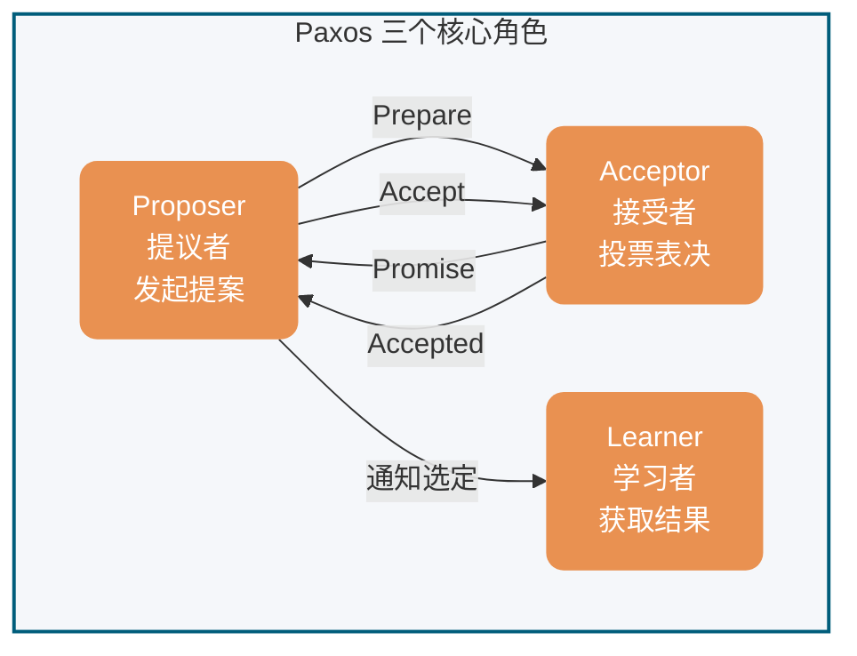
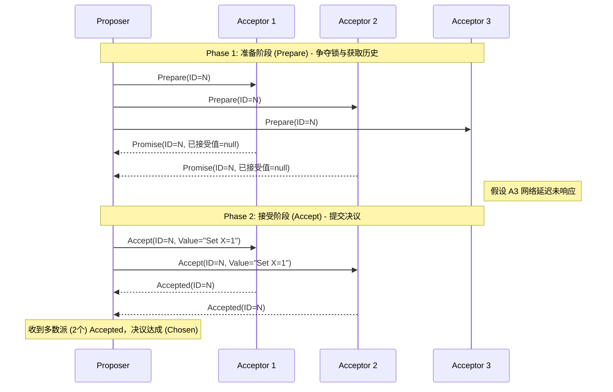
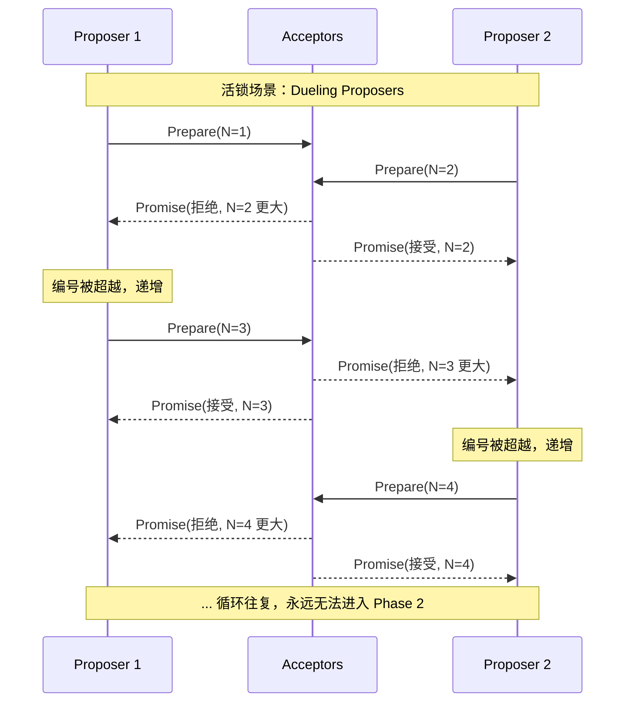
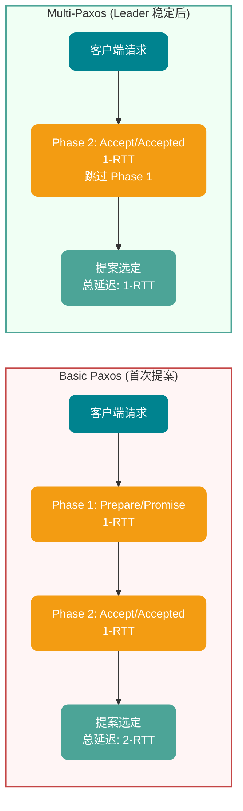
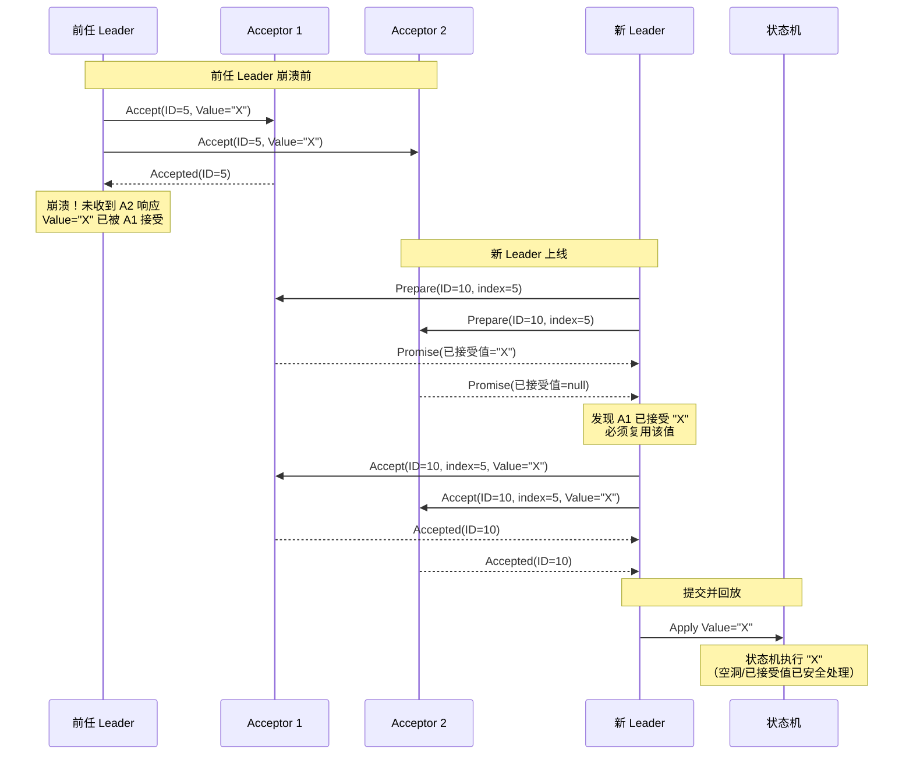
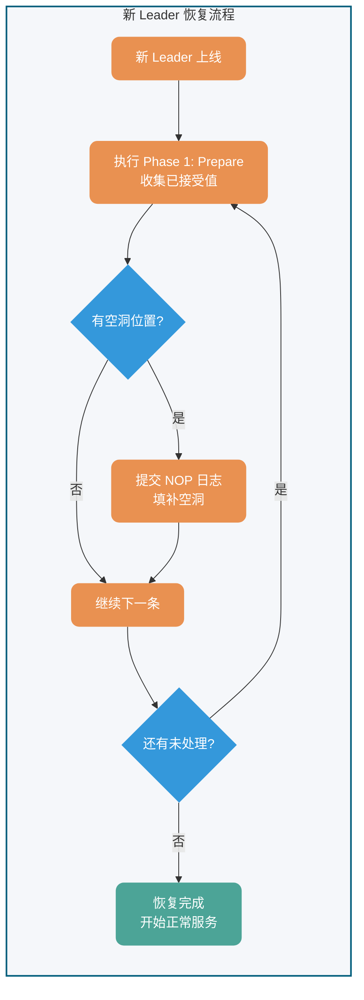

## Bối cảnh

Thuật toán Paxos là một thuật toán **đồng thuận** trong hệ thống phân tán được Leslie Lamport đề xuất vào năm **1990**. Đây là một trong những thuật toán đồng thuận phân tán được công nhận rộng rãi đầu tiên (với điều kiện không tồn tại vấn đề tướng Byzantine, tức là không có node độc hại).

Để giới thiệu thuật toán Paxos, Lamport đã viết riêng một bài báo hài hước và dí dỏm. Trong bài báo này, ông hư cấu một thành bang Hy Lạp tên Paxos để mô tả thuật toán Paxos một cách sinh động hơn.

Tuy nhiên, các nhà phản biện không chấp nhận sự hài hước trong bài báo này. Vì vậy, họ nói với Lamport rằng: "Nếu bạn muốn đăng tải bài báo này, bạn phải xóa tất cả các câu chuyện nền liên quan đến Paxos". Lamport nghe xong rất không vui: "Tại sao tôi phải sửa, các bạn không có khiếu hài hước, không đăng thì thôi!".

Vì vậy, bài báo đề xuất thuật toán Paxos đã không được đăng tải thành công vào thời điểm đó.

Cho đến năm 1998, hai nhà nghiên cứu kỹ thuật tại Trung tâm Nghiên cứu Hệ thống (Systems Research Center, SRC) cần tìm một số thuật toán phân tán phù hợp để phục vụ hệ thống phân tán mà họ đang xây dựng, và thuật toán Paxos vừa đáp ứng được một phần nhu cầu của họ. Vì vậy, Lamport đã gửi bài báo cho họ. Sau khi đọc bài báo, hai chuyên gia này cảm thấy bài báo khá hay. Vì vậy, Lamport đã tái công bố bài báo [《The Part-Time Parliament》](http://lamport.azurewebsites.net/pubs/lamport-paxos.pdf) vào năm **1998**.

Sau khi bài báo được công bố, các học giả từ khắp nơi đều nói rằng không hiểu được, thậm chí còn có vẻ mỉa mai. Lamport không chịu được điều này, vào năm **2001**, ông đã viết riêng một bài báo [《Paxos Made Simple》](http://lamport.azurewebsites.net/pubs/paxos-simple.pdf) để đơn giản hóa phần giới thiệu về Paxos, chủ yếu trình bày phần giao thức đồng thuận hai giai đoạn, và tiện thể cũng không quên châm biếm nhóm học giả này.

Bài báo 《Paxos Made Simple》chỉ có 14 trang, ngắn gọn hơn nhiều so với 33 trang của 《The Part-Time Parliament》. Điều quan trọng nhất là phần tóm tắt của bài báo này chỉ có một câu:


> The Paxos algorithm, when presented in plain English, is very simple.

Dịch ra có nghĩa là: Khi được mô tả bằng tiếng Anh thuần túy, thuật toán Paxos thực sự rất đơn giản!

Bạn có cảm nhận được sự châm biếm đầy mỉa mai từ đại sư Lamport không?

## Giới thiệu

Bài viết này chia Paxos thành hai phần để trình bày:

- **Thuật toán Basic Paxos**: Mô tả cách nhiều node đạt được đồng thuận về một giá trị (value) duy nhất.
- **Tư tưởng Multi-Paxos**: Thông qua việc thực hiện nhiều phiên bản Basic Paxos, đạt được đồng thuận về một chuỗi các giá trị.

Vai trò của thuật toán đồng thuận là giúp nhiều node trong hệ thống phân tán đạt được nhất trí về một đề xuất (proposal) nào đó. "Đề xuất" có thể đại diện cho nhiều đối tượng khác nhau trong các hệ thống khác nhau, ví dụ như bầu chọn leader, sắp xếp sự kiện, v.v.

Do thuật toán Paxos được công nhận là khó hiểu và khó triển khai, năm 2013 đã ra đời [thuật toán Raft](https://javaguide.cn/distributed-system/theorem&algorithm&protocol/raft-algorithm.html) dễ hiểu hơn.

**Về mối quan hệ giữa Raft và Paxos**: Từ góc độ học thuật, Raft không phải là biến thể nghiêm ngặt của Paxos — hai thuật toán có sự khác biệt cơ bản trong triết lý thiết kế nền tảng (như log gap, quyền hạn Leader). Nhưng từ góc độ thực tiễn kỹ thuật, thiết kế của Raft được lấy cảm hứng từ Multi-Paxos, có thể hiểu là "thiết kế lại được lấy cảm hứng từ Multi-Paxos". Phần sau của bài viết này sẽ so sánh chi tiết sự khác biệt giữa hai thuật toán.

Đối với các tình huống không có Byzantine (không có node độc hại), ngoài Raft, **giao thức ZAB**, **Fast Paxos** đều là các thuật toán đồng thuận được cải tiến từ Paxos.

Đối với các tình huống Byzantine (có node độc hại), thường sử dụng các thuật toán đồng thuận như **Proof-of-Work (PoW)**, **Proof-of-Stake (PoS)**, ứng dụng điển hình là hệ thống blockchain.

## Thuật toán Basic Paxos

### Định nghĩa vai trò

Basic Paxos có 3 vai trò quan trọng:

1. **Proposer (Người đề xuất)**: Còn được gọi là coordinator (người điều phối), chịu trách nhiệm tiếp nhận yêu cầu từ client và khởi tạo đề xuất. Thông tin đề xuất thường bao gồm số hiệu đề xuất (proposal ID) và giá trị được đề nghị (value).
2. **Acceptor (Người chấp nhận)**: Còn được gọi là voter (người bỏ phiếu), chịu trách nhiệm bỏ phiếu cho các đề xuất, đồng thời cần ghi nhớ lịch sử bỏ phiếu của mình.
3. **Learner (Người học)**: Chịu trách nhiệm học (learn) các giá trị đã được chọn. Trong triển khai máy trạng thái sao chép (RSM), giá trị này thường tương ứng với một lệnh cần thực thi, được state machine áp dụng theo thứ tự rồi trả kết quả qua tầng dịch vụ bên ngoài.


**Sơ đồ tương tác giữa các vai trò**:



Để giảm số lượng node cần thiết cho việc triển khai thuật toán, một node có thể đảm nhận nhiều vai trò. Ngoài ra, một đề xuất cần được hơn một nửa số Acceptor chấp nhận mới được coi là đã được chọn. Nhờ đó, thuật toán Basic Paxos còn có khả năng chịu lỗi — khi ít hơn một nửa số node gặp sự cố, cụm vẫn có thể hoạt động bình thường.

### Quy trình thực thi

Basic Paxos đạt được đồng thuận qua hai giai đoạn: **giai đoạn Prepare/Promise (Chuẩn bị/Cam kết)** và **giai đoạn Accept/Accepted (Chấp nhận/Đã chấp nhận)**.



#### Phase 1: Prepare/Promise (Giai đoạn Chuẩn bị/Cam kết)

Proposer chọn một số hiệu đề xuất n (phải là duy nhất toàn cục và tăng dần), gửi yêu cầu `Prepare(n)` đến hơn một nửa số Acceptor.

**Logic xử lý của Acceptor** (logic xử lý cho mỗi số hiệu đề xuất n):

- Nếu n > max_n (số hiệu đề xuất lớn nhất mà Acceptor này đã thấy)
  - Trả về `Promise(n, max_v)`, trong đó max_v là giá trị của đề xuất có số hiệu lớn nhất đã từng được chấp nhận (nếu có)
  - Cam kết không chấp nhận thêm các đề xuất có số hiệu < n
- Nếu n ≤ max_n
  - Từ chối hoặc bỏ qua yêu cầu

**Mục đích**: Giúp Proposer nắm được các đề xuất đã được chấp nhận hoặc đang chuẩn bị được chấp nhận trong hệ thống hiện tại, tránh đề xuất các giá trị xung đột.

#### Phase 2: Accept/Accepted (Giai đoạn Chấp nhận/Đã chấp nhận)

Khi Proposer nhận được phản hồi Promise từ hơn một nửa số Acceptor, nó chọn giá trị có max_v lớn nhất trong các phản hồi (nếu không có thì chọn bất kỳ giá trị nào), và gửi yêu cầu `Accept(n, v)` đến hơn một nửa số Acceptor.

**Logic xử lý của Acceptor**:

- Nếu n ≥ max_n mà Acceptor này đã cam kết trong Phase 1
  - Chấp nhận đề xuất, ghi lại (n, v), và trả về `Accepted(n, v)`
- Ngược lại
  - Từ chối yêu cầu

#### Điều kiện hội tụ

Khi Proposer nhận được phản hồi cho `Accept(n, v)` từ hơn một nửa số Acceptor, đề xuất v được **chọn (chosen)**. Proposer thông báo cho tất cả Learner rằng đề xuất đã được chọn.

### Đảm bảo an toàn

Basic Paxos đảm bảo các tính an toàn sau:

1. **Nhất quán**: Một khi một giá trị được chọn, tất cả các giá trị được chọn sau đó đều là giá trị đó
2. **Khả năng kết thúc**: Nếu không có Proposer cạnh tranh và giao tiếp đáng tin cậy, cuối cùng sẽ chọn được một giá trị

**Cơ chế cốt lõi**: Thông qua việc thu thập Promise trong Phase 1, Proposer chỉ có thể chọn các giá trị mà Acceptors đã cam kết (hoặc chọn giá trị mới), đảm bảo không có giá trị xung đột nào được chọn.

### Vấn đề liveness

Basic Paxos có rủi ro **Livelock (khóa sống)**:

- Nếu nhiều Proposer đồng thời đề xuất, và số hiệu đề xuất tăng xen kẽ nhau
- Có thể dẫn đến không đề xuất nào nhận được hơn một nửa số Accept
- Hệ thống rơi vào cạnh tranh vô hạn, không thể đạt được đồng thuận

**Ví dụ về livelock** (Dueling Proposers):

Giả sử có hai Proposer P1 và P2 đồng thời đề xuất:

1. P1 gửi `Prepare(1)`, P2 gửi `Prepare(2)`
2. Các Acceptor cam kết với P2 có số hiệu lớn hơn
3. P1 phát hiện số hiệu bị vượt qua, gửi `Prepare(3)`
4. P2 phát hiện số hiệu bị vượt qua, gửi `Prepare(4)`
5. ... lặp đi lặp lại, không bao giờ có thể vào Phase 2

**Sơ đồ thời gian của livelock**:



**Giải pháp**: Giới thiệu cơ chế Leader ổn định thông qua Multi-Paxos.

**Thuật toán rút lui ngẫu nhiên (Randomized Exponential Backoff)**:

Để ngăn nhiều Proposer cạnh tranh dẫn đến livelock, các triển khai cấp độ sản xuất thường giới thiệu rút lui ngẫu nhiên:

Khi yêu cầu Prepare của Proposer bị từ chối (số hiệu quá nhỏ):

1. Chờ một khoảng thời gian ngẫu nhiên: `base_delay * random(1, 2^attempt)`
2. Chọn số hiệu đề xuất lớn hơn (ví dụ: `n = n + k`, `k > 0`)
3. Thử lại giai đoạn Prepare

Ví dụ tham số:

- `base_delay`: 10ms
- `attempt`: số lần thử lại (1, 2, 3...)
- Thời gian rút lui tối đa: `max(1s, base_delay * 2^10)`

Cơ chế này đảm bảo các đối thủ cạnh tranh không thử lại cùng một lúc, cuối cùng một Proposer nào đó sẽ hoàn thành thành công Phase 1.

**Xử lý phân vùng**: Nếu xảy ra phân vùng mạng, phía đa số có thể tiếp tục bầu chọn Leader và cam kết đề xuất mới; phía thiểu số không thể tạo thành quorum, chỉ có thể chờ phân vùng phục hồi.

## Tư tưởng Multi-Paxos

### Tư tưởng cốt lõi

Thuật toán Basic Paxos chỉ có thể đạt được đồng thuận về một giá trị duy nhất. Để có thể đạt được đồng thuận về một chuỗi các giá trị, chúng ta cần sử dụng tư tưởng Multi-Paxos.

Tư tưởng tối ưu hóa cốt lõi của Multi-Paxos là **tái sử dụng Leader**: Thông qua Basic Paxos, bầu chọn một Proposer ổn định làm Leader, các đề xuất tiếp theo được khởi tạo trực tiếp bởi Leader đó, bỏ qua giai đoạn Prepare/Promise của Phase 1.

### Cơ chế tối ưu hóa

#### 1. Bầu chọn Leader ổn định

- Thông qua Basic Paxos, bầu chọn một Proposer duy nhất làm Leader
- Sau khi Leader sụp đổ, tiến hành bầu chọn Leader mới thông qua một vòng Basic Paxos mới
- Tránh livelock do nhiều Proposer cạnh tranh

#### 2. Bỏ qua Phase 1

- Sau khi Leader ổn định, các đề xuất tiếp theo đi thẳng vào Phase 2 (giai đoạn Accept)
- Không cần thực hiện Prepare/Promise mỗi lần, giảm một vòng RPC
- **Tối ưu hóa độ trễ**: Mỗi đề xuất trong Basic Paxos cần 2-RTT (Prepare + Accept), các đề xuất tiếp theo trong Multi-Paxos chỉ cần 1-RTT (chỉ Accept), **độ trễ cam kết đề xuất giảm 50%** (2-RTT → 1-RTT)

**Biểu đồ so sánh hiệu suất tối ưu hóa**:



#### 3. Số thứ tự log

- Phân bổ **chỉ số log (log index)** tăng dần cho mỗi đề xuất
- Đảm bảo thứ tự toàn cục: Leader thêm log theo thứ tự, Acceptor chấp nhận theo số thứ tự
- Hỗ trợ **khoảng trống (gap)**: Đề xuất tại một vị trí có thể bị thiếu tạm thời do thay đổi Leader, có thể bổ sung sau

#### 4. Khoảng trống log (gap) và bổ sung bằng NOP

**Mô tả vấn đề**: Khi Leader mới lên hoạt động, có thể gặp một tình huống phức tạp — Leader cũ đã đạt được đồng thuận tại một vị trí log nào đó, nhưng Leader mới không biết giá trị này. Nếu Leader mới cố gắng cam kết giá trị mới tại vị trí đó, sẽ ghi đè giá trị đã được chọn, phá vỡ tính nhất quán.

**Giải pháp: Log NOP (No-Operation)**

Multi-Paxos giải quyết vấn đề này bằng cách giới thiệu log NOP:

1. **Phát hiện tình huống**: Trong Phase 1 (Prepare), Leader mới thu thập các giá trị đã được chấp nhận từ Acceptor
2. **Phải tái sử dụng**: Nếu phát hiện một vị trí đã có giá trị được chọn, Leader mới **phải** tái sử dụng giá trị đó, không thể đề xuất giá trị mới
3. **NOP chiếm chỗ**: Đối với các vị trí khoảng trống (không có giá trị nào được chấp nhận), Leader mới có thể cam kết giá trị đặc biệt — NOP (thao tác rỗng)
4. **State machine bỏ qua**: Log NOP tuy chiếm vị trí log, nhưng state machine sẽ bỏ qua khi phát lại, không thực thi bất kỳ logic nghiệp vụ nào

**Ví dụ quy trình**:

```
Trước khi Leader cũ sụp đổ:
Index 1: Value=A (chosen)
Index 2: Value=B (chosen)
Index 3: <khoảng trống> (chưa hoàn thành)

Sau khi Leader mới lên hoạt động:
Index 1: Tái sử dụng Value=A
Index 2: Tái sử dụng Value=B
Index 3: Cam kết NOP (bổ sung khoảng trống, không thực thi logic nghiệp vụ)
Index 4: Cam kết Value=C (log nghiệp vụ bình thường)
```

**Quy trình khôi phục khoảng trống và giá trị đã được chấp nhận**:



### Quy trình thực thi

1. **Bầu chọn Leader**: Bầu chọn Leader thông qua Basic Paxos
2. **Sao chép log**: Leader tiếp nhận yêu cầu từ client, thêm vào log cục bộ, phân bổ chỉ số tăng dần
3. **Accept trực tiếp**: Leader gửi `Accept(index, value)` đến Acceptor (bỏ qua Prepare)
4. **Xử lý phản hồi**: Acceptor chấp nhận log theo số thứ tự, ghi lại cục bộ
5. **Xác nhận cam kết**: Khi hơn một nửa số Acceptor chấp nhận log tại một vị trí, vị trí đó có thể được cam kết

### Khả năng chịu lỗi và phục hồi

- **Leader sụp đổ**: Leader mới tìm ra các vị trí đã cam kết bằng cách so sánh log, bổ sung các log chưa cam kết
- **Phân vùng mạng**: Phía đa số tiếp tục phục vụ, phía thiểu số chờ phục hồi
- **Khoảng trống log**: Leader mới có thể bổ sung các vị trí log mà Leader cũ chưa cam kết

**Sơ đồ quy trình phục hồi của Leader mới**:



⚠️ **Lưu ý**: Multi-Paxos chỉ là một tư tưởng, tư tưởng cốt lõi của nó là đạt được đồng thuận về một chuỗi các giá trị thông qua nhiều phiên bản Basic Paxos. Nói cách khác, Basic Paxos là cốt lõi của tư tưởng Multi-Paxos, Multi-Paxos chỉ là thực thi Basic Paxos nhiều lần.

Do Multi-Paxos mà Lamport đề xuất thiếu các chi tiết cần thiết cho việc triển khai code (ví dụ như cách bầu chọn leader, cách xử lý khoảng trống log), nên việc hiểu và triển khai khá khó khăn.

Tuy nhiên, cũng không cần lo lắng, chúng ta không cần tự mình triển khai thuật toán đồng thuận dựa trên tư tưởng Multi-Paxos, ngành công nghiệp đã có những triển khai khá nổi tiếng. Ví dụ, thuật toán Raft mặc dù không phải là biến thể nghiêm ngặt của Paxos, nhưng vay mượn tư tưởng cốt lõi của nó (bầu chọn Leader, sao chép log), và đơn giản hóa các chi tiết triển khai, trở nên dễ hiểu hơn và dễ triển khai kỹ thuật hơn; trong các dự án thực tế có thể ưu tiên xem xét thuật toán Raft.

## Paxos vs Raft

Sau năm 2014, thuật toán Raft đã trở thành "người được ưa chuộng" của ngành công nghiệp nhờ khả năng dễ hiểu tuyệt vời. Cần phải xác định rõ ràng, Raft không phải là biến thể của Paxos, hai thuật toán có sự khác biệt cứng nhắc trong triết lý thiết kế nền tảng.

| **Chiều so sánh**                   | **Multi-Paxos**                                                                               | **Raft**                                                                                      | **Ảnh hưởng kỹ thuật cốt lõi**                                                                                                                    |
| ----------------------------------- | --------------------------------------------------------------------------------------------- | --------------------------------------------------------------------------------------------- | ------------------------------------------------------------------------------------------------------------------------------------------------- |
| **Luồng và ràng buộc log**          | Cho phép cam kết không theo thứ tự, cho phép tồn tại **khoảng trống log**.                    | Bắt buộc thêm theo thứ tự (Append-Only), **tuyệt đối không cho phép khoảng trống log**.       | Raft triển khai đơn giản, state machine phát lại rất mượt mà; Paxos có giới hạn đồng thời cao hơn, nhưng độ khó triển khai tăng theo cấp số nhân. |
| **Bầu chọn và quyền hạn Leader**    | Leader chỉ là phương tiện tối ưu hóa hiệu suất (bỏ qua Phase 1), không phải vai trò bắt buộc. | **Mô hình Leader mạnh**. Tất cả dữ liệu dựa theo Leader, log chỉ chảy từ Leader đến Follower. | Raft đơn giản hóa logic khôi phục dữ liệu bằng cách giới hạn chỉ có thể chọn node "có log đầy đủ nhất" làm Leader.                                |
| **Phòng thủ livelock**              | Cần giới thiệu thêm rút lui ngẫu nhiên hoặc thuật toán bầu chọn Leader bên ngoài.             | Giao thức tích hợp sẵn cơ chế phòng thủ bầu chọn Leader dựa trên random timeout.              | Tính sẵn dùng ngay (Out-of-the-box) của Raft cao hơn nhiều so với Paxos.                                                                          |
| **Đại diện triển khai công nghiệp** | Apache ZooKeeper (dựa trên ZAB, tương tự Multi-Paxos), Google Spanner                         | etcd, HashiCorp Consul, TiKV                                                                  | Cơ sở hạ tầng microservice hiện đại có xu hướng chọn Raft.                                                                                        |

## Ứng dụng thực tế

Các hệ thống dựa trên thuật toán Paxos hoặc các biến thể của nó bao gồm:

- **Google Chubby**: Dịch vụ khóa phân tán được triển khai dựa trên Paxos
- **Apache ZooKeeper 3.8+**: Dựa trên giao thức ZAB (tương tự Multi-Paxos, ghi vào thông qua broadcast của Leader, hỗ trợ thứ tự FIFO)
- **etcd 3.5+**: Dựa trên thuật toán Raft (đồng thuận nhất quán mạnh, hỗ trợ thay đổi thành viên động, giao dịch nhẹ Txn)
- **HashiCorp Consul**: Dựa trên thuật toán Raft (khám phá dịch vụ và quản lý cấu hình)

Các hệ thống này đóng vai trò quan trọng trong các lĩnh vực điều phối phân tán, quản lý cấu hình, khám phá dịch vụ, v.v.

> **Lưu ý về phiên bản**: Các hệ thống trên sẽ có tối ưu hóa giao thức theo từng phiên bản (ví dụ etcd 3.4 giới thiệu tối ưu hóa lease Keep-Alive, ZooKeeper 3.5 giới thiệu tái cấu hình động), nên tham khảo Release Notes của phiên bản tương ứng trước khi triển khai sản xuất.

## Khuyến nghị triển khai sản xuất

### Danh sách kiểm tra khả năng quan sát (Observability Checklist)

| Loại                | Chỉ số chính                    | Ngưỡng cảnh báo khuyến nghị | Giải thích                                                  |
| ------------------- | ------------------------------- | --------------------------- | ----------------------------------------------------------- |
| **Độ trễ**          | Độ trễ cam kết đề xuất (p99)    | > 100ms                     | Từ yêu cầu client đến nhận xác nhận đa số                   |
| **Thông lượng**     | Tốc độ xử lý đề xuất            | < 50% QPS dự kiến           | Có thể do phân vùng mạng hoặc lỗi node                      |
| **Bầu chọn Leader** | Số lần chuyển đổi Leader        | > 3 lần/giờ                 | Chuyển đổi Leader thường xuyên cho thấy cụm không ổn định   |
| **Khoảng trống**    | Số vị trí log chưa cam kết      | > 100                       | Quá nhiều khoảng trống ảnh hưởng đến phát lại state machine |
| **Split-brain**     | Sự kiện cạnh tranh nhiều Leader | = 0                         | Tuyệt đối không được xảy ra                                 |

### Khuyến nghị chaos engineering

| Tình huống kiểm tra | Mục tiêu xác minh                                             | Công cụ khuyến nghị      |
| ------------------- | ------------------------------------------------------------- | ------------------------ |
| **Leader sụp đổ**   | Xác minh bầu chọn Leader nhanh chóng và không mất dữ liệu     | Chaos Mesh, Chaos Monkey |
| **Phân vùng mạng**  | Xác minh phía đa số tiếp tục phục vụ, phía thiểu số chờ       | Toxiproxy                |
| **Mạng bất ổn**     | Xác minh cơ chế rút lui ngẫu nhiên tránh livelock             | tc (netem)               |
| **Drift đồng hồ**   | Xác minh tính duy nhất của số hiệu đề xuất không bị ảnh hưởng | --                       |

### Các anti-pattern phổ biến

1. **Bỏ qua xử lý khoảng trống**: State machine bỏ qua trực tiếp khi gặp vị trí khoảng trống khi phát lại, có thể dẫn đến mất yêu cầu từ client
2. **Số hiệu đề xuất cố định**: Sử dụng timestamp hoặc node ID làm số hiệu đề xuất, không thể đảm bảo tăng dần toàn cục
3. **Không có cơ chế timeout**: Các yêu cầu Prepare/Accept chờ vô hạn, dẫn đến hệ thống treo
4. **Bỏ qua giá trị đã được chấp nhận**: Leader mới buộc cam kết giá trị của mình, phá vỡ tính nhất quán

## Tổng kết

- Thuật toán Paxos là thuật toán đồng thuận phân tán mà Lamport đề xuất năm 1990, là nền tảng lý thuyết của đồng thuận nhất quán mạnh
- Basic Paxos đạt được đồng thuận về một giá trị duy nhất thông qua hai giai đoạn (Prepare/Promise, Accept/Accepted)
- Multi-Paxos tối ưu hóa bằng cách tái sử dụng Leader và bỏ qua Phase 1, thực hiện đồng thuận cho một chuỗi các giá trị (độ trễ đề xuất giảm từ 2-RTT xuống 1-RTT)
- Thuật toán Raft vay mượn tư tưởng Multi-Paxos nhưng thiết kế lại các chi tiết triển khai (mô hình Leader mạnh, cấm khoảng trống log), dễ hiểu và triển khai kỹ thuật hơn
- Trong các dự án thực tế, khuyến nghị ưu tiên chọn các triển khai hoàn thiện như Raft, etcd, ZooKeeper

## Tham khảo

- [《Paxos Made Simple》](http://lamport.azurewebsites.net/pubs/paxos-simple.pdf) - Lamport, 2001
- [《The Part-Time Parliament》](http://lamport.azurewebsites.net/pubs/lamport-paxos.pdf) - Lamport, 1998
- [《In Search of an Understandable Consensus Algorithm》](https://raft.github.io/raft.pdf) - Ongaro & Ousterhout, 2014 (Raft 论文)
- <https://zh.wikipedia.org/wiki/Paxos>
- 分布式系统中的一致性与共识算法：<http://www.xuyasong.com/?p=1970>

<!-- @include: @article-footer.snippet.md -->
