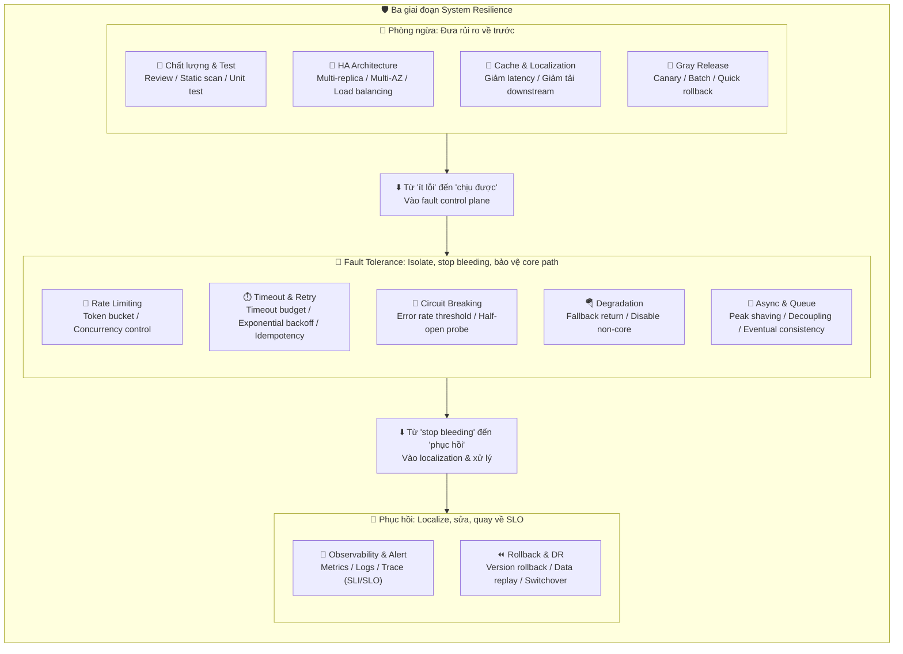

## High Availability là gì? Tiêu chuẩn đánh giá availability là gì?

**High Availability (HA)** mô tả một hệ thống có thể khả dụng và cung cấp service cho chúng ta trong hầu hết thời gian. High availability có nghĩa là ngay cả khi xảy ra hardware failure hoặc system upgrade, service vẫn khả dụng.

Thông thường chúng ta dùng **bao nhiêu nines** để đánh giá availability của hệ thống. Ví dụ 99.9999% nghĩa là trong tổng thời gian vận hành hệ thống chỉ có 0.0001% thời gian là unavailable — đây là hệ thống có availability cực kỳ cao! Tất nhiên cũng có hệ thống nếu availability không tốt có thể không đạt được ngay cả một 9.

| Cấp availability | Phần trăm availability | Thời gian ngừng hoạt động/năm | Tình huống điển hình               |
| ---------------- | ---------------------- | ----------------------------- | ---------------------------------- |
| 1 nine           | 90%                    | 36.5 ngày                     | Blog cá nhân                       |
| 2 nines          | 99%                    | 3.65 ngày                     | Hệ thống doanh nghiệp thông thường |
| 3 nines          | 99.9%                  | 8.76 giờ                      | Online service                     |
| 4 nines          | 99.99%                 | 52.6 phút                     | Hệ thống giao dịch tài chính       |
| 5 nines          | 99.999%                | 5.26 phút                     | Hệ thống cấp viễn thông            |

Ngoài ra, system availability còn có thể đo bằng **tỷ lệ số lần thất bại của chức năng nào đó trên tổng số request**. Ví dụ request website 1000 lần, trong đó có 10 request thất bại thì availability là 99%.

**SLA (Service Level Agreement)** là cam kết chính thức giữa service provider và khách hàng, thường quy định rõ mục tiêu availability. Ví dụ cloud provider cam kết SLA 99.95% nghĩa là mỗi tháng cho phép tối đa khoảng 22 phút downtime.

## Tình huống nào gây hệ thống unavailable?

Nguyên nhân gây hệ thống unavailable có thể phân tích từ hai chiều **nội bộ** và **bên ngoài**:

**Nội bộ:**

1. **Code defect**: Như memory leak, deadlock, circular dependency, null pointer exception, v.v. — là một trong những nguyên nhân phổ biến nhất gây online incident.
2. **Architecture design defect**: Single point of failure, thiếu rate limiting protection, strong coupling giữa các service, v.v. — sẽ lộ ra khi traffic surge.
3. **Resource exhaustion**: CPU, memory, disk, connection pool, v.v. cạn kiệt sẽ trực tiếp gây service unavailable.
4. **Config error**: Thay đổi config sai (như database connection string, timeout config không phù hợp) có thể gây service anomaly.

**Bên ngoài:**

1. **Hardware failure**: Server down, disk corruption, network device failure, v.v.
2. **Traffic surge**: Lượng request user đột biến (như flash sale event) vượt quá capacity chịu đựng của hệ thống.
3. **Network attack**: Tấn công DDoS, CC attack, v.v. làm cạn kiệt tài nguyên hệ thống.
4. **Dependency service failure**: Database, cache, message queue, third-party API, v.v. unavailable.
5. **Thiên tai**: Mất điện data center, hỏa hoạn, động đất và các yếu tố bất khả kháng khác.

## Có những phương pháp nào để tăng system availability?

Phương pháp tăng system availability có thể xem xét từ ba giai đoạn **Phòng ngừa**, **Fault tolerance**, **Phục hồi**:

### Chú trọng chất lượng code, kiểm tra nghiêm ngặt

**Chất lượng code là nền tảng của system availability**. Vấn đề chất lượng code như memory leak, circular dependency rất phổ biến — đây là tổn hại cực lớn với system availability. Mọi người đều thích nói đến rate limiting, degradation, circuit breaking, nhưng kiểm soát từ nguồn gốc là chất lượng code mới là điều quan trọng cần làm đầu tiên.

Cách cải thiện chất lượng code? Thực dụng nhất là **Code Review** — đừng tiếc 1 tiếng mỗi ngày, tác dụng rất lớn!

Ngoài ra, một số công cụ thực sự có hiệu quả cải thiện chất lượng code:

- [Sonarqube](https://www.sonarqube.org/): Platform phân tích code tĩnh, có thể phát hiện code smell, security vulnerability và bug.
- [Arthas](https://arthas.aliyun.com/doc/) - công cụ chẩn đoán Java open source của Alibaba: Có thể troubleshoot JVM online, hỗ trợ hot update code.
- [Alibaba Java Code Guidelines](https://github.com/alibaba/p3c): Plugin IDEA đi kèm, kiểm tra code spec real-time.
- Các công cụ code analysis có sẵn của IDEA.

### Dùng Cluster, giảm single point of failure

**Single Point of Failure (SPOF)** là kẻ thù lớn của high availability. Lấy Redis thường dùng làm ví dụ! Làm thế nào đảm bảo Redis cache high availability? Câu trả lời là dùng cluster, tránh single point of failure.

Khi dùng một Redis instance làm cache, nếu Redis instance này down thì toàn bộ cache service có thể down theo. Sau khi dùng cluster, dù một Redis instance down, chưa đến một giây đã có Redis instance khác thay thế.

Các cluster mode phổ biến:

- **Master-Slave Replication**: Một master nhiều slave. Master chịu trách nhiệm write, slave chịu trách nhiệm read. Khi master fail cần failover thủ công hoặc nhờ sentinel.
- **Sentinel Mode**: Thêm sentinel node trên cơ sở master-slave replication, triển khai automatic fault detection và failover.
- **Distributed Cluster**: Data sharding lưu trên nhiều node, mỗi shard có master-slave replica — vừa high availability vừa horizontal scaling.

### Rate Limiting

**Rate Limiting** là tuyến phòng thủ đầu tiên bảo vệ hệ thống. Nguyên lý là monitor các chỉ số như QPS hay concurrent thread count của application traffic. Khi đạt ngưỡng được chỉ định thì kiểm soát traffic, tránh bị traffic spike tức thời đánh sập, từ đó đảm bảo high availability của application. — Từ wiki của [alibaba-Sentinel](https://github.com/alibaba/Sentinel).

Các rate limiting algorithm phổ biến:

- **Fixed Window Counter**: Triển khai đơn giản nhưng có vấn đề spike tại boundary.
- **Sliding Window Counter**: Giải quyết vấn đề boundary của fixed window, mượt mà hơn.
- **Leaky Bucket**: Xử lý request với tốc độ cố định, phù hợp với traffic shaping.
- **Token Bucket**: Cho phép một mức độ burst traffic nhất định, linh hoạt hơn.

### Cài đặt Timeout và Retry mechanism

Khi user request không nhận được response trong một khoảng thời gian, throw exception. Điều này rất quan trọng — nhiều online incident là do **không cài đặt timeout hoặc cài đặt timeout sai cách**.

Đặc biệt thích hợp cài đặt timeout và retry mechanism khi đọc third-party service. Thường khi dùng các RPC framework, các framework này đều có sẵn cấu hình timeout retry. Nếu không cài đặt timeout có thể gây response chậm, thậm chí dẫn đến request backlog khiến hệ thống không thể xử lý thêm request.

**Số lần retry thường đặt là 3 lần** — nhiều hơn không có lợi mà còn tăng tải server (một số tình huống dùng failure retry mechanism không phù hợp). Đồng thời retry cần kết hợp chiến lược **exponential backoff** để tránh retry storm.

### Circuit Breaking Mechanism

Ngoài timeout và retry mechanism, **circuit breaking mechanism** cũng rất quan trọng. Circuit breaking là hệ thống tự động thu thập thông tin sử dụng tài nguyên và performance metric của service phụ thuộc. Khi service phụ thuộc xấu đi hoặc số lần call fail đạt ngưỡng nhất định thì fail nhanh, để hệ thống hiện tại ngay lập tức switch sang service backup khác.

Circuit breaker có ba trạng thái:

- **Closed (Đóng)**: Trạng thái bình thường, request đi qua bình thường.
- **Open (Mở)**: Trạng thái circuit broken, request fail thẳng, không call downstream service.
- **Half-Open (Nửa mở)**: Trạng thái thử phục hồi, cho qua một lượng nhỏ request để probe xem downstream service có phục hồi không.

Các traffic control và circuit breaking/degradation framework phổ biến là Hystrix của Netflix và Sentinel của Alibaba.

### Degradation (Giảm chức năng)

**Degradation** là khi áp lực hệ thống quá lớn hoặc một phần service unavailable, tạm thời tắt một số non-core feature để đảm bảo availability của core feature.

Các chiến lược degradation:

- **Feature degradation**: Tắt các non-core feature như recommendation, comment, v.v.
- **Data degradation**: Trả về cached data hoặc default data thay vì query real-time.
- **Page degradation**: Trả về static page hoặc simplified page.

### Async Call

Với async call chúng ta không cần quan tâm đến kết quả cuối cùng, như vậy có thể trả về kết quả ngay lập tức sau khi hoàn thành user request. Xử lý cụ thể có thể làm sau. Tình huống flash sale dùng cách này khá nhiều.

Nhưng sau khi dùng async có thể cần **điều chỉnh business flow phù hợp**. Ví dụ **sau khi user submit order, không thể ngay lập tức trả về thành công — cần sau khi order consumer process trong message queue thực sự xử lý xong order đó, thậm chí sau khi xuất kho, mới thông báo qua email hoặc SMS cho user rằng order thành công**.

Ngoài triển khai async trong chương trình, chúng ta thường còn dùng **message queue**. Message queue có thể tăng system performance qua async processing (peak shaving, giảm response time) và giảm system coupling.

### Dùng Cache

Nếu hệ thống có concurrency cao, nếu chỉ dùng database thì khi lượng lớn request trực tiếp đến database — database có thể down ngay. Dùng cache để cache hot data vì cache lưu trong memory nên tốc độ cực nhanh!

Tình huống ứng dụng điển hình của cache:

- **Hot data cache**: Đưa data truy cập thường xuyên vào Redis hay cache khác.
- **Page cache**: Cache trang đã render để giảm tải server.
- **Local cache**: Dùng Caffeine, Guava Cache, v.v. local cache để giảm network overhead.

### Khác

- **Core application và service ưu tiên dùng hardware tốt hơn**: Core service dùng server cấu hình cao hơn, SSD, v.v.
- **Monitor resource usage của hệ thống, thêm cảnh báo**: Dùng Prometheus + Grafana hay monitoring solution khác, đặt ngưỡng cảnh báo hợp lý.
- **Chú ý backup, rollback khi cần thiết**: Database backup định kỳ, code version có thể trace, hỗ trợ rollback nhanh.
- **Gray Release**: Chia server cluster thành nhiều phần. Mỗi ngày chỉ release một phần server, quan sát chạy ổn định không có incident, ngày hôm sau tiếp tục release một phần. Kéo dài vài ngày cho đến khi release hết toàn bộ cluster. Trong thời gian đó nếu phát hiện vấn đề, chỉ cần rollback phần server đã release.
- **Định kỳ kiểm tra/thay thế hardware**: Nếu không dùng cloud service, cần định kỳ kiểm tra hardware. Với hardware cần thay thế hoặc upgrade thì cần xử lý kịp thời.
