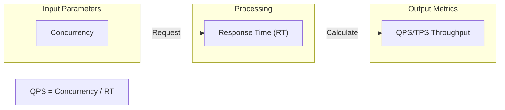
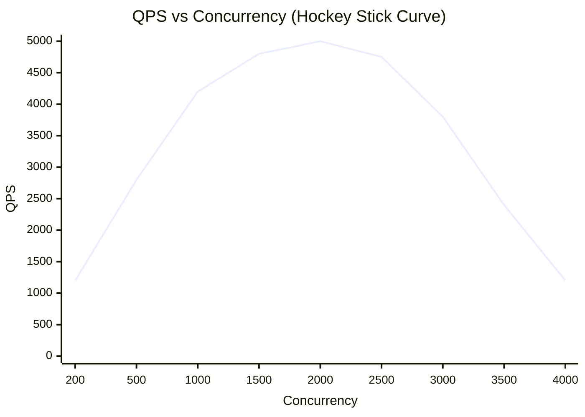

Performance testing thường do vai trò tester làm. Vậy developer học điều này để làm gì? Hiểu biết về metrics, phân loại và tool của performance testing giúp chúng ta viết code có hiệu năng tốt hơn. Ngoài ra, với vai trò developer, nếu bạn biết performance testing, chắc chắn cũng tăng điểm đáng kể cho hồ sơ của bạn.

Bài này tôi kết hợp kinh nghiệm thực tế của bản thân và kiến thức học từ bộ phận testing, ngoài ra còn tham khảo một số sách tốt — hy vọng có ích cho bạn.

## Các role khác nhau nhìn về website performance

### User

Khi user mở một website, họ quan tâm nhất điều gì? Tất nhiên là **tốc độ response của website**. Ví dụ chúng ta click vào trang chủ Taobao, Taobao cần bao lâu để hiển thị nội dung trang chủ, click nút submit order cần bao lâu để trả kết quả, v.v.

Vì vậy khi user trải nghiệm hệ thống, họ thường đánh giá hiệu năng website dựa trên tốc độ response của bạn.

### Developer

User và developer đều quan tâm đến tốc độ — tốc độ này thực ra là **tốc độ hệ thống xử lý request của user**.

Developer thường khó đánh giá trực quan hiệu năng website của mình. Chúng ta thường đưa ra giá trị ước lượng dựa trên kiến trúc hiện tại và tình hình infrastructure, ví dụ:

1. Kiến trúc project có phải distributed không?
2. Có dùng cache và message queue không?
3. Business có high concurrency có xử lý đặc biệt không?
4. Thiết kế database có hợp lý không?
5. Algorithm trong hệ thống có cần tối ưu không?
6. Hệ thống có vấn đề memory leak không?
7. Redis cache project dùng có dung lượng bao nhiêu? Server performance thế nào? Dùng HDD hay SSD?
8. ……

### Tester

Tester thường dùng performance testing tool để test, rồi thường tạo một bảng. Bảng này có thể bao gồm các nội dung quan trọng sau:

1. Response time
2. Request success rate
3. Throughput
4. ……

### Ops

Ops có xu hướng đánh giá hiệu năng website dựa trên **sử dụng infrastructure và resource utilization**, như server resource sử dụng có hợp lý không, có lạm dụng database resource không. Tất nhiên đây là traditional ops — sau khi DevOps nổi lên, ít người thuần ops hơn. Ở đây tạm giữ role này.

## Các điểm cần chú ý trong Performance Testing

Hầu như không có bài nào khi nói về performance testing đề cập đến điều này. Mọi người đều nói cách performance test, có những performance testing metric nào.

### Hiểu business scenario của hệ thống

**Trước performance testing cần bạn hiểu rõ business scenario của hệ thống hiện tại hơn.** Nếu không đủ hiểu business của hệ thống, chúng ta rất dễ mắc lỗi sai hướng khi test, từ đó bỏ qua việc test những nơi hệ thống thực sự cần performance testing hơn.

Ví dụ hệ thống có thể cung cấp chức năng gửi email cho user. User cấu hình thành công mailbox thì chỉ cần nhập email tương ứng là có thể gửi. Hệ thống mỗi ngày có thể xử lý hàng chục nghìn request gửi email. Nhiều người thấy điều này có thể trực tiếp dùng công cụ test interface gửi email. Nhưng tình huống gửi email có thể không phải bottleneck performance của hệ thống hiện tại. Có nhiều người dùng hệ thống để gửi email, còn có nhiều người cùng gửi email, tình huống này đã có nhiều người dùng như vậy rồi — vậy user management mới có thể là bottleneck!

### Historical data rất có ích

Historical data mà hệ thống hiện tại để lại rất quan trọng. Thông thường qua một số historical data chúng ta có thể sơ bộ xác định interface nào được gọi nhiều nhất, service nào chịu áp lực lớn nhất. Như vậy có thể thực hiện performance testing và analysis chi tiết hơn tại những nơi đó.

Ngoài ra, những nơi này cũng như điểm yếu của hệ thống — tối ưu tốt những nơi này sẽ mang lại cải thiện đáng kể cho hệ thống.

## Các Performance Metric phổ biến

Performance metric là tiêu chuẩn đo lường cốt lõi của system performance. Hiểu mối quan hệ giữa các metric rất quan trọng cho performance analysis.

### Response Time (Thời gian phản hồi)

**Response Time (RT)** là thời gian từ khi user gửi request đến khi nhận kết quả hệ thống xử lý, bao gồm các giai đoạn như network transmission, server processing và client rendering.

**Response Time Metrics (Latency Percentiles)**: Trong production environment nhìn average RT không có ý nghĩa gì. Phải monitor **P90, P99 và P999** percentile. Ví dụ P99 = 500ms nghĩa là 99% request trả về trong 500ms. Còn 1% long-tail slow call (có thể do Cache Miss, slow SQL hay GC STW gây ra) trong high concurrency cực cao sẽ gây queuing effect, ngay lập tức fill đầy thread pool tầng dưới của gateway hay RPC framework, trực tiếp gây cascading failure. Lượng lớn response cực nhanh kéo thấp average, che giấu vấn đề long-tail chết người — đây là **"average trap"** điển hình.

Tiêu chuẩn tham khảo percentile:

| Percentile | RT Range (example) | Mô tả                                          |
| ---------- | ------------------ | ---------------------------------------------- |
| P90        | < 200ms            | 90% request trả về trong thời gian này         |
| P99        | < 500ms            | Trọng tâm cần chú ý, long-tail user experience |
| P999       | < 1s               | Extreme scenario, dễ trigger cascading failure |

> **Failure mode**: Khi xảy ra network occasional jitter, P999 RT sẽ tăng vọt đột ngột. Nếu upstream thiếu timeout truncation mechanism (Timeout & Circuit Breaking), lượng lớn concurrent request sẽ bị hang, dẫn đến upstream node OOM.

### Concurrency (Số lượng đồng thời)

**Concurrency có thể hiểu đơn giản là hệ thống có thể phục vụ bao nhiêu người cùng lúc — tức số lượng request hệ thống có thể xử lý đồng thời.**

Concurrency phản ánh **load capacity** của hệ thống. Cần phân biệt các khái niệm sau:

- **Concurrent users**: Số lượng user online cùng lúc.
- **Concurrent requests**: Số request hệ thống đang xử lý tại cùng thời điểm.
- **Max concurrency**: Số concurrent request tối đa hệ thống có thể chịu đựng. Vượt quá giá trị này hệ thống có thể giảm hiệu năng hoặc crash.

### QPS và TPS

- **QPS (Query Per Second)**: Số lần query server có thể thực thi mỗi giây.
- **TPS (Transaction Per Second)**: Số transaction server xử lý mỗi giây (một thao tác business hoàn chỉnh).

> QPS vs TPS: Một lần page access tạo ra 1 TPS nhưng có thể sinh ra nhiều request đến server (tính vào QPS). **TPS nghiêng về business perspective, QPS nghiêng về technical perspective.**

### Throughput (Thông lượng)

**Throughput** là số lượng request hệ thống xử lý trên mỗi đơn vị thời gian. TPS, QPS là các chỉ số lượng hóa thường dùng.

**Little's Law (Định luật Little)**: Trong steady state chưa bão hòa: `Concurrency = QPS × RT`, hay `QPS = Concurrency / RT`. Công thức chỉ valid khi hệ thống ở linear response range. Khi concurrent users tiếp tục tăng, CPU scheduling consumption và lock contention trở nên căng thẳng, RT tăng theo **hàm mũ**. Sau khi throughput đạt điểm uốn sẽ giảm mạnh, tạo thành **Hockey Stick Curve** điển hình. Hình dưới cho thấy trực quan "tại sao không thể tính cứng bằng công thức": Sau điểm uốn QPS không tăng mà còn giảm — hệ thống đã vào vùng phi tuyến.

Do đó tuyệt đối không thể chỉ dựa vào công thức để ước tính production capacity — phải validate giới hạn thực sự qua full-link stress test.

## System Activity Metrics

### PV (Page View)

**Lượt truy cập** — số lần page được xem hoặc click, đo lường số trang web user truy cập. Trong một statistical period nhất định, mỗi khi user mở hoặc refresh một page sẽ tính 1 lần. Mở hoặc refresh cùng page nhiều lần thì tích lũy page views. PV được tính từ số lần page được mở/refresh.

### UV (Unique Visitor)

**Unique visitor** — thống kê số user truy cập một site trong 1 ngày. Trong 1 ngày cùng visitor truy cập website nhiều lần chỉ tính là 1 unique visitor. UV được tính từ góc độ individual user.

### DAU (Daily Active User)

**Số lượng daily active user** — số user login hoặc sử dụng sản phẩm trong một ngày (deduplicated).

### MAU (Monthly Active Users)

**Số lượng monthly active user** — số user login hoặc sử dụng sản phẩm trong một tháng (deduplicated).

### Ví dụ tính toán thực tế

> **Production-level capacity estimation**: Tuyệt đối không thể nhân DAU với hệ số cố định để ước tính peak value. Peak value thực tế thường đến từ tình huống business cụ thể (như flash sale đầu giờ, big event bắt đầu grab). Khi concurrent users (Virtual Users) tiếp tục tăng, CPU scheduling consumption và lock contention của hệ thống trở nên căng thẳng, RT tăng theo hàm mũ. Lúc này throughput sẽ đạt inflection point và giảm mạnh. Phải thông qua **full-link stress test** (kết hợp real traffic recording và replay, như [GoReplay](https://goreplay.org/)) để xác định giới hạn throughput thực sự, không phải dùng công thức trên giấy.

## Phân loại Performance Testing

| Loại test               | Mục đích                                               | Phương pháp test                                                         |
| ----------------------- | ------------------------------------------------------ | ------------------------------------------------------------------------ |
| **Performance testing** | Verify system performance có đáp ứng kỳ vọng không     | Verify dưới performance metric đã biết                                   |
| **Load testing**        | Tìm performance upper limit của hệ thống               | Tăng dần áp lực đến khi resource bão hòa                                 |
| **Stress testing**      | Test extreme, back pressure và self-healing capability | Tiếp tục tăng áp lực để verify hành vi sau crash (429/503, self-healing) |
| **Stability testing**   | Verify hệ thống chạy ổn định trong thời gian dài       | Mô phỏng tình huống thực chạy liên tục                                   |

**Ranh giới water level giữa Load testing và Stress testing**: Sự khác biệt ở "tăng áp lực đến đâu thì dừng". Load testing dừng ở **resource saturation line** (tìm upper limit). Stress testing tiếp tục tăng áp lực **vượt qua saturation line** đến khi crash và verify back pressure và self-healing.

### Performance Testing

Phương pháp performance testing là dùng testing tool để mô phỏng user request hệ thống. Mục đích chủ yếu là test xem system performance có đáp ứng yêu cầu không. Nói đơn giản, phương pháp này là verify trạng thái năng lực của hệ thống trong điều kiện vận hành cụ thể.

Performance testing được thực hiện **sau khi bạn đã hiểu về system performance**, và có performance metric rõ ràng.

### Load Testing

Tiếp tục tăng request pressure lên hệ thống được test cho đến khi một số resource của server đã đạt bão hòa — ví dụ cache của hệ thống không đủ dùng hoặc response time không đáp ứng yêu cầu nữa.

**Load testing nói thẳng ra là test upper limit của hệ thống.**

### Stress Testing

Không quan tâm đến tình hình sử dụng resource của hệ thống, tiếp tục tăng request pressure lên hệ thống **cho đến khi hệ thống crash**. Mục tiêu cốt lõi của stress testing không chỉ là tìm crash point mà còn verify **back pressure (Backpressure) fault tolerance** của hệ thống khi bị overload. Khi concurrency vượt quá load limit, phải verify hệ thống có thể chủ động chặn traffic (như trả về HTTP 429 Too Many Requests, 503 Service Unavailable), tránh node freeze. Đồng thời cần verify sau khi loại bỏ traffic vượt ngưỡng, hệ thống có tự động release hung connection và phục hồi về throughput bình thường không (**self-healing**). Việc verify "behavior after crash" này là best practice của chaos engineering và HA architecture.

### Stability Testing

Mô phỏng tình huống thực, đặt một mức áp lực nhất định lên hệ thống, xem business có chạy ổn định không. Stability testing thường cần chạy trong thời gian dài (như 7×24 giờ), quan sát xem hệ thống có **memory leak, connection leak** hay không.

## Các công cụ Performance Testing phổ biến

### Thường dùng cho Backend

Vì system design liên quan đến system performance, trong phỏng vấn phỏng vấn viên rất có thể sẽ hỏi: **Bạn thực hiện performance testing như thế nào?**

Khuyến nghị 4 công cụ performance testing khá phổ biến:

| Tool           | Language | Đặc điểm                                                          | Tình huống áp dụng                               |
| -------------- | -------- | ----------------------------------------------------------------- | ------------------------------------------------ |
| **JMeter**     | Java     | Tính năng toàn diện, hỗ trợ GUI và command line, plugin phong phú | Test tình huống phức tạp, enterprise application |
| **Gatling**    | Scala    | Dựa trên Akka, code-driven, report đẹp                            | High concurrency scenario, CI/CD integration     |
| **ab**         | C        | Nhẹ và đơn giản, đi kèm Apache                                    | Quick interface test, benchmark test             |
| **LoadRunner** | -        | Commercial software, tính năng mạnh                               | Enterprise large-scale test                      |

Nếu không nhớ nhầm, trừ **LoadRunner**, các công cụ performance testing còn lại đều là open source miễn phí.

**Gợi ý lựa chọn:**

- **Quick verification**: Dùng `ab` hay `wrk` để stress test interface đơn giản.
- **Complex scenarios**: Dùng `JMeter`, hỗ trợ record script, parameterization, assertion.
- **Code-driven**: Dùng `Gatling`, phù hợp với developer, dễ version control và CI integration.

### Thường dùng cho Frontend

1. **Fiddler**: Packet capture tool. Có thể modify request data, thậm chí modify data server trả về. Tính năng rất mạnh, là lợi khí Web debugging.
2. **HttpWatch**: Tool có thể record HTTP request information.

## Các chiến lược Performance Optimization phổ biến

Trước khi performance optimize cần phân tích các giai đoạn mà request đi qua, xác định các nơi có thể có performance bottleneck, định vị vấn đề.

Dưới đây là một số câu hỏi tự hỏi bản thân khi performance optimize mà tôi thường dùng:

| Hướng tối ưu     | Checklist                                                                                           |
| ---------------- | --------------------------------------------------------------------------------------------------- |
| **Cache**        | Hệ thống có cần cache không? Hot data đã được cache chưa?                                           |
| **Architecture** | Bản thân kiến trúc hệ thống có vấn đề không? Có cần read-write separation, database sharding không? |
| **Concurrency**  | Hệ thống có deadlock không? Lock granularity có hợp lý không?                                       |
| **Memory**       | Hệ thống có memory leak không? GC có frequent không?                                                |
| **Database**     | Database index sử dụng có hợp lý không? Có slow SQL không?                                          |
| **Algorithm**    | Time complexity của core algorithm có thể tối ưu không?                                             |
| **IO**           | Có network call không cần thiết không? Có thể batch operation không?                                |
