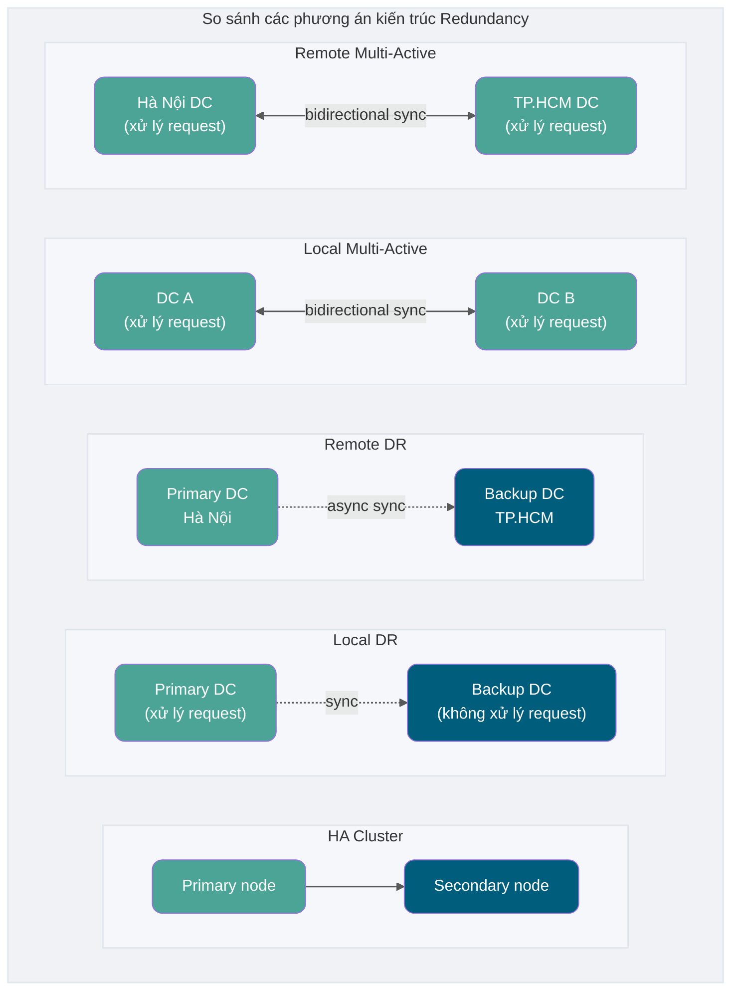

## Redundancy là gì?

**Redundancy (Dự phòng)** là biện pháp phổ biến nhất để đảm bảo high availability của hệ thống và data. Tư tưởng cốt lõi là **deploy nhiều bản sao của cùng resource. Khi một bản sao bị lỗi, các bản sao khác có thể tiếp quản công việc, đảm bảo hệ thống tiếp tục khả dụng**.

Redundancy design có thể hiểu từ các chiều sau:

| Loại redundancy           | Mô tả                                         | Triển khai điển hình                                                 |
| ------------------------- | --------------------------------------------- | -------------------------------------------------------------------- |
| **Hardware redundancy**   | Deploy nhiều bản thiết bị hardware quan trọng | Dual power supply, dual NIC, RAID disk array                         |
| **Software redundancy**   | Deploy nhiều instance application service     | Cluster deployment, containerized multi-replica                      |
| **Data redundancy**       | Lưu nhiều bản sao data                        | Database master-slave replication, distributed storage multi-replica |
| **Network redundancy**    | Redundancy cho network link và thiết bị       | Multi-ISP access, active-active load balancing                       |
| **Geographic redundancy** | Deploy hệ thống ở các vị trí địa lý khác nhau | Local disaster recovery, remote multi-active                         |

Với **service**, tư tưởng redundancy là deploy nhiều bản sao service giống nhau. Nếu service đang dùng đột ngột down, hệ thống có thể nhanh chóng chuyển sang backup service, giảm đáng kể thời gian unavailable của hệ thống và tăng availability.

Với **data**, tư tưởng redundancy là backup nhiều bản sao data — có thể đơn giản tăng cường data security.

Thực tế trong cuộc sống hàng ngày có rất nhiều ứng dụng của tư tưởng redundancy. Lấy bản thân tôi làm ví dụ: cách lưu file quan trọng của tôi chính là ứng dụng tư tưởng redundancy. Các file quan trọng dùng hàng ngày đều được sync lên GitHub và personal cloud drive, đảm bảo dù HDD máy tính bị hỏng vẫn có thể lấy lại file quan trọng qua GitHub hoặc cloud drive.

## Chỉ số cốt lõi disaster recovery: RTO và RPO

Trước khi thảo luận về disaster recovery architecture, cần hiểu hai chỉ số cốt lõi:

- **RPO (Recovery Point Objective — Mục tiêu điểm phục hồi)**: **Lượng data mất tối đa có thể chấp nhận** — tức data từ lần backup cuối đến khi sự cố xảy ra. RPO = 0 nghĩa là không cho phép mất bất kỳ data nào.
- **RTO (Recovery Time Objective — Mục tiêu thời gian phục hồi)**: **Thời gian phục hồi tối đa có thể chấp nhận** — tức từ khi sự cố xảy ra đến khi hệ thống phục hồi service bình thường. RTO = 0 nghĩa là service không thể gián đoạn.

| Phương án kiến trúc      | RPO                     | RTO                | Chi phí    |
| ------------------------ | ----------------------- | ------------------ | ---------- |
| Single node không backup | Có thể mất tất cả       | Không dự đoán được | Thấp       |
| Local backup             | Phụ thuộc chu kỳ backup | Giờ                | Thấp       |
| Local DR                 | Phút                    | Phút~giờ           | Trung bình |
| Remote DR                | Phút~giờ                | Giờ                | Trung cao  |
| Local multi-active       | Giây                    | Giây               | Cao        |
| Remote multi-active      | Giây                    | Giây               | Rất cao    |

## So sánh các phương án kiến trúc Redundancy

HA Cluster (High Availability Cluster), local disaster recovery, remote disaster recovery, local multi-active và remote multi-active là các ứng dụng điển hình nhất của tư tưởng redundancy trong thiết kế hệ thống high availability.

### HA Cluster (High Availability Cluster)

**HA Cluster** là deploy hai hoặc nhiều bản sao cùng một service. Khi service đang dùng đột ngột down có thể chuyển sang server khác, đảm bảo high availability của service.

HA Cluster có hai mode phổ biến:

| Mode                              | Mô tả                                           | Ưu điểm                                                    | Nhược điểm                                      |
| --------------------------------- | ----------------------------------------------- | ---------------------------------------------------------- | ----------------------------------------------- |
| **Active-Standby (Chủ-Dự phòng)** | Primary node cung cấp service, standby node chờ | Đơn giản, data consistency tốt                             | Resource utilization thấp, standby node nhàn    |
| **Active-Active (Chủ-Chủ)**       | Nhiều node cùng cung cấp service                | Resource utilization cao, không có single point of failure | Data sync phức tạp, có thể có consistency issue |

HA Cluster chỉ là redundancy về service, **không nhấn mạnh về địa lý**. Local DR, remote DR, local multi-active và remote multi-active triển khai redundancy về địa lý.

### Local Disaster Recovery (Đồng thành phố)

**Local DR** là deploy toàn bộ cluster trong cùng một data center, còn trong local DR thì service giống nhau được deploy trong **các data center khác nhau ở cùng thành phố**. Hơn nữa, **backup service không xử lý request**. Điều này tránh được các sự cố tại data center như mất điện, hỏa hoạn.

- **Tình huống áp dụng**: Doanh nghiệp yêu cầu RTO cao (phút), chi phí hạn chế.
- **Cấu hình điển hình**: Hai data center cách nhau 30~100km, kết nối qua dedicated line.

### Remote Disaster Recovery (Dị địa)

**Remote DR** tương tự local DR, điểm khác là service giống nhau được deploy trong **các data center ở địa điểm khác nhau (thường cách xa, thậm chí ở thành phố hoặc quốc gia khác)**.

- **Tình huống áp dụng**: Hệ thống nghiệp vụ cốt lõi cần phòng ngừa thảm họa khu vực (động đất, lũ lụt).
- **Thách thức**: Network latency lớn, data sync thường dùng async — có thể mất data.

### Local Multi-Active (Đồng thành phố đa hoạt)

**Local multi-active** tương tự local DR, nhưng **backup service có thể xử lý request** — tận dụng đầy đủ tài nguyên hệ thống, tăng concurrency.

- **Tình huống áp dụng**: Hệ thống yêu cầu cả hiệu năng và availability cao.
- **Kỹ thuật cốt lõi**: Cần giải quyết data sync, traffic scheduling, session management, v.v.

### Remote Multi-Active (Dị địa đa hoạt)

**Remote multi-active** deploy service trong **các data center ở địa điểm khác nhau** và **cùng cung cấp service ra ngoài đồng thời**.

So với thiết kế disaster recovery truyền thống, thay đổi rõ ràng nhất của local multi-active và remote multi-active là **"multi-active"** — tất cả site đều cùng lúc cung cấp service. Remote multi-active nhằm đối phó với các tình huống đột xuất như hỏa hoạn, động đất và các thiên tai hay nhân tai khác.

Sự khác biệt chính giữa local và remote là **khoảng cách giữa các data center**. Remote thường cách xa hơn, thậm chí ở thành phố hoặc quốc gia khác.

## Cơ chế Failover

Chỉ làm tốt redundancy là chưa đủ — phải kết hợp với **Failover (Chuyển đổi lỗi)** mới được! Failover nói đơn giản là **tự động và nhanh chóng chuyển service unavailable sang service available mà không cần con người can thiệp**.

Failover thường gồm các bước sau:

1. **Fault detection (Phát hiện lỗi)**: Phát hiện fault node qua heartbeat detection, health check, v.v.
2. **Fault confirmation (Xác nhận lỗi)**: Tránh false positive — thường cần nhiều lần detect để xác nhận.
3. **Fault switch (Chuyển đổi lỗi)**: Chuyển traffic sang backup node.
4. **Fault notification (Thông báo lỗi)**: Gửi alert thông báo cho ops.
5. **Fault recovery (Phục hồi lỗi)**: Sau khi fault node phục hồi sẽ tái gia nhập cluster.

### Ví dụ Redis Sentinel Mode

Trong Redis cluster sử dụng Sentinel mode, nếu Sentinel phát hiện master node bị lỗi, nó sẽ thực hiện failover, tự động nâng một slave lên thành master, đảm bảo availability của toàn bộ Redis system. Toàn bộ quá trình hoàn toàn tự động, không cần can thiệp thủ công.

### Ví dụ Nginx + Keepalived

Nginx có thể kết hợp với Keepalived để đạt high availability. Nếu Nginx primary server down, Keepalived có thể tự động failover — backup Nginx server được nâng lên thành primary. Và sự chuyển đổi này là transparent với bên ngoài vì dùng **VIP (Virtual IP)** — virtual IP không thay đổi.

## Thách thức của Remote Multi-Active

Kiến trúc remote multi-active rất khó triển khai — cần xem xét nhiều yếu tố:

| Thách thức             | Mô tả                                                 | Hướng giải quyết                                    |
| ---------------------- | ----------------------------------------------------- | --------------------------------------------------- |
| **Data consistency**   | Làm thế nào giữ data nhất quán giữa các DC            | Eventual consistency, conflict resolution mechanism |
| **Network latency**    | Network latency giữa các remote DC cao                | Local access, data partitioning                     |
| **Traffic scheduling** | Làm thế nào phân phối request của user đến DC phù hợp | DNS intelligent resolution, GSLB                    |
| **Session management** | Làm thế nào chia sẻ user session giữa các DC          | Distributed session, stateless design               |
| **Cost**               | Chi phí xây dựng và vận hành multi-DC cao             | Deploy theo mức độ quan trọng của nghiệp vụ         |

Nếu muốn học sâu hơn về remote multi-active, khuyến nghị các tài liệu sau:

- [Hiểu sâu remote multi-active, đọc bài này là đủ - Shui Di Yu Yin Dan - 2021](https://mp.weixin.qq.com/s/T6mMDdtTfBuIiEowCpqu6Q)
- [Xây dựng remote multi-active trong 4 bước](https://mp.weixin.qq.com/s/hMD-IS__4JE5_nQhYPYSTg)
- [《Học Architecture từ Zero》— 28 | Đảm bảo High Availability nghiệp vụ: Remote Multi-Active Architecture](http://gk.link/a/10pKZ)

<!-- @include: @article-footer.snippet.md -->
