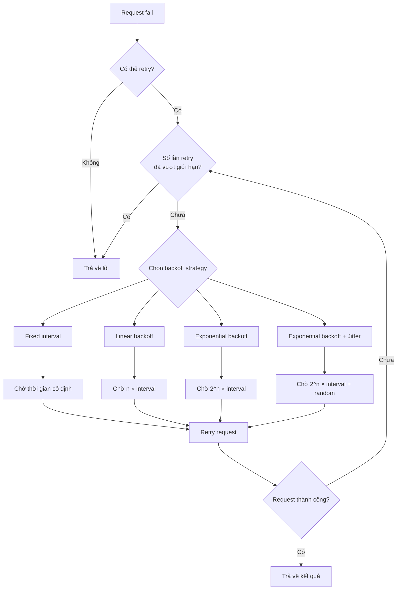

Do sự không chắc chắn của các vấn đề như network issue, bug trong system/service, server down, OS crash — hệ thống hay service không bao giờ có thể đảm bảo luôn ở trạng thái available.

Để giảm tối đa ảnh hưởng khi system hay service gặp sự cố, chúng ta cần dùng cơ chế **Timeout (Thời gian chờ)** và **Retry (Thử lại)**.

Thực ra giải thích rõ timeout và retry rất đơn giản vì bản thân chúng không phải khái niệm cao siêu gì.

Dù tư tưởng của timeout và retry đơn giản, nhưng chúng thực sự rất thực dụng. Hầu hết hệ thống hay service liên quan đến remote call mà bạn tiếp xúc hàng ngày đều áp dụng timeout và retry mechanism. Đặc biệt với microservice system, cài đặt đúng timeout và retry rất quan trọng. Monolithic service thường chỉ liên quan đến network call của database, cache, third-party API, middleware, v.v. Còn microservice system còn có network call giữa các service nội bộ với nhau.

## Timeout Mechanism

### Timeout mechanism là gì?

**Timeout mechanism** là khi một request vượt quá thời gian chỉ định (như 1s) mà chưa được xử lý, request đó sẽ bị cancel trực tiếp và throw exception hoặc error được chỉ định (như `504 Gateway Timeout`).

Timeout chúng ta thường gặp có thể chia đơn giản thành 2 loại sau:

| Loại timeout           | Mô tả                                                                                  | Giá trị khuyến nghị |
| ---------------------- | -------------------------------------------------------------------------------------- | ------------------- |
| **Connection Timeout** | Thời gian chờ tối đa để client và server thiết lập kết nối                             | 1000ms ~ 5000ms     |
| **Read Timeout**       | Sau khi client và server đã kết nối, thời gian chờ tối đa để server xử lý xong request | 1000ms ~ 3000ms     |

Trong project thực tế, chúng ta quan tâm nhiều hơn đến **read timeout**. Một số connection pool client framework còn có **connection acquisition timeout** và **idle connection cleanup timeout**.

### Tại sao cần timeout mechanism?

Nếu không cài đặt timeout, có thể dẫn đến vấn đề **số lượng connection server bùng nổ** và **lượng lớn request bị backlog**.

Các connection và request bị backlog này tiêu thụ tài nguyên hệ thống, ảnh hưởng đến xử lý các request mới nhận. Trường hợp nghiêm trọng, có thể kéo sập toàn bộ system hoặc service.

> Tôi đã gặp vấn đề tương tự trong project thực tế — toàn bộ website không thể xử lý request bình thường, server load gần như bị kéo lên tối đa. Sau đó phát hiện nguyên nhân là cài đặt timeout sai cộng với xử lý exception bất thường phía client, dẫn đến số connection phía server gần chạm 400k+. Lượng connection backlog đó đã đánh sập toàn hệ thống.

### Timeout nên cài đặt bao lâu?

Timeout nên cài bao lâu là một bài toán khó! **Đặt timeout quá cao hay quá thấp đều có rủi ro**:

| Cách cài đặt | Rủi ro                                                                                                                                      |
| ------------ | ------------------------------------------------------------------------------------------------------------------------------------------- |
| **Quá cao**  | Giảm hiệu quả của timeout mechanism, system vẫn có thể bị backlog lượng lớn slow request                                                    |
| **Quá thấp** | Khi system xử lý chậm lại (như request đột ngột tăng), lượng lớn request timeout retry làm tăng áp lực system, có thể gây cascading failure |

Thông thường chúng ta khuyến nghị:

- **Read timeout**: Đặt **1500ms** — đây là giá trị khá phổ quát. Nếu system nhạy cảm với latency có thể rút ngắn. Ngược lại có thể tăng nhưng tốt nhất không vượt quá **3000ms**.
- **Connection timeout**: Có thể đặt dài hơn một chút, khuyến nghị trong khoảng **1000ms ~ 5000ms**.

**Không có silver bullet!** Timeout value cụ thể nên đặt bao nhiêu vẫn cần điều chỉnh tối ưu dần dựa trên nhu cầu và tình trạng thực tế của project.

Cao hơn nữa, tham khảo tư tưởng [Dynamic Configuration của Java Thread Pool tại Meituan](https://tech.meituan.com/2020/04/02/java-pooling-pratice-in-meituan.html), chúng ta cũng có thể làm timeout thành **configurable parameter** thay vì cố định. Cách đơn giản là đặt timeout value vào configuration center. Như vậy có thể dynamic điều chỉnh timeout value theo trạng thái của system hoặc service.

## Retry Mechanism

### Retry mechanism là gì?

**Retry mechanism** thường được dùng cùng với timeout mechanism. Đây là việc **gửi lại cùng một request nhiều lần để tránh transient fault và occasional fault**.

- **Transient fault (Lỗi thoáng qua)**: Lỗi xảy ra nhất thời, không kéo dài.
- **Occasional fault (Lỗi thỉnh thoảng)**: Lỗi đôi khi xảy ra trong một số trường hợp nhất định, tần suất thường thấp.

Tư tưởng cốt lõi của retry là **tiêu thụ tài nguyên server để tăng xác suất request được xử lý thành công**. Vì transient fault và occasional fault xảy ra rất ít, resource consumption do retry gây ra cho server gần như có thể bỏ qua.

### Các retry strategy phổ biến là gì?



So sánh các retry strategy phổ biến:

| Strategy                         | Mô tả                                                      | Ưu điểm                           | Nhược điểm                   | Tình huống áp dụng                                              |
| -------------------------------- | ---------------------------------------------------------- | --------------------------------- | ---------------------------- | --------------------------------------------------------------- |
| **Fixed interval retry**         | Mỗi lần retry cách nhau cùng khoảng thời gian (như mỗi 1s) | Triển khai đơn giản               | Có thể gây retry storm       | Target system có thời gian phục hồi ổn định và có thể dự đoán   |
| **Linear backoff retry**         | Interval tăng tuyến tính (như 1s, 2s, 3s)                  | Nhẹ nhàng hơn fixed interval      | Tốc độ tăng tương đối chậm   | Tình huống thông thường                                         |
| **Exponential backoff retry**    | Interval tăng theo hàm mũ (như 1s, 2s, 4s, 8s)             | Tránh hiệu quả retry storm        | Thời gian chờ có thể quá dài | Target system có thời gian phục hồi dài hoặc không dự đoán được |
| **Exponential backoff + Jitter** | Thêm random jitter vào exponential backoff                 | Tránh nhiều client retry cùng lúc | Triển khai phức tạp hơn      | Khuyến nghị cho distributed system                              |

**Trong hầu hết trường hợp, khuyến nghị dùng exponential backoff + jitter strategy** — có thể tránh hiệu quả retry storm.

### Số lần retry nên cài đặt như thế nào?

Số lần retry không nên quá nhiều, ngược lại vẫn gây áp lực đáng kể lên system load.

**Số lần retry thường khuyến nghị là 3**. Ví dụ retry 3 lần:

- Sau lần request đầu thất bại, chờ 1 giây rồi retry.
- Sau lần request 2 thất bại, chờ 2 giây rồi retry.
- Sau lần request 3 thất bại, chờ 4 giây rồi retry.

### Rủi ro của Retry là gì?

Mặc dù retry mechanism có thể cải thiện availability của hệ thống, nhưng dùng không đúng cũng mang lại rủi ro:

| Rủi ro                  | Mô tả                                                                            | Cách phòng tránh                                 |
| ----------------------- | -------------------------------------------------------------------------------- | ------------------------------------------------ |
| **Retry storm**         | Lượng lớn client cùng retry, đánh tiếp vào downstream service                    | Dùng exponential backoff + jitter strategy       |
| **Cascading failure**   | Retry khiến upstream service cũng bắt đầu timeout retry, tạo phản ứng dây chuyền | Đặt retry budget, circuit breaking mechanism     |
| **Duplicate operation** | Non-idempotent operation bị thực thi trùng, gây data inconsistency               | Đảm bảo tính idempotent của thao tác             |
| **Resource waste**      | Retry vô ích đối với permanent fault                                             | Phân biệt retryable error và non-retryable error |

**Retry Budget (Ngân sách retry)** là chiến lược phòng tránh hiệu quả: Giới hạn tỷ lệ số lần retry trên tổng số request trong một time window nhất định, ví dụ không vượt quá 10%.

### Retry idempotency là gì?

Khi dùng timeout và retry mechanism trong project thực tế, cần chú ý đảm bảo **cùng một request không bị thực thi nhiều lần**.

Tình huống nào dẫn đến một request bị thực thi nhiều lần? Client chờ server hoàn thành request bị timeout, nhưng lúc đó server đã thực thi request rồi — chỉ là do network latency thoáng qua dẫn đến response bị delay trong quá trình gửi cho client.

> Ví dụ: User thanh toán mua một khóa học. Kết quả do vấn đề retry, user bị tính tiền hai lần cho cùng một khóa học. Với tình huống này, khi thực thi request mua khóa học của user cần kiểm tra xem user đã mua chưa. Như vậy sẽ không bị mua trùng do retry.

Các phương pháp phổ biến để đảm bảo idempotency:

| Phương pháp                    | Mô tả                                                               | Tình huống áp dụng        |
| ------------------------------ | ------------------------------------------------------------------- | ------------------------- |
| **Unique request ID**          | Mỗi request mang unique ID, server dedup                            | Tình huống tổng quát      |
| **Database unique constraint** | Dùng database unique index để ngăn insert trùng                     | Thao tác tạo mới          |
| **Optimistic lock**            | Kiểm soát update qua version number                                 | Thao tác update           |
| **State machine**              | Kiểm soát qua state transition, trạng thái đã xử lý không xử lý lại | Tình huống order, payment |

### Làm thế nào triển khai Retry trong Java?

Nếu muốn tự viết code để triển khai retry logic, có thể dùng loop (như while hay for) hoặc đệ quy. Tuy nhiên thường không khuyến nghị tự triển khai. Có nhiều third-party open source library cung cấp triển khai retry mechanism hoàn thiện hơn:

| Framework          | Đặc điểm                                                              | Tình huống áp dụng                  |
| ------------------ | --------------------------------------------------------------------- | ----------------------------------- |
| **Spring Retry**   | Spring ecosystem, annotation-driven, cấu hình đơn giản                | Spring project                      |
| **Resilience4j**   | Lightweight, functional style, hỗ trợ circuit breaking, rate limiting | Microservice project                |
| **Guava Retrying** | Cấu hình retry strategy linh hoạt                                     | Java project tổng quát              |
| **Failsafe**       | Hỗ trợ async retry, timeout, circuit breaking                         | Tình huống cần fine-grained control |

Ví dụ đơn giản dùng Spring Retry:

```java
@Retryable(
    value = {RemoteAccessException.class},
    maxAttempts = 3,
    backoff = @Backoff(delay = 1000, multiplier = 2)
)
public String callRemoteService() {
    // Gọi remote service
}

@Recover
public String recover(RemoteAccessException e) {
    // Logic fallback sau khi retry thất bại
    return "fallback";
}
```

## Tài liệu tham khảo

- Quản trị cài đặt timeout cho gọi giữa các microservice: <https://www.infoq.cn/article/eyrslar53l6hjm5yjgyx>
- Timeout, retry và jitter backoff: <https://aws.amazon.com/cn/builders-library/timeouts-retries-and-backoff-with-jitter/>
