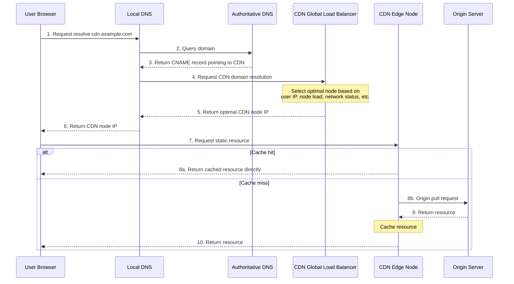

<!-- @include: @small-advertisement.snippet.md -->

## CDN là gì?

**CDN** là viết tắt của Content Delivery Network/Content Distribution Network — dịch ra là **mạng phân phối nội dung**.

Có thể phân tích Content Delivery Network thành từng phần:

- **Content (Nội dung)**: Chỉ static resource, bao gồm ảnh, video, document, JS, CSS, HTML, v.v.
- **Delivery Network (Mạng phân phối)**: Chỉ việc phân phối các static resource này đến server tại nhiều data center ở các vị trí địa lý khác nhau, từ đó triển khai **local access** — ví dụ user ở Hà Nội truy cập trực tiếp data từ data center Hà Nội.

Nói đơn giản: **CDN là phân phối static resource đến nhiều địa điểm khác nhau để triển khai local access, từ đó tăng tốc truy cập static resource, giảm tải cho origin server và bandwidth.**

Tương tự như hệ thống kho bãi và vận chuyển khổng lồ của JD.com — JD Logistics có rất nhiều kho trên toàn quốc, mạng lưới kho hàng gần như bao phủ toàn bộ quận huyện. Như vậy ngay khi user đặt hàng, sản phẩm được gửi trực tiếp từ kho gần nhất đến trạm giao hàng tương ứng, rồi JD delivery giao đến tận nhà.


Có thể coi CDN như **special cache service** ở tầng trên cùng của service, phân tán trên khắp cả nước, chủ yếu để xử lý request cho static resource.


Chúng ta thường so sánh full-site acceleration và CDN — đừng nhầm lẫn hai cái! **Full-site acceleration** (các cloud provider gọi khác nhau: Tencent Cloud gọi là ECDN, Alibaba Cloud gọi là DCDN) có thể accelerate cả static và dynamic resource. Còn **CDN (Content Delivery Network)** chủ yếu nhắm vào **static resource**.


Hầu hết công ty đều dùng CDN service trong phát triển project, nhưng rất ít có công ty tự xây CDN. Dựa trên chi phí, stability và usability, khuyến nghị chọn thẳng CDN service out-of-the-box do cloud provider chuyên nghiệp (như Alibaba Cloud, Tencent Cloud, Huawei Cloud) hoặc CDN provider cung cấp.

## Tại sao không deploy service trực tiếp ở nhiều địa điểm khác nhau?

Nhiều bạn có thể hỏi: **Đã là local access thì tại sao không deploy service trực tiếp ở nhiều địa điểm khác nhau?**

Đây liên quan đến vấn đề **tách biệt kiến trúc static resource và dynamic request**:

1. **Chi phí**: Multi-location deploy full service cần deploy nhiều bộ application, database, middleware — chi phí cực cao. Còn CDN chỉ cần lưu static resource — chi phí có thể kiểm soát.
2. **Đặc tính resource khác nhau**: Static resource (ảnh, JS, CSS) có đặc điểm **dung lượng lớn, truy cập thường xuyên, nội dung không thay đổi** — rất phù hợp để cache và phân phối. Dynamic request cần tính toán real-time nên phải xử lý từ origin.
3. **Tiêu thụ tài nguyên hệ thống**: Nếu dùng application server để trực tiếp xử lý static resource request sẽ chiếm nhiều CPU, memory và bandwidth, có thể ảnh hưởng đến hoạt động bình thường của core business.
4. **Tối ưu chuyên nghiệp**: CDN đã thực hiện nhiều tối ưu cho static resource transmission (như smart compression, protocol optimization, edge computing). Các khả năng này application server thông thường không có.

> **Lưu ý**: Deploy cùng một service ở nhiều địa điểm khác nhau (như local DR, remote DR, local multi-active, remote multi-active) là để triển khai **high availability** của hệ thống, không phải để local access.

## Nguyên lý hoạt động của CDN là gì?

Để hiểu nguyên lý CDN, cần nắm ba vấn đề cốt lõi sau:

1. Static resource được cache vào CDN node như thế nào?
2. Làm thế nào tìm được CDN node phù hợp nhất?
3. Làm thế nào ngăn static resource bị hotlink?

### Static resource được cache vào CDN node như thế nào?

CDN cache static resource chủ yếu theo hai cách: **Prefetch** và **Origin Pull**.

- **Prefetch (Khởi động trước)**: Chủ động push resource từ origin server vào CDN node. Như vậy khi user request resource lần đầu có thể lấy trực tiếp từ CDN node, không cần pull từ origin. Phù hợp với tình huống như big event promotion, hot content release.

- **Origin Pull (Kéo từ nguồn)**: Khi CDN node không có resource mà user request, hoặc cache của resource đó đã hết hạn, CDN node cần lấy content resource mới nhất từ origin server.

> **Lưu ý**: Khi user request trigger origin pull, response speed của request đó sẽ chậm hơn khi không dùng CDN, vì so với trực tiếp truy cập origin, có thêm một tầng CDN node call. Do đó cải thiện **cache hit rate** là mục tiêu tối ưu quan trọng của CDN.

Vòng đời đầy đủ của CDN cache như hình dưới:


Nếu resource có update, có thể **refresh** nó — xóa resource cũ đã cache trên CDN node và force CDN node pull resource mới nhất từ origin vào lần request tiếp theo.

Hầu hết CDN service do cloud provider cung cấp đều có chức năng refresh và prefetch cache (hình dưới là chức năng tương ứng của Alibaba Cloud CDN):


**Hit rate** và **origin pull rate** là hai chỉ số cốt lõi để đánh giá chất lượng CDN service:

- **Hit rate (Tỷ lệ trúng cache)**: Tỷ lệ user request được CDN node respond trực tiếp. **Càng cao càng tốt**.
- **Origin pull rate (Tỷ lệ kéo từ nguồn)**: Tỷ lệ user request cần kéo từ origin server. **Càng thấp càng tốt**.

### Làm thế nào tìm được CDN node phù hợp nhất?

**GSLB (Global Server Load Balance)** là "não" của CDN, chịu trách nhiệm phối hợp và điều phối giữa các CDN node. Cách triển khai phổ biến nhất là **DNS-based GSLB**.

Full scheduling flow của CDN request như hình dưới:



**Chi tiết flow**:

1. User browser gửi domain resolution request đến local DNS server.
2. Local DNS query authoritative DNS, phát hiện domain này được cấu hình **CNAME (Canonical Name) alias record** trỏ đến domain của CDN provider.
3. Local DNS tiếp tục gửi resolution request đến **GSLB** của CDN.
4. GSLB dựa trên **user IP address, CDN node status (load, performance, response time, bandwidth)** và các chỉ số khác để đánh giá toàn diện và trả về IP address của CDN node tối ưu.
5. User browser gửi resource request trực tiếp đến CDN node (edge server) đó.
6. CDN node kiểm tra local cache — nếu hit trả về ngay. Nếu miss hoặc hết hạn thì pull từ origin rồi trả về cho user.

> **Bổ sung**: Hình trên đã đơn giản hóa một chút. Thực tế GSLB nội bộ có thể coi là sự kết hợp của **CDN dedicated DNS server** và **load balancing system**. CDN dedicated DNS server sẽ trả về IP address của load balancing system. Trình duyệt request load balancing system qua IP đó, từ đó tìm được CDN node tương ứng.

### Làm thế nào ngăn resource bị hotlink?

Nếu static resource bị user hoặc website khác hotlink bất hợp pháp, sẽ phát sinh nhiều bandwidth chi phí thêm. Các cơ chế hotlink protection phổ biến:

| Cơ chế                           | Nguyên lý                                                           | Độ bảo mật | Chi phí triển khai | Độ khó bypass                               |
| -------------------------------- | ------------------------------------------------------------------- | ---------- | ------------------ | ------------------------------------------- |
| **Referer hotlink protection**   | Xác định nguồn request dựa trên field Referer trong HTTP header     | Thấp       | Thấp               | Thấp (có thể giả mạo hoặc để trống Referer) |
| **Timestamp hotlink protection** | URL mang signature và expiry time, URL hết hiệu lực sau khi hết hạn | Trung bình | Trung bình         | Trung bình (cần lấy được signing algorithm) |
| **IP whitelist/blacklist**       | Giới hạn hoặc cho phép IP address cụ thể truy cập                   | Trung bình | Thấp               | Trung bình (có thể bypass qua proxy)        |
| **Token authentication**         | Business server tạo Token, CDN node validate                        | Cao        | Cao                | Cao                                         |

#### Referer Hotlink Protection

Xác định xem nguồn request có hợp lệ không bằng cách kiểm tra field **Referer** trong HTTP header. Có thể cấu hình domain whitelist cho phép truy cập — request từ nguồn không có trong whitelist sẽ bị từ chối.

Hầu hết CDN provider đều hỗ trợ cơ chế hotlink protection cơ bản này:


> **Lưu ý**: Nếu hotlink protection config cho phép Referer rỗng, attacker có thể bypass hotlink protection check bằng cách ẩn Referer. Do đó Referer hotlink protection thường cần kết hợp với các cơ chế khác.

#### Timestamp Hotlink Protection

**Timestamp hotlink protection** có bảo mật cao hơn. Nguyên lý cốt lõi là: URL mang **signature string** và **expiry time**. CDN node khi xử lý request sẽ validate signature và kiểm tra xem có hết hạn không — URL hết hạn sẽ bị từ chối truy cập.

Signature string thường được tính bằng cách MD5 hash **encryption key + request path + expiry time**.

Ví dụ timestamp hotlink protection URL:

```plain
http://cdn.example.com/video/123.mp4?wsSecret=79aead3bd7b5db4adeffb93a010298b5&wsTime=1601026312
```

- `wsSecret`: Signature string, được tính và tạo ra từ phía server dựa trên key và thông tin request.
- `wsTime`: Expiry timestamp (Unix timestamp format).


Hầu hết CDN provider đều hỗ trợ cơ chế timestamp hotlink protection out-of-the-box:


> **Best practice khuyến nghị**: Production khuyến nghị dùng phương án kết hợp **Referer hotlink protection + Timestamp hotlink protection**, cân bằng bảo mật và chi phí triển khai. Với tình huống yêu cầu bảo mật cực cao (như paid content), có thể tiếp tục giới thiệu Token authentication.

## CDN accelerate dynamic resource như thế nào?

CDN truyền thống chủ yếu cache accelerate cho static resource (như ảnh, CSS, JS). Còn với **dynamic resource** (như API interface, real-time query, payment request, `.jsp`/`.asp`/`.php` và các dynamic page khác) — content thay đổi real-time không thể cache, CDN truyền thống thường pull trực tiếp từ origin và hiệu quả acceleration hạn chế.

**Dynamic Content Acceleration** được thiết kế để giải quyết vấn đề này. Nó không cache content mà dùng smart routing, protocol optimization và các công nghệ khác để cải thiện transmission speed và stability của dynamic request.

Dynamic acceleration chủ yếu được triển khai qua ba kỹ thuật:

1. **Smart routing (Optimal link detection)**: Sau khi dynamic request được gửi từ user, trước tiên đến CDN edge node gần nhất. CDN nội bộ dùng **real-time network monitoring technology** để probe chất lượng network link trên toàn mạng (bao gồm latency, packet loss rate, bandwidth load), tránh các node bị tắc nghẽn hoặc chất lượng kém trên public internet, chọn một transmission path tối ưu đến origin server.

2. **Transport protocol optimization**:

   - **TCP optimization**: Tối ưu TCP slow start, congestion control algorithm để cải thiện transmission efficiency trong môi trường high latency hoặc packet loss.
   - **Connection reuse**: Long connection (Keep-Alive) được duy trì giữa edge node và origin server để giảm latency do frequent handshake.

3. **Mixed static/dynamic acceleration**: CDN hiện đại (như Alibaba Cloud DCDN, Tencent Cloud ECDN) có thể tự động nhận dạng loại resource của user request:
   - **Static resource**: Return trực tiếp từ edge node cache.
   - **Dynamic resource**: Pull từ origin qua smart routing.

> **Tóm tắt một câu**: Dynamic acceleration = Smart detection + Dynamic routing + Protocol optimization — giúp dynamic request chạy nhanh và ổn định.

## CDN tối ưu tốc độ truy cập HTTPS như thế nào?

Dù HTTPS an toàn, quá trình TLS handshake và encrypt/decrypt thêm latency. CDN dùng nhiều kỹ thuật để tối ưu accelerate HTTPS, đảm bảo bảo mật đồng thời cải thiện tốc độ.

| Kỹ thuật tối ưu   | Mô tả nguyên lý                                                                                                                               | Hiệu quả                                                                    |
| ----------------- | --------------------------------------------------------------------------------------------------------------------------------------------- | --------------------------------------------------------------------------- |
| **Session reuse** | Sau khi user thiết lập kết nối HTTPS lần đầu, node cache thông tin session. Lần truy cập sau reuse session parameter, giảm full TLS handshake | Giảm handshake latency                                                      |
| **OCSP Stapling** | CDN node định kỳ cache trạng thái certificate và gửi cùng cho browser khi TLS handshake, tránh browser query CA riêng                         | Cải thiện handshake efficiency                                              |
| **False Start**   | Bắt đầu truyền encrypted data ngay khi TLS handshake chưa hoàn toàn xong                                                                      | Giảm một RTT overhead                                                       |
| **HTTP/2**        | Hỗ trợ multiplexing, header compression                                                                                                       | Giảm connection count và transmission latency                               |
| **QUIC**          | Transport protocol dựa trên UDP, 0-RTT thiết lập connection                                                                                   | Giảm connection setup time, cải thiện trải nghiệm trong môi trường mạng yếu |

**Ưu điểm của CDN certificate hosting**:

CDN provider (như Tencent Cloud, Alibaba Cloud) thường cung cấp **free SSL certificate** và dịch vụ **auto renewal**:

- **Không cần vận hành**: User không cần thủ công update certificate, tránh truy cập fail do certificate hết hạn.
- **Cấu hình linh hoạt**: Hỗ trợ upload certificate trên CDN console hoặc one-click xin certificate miễn phí.
- **Nhiều encryption mode**: Có thể chọn "**half-path encryption**" (user đến CDN là HTTPS, CDN đến origin là HTTP) hoặc "**full-path encryption**" (cả hai đầu đều HTTPS).

**Config recommendations cho HTTPS acceleration**:

1. **Basic config**: Enable HTTPS trong CDN console và config certificate.
2. **Performance optimization**: Enable **OCSP Stapling** và **HTTP/2**.
3. **Security enhancement**: Nếu cần security level cao hơn, enable **HSTS** (force browser dùng HTTPS).
4. **Weak network optimization**: Enable **QUIC** protocol support để cải thiện trải nghiệm trong môi trường mạng yếu trên mobile.

## Tổng kết

- **Core value của CDN**: Phân phối static resource đến nhiều địa điểm để triển khai **local access**, tăng tốc truy cập static resource, giảm tải cho origin server và bandwidth.
- **CDN service selection**: Dựa trên chi phí, stability và usability, khuyến nghị chọn thẳng CDN service out-of-the-box của cloud provider chuyên nghiệp (như Alibaba Cloud, Tencent Cloud, Huawei Cloud) hoặc CDN provider.
- **Vai trò của GSLB**: GSLB (Global Load Balance) là "não" của CDN, chịu trách nhiệm điều phối user request đến **CDN node tối ưu** dựa trên vị trí user, trạng thái node và các yếu tố khác.
- **Core metrics**: **Hit rate** càng cao càng tốt, **origin pull rate** càng thấp càng tốt.
- **Hotlink protection**: Khuyến nghị dùng phương án kết hợp **Referer hotlink protection + Timestamp hotlink protection**, cân bằng bảo mật và chi phí triển khai.
- **Dynamic acceleration**: Thông qua ba kỹ thuật **smart routing**, **transport protocol optimization**, **mixed static/dynamic acceleration** để cải thiện transmission speed và stability của dynamic request (API interface, real-time query, v.v.).
- **HTTPS acceleration**: Tối ưu TLS handshake và transmission qua các kỹ thuật **session reuse**, **OCSP Stapling**, **False Start**, **HTTP/2**, **QUIC** để đảm bảo bảo mật đồng thời cải thiện tốc độ.

## Tài liệu tham khảo

- Timestamp hotlink protection - Qiniu Cloud CDN: <https://developer.qiniu.com/fusion/kb/1670/timestamp-hotlinking-prevention>
- CDN là gì? Giải thích rõ ràng trong một bài: <https://mp.weixin.qq.com/s/Pp0C8ALUXsmYCUkM5QnkQw>
- 《Perspective HTTP Protocol》 - 37 | CDN: Accelerating our network service: <http://gk.link/a/11yOG>
