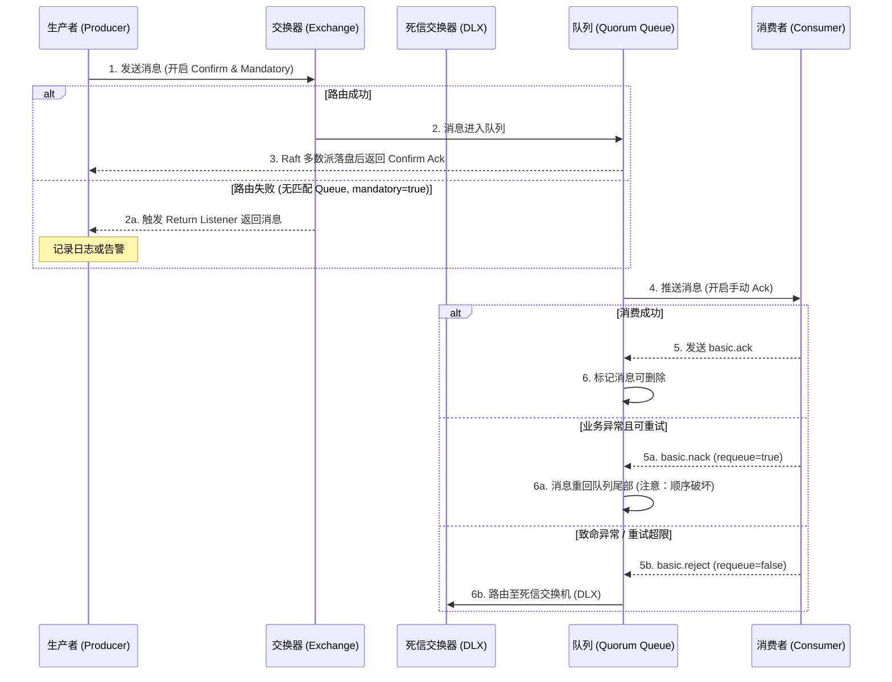

RabbitMQ là một message middleware lâu đời, nhờ cơ chế routing trưởng thành, hỗ trợ giao thức phong phú và đảm bảo độ tin cậy hoàn thiện, đã chiếm vị trí quan trọng trong các ứng dụng doanh nghiệp. Tuy nhiên, kể từ khi RabbitMQ 3.8 giới thiệu Quorum Queue, 3.9 giới thiệu Streams, và 4.0 loại bỏ mirror queue, kiến trúc kỹ thuật đã có những thay đổi lớn, và nhiều best practice truyền thống không còn phù hợp nữa.

Bài viết này đã được cập nhật toàn diện cho RabbitMQ 4.0, ghi rõ phụ thuộc phiên bản của từng tính năng, đặc biệt nhấn mạnh sự khác biệt trong lựa chọn giữa mirror queue (đã bị loại bỏ), Quorum Queue (khuyến nghị) và Streams (3.9+).

## RabbitMQ là gì?

RabbitMQ là một hệ thống tin nhắn doanh nghiệp có thể tái sử dụng, được xây dựng trên nền tảng AMQP (Advanced Message Queuing Protocol). Nó có thể được sử dụng để giao tiếp hiệu quả giữa các module của các hệ thống phần mềm lớn, hỗ trợ đồng thời cao và có khả năng mở rộng. Nó hỗ trợ nhiều client như: Python, Ruby, .NET, Java, JMS, C, PHP, ActionScript, XMPP, STOMP, v.v., hỗ trợ AJAX, persistence, dùng để lưu trữ và chuyển tiếp tin nhắn trong các hệ thống phân tán, và hoạt động tốt về tính dễ sử dụng, khả năng mở rộng và high availability.

RabbitMQ là một message queue mã nguồn mở được viết bằng Erlang, bản thân hỗ trợ nhiều giao thức: AMQP, XMPP, SMTP, STOMP, chính vì vậy **nó trở nên** rất nặng nề, phù hợp hơn cho phát triển doanh nghiệp. Nó cũng triển khai kiến trúc Broker, có nghĩa là tin nhắn được xếp hàng ở trung tâm trước khi gửi tới client, hỗ trợ tốt cho Routing, Load Balance hoặc data persistence.

## Đặc điểm của RabbitMQ

- **Độ tin cậy**: RabbitMQ sử dụng một số cơ chế để đảm bảo độ tin cậy, như persistence, transmission confirmation và publish confirmation.
- **Routing linh hoạt**: Trước khi tin nhắn vào queue, tin nhắn được routing thông qua exchange. Đối với các chức năng routing điển hình, RabbitMQ **đã** cung cấp một số exchange tích hợp để triển khai. Đối với các chức năng routing phức tạp hơn, có thể kết hợp nhiều exchange lại với nhau, hoặc triển khai exchange của riêng mình thông qua cơ chế plugin.
- **Khả năng mở rộng**: Nhiều node RabbitMQ có thể tạo thành một cluster, cũng có thể mở rộng động các node trong cluster theo nhu cầu kinh doanh thực tế.
- **High Availability**: Quorum Queue triển khai replication dữ liệu dựa trên giao thức Raft, Streams hỗ trợ replica nhiều node, queue vẫn có thể sử dụng khi một số node gặp sự cố.
- **Nhiều giao thức**: Ngoài hỗ trợ nguyên bản giao thức AMQP, RabbitMQ còn hỗ trợ STOMP, MQTT và nhiều giao thức message middleware khác.
- **Client đa ngôn ngữ**: RabbitMQ hỗ trợ hầu hết các ngôn ngữ phổ biến, như Java, Python, Ruby, PHP, C#, JavaScript, v.v.
- **Giao diện quản lý**: RabbitMQ cung cấp giao diện người dùng dễ sử dụng, cho phép người dùng giám sát và quản lý tin nhắn, các node trong cluster, v.v.
- **Cơ chế plugin**: RabbitMQ cung cấp nhiều plugin để mở rộng từ nhiều phía, tất nhiên cũng có thể viết plugin của riêng mình.

## Các khái niệm cốt lõi của RabbitMQ?

RabbitMQ về tổng thể là một mô hình producer-consumer, chủ yếu chịu trách nhiệm nhận, lưu trữ và chuyển tiếp tin nhắn. Có thể hình dung quá trình truyền tin nhắn như sau: khi bạn gửi một bưu kiện đến bưu điện, bưu điện sẽ lưu trữ tạm thời và cuối cùng giao thư đến tay người nhận qua nhân viên bưu chính, RabbitMQ giống như một hệ thống bao gồm bưu điện, hòm thư và nhân viên bưu chính. Về mặt thuật ngữ máy tính, mô hình RabbitMQ giống một mô hình switch hơn.

Kiến trúc mô hình tổng thể của RabbitMQ như sau:


Dưới đây tôi sẽ giới thiệu từng khái niệm trong hình trên.

### Producer (Nhà sản xuất) và Consumer (Người tiêu thụ)

- **Producer (Nhà sản xuất)**: Bên tạo ra tin nhắn (người giao thư)
- **Consumer (Người tiêu thụ)**: Bên tiêu thụ tin nhắn (người nhận thư)

Tin nhắn thường bao gồm 2 phần: **message header** (hay còn gọi là Label) và **message body**. Message body còn có thể gọi là **payload**, message body là không minh bạch, còn message header bao gồm một loạt thuộc tính tùy chọn, bao gồm routing-key (khóa routing), priority (độ ưu tiên so với các tin nhắn khác), delivery-mode (chỉ ra tin nhắn có thể cần lưu trữ persistence) v.v. Sau khi producer giao tin nhắn cho RabbitMQ, RabbitMQ sẽ gửi tin nhắn đến Consumer quan tâm dựa trên message header.

### Exchange (Bộ trao đổi)

Trong RabbitMQ, tin nhắn không được gửi trực tiếp vào **Queue (message queue)**, mà phải đi qua lớp **Exchange (bộ trao đổi)**, **Exchange** sẽ phân phối tin nhắn của chúng ta đến **Queue** tương ứng.

**Exchange** được dùng để nhận tin nhắn từ producer và routing những tin nhắn này đến các queue trong server. Nếu không thể routing, có thể sẽ trả về cho **Producer**, hoặc có thể bị hủy trực tiếp. Có thể coi exchange trong RabbitMQ là một thực thể đơn giản.

**Exchange trong RabbitMQ có 4 loại, các loại khác nhau tương ứng với các chiến lược routing khác nhau**: **direct**, **fanout**, **topic**, và **headers**, các loại Exchange khác nhau có chiến lược chuyển tiếp tin nhắn khác nhau. Điều này sẽ được giới thiệu khi trình bày về **Exchange Types**.

> Lưu ý: Đặc tả AMQP định nghĩa một default exchange (Default Exchange), đây là một exchange loại direct được pre-declared, nhưng khi tạo exchange mới phải chỉ định loại một cách rõ ràng, không thể bỏ qua.

Khi producer gửi tin nhắn đến exchange, thường sẽ chỉ định một **RoutingKey (khóa routing)**, dùng để chỉ định quy tắc routing của tin nhắn này, và **RoutingKey cần kết hợp với loại exchange và BindingKey mới có hiệu lực cuối cùng**.

RabbitMQ liên kết **Exchange** với **Queue** thông qua **Binding**, khi binding thường sẽ chỉ định một **BindingKey**, do đó RabbitMQ biết cách routing tin nhắn chính xác đến queue, như hình dưới. Một binding là quy tắc routing kết nối exchange và message queue dựa trên routing key, vì vậy có thể hiểu exchange là một routing table được tạo từ các binding. Exchange và Queue có thể có quan hệ many-to-many.

Khi producer gửi tin nhắn đến exchange, cần một RoutingKey. Khi BindingKey và RoutingKey khớp nhau, tin nhắn sẽ được routing đến queue tương ứng. Khi binding nhiều queue vào cùng một exchange, các binding này cho phép sử dụng cùng BindingKey. BindingKey không hiệu lực trong mọi trường hợp, nó phụ thuộc vào loại exchange, ví dụ exchange loại fanout sẽ bỏ qua và routing tin nhắn đến tất cả các queue được bind vào exchange đó.

### Queue (Message Queue)

**Queue (message queue)** được dùng để lưu trữ tin nhắn cho đến khi gửi đến consumer. Nó là container của tin nhắn, cũng là điểm cuối của tin nhắn. Một tin nhắn có thể được đưa vào một hoặc nhiều queue. Tin nhắn luôn ở trong queue, chờ consumer kết nối vào queue này để lấy đi.

Trong kiến trúc cổ điển của **RabbitMQ**, tin nhắn chỉ có thể được lưu trữ trong **queue**, điều này trái ngược với message middleware như **Kafka**. Kafka lưu trữ tin nhắn ở lớp logic **topic**, còn queue logic tương ứng chỉ là identifier offset trong file lưu trữ thực tế của topic. Producer của RabbitMQ tạo tin nhắn và cuối cùng gửi vào queue, consumer có thể lấy tin nhắn từ queue và tiêu thụ.

> **Ghi chú phiên bản (cập nhật quan trọng 3.9+)**: Từ RabbitMQ phiên bản 3.9, chính thức giới thiệu cấu trúc dữ liệu **Streams**. Streams cung cấp mô hình lưu trữ append-only log tương tự Kafka, hỗ trợ non-destructive consumption, tích lũy tin nhắn quy mô lớn và replay (phát lại) lịch sử dữ liệu dựa trên Offset.
>
> **Khuyến nghị lựa chọn kiến trúc**:
>
> - **Queue thông thường**: Phù hợp cho các tình huống message queue truyền thống, tin nhắn bị xóa sau khi tiêu thụ
> - **Streams**: Phù hợp cho các tình huống cần replay tần số cao, tích lũy số lượng lớn hoặc event sourcing
> - **Sự khác biệt về bottleneck cốt lõi**: Khi sử dụng Stream, throughput I/O đĩa (MB/s) thay thế tốc độ enqueue truyền thống (msg/s) trở thành chỉ số bottleneck cốt lõi

**Nhiều consumer có thể subscribe cùng một queue**, theo mặc định tin nhắn trong queue sẽ được phân chia đều (Round-Robin, tức là vòng lặp) cho nhiều consumer để xử lý, thay vì mỗi consumer nhận tất cả tin nhắn và xử lý, điều này tránh tin nhắn bị tiêu thụ trùng lặp.

> Lưu ý: Chiến lược phân phối thực tế bị ảnh hưởng bởi tham số `prefetch_count`. Hành vi mặc định (`prefetch_count=0`) sẽ phân phối tin nhắn cho các Consumer càng nhiều càng tốt, có thể gây mất cân bằng tải. Khuyến nghị đặt `prefetch_count=1` hoặc giá trị cao hơn, để Consumer xác nhận trước khi gửi tin tiếp theo, thực hiện phân phối công bằng.

**RabbitMQ** không hỗ trợ broadcast consumption ở cấp queue. Nếu có nhu cầu broadcast consumption, cần phát triển thứ cấp trên đó, điều này rất phức tạp và không được khuyến nghị.

### Broker (Node dịch vụ của message middleware)

Đối với RabbitMQ, một RabbitMQ Broker có thể hiểu đơn giản là một node dịch vụ RabbitMQ, hoặc một instance dịch vụ RabbitMQ. Trong hầu hết các trường hợp, cũng có thể coi một RabbitMQ Broker là một server RabbitMQ.

### Exchange Types (Các loại Exchange)

Các Exchange Type thường dùng của RabbitMQ có 4 loại: **fanout**, **direct**, **topic**, **headers** (đặc tả AMQP cũng đề cập đến 2 Exchange Type khác là system và custom, ở đây không mô tả).


**1. fanout (chế độ broadcast)**

- **Quy tắc routing**: Routing tất cả tin nhắn gửi đến Exchange này đến tất cả Queue được bind với nó, **bỏ qua BindingKey**
- **Đặc điểm**: Không cần thực hiện bất kỳ thao tác phán đoán nào, là loại nhanh nhất trong tất cả các loại exchange
- **Tình huống sử dụng điển hình**:
  - Broadcast cập nhật cấu hình hệ thống (như cấu hình center push)
  - Đồng bộ bảng xếp hạng realtime (đồng bộ dữ liệu nhiều instance)
  - Broadcast vô hiệu hóa cache (như thông báo dọn dẹp Redis cache)
  - Phân phối log (gửi log đồng thời đến nhiều hệ thống lưu trữ)

**2. direct (chế độ kết nối trực tiếp)**

- **Quy tắc routing**: Routing tin nhắn đến những Queue có BindingKey **khớp hoàn toàn** với RoutingKey
- **Đặc điểm**: Khớp chính xác, hiệu quả routing cao
- **Tình huống sử dụng điển hình**:
  - **Phân phối task point-to-point cơ bản**: Routing theo cấp độ task (như `error`, `warning`, `info`)
  - Priority queue: Phân bổ nhiều tài nguyên hơn cho task ưu tiên cao
  - Phân phối theo loại dịch vụ (như `order-service`, `payment-service`)

**Ví dụ**: Lấy hình trên làm ví dụ, nếu đặt routing key là `"warning"` khi gửi tin nhắn, tin nhắn sẽ được routing đến Queue1 và Queue2; nếu đặt routing key là `"info"` hoặc `"debug"`, tin nhắn chỉ được routing đến Queue2.

**3. topic (chế độ chủ đề)**

- **Quy tắc routing**: **Khớp mờ (fuzzy matching)** dựa trên BindingKey và RoutingKey
- **Quy tắc khớp**:
  - RoutingKey là chuỗi được phân tách bởi dấu chấm `"."` (như `com.rabbitmq.client`, `order.china.beijing`)
  - BindingKey có thể sử dụng hai loại wildcard:
    - `"*"`: Khớp **một từ**
    - `"#"`: Khớp **không hoặc nhiều từ**
- **Tình huống sử dụng điển hình**:
  - **Lọc theo khu vực hoặc module nghiệp vụ** (như `order.china.*` khớp tất cả đơn hàng khu vực Trung Quốc)
  - Routing đa cấp (như `com.rabbitmq.client`, `java.util.concurrent`)
  - Hệ thống publish-subscribe (thông báo phân loại, subscribe theo tag)

**Ví dụ**:

- Tin nhắn có routing key `"com.rabbitmq.client"` sẽ được routing đồng thời đến queue bind `"*.rabbitmq.*"` và `"#.client.#"`
- Tin nhắn có routing key `"order.china.beijing"` sẽ được routing đến queue bind `"order.china.*"`

**4. headers (không khuyến nghị)**

- **Quy tắc routing**: Khớp dựa trên cặp key-value trong headers của nội dung tin nhắn
- **Đặc điểm**:
  - Không phụ thuộc RoutingKey, hỗ trợ `x-match=all` (khớp tất cả) hoặc `x-match=any` (khớp bất kỳ)
  - **Hiệu suất kém**, hiệu quả khớp thấp hơn nhiều so với ba loại kia
- **Tình huống sử dụng điển hình**:
  - Hầu như không được sử dụng, khi phỏng vấn có thể đề cập "vì hiệu suất khớp kém, môi trường production khuyến nghị dùng Topic thay thế"
  - Chỉ phù hợp cho các quy tắc routing cực kỳ phức tạp và lượng tin nhắn cực nhỏ

## AMQP là gì?

RabbitMQ là triển khai `Erlang` của giao thức AMQP (tất nhiên RabbitMQ còn hỗ trợ các giao thức như `STOMP`, `MQTT`). Kiến trúc mô hình AMQP và kiến trúc mô hình RabbitMQ là giống nhau, producer gửi tin nhắn đến exchange, exchange và queue được bind.

Các exchange, loại exchange, queue, binding, routing key trong RabbitMQ đều tuân theo các khái niệm **tương ứng** trong giao thức AMQP.

> **Ghi chú phiên bản**:
>
> - **AMQP 0-9-1**: Giao thức truyền thống của RabbitMQ, được sử dụng rộng rãi, chức năng đầy đủ
> - **AMQP 1.0**: RabbitMQ 4.x đã nâng nó lên thành giao thức first-class citizen, tối ưu đáng kể hiệu quả phân tích AMQP 1.0 nguyên bản, không còn cần chuyển đổi thông qua plugin phức tạp như phiên bản cũ. Điều này cải thiện khả năng interoperability với các message middleware khác (như ActiveMQ, Service Bus), phù hợp cho các tình huống cần cross-platform integration
> - Dự án mới có thể cân nhắc sử dụng AMQP 1.0 để có khả năng tương thích cross-platform tốt hơn

**Ba lớp của giao thức AMQP**:

- **Module Layer**: Lớp cao nhất của giao thức, chủ yếu định nghĩa một số lệnh mà client gọi, client có thể dùng những lệnh này để triển khai logic nghiệp vụ của riêng mình.
- **Session Layer**: Lớp giữa, chủ yếu chịu trách nhiệm gửi lệnh client đến server và trả về response của server cho client, cung cấp cơ chế đồng bộ đáng tin cậy và xử lý lỗi.
- **TransportLayer**: Lớp dưới cùng, chủ yếu truyền luồng dữ liệu nhị phân, cung cấp xử lý frame, channel multiplexing, phát hiện lỗi và biểu diễn dữ liệu.

**Ba thành phần chính của mô hình AMQP**:

- **Exchange**: Thành phần trong message broker server dùng để routing tin nhắn đến queue.
- **Queue**: Cấu trúc dữ liệu dùng để lưu trữ tin nhắn, nằm trên đĩa cứng hoặc trong bộ nhớ.
- **Binding**: Một tập quy tắc, cho exchange biết nên giao tin nhắn vào queue nào.

## Nói về Producer và Consumer

**Producer**:

- Nhà sản xuất tin nhắn, tức là bên giao tin nhắn.
- Tin nhắn thường bao gồm hai phần: **message body** (payload) và **message header** (Label/Headers).

**Consumer**:

- Tiêu thụ tin nhắn, tức là bên nhận tin nhắn.
- Consumer kết nối đến RabbitMQ server và subscribe vào queue. Khi tiêu thụ tin nhắn, chỉ tiêu thụ message body, bỏ qua label.

## Nói về Broker, Queue, Exchange?

- **Broker**: Có thể coi là node dịch vụ của RabbitMQ. Trong hầu hết các trường hợp, một Broker có thể coi là một RabbitMQ server.
- **Queue**: Đối tượng nội bộ của RabbitMQ, dùng để lưu trữ tin nhắn. Nhiều consumer có thể subscribe cùng một queue, lúc này tin nhắn trong queue sẽ được phân chia đều (round-robin) cho nhiều consumer để xử lý.
- **Exchange**: Producer gửi tin nhắn đến exchange, exchange routing tin nhắn đến một hoặc nhiều queue. Khi không thể routing, hoặc trả về cho producer hoặc hủy trực tiếp.

## Dead letter queue là gì? Nguyên nhân gây ra?

DLX, viết tắt của `Dead-Letter-Exchange` (dead letter exchange), khi tin nhắn trong một queue trở thành dead message (`dead message`), nó có thể được gửi lại đến một exchange khác, exchange này là DLX, queue được bind với DLX gọi là dead letter queue.

**Một số nguyên nhân gây ra dead letter**:

- Tin nhắn bị từ chối (`Basic.Reject` hoặc `Basic.Nack`) và `requeue = false`.
- Tin nhắn TTL hết hạn.
- Queue đầy, không thể thêm nữa.

## Delayed queue là gì? RabbitMQ triển khai delayed queue như thế nào?

Delayed queue lưu trữ các delayed message tương ứng, sau khi tin nhắn được gửi, không muốn consumer lấy tin nhắn ngay lập tức, mà cần chờ một thời gian cụ thể, sau đó consumer mới có thể lấy tin nhắn này để tiêu thụ.

Bản thân RabbitMQ không có delayed queue, để triển khai delayed message, thường có hai cách:

1. Triển khai thông qua tính năng queue bản thân của RabbitMQ, cần sử dụng dead letter exchange (Exchange) của RabbitMQ và thời gian sống TTL (Time To Live) của tin nhắn.

   - Nhược điểm: Tin nhắn hết hạn theo queue chứ không phải ở cấp từng tin nhắn (trừ khi tạo queue riêng cho mỗi tin nhắn)

2. RabbitMQ phiên bản 3.5.7 trở lên cung cấp một plugin (rabbitmq-delayed-message-exchange) để triển khai chức năng delayed queue. Đồng thời, plugin phụ thuộc Erlang/OTP 18.0 trở lên.
   - Nguyên lý: Lưu tạm tin nhắn trong bảng Mnesia, poll định kỳ và giao đến target exchange
   - **Cảnh báo giới hạn dung lượng (nghiêm trọng)**: Plugin này lưu tất cả delayed message trong database nội bộ Erlang Mnesia, **không có khả năng disk paging tốt**. Nếu tích lũy **hàng chục nghìn đến hàng triệu** delayed message trên một node, sẽ gây tăng đột biến bộ nhớ Broker thậm chí kích hoạt **cảnh báo Memory Watermark**, từ đó tạo ra **Global Backpressure** chặn kết nối TCP của tất cả producer.
   - **Khuyến nghị production**: Với lượng delay khổng lồ (hàng chục triệu trở lên), bắt buộc phải dùng external scheduled task system (như time wheel, SchedulerX, XXL-JOB) hoặc giải pháp dead letter chain list

Tức là, giao thức AMQP cũng như bản thân RabbitMQ không hỗ trợ trực tiếp chức năng delayed queue, nhưng có thể mô phỏng chức năng delayed queue thông qua TTL và DLX.

## Priority queue là gì?

RabbitMQ từ phiên bản V3.5.0 có triển khai priority queue, queue có độ ưu tiên cao sẽ được tiêu thụ trước.

Có thể triển khai priority queue thông qua tham số `x-max-priority`. Tuy nhiên, khi tốc độ tiêu thụ lớn hơn tốc độ sản xuất và Broker không có tích lũy, độ ưu tiên trở nên không có ý nghĩa.

## RabbitMQ có những chế độ làm việc nào?

- Chế độ đơn giản (Simple mode)
- Chế độ làm việc (Work mode)
- Chế độ pub/sub (Publish-Subscribe mode)
- Chế độ Routing
- Chế độ Topic

## RabbitMQ truyền tin nhắn như thế nào?

Do chi phí tạo và hủy kết nối TCP khá lớn (three-way handshake, slow start, v.v.), và số lượng concurrency bị giới hạn bởi tài nguyên hệ thống, gây ra bottleneck hiệu suất, nên RabbitMQ sử dụng channel để truyền dữ liệu. Channel là kênh giao tiếp giữa producer, consumer và RabbitMQ, channel là kết nối ảo được xây dựng trên kết nối TCP.

> Lưu ý:
>
> - Một kết nối TCP có thể chứa nhiều Channel, nhưng khuyến nghị chính thức không quá 100-200 channel/kết nối
> - Mỗi Channel có số độc lập, nhưng chia sẻ kiểm soát lưu lượng của cùng một kết nối TCP
> - **Channel không thread-safe**, multi-thread nên sử dụng các instance Channel khác nhau

## Làm thế nào để đảm bảo độ tin cậy của tin nhắn?


Tin nhắn có thể bị mất ở ba giai đoạn: Producer → Broker, trong quá trình lưu trữ Broker, Broker → Consumer

**1. Producer → Broker**

Đảm bảo zero-loss ở phía producer cần **cơ chế kép bảo vệ**:

- **Publisher Confirms** (xác nhận bất đồng bộ): Xác nhận tin nhắn đã đến Broker

  ```java
  channel.confirmSelect();
  channel.addConfirmListener((sequenceNumber, multiple) -> {
      // 消息已到达 Broker 并落盘/同步到镜像
  }, (sequenceNumber, multiple) -> {
      // 消息未到达 Broker，记录日志并重试
  });
  ```

- **Mandatory + Return Listener** (xử lý routing failure): Bắt tình huống tin nhắn đến Exchange nhưng không thể routing đến Queue

  ```java
  // 开启 mandatory 模式
  channel.basicPublish("exchange", "routingKey",
      true,  // mandatory=true
      null,
      messageBody);

  // 配置 Return Listener
  channel.addReturnListener((replyCode, replyText, exchange, routingKey, properties, body) -> {
      // 消息到达 Exchange 但路由失败，记录日志或发送到备用交换器
      log.error("Message returned: {}", replyText);
  });
  ```

> **Cảnh báo quan trọng**: Nếu chỉ bật Confirm mà không xử lý Return, configuration drift (như xóa nhầm queue hoặc binding) sẽ khiến producer nghĩ gửi thành công, nhưng tin nhắn bị hủy âm thầm bên trong Broker, tạo ra **message black hole**.

- **Cơ chế transaction** (không khuyến nghị): Đồng bộ blocking, **hiệu suất giảm đáng kể (tài liệu chính thức không cung cấp số liệu cụ thể, ảnh hưởng thực tế phụ thuộc vào kích thước tin nhắn và network latency)**
  - Lưu ý: Cơ chế transaction và cơ chế Confirm là loại trừ lẫn nhau, hai cơ chế không thể cùng tồn tại

**2. Trong quá trình lưu trữ Broker**

- **Persistence tin nhắn**: `delivery_mode=2`, tin nhắn được ghi vào đĩa
- **Persistence queue**: `durable=true`, queue được tái tạo sau khi restart
- **Chế độ cluster**:
  - **Mirror queue** (Classic Queue Mirroring, đã bị xóa trong 4.0): Đồng bộ master-slave, chỉ dùng cho bảo trì phiên bản cũ
  - **Quorum Queue** (khuyến nghị 3.8+, mặc định sau 4.0): Dựa trên giao thức Raft, hỗ trợ quorum write nghiêm ngặt hơn (N/2 + 1)
  - **Streams** (3.9+): Phù hợp cho event sourcing và tình huống replay tần số cao

**3. Broker → Consumer**

- **Manual Ack**: `basicAck(deliveryTag, multiple)`, đảm bảo xác nhận sau khi tiêu thụ thành công
- **Cơ chế retry**: Khi tiêu thụ thất bại, `basicNack` hoặc `basicReject` và `requeue=true`
- **Dead letter queue**: Sau khi đạt số lần retry tối đa, routing đến DLQ để con người can thiệp
- **Đảm bảo idempotency**: Triển khai ở tầng nghiệp vụ, tránh dữ liệu không nhất quán do tiêu thụ trùng lặp. Tham khảo bài viết về cách triển khai idempotency cụ thể: [Tổng hợp giải pháp interface idempotency](https://javaguide.cn/high-availability/idempotency.html).

Sequence diagram dưới đây hiển thị luồng tin nhắn hoàn chỉnh từ producer đến consumer và chiến lược xử lý ngoại lệ ở từng giai đoạn:



**Giải thích key path**:

- **Confirm + Returns** (bổ sung cho nhau):
  - Confirm xác nhận tin nhắn đã đến Broker và được ghi/đồng bộ
  - Mandatory + Return Listener bắt sự kiện routing failure (tin nhắn đến Exchange nhưng không thể vào Queue)
- **Quorum Queue**: Chỉ trả về Ack sau khi Raft majority xác nhận, đảm bảo dữ liệu không bị mất
- **Manual Ack**: Đảm bảo chỉ xóa tin nhắn sau khi tiêu thụ thành công
- **DLQ fallback**: Sau khi vượt quá giới hạn retry, routing đến dead letter queue, tránh retry vô hạn

> **Lưu ý**: Alternate Exchange (exchange dự phòng) là một cơ chế xử lý routing failure độc lập khác, loại trừ lẫn nhau với Mandatory + Return Listener. Sau khi cấu hình Alternate Exchange, tin nhắn routing thất bại sẽ được chuyển đến exchange dự phòng, producer nhận được Confirm Ack bình thường thay vì Return.

## Làm thế nào để đảm bảo thứ tự tin nhắn RabbitMQ?

RabbitMQ chỉ đảm bảo **thứ tự FIFO trong một Queue đơn**, nhưng có thể xảy ra mất thứ tự trong tình huống nhiều consumer. Giải pháp:

**1. Chế độ Single Consumer**

- Một Queue chỉ bind một Consumer
- Ưu điểm: Đảm bảo thứ tự
- Nhược điểm: Trở thành bottleneck, throughput bị giới hạn

**2. Partition ordered** (khuyến nghị, nhưng cần chú ý failure mode)

- Hash theo business key (như order ID) đến các Queue khác nhau
- Mỗi Queue có Consumer độc lập
- Ưu điểm: Vừa đảm bảo thứ tự vừa cải thiện throughput

> **Cảnh báo failure mode**:
>
> - **Topology change disorder**: Khi backend queue scale-up/down gây thay đổi hash ring, tin nhắn cũ và mới của cùng business key có thể vào các queue khác nhau
> - **Retry disorder**: Nếu consumer nội bộ xử lý thất bại thực hiện Nack và Requeue, tin nhắn đó sẽ được đẩy lại **cuối queue**, khiến tin nhắn sau được tiêu thụ trước
> - **Bảo vệ tầng ứng dụng**: Trong các tình huống yêu cầu thứ tự cực kỳ nghiêm ngặt, business table của consumer phải được thiết kế cơ chế idempotency và chống concurrent overwrite dựa trên **state machine** hoặc **version number**

**3. Internal memory queue** (cẩn thận)

- Consumer đơn lẻ duy trì internal memory queue phân phối đến Worker thread pool
- Cần xử lý:
  - Rủi ro mất memory queue khi Consumer bị crash
  - Cần triển khai backpressure mechanism để ngăn OOM
  - Tăng độ phức tạp ack (cần track trạng thái xử lý Worker cụ thể)
- Môi trường production hãy cẩn thận với giải pháp này

## Làm thế nào để đảm bảo high availability của RabbitMQ?

RabbitMQ khá có tính đại diện, vì nó làm high availability dựa trên master-slave (phi phân tán), chúng ta lấy RabbitMQ làm ví dụ để giải thích cách triển khai high availability của MQ loại đầu tiên. RabbitMQ có bốn chế độ: single machine mode, ordinary cluster mode, mirror cluster mode (đã không còn dùng), Quorum Queue (khuyến nghị).

> **Giải thích quá trình phát triển phiên bản**:
>
> - **Trước 3.8**: Mirror queue (Classic Queue Mirroring) là giải pháp high availability chính
> - **3.8+**: Quorum Queue được giới thiệu như giải pháp thay thế khuyến nghị, mirror queue bị đánh dấu là deprecated
> - **3.13**: Mirror queue vẫn có thể sử dụng nhưng đã deprecated
> - **4.0+**: Mirror queue **hoàn toàn bị xóa**, Quorum Queue trở thành giải pháp high availability mặc định
>
> **Cảnh báo network partition (nghiêm trọng)**: Dù là ordinary cluster hay mirror cluster cũ, đều phụ thuộc vào cơ chế đồng bộ phân tán nội bộ Erlang, cực kỳ nhạy cảm với network jitter. Trong triển khai multi-datacenter hoặc cross-availability-zone, rất dễ xảy ra **network partition (Split-brain)**. Phải cấu hình rõ ràng chiến lược phục hồi partition trong `rabbitmq.conf`:
>
> - `pause_minority`: Node thiểu số tự động tạm dừng dịch vụ để ngăn data divergence (khuyến nghị)
> - `autoheal`: Tự động chọn một bên tiếp tục hoạt động (có rủi ro mất dữ liệu)
> - Đối với phiên bản 3.8 trở lên, khuyến nghị mạnh mẽ sử dụng trực tiếp Quorum Queue dựa trên thuật toán Raft consistency, giải quyết triệt để vấn đề mất tin nhắn và trạng thái không nhất quán do network partition

**Single machine mode**

Cấp độ demo, thường là bạn chạy thử trên local, không ai dùng single machine mode trong production.

**Ordinary cluster mode**

Có nghĩa là khởi động nhiều instance RabbitMQ trên nhiều máy, mỗi máy khởi động một instance. Queue bạn tạo chỉ được đặt trên một instance RabbitMQ, nhưng mỗi instance đồng bộ metadata của queue (metadata có thể coi là một số thông tin cấu hình của queue, thông qua metadata có thể tìm thấy instance chứa queue).

Khi bạn tiêu thụ, nếu thực sự kết nối đến một instance khác, thì instance đó sẽ pull dữ liệu từ instance chứa queue đó về. Giải pháp này chủ yếu để cải thiện throughput, tức là để nhiều node trong cluster phục vụ read/write của một queue nào đó.

**Mirror cluster mode** (Classic Queue Mirroring, đã không còn dùng)

> ⚠️ **Cảnh báo quan trọng**: Mirror queue đã bị **hoàn toàn xóa** trong RabbitMQ 4.0. RabbitMQ 3.8 giới thiệu Quorum Queue như giải pháp thay thế khuyến nghị, phiên bản 3.13 mirror queue vẫn có thể sử dụng nhưng đã deprecated, phiên bản 4.0 chính thức xóa. Dự án mới vui lòng sử dụng Quorum Queue hoặc Streams.

Chế độ này là giải pháp high availability của phiên bản cũ RabbitMQ. Khác với ordinary cluster mode, trong mirror cluster mode, queue bạn tạo, dù là metadata hay tin nhắn trong queue đều tồn tại trên nhiều instance, mỗi node RabbitMQ đều có một mirror hoàn chỉnh của queue này, bao gồm tất cả dữ liệu của queue. Mỗi lần ghi tin nhắn vào queue, tin nhắn sẽ tự động được đồng bộ đến queue trên nhiều instance.

**Nguyên lý hoạt động**:

- Queue master node nhận tin nhắn, đồng bộ đến N mirror node
- Khi master node crash, mirror node cũ nhất được nâng cấp thành master node
- Thêm policy mới thông qua management console, chỉ định đồng bộ dữ liệu đến tất cả node hoặc số lượng node cụ thể

**Ưu điểm**:

- Bất kỳ máy nào crash, các node khác đều chứa dữ liệu đầy đủ của queue đó
- Consumer có thể chuyển sang node khác để tiếp tục tiêu thụ

**Nhược điểm**:

- Chi phí hiệu suất lớn, tin nhắn cần đồng bộ đến tất cả máy
- Áp lực băng thông mạng lớn
- Không phải kiến trúc phân tán thực sự, là master-slave replication

**Quorum Queue** (khuyến nghị 3.8+, giải pháp high availability mặc định sau 4.0)

Replicated queue dựa trên giao thức Raft, là giải pháp high availability khuyến nghị của RabbitMQ 3.8+, trở thành tùy chọn mặc định sau 4.0:

- **Dựa trên giao thức Raft**: Triển khai consistency thông qua log replication và election
- **Quorum write**: Cần majority node xác nhận (N/2 + 1) mới coi là ghi thành công
- **Consistency nghiêm ngặt hơn**: Tránh rủi ro split-brain của mirror queue
- **Tình huống phù hợp**: Các tình huống yêu cầu độ tin cậy cao

**Cách khai báo (client)**:

Java:

```java
// Java 客户端声明 Quorum Queue
Map<String, Object> args = new HashMap<>();
args.put("x-queue-type", "quorum");  // 关键参数，必须在声明时指定
channel.queueDeclare("my-queue", true, false, false, args);
```

Python:

```python
# Python (pika) 客户端声明 Quorum Queue
channel.queue_declare(
    queue='my-queue',
    durable=True,
    arguments={'x-queue-type': 'quorum'}  # 关键参数
)
```

> **Lưu ý quan trọng**: Tham số `x-queue-type` phải được client cung cấp khi khai báo queue, **không thể đặt hoặc sửa đổi thông qua Policy**. Policy chỉ có thể cấu hình runtime parameter như max-length, delivery-limit.

## Làm thế nào để giải quyết vấn đề delay và expiration của message queue?

RabbitMQ có thể đặt thời gian hết hạn tin nhắn (TTL). Nếu tin nhắn tích lũy trong queue vượt quá một thời gian nhất định sẽ bị RabbitMQ dọn dẹp, dẫn đến mất dữ liệu.

**Giải pháp batch re-routing** (áp dụng cho các tình huống dữ liệu có thể khôi phục):

Khi có lượng lớn tin nhắn tích lũy hoặc hết hạn, có thể thực hiện các bước sau:

1. **Tạm thời hủy**: Trong giờ cao điểm, trực tiếp hủy dữ liệu không thể xử lý kịp thời, đảm bảo tính khả dụng của hệ thống
2. **Khôi phục vào giờ thấp điểm**: Vào giờ thấp điểm của nghiệp vụ (như buổi đêm), viết chương trình tạm thời để query dữ liệu bị mất từ database
3. **Re-delivery**: Gửi lại dữ liệu đã query vào MQ để bù đắp

**Tình huống ví dụ**:

- Giả sử 10.000 đơn hàng tích lũy trong MQ chưa được xử lý
- Trong đó 1.000 đơn hàng bị hủy do TTL hết hạn
- Giải pháp xử lý: Viết chương trình tạm thời để query 1.000 đơn hàng này từ database, gửi lại thủ công vào MQ để bù đắp

**Lưu ý**:

- Đảm bảo nguồn dữ liệu (như database) có dữ liệu lịch sử đầy đủ
- Quá trình bù đắp cần xử lý tốt idempotency, tránh tiêu thụ trùng lặp
- Khuyến nghị cấu hình monitoring alert để phát hiện kịp thời tình trạng tin nhắn tích lũy

## Best practice và monitoring alert trong môi trường production

### Các chỉ số monitoring cốt lõi

**1. Memory watermark alert (nghiêm trọng)**

- Monitor tỷ lệ `rabbitmq_memory_limit`
- Ngưỡng alert: Mặc định high watermark là 0.4 (40%)
- **Ảnh hưởng**: Một khi đạt high watermark, RabbitMQ sẽ trực tiếp block TCP Socket của tất cả producer (global backpressure)
- Cấu hình khuyến nghị:
  ```erlang
  {rabbit, [
    {vm_memory_high_watermark, 0.4},  % 内存高水位 40%
    {vm_memory_high_watermark_paging_ratio, 0.5}  % 开始分页的比例
  ]}
  ```

**2. File handle consumption**

- Monitor tỷ lệ sử dụng File Descriptors
- **Rủi ro**: Connection storm hoặc lượng lớn unacked message sẽ cạn kiệt handle gây crash node
- Giá trị khuyến nghị: System limit ít nhất 100.000+ (`ulimit -n 100000`)

**3. Channel Churn Rate**

- Monitor tốc độ tạo và hủy channel
- **Rủi ro**: Tạo/hủy tần số cao (thay vì reuse) sẽ gây Erlang process jitter, dẫn đến CPU spike
- Khuyến nghị production: Số Channel trên mỗi connection khuyến nghị 50-100, tránh tạo/hủy thường xuyên

**4. Message backlog depth**

- Monitor số lượng tin nhắn trong Queue và Consumer Lag
- Ngưỡng alert: Định nghĩa theo nghiệp vụ (như > 10.000 tin nhắn)
- Công cụ: RabbitMQ Management UI, Prometheus + Grafana

**5. Disk space và I/O**

- Monitor disk space còn lại và IOPS
- **Ngưỡng alert**: Disk còn lại < 20% kích hoạt alert
- Quorum Queue có yêu cầu cao về disk I/O, khuyến nghị sử dụng NVMe SSD

### Các hiểu nhầm phổ biến trong production và hướng dẫn tránh bẫy

**Hiểu nhầm 1: Quorum Queue là silver bullet, có thể giải quyết mọi vấn đề**

- **Sự thật**: Raft log của Quorum Queue sẽ fsync khi flush, và Confirm cần chờ majority node fsync rồi mới trả về. Nếu underlying không phải NVMe SSD hiệu suất cao, throughput của nó sẽ bị ảnh hưởng
- **Giới hạn**: Quorum Queue sẽ buộc persist tất cả tin nhắn (bao gồm tin nhắn non-persistent với `delivery_mode=1`) vào đĩa
- **Khuyến nghị lựa chọn**:
  - Tình huống throughput cao: Cân nhắc Classic Queue (non-mirror, single node) hoặc Streams (3.9+)
  - Tình huống high reliability: Sử dụng Quorum Queue (3.8+)

**Hiểu nhầm 2: Prefetch Count càng lớn càng tốt**

- **Sự thật**: Client pull lượng lớn tin nhắn nhưng bị stuck ở local, khiến server queue trông có vẻ rảnh, nhưng thực ra tin nhắn đều ở trạng thái Unacked, kéo sập bộ nhớ local của client và cản trở các consumer khác tiếp nhận
- **Khuyến nghị production**: Giá trị ban đầu cho core business đặt giữa **10 đến 50**, điều chỉnh theo thời gian xử lý
  ```java
  channel.basicQos(20);  // 推荐起始值
  ```

**Hiểu nhầm 3: Plugin delayed queue có thể sử dụng không giới hạn**

- **Sự thật**: Plugin delay lưu tất cả delayed message trong Mnesia memory table, **không hỗ trợ disk paging**
- **Rủi ro**: Tích lũy hàng triệu delayed message trên một node sẽ kích hoạt OOM hoặc global backpressure
- **Giải pháp thay thế**: Tình huống delay quy mô lớn sử dụng external scheduled task system (như XXL-JOB, SchedulerX)

**Hiểu nhầm 4: Network partition sẽ không xảy ra trong môi trường của chúng tôi**

- **Sự thật**: Triển khai cross-datacenter hoặc network jitter đều sẽ kích hoạt network partition detection của Erlang
- **Hậu quả**: Split-brain gây mất tin nhắn, trạng thái không nhất quán
- **Phòng ngừa**:
  - 3.8+ sử dụng Quorum Queue (dựa trên Raft, chống partition tự nhiên)
  - Cấu hình chiến lược phục hồi partition: `cluster_partition_handling = pause_minority`

**Hiểu nhầm 5: Bật cơ chế transaction là bất bại**

- **Sự thật**: Cơ chế transaction là synchronous blocking mode, hiệu suất thấp hơn đáng kể so với Publisher Confirms (tài liệu chính thức không cung cấp số liệu cụ thể, ảnh hưởng thực tế phụ thuộc vào kích thước tin nhắn và network latency)
- **Giải pháp thay thế**: Sử dụng Publisher Confirms + Mandatory Returns (bất đồng bộ và hiệu suất cao)

### Tham khảo cấu hình production

> **Lưu ý quan trọng**: RabbitMQ 3.7+ sử dụng định dạng `rabbitmq.conf` mới (sysctl style), thay vì `advanced.config` cũ (Erlang term format). Cấu hình dưới đây áp dụng cho `rabbitmq.conf`:

```ini
# rabbitmq.conf 生产环境推荐配置

# 内存管理
vm_memory_high_watermark.relative = 0.4
vm_memory_high_watermark_paging_ratio = 0.5

# 磁盘管理
disk_free_limit.absolute = 5GB

# 连接与通道
channel_max = 200
connection_max = infinity

# 心跳检测（秒）
heartbeat = 60

# 网络分区处理（重要）
cluster_partition_handling = pause_minority

# 默认用户（生产环境请修改或删除）
default_user = guest
default_pass = guest
loopback_users = none

# 管理插件监听端口
management.tcp.port = 15672
```

Nếu cần sử dụng Erlang term format (advanced configuration), vui lòng sử dụng file `advanced.config`, nhưng **không được mix với `rabbitmq.conf`**.

## Tóm tắt

Bài viết này đã hệ thống hóa các kiến thức cốt lõi của RabbitMQ, từ khái niệm cơ bản đến thực tiễn production, bao gồm các nội dung quan trọng nhất trong phỏng vấn và ứng dụng thực tế. Hãy cùng ôn lại các điểm chính:

### Quá trình phát triển kiến trúc kỹ thuật cốt lõi

| Cột mốc phiên bản | Thay đổi quan trọng                             | Ảnh hưởng production                              |
| ----------------- | ----------------------------------------------- | ------------------------------------------------- |
| **Trước 3.8**     | Thời đại mirror queue (Classic Queue Mirroring) | Master-slave replication, rủi ro split-brain      |
| **3.8+**          | Giới thiệu Quorum Queue                         | Dựa trên Raft, khuyến nghị cho tình huống tin cậy |
| **3.9+**          | Giới thiệu Streams                              | Kiến trúc Kafka-like, hỗ trợ event sourcing       |
| **4.0+**          | Mirror queue hoàn toàn bị xóa                   | Dự án mới phải dùng Quorum Queue hoặc Streams     |

### Các điểm phỏng vấn tần suất cao

**Phải biết**:

1. **Mô hình AMQP**: Ba thành phần cốt lõi Exchange, Queue, Binding
2. **Loại Exchange và tình huống điển hình**:
   - **Direct**: Phân phối task point-to-point, routing theo độ ưu tiên
   - **Fanout**: Thông báo broadcast, cập nhật cấu hình, vô hiệu hóa cache
   - **Topic**: Lọc theo khu vực/module nghiệp vụ (như `order.china.*`)
   - **Headers**: Hầu như không sử dụng, hiệu suất kém
3. **Độ tin cậy tin nhắn**: Publisher Confirms + Mandatory Returns + Manual Ack + DLQ
4. **Triển khai Idempotency**: Database unique key, Redis SETNX, state machine judgment
5. **Thứ tự tin nhắn**: FIFO trong single Queue, multi-consumer cần partition ordered hoặc single Consumer
6. **Giải pháp high availability**: Quorum Queue (3.8+) thay thế mirror queue (đã xóa trong 4.0)

**Câu hỏi follow-up thường gặp**:

- Tại sao mirror queue bị xóa? (vấn đề split-brain, master-slave replication phi phân tán)
- Làm thế nào để lựa chọn giữa Quorum Queue và Classic Queue? (reliability vs throughput)
- Làm thế nào để đảm bảo tin nhắn không bị mất? (ba giai đoạn: Producer→Broker→Consumer)
- Làm thế nào để đảm bảo thứ tự tin nhắn? (single Queue, partition ordered, cẩn thận với memory queue)
- **Làm thế nào để triển khai idempotency?** (database unique key, Redis SETNX, state machine judgment, xem [Tổng hợp giải pháp interface idempotency](https://javaguide.cn/high-availability/idempotency.html))
- **Làm thế nào để lựa chọn loại Exchange?** (Direct cho exact routing, Topic cho flexible filtering, Fanout cho broadcast, Headers không khuyến nghị)

### Quyết định quan trọng trong môi trường production

**1. Lựa chọn loại queue**

```
Yêu cầu high reliability → Quorum Queue (khuyến nghị mặc định)
Yêu cầu high throughput → Classic Queue (single node) hoặc Streams (3.9+)
Yêu cầu event sourcing → Streams (hỗ trợ non-destructive consumption)
```

**2. Cấu hình độ tin cậy tin nhắn**

```java
// Phía producer: bảo vệ kép
channel.confirmSelect();           // Confirm
channel.basicPublish(exchange, routingKey, true, ...);  // Mandatory
channel.addReturnListener(...);   // Return Listener

// Phía consumer: xác nhận thủ công
channel.basicQos(20);              // Fair dispatch
channel.basicConsume(queue, false, ...);  // Manual ack
```

**3. Điểm cấu hình high availability**

```ini
# Xử lý network partition (bắt buộc cấu hình cho triển khai cross-datacenter)
cluster_partition_handling = pause_minority

# Sử dụng Quorum Queue (khai báo client)
arguments.put("x-queue-type", "quorum");
```

**4. Chỉ số monitoring alert**

- **Memory watermark**: Ngưỡng kích hoạt global backpressure (mặc định 40%)
- **Disk space còn lại**: Dưới 20% kích hoạt alert
- **Message backlog depth**: Số lượng tin nhắn Queue và Consumer Lag
- **Channel Churn Rate**: Tạo/hủy tần số cao sẽ gây CPU spike

---

<!-- @include: @article-footer.snippet.md -->
