> Bài viết này do FrancisQ đóng góp! So với bài gốc, các cải tiến chính bao gồm:
>
> - [Phân tích nguyên nhân đọc/ghi hiệu suất cao của RocketMQ và cách triển khai tiêu thụ theo thứ tự cụ thể](https://github.com/Snailclimb/JavaGuide/pull/2133)
> - [Thêm phần giới thiệu về loại message, loại consumer, consumer group và producer group](https://github.com/Snailclimb/JavaGuide/pull/2134)
> - [RocketMQ 5.x hỗ trợ phân phối theo độ chi tiết message](https://github.com/Snailclimb/JavaGuide/issues/2778)

## Tìm hiểu cơ bản về Message Queue

Message Queue (hàng đợi tin nhắn, viết tắt là MQ) là một phương thức giao tiếp giữa các ứng dụng, được sử dụng để truyền message trong các hệ thống phân tán. Khái niệm cốt lõi của message queue là producer gửi message vào queue, consumer lấy message từ queue để xử lý.

Để hiểu message queue, điều quan trọng là phải trả lời được các câu hỏi sau: **Tại sao message queue ra đời? Message queue có thể dùng để làm gì? Sử dụng message queue mang lại lợi ích gì? Message queue có những tác dụng phụ nào?**

### Tại sao message queue ra đời?

Message queue có thể coi là một kỹ năng bắt buộc đối với các lập trình viên backend, vì **các ứng dụng phân tán chắc chắn liên quan đến vấn đề giao tiếp giữa các hệ thống**, và đây là lúc message queue xuất hiện. Có thể nói sự ra đời của hệ thống phân tán là nền tảng cho message queue, mà phân tán là một khái niệm rất cổ xưa, nên message queue cũng là một middleware rất lâu đời.

### Message queue có thể dùng để làm gì?

#### Xử lý bất đồng bộ (Async)

Bạn có thể thắc mắc rằng giao tiếp giữa các ứng dụng không chỉ có thể giải quyết bằng message queue, tại sao lại phải chèn một message queue vào giữa? Không thể giao tiếp trực tiếp sao?

Điều này dẫn đến một khái niệm khác — **giao tiếp đồng bộ (synchronous communication)**. Ví dụ, Dubbo được sử dụng rộng rãi trong ngành là một framework RPC phù hợp cho giao tiếp đồng bộ giữa các hệ thống.

Lấy hệ thống mua vé làm ví dụ, yêu cầu là sau khi người dùng mua xong, họ sẽ nhận được thông báo SMS xác nhận mua thành công.


Bỏ qua thời gian tiêu tốn cho giao tiếp mạng, giả sử hệ thống mua vé mất 150ms, hệ thống SMS mất 200ms, thì tổng thời gian xử lý là 150ms + 200ms = 350ms.

Thoạt nhìn có vẻ không có vấn đề gì. Nhưng phân tích kỹ sẽ thấy vấn đề: hành động mua vé của người dùng đã hoàn thành khi hệ thống mua vé xử lý xong, nhưng hiện tại việc gọi đồng bộ buộc toàn bộ thời gian yêu cầu phải kéo dài hơn. Hệ thống SMS chỉ là chức năng phụ trợ, dùng để nâng cao trải nghiệm người dùng, không phải nghiệp vụ cốt lõi. Toàn bộ luồng gọi trở nên **nặng đầu nhẹ đuôi** — mua vé là quy trình không quá tốn thời gian, nhưng do gọi đồng bộ, phải chờ hoàn thành việc gửi SMS (một thao tác tốn thời gian hơn) mới trả kết quả được. Nếu thêm yêu cầu gửi email thì sao?


Lúc này toàn bộ chuỗi gọi lại dài thêm, tổng thời gian trở thành 550ms.

Khi chúng ta xếp hàng lấy cơm ở căng tin, chúng ta và nhân viên căng tin là một mô hình đồng bộ.

Chúng ta phải nói với nhân viên: "Cho tôi thêm một đùi gà, thêm khoai tây xào chua cay, cho nhiều cơm vào."

Rồi nhân viên giúp chúng ta xới cơm và thêm thức ăn, chúng ta phải đợi quá trình đó hoàn thành.

Cuối cùng chúng ta nhận suất cơm từ tay nhân viên rồi đi tìm chỗ ngồi.

Hãy nghĩ lại, sau khi truyền đạt yêu cầu, chúng ta phải **đợi đồng bộ cho nhân viên chuẩn bị xong cơm**. Nếu thêm nhiều món, quy trình của nhân viên sẽ kéo dài hơn, thời gian chờ của chúng ta cũng tăng theo.

Còn khi ăn ở nhà hàng, chúng ta nói với phục vụ một tô bún bò thêm một quả trứng **(truyền đạt một message)**, rồi có thể làm việc của mình trên bàn **(làm việc khác)**, đợi khi bún bò lên bàn mới bắt đầu ăn. Thời gian làm bún không ngắn hơn, nhưng chúng ta chỉ cần truyền đạt một message là có thể làm việc khác — đó chính là khái niệm **bất đồng bộ (async)**.

Vì vậy, để giải quyết vấn đề này, các lập trình viên thông minh đã thêm vào giữa một middleware giống như người phục vụ — message queue. Lúc này chúng ta có thể cải tạo mô hình.


Như vậy, sau khi lưu message vào message queue, chúng ta có thể trả về ngay (chúng ta báo cho phục vụ muốn ăn gì rồi chơi điện thoại), nên tổng thời gian chỉ là 150ms + 10ms = 160ms.

> Nhưng lưu ý rằng tổng thời lượng của toàn bộ quy trình không thay đổi, giống như việc bạn chỉ báo cho phục vụ muốn ăn gì sẽ không ảnh hưởng đến tốc độ nấu bún.

#### Giảm kết nối (Decoupling)

Quay lại quy trình gọi đồng bộ ban đầu, hãy tóm tắt bằng pseudocode đơn giản.


Ở bước hai, chúng ta thêm chức năng gửi email, phải sửa lại code. Nếu thêm yêu cầu: sau khi người dùng mua xong còn cần cộng điểm, lúc đó lại phải sửa code nữa?


Nếu vẫn thấy chấp nhận được, thì khi cần xóa dịch vụ gửi email, lại phải sửa code, lại phải khởi động lại ứng dụng?


Việc thường xuyên sửa code như vậy rõ ràng rất phiền, lúc này có thể **dùng message queue để giảm kết nối**. Cần lưu ý rằng các thao tác gửi SMS, gửi email, cộng điểm sau đó đều phụ thuộc vào `result` — tức là kết quả xử lý mua vé (như mã đơn hàng, tài khoản người dùng...), tức là các dịch vụ downstream đều cần cùng một message để xử lý. Do đó có thể thực hiện thông qua mô hình **"broadcast message"**.

"Broadcast" ở đây không phải broadcast thực sự, mà là các hệ thống downstream với vai trò consumer **đăng ký (subscribe)** một topic cụ thể. Ví dụ topic có thể đặt tên là `đặt vé`, hệ thống mua với vai trò producer gửi message vào message queue, consumer sau khi subscribe topic đó sẽ lấy message từ message queue và tiêu thụ. Ở phía producer chỉ cần quan tâm đến **việc produce message vào topic được chỉ định**, **consumer chỉ cần quan tâm đến việc lấy message từ topic được chỉ định**.


> Nếu không có message queue, mỗi khi một nghiệp vụ mới được tích hợp, chúng ta phải gọi interface mới trong hệ thống chính; hoặc khi hủy một số nghiệp vụ, cũng phải xóa một số lời gọi interface trong hệ thống chính. Với message queue, chúng ta chỉ cần quan tâm message có đến được queue không, còn ai muốn subscribe, sau khi nhận message sẽ xử lý như thế nào là việc của downstream, điều này chắc chắn giúp giảm đáng kể khối lượng công việc phát triển và kiểm tra tích hợp.

#### Cắt giảm tải đỉnh (Peak shaving)

Quay lại kịch bản hệ thống gọi đồng bộ, hãy suy nghĩ: nếu lúc này có lượng lớn người dùng yêu cầu mua vé, toàn bộ hệ thống sẽ như thế nào?


Giả sử có mười nghìn yêu cầu vào hệ thống mua vé, server chạy nghiệp vụ chính thường có cấu hình tốt, hệ thống mua vé có thể chịu được mười nghìn yêu cầu người dùng đó. Nhưng điều này đồng nghĩa với việc cũng tạo ra mười nghìn yêu cầu gọi dịch vụ SMS. Hệ thống SMS không phải nghiệp vụ chính, tài nguyên phần cứng được trang bị không cao. Lúc này hệ thống SMS có chịu được đỉnh tải mười nghìn đó không? Rất có thể hệ thống sẽ **sụp đổ ngay lập tức**.

Nghiệp vụ SMS không phải nghiệp vụ chính, có thể **xử lý dung hòa** không? Nếu chúng ta gửi thông tin mua xong vào message queue, và hệ thống SMS **cố gắng hết sức lấy message và tiêu thụ message từ message queue**, dù xử lý chậm hơn cũng không sao, chỉ cần hệ thống không sụp đổ là chấp nhận được.

Tính sẵn sàng của hệ thống là quan trọng nhất; SMS xác thực đến điện thoại người dùng trễ vài giây thường là chấp nhận được.

### Message queue mang lại những lợi ích gì?

Tóm lại là ba từ khóa: **bất đồng bộ (async), giảm kết nối (decoupling), cắt giảm tải đỉnh (peak shaving)**. Đây không chỉ là giá trị cốt lõi của message queue, mà còn là tư tưởng thiết kế quan trọng của kiến trúc phân tán.

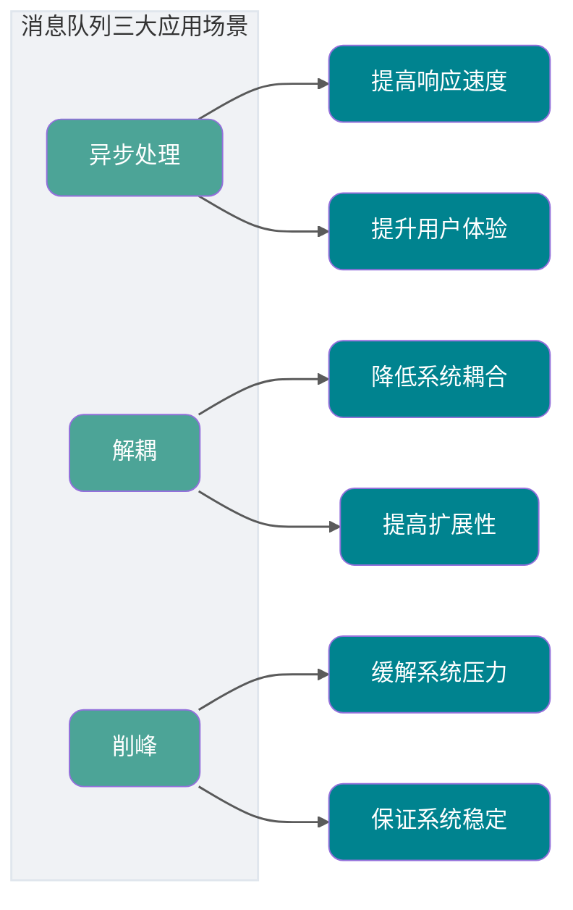

### Message queue có tác dụng phụ không?

Không có công nghệ nào là "viên đạn bạc", message queue cũng có tác dụng phụ.

Ví dụ, vốn dĩ hai hệ thống giao tiếp tốt với nhau, tôi thêm một message queue vào giữa, nếu message queue bị sập thì sao? Điều đó có **làm giảm tính sẵn sàng của hệ thống** không?

Thế thì có cần đảm bảo HA (High Availability) không? Có cần triển khai cluster không? Vậy thì **độ phức tạp của toàn bộ hệ thống có tăng lên** không?

Gác lại các vấn đề trên, nếu bên gửi gửi thất bại, rồi thực hiện retry, điều này có thể tạo ra các message trùng lặp.

Hoặc bên consumer xử lý thất bại, yêu cầu gửi lại, điều này cũng tạo ra message trùng lặp.

Đối với một số microservice, việc tiêu thụ message trùng lặp gây ra nhiều rắc rối hơn, ví dụ cộng điểm, lúc đó cộng nhiều lần có phải không công bằng với người dùng khác không?

Vậy, **làm thế nào để giải quyết vấn đề tiêu thụ message trùng lặp**?

Nếu lúc này message cần đảm bảo thứ tự nghiêm ngặt thì sao? Ví dụ producer tạo ra một loạt message có thứ tự (xóa, thêm, sửa một bản ghi có id là 1), nhưng trong mô hình publish-subscribe, topic không có thứ tự, lúc đó sẽ dẫn đến consumer tiêu thụ message không theo thứ tự producer gửi, ví dụ thứ tự tiêu thụ là sửa, xóa, thêm — nếu bản ghi đó liên quan đến số tiền thì có hỏng không?

Vậy, **làm thế nào để giải quyết vấn đề tiêu thụ message theo thứ tự**?

Lấy hệ thống phân tán đã nói ở trên, sau khi người dùng mua vé xong có cần cộng điểm tài khoản không? Trong cùng một hệ thống chúng ta thường dùng transaction để giải quyết, nếu dùng `Spring` thì thêm annotation `@Transactional` vào pseudocode ở trên là xong. Nhưng làm thế nào đảm bảo transaction giữa các hệ thống khác nhau? Không thể hệ thống này tôi trừ tiền thành công mà hệ thống điểm của bạn không cộng điểm được? Hoặc tôi trừ tiền rõ ràng thất bại mà hệ thống điểm của bạn lại cộng điểm cho tôi.

Vậy, **làm thế nào để giải quyết vấn đề distributed transaction**?

Chúng ta vừa nói rằng message queue có thể thực hiện cắt giảm tải đỉnh, nhưng nếu consumer tiêu thụ rất chậm hoặc producer tạo message rất nhanh, điều này có gây tích lũy message trong message queue không?

Vậy, **làm thế nào để giải quyết vấn đề tích lũy message**?

Tính sẵn sàng giảm, độ phức tạp tăng, đồng thời còn mang lại hàng loạt vấn đề như tiêu thụ trùng lặp, tiêu thụ theo thứ tự, distributed transaction, tích lũy message. Những vấn đề này giải quyết như thế nào?


Dưới đây chúng ta sẽ thảo luận lần lượt về các giải pháp cho những vấn đề này.

## RocketMQ là gì?


Trước khi thảo luận về các giải pháp cho những vấn đề trên, hãy tìm hiểu cấu trúc nội bộ của RocketMQ. Khuyến nghị đọc với tâm thế đặt câu hỏi.

RocketMQ là một middleware message theo mô hình **queue**, có đặc điểm **hiệu suất cao, độ tin cậy cao, thời gian thực cao, phân tán**. Đây là hệ thống message phân tán được phát triển bằng ngôn ngữ Java, do đội ngũ Alibaba phát triển, được đóng góp cho Apache vào cuối năm 2016, trở thành dự án cấp cao nhất của Apache. Nội bộ Alibaba, RocketMQ phục vụ tốt hàng nghìn ứng dụng lớn nhỏ trong tập đoàn, và trong ngày Double 11 hàng năm, có hàng nghìn tỷ message được luân chuyển qua RocketMQ.

RocketMQ có đặc điểm thông lượng cao, độ trễ thấp, tính sẵn sàng cao, đã được kiểm chứng qua các kịch bản quy mô lớn như Double 11.

## Mô hình queue và mô hình topic là gì?

Trước khi nói về kiến trúc kỹ thuật của RocketMQ, hãy tìm hiểu hai khái niệm — **mô hình queue** và **mô hình topic**.

Trước tiên, tại sao message queue lại gọi là message queue?

Thực ra, các middleware message thời kỳ đầu được triển khai thông qua mô hình **queue**, có lẽ do lý do lịch sử, chúng ta đều quen gọi middleware message là message queue.

Nhưng ngày nay, các middleware message xuất sắc như RocketMQ, Kafka không chỉ lưu trữ message thông qua một **queue** đơn thuần.

### Mô hình queue

Giống như cách chúng ta hiểu về queue, mô hình queue của middleware message thực sự chỉ là một queue.


Đặc điểm của mô hình queue: **một message chỉ có thể được một consumer tiêu thụ**.

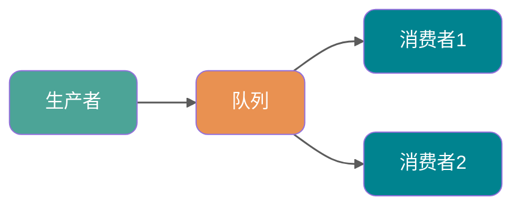

Ở trên tôi đã đề cập đến khái niệm **"broadcast"**, tức là nếu chúng ta cần gửi một message đến nhiều consumer (ví dụ cần gửi thông tin đến cả hệ thống SMS và hệ thống email), lúc đó một queue đơn không thể đáp ứng nhu cầu nữa.

Tất nhiên bạn có thể để Producer tạo message và đưa vào nhiều queue, rồi mỗi queue tương ứng với mỗi consumer. Vấn đề có thể giải quyết được, nhưng tạo nhiều queue và sao chép nhiều bản message sẽ ảnh hưởng đến tài nguyên và hiệu suất. Hơn nữa, điều này khiến producer cần biết số lượng consumer cụ thể rồi sao chép số lượng message queue tương ứng, vi phạm nguyên tắc **giảm kết nối** của middleware message.

### Mô hình topic

Vậy có cách tốt nào để giải quyết vấn đề này không? Có, đó là **mô hình topic** hay còn gọi là **mô hình publish-subscribe**.

> Bạn có thể tìm hiểu thêm về Observer Pattern trong design patterns và tự triển khai thử, tôi tin bạn sẽ thu được nhiều điều.

Trong mô hình topic, producer của message được gọi là **Publisher**, consumer của message được gọi là **Subscriber**, container lưu trữ message được gọi là **Topic**.

Trong đó, publisher gửi message đến topic được chỉ định, subscriber cần **subscribe topic trước** mới có thể nhận message của topic đó.


Đặc điểm của mô hình topic: **một message có thể được nhiều consumer tiêu thụ**.

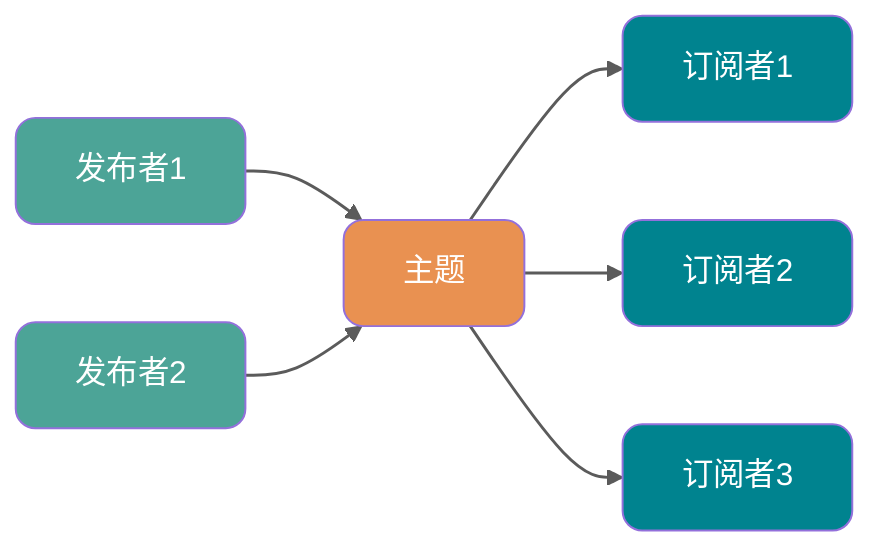

### Mô hình message trong RocketMQ

Mô hình message trong RocketMQ được triển khai theo **mô hình topic**. Vậy **topic** thực sự được triển khai như thế nào?

Thực ra, đối với việc triển khai mô hình topic, thiết kế nền tảng của mỗi middleware message là khác nhau, ví dụ **partition** trong Kafka, **queue** trong RocketMQ, Exchange trong RabbitMQ. Chúng ta có thể hiểu **mô hình topic/mô hình publish-subscribe** là một tiêu chuẩn, các middleware chỉ là triển khai theo tiêu chuẩn đó.

Vậy, **mô hình topic** trong RocketMQ được triển khai như thế nào? Hãy xem một hình:


Chúng ta có thể thấy trong toàn bộ hình có ba vai trò: `Producer Group`, Topic, `Consumer Group`. Hãy giới thiệu lần lượt:

- `Producer Group` (nhóm producer): đại diện cho một loại producer, ví dụ chúng ta có nhiều hệ thống flash sale là producer, nhiều hệ thống đó gộp lại là một `Producer Group`, chúng thường tạo ra các message giống nhau.
- `Consumer Group` (nhóm consumer): đại diện cho một loại consumer, ví dụ chúng ta có nhiều hệ thống SMS là consumer, nhiều hệ thống đó gộp lại là một `Consumer Group`, chúng thường tiêu thụ các message giống nhau.
- Topic: đại diện cho một loại message, ví dụ message đơn hàng, message vận chuyển...

Bạn có thể thấy trong hình, producer trong producer group sẽ gửi message đến topic, và **trong topic có nhiều queue**, sau mỗi lần producer tạo message, sẽ gửi message đến một queue cụ thể trong topic đó.

Mỗi topic có nhiều queue (phân bổ trên các Broker khác nhau; nếu là cluster, các Broker lại phân bổ trên các server khác nhau). Trong chế độ cluster consumption, một consumer cluster gồm nhiều máy cùng tiêu thụ nhiều queue của một `topic`.

**So sánh chiến lược load balancing**

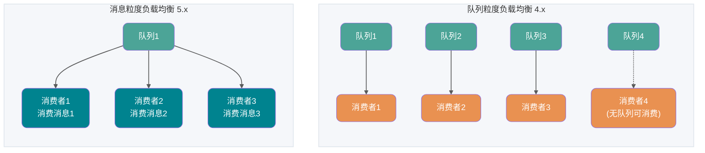

- **Load balancing theo độ chi tiết queue (chiến lược mặc định 4.x)**: một queue chỉ được tiêu thụ bởi một consumer. Nếu một consumer bị chết, các consumer khác trong nhóm sẽ thay thế tiêu thụ. Như hình trên, `Consumer1` và `Consumer2` tương ứng với hai queue, còn `Consumer3` không có queue tương ứng, nên thông thường cần kiểm soát **số consumer trong consumer group bằng với số queue trong topic**. Nhược điểm của chế độ này là dễ xảy ra **hiệu ứng long-tail**: nếu một consumer xử lý chậm, queue của nó sẽ tích lũy message, trong khi các consumer khác lại ở trạng thái rảnh.
- **Load balancing theo độ chi tiết message (chiến lược mới 5.x)**: nhiều consumer trong cùng một consumer group sẽ chia đều tất cả message trong topic theo độ chi tiết message, tức là các message trong cùng một queue có thể được phân phối đều cho nhiều consumer cùng tiêu thụ. Sau khi một consumer lấy được một message nào đó, server sẽ khóa message đó, đảm bảo message này không hiển thị với các consumer khác, cho đến khi message được tiêu thụ thành công hoặc hết thời gian. Chế độ này giải quyết hiệu quả vấn đề long-tail vì message không còn gắn tĩnh với một consumer, mà được phân phối động cho consumer rảnh.

Tất nhiên số consumer cũng có thể ít hơn số queue, chỉ là không quá khuyến nghị. Như hình dưới.


**Mỗi consumer group duy trì một vị trí tiêu thụ trên mỗi queue** — tại sao vậy?

Vì chúng ta vừa vẽ chỉ là một consumer group, chúng ta biết trong mô hình publish-subscribe thường có nhiều consumer group, và mỗi consumer group có vị trí tiêu thụ khác nhau trong mỗi queue. Nếu lúc này có nhiều consumer group, message sau khi được một consumer group tiêu thụ xong sẽ không bị xóa (vì các consumer group khác cũng cần), nó chỉ duy trì một **consumption offset** cho mỗi consumer group, mỗi lần consumer group tiêu thụ xong sẽ trả về phản hồi thành công, rồi queue tăng offset lên một, như vậy message vừa tiêu thụ sẽ không bị tiêu thụ lại.


Bạn có thể còn thắc mắc, **tại sao một topic cần duy trì nhiều queue**?

Câu trả lời là **nâng cao khả năng đồng thời (concurrency)**. Đúng vậy, mỗi topic chỉ có một queue cũng khả thi. Hãy nghĩ xem, nếu mỗi topic chỉ có một queue, queue đó cũng duy trì vị trí tiêu thụ của mỗi consumer group, điều này cũng có thể thực hiện **mô hình publish-subscribe**. Như hình dưới.


Nhưng như vậy, producer của tôi có thể chỉ gửi message đến một queue? Và vì cần duy trì consumption offset nên một queue chỉ tương ứng với một consumer trong consumer group, vậy các Consumer khác có phải không có việc làm? Từ hai góc độ này, khả năng đồng thời giảm đi rất nhiều.

Tóm lại, RocketMQ thực hiện **mô hình topic/mô hình publish-subscribe** thông qua việc **cấu hình nhiều queue trong một Topic và mỗi queue duy trì vị trí tiêu thụ của mỗi consumer group**.

## Kiến trúc RocketMQ

Sau khi hiểu xong mô hình message, việc hiểu kiến trúc kỹ thuật của RocketMQ sẽ dễ dàng hơn nhiều.

Các thành phần cốt lõi của RocketMQ bao gồm **NameServer, Broker, Producer, Consumer**, và trong phiên bản 5.0 còn giới thiệu thêm thành phần **Proxy**.

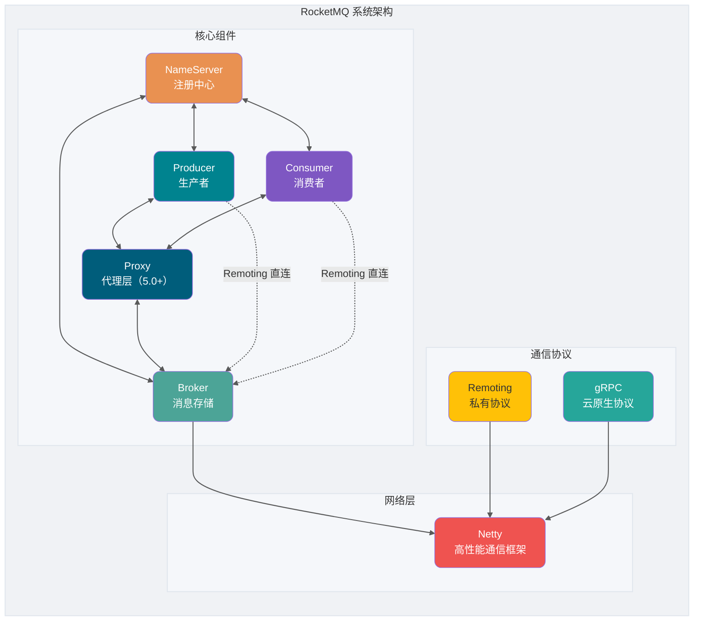

### Điểm nổi bật của các thành phần cốt lõi

| Thành phần     | Điểm kỹ thuật                                                                  |
| -------------- | ------------------------------------------------------------------------------ |
| **NameServer** | Registry nhẹ, các node không đồng bộ dữ liệu với nhau                          |
| **Broker**     | Lưu trữ và phân phối message, hỗ trợ triển khai master-slave                   |
| **Proxy**      | Mới trong 5.0, thích nghi protocol và giảm tải tính toán (thành phần tùy chọn) |
| **Producer**   | Nhiều cách gửi: đồng bộ, bất đồng bộ, một chiều                                |
| **Consumer**   | Ba chế độ tiêu thụ: Push/Pull/Simple                                           |

### NameServer (Registry)

NameServer chịu trách nhiệm lưu trữ metadata, đóng vai trò là "hệ thần kinh trung ương" của cluster, chức năng cốt lõi là cung cấp thông tin routing cho producer và consumer, giúp chúng tìm được địa chỉ Broker tương ứng.

**Chức năng cốt lõi:**

1. **Quản lý Broker**: Broker khi khởi động chủ động kết nối NameServer và báo cáo thông tin metadata.
2. **Quản lý thông tin routing**: Producer và consumer lấy bảng routing Broker từ NameServer.

**Cơ chế heartbeat:**

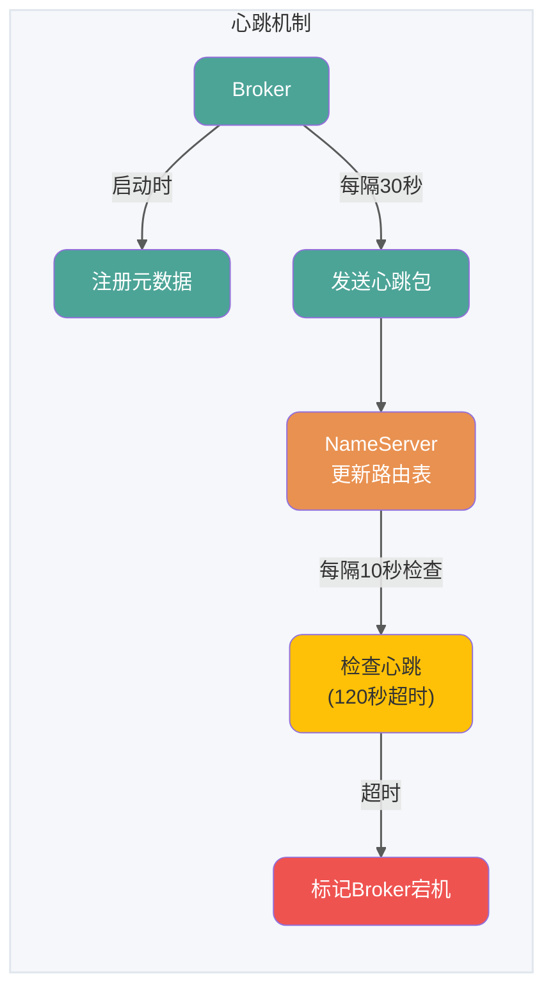

**Metadata bao gồm:**

- Địa chỉ, tên, BrokerId của Broker
- Địa chỉ node master
- Cấu hình queue của tất cả Topic trên Broker đó

### Broker (Lưu trữ message)

Broker chịu trách nhiệm lưu trữ, phân phối và truy vấn message cũng như đảm bảo tính sẵn sàng cao.

**Cơ chế lưu trữ:**

1. **Ghi message**: Sau khi nhận message, nối tiếp vào file CommitLog
2. **Phân chia file**: Khi file vượt quá kích thước cố định (mặc định 1GB), tạo file mới
3. **Phân mảnh logic**: MessageQueue là phân mảnh logic, ConsumeQueue là chỉ mục message

**Một Topic phân bổ trên nhiều Broker, một Broker có thể cấu hình nhiều Topic, chúng là quan hệ nhiều-nhiều**.

Nếu một Topic có lượng message lớn, nên cấu hình thêm nhiều queue (đã đề cập ở trên về việc nâng cao khả năng đồng thời), và **nên phân bổ đều trên các Broker khác nhau để giảm tải cho một Broker cụ thể**.

Trong trường hợp lượng message của các Topic tương đối đều nhau, nếu một Broker có càng nhiều queue, Broker đó càng chịu tải lớn hơn.


### Producer (Nhà sản xuất message)

**Quy trình gửi:**

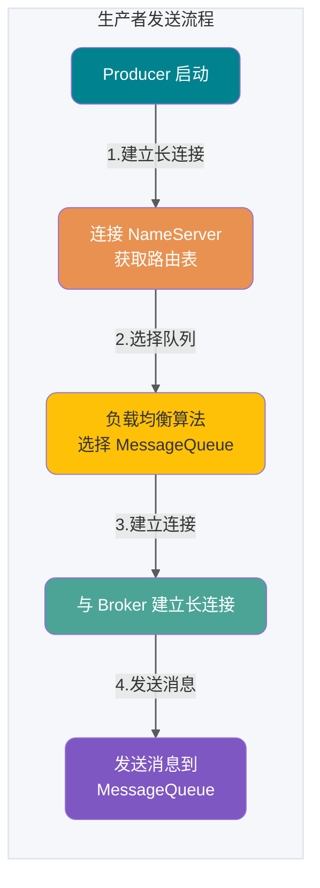

**Ba cách gửi:**

- **Gửi một chiều (Oneway)**: Gửi xong trả về ngay, không quan tâm kết quả thành công hay thất bại
- **Gửi đồng bộ (Sync)**: Gửi xong chờ phản hồi
- **Gửi bất đồng bộ (Async)**: Gửi xong trả về ngay, xử lý phản hồi trong callback

### Consumer (Người tiêu thụ message)

**Quy trình tiêu thụ:**

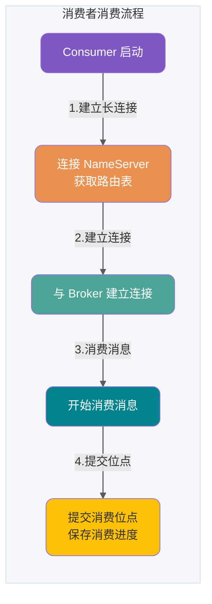

**Ba chế độ tiêu thụ:**

- **Chế độ Pull**: Consumer chủ động gửi yêu cầu pull đến Broker
- **Chế độ Push**: Cơ chế long polling, chỉ trả về khi Broker có message
- **Chế độ stateless (Pop)**: Mới trong RocketMQ 5.0, server quản lý rebalance và offset

### Giao thức mạng

RocketMQ hỗ trợ hai giao thức:

| Giao thức              | Remoting (giao thức riêng)          | gRPC (cloud-native)                            |
| ---------------------- | ----------------------------------- | ---------------------------------------------- |
| **Hiệu suất**          | Tối ưu (tối ưu hóa giao thức riêng) | Thấp hơn một chút (overhead HTTP/2 header)     |
| **Đa ngôn ngữ**        | Chi phí cao (cần triển khai lại)    | Chi phí thấp (triển khai chính thức/cộng đồng) |
| **Cloud-native**       | Khó (cần thích nghi thêm)           | Hỗ trợ native (Istio/K8s)                      |
| **Observability**      | Cần phát triển thêm                 | Hỗ trợ native (OpenTelemetry)                  |
| **Trường hợp sử dụng** | Kịch bản hiệu suất cao nội bộ       | Hướng người dùng và cloud-native               |

### Module mạng (dựa trên Netty)

RPC communication của RocketMQ dùng Netty làm thư viện giao tiếp nền tảng, dựa trên mô hình đa luồng Reactor và đã mở rộng, tối ưu hóa sâu.

**Tóm tắt mô hình luồng:**

- **Reactor main thread**: 1 luồng, chịu trách nhiệm lắng nghe kết nối
- **Reactor thread pool**: mặc định 3 luồng, chịu trách nhiệm xử lý dữ liệu mạng
- **Business thread pool**: điều chỉnh động, dựa trên số lõi CPU

### Proxy (Tầng proxy, mới trong 5.0)

RocketMQ 5.0 giới thiệu thành phần **Proxy**, đây là hiện thân cốt lõi của kiến trúc **tách biệt tính toán và lưu trữ**. Proxy hoạt động như tầng proxy giữa client và Broker, tách các logic tính toán như thích nghi giao thức client, quản lý quyền, quản lý tiêu thụ ra khỏi Broker, để Broker tập trung hơn vào lưu trữ message và high availability. Thiết kế này rất quan trọng cho kiến trúc cloud-native, cho phép tầng tính toán có thể mở rộng độc lập.

**Hai chế độ triển khai:**

| Chế độ           | Mô tả                                                                | Trường hợp sử dụng                                                     |
| ---------------- | -------------------------------------------------------------------- | ---------------------------------------------------------------------- |
| **Local mode**   | Proxy và Broker triển khai cùng process, chỉ cần thêm cấu hình Proxy | Nâng cấp mượt từ phiên bản cũ, hoặc kịch bản không có yêu cầu đặc biệt |
| **Cluster mode** | Proxy và Broker triển khai độc lập riêng biệt                        | Cần mở rộng co giãn hoặc có yêu cầu tùy chỉnh thích nghi giao thức     |

**Vai trò cốt lõi:**

- **Thích nghi giao thức**: Hỗ trợ giao thức gRPC, thuận tiện cho client đa ngôn ngữ kết nối
- **Giảm tải tính toán**: Tách logic tính toán như xác thực, quản lý tiêu thụ ra khỏi Broker, giảm tải cho Broker
- **Mở rộng co giãn**: Proxy không có trạng thái, có thể mở rộng ngang độc lập

> **Lưu ý**: Trong phiên bản 5.0, client dùng SDK mới (giao thức gRPC) cần kết nối qua Proxy, còn SDK cũ (giao thức Remoting) vẫn có thể kết nối trực tiếp với Broker.

### Tại sao bắt buộc cần NameServer?

Hãy xem một mô hình kiến trúc đơn giản:


Bạn có thể thắc mắc: NameServer làm gì? Không thể để Producer, Consumer và Broker trực tiếp sản xuất và tiêu thụ message sao?

Broker cần đảm bảo high availability, nếu toàn bộ hệ thống chỉ dựa vào một Broker để duy trì, áp lực sẽ rất lớn, nên cần nhiều Broker để đảm bảo **load balancing**. Nếu consumer và producer kết nối trực tiếp với nhiều Broker, khi Broker thay đổi sẽ ảnh hưởng đến từng producer và consumer, gây ra vấn đề kết nối chặt. NameServer registry được dùng để giải quyết vấn đề này.

**Triết lý thiết kế của NameServer:**

NameServer là **stateless, các node không giao tiếp với nhau**. Điều này tương phản rõ rệt với strong consistency của ZooKeeper (cần cơ chế bầu chọn), thể hiện triết lý thiết kế của RocketMQ theo đuổi **hiệu suất tối ưu và kiến trúc đơn giản**. Mỗi Broker duy trì kết nối dài với tất cả NameServer, định kỳ báo cáo thông tin của mình, ngay cả khi một node NameServer bị sập cũng không ảnh hưởng đến tính sẵn sàng của toàn cluster.

Dưới đây là sơ đồ kiến trúc từ trang chủ:


So với sơ đồ kiến trúc đơn giản trước đó, chủ yếu có một số điểm khác biệt về chi tiết:

Thứ nhất, Broker **được triển khai cluster và còn triển khai master-slave**. Vì message phân bổ trên các Broker, nếu một Broker bị sập, việc đọc và ghi message trên Broker đó sẽ bị ảnh hưởng. Nên RocketMQ cung cấp cấu trúc `master/slave`, `slave` định kỳ đồng bộ dữ liệu từ `master` (synchronous flush hoặc asynchronous flush). Nếu `master` bị sập, **`slave` cung cấp dịch vụ tiêu thụ nhưng không thể ghi message** (sẽ giải thích chi tiết hơn ở phần sau).

Thứ hai, để đảm bảo HA, NameServer cũng được triển khai cluster, nhưng nó là **phi tập trung (decentralized)**. Điều đó có nghĩa là không có node master, và rõ ràng là các node NameServer không thực hiện `Info Replicate` với nhau. Trong RocketMQ, **một Broker duy trì kết nối dài với tất cả NameServer**, và **cứ 30 giây** Broker gửi heartbeat đến tất cả NameServer, heartbeat chứa thông tin cấu hình Topic của chính nó. NameServer **cứ 10 giây** kiểm tra một lần heartbeat, nếu một Broker **vượt quá 120 giây** không có heartbeat, thì Broker đó được coi là đã sập.

Thứ ba, khi producer cần gửi message đến Broker, **cần lấy thông tin routing về Broker từ NameServer trước**, rồi dùng phương pháp **round-robin** để gửi dữ liệu đến mỗi queue nhằm đạt hiệu quả **load balancing**.

Thứ tư, consumer sau khi lấy thông tin routing của tất cả Broker từ NameServer, gửi yêu cầu `Pull` đến Broker để lấy dữ liệu message. Consumer có thể khởi động ở hai chế độ — **Broadcast (quảng bá) và Cluster (cụm)**. Trong chế độ broadcast, một message sẽ được gửi đến **tất cả consumer trong cùng một consumer group**, trong chế độ cluster message chỉ được gửi đến một consumer.

## Message trong RocketMQ

### Message thông thường

Message thông thường thường được ứng dụng trong các kịch bản như giảm kết nối microservice, event-driven, tích hợp dữ liệu. Các kịch bản này phần lớn yêu cầu kênh truyền dữ liệu có khả năng truyền tin cậy, và không có yêu cầu đặc biệt về thời điểm xử lý hay thứ tự xử lý message. Lấy kịch bản giao dịch thương mại điện tử trực tuyến làm ví dụ, hệ thống đơn hàng upstream đóng gói sự kiện nghiệp vụ khi người dùng đặt hàng và thanh toán thành message thông thường độc lập và gửi đến server RocketMQ, downstream theo nhu cầu subscribe message từ server và xử lý các tác vụ downstream theo logic tiêu thụ cục bộ. Mỗi message độc lập với nhau và không cần tạo liên kết. Ngoài ra còn có hệ thống log, ví dụ kịch bản thu thập log offline, thu thập log thao tác của ứng dụng frontend qua component tracking và chuyển tiếp đến RocketMQ.

**Vòng đời của message thông thường**

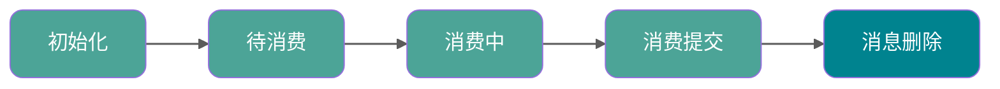

- Khởi tạo: Message được producer xây dựng và hoàn thành khởi tạo, trạng thái chờ gửi đến server.
- Chờ tiêu thụ: Message được gửi đến server, hiển thị với consumer, trạng thái chờ consumer tiêu thụ.
- Đang tiêu thụ: Message được consumer lấy, và được xử lý theo logic nghiệp vụ cục bộ của consumer. Lúc này server sẽ chờ consumer hoàn thành tiêu thụ và gửi kết quả. Nếu sau một thời gian nhất định không nhận được phản hồi từ consumer, RocketMQ sẽ retry xử lý message.
- Đã gửi kết quả tiêu thụ: Consumer hoàn thành xử lý tiêu thụ và gửi kết quả tiêu thụ lên server, server đánh dấu message hiện tại đã được xử lý (bao gồm thành công và thất bại). RocketMQ mặc định hỗ trợ lưu giữ tất cả message, lúc này dữ liệu message sẽ không bị xóa ngay, chỉ được đánh dấu logic là đã tiêu thụ. Trước khi message bị xóa do hết hạn lưu trữ hoặc không gian lưu trữ không đủ, consumer vẫn có thể quay lại tiêu thụ lại message.
- Xóa message: RocketMQ theo cơ chế lưu trữ message xóa lần lượt dữ liệu message cũ nhất, xóa message khỏi file vật lý.

### Message định thời/trễ (Scheduled/Delayed Message)

> **Ghi chú: Message định thời và message trễ về bản chất là như nhau, đều là server dựa vào thời gian định thời được đặt trong message để phân phối message đến consumer tại một thời điểm cố định.**

Trong các kịch bản trigger scheduling phân tán, xử lý timeout tác vụ, cần thực hiện trigger sự kiện định thời chính xác và đáng tin cậy. Sử dụng message định thời của RocketMQ có thể đơn giản hóa logic phát triển các tác vụ scheduling định thời, thực hiện khả năng trigger định thời hiệu suất cao, có thể mở rộng, độ tin cậy cao.

**Kịch bản điển hình 1: Distributed scheduling**

Trong kịch bản distributed scheduling, cần thực hiện các tác vụ định thời với độ chính xác khác nhau, ví dụ như dọn dẹp file lúc 5 giờ sáng mỗi ngày, trigger gửi message mỗi 2 phút... Giải pháp scheduling dựa trên database truyền thống trong kịch bản phân tán có hiệu suất không cao và triển khai phức tạp.

**Kịch bản điển hình 2: Xử lý timeout tác vụ**

Lấy kịch bản giao dịch thương mại điện tử làm ví dụ, sau khi đặt đơn hàng mà chưa thanh toán, không thể đóng đơn hàng ngay, mà cần đợi một khoảng thời gian mới đóng đơn được. Sử dụng message định thời RocketMQ có thể thực hiện kiểm tra trigger cho các tác vụ timeout.

Xử lý tác vụ timeout dựa trên message định thời có các ưu điểm sau:

- **Độ chính xác cao, ngưỡng phát triển thấp**: Phương pháp thông báo dựa trên message không có khoảng cách interval định thời theo bậc. Có thể dễ dàng thực hiện trigger sự kiện với độ chính xác tùy ý, không cần nghiệp vụ tự dedup.
- **Hiệu suất cao, có thể mở rộng**: Phương pháp quét database truyền thống khá phức tạp, cần gọi interface quét thường xuyên, dễ tạo ra bottleneck hiệu suất. Message định thời RocketMQ có khả năng concurrent cao và mở rộng ngang.

**Nguyên tắc đặt thời gian định thời**

Thời gian định thời được đặt trong message định thời RocketMQ là một timestamp hệ thống dự kiến trigger, thời gian trễ cũng cần được chuyển đổi thành một timestamp nào đó sau thời gian hệ thống hiện tại, không phải là khoảng thời gian trễ.

- **Định dạng thời gian**: Unix timestamp theo mili-giây
- **Giá trị tối đa của độ trễ định thời**: Mặc định là 24 giờ, không hỗ trợ tùy chỉnh sửa đổi
- **Thời gian định thời phải đặt sau thời gian hiện tại**, nếu không định thời sẽ không có hiệu lực, server sẽ phân phối message ngay lập tức

**Ví dụ**:

- Message định thời: Thời gian hệ thống hiện tại là 2022-06-09 17:30:00, muốn message được phân phối lúc 19:20:00, thì timestamp định thời là 1654773600000
- Message trễ: Thời gian hệ thống hiện tại là 2022-06-09 17:30:00, muốn phân phối sau 1 giờ, thì timestamp định thời là 1654770600000

**Sự khác biệt giữa phiên bản 4.x và 5.x**

- **Phiên bản 4.x**: Chỉ hỗ trợ message trễ, mặc định phân thành 18 mức (1s 5s 10s 30s 1m 2m 3m 4m 5m 6m 7m 8m 9m 10m 20m 30m 1h 2h), cũng có thể thêm mức trễ tùy chỉnh và thời lượng trong file cấu hình.
- **Phiên bản 5.x**: Hỗ trợ message định thời với độ chính xác tùy ý, triển khai bằng cách đặt timestamp định thời (theo mili-giây). Nền tảng sử dụng thuật toán **Time Wheel (TimingWheel)** để quản lý hiệu quả lượng lớn tác vụ định thời, so với cách theo mức cố định của phiên bản 4.x, đã cải thiện đáng kể tính linh hoạt và độ chính xác.

**Vòng đời của message định thời**

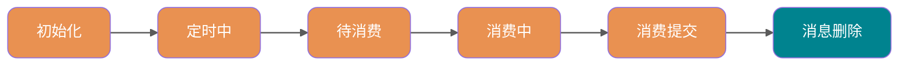

- **Khởi tạo**: Message được producer xây dựng và hoàn thành khởi tạo, trạng thái chờ gửi đến server.
- **Đang định thời**: Message được gửi đến server, khác với message thông thường, server sẽ không xây dựng chỉ mục message trực tiếp, mà sẽ **lưu trữ riêng message định thời trong hệ thống lưu trữ định thời**, chờ đến thời điểm định thời.
- **Chờ tiêu thụ**: Sau khi đến thời điểm định thời, server ghi lại message vào storage engine thông thường, hiển thị với consumer downstream, trạng thái chờ consumer tiêu thụ.
- **Đang tiêu thụ**: Message được consumer lấy và được xử lý theo logic nghiệp vụ cục bộ của consumer. Lúc này server sẽ chờ consumer hoàn thành tiêu thụ và gửi kết quả. Nếu sau một thời gian nhất định không nhận được phản hồi từ consumer, RocketMQ sẽ retry xử lý message.
- **Đã gửi kết quả tiêu thụ**: Consumer hoàn thành xử lý tiêu thụ và gửi kết quả tiêu thụ lên server, server đánh dấu message hiện tại đã được xử lý (bao gồm thành công và thất bại). RocketMQ mặc định hỗ trợ lưu giữ tất cả message, lúc này dữ liệu message sẽ không bị xóa ngay, chỉ được đánh dấu logic là đã tiêu thụ. Trước khi message bị xóa do hết hạn lưu trữ hoặc không gian lưu trữ không đủ, consumer vẫn có thể quay lại tiêu thụ lại message.
- **Xóa message**: Apache RocketMQ theo cơ chế lưu trữ message xóa lần lượt dữ liệu message cũ nhất, xóa message khỏi file vật lý.

**Giới hạn sử dụng**

1. **Tính nhất quán loại message**: Message định thời chỉ hỗ trợ sử dụng trong topic có MessageType là Delay
2. **Ràng buộc độ chính xác định thời**: Tham số thời lượng định thời chính xác đến mili-giây, nhưng độ chính xác mặc định là 1000ms (độ chính xác giây)

**Khuyến nghị sử dụng**

Logic triển khai của message định thời cần phải trải qua bước lưu trữ định thời chờ trigger, chỉ sau khi đến thời gian định thời mới được phân phối đến consumer. Vì vậy, nếu đặt thời gian định thời của lượng lớn message định thời vào cùng một thời điểm, thì khi đến thời điểm đó sẽ có lượng lớn message cần xử lý đồng thời, gây áp lực quá lớn cho hệ thống, dẫn đến trễ phân phối message, ảnh hưởng đến độ chính xác định thời.

### Message có thứ tự (Ordered Message)

**Ordered message là gì**

Message có thứ tự là một loại message nâng cao do Apache RocketMQ cung cấp, hỗ trợ consumer lấy message theo thứ tự gửi, từ đó thực hiện xử lý theo thứ tự trong các kịch bản nghiệp vụ.

**Trường hợp ứng dụng**

Trong các kịch bản xử lý sự kiện có thứ tự, khớp giao dịch, đồng bộ gia tăng dữ liệu thời gian thực..., các hệ thống dị thể cần duy trì đồng bộ trạng thái nhất quán mạnh, các thay đổi sự kiện upstream cần được truyền đến downstream theo thứ tự để xử lý.

- **Khớp giao dịch**: Lấy kịch bản khớp giao dịch chứng khoán làm ví dụ, đối với các lệnh giao dịch có giá thầu giống nhau, phải tuân theo nguyên tắc ai ra giá trước giao dịch trước, hệ thống xử lý đơn hàng downstream cần xử lý đơn hàng theo thứ tự giá thầu nghiêm ngặt.
- **Đồng bộ gia tăng dữ liệu thời gian thực**: Lấy kịch bản đồng bộ gia tăng thay đổi database làm ví dụ, database nguồn upstream thực hiện các thao tác thêm/xóa/sửa theo nhu cầu, chuyển binary operation log thành message, truyền qua RocketMQ đến hệ thống tìm kiếm downstream, hệ thống downstream khôi phục dữ liệu message theo thứ tự, thực hiện refresh dữ liệu trạng thái theo thứ tự.

**Làm thế nào để đảm bảo tính thứ tự của message**

Tính thứ tự message trong RocketMQ chia làm hai phần: **thứ tự sản xuất (production order)** và **thứ tự tiêu thụ (consumption order)**.

**Thứ tự sản xuất**

Để đảm bảo tính thứ tự sản xuất message, cần đáp ứng các điều kiện sau:

1. **Producer duy nhất**: Tính thứ tự sản xuất message chỉ hỗ trợ một producer duy nhất
2. **Gửi nối tiếp**: Khi producer gửi song song bằng đa luồng, message được tạo bởi các luồng khác nhau sẽ không thể xác định thứ tự trước sau

Producer đáp ứng các điều kiện trên, sau khi gửi message có thứ tự đến RocketMQ, sẽ đảm bảo các message được đặt cùng **message group** được lưu trữ trong cùng một queue theo thứ tự gửi.

**Message Group (MessageGroup)**

Quan hệ thứ tự của ordered message trong RocketMQ được xác định và nhận biết thông qua Message Group, khi gửi ordered message cần đặt message group cho mỗi message.

- Nhiều message trong **cùng message group** tuân theo quan hệ thứ tự FIFO
- Các message **khác message group**, message không có message group không liên quan đến thứ tự

Dựa trên logic xác định thứ tự theo message group, hỗ trợ phân chia theo độ chi tiết nghiệp vụ, có thể nâng cao khả năng song song và thông lượng của hệ thống trong khi đáp ứng thứ tự cục bộ của nghiệp vụ.

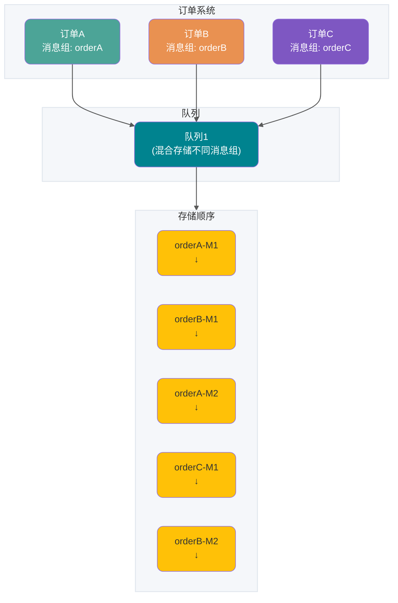

**Giải thích**:

- Message M1, M2 của orderA giữ thứ tự
- Message M1, M2 của orderB giữ thứ tự
- Các message group khác nhau có thể lưu trữ lẫn lộn trong cùng một queue

**Thứ tự tiêu thụ**

Để đảm bảo tính thứ tự tiêu thụ message, cần đáp ứng các điều kiện sau:

1. **Thứ tự phân phối**: RocketMQ đảm bảo phân phối message theo thứ tự lưu trữ trên server thông qua SDK client và giao thức giao tiếp server
2. **Giới hạn retry**: Phân phối ordered message chỉ trong phạm vi số lần retry giới hạn, sau khi vượt quá số lần retry tối đa sẽ không retry nữa, bỏ qua việc tiêu thụ message này

**Ảnh hưởng của loại consumer đến tiêu thụ có thứ tự**

- **PushConsumer**: RocketMQ đảm bảo phân phối message từng cái một cho consumer theo thứ tự lưu trữ
- **SimpleConsumer**: Consumer có thể pull nhiều message một lần, lúc đó tính thứ tự tiêu thụ message cần do phía nghiệp vụ tự đảm bảo

**Kết hợp thứ tự sản xuất và thứ tự tiêu thụ**

| Thứ tự sản xuất                                      | Thứ tự tiêu thụ    | Hiệu quả thứ tự                                                    |
| ---------------------------------------------------- | ------------------ | ------------------------------------------------------------------ |
| Đặt message group, đảm bảo gửi theo thứ tự           | Tiêu thụ có thứ tự | Theo độ chi tiết message group, đảm bảo thứ tự message nghiêm ngặt |
| Đặt message group, đảm bảo gửi theo thứ tự           | Tiêu thụ đồng thời | Tiêu thụ đồng thời, cố gắng xử lý theo thứ tự thời gian            |
| Không đặt message group, gửi message không có thứ tự | Tiêu thụ có thứ tự | Theo độ chi tiết lưu trữ queue, thứ tự nghiêm ngặt                 |
| Không đặt message group, gửi message không có thứ tự | Tiêu thụ đồng thời | Tiêu thụ đồng thời, cố gắng xử lý theo thứ tự thời gian            |

**Giới hạn sử dụng**

1. **Tính nhất quán loại message**: Ordered message chỉ hỗ trợ sử dụng trong topic có MessageType là FIFO
2. Khi tiêu thụ ordered message thất bại và thực hiện retry, để đảm bảo tính thứ tự message, các message sau không thể được tiêu thụ, phải chờ message trước được tiêu thụ xong mới có thể xử lý

**Khuyến nghị sử dụng**

1. **Tiêu thụ nối tiếp**: Khuyến nghị xử lý message theo chuỗi tuần tự, tránh tiêu thụ nhiều message một lần dẫn đến mất thứ tự
2. **Phân tán message group**: Khuyến nghị phân chia nghiệp vụ theo độ chi tiết message group, ví dụ dùng order ID, user ID làm từ khóa message group, có thể thực hiện xử lý message của cùng một người dùng theo thứ tự, trong khi message của người dùng khác nhau không cần đảm bảo thứ tự

### Message giao dịch (Transaction Message)

**Transaction message là gì**

Message giao dịch là một loại message nâng cao do Apache RocketMQ cung cấp, hỗ trợ đảm bảo tính nhất quán cuối cùng giữa sản xuất message và transaction cục bộ trong kịch bản phân tán. Nói đơn giản, là kết hợp transaction cục bộ (thao tác DML database) với việc gửi message trong cùng một transaction.

**Trường hợp ứng dụng**

Đặc điểm của gọi trong hệ thống phân tán là thực thi một logic nghiệp vụ cốt lõi, đồng thời cần gọi nhiều nghiệp vụ downstream để xử lý. Làm thế nào để đảm bảo kết quả thực thi của nghiệp vụ cốt lõi và nhiều nghiệp vụ downstream hoàn toàn nhất quán là vấn đề chính mà distributed transaction cần giải quyết.

Lấy kịch bản giao dịch thương mại điện tử làm ví dụ, thao tác cốt lõi của người dùng thanh toán đơn hàng đồng thời liên quan đến thay đổi của nhiều hệ thống con như vận chuyển, thay đổi điểm, xóa giỏ hàng:

- **Cập nhật trạng thái hệ thống đơn hàng nhánh chính**: Từ chưa thanh toán thay đổi thành thanh toán thành công
- **Thêm trạng thái hệ thống vận chuyển**: Thêm bản ghi vận chuyển chờ giao, tạo bản ghi vận chuyển đơn hàng
- **Thay đổi trạng thái hệ thống điểm**: Thay đổi điểm người dùng, cập nhật bảng điểm người dùng
- **Thay đổi trạng thái hệ thống giỏ hàng**: Xóa giỏ hàng, cập nhật bản ghi giỏ hàng người dùng

**Vấn đề của các giải pháp truyền thống**

- **Giải pháp XA transaction truyền thống**: Hệ thống distributed transaction dựa trên giao thức XA có thể thực hiện tính nhất quán, nhưng phạm vi khóa tài nguyên lớn trong môi trường đa nhánh, độ đồng thời thấp
- **Giải pháp dựa trên ordinary message**: Ordinary message và đơn hàng transaction không thể đảm bảo nhất quán, dễ xảy ra tình trạng gửi message thành công nhưng đơn hàng không thực thi thành công, hoặc đơn hàng thực thi thành công nhưng message không gửi được

**Giải pháp transaction message RocketMQ**

Giải pháp transaction message RocketMQ có ưu điểm hiệu suất cao, có thể mở rộng, phát triển nghiệp vụ đơn giản, hỗ trợ khả năng commit hai giai đoạn, kết hợp commit hai giai đoạn với transaction cục bộ, thực hiện tính nhất quán kết quả commit toàn cục.

**Quy trình xử lý transaction message**

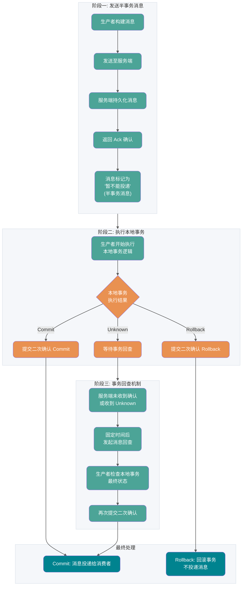

1. Producer gửi message đến server RocketMQ
2. Sau khi server persist message thành công, trả về Ack xác nhận message đã được gửi thành công cho producer, lúc này message được đánh dấu là "tạm thời không thể phân phối" — message ở trạng thái này gọi là **half-transaction message**
3. Producer bắt đầu thực thi logic transaction cục bộ
4. Producer gửi kết quả xác nhận lần hai (Commit hoặc Rollback) lên server dựa trên kết quả thực thi transaction cục bộ
5. Nếu server không nhận được kết quả xác nhận lần hai, hoặc kết quả nhận được là Unknown, sau một khoảng thời gian cố định, server sẽ phát khởi **message check-back** đến producer
6. Sau khi producer nhận được message check-back, cần kiểm tra kết quả cuối cùng của việc thực thi transaction cục bộ tương ứng
7. Producer gửi lại xác nhận lần hai dựa trên trạng thái cuối cùng của transaction cục bộ đã kiểm tra

**Vòng đời của transaction message**

- **Khởi tạo**: Half-transaction message được producer xây dựng và hoàn thành khởi tạo, trạng thái chờ gửi đến server
- **Chờ submit transaction**: Half-transaction message được gửi đến server, sẽ không được persist trực tiếp bởi server, mà được lưu trữ riêng trong hệ thống lưu trữ transaction, chờ sau khi giai đoạn hai trả về kết quả thực thi transaction cục bộ mới submit. Lúc này message không hiển thị với consumer downstream
- **Rollback message**: Nếu kết quả thực thi transaction trong giai đoạn hai rõ ràng là rollback, server sẽ rollback half-transaction message, quy trình transaction message này kết thúc
- **Chờ tiêu thụ sau commit**: Nếu kết quả thực thi transaction trong giai đoạn hai rõ ràng là commit, server sẽ lưu lại half-transaction message vào hệ thống lưu trữ thông thường, lúc này message hiển thị với consumer downstream
- **Đang tiêu thụ**: Message được consumer lấy và được xử lý theo logic nghiệp vụ cục bộ của consumer
- **Đã gửi kết quả tiêu thụ**: Consumer hoàn thành xử lý tiêu thụ và gửi kết quả tiêu thụ lên server
- **Xóa message**: RocketMQ theo cơ chế lưu trữ message xóa lần lượt dữ liệu message cũ nhất

**Giới hạn sử dụng**

1. **Tính nhất quán loại message**: Transaction message chỉ hỗ trợ sử dụng trong topic có MessageType là Transaction
2. **Tính transaction tiêu thụ**: RocketMQ transaction message đảm bảo tính nhất quán giữa transaction nhánh chính cục bộ và transaction gửi message downstream, nhưng không đảm bảo tính nhất quán giữa kết quả tiêu thụ message và transaction upstream
3. **Khả năng hiển thị trạng thái trung gian**: Transaction message là nhất quán cuối cùng (eventual consistency), tức là trước khi message được submit đến consumer downstream để xử lý xong, trạng thái giữa nhánh downstream và transaction upstream sẽ không nhất quán
4. **Cơ chế timeout transaction**: Vòng đời của transaction message tồn tại cơ chế timeout, sau khi half-transaction message được producer gửi lên server, nếu trong thời gian quy định server không thể xác nhận trạng thái commit hoặc rollback, thì message mặc định sẽ bị rollback
5. **Cơ chế check-back transaction**: Server mặc định **cứ 60 giây** phát khởi check-back đối với half-transaction message chưa được xác nhận, **tối đa 15 lần check-back**. Sau khi vượt quá số lần check-back tối đa, message sẽ bị bỏ hoặc vào dead letter queue

**Khuyến nghị sử dụng**

1. **Tránh lượng lớn transaction chưa xác định gây timeout**: Producer nên cố gắng tránh để transaction cục bộ trả về kết quả unknown, lượng lớn transaction check-back sẽ làm suy giảm hiệu suất hệ thống
2. **Xử lý đúng transaction "đang tiến hành"**: Khi check-back message, đối với các transaction đang tiến hành không nên trả về kết quả Rollback hoặc Commit, mà tiếp tục giữ trạng thái Unknown

### Về việc gửi message

#### Không khuyến nghị tạo nhiều producer trong một process duy nhất

Producer và topic trong Apache RocketMQ là quan hệ nhiều-nhiều, hỗ trợ cùng một producer gửi message đến nhiều topic. Đối với việc tạo và khởi tạo producer, khuyến nghị tuân theo nguyên tắc đủ dùng là được, tái sử dụng tối đa. Nếu có kịch bản cần gửi message đến nhiều topic, không cần tạo một producer cho mỗi topic.

#### Không khuyến nghị tạo và hủy producer thường xuyên

Producer trong Apache RocketMQ là tài nguyên nền tảng có thể tái sử dụng, tương tự như connection pool của database. Vì vậy không cần tạo producer mới mỗi lần gửi message, và sau khi gửi xong lại hủy producer. Việc tạo và hủy thường xuyên như vậy sẽ tạo ra nhiều yêu cầu kết nối ngắn ở phía server, ảnh hưởng nghiêm trọng đến hiệu suất hệ thống.

Ví dụ đúng:

```java
Producer p = ProducerBuilder.build();
for (int i =0;i<n;i++){
    Message m= MessageBuilder.build();
    p.send(m);
 }
p.shutdown();
```

## Phân loại Consumer

### PushConsumer (Consumer chế độ đẩy)

**Đặc điểm cốt lõi:**

Loại consumer được đóng gói ở mức độ cao, việc tiêu thụ tin nhắn chỉ thực hiện thông qua message listener và trả về kết quả. Việc lấy tin nhắn, gửi trạng thái tiêu thụ cũng như retry tiêu thụ đều được thực hiện bởi client SDK của RocketMQ.

**Trường hợp sử dụng:**

- Thời gian xử lý tin nhắn có thể ước tính trước
- Không có nhu cầu xử lý bất đồng bộ hay tùy chỉnh nâng cao
- Các trường hợp muốn phát triển nhanh

**Ví dụ sử dụng:**

```java
public static void main(String[] args) throws InterruptedException, MQClientException {
    // 创建 Push 模式消费者
    DefaultMQPushConsumer consumer = new DefaultMQPushConsumer("CID_JODIE_1");

    // 订阅主题
    consumer.subscribe("TopicTest", "*");

    // 设置从哪里开始消费
    consumer.setConsumeFromWhere(ConsumeFromWhere.CONSUME_FROM_FIRST_OFFSET);

    // 注册消息监听器
    consumer.registerMessageListener(new MessageListenerConcurrently() {
        @Override
        public ConsumeConcurrentlyStatus consumeMessage(
                List<MessageExt> msgs,
                ConsumeConcurrentlyContext context) {
            System.out.printf("Receive New Messages: %s %n", msgs);
            // 业务处理逻辑
            return ConsumeConcurrentlyStatus.CONSUME_SUCCESS;
        }
    });

    consumer.start();
}
```

**Kết quả thực thi của message listener:**

- **Trả về tiêu thụ thành công**: Nghĩa là tin nhắn đó đã được xử lý thành công, server sẽ cập nhật tiến trình tiêu thụ theo kết quả tiêu thụ
- **Trả về tiêu thụ thất bại**: Nghĩa là tin nhắn đó xử lý thất bại, cần dựa vào logic retry tiêu thụ để xác định có thực hiện retry không
- **Ném ngoại lệ**: Xử lý như tiêu thụ thất bại, cần dựa vào logic retry tiêu thụ để xác định có thực hiện retry không

**Lưu ý khi sử dụng:**

Khi PushConsumer tiêu thụ, không được phép xử lý tin nhắn theo các cách sau:

1. **Cách sai thứ nhất**: Tin nhắn chưa xử lý xong nhưng đã trả về kết quả tiêu thụ thành công sớm. Lúc này nếu tin nhắn tiêu thụ thất bại, server RocketMQ không thể nhận biết được, do đó sẽ không thực hiện retry tiêu thụ.

2. **Cách sai thứ hai**: Trong message listener, phân phát lại tin nhắn đến một thread tùy chỉnh khác, rồi message listener trả về kết quả tiêu thụ sớm. Lúc này nếu tin nhắn tiêu thụ thất bại, server RocketMQ cũng không thể nhận biết được, do đó cũng sẽ không thực hiện retry tiêu thụ.

**Nguyên lý hoạt động của chế độ Push:**

1. **Cân bằng tải**: Thread RebalanceService thực hiện cân bằng tải dựa vào số lượng queue và số consumer, publish pullRequest vào pullRequestQueue theo các queue được phân công
2. **Lấy tin nhắn**: Thread PullMessageService liên tục lấy pullRequest từ pullRequestQueue, kéo tin nhắn từ Broker và cache vào ProcessQueue
3. **Tiêu thụ tin nhắn**: Thread ConsumeMessageService lấy tin nhắn từ ProcessQueue, gọi listener xử lý business logic
4. **Commit offset**: Tự động commit tiêu thụ offset sau khi tiêu thụ hoàn thành
5. **Bảo vệ flow control**: Kiểm tra ngưỡng cache trước khi kéo (1000 tin nhắn hoặc 100M), nếu vượt quá thì delay kéo

### SimpleConsumer

SimpleConsumer là loại consumer theo kiểu interface nguyên tử, việc lấy tin nhắn, gửi trạng thái tiêu thụ và retry tiêu thụ đều được thực hiện bằng cách chủ động gọi từ business logic của consumer.

**Thời gian tin nhắn không khả dụng (Invisible Time):**

Cơ chế cốt lõi của SimpleConsumer là **thời gian tin nhắn không khả dụng**. Khi consumer lấy tin nhắn, tin nhắn đó sẽ không khả dụng với các consumer khác trong thời gian không khả dụng được chỉ định. Nếu hoàn thành tiêu thụ và gửi ACK trong thời gian không khả dụng, tin nhắn được đánh dấu là đã tiêu thụ; nếu hết thời gian mà chưa gửi ACK, tin nhắn sẽ trở lại trạng thái khả dụng và có thể được consumer khác lấy. Điều này khác với cơ chế hàng đợi retry định kỳ của PushConsumer, SimpleConsumer kiểm soát retry linh hoạt hơn thông qua việc thay đổi động thời gian không khả dụng.

Một ví dụ từ trang chính thức:

```java
// 消费示例：使用 SimpleConsumer 消费普通消息，主动获取消息处理并提交。
ClientServiceProvider provider = ClientServiceProvider.loadService();
String topic = "YourTopic";
FilterExpression filterExpression = new FilterExpression("YourFilterTag", FilterExpressionType.TAG);
SimpleConsumer simpleConsumer = provider.newSimpleConsumerBuilder()
        // 设置消费者分组。
        .setConsumerGroup("YourConsumerGroup")
        // 设置接入点。
        .setClientConfiguration(ClientConfiguration.newBuilder().setEndpoints("YourEndpoint").build())
        // 设置预绑定的订阅关系。
        .setSubscriptionExpressions(Collections.singletonMap(topic, filterExpression))
        // 设置从服务端接受消息的最大等待时间
        .setAwaitDuration(Duration.ofSeconds(1))
        .build();
try {
    // SimpleConsumer 需要主动获取消息，并处理。
    List<MessageView> messageViewList = simpleConsumer.receive(10, Duration.ofSeconds(30));
    messageViewList.forEach(messageView -> {
        System.out.println(messageView);
        // 消费处理完成后，需要主动调用 ACK 提交消费结果。
        try {
            simpleConsumer.ack(messageView);
        } catch (ClientException e) {
            logger.error("Failed to ack message, messageId={}", messageView.getMessageId(), e);
        }
    });
} catch (ClientException e) {
    // 如果遇到系统流控等原因造成拉取失败，需要重新发起获取消息请求。
    logger.error("Failed to receive message", e);
}
```

SimpleConsumer phù hợp với các trường hợp sau:

- Thời gian xử lý tin nhắn không thể kiểm soát: Nếu thời gian xử lý tin nhắn không thể ước tính, thường xuyên có các trường hợp xử lý tin nhắn mất thời gian dài. Khuyên dùng loại tiêu thụ SimpleConsumer, có thể tùy chỉnh thời gian xử lý tin nhắn ước tính khi tiêu thụ, nếu thời gian xử lý ước tính không phù hợp với thực tế cũng có thể sửa đổi trước thông qua interface.
- Cần các trường hợp tùy chỉnh nâng cao như xử lý bất đồng bộ, tiêu thụ theo lô: SimpleConsumer không có các đóng gói thread phức tạp bên trong SDK, hoàn toàn do business logic tùy chỉnh tự do, có thể thực hiện các trường hợp tùy chỉnh nâng cao như phân phát bất đồng bộ, tiêu thụ theo lô.
- Cần tự chỉnh tốc độ tiêu thụ: SimpleConsumer được gọi chủ động bởi business logic để lấy tin nhắn, do đó có thể tự do điều chỉnh tần suất lấy tin nhắn, kiểm soát tốc độ tiêu thụ tùy chỉnh.

**Nguyên lý hoạt động của SimpleConsumer:**

1. **Chủ động lấy tin nhắn**: Business gọi interface receive() để chủ động lấy tin nhắn
2. **Xử lý business**: Tin nhắn lấy được do business tự xử lý
3. **Chủ động gửi ACK**: Sau khi xử lý tiêu thụ xong, business chủ động gọi interface ack() để gửi kết quả tiêu thụ
4. **Khả năng kiểm soát cao**: Business có thể kiểm soát hoàn toàn thời điểm xử lý tin nhắn và tốc độ tiêu thụ

### PullConsumer (Consumer chế độ kéo)

**Đặc điểm cốt lõi:**

Trong chế độ Pull, **ứng dụng tham gia nhiều vào quá trình kéo tin nhắn, khả năng kiểm soát cao**, có thể tự quyết định khi nào kéo tin nhắn, kéo tin nhắn từ offset nào.

**So sánh với chế độ Push:**

| Đặc tính                   | Chế độ Push                          | Chế độ Pull                |
| -------------------------- | ------------------------------------ | -------------------------- |
| **Quyền kiểm soát**        | Client SDK tự động kéo               | Ứng dụng chủ động kéo      |
| **Khả năng kiểm soát**     | Khả năng kiểm soát kém               | Khả năng kiểm soát cao     |
| **Độ phức tạp phát triển** | Đơn giản, chỉ cần implement listener | Cần quản lý quá trình kéo  |
| **Trường hợp sử dụng**     | Xử lý tin nhắn có thể ước tính       | Cần kiểm soát kéo chi tiết |

**Ví dụ sử dụng (DefaultMQPullConsumer):**

```java
@Test
public void testPullConsumer() throws Exception {
    DefaultMQPullConsumer consumer = new DefaultMQPullConsumer("group1_pull");
    consumer.setNamesrvAddr(this.nameServer);
    String topic = "topic1";
    consumer.start();

    // 获取 Topic 对应的消息队列
    Set<MessageQueue> messageQueues = consumer.fetchSubscribeMessageQueues(topic);
    int maxNums = 10; // 每次拉取消息的最大数量

    while (true) {
        boolean found = false;
        for (MessageQueue messageQueue : messageQueues) {
            // 获取消费位置
            long offset = consumer.fetchConsumeOffset(messageQueue, false);
            // 拉取消息
            PullResult pullResult = consumer.pull(messageQueue, "tag8", offset, maxNums);

            switch (pullResult.getPullStatus()) {
                case FOUND:
                    found = true;
                    List<MessageExt> msgs = pullResult.getMsgFoundList();
                    System.out.println("收到消息，数量----" + msgs.size());
                    // 处理消息
                    for (MessageExt msg : msgs) {
                        System.out.println("处理消息——" + msg.getMsgId());
                    }
                    // 更新消费位置
                    long nextOffset = pullResult.getNextBeginOffset();
                    consumer.updateConsumeOffset(messageQueue, nextOffset);
                    break;
                case NO_NEW_MSG:
                    System.out.println("没有新消息");
                    break;
                case NO_MATCHED_MSG:
                    System.out.println("没有匹配的消息");
                    break;
                case OFFSET_ILLEGAL:
                    System.err.println("offset 错误");
                    break;
            }
        }
        if (!found) {
            // 没有队列中有新消息，则暂停一会
            TimeUnit.MILLISECONDS.sleep(5000);
        }
    }
}
```

**Ví dụ sử dụng (DefaultLitePullConsumer - khuyên dùng):**

```java
DefaultLitePullConsumer litePullConsumer =
        new DefaultLitePullConsumer("lite_pull_consumer_test");
litePullConsumer.setConsumeFromWhere(ConsumeFromWhere.CONSUME_FROM_FIRST_OFFSET);
litePullConsumer.subscribe("TopicTest", "*");
litePullConsumer.start();

try {
    while (running) {
        // 应用程序主动调用 poll 方法拉取消息
        List<MessageExt> messageExts = litePullConsumer.poll();
        System.out.printf("%s%n", messageExts);
    }
} finally {
    litePullConsumer.shutdown();
}
```

**Trường hợp sử dụng:**

- **Cần kiểm soát chi tiết thời điểm kéo**: Có thể tự quyết định khi nào kéo tin nhắn theo nhu cầu business
- **Cần kiểm soát tốc độ tiêu thụ**: Có thể điều chỉnh linh hoạt tần suất kéo
- **Trường hợp tiêu thụ theo lô**: Có thể kéo một lượng lớn tin nhắn cùng lúc để xử lý theo lô
- **Nhu cầu tiêu thụ đặc biệt**: Ví dụ cần tiêu thụ từ offset cụ thể, cần dừng tiêu thụ, v.v.

**Nguyên lý hoạt động của chế độ Pull:**

1. **Cân bằng tải**: Khi thread RebalanceService phát hiện snapshot tiêu thụ thay đổi, khởi động thread kéo tin nhắn
2. **Kéo tin nhắn**: Sau khi PullTaskImpl kéo được tin nhắn, đưa tin nhắn vào consumeRequestCache
3. **Tiêu thụ tin nhắn**: Ứng dụng gọi phương thức poll, liên tục kéo tin nhắn từ consumeRequestCache để xử lý business

### So sánh ba loại consumer

| Tiêu chí so sánh              | PushConsumer                                                                                                                        | SimpleConsumer                                                                             | PullConsumer                                                                |
| ----------------------------- | ----------------------------------------------------------------------------------------------------------------------------------- | ------------------------------------------------------------------------------------------ | --------------------------------------------------------------------------- |
| Cách thức interface           | Sử dụng callback interface listener để trả về kết quả tiêu thụ, consumer chỉ được phép xử lý logic tiêu thụ trong phạm vi listener. | Business tự implement xử lý tin nhắn và chủ động gọi interface để trả về kết quả tiêu thụ. | Business tự kéo tin nhắn theo queue và có thể chọn gửi kết quả tiêu thụ     |
| Quản lý độ song song tiêu thụ | Do SDK quản lý độ song song tiêu thụ.                                                                                               | Do business logic tự quản lý thread tiêu thụ.                                              | Do business logic tự quản lý thread tiêu thụ.                               |
| Độ chi tiết cân bằng tải      | SDK 5.0 là độ chi tiết tin nhắn, cân bằng hơn, phiên bản cũ là chiều queue                                                          | Độ chi tiết tin nhắn, cân bằng hơn                                                         | Độ chi tiết queue, hiệu suất batch throughput tốt hơn nhưng dễ mất cân bằng |
| Độ linh hoạt interface        | Đóng gói cao, không đủ linh hoạt.                                                                                                   | Interface nguyên tử, có thể tùy chỉnh linh hoạt.                                           | Interface nguyên tử, có thể tùy chỉnh linh hoạt.                            |
| Trường hợp sử dụng            | Phù hợp cho các trường hợp phát triển tin nhắn business không có luồng tùy chỉnh.                                                   | Phù hợp cho các trường hợp phát triển business cần tùy chỉnh luồng business ở mức độ cao.  | Chỉ khuyên dùng trong trường hợp tích hợp framework xử lý luồng             |

**Gợi ý lựa chọn:**

- **Trường hợp thông thường**: Ưu tiên dùng **PushConsumer**, phát triển đơn giản, SDK tự động quản lý kéo và commit
- **Thời gian xử lý tin nhắn không kiểm soát được**: Dùng **SimpleConsumer**, có thể tùy chỉnh thời gian xử lý
- **Cần kiểm soát chi tiết**: Dùng **PullConsumer**, hoàn toàn tự kiểm soát quá trình kéo

**Lưu ý**: Trong môi trường production, nghiêm cấm dùng lẫn PullConsumer với hai loại consumer còn lại trong cùng một ConsumerGroup, nếu không sẽ dẫn đến tiêu thụ tin nhắn bất thường.

## Consumer Group và Producer Group

### Producer Group

Bắt đầu từ phiên bản server RocketMQ 5.x, **producer là ẩn danh**, không cần quản lý producer group (ProducerGroup); đối với phiên bản server cũ 3.x và 4.x, producer group đã sử dụng có thể bỏ qua không cần thiết lập nữa và sẽ không ảnh hưởng đến business hiện tại.

### Consumer Group

Consumer group là nhóm cân bằng tải của nhiều consumer có hành vi tiêu thụ nhất quán. Consumer group không phải là thực thể cụ thể mà là tài nguyên logic. Thông qua consumer group để thực hiện mở rộng ngang hiệu suất tiêu thụ và khả năng chịu lỗi high availability.

**Vai trò cốt lõi của consumer group:**

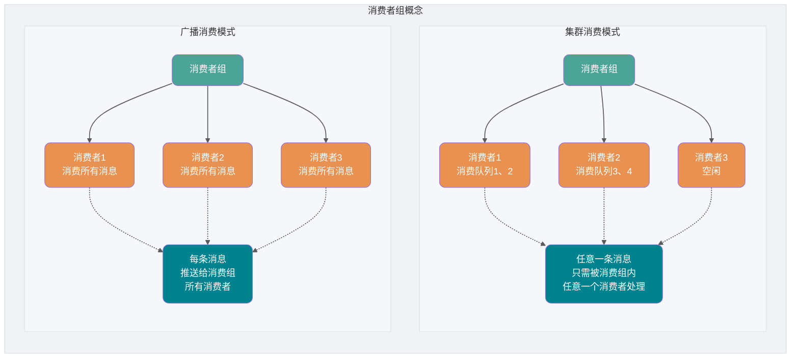

Quan hệ subscription, thứ tự giao nhận, và chiến lược retry tiêu thụ trong consumer group là nhất quán.

- Quan hệ subscription: Apache RocketMQ quản lý quan hệ subscription theo độ chi tiết của consumer group, thực hiện quản lý và truy vết quan hệ subscription.
- Thứ tự giao nhận: Khi server Apache RocketMQ giao tin nhắn cho consumer tiêu thụ, hỗ trợ giao theo thứ tự và giao đồng thời, cách giao nhận được cấu hình thống nhất trong consumer group.
- Chiến lược retry tiêu thụ: Chiến lược retry khi consumer tiêu thụ tin nhắn thất bại, bao gồm số lần retry, cài đặt dead letter queue, v.v.

RocketMQ server phiên bản 5.x: Hành vi tiêu thụ nêu trên của consumer được lấy thống nhất từ consumer group liên kết, do đó hành vi tiêu thụ của tất cả consumer trong cùng một group nhất thiết phải nhất quán, client không cần quan tâm.

RocketMQ server phiên bản lịch sử 3.x/4.x: Logic tiêu thụ nêu trên được định nghĩa bởi interface client consumer, do đó bạn cần tự đảm bảo rằng các consumer trong cùng một group có hành vi tiêu thụ nhất quán khi cấu hình ở phía client consumer. (Từ trang web chính thức)

**So sánh hai chế độ tiêu thụ:**

| Chiều so sánh          | Chế độ Cluster                                                                 | Chế độ Broadcast                                                           |
| ---------------------- | ------------------------------------------------------------------------------ | -------------------------------------------------------------------------- |
| **Tiêu thụ tin nhắn**  | Bất kỳ tin nhắn nào chỉ cần được xử lý bởi bất kỳ một consumer nào trong group | Mỗi tin nhắn được đẩy đến tất cả consumer trong group                      |
| **Scale out/in**       | Có thể tăng/giảm số lượng consumer để nâng cao hoặc giảm khả năng tiêu thụ     | Tăng/giảm số lượng consumer không thể nâng cao hoặc giảm khả năng tiêu thụ |
| **Trường hợp sử dụng** | Cần nâng cao khả năng tiêu thụ, tránh tiêu thụ trùng lặp                       | Cần tất cả consumer đều nhận được tin nhắn                                 |

## Làm thế nào để giải quyết tiêu thụ theo thứ tự và tiêu thụ trùng lặp?

Thực ra, những vấn đề này tôi đã đề cập khi giới thiệu một số tác dụng phụ mà message queue mang lại, tức là những vấn đề này không chỉ liên quan đến RocketMQ mà là mỗi message middleware đều cần giải quyết.

Trong phần trên khi giới thiệu kiến trúc kỹ thuật của RocketMQ, tôi đã cho bạn thấy **cách nó đảm bảo high availability**, ở đây không đề cập đến việc xây dựng từ góc độ vận hành, nếu bạn quan tâm có thể tự mình vào trang chính thức xem ví dụ để xây dựng cluster RocketMQ của riêng mình.

> Thực ra kiến trúc của Kafka về cơ bản tương tự RocketMQ, chỉ là nó dùng Zookeeper làm trung tâm đăng ký, **partition** của nó tương đương với **queue** trong RocketMQ. Còn một số chi tiết nhỏ khác sẽ được đề cập sau.

### Tiêu thụ theo thứ tự

Từ phần giới thiệu kiến trúc kỹ thuật ở trên, chúng ta đã biết rằng **RocketMQ không có thứ tự ở cấp topic, chỉ đảm bảo có thứ tự ở cấp queue**.

Điều này lại liên quan đến hai khái niệm - **thứ tự thông thường** và **thứ tự nghiêm ngặt**.

Thứ tự thông thường là chỉ **các tin nhắn mà consumer nhận được qua cùng một consume queue là có thứ tự**, còn tin nhắn nhận được từ các message queue khác nhau có thể không có thứ tự. Tin nhắn thứ tự thông thường **không đảm bảo thứ tự tin nhắn khi Broker khởi động lại** (trong thời gian ngắn).

Thứ tự nghiêm ngặt là chỉ **tất cả tin nhắn** mà consumer nhận được đều có thứ tự. Tin nhắn thứ tự nghiêm ngặt **vẫn đảm bảo thứ tự tin nhắn ngay cả trong các tình huống bất thường**.

Tuy nhiên, dù thứ tự nghiêm ngặt trông có vẻ tốt, việc thực hiện nó sẽ phải trả giá rất lớn. Nếu bạn dùng chế độ thứ tự nghiêm ngặt, chỉ cần một máy trong cluster Broker không khả dụng thì toàn bộ cluster sẽ không khả dụng. Bạn còn dùng được gì nữa? Hiện tại kịch bản chính cũng chỉ là đồng bộ `binlog`.

Nói chung, `MQ` của chúng ta đều có thể chịu đựng sự mất thứ tự ngắn hạn, nên khuyên dùng chế độ thứ tự thông thường.

Vậy, bây giờ chúng ta đang dùng **chế độ thứ tự thông thường**, từ phần học ở trên chúng ta biết rằng khi Producer sản xuất tin nhắn sẽ thực hiện round-robin (tùy thuộc vào chiến lược cân bằng tải của bạn) để gửi tin nhắn đến các message queue khác nhau trong cùng một topic. Nếu lúc này tôi có một vài tin nhắn lần lượt là tạo đơn hàng, thanh toán, giao hàng của cùng một đơn hàng, theo chiến lược round-robin **ba tin nhắn này sẽ được gửi đến các queue khác nhau**, vì ở các queue khác nhau lúc này không thể dùng đặc tính có thứ tự của queue trong RocketMQ để đảm bảo thứ tự tin nhắn nữa.


Vậy, làm thế nào để giải quyết?

Thực ra rất đơn giản, chúng ta chỉ cần đặt các tin nhắn có cùng ngữ nghĩa vào cùng một queue (ở đây là cùng một đơn hàng), thì có thể dùng **phương pháp Hash modulo** để đảm bảo cùng một đơn hàng ở trong cùng một queue.

**Phiên bản 4.x: Sử dụng MessageQueueSelector**

Phiên bản RocketMQ 4.x thực hiện logic chọn queue tùy chỉnh bằng cách kế thừa `MessageQueueSelector`:

```java
SendResult sendResult = producer.send(msg, new MessageQueueSelector() {
    @Override
    public MessageQueue select(List<MessageQueue> mqs, Message msg, Object arg) {
        //根据订单ID等业务关键字计算队列索引
        Integer orderId = (Integer) arg;
        int index = orderId % mqs.size();
        return mqs.get(index);
    }
}, orderId);
```

**Phiên bản 5.x: Sử dụng Message Group**

Phiên bản RocketMQ 5.x giới thiệu khái niệm **message group**, đảm bảo thứ tự tin nhắn trong cùng một group thông qua việc thiết lập message group:

```java
Message message = messageBuilder.setTopic("topic")
        .setTag("messageTag")
        //设置顺序消息的排序分组
        .setMessageGroup("fifoGroup001")  // 比如使用订单ID作为消息组
        .setBody("messageBody".getBytes())
        .build();
```

**Thuật toán chọn queue**

RocketMQ implement hai thuật toán chọn queue:

- **Thuật toán round-robin** (mặc định): Gửi tin nhắn lần lượt đến các queue của topic được chỉ định, đảm bảo tin nhắn phân phối đều
- **Thuật toán độ trễ giao nhận tối thiểu**: Thống kê độ trễ giao nhận tin nhắn mỗi lần giao, khi chọn queue ưu tiên chọn queue có độ trễ tin nhắn nhỏ

```java
// 启用最小投递延迟算法
producer.setSendLatencyFaultEnable(true);
```

### Xử lý các tình huống đặc biệt

#### Ngoại lệ gửi tin nhắn

Sau khi chọn queue sẽ thiết lập kết nối với Broker, gửi tin nhắn đến Broker qua request mạng, nếu Broker bị sập hoặc mạng không ổn định dẫn đến gửi tin nhắn timeout thì lúc này RocketMQ sẽ thực hiện retry.

Chọn lại message queue trong Broker khác để gửi, mặc định retry hai lần, có thể thiết lập thủ công.

```java
producer.setRetryTimesWhenSendFailed(5);
```

#### Tin nhắn quá lớn

Khi tin nhắn vượt quá 4k, RocketMQ sẽ nén tin nhắn trước khi gửi đến Broker, giảm việc sử dụng tài nguyên mạng.

### Tiêu thụ trùng lặp

Tư tưởng cốt lõi để giải quyết tiêu thụ trùng lặp chỉ có hai chữ - **idempotent**. Trong lập trình, đặc điểm của một thao tác _idempotent_ là bất kể thực hiện bao nhiêu lần, ảnh hưởng tạo ra đều giống với thực hiện một lần. Ví dụ, lúc này chúng ta có một hệ thống xử lý điểm tích lũy cho đơn hàng, mỗi khi có tin nhắn đến nó sẽ cộng điểm tương ứng vào tài khoản của người dùng đã tạo đơn hàng đó. Nhưng một lần, message queue gửi thông tin đơn hàng của FrancisQ cho hệ thống đơn hàng, yêu cầu cộng 500 điểm cho FrancisQ. Nhưng sau khi hệ thống điểm xử lý xong thông tin đơn hàng của FrancisQ và gửi lại thông báo xử lý thành công cho message queue, lại xảy ra sự cố mạng (tất nhiên còn nhiều tình huống khác, ví dụ như Broker khởi động lại đột ngột,...), tin nhắn phản hồi này không gửi được.

Vậy, message queue không nhận được phản hồi từ hệ thống điểm có thử gửi lại tin nhắn này không? Vấn đề đến rồi đây, tôi gửi lại tin nhắn này, lỡ nó lại cộng thêm 500 điểm vào tài khoản của FrancisQ thì sao?

Vì vậy chúng ta cần implement **idempotent** cho consumer của mình, tức là kết quả xử lý cùng một tin nhắn, dù thực hiện bao nhiêu lần cũng không thay đổi.

Vậy làm thế nào để implement idempotent cho business? Điều này vẫn cần kết hợp với business cụ thể. Bạn có thể dùng **ghi vào `Redis`** để đảm bảo, vì `key` và `value` của `Redis` vốn đã hỗ trợ idempotent. Tất nhiên còn có **phương pháp insert database**, dựa vào unique key của database để đảm bảo dữ liệu trùng lặp không được insert nhiều lần.

Nhưng quan trọng nhất vẫn là cần **sử dụng giải pháp cụ thể cho trường hợp cụ thể**, bạn cần biết việc tiêu thụ tin nhắn của mình có hoàn toàn không cho phép tiêu thụ trùng lặp hay có thể chịu đựng tiêu thụ trùng lặp, rồi mới chọn phương thức kiểm tra mạnh hay yếu. Dù sao trong lĩnh vực CS cũng rất hiếm có silver bullet.

Trong toàn bộ lĩnh vực internet, idempotent không chỉ áp dụng cho vấn đề tiêu thụ trùng lặp của message queue, các phương pháp implement idempotent này cũng đồng thời áp dụng cho **việc giải quyết các vấn đề request trùng lặp hoặc gọi trùng lặp trong các tình huống khác**. Ví dụ thiết kế HTTP service thành idempotent, **giải quyết vấn đề frontend hoặc APP submit form data trùng lặp**, cũng có thể thiết kế một microservice thành idempotent, giải quyết vấn đề **gọi trùng lặp do RPC framework tự động retry**.

## RocketMQ thực hiện distributed transaction như thế nào?

Làm thế nào để giải thích distributed transaction? Transaction ai cũng biết chứ? **Hoặc là tất cả đều thực hiện hoặc là tất cả đều không thực hiện**. Trong cùng một hệ thống chúng ta có thể dễ dàng implement transaction, nhưng trong kiến trúc phân tán, chúng ta có nhiều service được deploy ở các hệ thống khác nhau, và các service khác nhau lại cần gọi lẫn nhau. Ví dụ lúc này tôi tạo đơn hàng rồi tăng điểm tích lũy, nếu không đảm bảo được distributed transaction thì sẽ xảy ra tình huống hệ thống A đặt được đơn hàng nhưng hệ thống B tăng điểm thất bại, hoặc hệ thống A không đặt được đơn hàng nhưng hệ thống B lại tăng điểm. Trường hợp trước không thân thiện với người dùng, trường hợp sau không có lợi cho nhà vận hành, đây đều là điều chúng ta không muốn thấy.

Vậy, làm thế nào để giải quyết vấn đề này?

Hiện nay các implement distributed transaction phổ biến có 2PC, TCC và transaction message (cơ chế half message). Mỗi implement đều có trường hợp sử dụng cụ thể, nhưng cũng có vấn đề riêng, **đều không phải là giải pháp hoàn hảo**.

Trong RocketMQ sử dụng **transaction message kết hợp cơ chế transaction check** để giải quyết vấn đề distributed transaction. Tôi đã vẽ một sơ đồ, các bạn có thể đối chiếu với sơ đồ để hiểu.


**Giải thích chi tiết quy trình xử lý transaction message**

1. **Gửi half transaction message**: Producer gửi tin nhắn đến server RocketMQ
2. **Server xác nhận**: Sau khi server persist tin nhắn thành công, trả về Ack xác nhận cho producer rằng tin nhắn đã gửi thành công, lúc này tin nhắn được đánh dấu là "tạm thời chưa thể giao nhận", tin nhắn ở trạng thái này chính là **half transaction message**
3. **Thực thi local transaction**: Producer bắt đầu thực thi logic local transaction
4. **Gửi xác nhận lần hai**: Producer gửi kết quả xác nhận lần hai (Commit hoặc Rollback) đến server dựa vào kết quả thực thi local transaction
5. **Transaction check**: Nếu server chưa nhận được kết quả xác nhận lần hai, hoặc kết quả nhận được là Unknown, sau một khoảng thời gian cố định, server sẽ khởi tạo **message check** đối với message producer
6. **Kiểm tra local transaction**: Sau khi producer nhận được message check, cần kiểm tra kết quả cuối cùng của việc thực thi local transaction tương ứng với tin nhắn
7. **Gửi xác nhận lần hai nữa**: Producer gửi xác nhận lần hai một lần nữa dựa vào trạng thái cuối cùng của local transaction được kiểm tra

Half message được gửi ở bước đầu tiên, ý nghĩa của nó là **trước khi transaction được commit, tin nhắn này không khả dụng với consumer**.

> Vậy, làm thế nào để ghi tin nhắn nhưng không khả dụng với người dùng? Cách làm của RocketMQ transaction message là: nếu tin nhắn là half message, sẽ backup topic và message consume queue của tin nhắn gốc, sau đó **thay đổi topic** thành RMQ_SYS_TRANS_HALF_TOPIC. Vì consumer group chưa subscribe topic này, nên phía consumer không thể tiêu thụ tin nhắn loại half, **sau đó RocketMQ sẽ mở một scheduled task, kéo tin nhắn từ Topic RMQ_SYS_TRANS_HALF_TOPIC để tiêu thụ**, lấy một service provider theo producer group để gửi request check trạng thái transaction, quyết định commit hay rollback tin nhắn dựa vào trạng thái transaction.

Bạn có thể thử hình dung, nếu không có **cơ chế transaction check** bắt đầu từ bước 5, nếu xảy ra sự cố mạng mà bước 4 không gửi được, điều này sẽ tạo ra vấn đề MQ không biết có cần cho consumer tiêu thụ hay không. Trong RocketMQ sử dụng transaction check ở trên để giải quyết, còn trong Kafka thường là trực tiếp ném ra một ngoại lệ để người dùng tự giải quyết.

Bạn cũng cần lưu ý rằng, thao tác `MQ Server` chỉ đến hệ thống B đã không liên quan đến hệ thống A nữa, tức là trong message queue, distributed transaction là - **local transaction và lưu trữ tin nhắn vào message queue mới là cùng một transaction**. Điều này cũng tạo ra **tính nhất quán cuối cùng** của transaction, vì toàn bộ quá trình là bất đồng bộ, **mỗi hệ thống chỉ cần đảm bảo phần transaction của chính mình là được**.

Vấn đề gặp phải trong thực tế: Transaction message cần một transaction listener để lắng nghe xem local transaction có thành công không, và interface transaction listener chỉ được implement một lần. Điều đó có nghĩa là cần viết local transaction của tất cả các loại transaction message vào một interface method, nhất định sẽ tạo ra nhiều coupling và type checking. Dùng Function interface để bọc toàn bộ quá trình business, truyền nó như một tham số vào interface method của listener. Sau đó gọi method apply() của Function để thực thi business, transaction cũng sẽ thực thi trong method apply(). Thực hiện decoupling giữa listener và business, làm cho nó có tính khả thi trong môi trường production thực tế.

1. Mô phỏng nhu cầu thêm lịch sử duyệt của người dùng

```java
@PostMapping("/add")
@ApiOperation("添加用户浏览记录")
public Result<TransactionSendResult> add(Long userId, Long forecastLogId) {

        // 函数式编程:浏览记录入库
        Function<String, Boolean> function = transactionId -> viewHistoryHandler.addViewHistory(transactionId, userId, forecastLogId);

        Map<String, Long> hashMap = new HashMap<>();
        hashMap.put("userId", userId);
        hashMap.put("forecastLogId", forecastLogId);
        String jsonString = JSON.toJSONString(hashMap);

        // 发送事务消息;将本地的事务操作,用函数Function接口接收,作为一个参数传入到方法中
        TransactionSendResult transactionSendResult = mqProducerService.sendTransactionMessage(jsonString, MQDestination.TAG_ADD_VIEW_HISTORY, function);
        return Result.success(transactionSendResult);
}
```

2. Phương thức gửi transaction message

```java
/**
 * 发送事务消息
 *
 * @param msgBody
 * @param tag
 * @param function
 * @return
 */
public TransactionSendResult sendTransactionMessage(String msgBody, String tag, Function<String, Boolean> function) {
    // 构建消息体
    Message<String> message = buildMessage(msgBody);

    // 构建消息投递信息
    String destination = buildDestination(tag);

    TransactionSendResult result = rocketMQTemplate.sendMessageInTransaction(destination, message, function);
    return result;
}
```

3. Producer message listener, chỉ cho phép một class implement listener này

```java
@Slf4j
@RocketMQTransactionListener
public class TransactionMsgListener implements RocketMQLocalTransactionListener {

    @Autowired
    private RedisService redisService;

    /**
     * 执行本地事务（在发送消息成功时执行）
     *
     * @param message
     * @param o
     * @return commit or rollback or unknown
     */
    @Override
    public RocketMQLocalTransactionState executeLocalTransaction(Message message, Object o) {

        // 1、获取事务ID
        String transactionId = null;
        try {
            transactionId = message.getHeaders().get("rocketmq_TRANSACTION_ID").toString();
            // 2、判断传入函数对象是否为空，如果为空代表没有要执行的业务直接抛弃消息
            if (o == null) {
                //返回ROLLBACK状态的消息会被丢弃
                log.info("事务消息回滚，没有需要处理的业务 transactionId={}", transactionId);
                return RocketMQLocalTransactionState.ROLLBACK;
            }
            // 将Object o转换成Function对象
            Function<String, Boolean> function = (Function<String, Boolean>) o;
            // 执行业务 事务也会在function.apply中执行
            Boolean apply = function.apply(transactionId);
            if (apply) {
                log.info("事务提交，消息正常处理 transactionId={}", transactionId);
                //返回COMMIT状态的消息会立即被消费者消费到
                return RocketMQLocalTransactionState.COMMIT;
            }
        } catch (Exception e) {
            log.info("出现异常 返回ROLLBACK transactionId={}", transactionId);
            return RocketMQLocalTransactionState.ROLLBACK;
        }
        return RocketMQLocalTransactionState.ROLLBACK;
    }

    /**
     * 事务回查机制，检查本地事务的状态
     *
     * @param message
     * @return
     */
    @Override
    public RocketMQLocalTransactionState checkLocalTransaction(Message message) {

        String transactionId = message.getHeaders().get("rocketmq_TRANSACTION_ID").toString();

        // 查redis
        MqTransaction mqTransaction = redisService.getCacheObject("mqTransaction:" + transactionId);
        if (Objects.isNull(mqTransaction)) {
            return RocketMQLocalTransactionState.ROLLBACK;
        }
        return RocketMQLocalTransactionState.COMMIT;
    }
}
```

4. Kịch bản business mô phỏng, phương thức ở đây phải được tách ra và đặt trong class khác. Nếu bên gọi và bên được gọi ở trong cùng một class, sẽ xảy ra vấn đề transaction bị vô hiệu hóa.

```java
@Component
public class ViewHistoryHandler {

    @Autowired
    private IViewHistoryService viewHistoryService;

    @Autowired
    private IMqTransactionService mqTransactionService;

    @Autowired
    private RedisService redisService;

    /**
     * 浏览记录入库
     *
     * @param transactionId
     * @param userId
     * @param forecastLogId
     * @return
     */
    @Transactional
    public Boolean addViewHistory(String transactionId, Long userId, Long forecastLogId) {
        // 构建浏览记录
        ViewHistory viewHistory = new ViewHistory();
        viewHistory.setUserId(userId);
        viewHistory.setForecastLogId(forecastLogId);
        viewHistory.setCreateTime(LocalDateTime.now());
        boolean save = viewHistoryService.save(viewHistory);

        // 本地事务信息
        MqTransaction mqTransaction = new MqTransaction();
        mqTransaction.setTransactionId(transactionId);
        mqTransaction.setCreateTime(new Date());
        mqTransaction.setStatus(MqTransaction.StatusEnum.VALID.getStatus());

        // 1.可以把事务信息存数据库
        mqTransactionService.save(mqTransaction);

        // 2.也可以选择存redis,4个小时有效期,'4个小时'是RocketMQ内置的最大回查超时时长,过期未确认将强制回滚
        redisService.setCacheObject("mqTransaction:" + transactionId, mqTransaction, 4L, TimeUnit.HOURS);

        // 放开注释,模拟异常,事务回滚
        // int i = 10 / 0;

        return save;
    }
}
```

5. Tiêu thụ tin nhắn và xử lý idempotent

```java
@Service
@RocketMQMessageListener(topic = MQDestination.TOPIC, selectorExpression = MQDestination.TAG_ADD_VIEW_HISTORY, consumerGroup = MQDestination.TAG_ADD_VIEW_HISTORY)
public class ConsumerAddViewHistory implements RocketMQListener<Message> {
    // 监听到消息就会执行此方法
    @Override
    public void onMessage(Message message) {
        // 幂等校验
        String transactionId = message.getTransactionId();

        // 查redis
        MqTransaction mqTransaction = redisService.getCacheObject("mqTransaction:" + transactionId);

        // 不存在事务记录
        if (Objects.isNull(mqTransaction)) {
            return;
        }

        // 已消费
        if (Objects.equals(mqTransaction.getStatus(), MqTransaction.StatusEnum.CONSUMED.getStatus())) {
            return;
        }

        String msg = new String(message.getBody());
        Map<String, Long> map = JSON.parseObject(msg, new TypeReference<HashMap<String, Long>>() {
        });
        Long userId = map.get("userId");
        Long forecastLogId = map.get("forecastLogId");

        // 下游的业务处理
        // TODO 记录用户喜好,更新用户画像

        // TODO 更新'证券预测文章'的浏览量,重新计算文章的曝光排序

        // 更新状态为已消费
        mqTransaction.setUpdateTime(new Date());
        mqTransaction.setStatus(MqTransaction.StatusEnum.CONSUMED.getStatus());
        redisService.setCacheObject("mqTransaction:" + transactionId, mqTransaction, 4L, TimeUnit.HOURS);
        log.info("监听到消息：msg={}", JSON.toJSONString(map));
    }
}
```

## Làm thế nào để giải quyết vấn đề tin nhắn bị tồn đọng?

Ở phần trên chúng ta đã đề cập đến một chức năng rất quan trọng của message queue - **cắt đỉnh**. Vậy nếu đỉnh này quá lớn dẫn đến tin nhắn tồn đọng trong queue thì sao?

Thực ra vấn đề này có thể tổng quát hóa, vì nguyên nhân gốc rễ tạo ra tin nhắn tồn đọng thực ra chỉ có hai - producer sản xuất quá nhanh hoặc consumer tiêu thụ quá chậm.

Chúng ta có thể suy nghĩ giải quyết vấn đề này từ nhiều góc độ. Khi lưu lượng đạt đỉnh là do producer sản xuất quá nhanh, chúng ta có thể dùng một số phương pháp **rate limiting và degradation**, tất nhiên bạn cũng có thể thêm nhiều instance consumer để mở rộng ngang tăng khả năng tiêu thụ để phù hợp với sự tăng vọt sản xuất. Nếu consumer tiêu thụ quá chậm, chúng ta có thể trước tiên kiểm tra **xem consumer có xảy ra nhiều lỗi tiêu thụ không**, hoặc in log để xem có thread nào bị block, xảy ra vấn đề không giải phóng lock resource, v.v.

> Tất nhiên, cách giải quyết vấn đề tin nhắn tồn đọng nhanh nhất vẫn là tăng instance consumer, nhưng **đồng thời bạn cũng cần tăng số lượng queue của mỗi topic**.
>
> **Lưu ý**: Trong các phiên bản RocketMQ 4.x trở về trước, **một queue chỉ được tiêu thụ bởi một consumer**, nếu bạn chỉ tăng instance consumer sẽ xảy ra tình huống như tôi đã vẽ trong sơ đồ kiến trúc ban đầu (một số consumer không có queue để tiêu thụ).
>
> Nhưng trong các phiên bản RocketMQ 5.x trở đi, **chiến lược cân bằng tải theo độ chi tiết tin nhắn** được giới thiệu, nhiều consumer trong cùng một consumer group có thể cùng tiêu thụ tin nhắn trong cùng một queue theo độ chi tiết tin nhắn, do đó ngay cả khi số lượng consumer nhiều hơn số lượng queue, tất cả consumer cũng có thể tham gia tiêu thụ.


## Backtrack consumption là gì?

Backtrack consumption là chỉ tin nhắn đã được Consumer tiêu thụ thành công, do nhu cầu business cần tiêu thụ lại, trong RocketMQ, sau khi Broker giao thành công tin nhắn cho Consumer, **tin nhắn vẫn cần được giữ lại**. Và tiêu thụ lại thường theo chiều thời gian, ví dụ do hệ thống Consumer gặp sự cố, sau khi khôi phục cần tiêu thụ lại dữ liệu 1 giờ trước, thì Broker cần cung cấp một cơ chế có thể rollback tiến trình tiêu thụ theo chiều thời gian. RocketMQ hỗ trợ backtrack consumption theo thời gian, chiều thời gian chính xác đến mili giây.

## RocketMQ đảm bảo đọc/ghi hiệu suất cao như thế nào

### Phương thức IO truyền thống


IO đọc/ghi truyền thống thực chất là thao tác read + write, toàn bộ quá trình được chia thành các bước sau

- Người dùng gọi phương thức read(), bắt đầu đọc dữ liệu, lúc này xảy ra một lần chuyển đổi ngữ cảnh từ user mode sang kernel mode, tức là chuyển đổi 1 trong sơ đồ
- Sao chép dữ liệu từ đĩa vào kernel buffer qua DMA
- Sao chép dữ liệu từ kernel buffer vào user buffer, như vậy người dùng, tức là code chúng ta viết, có thể lấy được dữ liệu file
- Phương thức read() trả về, lúc này sẽ chuyển từ kernel mode sang user mode, tức là chuyển đổi 2 trong sơ đồ
- Khi chúng ta lấy được dữ liệu, có thể gọi phương thức write(), lúc này ngữ cảnh sẽ chuyển từ user mode sang kernel mode, tức là chuyển đổi 3 trong sơ đồ
- CPU sao chép dữ liệu từ user buffer vào Socket buffer
- Sao chép dữ liệu Socket buffer vào network card
- Phương thức write() trả về, ngữ cảnh chuyển lại từ kernel mode sang user mode, tức là chuyển đổi 4 trong sơ đồ

Toàn bộ quá trình xảy ra 4 lần chuyển đổi ngữ cảnh và 4 lần sao chép dữ liệu, điều này trong trường hợp high concurrency chắc chắn sẽ ảnh hưởng nghiêm trọng đến hiệu suất đọc/ghi, vì vậy đã giới thiệu kỹ thuật zero-copy

### Kỹ thuật Zero-copy

#### mmap

mmap (memory map) là phương pháp ánh xạ file vào bộ nhớ, tức là ánh xạ một file hoặc đối tượng khác vào không gian địa chỉ của process, thực hiện quan hệ ánh xạ một-một giữa địa chỉ đĩa file và một đoạn địa chỉ ảo trong không gian địa chỉ ảo của process.

Nói đơn giản là kernel buffer và application buffer chia sẻ với nhau, từ đó giảm một lần sao chép CPU từ read buffer sang user buffer. Dựa vào đó, sơ đồ kiến trúc ở trên có thể trở thành:


IO đọc/ghi dựa trên mmap thực ra trở thành thao tác mmap + write, tức là dùng mmap thay thế thao tác read trong IO truyền thống.

Khi người dùng khởi tạo mmap call sẽ xảy ra chuyển đổi ngữ cảnh 1, thực hiện memory mapping, sau đó dữ liệu được sao chép vào kernel buffer, mmap trả về, xảy ra chuyển đổi ngữ cảnh 2; sau đó người dùng gọi write, xảy ra chuyển đổi ngữ cảnh 3, sao chép dữ liệu từ kernel buffer vào Socket buffer, write trả về, xảy ra chuyển đổi ngữ cảnh 4.

Xảy ra 4 lần chuyển đổi ngữ cảnh và 3 lần thao tác IO copy, implement trong Java:

```java
FileChannel fileChannel = new RandomAccessFile("test.txt", "rw").getChannel();
MappedByteBuffer mappedByteBuffer = fileChannel.map(FileChannel.MapMode.READ_WRITE, 0, fileChannel.size());
```

#### sendfile

sendfile() cũng giống mmap(), cũng sẽ giảm một lần CPU copy, nhưng đồng thời cũng sẽ giảm hai lần chuyển đổi ngữ cảnh.


Như trong hình, khi người dùng khởi tạo sendfile() call sẽ xảy ra chuyển đổi 1, sau đó dữ liệu được sao chép vào kernel buffer qua DMA, sau đó CPU copy dữ liệu từ kernel buffer vào Socket buffer, cuối cùng copy vào network card, sendfile() trả về, xảy ra chuyển đổi 2. Xảy ra 3 lần copy và 2 lần chuyển đổi. Java cũng cung cấp API tương ứng:

```java
FileChannel channel = FileChannel.open(Paths.get("./test.txt"), StandardOpenOption.WRITE, StandardOpenOption.CREATE);
//调用transferTo方法向目标数据传输
channel.transferTo(position, len, target);
```

Trong code trên, không có thao tác đọc/ghi file mà trực tiếp truyền dữ liệu file đến target buffer đích, tức là sendfile không thể biết dữ liệu cụ thể của file; nhưng mmap thì khác, nó có thể sửa đổi dữ liệu trong kernel buffer. Giả sử nếu cần sửa đổi nội dung file rồi mới truyền, chỉ có mmap mới đáp ứng được.

Qua những giới thiệu ở trên, kết luận là dựa trên kỹ thuật zero-copy, có thể giảm số lần CPU copy và số lần chuyển đổi ngữ cảnh, từ đó có thể thực hiện thao tác đọc/ghi file hiệu quả cao.

RocketMQ bên trong chủ yếu sử dụng zero-copy dựa trên mmap implement (thực ra là gọi API đã đề cập ở trên), dùng để đọc/ghi file, đây cũng là một trong những lý do quan trọng tại sao RocketMQ nhanh.

## Cơ chế flush disk của RocketMQ

Sau khi hiểu kiến trúc và nguyên lý thiết kế của RocketMQ, tiếp theo hãy thảo luận một số vấn đề cốt lõi:

- **Queue trong Topic tồn tại dưới dạng nào?**
- **Tin nhắn trong queue được lưu trữ và persist như thế nào?**
- **Đồng bộ flush disk** và **bất đồng bộ flush disk** là gì? Chúng ảnh hưởng như thế nào đến việc persist?

### Đồng bộ flush disk và bất đồng bộ flush disk


Như trong hình, đồng bộ flush disk cần chờ ACK flush disk thành công, đồng bộ flush disk là một bảo đảm tốt cho độ tin cậy tin nhắn của `MQ`, nhưng **hiệu suất sẽ bị ảnh hưởng đáng kể**, thường phù hợp với các kịch bản business đặc thù như tài chính, v.v.

Còn bất đồng bộ flush disk thường mở một thread để thực hiện thao tác flush disk bất đồng bộ. Việc flush disk tin nhắn được thực hiện theo phương thức submit bất đồng bộ background, **giảm độ trễ đọc/ghi**, nâng cao hiệu suất và throughput của `MQ`, thường phù hợp với các kịch bản business như gửi mã xác nhận mà yêu cầu đảm bảo tin nhắn không quá cao.

Nói chung, **bất đồng bộ flush disk chỉ mất một phần dữ liệu khi Broker đột ngột sập**, bạn có thể thiết lập tham số `FlushDiskType` của Broker để điều chỉnh chiến lược flush disk của mình (ASYNC_FLUSH hoặc SYNC_FLUSH).

### Đồng bộ replication và bất đồng bộ replication

Đồng bộ flush disk và bất đồng bộ flush disk ở trên là ở cấp độ một node đơn lẻ, còn đồng bộ replication và bất đồng bộ replication chủ yếu là chỉ trong chế độ master-slave của `Broker`, khi node master trả về tin nhắn cho client có cần đồng bộ node slave không.

- Đồng bộ replication: Còn gọi là "đồng bộ dual-write", tức là **chỉ khi tin nhắn được đồng bộ dual-write đến cả node master và slave mới trả về ghi thành công**.
- Bất đồng bộ replication: **Sau khi tin nhắn được ghi vào node master thì trả về ghi thành công ngay lập tức**.

Tuy nhiên, nhiều thứ không có giải pháp hoàn hảo, ví dụ như chúng ta viết tin nhắn vào càng nhiều node thì càng đảm bảo độ tin cậy của tin nhắn, nhưng hiệu suất cũng sẽ giảm theo, nên cần lập trình viên lựa chọn phương án master-slave replication phù hợp dựa vào kịch bản business cụ thể.

Vậy, **bất đồng bộ replication có ảnh hưởng đến độ tin cậy tin nhắn như bất đồng bộ flush disk không?**

Câu trả lời là không, vì hai cái là các khái niệm khác nhau, độ tin cậy tin nhắn được đảm bảo thông qua chiến lược flush disk, còn chiến lược đồng bộ/bất đồng bộ replication chỉ ảnh hưởng đến **tính khả dụng**. Nguyên nhân là **trong cấu hình mặc định, RocketMQ không hỗ trợ tự động chuyển đổi master-slave, sau khi node master sập thì producer không thể sản xuất tin nhắn cho node master này nữa** (nhưng sử dụng chế độ DLedger có thể thực hiện tự động chuyển đổi).

Ví dụ lúc này dùng phương thức bất đồng bộ replication, khi node master chưa gửi xong tin nhắn cần đồng bộ thì master sập, lúc này slave sẽ thiếu một phần tin nhắn. Nhưng lúc này producer không thể sản xuất tin nhắn cho master nữa, **consumer có thể tự động chuyển sang slave để tiêu thụ** (chỉ tiêu thụ thôi), nên trong thời gian master sập chỉ sẽ xảy ra tình huống tin nhắn không nhất quán ngắn hạn giữa master và slave, giảm tính khả dụng, và khi master khởi động lại, phần tin nhắn slave chưa kịp sao chép sẽ tiếp tục được sao chép.

Trong kiến trúc single master-slave, nếu một node master sập thì toàn bộ hệ thống sẽ không thể sản xuất tin nhắn nữa. Vậy vấn đề tính khả dụng này có thể giải quyết không? **Có thể giải quyết thông qua kiến trúc multi master-slave**, trong sơ đồ kiến trúc ban đầu, mỗi Topic được phân phối ở các Broker khác nhau.


Nhưng phương thức replication này cũng sẽ mang lại một vấn đề, đó là không thể đảm bảo **thứ tự nghiêm ngặt**. Ở phần trên chúng ta đã đề cập đến cách đảm bảo thứ tự tin nhắn là thông qua việc gửi tin nhắn có cùng ngữ nghĩa vào cùng một queue, dùng queue trong Topic để đảm bảo tính thứ tự. Nếu lúc này node master A phụ trách một loạt tin nhắn có ngữ nghĩa của đơn hàng A, sau đó nó sập, thì các node khác không thể thay thế node master A, nếu bất kỳ node nào cũng có thể lưu trữ bất kỳ tin nhắn nào thì không còn thứ tự nữa.

Trong RocketMQ đã sử dụng DLedger để giải quyết vấn đề này. DLedger yêu cầu khi ghi tin nhắn, **ít nhất tin nhắn phải được sao chép đến hơn nửa số node**, mới trả về ghi thành công cho client, và hỗ trợ tự động chuyển đổi node master thông qua bầu cử.

> DLedger cũng không phải giải pháp hoàn hảo: trong quá trình bầu cử không thể cung cấp service; phải dùng ba node trở lên; nếu nhiều node sập cùng lúc cũng không thể đảm bảo tính khả dụng; yêu cầu tin nhắn sao chép đến hơn nửa node có sự chênh lệch hiệu quả nhất định so với bất đồng bộ replication trực tiếp.

### Cơ chế lưu trữ

Đến đây, các vấn đề flush disk và replication đã được giải quyết.

Tiếp theo thảo luận **queue tồn tại dưới dạng nào? Tin nhắn trong queue được lưu trữ và persist như thế nào?** Điều này liên quan đến thiết kế cấu trúc lưu trữ của RocketMQ. Trước tiên giới thiệu ba vai trò chính trong kiến trúc lưu trữ tin nhắn của RocketMQ - CommitLog, ConsumeQueue và IndexFile.

**Ba thành phần chính của kiến trúc lưu trữ:**

- **CommitLog**: **Thành phần lưu trữ chính của message body và metadata**, lưu trữ nội dung message body được ghi bởi phía Producer, nội dung tin nhắn không có độ dài cố định. Kích thước file đơn mặc định là **1G**, tên file có độ dài 20 ký tự, bổ sung số 0 ở bên trái, phần còn lại là offset bắt đầu, ví dụ 00000000000000000000 đại diện cho file đầu tiên với offset bắt đầu là 0; khi file đầu tiên đầy, file thứ hai là 00000000001073741824 với offset bắt đầu là 1073741824, cứ như vậy tiếp tục. Tin nhắn chủ yếu được **ghi tuần tự vào log file**, khi file đầy, ghi tiếp vào file tiếp theo.
- **ConsumeQueue**: Message consume queue, **mục đích giới thiệu chủ yếu là nâng cao hiệu suất tiêu thụ tin nhắn**. Vì RocketMQ dựa trên chế độ subscription theo Topic, nếu cần duyệt qua CommitLog file để tìm kiếm tin nhắn theo Topic thì rất kém hiệu quả. ConsumeQueue (logical consume queue) **hoạt động như index cho tiêu thụ tin nhắn**, lưu trữ **physical offset bắt đầu** trong CommitLog của tin nhắn queue trong Topic được chỉ định, kích thước tin nhắn size và giá trị HashCode của message Tag. Tổ chức folder của ConsumeQueue: cấu trúc ba cấp topic/queue/file, đường dẫn lưu trữ cụ thể: `$HOME/store/consumequeue/{topic}/{queueId}/{fileName}`. File ConsumeQueue sử dụng thiết kế độ dài cố định, mỗi entry có **20 bytes** (8 bytes physical offset trong commitlog + 4 bytes độ dài tin nhắn + 8 bytes tag hashcode), file đơn gồm **300.000 entry**, mỗi file ConsumeQueue kích thước khoảng **5.72M**.
- **IndexFile**: File index, cung cấp phương pháp tìm kiếm tin nhắn theo key hoặc khoảng thời gian.

Tóm lại, trong toàn bộ cấu trúc lưu trữ tin nhắn, quan trọng nhất là `CommitLog` và ConsumeQueue. ConsumeQueue có thể được hiểu là queue trong Topic.


RocketMQ sử dụng **cấu trúc lưu trữ hybrid**, tức là tất cả queue trong một Broker instance đơn dùng chung một file dữ liệu log (CommitLog) để lưu trữ tin nhắn. Còn Kafka sẽ phân bổ một file lưu trữ độc lập cho mỗi partition.

Lý do RocketMQ làm vậy là **nâng cao hiệu quả ghi dữ liệu**, không phân chia theo Topic nghĩa là có cơ hội cao hơn để lấy **theo lô** tin nhắn để ghi tuần tự, nhưng cũng mang lại một vấn đề: khi đọc tin nhắn nếu duyệt toàn bộ CommitLog file thì hiệu quả rất thấp.

Do đó, RocketMQ sử dụng ConsumeQueue như file index cho mỗi queue để **nâng cao hiệu quả đọc tin nhắn**. Có thể trực tiếp dựa vào sequence number của tin nhắn trong queue, tính toán vị trí toàn cục của index (sequence number index × độ dài cố định index 20), sau đó đọc trực tiếp entry index này, rồi dựa vào vị trí toàn cục của tin nhắn được ghi trong index để tìm tin nhắn.

Dưới đây kết hợp sơ đồ kiến trúc để hiểu cấu trúc lưu trữ:


> Nếu bạn chưa hiểu phần trên hãy đọc kỹ phần phân tích quy trình dưới đây!

Trước tiên, ở phía trên cùng của hình có thể trực tiếp **hiểu `ConsumerQueue` là Queue**.

Trong hình ở phía bên trái cho thấy khối màu đỏ đại diện cho tin nhắn đã được ghi, khối đường nét đứt đại diện cho tin nhắn đang chờ được ghi. Producer bên trái gửi tin nhắn sẽ chỉ định Topic, `QueueId` và nội dung tin nhắn cụ thể, còn trong Broker không phân loại tin nhắn, trực tiếp **lưu tất cả tuần tự vào CommitLog**. Dựa vào Topic và `QueueId` được producer chỉ định, lưu offset (địa chỉ vật lý) của tin nhắn này trong CommitLog, kích thước tin nhắn và hash value của tag vào file index ConsumeQueue tương ứng.

Trong mỗi queue lưu `ConsumeOffset` tức là vị trí tiêu thụ của mỗi consumer group, khi consumer kéo tin nhắn để tiêu thụ chỉ cần lấy tin nhắn tiếp theo chưa được tiêu thụ dựa vào `ConsumeOffset` là được.

Trên đây là nguyên lý cốt lõi của kiến trúc lưu trữ RocketMQ.

Cuối cùng để lại một câu hỏi suy nghĩ: **Tại sao file CommitLog lại được thiết kế thành độ dài kích thước cố định?** Gợi ý: Liên quan đến **cơ chế memory mapping (mmap)**.

## Tổng kết

Bài viết này giới thiệu hệ thống các kiến thức cốt lõi của RocketMQ, sau đây là tóm tắt nội dung chính:

**Giá trị cốt lõi của message queue**

- **Bất đồng bộ**: Nâng cao tốc độ phản hồi của hệ thống, xử lý bất đồng bộ các luồng không cốt lõi
- **Decoupling**: Giảm độ coupling giữa các hệ thống, thực hiện loose coupling thông qua chế độ publish-subscribe
- **Cắt đỉnh**: Giảm áp lực lưu lượng tức thời, bảo vệ hệ thống downstream không bị quá tải

**Điểm quan trọng trong kiến trúc RocketMQ**

| Thành phần     | Trách nhiệm cốt lõi                                                                             |
| -------------- | ----------------------------------------------------------------------------------------------- |
| **NameServer** | Registry không trạng thái, các node không giao tiếp với nhau, hướng đến sự đơn giản và hiệu quả |
| **Broker**     | Lưu trữ và giao nhận tin nhắn, hỗ trợ kiến trúc master-slave và chế độ DLedger                  |
| **Proxy**      | Mới trong 5.0, tách biệt tính toán và lưu trữ, hỗ trợ gRPC protocol                             |
| **Producer**   | Message producer, hỗ trợ gửi đồng bộ, bất đồng bộ, one-way                                      |
| **Consumer**   | Message consumer, hỗ trợ ba chế độ Push, Pull, Simple                                           |

**So sánh các loại tin nhắn**

| Loại tin nhắn             | Trường hợp sử dụng                    | Đặc tính chính                                     |
| ------------------------- | ------------------------------------- | -------------------------------------------------- |
| **Tin nhắn thông thường** | Decoupling microservice, event-driven | Không yêu cầu thứ tự, tin nhắn độc lập với nhau    |
| **Tin nhắn có thứ tự**    | Xử lý đơn hàng, đồng bộ dữ liệu       | Có thứ tự nghiêm ngặt trong cùng một message group |
| **Tin nhắn định thời**    | Delayed task, xử lý timeout           | 5.x hỗ trợ định thời tùy ý                         |
| **Transaction message**   | Distributed transaction               | Cơ chế half message + transaction check            |

**Nâng cấp cốt lõi phiên bản 5.x**

- **Cân bằng tải theo độ chi tiết tin nhắn**: Giải quyết vấn đề long tail, tin nhắn được phân bổ động cho consumer rảnh rỗi
- **Tách biệt tính toán và lưu trữ**: Thành phần Proxy đảm nhận protocol adaptation và logic tính toán, Broker chuyên về lưu trữ
- **Tin nhắn định thời tùy ý**: Không còn bị giới hạn bởi các cấp delay cố định, hỗ trợ định thời mili giây

**Thiết kế hiệu suất cao**

- **Ghi tuần tự**: CommitLog sử dụng ghi tuần tự, tận dụng tối đa hiệu suất cao của sequential IO đĩa
- **Zero-copy**: Dựa trên memory mapping mmap, giảm số lần sao chép dữ liệu và chuyển đổi ngữ cảnh
- **Thiết kế index**: ConsumeQueue hoạt động như message index, tránh duyệt CommitLog

**Đảm bảo độ tin cậy**

- **Chiến lược flush disk**: Đồng bộ flush disk đảm bảo không mất tin nhắn, bất đồng bộ flush disk nâng cao hiệu suất
- **Master-slave replication**: Đồng bộ replication (dual-write) đảm bảo tính nhất quán dữ liệu, bất đồng bộ replication nâng cao tính khả dụng
- **DLedger**: Dựa trên giao thức Raft thực hiện tự động chuyển đổi master-slave, nâng cao khả năng high availability

<!-- @include: @article-footer.snippet.md -->
