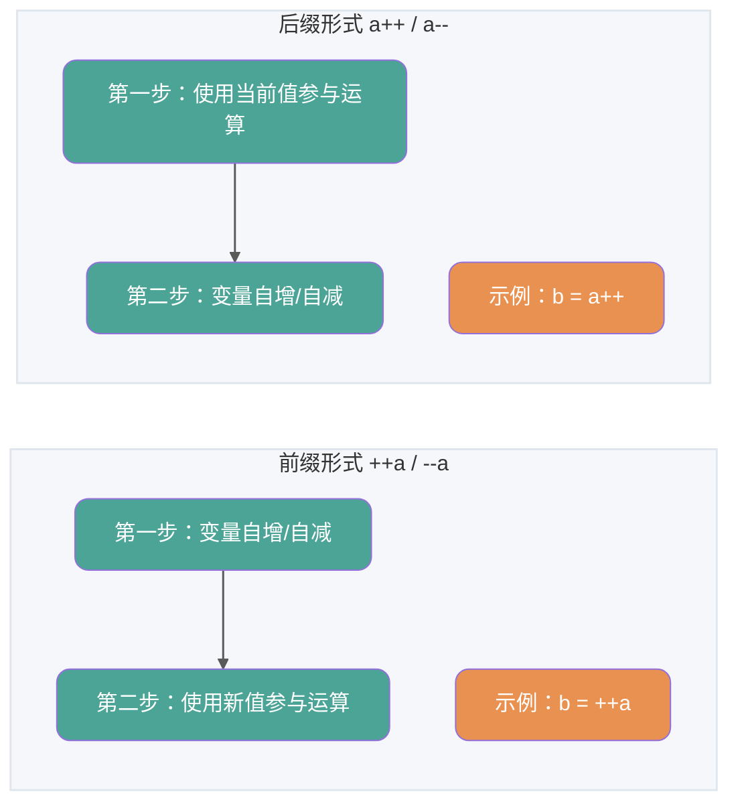
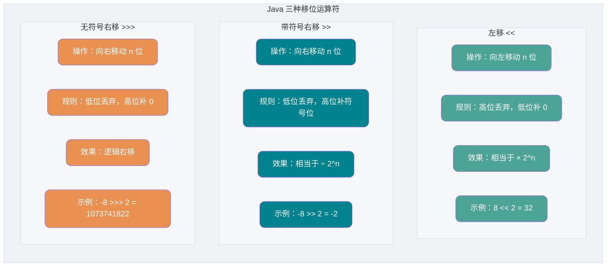
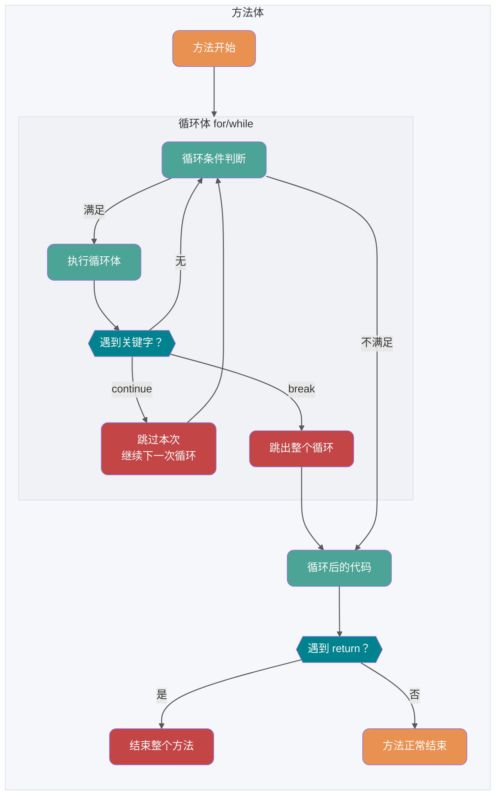
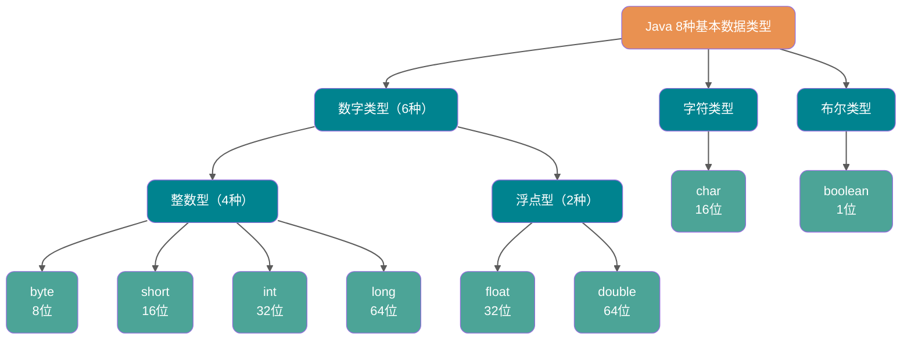
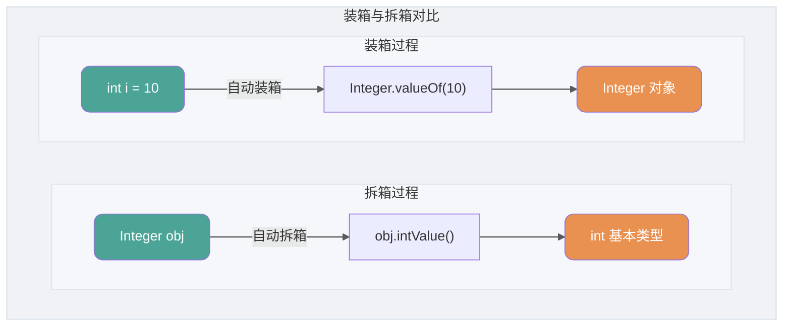

<!-- @include: @small-advertisement.snippet.md -->

## Khái niệm cơ bản và kiến thức nền

### Java có những đặc điểm gì?

1. Dễ học (cú pháp đơn giản, dễ tiếp cận);
2. Hướng đối tượng (encapsulation, inheritance, polymorphism);
3. Độc lập nền tảng (JVM đảm bảo tính độc lập nền tảng);
4. Hỗ trợ đa luồng (C++ không có cơ chế đa luồng tích hợp sẵn nên phải gọi tính năng đa luồng của hệ điều hành, trong khi Java cung cấp hỗ trợ đa luồng sẵn có);
5. Độ tin cậy cao (có cơ chế xử lý ngoại lệ và quản lý bộ nhớ tự động);
6. Bảo mật (thiết kế của ngôn ngữ Java cung cấp nhiều cơ chế bảo vệ như access modifier, hạn chế truy cập trực tiếp vào tài nguyên hệ điều hành);
7. Hiệu năng tốt (được tối ưu qua JIT compiler và các công nghệ khác);
8. Hỗ trợ lập trình mạng và rất tiện lợi;
9. Kết hợp cả biên dịch và thông dịch;
10. ……

> **🐛 Đính chính (xem: [issue#544](https://github.com/Snailclimb/JavaGuide/issues/544))**: Từ C++11 (năm 2011), C++ đã giới thiệu thư viện đa luồng. Trên Windows, Linux, macOS đều có thể dùng `std::thread` và `std::async` để tạo thread. Tham khảo: <http://www.cplusplus.com/reference/thread/thread/?kw=thread>

🌈 Mở rộng thêm:

Khẩu hiệu “Write Once, Run Anywhere (Viết một lần, chạy mọi nơi)” quả thực rất kinh điển, lưu truyền nhiều năm! Đến tận ngày nay vẫn có nhiều người cho rằng khả năng đa nền tảng là lợi thế lớn nhất của Java. Nhưng thực ra, đa nền tảng không còn là điểm bán hàng lớn nhất của Java nữa, các tính năng mới của JDK cũng không phải. Hiện nay công nghệ ảo hóa đã rất trưởng thành, ví dụ bạn có thể dùng Docker để đạt được đa nền tảng một cách dễ dàng. Theo tôi, hệ sinh thái mạnh mẽ của Java mới là điều quan trọng nhất!

### Java SE vs Java EE

- Java SE (Java Platform, Standard Edition): Phiên bản tiêu chuẩn của nền tảng Java, là nền tảng của ngôn ngữ lập trình Java. Nó bao gồm các thư viện lớp cốt lõi và các thành phần như JVM để hỗ trợ phát triển và chạy ứng dụng Java. Java SE có thể dùng để xây dựng ứng dụng desktop hoặc ứng dụng server đơn giản.
- Java EE (Java Platform, Enterprise Edition): Phiên bản doanh nghiệp của nền tảng Java, xây dựng trên nền Java SE, bao gồm các tiêu chuẩn và đặc tả hỗ trợ phát triển và triển khai ứng dụng cấp doanh nghiệp (như Servlet, JSP, EJB, JDBC, JPA, JTA, JavaMail, JMS). Java EE dùng để xây dựng các ứng dụng Java phía server phân tán, di động, mạnh mẽ, có khả năng mở rộng và bảo mật như ứng dụng Web.

Nói đơn giản, Java SE là phiên bản cơ bản, Java EE là phiên bản nâng cao. Java SE phù hợp hơn để phát triển ứng dụng desktop hoặc server đơn giản, Java EE phù hợp hơn để phát triển ứng dụng doanh nghiệp phức tạp hoặc ứng dụng Web.

Ngoài Java SE và Java EE, còn có Java ME (Java Platform, Micro Edition). Java ME là phiên bản thu nhỏ của Java, chủ yếu dùng để phát triển ứng dụng cho thiết bị điện tử nhúng như điện thoại, PDA, set-top box, tủ lạnh, máy điều hòa, v.v. Java ME không cần chú trọng nhiều, chỉ cần biết là có nó, hiện nay gần như không còn dùng nữa.

### ⭐️JVM vs JDK vs JRE

#### JVM

JVM (Java Virtual Machine - Máy ảo Java) là máy ảo chạy bytecode Java. JVM có các triển khai riêng cho từng hệ điều hành (Windows, Linux, macOS) với mục tiêu là dùng cùng một bytecode nhưng cho kết quả giống nhau trên mọi nền tảng. Bytecode và các triển khai JVM trên các hệ điều hành khác nhau chính là chìa khóa giúp Java “compile một lần, chạy mọi nơi”.

Như hình bên dưới, các ngôn ngữ lập trình khác nhau (Java, Groovy, Kotlin, JRuby, Clojure ...) được biên dịch thành file `.class` thông qua compiler của chúng, rồi cuối cùng chạy trên các nền tảng khác nhau (Windows, Mac, Linux) thông qua JVM.


**JVM không chỉ có một loại! Miễn là tuân thủ đặc tả JVM, bất kỳ công ty, tổ chức hoặc cá nhân nào đều có thể phát triển JVM riêng của mình.** Tức là HotSpot VM mà chúng ta thường dùng chỉ là một trong nhiều triển khai của đặc tả JVM.

Ngoài HotSpot VM phổ biến nhất, còn có J9 VM, Zing VM, JRockit VM, v.v. Wikipedia có bảng so sánh các JVM phổ biến: [Comparison of Java virtual machines](https://en.wikipedia.org/wiki/Comparison_of_Java_virtual_machines). Bạn cũng có thể tìm đặc tả JVM tương ứng với từng phiên bản JDK tại [Java SE Specifications](https://docs.oracle.com/javase/specs/index.html).


#### JDK và JRE

JDK (Java Development Kit) là bộ công cụ phát triển Java đầy đủ tính năng dành cho lập trình viên, dùng để tạo và biên dịch chương trình Java. Nó bao gồm JRE (Java Runtime Environment), compiler `javac` và các công cụ khác như `javadoc` (tạo tài liệu), `jdb` (debugger), `jconsole` (công cụ monitor), `javap` (decompiler), v.v.

JRE là môi trường cần thiết để chạy các chương trình Java đã biên dịch, bao gồm hai phần chính:

1. **JVM**: Máy ảo Java như đã đề cập ở trên.
2. **Java Class Library**: Bộ thư viện lớp chuẩn, cung cấp các chức năng và API thông dụng (như I/O, giao tiếp mạng, cấu trúc dữ liệu, v.v.).

Nói đơn giản, JRE chỉ chứa môi trường và thư viện cần thiết để chạy chương trình Java, trong khi JDK không chỉ có JRE mà còn có các công cụ để phát triển và debug.

Nếu cần viết, biên dịch chương trình Java hoặc dùng Java API documentation thì phải cài JDK. Một số ứng dụng cần tính năng Java (như chuyển đổi JSP sang Servlet hoặc dùng reflection) cũng có thể cần JDK để biên dịch và chạy. Do đó, dù không làm Java development, đôi khi vẫn cần cài JDK.

Hình dưới mô tả rõ ràng mối quan hệ giữa JDK, JRE và JVM.


Tuy nhiên, từ JDK 9 trở đi, không cần phân biệt JDK và JRE nữa. Thay vào đó là hệ thống module (JDK được tổ chức lại thành 94 module) + công cụ [jlink](http://openjdk.java.net/jeps/282) (công cụ dòng lệnh mới ra mắt cùng Java 9, dùng để tạo Java runtime image tùy chỉnh chỉ chứa các module cần thiết cho ứng dụng). Và từ JDK 11, Oracle không còn cung cấp bản tải JRE riêng nữa.

Trong bài viết [Tổng quan tính năng mới Java 9](https://javaguide.cn/java/new-features/java9.html), tôi đã đề cập khi giới thiệu hệ thống module:

> Sau khi giới thiệu hệ thống module, JDK được tổ chức lại thành 94 module. Ứng dụng Java có thể dùng công cụ jlink mới để tạo runtime image tùy chỉnh chỉ chứa các module JDK mà ứng dụng phụ thuộc vào. Điều này giúp giảm đáng kể kích thước môi trường runtime Java.

Tức là có thể dùng jlink để tạo một runtime nhỏ hơn theo nhu cầu, thay vì mọi ứng dụng đều phải dùng cùng một JRE đầy đủ.

Java runtime image tùy chỉnh, module hóa giúp đơn giản hóa việc triển khai ứng dụng Java, tiết kiệm bộ nhớ, tăng cường bảo mật và khả năng bảo trì. Điều này rất quan trọng để đáp ứng yêu cầu của kiến trúc ứng dụng hiện đại như virtualization, containerization, microservices và cloud-native development.

### ⭐️Bytecode là gì? Lợi ích của việc dùng bytecode?

Trong Java, code mà JVM có thể hiểu được gọi là bytecode (tức là các file có đuôi `.class`). Bytecode không hướng đến bất kỳ processor cụ thể nào mà chỉ hướng đến máy ảo. Thông qua bytecode, Java giải quyết một phần vấn đề hiệu năng thấp của ngôn ngữ thông dịch truyền thống, đồng thời vẫn giữ lại tính di động của ngôn ngữ thông dịch. Do đó, chương trình Java khi chạy vẫn khá hiệu quả (dù vẫn có khoảng cách nhất định so với C, C++, Rust, Go), và vì bytecode không gắn với một máy cụ thể, chương trình Java có thể chạy trên nhiều hệ điều hành khác nhau mà không cần biên dịch lại.

**Quá trình từ source code đến khi chạy của chương trình Java được mô tả như hình dưới**:


Chúng ta cần đặc biệt chú ý bước `.class -> machine code`. Ở bước này, JVM class loader trước tiên load file bytecode, sau đó interpreter diễn giải và thực thi từng dòng — cách này tương đối chậm. Hơn nữa, một số method và code block được gọi thường xuyên (gọi là "hot code"), do đó JIT (Just in Time Compilation) compiler được giới thiệu sau này. JIT thuộc loại compile tại runtime. Khi JIT compiler hoàn thành lần compile đầu tiên, nó sẽ lưu lại machine code tương ứng với bytecode để lần sau dùng trực tiếp. Machine code chạy nhanh hơn Java interpreter. Đây là lý do tại sao ta hay nói **Java là ngôn ngữ kết hợp cả biên dịch và thông dịch**.

> 🌈 Đọc thêm:
>
> - [Nguyên lý và thực hành JIT compiler trong Java - Meituan Tech Team](https://tech.meituan.com/2020/10/22/java-jit-practice-in-meituan.html)
> - [Xây dựng microservice dựa trên static compilation - Alibaba Middleware](https://mp.weixin.qq.com/s/4haTyXUmh8m-dBQaEzwDJw)


> HotSpot áp dụng phương pháp Lazy Evaluation. Theo quy tắc 80/20, chỉ một phần nhỏ code tiêu tốn phần lớn tài nguyên hệ thống (hot code), và đó chính là phần JIT cần compile. JVM thu thập thông tin mỗi khi code được thực thi và tối ưu hóa tương ứng, do đó code chạy càng nhiều lần thì càng nhanh hơn.

Mối quan hệ giữa JDK, JRE, JVM, JIT được mô tả trong hình dưới.


Hình dưới là mô hình cấu trúc tổng quát của JVM.


### ⭐️Tại sao nói Java “kết hợp cả biên dịch và thông dịch”?

Vấn đề này thực ra đã được đề cập khi nói về bytecode, nhưng vì quan trọng nên sẽ nhắc lại ở đây.

Chúng ta có thể phân loại ngôn ngữ lập trình bậc cao theo cách thực thi chương trình thành hai loại:

- **Biên dịch (Compiled)**: [Ngôn ngữ biên dịch](https://zh.wikipedia.org/wiki/%E7%B7%A8%E8%AD%AF%E8%AA%9E%E8%A8%80) dùng [compiler](https://zh.wikipedia.org/wiki/%E7%B7%A8%E8%AD%AF%E5%99%A8) để dịch toàn bộ source code thành machine code có thể chạy trên nền tảng đó. Nhìn chung, ngôn ngữ biên dịch chạy nhanh hơn nhưng tốc độ phát triển chậm hơn. Các ngôn ngữ biên dịch phổ biến: C, C++, Go, Rust, v.v.
- **Thông dịch (Interpreted)**: [Ngôn ngữ thông dịch](https://zh.wikipedia.org/wiki/%E7%9B%B4%E8%AD%AF%E8%AA%9E%E8%A8%80) dùng [interpreter](https://zh.wikipedia.org/wiki/直譯器) để dịch từng dòng code thành machine code rồi thực thi. Ngôn ngữ thông dịch phát triển nhanh hơn nhưng chạy chậm hơn. Các ngôn ngữ thông dịch phổ biến: Python, JavaScript, PHP, v.v.


Theo Wikipedia:

> Công nghệ [JIT (Just-in-time compilation)](https://zh.wikipedia.org/wiki/即時編譯) được phát triển để cải thiện hiệu năng của ngôn ngữ thông dịch, đã thu hẹp khoảng cách giữa hai loại ngôn ngữ này. Công nghệ này kết hợp ưu điểm của cả hai: giống ngôn ngữ biên dịch, nó trước tiên compile source code thành [bytecode](https://zh.wikipedia.org/wiki/字节码). Đến lúc thực thi, bytecode mới được dịch và chạy. [Java](https://zh.wikipedia.org/wiki/Java) và [LLVM](https://zh.wikipedia.org/wiki/LLVM) là đại diện tiêu biểu của công nghệ này.
>
> Đọc thêm: [Nguyên lý và thực hành JIT compiler trong Java](https://tech.meituan.com/2020/10/22/java-jit-practice-in-meituan.html)

**Tại sao nói Java “kết hợp cả biên dịch và thông dịch”?**

Vì Java vừa có đặc điểm của ngôn ngữ biên dịch, vừa có đặc điểm của ngôn ngữ thông dịch. Chương trình Java phải trải qua hai bước: biên dịch rồi mới thông dịch. Code Java cần được compile trước để tạo ra bytecode (file `.class`), sau đó bytecode này mới được Java interpreter thông dịch và thực thi.

### AOT có ưu điểm gì? Tại sao không dùng AOT hoàn toàn?

JDK 9 giới thiệu một chế độ compile mới là **AOT (Ahead of Time Compilation)**. Khác với JIT, chế độ này compile chương trình thành machine code trước khi chạy, thuộc loại static compilation (C, C++, Rust, Go cũng là static compilation). AOT tránh được các chi phí warm-up của JIT, giúp tăng tốc khởi động Java và tránh thời gian warm-up dài. Ngoài ra, AOT còn giảm bộ nhớ và tăng bảo mật (code sau khi AOT compile khó bị decompile và sửa đổi hơn), đặc biệt phù hợp với cloud-native.

**So sánh các chỉ số quan trọng giữa JIT và AOT**:

| Tiêu chí              | JIT (Just-in-Time)           | AOT (Ahead-of-Time)                       |
| --------------------- | ---------------------------- | ----------------------------------------- |
| **Thời điểm compile** | Compile lúc runtime          | Compile trước khi chạy                    |
| **Tốc độ khởi động**  | Chậm hơn (cần warm-up)       | Nhanh (không cần warm-up)                 |
| **Hiệu năng đỉnh**    | Cao hơn (tối ưu lúc runtime) | Thấp hơn (thiếu thông tin runtime)        |
| **Bộ nhớ sử dụng**    | Cao hơn                      | Thấp hơn                                  |
| **Kích thước file**   | Nhỏ hơn                      | Lớn hơn (chứa machine code)               |
| **Hỗ trợ dynamic**    | Hỗ trợ đầy đủ                | Hạn chế (reflection, dynamic proxy, v.v.) |
| **Phù hợp cho**       | Service chạy dài hạn         | Cloud-native, Serverless, CLI tool        |


Rõ ràng, **ưu thế chính của AOT là thời gian khởi động, bộ nhớ và kích thước file**. **Ưu thế chính của JIT là khả năng xử lý đỉnh cao hơn**, giúp giảm độ trễ tối đa của request.

Nhắc đến AOT không thể không nhắc đến [GraalVM](https://www.graalvm.org/)! GraalVM là một JDK hiệu năng cao (bản phân phối JDK đầy đủ), có thể chạy Java và các ngôn ngữ JVM khác, cũng như các ngôn ngữ không phải JVM như JavaScript, Python. GraalVM cung cấp cả AOT lẫn JIT compilation. Bạn có thể xem tài liệu chính thức: <https://www.graalvm.org/latest/docs/>. Hoặc tham khảo một số bài viết:

- [Xây dựng microservice dựa trên static compilation](https://mp.weixin.qq.com/s/4haTyXUmh8m-dBQaEzwDJw)
- [Hướng tới Native hóa: Ví dụ và nguyên lý AOT của Spring & Dubbo](https://cn.dubbo.apache.org/zh-cn/blog/2023/06/28/%e8%b5%b0%e5%90%91-native-%e5%8c%96springdubbo-aot-%e6%8a%80%e6%9c%af%e7%a4%ba%e4%be%8b%e4%b8%8e%e5%8e%9f%e7%90%86%e8%ae%b2%e8%a7%a3/)

**AOT có nhiều ưu điểm như vậy, tại sao không dùng hoàn toàn?**

Như đã so sánh ở trên, JIT và AOT mỗi loại đều có ưu điểm riêng. AOT phù hợp hơn với cloud-native hiện tại và hỗ trợ tốt kiến trúc microservice. Tuy nhiên, AOT không hỗ trợ một số tính năng động của Java như reflection, dynamic proxy, dynamic loading, JNI (Java Native Interface), v.v. Trong khi đó, nhiều framework và thư viện (như Spring, CGLIB) đều dùng các tính năng này. Nếu chỉ dùng AOT, sẽ không thể dùng được các framework và thư viện đó, hoặc phải thích ứng và tối ưu riêng. Ví dụ, CGLIB dynamic proxy dùng công nghệ ASM — nguyên lý của nó là tạo và load file bytecode (`.class`) đã được sửa đổi trực tiếp trong bộ nhớ lúc runtime. Nếu dùng AOT hoàn toàn thì không thể dùng ASM. Chính vì cần hỗ trợ các tính năng động như vậy nên người ta chọn JIT compiler.

### Oracle JDK vs OpenJDK

Có thể nhiều người chưa tiếp xúc với OpenJDK. Vậy Oracle JDK và OpenJDK có sự khác biệt lớn không? Dưới đây là phần giải đáp dựa trên các tài liệu thu thập được.

Trước tiên, năm 2006 SUN mở mã nguồn Java, từ đó ra đời OpenJDK. Năm 2009, Oracle mua lại Sun và tạo ra Oracle JDK dựa trên OpenJDK. Oracle JDK là closed-source, và trong các phiên bản đầu (Java 8 ~ Java 11) có thêm một số tính năng và công cụ riêng so với OpenJDK.

Thứ hai, với Java 7, OpenJDK và Oracle JDK rất giống nhau. Oracle JDK được xây dựng dựa trên OpenJDK 7, chỉ thêm một vài tính năng nhỏ, và được các kỹ sư Oracle tham gia bảo trì.

Đoạn trích dưới đây từ blog chính thức của Oracle năm 2012:

> Hỏi: Sự khác biệt giữa source code trong repository OpenJDK và code dùng để build Oracle JDK là gì?
>
> Đáp: Rất gần nhau - Quá trình build Oracle JDK dựa trên OpenJDK 7, chỉ thêm một vài phần như deployment code (bao gồm Java plugin và Java WebStart của Oracle), một số third-party component closed-source (như graphic rasterizer), một số third-party component open-source (như Rhino), và một số thứ lặt vặt như tài liệu bổ sung hoặc font chữ third-party. Trong tương lai, mục tiêu của chúng tôi là open-source toàn bộ Oracle JDK, ngoại trừ những phần chúng tôi coi là tính năng thương mại.

Tóm tắt sự khác biệt giữa Oracle JDK và OpenJDK:

1. **Open-source hay không**: OpenJDK là mô hình tham chiếu và hoàn toàn open-source. Oracle JDK được triển khai dựa trên OpenJDK nhưng không hoàn toàn open-source. (Quan điểm cá nhân: JDK ban đầu do SUN phát triển, sau đó SUN bán cho Oracle. Oracle nổi tiếng với Oracle Database vốn là closed-source, nên họ không muốn open-source hoàn toàn. Nhưng SUN đã open-source JDK rồi, nếu Oracle đóng lại sẽ khiến cộng đồng Java mất niềm tin. Vì vậy Oracle chọn cách thông minh: open-source một phần core, tạo ra hai nhánh riêng biệt — OpenJDK cho cộng đồng, Oracle JDK cho thương mại, và Oracle có thể lấy những tính năng hay từ OpenJDK để đưa vào Oracle JDK.) OpenJDK: [https://github.com/openjdk/jdk](https://github.com/openjdk/jdk).
2. **Miễn phí hay không**: Oracle JDK có bản miễn phí nhưng thường giới hạn thời gian. Từ JDK 17 trở đi có thể phân phối và dùng thương mại miễn phí trong 3 năm, sau đó phải trả phí. Trước JDK 8u221 có thể dùng miễn phí vô thời hạn nếu không upgrade. OpenJDK hoàn toàn miễn phí.
3. **Tính năng**: Oracle JDK bổ sung một số tính năng và công cụ riêng trên nền OpenJDK như Java Flight Recorder (JFR), Java Mission Control (JMC), v.v. Tuy nhiên, từ Java 11 trở đi, Oracle JDK và OpenJDK gần như tương đương, hầu hết các component độc quyền của Oracle JDK đã được donate cho các tổ chức open-source.
4. **Độ ổn định**: OpenJDK không cung cấp LTS, trong khi Oracle JDK ra một phiên bản LTS khoảng 3 năm một lần. Tuy nhiên, nhiều công ty đã cung cấp phiên bản LTS dựa trên OpenJDK với chu kỳ tương tự. Nên thực tế độ ổn định của hai bên tương đương nhau.
5. **Giấy phép**: Oracle JDK được cấp phép theo BCL/OTN, còn OpenJDK theo GPL v2.

> Oracle JDK tốt vậy, tại sao vẫn cần OpenJDK?
>
> Đáp:
>
> 1. OpenJDK là open-source, nghĩa là bạn có thể tùy chỉnh theo nhu cầu. Ví dụ, Alibaba đã phát triển Dragonwell8 dựa trên OpenJDK: [https://github.com/alibaba/dragonwell8](https://github.com/alibaba/dragonwell8)
> 2. OpenJDK miễn phí thương mại (đó là lý do tại sao cài JDK qua yum package manager mặc định là OpenJDK). Dù Oracle JDK cũng có phiên bản miễn phí (như JDK 8), nhưng không phải tất cả phiên bản đều miễn phí.
> 3. OpenJDK cập nhật nhanh hơn. Oracle JDK thường ra phiên bản mới mỗi 6 tháng, còn OpenJDK khoảng 3 tháng một lần. (Đó là lý do Oracle JDK ổn định hơn — họ để OpenJDK "thử nghiệm" trước, sửa hầu hết vấn đề rồi mới release trên Oracle JDK.)
>
> Vì những lý do trên, OpenJDK vẫn rất cần thiết!


**Nên chọn Oracle JDK hay OpenJDK?**

Khuyên dùng OpenJDK hoặc các bản phân phối dựa trên OpenJDK, như Amazon Corretto của AWS, Alibaba Dragonwell.

🌈 Mở rộng thêm:

- Giấy phép BCL (Oracle Binary Code License Agreement): Có thể dùng JDK (bao gồm thương mại), nhưng không được sửa đổi.
- Giấy phép OTN (Oracle Technology Network License Agreement): Các phiên bản JDK từ 11 trở đi dùng giấy phép này, có thể dùng cá nhân nhưng thương mại phải trả phí.

### Sự khác biệt giữa Java và C++?

Dù nhiều người chưa học C++, nhưng interviewer vẫn hay so sánh Java với C++! Không có cách nào khác, dù chưa học C++ vẫn phải nhớ.

Mặc dù Java và C++ đều là ngôn ngữ hướng đối tượng, đều hỗ trợ encapsulation, inheritance và polymorphism, nhưng chúng vẫn có nhiều điểm khác biệt:

- Java không cung cấp pointer để truy cập trực tiếp vào bộ nhớ, giúp bộ nhớ an toàn hơn.
- Class trong Java chỉ hỗ trợ single inheritance, còn C++ hỗ trợ multiple inheritance. Tuy nhiên, interface trong Java có thể multiple inheritance.
- Java có cơ chế Garbage Collection (GC) tự động, lập trình viên không cần giải phóng bộ nhớ thủ công.
- C++ hỗ trợ cả method overloading lẫn operator overloading, nhưng Java chỉ hỗ trợ method overloading (operator overloading tăng độ phức tạp, không phù hợp với triết lý thiết kế ban đầu của Java).
- ……

## Cú pháp cơ bản

### Comment trong Java có những loại nào?

Java có ba loại comment:

1. **Single-line comment (comment một dòng)**: Thường dùng để giải thích tác dụng của một dòng code trong method.

2. **Multi-line comment (comment nhiều dòng)**: Thường dùng để giải thích tác dụng của một đoạn code.

3. **Documentation comment (Javadoc comment)**: Thường dùng để tạo tài liệu Java API.

Trong thực tế, single-line comment và documentation comment được dùng nhiều hơn, còn multi-line comment ít được dùng hơn.


Khi code ít, bản thân hoặc thành viên nhóm có thể dễ dàng hiểu. Nhưng khi dự án phức tạp, comment trở nên cần thiết. Comment không được thực thi (compiler xóa toàn bộ comment trước khi biên dịch, bytecode không chứa comment), đây là thứ lập trình viên viết để giải thích cho người đọc code sau. Comment là "sách hướng dẫn" của code, giúp người đọc nhanh chóng nắm bắt logic. Vì vậy, thói quen thêm comment khi viết code là rất tốt.

Cuốn sách "Clean Code" nêu rõ:

> **Comment không phải càng chi tiết càng tốt. Thực ra code tốt chính là comment tốt nhất, chúng ta nên chuẩn hóa và làm đẹp code để giảm thiểu comment không cần thiết.**
>
> **Nếu ngôn ngữ đủ biểu đạt, không cần comment — hãy để code tự giải thích.**
>
> Ví dụ:
>
> Thay vì comment phức tạp, chỉ cần tạo một function với tên phản ánh đúng ý nghĩa:
>
> ```java
> // check to see if the employee is eligible for full benefits
> if ((employee.flags & HOURLY_FLAG) && (employee.age > 65))
> ```
>
> Nên thay bằng:
>
> ```java
> if (employee.isEligibleForFullBenefits())
> ```

### Sự khác biệt giữa identifier và keyword là gì?

Khi viết chương trình, chúng ta cần đặt tên cho chương trình, class, biến, method, v.v. — đó gọi là **identifier (định danh)**. Nói đơn giản, **identifier chỉ là một cái tên**.

Một số identifier đã được Java gán cho ý nghĩa đặc biệt, chỉ dùng được ở những chỗ nhất định — đó là **keyword (từ khóa)**. Nói đơn giản, **keyword là identifier được gán ý nghĩa đặc biệt**. Ví dụ trong cuộc sống, nếu muốn mở cửa hàng bạn cần đặt tên cho nó — tên đó gọi là identifier. Nhưng cửa hàng không thể tên là “Đồn Cảnh Sát” vì cái tên đó đã có ý nghĩa đặc biệt — “Đồn Cảnh Sát” chính là keyword trong cuộc sống hàng ngày.

### Java có những keyword nào?

| Phân loại                    | Keyword  |            |          |              |            |           |        |
| :--------------------------- | -------- | ---------- | -------- | ------------ | ---------- | --------- | ------ |
| Kiểm soát truy cập           | private  | protected  | public   |              |            |           |        |
| Modifier class, method, biến | abstract | class      | extends  | final        | implements | interface | native |
|                              | new      | static     | strictfp | synchronized | transient  | volatile  | enum   |
| Điều khiển chương trình      | break    | continue   | return   | do           | while      | if        | else   |
|                              | for      | instanceof | switch   | case         | default    | assert    |        |
| Xử lý lỗi                    | try      | catch      | throw    | throws       | finally    |           |        |
| Package                      | import   | package    |          |              |            |           |        |
| Kiểu dữ liệu nguyên thủy     | boolean  | byte       | char     | double       | float      | int       | long   |
|                              | short    |            |          |              |            |           |        |
| Tham chiếu biến              | super    | this       | void     |              |            |           |        |
| Reserved word                | goto     | const      |          |              |            |           |        |

> Tips: Tất cả keyword đều viết thường và được hiển thị với màu đặc biệt trong IDE.
>
> Keyword `default` khá đặc biệt — nó thuộc cả ba nhóm: điều khiển chương trình, modifier, và kiểm soát truy cập.
>
> - Trong điều khiển chương trình: dùng `default` trong `switch` để xử lý trường hợp không khớp bất kỳ case nào.
> - Trong modifier: từ JDK 8, có thể dùng `default` để định nghĩa default method trong interface.
> - Trong kiểm soát truy cập: nếu method không có modifier nào, mặc định có modifier `default`, nhưng nếu ghi tường minh `default` vào thì sẽ bị lỗi.

⚠️ Lưu ý: Dù `true`, `false`, và `null` trông giống keyword nhưng thực ra chúng là literal value, và bạn cũng không thể dùng chúng làm identifier.

Tài liệu chính thức: [https://docs.oracle.com/javase/tutorial/java/nutsandbolts/\_keywords.html](https://docs.oracle.com/javase/tutorial/java/nutsandbolts/_keywords.html)

### ⭐️Toán tử tăng/giảm (Increment/Decrement)

Khi viết code, thường gặp trường hợp cần tăng hoặc giảm một biến integer lên/xuống 1. Java cung cấp toán tử tăng (`++`) và toán tử giảm (`--`) để đơn giản hóa thao tác này.

`++` và `--` có thể đặt trước hoặc sau biến:

- **Prefix form** (ví dụ `++a` hoặc `--a`): Tăng/giảm giá trị biến trước, rồi mới dùng. Ví dụ `b = ++a` tăng `a` lên 1 trước, sau đó gán giá trị mới cho `b`.
- **Postfix form** (ví dụ `a++` hoặc `a--`): Dùng giá trị hiện tại của biến trước, rồi mới tăng/giảm. Ví dụ `b = a++` gán giá trị hiện tại của `a` cho `b` trước, sau đó mới tăng `a` lên 1.

Để dễ nhớ: **Ký hiệu ở trước thì tăng/giảm trước, ký hiệu ở sau thì tăng/giảm sau**.



Dưới đây là một câu hỏi thi phổ biến về toán tử tăng/giảm: Sau khi thực thi đoạn code dưới đây, giá trị của `a`, `b`, `c`, `d` và `e` là bao nhiêu?

```java
int a = 9;
int b = a++;
int c = ++a;
int d = c--;
int e = --d;
```

Đáp án: `a = 11`, `b = 9`, `c = 10`, `d = 10`, `e = 10`.

### ⭐️Toán tử dịch bit (Shift Operators)

Shift operator là một trong những toán tử cơ bản nhất, hầu hết ngôn ngữ lập trình đều có. Trong phép dịch bit, dữ liệu được coi là số nhị phân và được dịch sang trái hoặc sang phải một số vị trí.

Shift operator được dùng khá rộng rãi trong các framework và source code của JDK. Ví dụ method `hash` của `HashMap` (JDK 1.8) cũng dùng shift operator:

```java
static final int hash(Object key) {
    int h;
    // key.hashCode()：返回散列值也就是hashcode
    // ^：按位异或
    // >>>:无符号右移，忽略符号位，空位都以0补齐
    return (key == null) ? 0 : (h = key.hashCode()) ^ (h >>> 16);
  }

```

**Lý do chính dùng shift operator**:

1. **Hiệu quả**: Shift operator ánh xạ trực tiếp với lệnh dịch bit của processor. Processor hiện đại có lệnh phần cứng chuyên dụng để thực thi các phép dịch bit, thường hoàn thành trong một clock cycle. Trong khi đó, các phép tính số học như nhân và chia cần nhiều clock cycle hơn ở cấp phần cứng.
2. **Tiết kiệm bộ nhớ**: Thông qua phép dịch bit, có thể dùng một số integer (như `int` hoặc `long`) để lưu nhiều boolean value hoặc flag bit, tiết kiệm bộ nhớ.

Shift operator thường được dùng nhất để nhân/chia nhanh với lũy thừa của 2. Ngoài ra còn được dùng trong:

- **Bit field management**: Ví dụ lưu trữ và thao tác nhiều boolean value.
- **Hash algorithm và mã hóa**: Dùng phép dịch bit kết hợp AND, OR để làm rối dữ liệu.
- **Nén dữ liệu**: Ví dụ Huffman coding dùng shift operator để xử lý nhanh dữ liệu nhị phân, tạo ra định dạng nén compact.
- **Kiểm tra dữ liệu**: Ví dụ CRC (Cyclic Redundancy Check) dùng phép dịch bit và chia đa thức để tạo và kiểm tra tính toàn vẹn dữ liệu.
- **Memory alignment**: Thông qua phép dịch bit, có thể dễ dàng tính toán và điều chỉnh địa chỉ căn chỉnh dữ liệu.

Nắm vững kiến thức cơ bản về shift operator rất cần thiết — không chỉ giúp dùng trong code mà còn giúp hiểu source code có liên quan.



Java có ba loại shift operator:

- `<<` : Left shift — dịch sang trái n vị trí, các bit cao bị loại bỏ, bit thấp được bù 0. `x << n` tương đương x nhân với 2^n (khi không bị overflow).
- `>>` : Signed right shift — dịch sang phải n vị trí, các bit cao được bù bằng sign bit, bit thấp bị loại bỏ. Số dương bù 0, số âm bù 1. `x >> n` tương đương x chia cho 2^n.
- `>>>` : Unsigned right shift — dịch sang phải n vị trí, bỏ qua sign bit, tất cả bit trống được bù 0.

Mặc dù về bản chất shift operation chia làm dịch trái và dịch phải, nhưng trong thực tế, phép dịch phải cần xem xét cách xử lý sign bit.

Vì `double` và `float` có biểu diễn nhị phân đặc biệt nên không thể thực hiện phép dịch bit.

Shift operator thực tế chỉ hỗ trợ `int` và `long`. Khi thực hiện phép dịch trên `short`, `byte`, `char`, compiler sẽ tự động chuyển sang `int` trước rồi mới thực hiện.

**Nếu số bit dịch vượt quá độ rộng của kiểu dữ liệu thì sao?**

Khi dịch `int` sang trái/phải với số bit >= 32, Java sẽ lấy phần dư (%) trước rồi mới dịch. Tức là dịch 32 bit tương đương không dịch (32%32=0), dịch 42 bit tương đương dịch 10 bit (42%32=10). Với `long` (64-bit), số chia lấy dư là 64.

Tức là: `x<<42` tương đương `x<<10`, `x>>42` tương đương `x>>10`, `x>>>42` tương đương `x>>>10`.

**Ví dụ về left shift operator**:

```java
int i = -1;
System.out.println("初始数据：" + i);
System.out.println("初始数据对应的二进制字符串：" + Integer.toBinaryString(i));
i <<= 10;
System.out.println("左移 10 位后的数据 " + i);
System.out.println("左移 10 位后的数据对应的二进制字符 " + Integer.toBinaryString(i));
```

Output:

```plain
初始数据：-1
初始数据对应的二进制字符串：11111111111111111111111111111111
左移 10 位后的数据 -1024
左移 10 位后的数据对应的二进制字符 11111111111111111111110000000000
```

Vì khi số bit dịch >= 32, Java lấy phần dư trước rồi mới dịch, nên đoạn code dưới đây dịch 42 bit tương đương dịch 10 bit (42%32=10), kết quả output giống với đoạn code trên.

```java
int i = -1;
System.out.println("初始数据：" + i);
System.out.println("初始数据对应的二进制字符串：" + Integer.toBinaryString(i));
i <<= 42;
System.out.println("左移 10 位后的数据 " + i);
System.out.println("左移 10 位后的数据对应的二进制字符 " + Integer.toBinaryString(i));
```

Right shift operator dùng tương tự, vì lý do độ dài bài viết nên không demo thêm.

### Sự khác biệt giữa continue, break và return?

Trong cấu trúc vòng lặp, khi điều kiện không thỏa mãn hoặc số vòng lặp đạt yêu cầu, vòng lặp kết thúc bình thường. Tuy nhiên, đôi khi cần thoát vòng lặp sớm khi một điều kiện nào đó xảy ra, khi đó dùng các keyword sau:

1. `continue`: Bỏ qua lần lặp hiện tại, tiếp tục lần lặp tiếp theo.
2. `break`: Thoát khỏi toàn bộ vòng lặp, thực thi các câu lệnh sau vòng lặp.

`return` dùng để thoát khỏi method hiện tại, kết thúc thực thi method. `return` có hai cách dùng:

1. `return;`: Kết thúc thực thi method trực tiếp, dùng cho method không có giá trị trả về (void).
2. `return value;`: Trả về một giá trị cụ thể, dùng cho method có giá trị trả về.



Hãy suy nghĩ: Kết quả chạy của đoạn code dưới đây là gì?

```java
public static void main(String[] args) {
    boolean flag = false;
    for (int i = 0; i <= 3; i++) {
        if (i == 0) {
            System.out.println("0");
        } else if (i == 1) {
            System.out.println("1");
            continue;
        } else if (i == 2) {
            System.out.println("2");
            flag = true;
        } else if (i == 3) {
            System.out.println("3");
            break;
        } else if (i == 4) {
            System.out.println("4");
        }
        System.out.println("xixi");
    }
    if (flag) {
        System.out.println("haha");
        return;
    }
    System.out.println("heihei");
}
```

Kết quả chạy:

```plain
0
xixi
1
2
xixi
3
haha
```

## ⭐️Kiểu dữ liệu nguyên thủy (Primitive Data Types)

### Java có những kiểu dữ liệu nguyên thủy nào?

Java có 8 kiểu dữ liệu nguyên thủy:

- 6 kiểu số:
  - 4 kiểu số nguyên: `byte`, `short`, `int`, `long`
  - 2 kiểu số thực: `float`, `double`
- 1 kiểu ký tự: `char`
- 1 kiểu boolean: `boolean`



Giá trị mặc định và kích thước của 8 kiểu dữ liệu nguyên thủy:

| Kiểu      | Bit | Byte | Giá trị mặc định | Phạm vi giá trị                                               |
| :-------- | :-- | :--- | :--------------- | ------------------------------------------------------------- |
| `byte`    | 8   | 1    | 0                | -128 ~ 127                                                    |
| `short`   | 16  | 2    | 0                | -32768 (-2^15) ~ 32767 (2^15 - 1)                             |
| `int`     | 32  | 4    | 0                | -2147483648 ~ 2147483647                                      |
| `long`    | 64  | 8    | 0L               | -9223372036854775808 (-2^63) ~ 9223372036854775807 (2^63 - 1) |
| `char`    | 16  | 2    | 'u0000'          | 0 ~ 65535 (2^16 - 1)                                          |
| `float`   | 32  | 4    | 0f               | 1.4E-45 ~ 3.4028235E38                                        |
| `double`  | 64  | 8    | 0d               | 4.9E-324 ~ 1.7976931348623157E308                             |
| `boolean` | 1   |      | false            | true, false                                                   |

Bạn có thể thấy giá trị dương lớn nhất của `byte`, `short`, `int`, `long` đều bị giảm đi 1. Lý do là trong biểu diễn bù hai (two's complement), bit cao nhất dùng để biểu diễn dấu (0 = dương, 1 = âm), các bit còn lại biểu diễn giá trị. Để biểu diễn số dương lớn nhất, tất cả bit trừ bit dấu phải là 1. Nếu cộng thêm 1 sẽ gây overflow và trở thành số âm.

Với `boolean`, tài liệu chính thức không định nghĩa rõ, phụ thuộc vào triển khai của từng JVM vendor. Về mặt logic chiếm 1 bit, nhưng thực tế sẽ được tối ưu cho hiệu quả lưu trữ.

Ngoài ra, kích thước lưu trữ của mỗi kiểu nguyên thủy trong Java không thay đổi theo kiến trúc phần cứng như đa số ngôn ngữ khác. Tính bất biến về kích thước lưu trữ này là một trong những lý do giúp Java portable hơn (đề cập trong "Thinking in Java" mục 2.2).

**Lưu ý:**

1. Khi dùng `long` trong Java phải thêm **L** sau số, nếu không sẽ được parse là `int`.
2. Khi dùng `float` trong Java phải thêm **f hoặc F** sau số, nếu không sẽ không compile được.
3. `char a = 'h'` dùng dấu nháy đơn, `String a = "hello"` dùng dấu nháy kép.

8 kiểu nguyên thủy này đều có wrapper class tương ứng: `Byte`, `Short`, `Integer`, `Long`, `Float`, `Double`, `Character`, `Boolean`.

### Sự khác biệt giữa kiểu nguyên thủy và wrapper class?

- **Mục đích sử dụng**: Ngoài định nghĩa hằng số và biến cục bộ, chúng ta hiếm khi dùng kiểu nguyên thủy ở các chỗ khác như tham số method, thuộc tính object. Wrapper class có thể dùng với generic, còn kiểu nguyên thủy thì không.
- **Cách lưu trữ**: Biến cục bộ kiểu nguyên thủy được lưu trong local variable table của JVM stack. Biến thành viên kiểu nguyên thủy (không có `static`) được lưu trong heap. Wrapper class là object type, hầu hết đều lưu trong heap.
- **Chiếm bộ nhớ**: So với wrapper class (object type), kiểu nguyên thủy chiếm bộ nhớ rất nhỏ.
- **Giá trị mặc định**: Biến thành viên wrapper class không gán giá trị thì mặc định là `null`, còn kiểu nguyên thủy có giá trị mặc định và không phải `null`.
- **So sánh**: Với kiểu nguyên thủy, `==` so sánh giá trị. Với wrapper class, `==` so sánh địa chỉ bộ nhớ của object. Khi so sánh giá trị giữa các wrapper class số nguyên, luôn dùng `equals()`.

**Tại sao nói "hầu hết" object instance nằm trong heap?** Vì HotSpot JVM sau khi áp dụng JIT optimization sẽ thực hiện escape analysis. Nếu phát hiện một object không thoát ra ngoài method, nó có thể được phân bổ trên stack thông qua scalar replacement, tránh phân bổ bộ nhớ trên heap.

⚠️ Lưu ý: **"Kiểu nguyên thủy luôn lưu trong stack" là một hiểu lầm phổ biến!** Vị trí lưu trữ phụ thuộc vào phạm vi và cách khai báo. Nếu là biến cục bộ thì lưu trong stack; nếu là biến thành viên thì lưu trong heap/method area/metaspace.

```java
public class Test {
    // 成员变量，存放在堆中
    int a = 10;
    // 被 static 修饰的成员变量，JDK 1.6 及之前位于永久代，1.7 后移出永久代，一直存放在堆中。
    // 变量属于类，不属于对象。
    static int b = 20;

    public void method() {
        // 局部变量，存放在栈中
        int c = 30;
        static int d = 40; // 编译错误，不能在方法中使用 static 修饰局部变量
    }
}
```

### Cơ chế cache của wrapper class là gì?

Hầu hết wrapper class của kiểu dữ liệu nguyên thủy Java đều dùng cơ chế cache để tăng hiệu năng.

`Byte`, `Short`, `Integer`, `Long` 4 wrapper class này mặc định tạo sẵn dữ liệu cache cho các giá trị trong phạm vi **[-128, 127]**. `Character` cache các giá trị trong phạm vi **[0, 127]**. `Boolean` trả thẳng `TRUE` hoặc `FALSE`.

Với `Integer`, có thể chỉnh giới hạn trên của cache bằng JVM parameter `-XX:AutoBoxCacheMax=<size>`, nhưng không thể chỉnh giới hạn dưới -128. Trong thực tế, không nên đặt giá trị quá lớn để tránh lãng phí bộ nhớ hoặc OOM.

`Byte`, `Short`, `Long`, `Character` không có parameter tương tự `-XX:AutoBoxCacheMax` để thay đổi, nên phạm vi cache là cố định. `Boolean` trả thẳng instance `TRUE` và `FALSE` được định nghĩa sẵn, không có khái niệm phạm vi cache.

**Integer 缓存源码：**

```java
public static Integer valueOf(int i) {
    if (i >= IntegerCache.low && i <= IntegerCache.high)
        return IntegerCache.cache[i + (-IntegerCache.low)];
    return new Integer(i);
}
private static class IntegerCache {
    static final int low = -128;
    static final int high;
    static {
        // high value may be configured by property
        int h = 127;
    }
}
```

**`Character` 缓存源码:**

```java
public static Character valueOf(char c) {
    if (c <= 127) { // must cache
      return CharacterCache.cache[(int)c];
    }
    return new Character(c);
}

private static class CharacterCache {
    private CharacterCache(){}
    static final Character cache[] = new Character[127 + 1];
    static {
        for (int i = 0; i < cache.length; i++)
            cache[i] = new Character((char)i);
    }

}
```

**`Boolean` 缓存源码：**

```java
public static Boolean valueOf(boolean b) {
    return (b ? TRUE : FALSE);
}
```

Nếu vượt quá phạm vi cache, một object mới sẽ được tạo. Kích thước phạm vi cache chỉ là sự đánh đổi giữa hiệu năng và tài nguyên.

Hai wrapper class số thực `Float` và `Double` không có cơ chế cache.

```java
Integer i1 = 33;
Integer i2 = 33;
System.out.println(i1 == i2);// 输出 true

Float i11 = 333f;
Float i22 = 333f;
System.out.println(i11 == i22);// 输出 false

Double i3 = 1.2;
Double i4 = 1.2;
System.out.println(i3 == i4);// 输出 false
```

Hãy xem một câu hỏi: Kết quả output của đoạn code dưới là `true` hay `false`?

```java
Integer i1 = 40;
Integer i2 = new Integer(40);
System.out.println(i1==i2);
```

Dòng `Integer i1=40` sẽ xảy ra autoboxing, tức là dòng này tương đương `Integer i1=Integer.valueOf(40)`. Do đó, `i1` dùng trực tiếp object từ cache. Còn `Integer i2 = new Integer(40)` tạo ra một object mới trực tiếp.

Vì vậy, đáp án là `false`. Bạn trả lời đúng không?

Nhớ: **Khi so sánh giá trị giữa các wrapper class số nguyên, luôn dùng phương thức `equals`**.


### Autoboxing và Unboxing là gì? Nguyên lý hoạt động?

**Autoboxing và Unboxing là gì?**

- **Autoboxing (Đóng gói tự động)**: Chuyển đổi kiểu nguyên thủy thành wrapper class tương ứng;
- **Unboxing (Mở gói tự động)**: Chuyển đổi wrapper class thành kiểu dữ liệu nguyên thủy;



Ví dụ:

```java
Integer i = 10;  //装箱
int n = i;   //拆箱
```

Bytecode tương ứng của hai dòng code trên:

```java
   L1

    LINENUMBER 8 L1

    ALOAD 0

    BIPUSH 10

    INVOKESTATIC java/lang/Integer.valueOf (I)Ljava/lang/Integer;

    PUTFIELD AutoBoxTest.i : Ljava/lang/Integer;

   L2

    LINENUMBER 9 L2

    ALOAD 0

    ALOAD 0

    GETFIELD AutoBoxTest.i : Ljava/lang/Integer;

    INVOKEVIRTUAL java/lang/Integer.intValue ()I

    PUTFIELD AutoBoxTest.n : I

    RETURN
```

Từ bytecode, ta thấy autoboxing thực ra là gọi method `valueOf()` của wrapper class, còn unboxing là gọi method `xxxValue()`.

Vì vậy:

- `Integer i = 10` tương đương `Integer i = Integer.valueOf(10)`
- `int n = i` tương đương `int n = i.intValue()`

Lưu ý: **Nếu thực hiện autoboxing/unboxing quá thường xuyên, sẽ ảnh hưởng nghiêm trọng đến hiệu năng hệ thống. Nên tránh các thao tác boxing/unboxing không cần thiết.**

```java
private static long sum() {
    // 应该使用 long 而不是 Long
    Long sum = 0L;
    for (long i = 0; i <= Integer.MAX_VALUE; i++)
        sum += i;
    return sum;
}
```

### Tại sao phép tính số thực có nguy cơ mất độ chính xác?

Demo mất độ chính xác trong phép tính số thực:

```java
float a = 2.0f - 1.9f;
float b = 1.8f - 1.7f;
System.out.printf("%.9f",a);// 0.100000024
System.out.println(b);// 0.099999905
System.out.println(a == b);// false
```

**Tại sao lại xảy ra vấn đề này?**

Điều này liên quan mật thiết đến cách máy tính lưu số thực. Máy tính dùng hệ nhị phân, và khi biểu diễn một số, độ rộng bit là có hạn. Các số thập phân tuần hoàn vô hạn khi lưu vào máy tính chỉ có thể bị cắt ngắn, dẫn đến mất độ chính xác. Đây cũng giải thích tại sao số thực không thể biểu diễn chính xác bằng nhị phân.

Ví dụ 0.2 trong hệ thập phân không thể chuyển chính xác sang nhị phân:

```java
// 0.2 转换为二进制数的过程为，不断乘以 2，直到不存在小数为止，
// 在这个计算过程中，得到的整数部分从上到下排列就是二进制的结果。
0.2 * 2 = 0.4 -> 0
0.4 * 2 = 0.8 -> 0
0.8 * 2 = 1.6 -> 1
0.6 * 2 = 1.2 -> 1
0.2 * 2 = 0.4 -> 0（发生循环）
...
```

Đọc thêm về số thực: [Cơ sở hệ thống máy tính (4) - Số thực](http://kaito-kidd.com/2018/08/08/computer-system-float-point/).

### Cách giải quyết vấn đề mất độ chính xác trong phép tính số thực?

`BigDecimal` có thể thực hiện phép tính số thực mà không bị mất độ chính xác. Thông thường, hầu hết các nghiệp vụ cần kết quả tính toán số thực chính xác (như các nghiệp vụ liên quan đến tiền tệ) đều dùng `BigDecimal`.

```java
BigDecimal a = new BigDecimal("1.0");
BigDecimal b = new BigDecimal("1.00");
BigDecimal c = new BigDecimal("0.8");

BigDecimal x = a.subtract(c);
BigDecimal y = b.subtract(c);

System.out.println(x); /* 0.2 */
System.out.println(y); /* 0.20 */
// 比较内容，不是比较值
System.out.println(Objects.equals(x, y)); /* false */
// 比较值相等用相等compareTo，相等返回0
System.out.println(0 == x.compareTo(y)); /* true */
```

Tham khảo bài viết chi tiết về `BigDecimal`: [Giải thích chi tiết BigDecimal](https://javaguide.cn/java/basis/bigdecimal.html).

### Làm thế nào để biểu diễn số lớn hơn phạm vi của long?

Các kiểu số nguyên thủy đều có phạm vi biểu diễn, nếu vượt quá sẽ có nguy cơ overflow.

Trong Java, `long` 64-bit là kiểu số nguyên lớn nhất.

```java
long l = Long.MAX_VALUE;
System.out.println(l + 1); // -9223372036854775808
System.out.println(l + 1 == Long.MIN_VALUE); // true
```

`BigInteger` sử dụng mảng `int[]` nội bộ để lưu dữ liệu số nguyên có kích thước tùy ý.

So với các phép tính kiểu số nguyên thông thường, hiệu năng tính toán của `BigInteger` sẽ thấp hơn.

## Biến (Variables)

### ⭐️Sự khác biệt giữa instance variable và local variable?


- **Cú pháp**: Instance variable thuộc về class, còn local variable được khai báo trong code block hoặc method (hoặc là tham số method). Instance variable có thể được modify bằng `public`, `private`, `static`, v.v., còn local variable không thể dùng access modifier hoặc `static`. Tuy nhiên, cả hai đều có thể được modify bằng `final`.
- **Cách lưu trữ**: Instance variable có `static` thì thuộc về class (lưu trong class area); không có `static` thì thuộc về instance (lưu trong heap). Local variable lưu trong stack.
- **Vòng đời**: Instance variable là một phần của object, tồn tại khi object được tạo. Local variable được tạo khi method được gọi và biến mất khi method kết thúc.
- **Giá trị mặc định**: Instance variable không gán giá trị sẽ được tự động gán giá trị mặc định theo kiểu dữ liệu (ngoại lệ: instance variable `final` phải gán giá trị tường minh). Local variable không tự động gán giá trị mặc định.

**Tại sao instance variable có giá trị mặc định?**

Lý do cốt lõi là để đảm bảo trạng thái object an toàn và có thể dự đoán được.

Instance variable và local variable khác nhau về quy tắc này chủ yếu do **vòng đời** khác nhau, dẫn đến “khả năng kiểm soát” của compiler cũng khác nhau.

- **Local variable** chỉ sống trong một method, compiler có thể thấy rõ liệu nó có được gán giá trị trước khi dùng không, nên compiler bắt buộc phải gán giá trị thủ công, nếu không sẽ báo lỗi.
- **Instance variable** gắn với object, giá trị có thể được gán trong constructor hoặc trong một `setter` method nào đó sau này. Compiler **không thể dự đoán** khi nào nó sẽ được gán giá trị.

Ngoài ra, nếu một biến không được khởi tạo, bộ nhớ của nó chứa “garbage value” — dữ liệu tùy tiện còn lại từ vùng nhớ trước. Nếu chương trình đọc và dùng giá trị rác này, sẽ tạo ra kết quả hoàn toàn không thể đoán trước: một số trở thành số ngẫu nhiên, một object reference trở thành địa chỉ không hợp lệ, dẫn đến crash hoặc bug kỳ lạ.

Để tránh bạn nhận được một object nguy hiểm chứa “garbage value”, Java cung cấp giá trị mặc định an toàn (như `null` hoặc `0`) cho tất cả instance variable như một **cơ chế bảo vệ an toàn**.

Ví dụ code về instance variable và local variable:

```java
public class VariableExample {

    // 成员变量
    private String name;
    private int age;

    // 方法中的局部变量
    public void method() {
        int num1 = 10; // 栈中分配的局部变量
        String str = "Hello, world!"; // 栈中分配的局部变量
        System.out.println(num1);
        System.out.println(str);
    }

    // 带参数的方法中的局部变量
    public void method2(int num2) {
        int sum = num2 + 10; // 栈中分配的局部变量
        System.out.println(sum);
    }

    // 构造方法中的局部变量
    public VariableExample(String name, int age) {
        this.name = name; // 对成员变量进行赋值
        this.age = age; // 对成员变量进行赋值
        int num3 = 20; // 栈中分配的局部变量
        String str2 = "Hello, " + this.name + "!"; // 栈中分配的局部变量
        System.out.println(num3);
        System.out.println(str2);
    }
}

```

### Static variable có tác dụng gì?

Static variable là biến được modify bằng keyword `static`. Nó được chia sẻ bởi tất cả instance của class — dù class tạo bao nhiêu object, chúng đều dùng chung một static variable. Tức là static variable chỉ được cấp phát bộ nhớ một lần dù tạo nhiều object, giúp tiết kiệm bộ nhớ.


Static variable được truy cập qua tên class, ví dụ `StaticVariableExample.staticVar` (nếu được modify bằng `private` thì không thể truy cập như vậy).

```java
public class StaticVariableExample {
    // 静态变量
    public static int staticVar = 0;
}
```

Thông thường, static variable được modify bằng `final` để trở thành hằng số.

```java
public class ConstantVariableExample {
    // 常量
    public static final int constantVar = 0;
}
```

### Sự khác biệt giữa character constant và string constant?

- **Hình thức**: Character constant là một ký tự trong dấu nháy đơn, string constant là 0 hoặc nhiều ký tự trong dấu nháy kép.
- **Ý nghĩa**: Character constant tương đương một giá trị integer (giá trị ASCII), có thể tham gia tính toán biểu thức. String constant đại diện cho một địa chỉ bộ nhớ (vị trí lưu chuỗi trong bộ nhớ).
- **Kích thước bộ nhớ**: Character constant chỉ chiếm 2 byte; string constant chiếm nhiều byte.

⚠️ Lưu ý: `char` trong Java chiếm 2 byte.

Ví dụ code về character constant và string constant:

```java
public class StringExample {
    // 字符型常量
    public static final char LETTER_A = 'A';

    // 字符串常量
    public static final String GREETING_MESSAGE = "Hello, world!";
    public static void main(String[] args) {
        System.out.println("字符型常量占用的字节数为："+Character.BYTES);
        System.out.println("字符串常量占用的字节数为："+GREETING_MESSAGE.getBytes().length);
    }
}
```

Output:

```plain
字符型常量占用的字节数为：2
字符串常量占用的字节数为：13
```

## Method (Phương thức)

### Return value của method là gì? Method có những loại nào?

**Return value (giá trị trả về)** là kết quả thu được sau khi thực thi code trong method (với điều kiện method đó có thể tạo ra kết quả). Tác dụng của return value là nhận kết quả để dùng cho các thao tác khác.

Có thể phân loại method theo return value và kiểu tham số như sau:

**1. Method không có tham số, không có return value**

```java
public void f1() {
    //......
}
// 下面这个方法也没有返回值，虽然用到了 return
public void f(int a) {
    if (...) {
        // 表示结束方法的执行，下方的输出语句不会执行
        return;
    }
    System.out.println(a);
}
```

**2. Method có tham số, không có return value**

```java
public void f2(Parameter 1, ..., Parameter n) {
    //......
}
```

**3. Method có return value, không có tham số**

```java
public int f3() {
    //......
    return x;
}
```

**4. Method có return value và có tham số**

```java
public int f4(int a, int b) {
    return a * b;
}
```

### Tại sao static method không thể gọi non-static member?

Vấn đề này cần kết hợp kiến thức về JVM. Lý do chính:

1. Static method thuộc về class, được cấp phát bộ nhớ khi class được load, có thể truy cập trực tiếp qua tên class. Còn non-static member thuộc về instance object, chỉ tồn tại sau khi object được khởi tạo, cần truy cập qua instance của class.
2. Khi non-static member của class chưa tồn tại, static method đã tồn tại rồi. Lúc đó gọi non-static member chưa có trong bộ nhớ là thao tác bất hợp lệ.

```java
public class Example {
    // 定义一个字符型常量
    public static final char LETTER_A = 'A';

    // 定义一个字符串常量
    public static final String GREETING_MESSAGE = "Hello, world!";

    public static void main(String[] args) {
        // 输出字符型常量的值
        System.out.println("字符型常量的值为：" + LETTER_A);

        // 输出字符串常量的值
        System.out.println("字符串常量的值为：" + GREETING_MESSAGE);
    }
}
```

### ⭐️Static method và instance method khác nhau như thế nào?

**1. Cách gọi**

Khi gọi static method từ bên ngoài, có thể dùng cú pháp `ClassName.methodName` hoặc `object.methodName`, còn instance method chỉ có thể dùng cách sau. Tức là **gọi static method không cần tạo object**.

Tuy nhiên, thông thường không nên dùng `object.methodName` để gọi static method vì dễ gây nhầm lẫn — static method không thuộc về một object cụ thể mà thuộc về class.

Do đó, nên dùng `ClassName.methodName` để gọi static method.

```java
public class Person {
    public void method() {
      //......
    }

    public static void staicMethod(){
      //......
    }
    public static void main(String[] args) {
        Person person = new Person();
        // 调用实例方法
        person.method();
        // 调用静态方法
        Person.staicMethod()
    }
}
```

**2. Giới hạn khi truy cập class member**

Khi truy cập member trong cùng class, static method chỉ được truy cập static member (static variable và static method), không được truy cập instance member (instance variable và instance method). Instance method không có giới hạn này.

### ⭐️Overloading và Overriding khác nhau như thế nào?

> Overloading là cùng một method có thể xử lý khác nhau tùy theo input data khác nhau.
>
> Overriding là khi subclass kế thừa method từ parent class, với cùng input data nhưng muốn có hành vi khác với parent class thì phải ghi đè method đó.

#### Overloading (Nạp chồng phương thức)

Xảy ra trong cùng một class (hoặc giữa parent class và subclass). Method name phải giống nhau, nhưng parameter type, số lượng, hoặc thứ tự khác nhau. Return value và access modifier có thể khác nhau.

Sách “Core Java” giới thiệu overloading như sau:

> Nếu nhiều method (ví dụ constructors của `StringBuilder`) có cùng tên nhưng tham số khác nhau, ta gọi là overloading.
>
> ```java
> StringBuilder sb = new StringBuilder();
> StringBuilder sb2 = new StringBuilder(“HelloWorld”);
> ```
>
> Compiler phải chọn ra method nào sẽ được thực thi bằng cách so khớp kiểu tham số của từng method với kiểu của giá trị được dùng trong lời gọi. Nếu compiler không tìm thấy match, sẽ xảy ra compile-time error vì không có match hoặc không có match nào tốt hơn (quá trình này gọi là overloading resolution).
>
> Java cho phép overload bất kỳ method nào, không chỉ constructor.

Tóm lại: Overloading là nhiều method cùng tên trong một class thực hiện logic khác nhau tùy theo tham số được truyền vào.

#### Overriding (Ghi đè phương thức)

Overriding xảy ra lúc runtime, là việc subclass viết lại implementation của method được phép truy cập từ parent class.

1. Method name và parameter list phải giống nhau. Return type của subclass phải nhỏ hơn hoặc bằng parent class. Exception range nhỏ hơn hoặc bằng parent class. Access modifier phải rộng hơn hoặc bằng parent class.
2. Nếu method cha có access modifier là `private/final/static` thì subclass không thể override. Tuy nhiên, method `static` có thể được khai báo lại.
3. Constructor không thể bị override.

#### Tóm tắt

**Overriding là subclass viết lại method của parent class — signature bên ngoài không thể thay đổi, nhưng logic bên trong có thể thay đổi.**

| Tiêu chí             | Overloading                                                                                                                            | Overriding                                                                                                   |
| -------------------- | -------------------------------------------------------------------------------------------------------------------------------------- | ------------------------------------------------------------------------------------------------------------ |
| **Phạm vi**          | Trong cùng một class.                                                                                                                  | Giữa parent class và subclass (có quan hệ kế thừa).                                                          |
| **Method signature** | Method name **phải giống nhau**, nhưng **parameter list phải khác nhau** (kiểu, số lượng, hoặc thứ tự ít nhất một trong ba phải khác). | Method name và parameter list **phải hoàn toàn giống nhau**.                                                 |
| **Return type**      | **Không liên quan** đến return type, có thể thay đổi tùy ý.                                                                            | Return type của subclass phải **giống** hoặc là **subtype** của return type parent class.                    |
| **Access modifier**  | **Không liên quan** đến access modifier, có thể thay đổi tùy ý.                                                                        | Access permission của subclass **không thể thấp hơn** parent class. (public > protected > default > private) |
| **Binding**          | Compile-time binding (static binding)                                                                                                  | Runtime binding (dynamic binding)                                                                            |

**Override phải tuân theo quy tắc “Hai giống, Hai nhỏ, Một lớn”** (trích từ “Crazy Java Lecture”, [issue#892](https://github.com/Snailclimb/JavaGuide/issues/892)):

- “Hai giống”: Method name giống nhau, parameter list giống nhau;
- “Hai nhỏ”: Return type của subclass nhỏ hơn hoặc bằng parent class; exception type khai báo trong subclass nhỏ hơn hoặc bằng parent class;
- “Một lớn”: Access permission của subclass lớn hơn hoặc bằng parent class.

⭐️ Về **return type của override**, cần nói thêm cho rõ: Nếu return type là `void` hoặc kiểu nguyên thủy, không thể thay đổi khi override. Nhưng nếu return type là reference type, có thể trả về subtype của reference type đó.

```java
public class Hero {
    public String name() {
        return "超级英雄";
    }
}
public class SuperMan extends Hero{
    @Override
    public String name() {
        return "超人";
    }
    public Hero hero() {
        return new Hero();
    }
}

public class SuperSuperMan extends SuperMan {
    @Override
    public String name() {
        return "超级超级英雄";
    }

    @Override
    public SuperMan hero() {
        return new SuperMan();
    }
}
```

### Varargs (tham số độ dài biến đổi) là gì?

Từ Java 5, Java hỗ trợ định nghĩa varargs — cho phép truyền số lượng tham số không cố định khi gọi method. Ví dụ method dưới đây có thể nhận 0 hoặc nhiều tham số.

```java
public static void method1(String... args) {
   //......
}
```

Ngoài ra, varargs chỉ có thể là tham số cuối cùng của method, nhưng có thể có hoặc không có tham số nào trước nó.

```java
public static void method2(String arg1, String... args) {
   //......
}
```

**Khi gặp overloading với varargs thì sao? Ưu tiên match method tham số cố định hay varargs?**

Câu trả lời là ưu tiên match method tham số cố định vì độ match cao hơn.

Hãy chứng minh qua ví dụ sau.

```java
/**
 * 微信搜 JavaGuide 回复"面试突击"即可免费领取个人原创的 Java 面试手册
 *
 * @author Guide哥
 * @date 2021/12/13 16:52
 **/
public class VariableLengthArgument {

    public static void printVariable(String... args) {
        for (String s : args) {
            System.out.println(s);
        }
    }

    public static void printVariable(String arg1, String arg2) {
        System.out.println(arg1 + arg2);
    }

    public static void main(String[] args) {
        printVariable("a", "b");
        printVariable("a", "b", "c", "d");
    }
}
```

Output:

```plain
ab
a
b
c
d
```

Ngoài ra, varargs trong Java sau khi compile thực ra sẽ được chuyển thành một mảng. Có thể thấy rõ điều này khi nhìn vào file `.class` sau khi compile.

```java
public class VariableLengthArgument {

    public static void printVariable(String... args) {
        String[] var1 = args;
        int var2 = args.length;

        for(int var3 = 0; var3 < var2; ++var3) {
            String s = var1[var3];
            System.out.println(s);
        }

    }
    // ......
}
```

## Tham khảo

- What is the difference between JDK and JRE?: <https://stackoverflow.com/questions/1906445/what-is-the-difference-between-jdk-and-jre>
- Oracle vs OpenJDK: <https://www.educba.com/oracle-vs-openjdk/>
- Differences between Oracle JDK and OpenJDK: <https://stackoverflow.com/questions/22358071/differences-between-oracle-jdk-and-openjdk>
- Hiểu rõ hoàn toàn về shift operator trong Java: <https://juejin.cn/post/6844904025880526861>

<!-- @include: @article-footer.snippet.md -->
