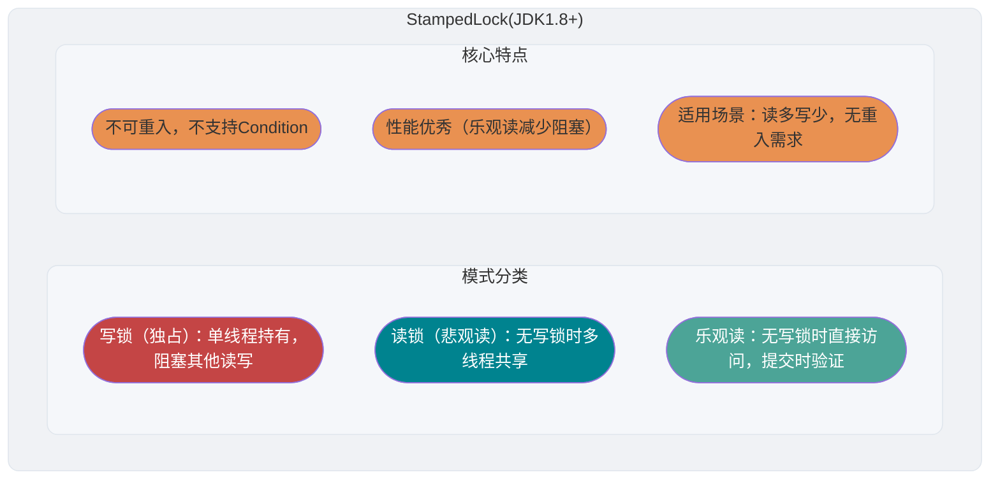

<!-- @include: @article-header.snippet.md -->

## ⭐️JMM (Java Memory Model)

Các vấn đề liên quan đến JMM (Java Memory Model) khá nhiều và quan trọng, nên tôi đã tách riêng thành một bài viết để tổng hợp các kiến thức và câu hỏi liên quan đến JMM: [Giải thích chi tiết JMM (Java Memory Model)](https://javaguide.cn/java/concurrent/jmm.html).

## ⭐️Từ khóa volatile

### Làm thế nào để đảm bảo tính visible của biến?

Trong Java, từ khóa `volatile` có thể đảm bảo tính visible (khả năng hiển thị) của biến. Nếu chúng ta khai báo biến là **`volatile`**, điều này báo hiệu cho JVM rằng biến này là dùng chung và không ổn định, mỗi lần sử dụng nó phải đọc từ main memory.


Từ khóa `volatile` thực ra không phải là đặc trưng riêng của ngôn ngữ Java; trong ngôn ngữ C cũng có nó, ý nghĩa ban đầu nhất của nó là vô hiệu hóa CPU cache. Nếu chúng ta dùng `volatile` để modify một biến, điều này báo hiệu cho compiler rằng biến này là dùng chung và không ổn định, mỗi lần sử dụng nó phải đọc từ main memory.

Từ khóa `volatile` có thể đảm bảo tính visible của dữ liệu, nhưng không thể đảm bảo tính atomicity của dữ liệu. Từ khóa `synchronized` đảm bảo được cả hai.

### Làm thế nào để cấm instruction reordering?

**Trong Java, ngoài việc đảm bảo tính visible của biến, từ khóa `volatile` còn có một vai trò quan trọng là ngăn JVM reorder instruction.** Nếu chúng ta khai báo biến là **`volatile`**, khi thực hiện các thao tác đọc/ghi trên biến này, sẽ ngăn instruction reordering bằng cách chèn các **memory barrier** cụ thể.

Trong Java, class `Unsafe` cung cấp ba phương thức liên quan đến memory barrier sẵn dùng, che giấu sự khác biệt của hệ điều hành bên dưới:

```java
public native void loadFence();
public native void storeFence();
public native void fullFence();
```

Về lý thuyết, bạn cũng có thể dùng ba phương thức này để đạt hiệu quả ngăn reordering tương tự như `volatile`, chỉ là sẽ phức tạp hơn một chút.

#### 4 loại Memory Barrier

JMM (Java Memory Model) định nghĩa 4 loại memory barrier (Memory Barrier) để kiểm soát instruction reordering và memory visibility trong điều kiện cụ thể:

| Loại Barrier   | Ví dụ lệnh                   | Mô tả                                                                                                                                                                                                                                                       |
| -------------- | ---------------------------- | ----------------------------------------------------------------------------------------------------------------------------------------------------------------------------------------------------------------------------------------------------------- |
| **LoadLoad**   | `Load1; LoadLoad; Load2`     | Đảm bảo thao tác đọc của `Load1` hoàn thành trước các thao tác đọc tiếp theo của `Load2`                                                                                                                                                                    |
| **StoreStore** | `Store1; StoreStore; Store2` | Đảm bảo thao tác ghi của `Store1` visible với các processor khác (flush vào memory), trước các thao tác ghi tiếp theo của `Store2`                                                                                                                          |
| **LoadStore**  | `Load1; LoadStore; Store2`   | Đảm bảo thao tác đọc của `Load1` hoàn thành trước khi các thao tác ghi tiếp theo của `Store2` được flush vào memory                                                                                                                                         |
| **StoreLoad**  | `Store1; StoreLoad; Load2`   | Đảm bảo thao tác ghi của `Store1` visible với các processor khác, trước các thao tác đọc tiếp theo của `Load2`. `StoreLoad` barrier có chi phí lớn nhất trong 4 loại, nó đồng thời có hiệu quả của 3 loại barrier kia, nên còn được gọi là **Full Barrier** |

#### Chiến lược chèn memory barrier cho thao tác đọc/ghi volatile

JMM đặt ra chiến lược chèn memory barrier cho thao tác đọc/ghi `volatile` đối với compiler, nhằm đảm bảo có được ngữ nghĩa bộ nhớ volatile chính xác trên mọi nền tảng processor:

**Chiến lược chèn memory barrier cho thao tác ghi volatile:**

Chèn một `StoreStore` barrier **trước** mỗi thao tác ghi volatile, và chèn một `StoreLoad` barrier **sau**.

```
StoreStore 屏障
volatile 写操作
StoreLoad 屏障
```

- `StoreStore` barrier ở phía trước: Đảm bảo tất cả các thao tác ghi thông thường trước khi ghi volatile đã visible với mọi processor (flush vào main memory).
- `StoreLoad` barrier ở phía sau: Đảm bảo giá trị được ghi sau khi ghi volatile visible với các thao tác đọc/ghi volatile tiếp theo. Đây là barrier có chi phí lớn nhất, nhưng cũng quan trọng nhất — nó ngăn thao tác ghi volatile bị reorder với các thao tác đọc/ghi volatile có thể có phía sau.

**Chiến lược chèn memory barrier cho thao tác đọc volatile:**

Chèn một `LoadLoad` barrier và một `LoadStore` barrier **sau** mỗi thao tác đọc volatile.

```
volatile 读操作
LoadLoad 屏障
LoadStore 屏障
```

- `LoadLoad` barrier: Đảm bảo các thao tác đọc thông thường sau khi đọc volatile không bị reorder trước thao tác đọc volatile.
- `LoadStore` barrier: Đảm bảo các thao tác ghi thông thường sau khi đọc volatile không bị reorder trước thao tác đọc volatile.

Như vậy, tổ hợp ghi-đọc volatile thiết lập ngữ nghĩa tương tự như **lock release-acquire**: **Tất cả kết quả thao tác trước thao tác ghi volatile đều visible với tất cả các thao tác sau thao tác đọc volatile tiếp theo trên biến volatile đó.**

Dưới đây, tôi sẽ dùng một câu hỏi phỏng vấn phổ biến để giải thích hiệu quả ngăn instruction reordering của từ khóa `volatile`.

Trong phỏng vấn, interviewer thường hỏi: "Bạn có biết singleton pattern không? Hãy viết tay một cái! Và giải thích nguyên lý của singleton pattern sử dụng Double-Checked Locking!"

**Double-Checked Locking để triển khai singleton (thread-safe)**:

```java
public class Singleton {

    private volatile static Singleton uniqueInstance;

    private Singleton() {
    }

    public static Singleton getUniqueInstance() {
       //先判断对象是否已经实例过，没有实例化过才进入加锁代码
        if (uniqueInstance == null) {
            //类对象加锁
            synchronized (Singleton.class) {
                if (uniqueInstance == null) {
                    uniqueInstance = new Singleton();
                }
            }
        }
        return uniqueInstance;
    }
}
```

Việc `uniqueInstance` dùng từ khóa `volatile` cũng rất cần thiết, đoạn code `uniqueInstance = new Singleton();` thực ra được thực thi theo ba bước:

1. Cấp phát không gian bộ nhớ cho `uniqueInstance`
2. Khởi tạo `uniqueInstance`
3. Trỏ `uniqueInstance` đến địa chỉ bộ nhớ đã cấp phát

Nhưng do JVM có đặc tính instruction reordering, thứ tự thực thi có thể thay đổi thành 1->3->2. Instruction reordering không gây vấn đề trong môi trường single-thread, nhưng trong môi trường multi-thread sẽ dẫn đến một thread lấy được instance chưa được khởi tạo. Ví dụ, thread T1 đã thực thi bước 1 và 3, lúc này T2 gọi `getUniqueInstance()` thấy `uniqueInstance` không null nên trả về `uniqueInstance`, nhưng lúc này `uniqueInstance` vẫn chưa được khởi tạo.

#### Hiểu DCL phải dùng volatile từ góc độ memory barrier

Trên đây đã giải thích từ góc độ instruction reordering tại sao `uniqueInstance` trong DCL singleton cần dùng `volatile`. Dưới đây sẽ phân tích thêm từ góc độ memory barrier về cách `volatile` giải quyết vấn đề này.

Ba bước của dòng code `uniqueInstance = new Singleton();` (cấp phát bộ nhớ, khởi tạo đối tượng, gán tham chiếu), nếu không thêm `volatile`, bước 2 và bước 3 có thể bị reorder thành 1→3→2. Sau khi thêm `volatile`, vì `uniqueInstance` là biến volatile, thao tác ghi lên nó (bước 3: gán tham chiếu cho `uniqueInstance`) sẽ được xử lý theo chiến lược chèn memory barrier cho ghi volatile đã giới thiệu ở trên:

1. Chèn `StoreStore` barrier **trước** khi ghi volatile: Đảm bảo thao tác ghi của bước 1 (cấp phát bộ nhớ) và bước 2 (khởi tạo đối tượng) hoàn thành trước bước 3 (gán tham chiếu), **ngăn reordering giữa bước 2 và bước 3**.
2. Chèn `StoreLoad` barrier **sau** khi ghi volatile: Đảm bảo kết quả ghi của bước 3 ngay lập tức visible với các thread khác.

Như vậy, khi thread T2 đọc `uniqueInstance` (đọc volatile), nếu thấy `uniqueInstance != null`, có thể đảm bảo rằng đối tượng đó đã được khởi tạo hoàn toàn.

### Mối quan hệ giữa volatile và happens-before

Nguyên tắc happens-before trong JMM là cơ sở quan trọng để xác định liệu dữ liệu có tồn tại race condition hay thread có an toàn không. Các thao tác đọc/ghi trên biến `volatile` có mối quan hệ chặt chẽ với nguyên tắc happens-before.

> Để biết thêm về nguyên tắc happens-before, có thể tham khảo bài viết [Giải thích chi tiết JMM (Java Memory Model)](https://javaguide.cn/java/concurrent/jmm.html).

Quy tắc liên quan trực tiếp đến `volatile` trong nguyên tắc happens-before là **quy tắc biến volatile**:

> **Thao tác ghi lên một biến volatile happens-before thao tác đọc tiếp theo trên biến volatile đó.**

Nghĩa là, nếu thread A ghi vào một biến volatile, thread B sau đó đọc cùng biến volatile đó, thì tất cả các sửa đổi mà thread A thực hiện trước khi ghi vào biến volatile (bao gồm cả sửa đổi trên các biến không volatile), đều visible với thread B.

Quy tắc này kết hợp với **quy tắc bắc cầu của happens-before** (nếu A happens-before B, B happens-before C, thì A happens-before C), có thể thực hiện một loại giao tiếp nhẹ giữa các thread. Dưới đây là ví dụ minh họa:

```java
public class VolatileHappensBeforeDemo {
    private int a = 0;
    private int b = 0;
    private volatile boolean flag = false;

    // 线程 A 执行
    public void writer() {
        a = 1;           // 操作1：普通写
        b = 2;           // 操作2：普通写
        flag = true;     // 操作3：volatile 写
    }

    // 线程 B 执行
    public void reader() {
        if (flag) {      // 操作4：volatile 读
            int x = a;   // 操作5：普通读，x 一定等于 1
            int y = b;   // 操作6：普通读，y 一定等于 2
            System.out.println("x=" + x + ", y=" + y);
        }
    }
}
```

Trong code trên, chuỗi quan hệ happens-before như sau:

1. Thao tác 1, thao tác 2 happens-before thao tác 3 (**quy tắc thứ tự chương trình**: trong cùng một thread, thao tác trước happens-before thao tác sau)
2. Thao tác 3 happens-before thao tác 4 (**quy tắc biến volatile**: ghi volatile happens-before đọc volatile)
3. Thao tác 4 happens-before thao tác 5, thao tác 6 (**quy tắc thứ tự chương trình**)

Theo **tính bắc cầu**: thao tác 1, thao tác 2 happens-before thao tác 5, thao tác 6.

Vì vậy, khi thread B đọc `flag == true` ở thao tác 4, các sửa đổi mà thread A thực hiện trên `a` và `b` trước thao tác 3 chắc chắn visible với thread B. Điểm mấu chốt ở đây là: **Thao tác ghi-đọc biến volatile không chỉ đảm bảo tính visible của bản thân biến volatile, mà còn "kéo theo" đảm bảo tính visible của các biến thông thường xung quanh thông qua tính bắc cầu của happens-before.**

Điều này cũng giải thích tại sao trong phát triển thực tế, `volatile` thường được dùng làm **cờ trạng thái** (như `flag` trong ví dụ trên), nó có thể truyền thông tin trạng thái giữa các thread một cách an toàn mà không cần dùng lock, đồng thời đảm bảo tính visible của dữ liệu liên quan.

### volatile có thể đảm bảo tính atomicity không?

**Từ khóa `volatile` có thể đảm bảo tính visible của biến, nhưng không thể đảm bảo các thao tác trên biến là atomic.**

Chúng ta có thể chứng minh điều này qua code dưới đây:

```java
/**
 * 微信搜 JavaGuide 回复"面试突击"即可免费领取个人原创的 Java 面试手册
 *
 * @author Guide哥
 * @date 2022/08/03 13:40
 **/
public class VolatileAtomicityDemo {
    public volatile static int inc = 0;

    public void increase() {
        inc++;
    }

    public static void main(String[] args) throws InterruptedException {
        ExecutorService threadPool = Executors.newFixedThreadPool(5);
        VolatileAtomicityDemo volatileAtomicityDemo = new VolatileAtomicityDemo();
        for (int i = 0; i < 5; i++) {
            threadPool.execute(() -> {
                for (int j = 0; j < 500; j++) {
                    volatileAtomicityDemo.increase();
                }
            });
        }
        // 等待1.5秒，保证上面程序执行完成
        Thread.sleep(1500);
        System.out.println(inc);
        threadPool.shutdown();
    }
}
```

Trong điều kiện bình thường, chạy code trên lẽ ra phải in ra `2500`. Nhưng khi chạy thực sự, bạn sẽ thấy mỗi lần kết quả đầu ra đều nhỏ hơn `2500`.

Tại sao lại xảy ra tình trạng này? Chẳng phải `volatile` đã đảm bảo tính visible của biến rồi sao?

Tức là, nếu `volatile` có thể đảm bảo tính atomicity của thao tác `inc++`, sau khi mỗi thread tăng biến `inc`, các thread khác có thể ngay lập tức thấy giá trị đã sửa đổi. 5 thread mỗi thread thực hiện 500 thao tác, thì giá trị cuối cùng của inc phải là 5\*500=2500.

Nhiều người nhầm tưởng thao tác tăng `inc++` là atomic, thực ra `inc++` là một thao tác phức hợp gồm ba bước:

1. Đọc giá trị của inc.
2. Cộng 1 vào inc.
3. Ghi giá trị inc lại vào bộ nhớ.

`volatile` không thể đảm bảo ba thao tác này có tính atomicity, có thể dẫn đến tình huống sau:

1. Thread 1 đọc giá trị `inc` nhưng chưa modify. Thread 2 đọc giá trị `inc` và thực hiện modify (+1), sau đó ghi giá trị `inc` lại vào bộ nhớ.
2. Sau khi thread 2 hoàn thành, thread 1 thực hiện modify (+1) trên giá trị `inc`, sau đó ghi lại vào bộ nhớ.

Điều này dẫn đến tình huống hai thread mỗi thread tăng `inc` một lần, nhưng `inc` thực tế chỉ tăng 1.

Thực ra, nếu muốn đảm bảo code trên chạy đúng rất đơn giản, dùng `synchronized`, `Lock` hoặc `AtomicInteger` đều được.

Dùng `synchronized` cải thiện:

```java
public synchronized void increase() {
    inc++;
}
```

Dùng `AtomicInteger` cải thiện:

```java
public AtomicInteger inc = new AtomicInteger();

public void increase() {
    inc.getAndIncrement();
}
```

Dùng `ReentrantLock` cải thiện:

```java
Lock lock = new ReentrantLock();
public void increase() {
    lock.lock();
    try {
        inc++;
    } finally {
        lock.unlock();
    }
}
```

## ⭐️Optimistic Lock và Pessimistic Lock

### Pessimistic Lock là gì?

Pessimistic lock luôn giả định trường hợp xấu nhất, cho rằng mỗi khi tài nguyên chia sẻ được truy cập sẽ xảy ra vấn đề (như dữ liệu chia sẻ bị sửa đổi), nên mỗi lần thực hiện thao tác lấy tài nguyên đều sẽ lock, khiến các thread khác muốn lấy tài nguyên này phải block cho đến khi lock được người nắm giữ trước đó giải phóng. Tức là, **mỗi lần chỉ cho một thread sử dụng tài nguyên chia sẻ, các thread khác block, sau khi dùng xong mới chuyển tài nguyên cho thread khác**.

Các exclusive lock như `synchronized` và `ReentrantLock` trong Java là triển khai của tư tưởng pessimistic lock.

```java
public void performSynchronisedTask() {
    synchronized (this) {
        // 需要同步的操作
    }
}

private Lock lock = new ReentrantLock();
lock.lock();
try {
   // 需要同步的操作
} finally {
    lock.unlock();
}
```

Trong tình huống concurrency cao, cạnh tranh lock gay gắt sẽ gây ra thread blocking, số lượng lớn thread bị block sẽ dẫn đến context switching trong hệ thống, tăng chi phí hiệu suất. Ngoài ra, pessimistic lock còn có thể xảy ra vấn đề deadlock, ảnh hưởng đến hoạt động bình thường của code.

### Optimistic Lock là gì?

Optimistic lock luôn giả định trường hợp tốt nhất, cho rằng mỗi khi tài nguyên chia sẻ được truy cập sẽ không xảy ra vấn đề, thread có thể liên tục thực thi mà không cần lock và không cần chờ, chỉ khi submit sửa đổi mới xác minh tài nguyên tương ứng (tức là dữ liệu) có bị thread khác sửa đổi không (phương pháp cụ thể có thể dùng version number hoặc CAS algorithm).

Trong Java, các class atomic variable trong package `java.util.concurrent.atomic` (như `AtomicInteger`, `LongAdder`) sử dụng một cách triển khai optimistic lock là **CAS**.


```java
// LongAdder 在高并发场景下会比 AtomicInteger 和 AtomicLong 的性能更好
// 代价就是会消耗更多的内存空间（空间换时间）
LongAdder sum = new LongAdder();
sum.increment();
```

Trong tình huống concurrency cao, so với pessimistic lock, optimistic lock không có cạnh tranh lock gây ra thread blocking, cũng không có vấn đề deadlock, về hiệu suất thường vượt trội hơn. Nhưng nếu xung đột xảy ra thường xuyên (trường hợp ghi chiếm tỷ lệ rất lớn), sẽ thất bại và retry thường xuyên, điều này cũng ảnh hưởng nghiêm trọng đến hiệu suất, khiến CPU tăng vọt.

Tuy nhiên, vấn đề thất bại retry nhiều cũng có thể giải quyết được, như `LongAdder` đã đề cập ở trên dùng cách đánh đổi space để lấy time đã giải quyết vấn đề này.

Về lý thuyết:

- Pessimistic lock thường dùng nhiều hơn trong trường hợp ghi nhiều (nhiều write, cạnh tranh cao), như vậy có thể tránh thất bại và retry thường xuyên ảnh hưởng đến hiệu suất, chi phí của pessimistic lock là cố định. Tuy nhiên, nếu optimistic lock giải quyết được vấn đề thất bại retry thường xuyên (như `LongAdder`), cũng có thể xem xét dùng optimistic lock, tùy tình huống thực tế.
- Optimistic lock thường dùng nhiều hơn trong trường hợp ít ghi (nhiều read, ít cạnh tranh), như vậy có thể tránh thêm lock thường xuyên ảnh hưởng đến hiệu suất. Tuy nhiên, optimistic lock chủ yếu hướng đến đối tượng là một biến chia sẻ duy nhất (tham khảo các class atomic variable trong package `java.util.concurrent.atomic`).

### Làm thế nào để triển khai Optimistic Lock?

Optimistic lock thường dùng version number hoặc CAS algorithm để triển khai, CAS algorithm tương đối nhiều hơn, cần đặc biệt chú ý.

#### Version Number Mechanism

Thường thêm một trường số phiên bản dữ liệu `version` vào bảng dữ liệu, đại diện cho số lần dữ liệu bị sửa đổi. Khi dữ liệu bị sửa đổi, giá trị `version` tăng 1. Khi thread A muốn cập nhật giá trị dữ liệu, đồng thời đọc dữ liệu cũng sẽ đọc giá trị `version`, khi submit update, chỉ update nếu giá trị version vừa đọc bằng với giá trị `version` hiện tại trong database, ngược lại retry thao tác update cho đến khi thành công.

**Ví dụ đơn giản**: Giả sử trong bảng thông tin tài khoản có trường version với giá trị hiện tại là 1; trường số dư tài khoản (`balance`) là \$100.

1. Nhân viên A đọc (version=1) và khấu trừ $50 từ số dư ($100-\$50).
2. Trong quá trình nhân viên A thao tác, nhân viên B cũng đọc thông tin người dùng này (version=1) và khấu trừ $20 ($100-\$20).
3. Nhân viên A hoàn thành sửa đổi, submit số phiên bản dữ liệu (version=1) cùng số dư sau khi khấu trừ (balance=\$50) lên database để update, vì version submit bằng version hiện tại trong database, dữ liệu được update, database ghi lại version mới là 2.
4. Nhân viên B hoàn thành thao tác, cũng thử submit số phiên bản (version=1) lên database (balance=\$80), nhưng lúc này so sánh version trong database thấy version nhân viên B submit là 1 nhưng version hiện tại trong database là 2, không thỏa điều kiện "version submit phải bằng version hiện tại mới được update" của chiến lược optimistic lock, nên submission của nhân viên B bị từ chối.

Như vậy tránh được khả năng nhân viên B dùng kết quả sửa đổi dựa trên dữ liệu cũ version=1 ghi đè kết quả thao tác của nhân viên A.

#### CAS Algorithm

CAS viết tắt là **Compare And Swap (So sánh và Trao đổi)**, được dùng để triển khai optimistic lock, được ứng dụng rộng rãi trong nhiều framework. Ý tưởng của CAS rất đơn giản: dùng một giá trị kỳ vọng để so sánh với giá trị biến cần update, chỉ update khi hai giá trị bằng nhau.

CAS là atomic operation, phụ thuộc vào một atomic instruction của CPU.

> **Atomic operation** là thao tác nhỏ nhất không thể chia nhỏ, tức là thao tác đã bắt đầu thì không thể bị gián đoạn cho đến khi hoàn thành.

CAS liên quan đến ba toán hạng:

- **V**: Giá trị biến cần update (Var)
- **E**: Giá trị kỳ vọng (Expected)
- **N**: Giá trị mới muốn ghi (New)

Chỉ khi giá trị của V bằng E, CAS mới dùng giá trị mới N để update giá trị V theo cách atomic. Nếu không bằng, tức là đã có thread khác update V, thread hiện tại từ bỏ update.

**Ví dụ đơn giản**: Thread A muốn sửa giá trị biến i thành 6, i ban đầu là 1 (V = 1, E=1, N=6, giả sử không có vấn đề ABA).

1. So sánh i với 1, nếu bằng, tức là chưa bị thread khác sửa đổi, có thể đặt thành 6.
2. So sánh i với 1, nếu không bằng, tức là đã bị thread khác sửa đổi, thread hiện tại từ bỏ update, thao tác CAS thất bại.

Khi nhiều thread đồng thời dùng CAS trên một biến, chỉ có một thread thắng và update thành công, các thread còn lại thất bại, nhưng thread thất bại không bị treo mà chỉ được thông báo thất bại và được phép retry, tất nhiên cũng cho phép thread thất bại từ bỏ thao tác.

Ngôn ngữ Java không triển khai CAS trực tiếp, các triển khai liên quan CAS được thực hiện dưới dạng C++ inline assembly (gọi JNI). Do đó, triển khai cụ thể của CAS liên quan đến cả hệ điều hành và CPU.

Class `Unsafe` trong package `sun.misc` cung cấp các phương thức `compareAndSwapObject`, `compareAndSwapInt`, `compareAndSwapLong` để triển khai thao tác CAS trên các kiểu `Object`, `int`, `long`.

```java
/**
  *  CAS
  * @param o         包含要修改field的对象
  * @param offset    对象中某field的偏移量
  * @param expected  期望值
  * @param update    更新值
  * @return          true | false
  */
public final native boolean compareAndSwapObject(Object o, long offset,  Object expected, Object update);

public final native boolean compareAndSwapInt(Object o, long offset, int expected,int update);

public final native boolean compareAndSwapLong(Object o, long offset, long expected, long update);
```

Để biết thêm về class `Unsafe`, có thể xem bài viết: [Giải thích chi tiết lớp ma thuật Unsafe trong Java - JavaGuide - 2022](https://javaguide.cn/java/basis/unsafe.html).

### CAS được triển khai như thế nào trong Java?

Trong Java, class quan trọng để triển khai thao tác CAS (Compare-And-Swap) là `Unsafe`.

Class `Unsafe` nằm trong package `sun.misc`, là một class cung cấp các thao tác cấp thấp và không an toàn. Do tính năng mạnh mẽ và nguy hiểm tiềm ẩn của nó, nó thường được dùng bên trong JVM hoặc một số thư viện cần hiệu suất cực cao và truy cập cấp thấp, không khuyến nghị developer thông thường dùng trong ứng dụng. Để biết thêm về class `Unsafe`, hãy đọc bài viết: [Giải thích chi tiết lớp ma thuật Unsafe trong Java](https://javaguide.cn/java/basis/unsafe.html).

Class `Unsafe` trong package `sun.misc` cung cấp các phương thức `compareAndSwapObject`, `compareAndSwapInt`, `compareAndSwapLong` để triển khai thao tác CAS trên các kiểu `Object`, `int`, `long`:

```java
/**
 * 以原子方式更新对象字段的值。
 *
 * @param o        要操作的对象
 * @param offset   对象字段的内存偏移量
 * @param expected 期望的旧值
 * @param x        要设置的新值
 * @return 如果值被成功更新，则返回 true；否则返回 false
 */
boolean compareAndSwapObject(Object o, long offset, Object expected, Object x);

/**
 * 以原子方式更新 int 类型的对象字段的值。
 */
boolean compareAndSwapInt(Object o, long offset, int expected, int x);

/**
 * 以原子方式更新 long 类型的对象字段的值。
 */
boolean compareAndSwapLong(Object o, long offset, long expected, long x);
```

Các phương thức CAS trong class `Unsafe` là phương thức `native`. Từ khóa `native` cho biết các phương thức này được triển khai bằng native code (thường là C hoặc C++), không phải bằng Java. Các phương thức này gọi trực tiếp hardware instruction cấp thấp để thực hiện atomic operation. Tức là, ngôn ngữ Java không triển khai CAS trực tiếp bằng Java, mà thông qua C++ inline assembly (gọi qua JNI). Do đó, triển khai cụ thể của CAS liên quan chặt chẽ đến hệ điều hành và CPU.

Package `java.util.concurrent.atomic` cung cấp một số class để thực hiện atomic operation. Các class này tận dụng atomic instruction cấp thấp để đảm bảo các thao tác trong môi trường multi-thread là thread-safe.


Để biết thêm về các Atomic class này, có thể đọc bài viết: [Tổng kết các lớp Atomic](https://javaguide.cn/java/concurrent/atomic-classes.html).

`AtomicInteger` là một trong các atomic class của Java, chủ yếu dùng để thực hiện atomic operation trên biến kiểu `int`, nó dùng các phương thức atomic operation cấp thấp do class `Unsafe` cung cấp để thực hiện thread safety không cần lock.

Dưới đây, chúng ta sẽ đọc source code cốt lõi của `AtomicInteger` (JDK1.8) để giải thích Java sử dụng các phương thức của class `Unsafe` như thế nào để thực hiện atomic operation.

Source code cốt lõi của `AtomicInteger`:

```java
// 获取 Unsafe 实例
private static final Unsafe unsafe = Unsafe.getUnsafe();
private static final long valueOffset;

static {
    try {
        // 获取"value"字段在AtomicInteger类中的内存偏移量
        valueOffset = unsafe.objectFieldOffset
            (AtomicInteger.class.getDeclaredField("value"));
    } catch (Exception ex) { throw new Error(ex); }
}
// 确保"value"字段的可见性
private volatile int value;

// 如果当前值等于预期值，则原子地将值设置为newValue
// 使用 Unsafe#compareAndSwapInt 方法进行CAS操作
public final boolean compareAndSet(int expect, int update) {
    return unsafe.compareAndSwapInt(this, valueOffset, expect, update);
}

// 原子地将当前值加 delta 并返回旧值
public final int getAndAdd(int delta) {
    return unsafe.getAndAddInt(this, valueOffset, delta);
}

// 原子地将当前值加 1 并返回加之前的值（旧值）
// 使用 Unsafe#getAndAddInt 方法进行CAS操作。
public final int getAndIncrement() {
    return unsafe.getAndAddInt(this, valueOffset, 1);
}

// 原子地将当前值减 1 并返回减之前的值（旧值）
public final int getAndDecrement() {
    return unsafe.getAndAddInt(this, valueOffset, -1);
}
```

Source code của `Unsafe#getAndAddInt`:

```java
// 原子地获取并增加整数值
public final int getAndAddInt(Object o, long offset, int delta) {
    int v;
    do {
        // 以 volatile 方式获取对象 o 在内存偏移量 offset 处的整数值
        v = getIntVolatile(o, offset);
    } while (!compareAndSwapInt(o, offset, v, v + delta));
    // 返回旧值
    return v;
}
```

Có thể thấy, `getAndAddInt` dùng vòng lặp `do-while`: khi thao tác `compareAndSwapInt` thất bại, sẽ liên tục retry cho đến khi thành công. Tức là, phương thức `getAndAddInt` sẽ thử update giá trị `value` thông qua phương thức `compareAndSwapInt`, nếu update thất bại (giá trị hiện tại đã bị thread khác modify trong thời gian này), nó sẽ lấy lại giá trị hiện tại và retry, cho đến khi thao tác thành công.

Vì thao tác CAS có thể thất bại do xung đột concurrent, nên thường kết hợp với vòng lặp `while` để retry sau khi thất bại cho đến khi thành công. Đây chính là **cơ chế spin lock**.

### CAS Algorithm tồn tại những vấn đề gì?

Vấn đề ABA là vấn đề phổ biến nhất của CAS algorithm.

#### Vấn đề ABA

Nếu lần đầu đọc biến V là giá trị A, và khi chuẩn bị gán giá trị vẫn thấy nó là A, thì chúng ta có thể kết luận giá trị của nó không bị thread khác sửa đổi không? Rõ ràng là không, vì trong khoảng thời gian đó giá trị của nó có thể đã bị sửa thành giá trị khác rồi sửa lại thành A, như vậy thao tác CAS sẽ nhầm tưởng rằng nó chưa bao giờ bị sửa đổi. Vấn đề này được gọi là vấn đề **"ABA"** của thao tác CAS.

Giải pháp cho vấn đề ABA là thêm **version number hoặc timestamp** trước biến. Class `AtomicStampedReference` sau JDK 1.5 được dùng để giải quyết vấn đề ABA, trong đó phương thức `compareAndSet()` trước tiên kiểm tra xem tham chiếu hiện tại có bằng tham chiếu kỳ vọng không, và stamp hiện tại có bằng stamp kỳ vọng không; nếu tất cả bằng nhau, mới set giá trị tham chiếu và stamp bằng giá trị update cho trước theo cách atomic.

```java
public boolean compareAndSet(V   expectedReference,
                             V   newReference,
                             int expectedStamp,
                             int newStamp) {
    Pair<V> current = pair;
    return
        expectedReference == current.reference &&
        expectedStamp == current.stamp &&
        ((newReference == current.reference &&
          newStamp == current.stamp) ||
         casPair(current, Pair.of(newReference, newStamp)));
}
```

#### Thời gian vòng lặp dài, chi phí lớn

CAS thường dùng spin operation để retry, tức là không thành công thì tiếp tục lặp đến khi thành công. Nếu lâu không thành công, sẽ gây ra chi phí thực thi rất lớn cho CPU.

Nếu JVM có thể hỗ trợ instruction `pause` mà processor cung cấp, hiệu quả của spin operation sẽ được cải thiện. Instruction `pause` có hai tác dụng quan trọng:

1. **Trì hoãn thực thi pipeline instruction**: Instruction `pause` có thể trì hoãn thực thi instruction, từ đó giảm tiêu thụ tài nguyên CPU. Thời gian trì hoãn cụ thể phụ thuộc vào phiên bản triển khai của processor, trên một số processor thời gian trì hoãn có thể bằng 0.
2. **Tránh xung đột thứ tự bộ nhớ**: Khi thoát khỏi vòng lặp, instruction `pause` có thể tránh CPU pipeline bị clear do xung đột thứ tự bộ nhớ, từ đó cải thiện hiệu quả thực thi CPU.

#### Chỉ có thể đảm bảo atomic operation trên một biến chia sẻ

Thao tác CAS chỉ hiệu quả với một biến chia sẻ. Khi cần thao tác trên nhiều biến chia sẻ, CAS trở nên bất lực. Tuy nhiên, từ JDK 1.5, Java cung cấp class `AtomicReference`, cho phép đảm bảo tính atomicity giữa các đối tượng tham chiếu. Bằng cách đóng gói nhiều biến trong một đối tượng, chúng ta có thể dùng `AtomicReference` để thực thi thao tác CAS.

Ngoài cách dùng `AtomicReference`, cũng có thể dùng lock để đảm bảo.

### Tổng kết

| **Chiều so sánh**        | **Optimistic Lock**                                                            | **Pessimistic Lock**                                                               |
| ------------------------ | ------------------------------------------------------------------------------ | ---------------------------------------------------------------------------------- |
| **Giả định cốt lõi**     | Giả định xung đột hiếm khi xảy ra, xác minh khi submit.                        | Giả định xung đột sẽ xảy ra, lock khi đọc.                                         |
| **Nguyên lý cơ bản**     | **CAS (Compare And Swap)** hoặc version number mechanism.                      | **Mutex lock của OS**, liên quan đến chuyển đổi kernel mode.                       |
| **Tình huống block**     | **Không block**. Sau khi thất bại do business logic quyết định có retry không. | **Block**. Các thread khác phải xếp hàng chờ lock giải phóng.                      |
| **Chi phí concurrent**   | **Tiêu thụ CPU** (khi ghi concurrency cao, spin retry thường xuyên).           | **Chi phí context switching** (treo và đánh thức thread).                          |
| **Rủi ro deadlock**      | **Không deadlock** (vì không liên quan đến chờ giữ lock).                      | **Có rủi ro deadlock** (nhiều lock chờ nhau).                                      |
| **Triển khai database**  | `UPDATE ... SET version = version + 1`                                         | `SELECT ... FOR UPDATE`                                                            |
| **Class đại diện Java**  | `AtomicInteger`, `LongAdder`, `StampedLock`                                    | `synchronized`, `ReentrantLock`                                                    |
| **Tình huống thích hợp** | **Nhiều read ít write**, xác suất xung đột concurrent thấp.                    | **Nhiều write ít read**, nghiệp vụ cốt lõi yêu cầu tính nhất quán dữ liệu cực cao. |

## Từ khóa synchronized

### synchronized là gì? Dùng để làm gì?

`synchronized` là một từ khóa trong Java, dịch sang tiếng Việt có nghĩa là đồng bộ, chủ yếu giải quyết vấn đề đồng bộ truy cập tài nguyên giữa nhiều thread, có thể đảm bảo phương thức hoặc code block được nó modify chỉ có thể có một thread thực thi tại bất kỳ thời điểm nào.

Trong phiên bản đầu của Java, `synchronized` thuộc loại **heavy lock**, hiệu quả thấp. Điều này là vì monitor lock phụ thuộc vào `Mutex Lock` của hệ điều hành bên dưới để triển khai, thread Java được ánh xạ đến native thread của hệ điều hành. Để treo hoặc đánh thức một thread, cần hệ điều hành giúp hoàn thành, và việc hệ điều hành thực hiện chuyển đổi giữa các thread cần chuyển từ user mode sang kernel mode, quá trình chuyển đổi trạng thái này cần tương đối nhiều thời gian, chi phí thời gian tương đối cao.

Tuy nhiên, từ Java 6 trở đi, `synchronized` đã giới thiệu nhiều tối ưu như spin lock, adaptive spin lock, lock elimination, lock coarsening, biased lock, lightweight lock để giảm chi phí thao tác lock, những tối ưu này đã cải thiện đáng kể hiệu quả của `synchronized`. Do đó, `synchronized` vẫn có thể được sử dụng trong các dự án thực tế, source code JDK và nhiều open source framework đều sử dụng nhiều `synchronized`.

Bổ sung thêm về biased lock: Vì biased lock làm tăng độ phức tạp của JVM, đồng thời cũng không mang lại cải thiện hiệu suất cho tất cả ứng dụng. Do đó, trong JDK15, biased lock bị tắt mặc định (vẫn có thể bật bằng `-XX:+UseBiasedLocking`), trong JDK18, biased lock đã bị loại bỏ hoàn toàn (không thể bật qua command line).

### Cách sử dụng synchronized?

Từ khóa `synchronized` có ba cách sử dụng chính:

1. Modify instance method
2. Modify static method
3. Modify code block

**1. Modify instance method** (lock đối tượng instance hiện tại)

Lock đối tượng instance hiện tại, phải lấy được **lock của đối tượng instance hiện tại** trước khi vào code đồng bộ.

```java
synchronized void method() {
    //业务代码
}
```

**2. Modify static method** (lock class hiện tại)

Lock class hiện tại, sẽ tác động lên tất cả đối tượng instance của class, phải lấy được **lock của class hiện tại** trước khi vào code đồng bộ.

Điều này là vì static member không thuộc về bất kỳ đối tượng instance nào, thuộc về toàn bộ class, không phụ thuộc vào instance cụ thể của class, được chia sẻ bởi tất cả instance của class.

```java
synchronized static void method() {
    //业务代码
}
```

Các phương thức `synchronized` static và non-static có loại trừ nhau không? Không! Nếu thread A gọi phương thức `synchronized` non-static của một đối tượng instance, trong khi thread B cần gọi phương thức `synchronized` static của class mà đối tượng instance đó thuộc về, điều này được phép và không gây loại trừ nhau, vì truy cập phương thức `synchronized` static chiếm lock của class hiện tại, còn truy cập phương thức `synchronized` non-static chiếm lock của đối tượng instance hiện tại.

**3. Modify code block** (lock đối tượng/class được chỉ định)

Lock đối tượng/class được chỉ định trong ngoặc:

- `synchronized(object)` có nghĩa là phải lấy được **lock của đối tượng cho trước** trước khi vào code block đồng bộ.
- `synchronized(类.class)` có nghĩa là phải lấy được **lock của Class cho trước** trước khi vào code block đồng bộ.

```java
synchronized(this) {
    //业务代码
}
```

**Tổng kết:**

- Thêm từ khóa `synchronized` vào phương thức `static` và code block `synchronized(class)` đều là lock class Class;
- Thêm từ khóa `synchronized` vào instance method là lock đối tượng instance;
- Hạn chế dùng `synchronized(String a)` vì trong JVM, string constant pool có chức năng caching.

### Constructor có thể dùng synchronized không?

Constructor không thể dùng từ khóa synchronized. Tuy nhiên, có thể dùng synchronized code block bên trong constructor.

Ngoài ra, bản thân constructor là thread-safe, nhưng nếu trong constructor có thao tác liên quan đến tài nguyên chia sẻ, cần áp dụng các biện pháp đồng bộ phù hợp để đảm bảo thread safety của toàn bộ quá trình khởi tạo.

### ⭐️Bạn có hiểu nguyên lý bên dưới của synchronized không?

Nguyên lý bên dưới của từ khóa synchronized thuộc cấp độ JVM.

#### Trường hợp synchronized synchronize code block

```java
public class SynchronizedDemo {
    public void method() {
        synchronized (this) {
            System.out.println("synchronized 代码块");
        }
    }
}
```

Dùng lệnh `javap` có sẵn trong JDK để xem thông tin bytecode liên quan của class `SynchronizedDemo`: trước tiên chuyển đến thư mục tương ứng của class và thực thi lệnh `javac SynchronizedDemo.java` để tạo file .class đã compile, sau đó thực thi `javap -c -s -v -l SynchronizedDemo.class`.


Từ trên có thể thấy: **Triển khai synchronized code block dùng các instruction `monitorenter` và `monitorexit`, trong đó instruction `monitorenter` trỏ đến vị trí bắt đầu của code block đồng bộ, instruction `monitorexit` chỉ ra vị trí kết thúc của code block đồng bộ.**

Trong bytecode trên chứa một instruction `monitorenter` và hai instruction `monitorexit`, điều này là để đảm bảo lock được giải phóng đúng trong cả hai trường hợp code trong code block đồng bộ thực thi bình thường và xảy ra ngoại lệ.

Khi thực thi instruction `monitorenter`, thread cố gắng lấy lock, tức là lấy quyền sở hữu **object monitor `monitor`**.

> Trong Java Virtual Machine (HotSpot), Monitor được triển khai dựa trên C++, được triển khai bởi [ObjectMonitor](https://github.com/openjdk-mirror/jdk7u-hotspot/blob/50bdefc3afe944ca74c3093e7448d6b889cd20d1/src/share/vm/runtime/objectMonitor.cpp). Mỗi đối tượng đều có một đối tượng `ObjectMonitor` được nhúng sẵn.
>
> Ngoài ra, các phương thức như `wait/notify` cũng phụ thuộc vào đối tượng `monitor`, đây là lý do tại sao chỉ có thể gọi `wait/notify` trong block hoặc method đồng bộ, ngược lại sẽ throw ngoại lệ `java.lang.IllegalMonitorStateException`.

Khi thực thi `monitorenter`, sẽ cố gắng lấy lock của đối tượng, nếu lock counter bằng 0 thì lock có thể được lấy, sau khi lấy sẽ đặt lock counter thành 1, tức là tăng 1.


Chỉ thread sở hữu lock đối tượng mới có thể thực thi instruction `monitorexit` để giải phóng lock. Sau khi thực thi instruction `monitorexit`, đặt lock counter thành 0, cho biết lock đã được giải phóng, các thread khác có thể cố gắng lấy lock.


Nếu lấy lock đối tượng thất bại, thread hiện tại sẽ phải block và chờ cho đến khi lock được thread khác giải phóng.

#### Trường hợp synchronized modify method

```java
public class SynchronizedDemo2 {
    public synchronized void method() {
        System.out.println("synchronized 方法");
    }
}

```


Phương thức được modify bởi `synchronized` không có instruction `monitorenter` và `monitorexit`, thay vào đó là identifier `ACC_SYNCHRONIZED`, identifier này chỉ ra rằng method là một phương thức đồng bộ. JVM dùng access flag `ACC_SYNCHRONIZED` này để phân biệt xem một method có được khai báo là phương thức đồng bộ không, từ đó thực hiện lệnh gọi đồng bộ tương ứng.

Nếu là instance method, JVM sẽ cố gắng lấy lock của đối tượng instance. Nếu là static method, JVM sẽ cố gắng lấy lock của class hiện tại.

#### Tổng kết

Triển khai synchronized code block dùng các instruction `monitorenter` và `monitorexit`, trong đó instruction `monitorenter` trỏ đến vị trí bắt đầu của code block đồng bộ, instruction `monitorexit` chỉ ra vị trí kết thúc.

Phương thức được modify bởi `synchronized` không có instruction `monitorenter` và `monitorexit`, thay vào đó là identifier `ACC_SYNCHRONIZED`, identifier này chỉ ra rằng method là một phương thức đồng bộ.

**Tuy nhiên, bản chất của cả hai đều là lấy quyền sở hữu object monitor.**

Đọc thêm: [Chuyện về lock và thread trong Java - Đội kỹ thuật Youzan](https://tech.youzan.com/javasuo-yu-xian-cheng-de-na-xie-shi/).

Nâng cao hơn: Các bạn có thể dành thời gian nghiên cứu chi tiết về object monitor `monitor`.

### JDK1.6 trở đi, synchronized bên dưới đã được tối ưu như thế nào? Bạn có hiểu về lock upgrade không?

Từ Java 6 trở đi, `synchronized` đã giới thiệu nhiều tối ưu như spin lock, adaptive spin lock, lock elimination, lock coarsening, biased lock, lightweight lock để giảm chi phí thao tác lock, những tối ưu này đã cải thiện đáng kể hiệu quả của `synchronized` (trong JDK18, biased lock đã bị loại bỏ hoàn toàn, đã đề cập trước đó).

Lock chủ yếu tồn tại ở 4 trạng thái, lần lượt là: trạng thái no lock, trạng thái biased lock, trạng thái lightweight lock, trạng thái heavyweight lock, chúng sẽ dần dần upgrade theo mức độ cạnh tranh. Lưu ý lock có thể upgrade nhưng không thể downgrade, chiến lược này nhằm nâng cao hiệu quả lấy và giải phóng lock.

Quá trình lock upgrade của `synchronized` khá phức tạp và hiếm khi được hỏi trong phỏng vấn, nếu bạn muốn tìm hiểu chi tiết, có thể xem bài viết: [Phân tích nguyên lý và triển khai lock upgrade của synchronized](https://www.cnblogs.com/star95/p/17542850.html).

### Tại sao biased lock của synchronized bị loại bỏ?

Thông báo chính thức của Open JDK: [JEP 374: Deprecate and Disable Biased Locking](https://openjdk.org/jeps/374)

Trong JDK15, biased lock bị tắt mặc định (vẫn có thể bật bằng `-XX:+UseBiasedLocking`), trong JDK18, biased lock đã bị loại bỏ hoàn toàn (không thể bật qua command line).

Trong thông báo chính thức, có hai lý do chính:

- **Lợi ích hiệu suất không rõ ràng:**

Biased lock là một kỹ thuật tối ưu của HotSpot VM, có thể cải thiện hiệu suất truy cập single-thread vào code block đồng bộ.

Các ứng dụng được hưởng lợi từ biased lock thường sử dụng các Java Collection API cũ, chẳng hạn như HashTable, Vector, trong đó đồng bộ được kiểm soát bằng synchronized, như vậy khi single-thread truy cập thường xuyên, biased lock sẽ giảm chi phí đồng bộ.

Với sự phát triển của JDK, xuất hiện các class collection hiệu suất cao như ConcurrentHashMap, bên trong class collection đã thực hiện nhiều tối ưu hiệu suất, lúc này lợi ích hiệu suất của biased lock không còn rõ ràng nữa.

Biased lock chỉ có thể nhận được lợi ích hiệu suất trong tình huống single-thread truy cập code block đồng bộ.

Nếu có cạnh tranh multi-thread, cần **revoke biased lock**, chi phí của thao tác này khá đắt. Việc revoke biased lock cần chờ đến global safe point (trạng thái tất cả thread đều tạm dừng), lúc đó kiểm tra trạng thái thread và thực hiện revoke biased lock.

- **Chi phí bảo trì code nội bộ JVM quá cao:**

Biased lock đưa nhiều code phức tạp vào hệ thống đồng bộ, và cũng có tính invasive với các component HotSpot khác. Sự phức tạp này gây khó khăn cho việc hiểu code và tái cấu trúc hệ thống, do đó OpenJDK chính thức muốn disable, deprecate và xóa biased lock.

### ⭐️synchronized và volatile có gì khác nhau?

Từ khóa `synchronized` và từ khóa `volatile` là hai thứ bổ trợ cho nhau, không phải đối lập!

- Từ khóa `volatile` là triển khai nhẹ của thread synchronization, nên hiệu suất của `volatile` chắc chắn tốt hơn từ khóa `synchronized`. Nhưng từ khóa `volatile` chỉ có thể dùng cho biến, còn từ khóa `synchronized` có thể modify method và code block.
- Từ khóa `volatile` có thể đảm bảo tính visible của dữ liệu, nhưng không thể đảm bảo tính atomicity. Từ khóa `synchronized` đảm bảo được cả hai.
- Từ khóa `volatile` chủ yếu dùng để giải quyết tính visible của biến giữa nhiều thread, còn từ khóa `synchronized` giải quyết tính đồng bộ truy cập tài nguyên giữa nhiều thread.

#### So sánh hiệu suất giữa volatile và synchronized

Đề cập ở trên rằng `volatile` là triển khai nhẹ của thread synchronization, hiệu suất tốt hơn `synchronized`. Dưới đây phân tích từ góc độ nguyên lý cơ bản tại sao `volatile` có hiệu suất tốt hơn, và khi nào nên chọn cái nào.

Zhou Zhiming trong "Sâu hiểu Java Virtual Machine" chỉ ra:

> Chi phí thực hiện thao tác đọc biến volatile gần như không có sự khác biệt so với biến thông thường, nhưng thao tác ghi có thể chậm hơn một chút, vì cần chèn nhiều instruction memory barrier vào local code để đảm bảo processor không thực thi theo thứ tự bị xáo trộn. Tuy nhiên, ngay cả như vậy, tổng chi phí của volatile trong hầu hết các tình huống vẫn thấp hơn lock.

Nguyên nhân gốc rễ của sự khác biệt hiệu suất giữa hai cái nằm ở cơ chế triển khai bên dưới khác nhau:

| Chiều so sánh                | `volatile`                                                                                                     | `synchronized`                                                                                                 |
| ---------------------------- | -------------------------------------------------------------------------------------------------------------- | -------------------------------------------------------------------------------------------------------------- |
| **Cấp độ triển khai**        | Triển khai bằng cách chèn instruction memory barrier, không liên quan đến thread blocking và context switching | Phụ thuộc vào mutex lock (Mutex Lock) của hệ điều hành, liên quan đến chuyển đổi giữa user mode và kernel mode |
| **Chi phí thao tác đọc**     | Gần như giống với biến thông thường                                                                            | Cần lấy monitor lock, dù không có cạnh tranh cũng có chi phí nhất định (biased lock/lightweight lock CAS)      |
| **Chi phí thao tác ghi**     | Cần chèn `StoreStore` + `StoreLoad` memory barrier, có chi phí nhất định nhưng không gây thread blocking       | Cần lấy và giải phóng monitor lock, khi có cạnh tranh sẽ gây thread blocking và context switching              |
| **Biểu hiện khi cạnh tranh** | Không gây thread blocking, luôn là non-blocking                                                                | Khi cạnh tranh thread gay gắt, sẽ thường xuyên xảy ra blocking và đánh thức, chi phí context switching lớn     |
| **Phạm vi chức năng**        | Chỉ có thể modify biến, chỉ đảm bảo tính visible và ordering                                                   | Có thể modify method và code block, đồng thời đảm bảo tính visible, ordering và atomicity                      |

**Khuyến nghị lựa chọn:**

- Nếu chỉ cần đảm bảo tính visible của biến (như cờ trạng thái, tham chiếu instance trong DCL singleton), ưu tiên dùng `volatile` vì chi phí nhỏ hơn.
- Nếu cần đảm bảo tính atomicity của compound operation (như `i++`, kiểm tra rồi thực thi), phải dùng `synchronized`, `Lock` hoặc atomic class, `volatile` không thể đáp ứng.

## ReentrantLock

### ReentrantLock là gì?

`ReentrantLock` triển khai interface `Lock`, là một lock có thể tái nhập và độc quyền, tương tự từ khóa `synchronized`. Tuy nhiên, `ReentrantLock` linh hoạt hơn và mạnh hơn, thêm các chức năng nâng cao như polling, timeout, interrupt, fair lock và non-fair lock.

```java
public class ReentrantLock implements Lock, java.io.Serializable {}
```

`ReentrantLock` có một class nội bộ `Sync`, `Sync` kế thừa AQS (`AbstractQueuedSynchronizer`), hầu hết các thao tác thêm lock và giải phóng lock được triển khai trong `Sync`. `Sync` có hai subclass là fair lock `FairSync` và non-fair lock `NonfairSync`.


`ReentrantLock` mặc định dùng non-fair lock, cũng có thể chỉ định tường minh dùng fair lock qua constructor.

```java
// 传入一个 boolean 值，true 时为公平锁，false 时为非公平锁
public ReentrantLock(boolean fair) {
    sync = fair ? new FairSync() : new NonfairSync();
}
```

Từ nội dung trên có thể thấy, bên dưới của `ReentrantLock` được triển khai bởi AQS. Về nội dung liên quan AQS, khuyến nghị đọc bài viết [Giải thích chi tiết AQS](https://javaguide.cn/java/concurrent/aqs.html).

### Fair lock và non-fair lock có gì khác nhau?

- **Fair lock**: Sau khi lock được giải phóng, thread apply trước sẽ lấy lock trước. Hiệu suất kém hơn một chút, vì fair lock để đảm bảo thứ tự tuyệt đối theo thời gian, context switching thường xuyên hơn.
- **Non-fair lock**: Sau khi lock được giải phóng, thread apply sau có thể lấy lock trước, ngẫu nhiên hoặc theo ưu tiên khác. Hiệu suất tốt hơn nhưng có thể khiến một số thread không bao giờ lấy được lock.

### ⭐️synchronized và ReentrantLock có gì khác nhau?

#### Cả hai đều là reentrant lock

**Reentrant lock** còn gọi là recursive lock, chỉ việc thread có thể lấy lại lock nội bộ của mình. Ví dụ, một thread đã lấy được lock của một đối tượng nhất định, lúc này lock đó chưa được giải phóng, khi muốn lấy lock của đối tượng đó một lần nữa vẫn có thể lấy được; nếu là non-reentrant lock sẽ gây deadlock.

Tất cả các class triển khai `Lock` có sẵn do JDK cung cấp, bao gồm cả lock từ khóa `synchronized` đều là reentrant.

Trong code dưới đây, cả `method1()` và `method2()` đều được modify bởi từ khóa `synchronized`, `method1()` gọi `method2()`.

```java
public class SynchronizedDemo {
    public synchronized void method1() {
        System.out.println("方法1");
        method2();
    }

    public synchronized void method2() {
        System.out.println("方法2");
    }
}
```

Vì `synchronized` lock là reentrant, cùng một thread khi gọi `method1()` có thể trực tiếp lấy lock của đối tượng hiện tại, khi thực thi `method2()` có thể lấy lại lock của đối tượng này, không xảy ra vấn đề deadlock. Nếu `synchronized` là non-reentrant lock, do lock của đối tượng đó đã được thread hiện tại giữ và không thể giải phóng, điều này dẫn đến thread bị lấy lock thất bại khi thực thi `method2()`, sẽ xảy ra vấn đề deadlock.

#### synchronized phụ thuộc vào JVM còn ReentrantLock phụ thuộc vào API

`synchronized` phụ thuộc vào triển khai của JVM, chúng ta cũng đã đề cập rằng đội virtual machine đã thực hiện nhiều tối ưu cho từ khóa `synchronized` trong JDK1.6, nhưng những tối ưu này được triển khai ở cấp độ virtual machine và chưa được expose trực tiếp cho chúng ta.

`ReentrantLock` được triển khai ở cấp độ JDK (tức là cấp độ API, cần phương thức `lock()` và `unlock()` kết hợp với khối lệnh `try/finally` để hoàn thành), nên chúng ta có thể xem source code để biết nó được triển khai như thế nào.

#### ReentrantLock thêm một số chức năng nâng cao so với synchronized

So với `synchronized`, `ReentrantLock` thêm một số chức năng nâng cao. Chủ yếu có ba điểm:

- **Chờ có thể interrupt**: `ReentrantLock` cung cấp cơ chế có thể interrupt thread đang chờ lock, thông qua `lock.lockInterruptibly()` để triển khai cơ chế này. Tức là khi thread hiện tại đang chờ lấy lock, nếu thread khác interrupt thread hiện tại (`interrupt()`), thread hiện tại sẽ throw `InterruptedException`, có thể bắt ngoại lệ này để xử lý.
- **Có thể triển khai fair lock**: `ReentrantLock` có thể chỉ định là fair lock hay non-fair lock. Còn `synchronized` chỉ có thể là non-fair lock. Fair lock là thread chờ trước sẽ lấy lock trước. `ReentrantLock` mặc định là non-fair, có thể chỉ định qua constructor `ReentrantLock(boolean fair)` xem có phải fair không.
- **Cơ chế thông báo mạnh hơn**: `ReentrantLock` thông qua việc bind nhiều đối tượng `Condition`, có thể thực hiện group wake-up và selective notification. Điều này giải quyết vấn đề hiệu suất khi `synchronized` chỉ có thể wake up ngẫu nhiên hoặc wake up tất cả, cung cấp hỗ trợ mạnh mẽ cho các tình huống hợp tác thread phức tạp.
- **Hỗ trợ timeout**: `ReentrantLock` cung cấp phương thức `tryLock(timeout)`, có thể chỉ định thời gian chờ tối đa để lấy lock; nếu vượt quá thời gian chờ, sẽ lấy lock thất bại và không chờ thêm.

Nếu bạn muốn dùng các chức năng trên, chọn `ReentrantLock` là một lựa chọn tốt.

Bổ sung về interface `Condition`:

> `Condition` có từ JDK1.5 trở đi, nó rất linh hoạt, ví dụ có thể triển khai chức năng multi-path notification tức là có thể tạo nhiều instance `Condition` (tức là object monitor) trong một đối tượng `Lock`, **thread object có thể đăng ký trong `Condition` được chỉ định, từ đó có thể thực hiện thread notification chọn lọc, linh hoạt hơn trong việc lên lịch thread. Khi dùng phương thức `notify()/notifyAll()` để notify, thread được notify do JVM chọn, dùng class `ReentrantLock` kết hợp với instance `Condition` có thể thực hiện "selective notification"**, chức năng này rất quan trọng, và là chức năng mặc định của interface `Condition`. Còn từ khóa `synchronized` tương đương với toàn bộ đối tượng `Lock` chỉ có một instance `Condition`, tất cả thread đều đăng ký vào đó. Nếu thực thi phương thức `notifyAll()` sẽ notify tất cả thread đang ở trạng thái chờ, điều này sẽ gây ra vấn đề hiệu suất lớn. Còn phương thức `signalAll()` của instance `Condition` chỉ wake up tất cả thread đang chờ đã đăng ký trong instance `Condition` đó.

Bổ sung về **chờ có thể interrupt**:

> `lockInterruptibly()` cho phép thread đang chờ lấy lock có thể phản hồi interrupt trong quá trình block chờ, tức là khi thread hiện tại đang lấy lock và phát hiện lock đang bị thread khác giữ, sẽ block và chờ.
>
> Trong quá trình block chờ, nếu thread khác interrupt thread hiện tại `interrupt()`, sẽ throw `InterruptedException`, có thể bắt ngoại lệ này để xử lý.
>
> Để hiểu rõ hơn về phương thức này, mượn một case từ Stack Overflow để hiểu tốt hơn về `lockInterruptibly()` có thể phản hồi interrupt:
>
> ```JAVA
> public class MyRentrantlock {
>     Thread t = new Thread() {
>         @Override
>         public void run() {
>             ReentrantLock r = new ReentrantLock();
>             // 1.1、第一次尝试获取锁，可以获取成功
>             r.lock();
>
>             // 1.2、此时锁的重入次数为 1
>             System.out.println("lock() : lock count :" + r.getHoldCount());
>
>             // 2、中断当前线程，通过 Thread.currentThread().isInterrupted() 可以看到当前线程的中断状态为 true
>             interrupt();
>             System.out.println("Current thread is intrupted");
>
>             // 3.1、尝试获取锁，可以成功获取
>             r.tryLock();
>             // 3.2、此时锁的重入次数为 2
>             System.out.println("tryLock() on intrupted thread lock count :" + r.getHoldCount());
>             try {
>                 // 4、打印线程的中断状态为 true，那么调用 lockInterruptibly() 方法就会抛出 InterruptedException 异常
>                 System.out.println("Current Thread isInterrupted:" + Thread.currentThread().isInterrupted());
>                 r.lockInterruptibly();
>                 System.out.println("lockInterruptibly() --NOt executable statement" + r.getHoldCount());
>             } catch (InterruptedException e) {
>                 r.lock();
>                 System.out.println("Error");
>             } finally {
>                 r.unlock();
>             }
>
>             // 5、打印锁的重入次数，可以发现 lockInterruptibly() 方法并没有成功获取到锁
>             System.out.println("lockInterruptibly() not able to Acqurie lock: lock count :" + r.getHoldCount());
>
>             r.unlock();
>             System.out.println("lock count :" + r.getHoldCount());
>             r.unlock();
>             System.out.println("lock count :" + r.getHoldCount());
>         }
>     };
>     public static void main(String str[]) {
>         MyRentrantlock m = new MyRentrantlock();
>         m.t.start();
>     }
> }
> ```
>
> Đầu ra:
>
> ```BASH
> lock() : lock count :1
> Current thread is intrupted
> tryLock() on intrupted thread lock count :2
> Current Thread isInterrupted:true
> Error
> lockInterruptibly() not able to Acqurie lock: lock count :2
> lock count :1
> lock count :0
> ```

Bổ sung về **hỗ trợ timeout**:

> **Tại sao cần chức năng `tryLock(timeout)`?**
>
> Phương thức `tryLock(timeout)` thử lấy lock trong khoảng thời gian timeout được chỉ định. Nếu lấy lock thành công, trả về `true`; nếu timeout trước khi lock khả dụng, trả về `false`. Chức năng này rất hữu ích trong các tình huống sau:
>
> - **Ngăn deadlock:** Trong các tình huống lock phức tạp, `tryLock(timeout)` có thể giúp ngăn deadlock bằng cách cho phép thread từ bỏ và retry trong thời gian hợp lý.
> - **Cải thiện tốc độ phản hồi:** Ngăn thread block vô thời hạn.
> - **Xử lý thao tác nhạy cảm về thời gian:** Đối với các thao tác có giới hạn thời gian nghiêm ngặt, `tryLock(timeout)` cho phép thread thực thi thao tác thay thế khi không thể lấy lock kịp thời.

### Interruptible lock và non-interruptible lock có gì khác nhau?

Sự khác biệt của chúng là: **Khi thread bị block trong quá trình lấy lock, liệu có thể bỏ chờ sớm vì interrupt không.**

- **Non-interruptible lock**: Thread không thoát khỏi trạng thái block dù nhận được interrupt signal trong khi chờ lock, mà luôn chờ cho đến khi lấy được lock. Trạng thái interrupt sẽ được giữ lại, nhưng không ảnh hưởng đến quá trình lấy lock.
  - `synchronized` là điển hình của non-interruptible lock.
  - `ReentrantLock#lock()` cũng là non-interruptible.
- **Interruptible lock**: Thread sẽ dừng chờ ngay lập tức và throw `InterruptedException` nếu nhận được interrupt signal trong quá trình chờ lock, từ đó có cơ hội thực hiện cancel hoặc xử lý lỗi.
  - `ReentrantLock#lockInterruptibly()` triển khai interruptible lock.
  - `ReentrantLock#tryLock(long time, TimeUnit unit)` (thử lấy có timeout) cũng là interruptible.

## ReentrantReadWriteLock

`ReentrantReadWriteLock` ít được dùng trong thực tế và cũng ít được hỏi trong phỏng vấn, chỉ cần hiểu sơ qua. JDK 1.8 giới thiệu read-write lock có hiệu suất tốt hơn là `StampedLock`.

### ReentrantReadWriteLock là gì?

`ReentrantReadWriteLock` triển khai `ReadWriteLock`, là một read-write lock có thể tái nhập, vừa có thể đảm bảo hiệu quả đọc đồng thời của nhiều thread, vừa có thể đảm bảo thread safety khi có thao tác ghi.

```java
public class ReentrantReadWriteLock
        implements ReadWriteLock, java.io.Serializable{
}
public interface ReadWriteLock {
    Lock readLock();
    Lock writeLock();
}
```

- Quy tắc kiểm soát concurrent của lock thông thường: read-read loại trừ nhau, read-write loại trừ nhau, write-write loại trừ nhau.
- Quy tắc kiểm soát concurrent của read-write lock: read-read không loại trừ nhau, read-write loại trừ nhau, write-write loại trừ nhau (chỉ read-read không loại trừ nhau).

`ReentrantReadWriteLock` thực ra là hai lock, một là `WriteLock` (write lock), một là `ReadLock` (read lock). Read lock là shared lock, write lock là exclusive lock. Read lock có thể được đọc đồng thời bởi nhiều thread, còn write lock tối đa chỉ có thể được giữ bởi một thread tại một thời điểm.

Giống như `ReentrantLock`, `ReentrantReadWriteLock` cũng được triển khai dựa trên AQS.


`ReentrantReadWriteLock` cũng hỗ trợ fair lock và non-fair lock, mặc định dùng non-fair lock, có thể chỉ định tường minh qua constructor.

```java
// 传入一个 boolean 值，true 时为公平锁，false 时为非公平锁
public ReentrantReadWriteLock(boolean fair) {
    sync = fair ? new FairSync() : new NonfairSync();
    readerLock = new ReadLock(this);
    writerLock = new WriteLock(this);
}
```

### ReentrantReadWriteLock phù hợp với tình huống nào?

Vì `ReentrantReadWriteLock` vừa có thể đảm bảo hiệu quả đọc đồng thời của nhiều thread, vừa có thể đảm bảo thread safety khi có thao tác ghi. Do đó, trong trường hợp đọc nhiều ghi ít, dùng `ReentrantReadWriteLock` có thể cải thiện đáng kể hiệu suất hệ thống.

### Shared lock và exclusive lock có gì khác nhau?

- **Shared lock**: Một lock có thể được nhiều thread lấy đồng thời.
- **Exclusive lock**: Một lock chỉ có thể được một thread lấy.

### Thread đang giữ read lock có thể lấy write lock không?

- Khi thread đang giữ read lock, thread đó không thể lấy write lock (vì khi lấy write lock, nếu phát hiện read lock hiện tại đang bị chiếm, sẽ lấy thất bại ngay, bất kể read lock có phải do thread hiện tại giữ hay không).
- Khi thread đang giữ write lock, thread đó có thể tiếp tục lấy read lock (khi lấy read lock, nếu phát hiện write lock đang bị chiếm, chỉ lấy thất bại khi write lock không phải do thread hiện tại giữ).

Để phân tích source code read-write lock, khuyến nghị đọc bài viết [Nói về một vài JVM-level lock trong Java - Alibaba Middleware](https://mp.weixin.qq.com/s/h3VIUyH9L0v14MrQJiiDbw).

### Tại sao read lock không thể upgrade lên write lock?

Write lock có thể downgrade xuống read lock, nhưng read lock không thể upgrade lên write lock. Điều này là vì việc upgrade read lock lên write lock sẽ gây ra cạnh tranh giữa các thread, và write lock là exclusive lock, như vậy sẽ ảnh hưởng đến hiệu suất.

Ngoài ra, còn có thể xảy ra vấn đề deadlock. Ví dụ: giả sử hai thread đang giữ read lock đều muốn upgrade lên write lock, thì cần bên kia giải phóng lock của mình, nhưng cả hai đều không giải phóng, sẽ tạo ra deadlock.

## StampedLock



`StampedLock` ít được hỏi trong phỏng vấn và không quá quan trọng, chỉ cần hiểu sơ qua.

### StampedLock là gì?

`StampedLock` là read-write lock có hiệu suất tốt hơn được giới thiệu trong JDK 1.8, không thể tái nhập và không hỗ trợ condition variable `Condition`.

Khác với các class `Lock` thông thường, `StampedLock` không trực tiếp triển khai interface `Lock` hay `ReadWriteLock`, mà được triển khai độc lập dựa trên **CLH lock** (AQS cũng dựa trên thứ này).

```java
public class StampedLock implements java.io.Serializable {
}
```

`StampedLock` cung cấp ba chế độ kiểm soát đọc/ghi: read lock, write lock và optimistic read.

- **Write lock**: Exclusive lock, chỉ một thread có thể lấy lock. Sau khi một thread lấy write lock, các thread khác yêu cầu read lock và write lock phải chờ. Tương tự write lock của `ReentrantReadWriteLock`, nhưng write lock ở đây không thể tái nhập.
- **Read lock** (pessimistic read): Shared lock, khi không có thread nào lấy write lock, nhiều thread có thể đồng thời giữ read lock. Nếu đã có thread giữ write lock, các thread khác yêu cầu lấy read lock sẽ bị block. Tương tự read lock của `ReentrantReadWriteLock`, nhưng read lock ở đây không thể tái nhập.
- **Optimistic read**: Cho phép nhiều thread lấy optimistic read và read lock. Đồng thời cho phép một write thread lấy write lock.

Ngoài ra, `StampedLock` còn hỗ trợ chuyển đổi qua lại giữa ba loại lock trong điều kiện nhất định.

```java
long tryConvertToWriteLock(long stamp){}
long tryConvertToReadLock(long stamp){}
long tryConvertToOptimisticRead(long stamp){}
```

`StampedLock` khi lấy lock sẽ trả về một dữ liệu kiểu `long` gọi là stamp, stamp này được dùng để làm tham số giải phóng lock sau, nếu stamp trả về là 0 tức là lấy lock thất bại. Thread hiện tại đang giữ lock khi lấy lock lại cũng sẽ trả về stamp mới, đây cũng là lý do `StampedLock` không thể tái nhập.

```java
// 写锁
public long writeLock() {
    long s, next;  // bypass acquireWrite in fully unlocked case only
    return ((((s = state) & ABITS) == 0L &&
             U.compareAndSwapLong(this, STATE, s, next = s + WBIT)) ?
            next : acquireWrite(false, 0L));
}
// 读锁
public long readLock() {
    long s = state, next;  // bypass acquireRead on common uncontended case
    return ((whead == wtail && (s & ABITS) < RFULL &&
             U.compareAndSwapLong(this, STATE, s, next = s + RUNIT)) ?
            next : acquireRead(false, 0L));
}
// 乐观读
public long tryOptimisticRead() {
    long s;
    return (((s = state) & WBIT) == 0L) ? (s & SBITS) : 0L;
}
```

### Tại sao hiệu suất của StampedLock tốt hơn?

Optimistic read là lý do chính khiến `StampedLock` có hiệu suất tốt hơn `ReadWriteLock`. Optimistic read của `StampedLock` cho phép một write thread lấy write lock, nên không khiến tất cả write thread bị block, tức là khi đọc nhiều ghi ít, write thread có cơ hội lấy write lock, giảm vấn đề thread starvation, throughput được cải thiện đáng kể.

### StampedLock phù hợp với tình huống nào?

Giống như `ReentrantReadWriteLock`, `StampedLock` cũng phù hợp với nghiệp vụ đọc nhiều ghi ít, có thể là thay thế cho `ReentrantReadWriteLock` với hiệu suất tốt hơn.

Tuy nhiên, cần lưu ý `StampedLock` không thể tái nhập, không hỗ trợ condition variable `Condition`, hỗ trợ interrupt cũng không tốt (dùng không đúng dễ gây CPU tăng vọt). Nếu bạn cần dùng một số chức năng nâng cao của `ReentrantLock`, không khuyến nghị dùng `StampedLock`.

Ngoài ra, tuy hiệu suất của `StampedLock` tốt nhưng sử dụng tương đối phức tạp, nếu dùng không đúng sẽ xảy ra vấn đề sản xuất. Rất khuyến nghị bạn đọc [case trong tài liệu chính thức StampedLock](https://docs.oracle.com/javase/8/docs/api/java/util/concurrent/locks/StampedLock.html) trước khi sử dụng `StampedLock`.

### Bạn có hiểu nguyên lý bên dưới của StampedLock không?

`StampedLock` không trực tiếp triển khai interface `Lock` hay `ReadWriteLock`, mà được triển khai dựa trên **CLH lock** (AQS cũng dựa trên thứ này), CLH lock là sự cải tiến của spin lock, là một implicit linked list queue. `StampedLock` quản lý thread thông qua CLH queue, biểu diễn trạng thái và loại lock thông qua giá trị trạng thái đồng bộ `state`.

Nguyên lý của `StampedLock` khá tương tự với nguyên lý AQS, không trình bày chi tiết ở đây, nếu quan tâm có thể xem hai bài viết sau:

- [Giải thích chi tiết AQS](https://javaguide.cn/java/concurrent/aqs.html)
- [Phân tích nguyên lý bên dưới StampedLock](https://segmentfault.com/a/1190000015808032)

Nếu bạn chỉ chuẩn bị phỏng vấn, khuyến nghị dành nhiều công sức để hiểu nguyên lý AQS, xác suất gặp nguyên lý bên dưới `StampedLock` trong phỏng vấn rất nhỏ.

## Các lớp Atomic

Phần nội dung về các lớp Atomic tôi đã viết riêng thành một bài: [Tổng kết các lớp Atomic](./atomic-classes.md).

## Tham khảo

- "Sâu hiểu Java Virtual Machine"
- "Thực chiến lập trình đồng thời Java hiệu suất cao"
- Guide to the Volatile Keyword in Java - Baeldung: <https://www.baeldung.com/java-volatile>
- Những điều không thể không nói về "lock" trong Java - Đội kỹ thuật Meituan: <https://tech.meituan.com/2018/11/15/java-lock.html>
- Tại sao read lock trong ReadWriteLock không thể upgrade lên write lock?: <https://cloud.tencent.com/developer/article/1176230>
- Công cụ hiệu suất cao giải quyết thread starvation StampedLock: <https://mp.weixin.qq.com/s/2Acujjr4BHIhlFsCLGwYSg>
- Hiểu về ThreadLocal trong Java - Blog kỹ thuật cá nhân: <https://droidyue.com/blog/2016/03/13/learning-threadlocal-in-java/>
- ThreadLocal (Java Platform SE 8 ) - Oracle Help Center: <https://docs.oracle.com/javase/8/docs/api/java/lang/ThreadLocal.html>

<!-- @include: @article-footer.snippet.md -->
