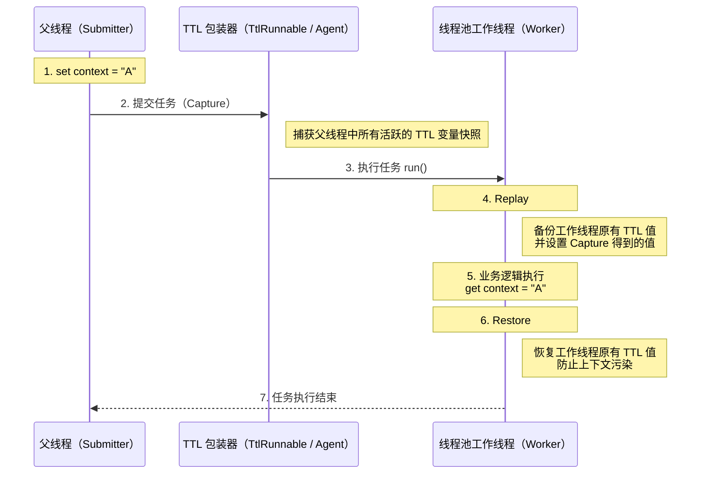

<!-- @include: @article-header.snippet.md -->

## ThreadLocal

### ThreadLocal dùng để làm gì?

Thông thường, các biến chúng ta tạo ra có thể được truy cập và sửa đổi bởi bất kỳ thread nào. Điều này trong môi trường đa luồng có thể dẫn đến tranh chấp dữ liệu và các vấn đề thread safety. Vậy, **nếu muốn mỗi thread có biến cục bộ riêng của mình, thì phải làm như thế nào?**

Lớp `ThreadLocal` trong JDK chính xác là để giải quyết vấn đề này. **Lớp `ThreadLocal` cho phép mỗi thread gắn kết với giá trị của riêng mình**, có thể hình dung nó như một "chiếc hộp chứa dữ liệu". Mỗi thread có chiếc hộp độc lập riêng của mình để lưu trữ dữ liệu riêng tư, đảm bảo dữ liệu giữa các thread khác nhau không ảnh hưởng lẫn nhau.

Khi bạn tạo một biến `ThreadLocal`, mỗi thread truy cập biến đó sẽ có một bản sao độc lập. Đây cũng là lý do `ThreadLocal` có tên như vậy. Thread có thể lấy bản sao cục bộ của mình thông qua phương thức `get()`, hoặc sửa đổi giá trị của bản sao đó thông qua phương thức `set()`, từ đó tránh được các vấn đề về thread safety.

Ví dụ đơn giản: Giả sử có hai người đến kho báu để thu thập châu báu. Nếu họ dùng chung một túi, chắc chắn sẽ xảy ra tranh giành; nhưng nếu mỗi người có một túi riêng biệt, sẽ không có vấn đề gì. Nếu coi hai người này là các thread, thì `ThreadLocal` chính là phương pháp để tránh hai thread này tranh giành cùng một tài nguyên.

```java
public class ThreadLocalExample {
    private static ThreadLocal<Integer> threadLocal = ThreadLocal.withInitial(() -> 0);

    public static void main(String[] args) {
        Runnable task = () -> {
            int value = threadLocal.get();
            value += 1;
            threadLocal.set(value);
            System.out.println(Thread.currentThread().getName() + " Value: " + threadLocal.get());
        };

        Thread thread1 = new Thread(task, "Thread-1");
        Thread thread2 = new Thread(task, "Thread-2");

        thread1.start(); // 输出: Thread-1 Value: 1
        thread2.start(); // 输出: Thread-2 Value: 1
    }
}
```

### ⭐️Bạn có hiểu nguyên lý hoạt động của ThreadLocal không?

Hãy bắt đầu từ source code của lớp `Thread`.

```java
public class Thread implements Runnable {
    //......
    //与此线程有关的ThreadLocal值。由ThreadLocal类维护
    ThreadLocal.ThreadLocalMap threadLocals = null;

    //与此线程有关的InheritableThreadLocal值。由InheritableThreadLocal类维护
    ThreadLocal.ThreadLocalMap inheritableThreadLocals = null;
    //......
}
```

Từ source code của lớp `Thread` ở trên, ta có thể thấy rằng trong lớp `Thread` có một biến `threadLocals` và một biến `inheritableThreadLocals`, cả hai đều là biến kiểu `ThreadLocalMap`. Chúng ta có thể hiểu `ThreadLocalMap` như một `HashMap` tùy chỉnh được triển khai bởi lớp `ThreadLocal`. Theo mặc định, cả hai biến này đều là null, chỉ khi thread hiện tại gọi phương thức `set` hoặc `get` của lớp `ThreadLocal` thì chúng mới được tạo ra. Thực tế, khi gọi hai phương thức này, chúng ta đang gọi các phương thức `get()` và `set()` tương ứng của lớp `ThreadLocalMap`.

Phương thức `set()` của lớp `ThreadLocal`

```java
public void set(T value) {
    //获取当前请求的线程
    Thread t = Thread.currentThread();
    //取出 Thread 类内部的 threadLocals 变量(哈希表结构)
    ThreadLocalMap map = getMap(t);
    if (map != null)
        // 将需要存储的值放入到这个哈希表中
        map.set(this, value);
    else
        createMap(t, value);
}
ThreadLocalMap getMap(Thread t) {
    return t.threadLocals;
}
```

Qua những nội dung trên, chúng ta có thể suy luận ra kết luận: **Cuối cùng, biến được lưu trong `ThreadLocalMap` của thread hiện tại, chứ không phải trong `ThreadLocal`. `ThreadLocal` chỉ có thể hiểu là lớp bọc của `ThreadLocalMap`, dùng để truyền giá trị biến.** Trong lớp `ThreadLocal`, có thể lấy đối tượng thread hiện tại thông qua `Thread.currentThread()`, sau đó truy cập trực tiếp vào đối tượng `ThreadLocalMap` của thread đó thông qua `getMap(Thread t)`.

**Mỗi `Thread` đều có một `ThreadLocalMap`, và `ThreadLocalMap` có thể lưu trữ các cặp key-value với key là `ThreadLocal`, value là đối tượng Object.**

```java
ThreadLocalMap(ThreadLocal<?> firstKey, Object firstValue) {
    //......
}
```

Ví dụ, nếu chúng ta khai báo hai đối tượng `ThreadLocal` trong cùng một thread, thì nội bộ `Thread` vẫn chỉ dùng một `ThreadLocalMap` duy nhất để lưu trữ dữ liệu. Key của `ThreadLocalMap` chính là đối tượng `ThreadLocal`, value là giá trị được đặt thông qua phương thức `set` của đối tượng `ThreadLocal`.

Cấu trúc dữ liệu của `ThreadLocal` được thể hiện trong hình dưới đây:


`ThreadLocalMap` là lớp inner static của `ThreadLocal`.


### ⭐️Vấn đề rò rỉ bộ nhớ của ThreadLocal được gây ra như thế nào?

Nguyên nhân cơ bản của rò rỉ bộ nhớ `ThreadLocal` nằm ở cơ chế triển khai nội bộ của nó.

Từ những nội dung trên, chúng ta đã biết: Mỗi thread duy trì một map tên là `ThreadLocalMap`. Khi bạn dùng `ThreadLocal` để lưu giá trị, thực tế là lưu giá trị vào `ThreadLocalMap` của thread hiện tại, trong đó bản thân instance `ThreadLocal` là key, còn giá trị bạn muốn lưu là value.

Source code của phương thức `set()` của `ThreadLocal` như sau:

```java
public void set(T value) {
    Thread t = Thread.currentThread(); // 获取当前线程
    ThreadLocalMap map = getMap(t);   // 获取当前线程的 ThreadLocalMap
    if (map != null) {
        map.set(this, value);         // 设置值
    } else {
        createMap(t, value);          // 创建新的 ThreadLocalMap
    }
}
```

Trong các phương thức `set()` và `createMap()` của `ThreadLocalMap`, không lưu trực tiếp bản thân đối tượng `ThreadLocal`, mà sử dụng hash code của `ThreadLocal` để tính chỉ số mảng, cuối cùng lưu vào mảng kiểu `static class Entry extends WeakReference<ThreadLocal<?>>`.

```java
int i = key.threadLocalHashCode & (len-1);
```

Định nghĩa `Entry` của `ThreadLocalMap` như sau:

```java
static class Entry extends WeakReference<ThreadLocal<?>> {
    Object value;

    Entry(ThreadLocal<?> k, Object v) {
        super(k);
        value = v;
    }
}
```

Cơ chế tham chiếu của key và value trong `ThreadLocalMap`:

- **key là weak reference**: key trong `ThreadLocalMap` là weak reference của `ThreadLocal` (`WeakReference<ThreadLocal<?>>`). Điều này có nghĩa là nếu instance `ThreadLocal` không còn được bất kỳ strong reference nào trỏ đến, garbage collector sẽ thu hồi instance đó trong lần GC tiếp theo, khiến key tương ứng trong `ThreadLocalMap` trở thành `null`.
- **value là strong reference**: Ngay cả khi key bị GC thu hồi, value vẫn được `ThreadLocalMap.Entry` giữ bằng strong reference, không thể bị GC thu hồi.

Khi instance `ThreadLocal` mất strong reference, value tương ứng của nó vẫn tồn tại trong `ThreadLocalMap`, vì đối tượng `Entry` đang giữ nó bằng strong reference. Nếu thread tiếp tục tồn tại (ví dụ như thread trong thread pool), `ThreadLocalMap` cũng sẽ tiếp tục tồn tại, khiến các entry có key là `null` không thể được garbage collect, dẫn đến rò rỉ bộ nhớ.

Tức là, để xảy ra rò rỉ bộ nhớ cần đồng thời thỏa mãn hai điều kiện:

1. Instance `ThreadLocal` không còn được strong reference nào giữ;
2. Thread tiếp tục tồn tại, khiến `ThreadLocalMap` tồn tại lâu dài.

Mặc dù `ThreadLocalMap` sẽ cố gắng dọn sạch các entry có key là null trong các thao tác `get()`, `set()` và `remove()`, nhưng cơ chế dọn dẹp này là thụ động và không hoàn toàn đáng tin cậy.

**Làm thế nào để tránh rò rỉ bộ nhớ?**

1. Sau khi sử dụng xong `ThreadLocal`, nhất định phải gọi phương thức `remove()`. Đây là cách an toàn nhất và được khuyến nghị nhất. Phương thức `remove()` sẽ xóa entry tương ứng khỏi `ThreadLocalMap` một cách tường minh, giải quyết triệt để nguy cơ rò rỉ bộ nhớ. Ngay cả khi khai báo `ThreadLocal` là `static final`, vẫn nên gọi `remove()` sau mỗi lần sử dụng.
2. Trong các kịch bản tái sử dụng thread như thread pool, sử dụng khối `try-finally` để đảm bảo phương thức `remove()` nhất định được thực thi dù có xảy ra exception hay không.

#### Tại sao key của Entry được thiết kế là weak reference?

Đây là câu hỏi phỏng vấn kinh điển. Nhiều bạn biết rằng key của `ThreadLocalMap` là weak reference, nhưng không rõ **tại sao lại thiết kế như vậy**, và nếu thay bằng strong reference thì sẽ ra sao.

Trước tiên, hãy xem toàn bộ chuỗi tham chiếu. Khi một thread sử dụng `ThreadLocal`, liên quan đến các mối quan hệ tham chiếu sau:

```
强引用（栈/静态变量）──→ ThreadLocal 实例
                              ↑
Thread ──→ ThreadLocalMap ──→ Entry ─── key（WeakReference）──┘
                              │
                              └─── value（强引用）──→ 实际存储的对象
```

Hiểu được chuỗi tham chiếu này, hãy so sánh hai phương án thiết kế:

**Giả sử key dùng strong reference (thực tế không áp dụng):**

Khi reference `ThreadLocal` trong code nghiệp vụ bị đặt thành `null` (ví dụ sau khi phương thức kết thúc, đối tượng bị thu hồi), dù code nghiệp vụ không còn cần `ThreadLocal` này nữa, nhưng do Entry của `ThreadLocalMap` giữ **strong reference** đến key, instance `ThreadLocal` vẫn không thể bị GC thu hồi. Miễn là thread không kết thúc, `ThreadLocal` này và value tương ứng sẽ luôn tồn tại trong bộ nhớ, gây ra rò rỉ bộ nhớ khi **cả key và value đều không thể được thu hồi**.

**key dùng weak reference (phương án thực tế được áp dụng):**

Khi reference `ThreadLocal` trong code nghiệp vụ bị đặt thành `null`, do key của Entry là weak reference, instance `ThreadLocal` sẽ bị thu hồi trong lần GC tiếp theo, key trở thành `null`. Lúc này dù value vẫn tồn tại (strong reference), nhưng `ThreadLocalMap` khi thực thi các thao tác `get()`, `set()`, `remove()` sẽ chủ động thăm dò và dọn sạch các "stale entry" (entry hết hạn) có key là `null`, từ đó giải phóng đối tượng value.

Tức là, **thiết kế weak reference là một cơ chế phòng thủ "dự phòng"** — ngay cả khi lập trình viên quên gọi `remove()`, GC của JVM kết hợp với logic tự dọn dẹp của `ThreadLocalMap` vẫn có cơ hội thu hồi dữ liệu bị rò rỉ. Còn nếu dùng strong reference, một khi quên `remove()`, sẽ hoàn toàn không có cơ hội khắc phục nào cả.

> Cần lưu ý rằng cơ chế tự dọn dẹp này được **kích hoạt thụ động** (chỉ dọn dẹp kèm theo trong các thao tác `get`/`set`/`remove`), không thể đảm bảo tất cả entry hết hạn đều được dọn sạch kịp thời. Do đó, **weak reference chỉ giảm thiểu nguy cơ rò rỉ bộ nhớ, chứ không loại bỏ hoàn toàn**, việc gọi `remove()` thủ công vẫn là bắt buộc.

#### Rủi ro đặc biệt trong kịch bản thread pool

Ở trên đã đề cập rằng một trong những điều kiện gây ra rò rỉ bộ nhớ là "thread tiếp tục tồn tại". Trong kịch bản tạo thread bằng `new Thread()`, sau khi thread thực thi xong sẽ bị hủy, `ThreadLocalMap` mà nó giữ cũng sẽ được GC thu hồi, tác động của rò rỉ tương đối hạn chế.

Nhưng trong kịch bản **thread pool**, vấn đề sẽ bị khuếch đại nghiêm trọng. Các core thread trong thread pool mặc định không bị hủy, chúng được tái sử dụng lặp đi lặp lại để thực thi các task khác nhau. Điều này có nghĩa là:

1. **Rò rỉ bộ nhớ tích lũy liên tục**: Mỗi task nếu sử dụng `ThreadLocal` mà không dọn sạch, value của nó sẽ luôn tồn tại trong `ThreadLocalMap` của thread đó. Khi task liên tục được submit và thực thi, dữ liệu bị rò rỉ sẽ ngày càng tích lũy nhiều hơn, cuối cùng có thể dẫn đến OOM.
2. **Ô nhiễm dữ liệu (dirty data)**: Giá trị `ThreadLocal` được đặt bởi task trước, nếu không được dọn sạch, task tiếp theo được phân công cùng thread sẽ đọc được giá trị còn sót này. Điều này có thể dẫn đến lỗi logic nghiệp vụ nghiêm trọng, ví dụ request của người dùng A đọc được thông tin danh tính của người dùng B.

**Vụ sự cố thực tế của đội kỹ thuật Meituan:**

Đội kỹ thuật Meituan trong bài viết [《Nguyên lý triển khai Java Thread Pool và thực tiễn trong nghiệp vụ Meituan》](https://tech.meituan.com/2020/04/02/java-pooling-pratice-in-meituan.html) đã ghi lại một sự cố trên production do sử dụng `ThreadLocal` không đúng cách: Trong một ứng dụng Web dựa vào `ThreadLocal` để truyền context người dùng, do sử dụng thread pool để xử lý request và không dọn sạch `ThreadLocal` sau khi request kết thúc, dẫn đến **khi request tiếp theo tái sử dụng cùng thread, đọc được thông tin người dùng còn sót lại từ request trước**, gây ra vấn đề nghiêm trọng là dữ liệu người dùng bị trộn lẫn.

#### Quy định bắt buộc trong Alibaba Java Development Manual

Chính vì sự kết hợp thread pool + `ThreadLocal` rất dễ mắc bẫy, "Alibaba Java Development Manual" trong chương "Xử lý Concurrent" đã đưa ra yêu cầu ở mức độ **bắt buộc**:

> **【Bắt buộc】** Phải thu hồi giá trị của thread hiện tại được ghi bởi biến `ThreadLocal` tùy chỉnh, đặc biệt trong kịch bản thread pool, thread thường xuyên được tái sử dụng. Nếu không dọn sạch biến `ThreadLocal` tùy chỉnh, có thể ảnh hưởng đến logic nghiệp vụ tiếp theo và gây ra rò rỉ bộ nhớ. Nên dùng khối `try-finally` trong proxy để thu hồi.

Mẫu sử dụng đúng như sau:

```java
// 定义为 static final，避免重复创建 ThreadLocal 实例
private static final ThreadLocal<UserContext> userContextHolder = new ThreadLocal<>();

public void processRequest(HttpServletRequest request) {
    try {
        // 在 try 块中设置值
        UserContext context = buildUserContext(request);
        userContextHolder.set(context);

        // 执行业务逻辑
        doBusinessLogic();
    } finally {
        // 在 finally 块中必须清理，确保无论是否发生异常都会执行
        userContextHolder.remove();
    }
}
```

Có ba điểm quan trọng ở đây:

1. **Khai báo `ThreadLocal` là `static final`**: Đảm bảo toàn bộ ứng dụng chỉ có một instance `ThreadLocal`, tránh việc tạo lại nhiều lần dẫn đến instance cũ mất strong reference và key bị thu hồi, làm trầm trọng thêm rò rỉ bộ nhớ.
2. **`try-finally` đảm bảo `remove()` nhất định được thực thi**: Ngay cả khi logic nghiệp vụ ném ra exception, khối `finally` vẫn đảm bảo `ThreadLocal` được dọn sạch.
3. **Dọn sạch ngay sau khi sử dụng xong, không phải đặt lại trước lần sử dụng tiếp theo**: Mặc dù `set()` trước khi sử dụng có thể ghi đè giá trị cũ để giải quyết vấn đề dirty data, nhưng không giải quyết được việc chiếm dụng bộ nhớ của value còn sót từ task trước. Chỉ khi `remove()` sau khi dùng xong mới có thể đồng thời tránh cả rò rỉ bộ nhớ lẫn ô nhiễm dữ liệu.

### ⭐️Làm thế nào để truyền giá trị ThreadLocal qua các thread?

**Tại sao ThreadLocal lại không hoạt động trong kịch bản bất đồng bộ?**

Giá trị của `ThreadLocal` không nằm trong đối tượng `ThreadLocal`, mà được lưu trữ trong `Thread`:

```java
Thread → ThreadLocalMap → Entry(ThreadLocal, value)
```

Cấu trúc dữ liệu của `ThreadLocal` được thể hiện trong hình dưới đây:


Thực thi bất đồng bộ thường có nghĩa là task sẽ chuyển từ thread hiện tại sang một thread khác (ví dụ worker thread trong thread pool) để thực thi. Do các thread khác nhau duy trì `ThreadLocalMap` độc lập riêng biệt, theo mặc định context `ThreadLocal` không thể được truyền tự động trong quá trình thực thi bất đồng bộ.

**Làm thế nào để truyền giá trị ThreadLocal qua các thread?**

Để giải quyết vấn đề này, có hai giải pháp chính được ngành sử dụng: một là của JDK gốc, một là của Alibaba open source.

1. `InheritableThreadLocal`: Một lớp được JDK1.2 cung cấp, kế thừa từ `ThreadLocal`. Khi sử dụng `InheritableThreadLocal`, khi tạo thread con, thread con sẽ kế thừa giá trị `ThreadLocal` từ thread cha, nhưng không hỗ trợ truyền giá trị `ThreadLocal` trong kịch bản thread pool.
2. `TransmittableThreadLocal`: `TransmittableThreadLocal` (viết tắt TTL) là công cụ open source của Alibaba, kế thừa và tăng cường lớp `InheritableThreadLocal`, có thể hỗ trợ truyền giá trị `ThreadLocal` trong kịch bản thread pool. Địa chỉ dự án: <https://github.com/alibaba/transmittable-thread-local>.

#### Nguyên lý của InheritableThreadLocal

`InheritableThreadLocal` triển khai chức năng kế thừa giá trị `ThreadLocal` của thread cha khi tạo thread bất đồng bộ. Lớp này được cung cấp bởi team JDK, thực hiện truyền giá trị `ThreadLocal` khi tạo thread bằng cách sửa đổi lớp `Thread` trong package source JDK.

**Giá trị của `InheritableThreadLocal` được lưu ở đâu?**

Trong lớp `Thread`, một `ThreadLocalMap` mới được thêm vào, đặt tên là `inheritableThreadLocals`, biến này dùng để lưu trữ các giá trị `ThreadLocal` cần được truyền qua thread. Như sau:

```JAVA
class Thread implements Runnable {
    ThreadLocal.ThreadLocalMap threadLocals = null;
    ThreadLocal.ThreadLocalMap inheritableThreadLocals = null;
}
```

**Làm thế nào để hoàn thành việc truyền giá trị `ThreadLocal`?**

Được thực hiện thông qua việc sửa đổi constructor của lớp `Thread`, khi tạo thread `Thread`, lấy biến `inheritableThreadLocals` của thread cha và gán cho thread con. Code liên quan như sau:

```JAVA
// Thread 的构造方法会调用 init() 方法
private void init(/* ... */) {
	// 1、获取父线程
    Thread parent = currentThread();
    // 2、将父线程的 inheritableThreadLocals 赋值给子线程
    if (inheritThreadLocals && parent.inheritableThreadLocals != null)
        this.inheritableThreadLocals =
        	ThreadLocal.createInheritedMap(parent.inheritableThreadLocals);
}
```

**Phương án `InheritableThreadLocal` có vấn đề gì?**

Điểm yếu của phương án này là **tính một lần**, tức là nó chỉ xảy ra sao chép một lần khi thread được tạo. Tuy nhiên, trong phát triển hiện nay, chúng ta sử dụng rất nhiều thread pool, nhưng các thread trong thread pool được tái sử dụng.

Hãy tưởng tượng: Task A thực thi trong thread 1, truyền giá trị `ThreadLocal` của nó cho thread con 2 trong thread pool. Sau khi Task A kết thúc, thread 1 nghỉ ngơi. Tiếp theo, Task B đến, thực thi trong thread 3, thread pool lại tái sử dụng thread con 2 vừa rồi để thực thi một phần của Task B. Lúc này, trong `ThreadLocal` của thread con 2 vẫn còn sót dirty data từ Task A, trong khi context của Task B (trong thread 3) hoàn toàn không được truyền sang. Điều này dẫn đến ô nhiễm dữ liệu và mất context.

#### Nguyên lý của TransmittableThreadLocal

JDK mặc định không hỗ trợ chức năng truyền giá trị `ThreadLocal` trong kịch bản thread pool, vì vậy Alibaba đã open source một bộ công cụ `TransmittableThreadLocal` để triển khai chức năng này.

Do Alibaba không thể sửa đổi source JDK, TTL đã khéo léo sử dụng **Decorator Pattern** để tăng cường task (`Runnable`/`Callable`) hoặc thread pool (`Executor`), chuyển thời điểm truyền context từ "khi tạo thread" sang "khi submit và thực thi task".

Logic cốt lõi của TTL có thể tóm tắt thành ba giai đoạn (CRR):

- **Capture (Bắt)**: Ngay khoảnh khắc submit task (như gọi `execute`), `TtlRunnable` sẽ gọi `TransmittableThreadLocal.Transmitter.capture()`. Nó lấy tập hợp `holder` được duy trì nội bộ, chụp lại tất cả biến TTL đang hoạt động trong thread cha hiện tại và lưu vào snapshot.
- **Replay (Phát lại)**: Trước khi worker thread trong thread pool thực thi phương thức `run()`, gọi `replay()`. Nó `set` các giá trị trong snapshot vào worker thread hiện tại, và backup các giá trị cũ ban đầu của thread đó.
- **Restore (Khôi phục)**: Sau khi task thực thi xong, gọi `restore()`. Nó khôi phục worker thread về trạng thái trước khi thực thi dựa trên bản backup, ngăn ô nhiễm context hoặc rò rỉ bộ nhớ.

Hình này là sequence diagram cho toàn bộ quá trình CRR do TTL chính thức cung cấp:


Hơi khó hiểu phải không? Có thể xem sequence diagram CRR tôi vẽ dưới đây, rõ ràng và trực quan hơn:



Tức là, bản chất của TTL là Capture context khi submit task, Replay context trước khi thực thi task, Restore trạng thái thread sau khi task kết thúc, từ đó hỗ trợ an toàn việc truyền `ThreadLocal` trong thread pool.

TTL cung cấp hai cách tích hợp chính, có thể chọn tùy theo yêu cầu về xâm phạm và chi phí sửa đổi.

**1. Bọc tường minh (tích hợp thủ công)**

Sử dụng `TtlRunnable.get(Runnable)` hoặc `TtlCallable.get(Callable)` để bọc task, sử dụng `TtlExecutors.getTtlExecutor(Executor)`, `getTtlExecutorService(...)` để bọc thread pool. Cách tích hợp này rõ ràng và dễ kiểm soát, nhưng cần code nghiệp vụ phải phối hợp, có tính xâm phạm nhất định.

Đoạn code dưới đây minh họa TTL thông qua CRR, truyền và cách ly an toàn context `ThreadLocal` trong điều kiện hỗ trợ tái sử dụng thread pool và reject policy.

```java
public class TtlContextHolder {
    private static final Logger log = LoggerFactory.getLogger(TtlContextHolder.class);

    // 1. 使用 static final 确保 TTL 实例不被重复创建，防止内存泄漏
    // 重写 copy 方法（可选）：如果是引用类型，建议实现深拷贝
    private static final TransmittableThreadLocal<String> CONTEXT = new TransmittableThreadLocal<String>() {
        @Override
        public String copy(String parentValue) {
            // 默认是直接返回引用，如果是可变对象（如 Map），请在这里 new 新对象
            return parentValue;
        }
    };

    // 2. 线程池初始化：确保只被 TtlExecutors 包装一次
    private static final ExecutorService TTL_EXECUTOR_SERVICE;

    static {
        ExecutorService rawExecutor = new ThreadPoolExecutor(
                2, 4, 60L, TimeUnit.SECONDS,
                new LinkedBlockingQueue<>(1000), (Runnable r) -> new Thread(r, "ttl-worker-" + r.hashCode()),
                new ThreadPoolExecutor.CallerRunsPolicy() // 关键：TTL 完美支持此拒绝策略
        );
        // 包装原始线程池
        TTL_EXECUTOR_SERVICE = TtlExecutors.getTtlExecutorService(rawExecutor);
    }

    public static void main(String[] args) throws Exception {
        try {
            // 3. 在父线程中设置上下文
            CONTEXT.set("value-set-in-parent");
            log.info("父线程上下文: {}", CONTEXT.get());

            // 4. 使用 Lambda 简化任务提交
            TTL_EXECUTOR_SERVICE.submit(() -> {
                log.info("异步任务(Runnable)读取上下文: {}", CONTEXT.get());
                // 模拟业务逻辑
                // 注意：子线程修改是否影响父线程，取决于 copy() 是否做了深拷贝
                CONTEXT.set("value-modified-in-child");
            });

            Future<String> future = TTL_EXECUTOR_SERVICE.submit(() -> {
                log.info("异步任务(Callable)读取上下文: {}", CONTEXT.get());
                return "Success";
            });

            future.get();

            // 5. 验证父线程上下文是否被污染
            log.info("父线程最终上下文: {}", CONTEXT.get());

        } finally {
            // 6. 清理当前线程（父线程）的上下文，子线程的上下文由 TTL 的 Restore 机制自动恢复
            CONTEXT.remove();
        }
    }
}
```

Kết quả đầu ra:

```ba
09:06:31.438 INFO  [main] TtlContextHolder - 父线程上下文: value-set-in-parent
09:06:31.452 INFO  [ttl-worker-1663166483] TtlContextHolder - 异步任务(Runnable)读取上下文: value-set-in-parent
09:06:31.453 INFO  [ttl-worker-841283083] TtlContextHolder - 异步任务(Callable)读取上下文: value-set-in-parent
09:06:31.453 INFO  [main] TtlContextHolder - 父线程最终上下文: value-set-in-parent
```

Nếu bạn muốn test đoạn code này, nhớ thêm Maven dependency của TTL:

```XML
<dependency>
    <groupId>com.alibaba</groupId>
    <artifactId>transmittable-thread-local</artifactId>
    <version>2.14.4</version>
</dependency>
```

**2. Tích hợp không xâm phạm (Java Agent)**

Thông qua Java Agent, tăng cường bytecode cho các lớp liên quan đến thread pool trong giai đoạn load class, tự động dệt vào logic truyền context của TTL, thực hiện truyền context mà code nghiệp vụ không cần sửa đổi. Cách này code nghiệp vụ không cần biết TTL tồn tại, nhưng độ phức tạp triển khai tương đối cao hơn.

TTL Agent mặc định sửa đổi các thành phần executor JDK sau:

1. **Thread pool tiêu chuẩn**: `java.util.concurrent.ThreadPoolExecutor` và `java.util.concurrent.ScheduledThreadPoolExecutor`.
2. **Hệ thống ForkJoin**: `java.util.concurrent.ForkJoinTask` (từ đó hỗ trợ trong suốt `CompletableFuture` và Java 8 parallel stream `Stream`).
3. **Thành phần kế thừa**: `java.util.TimerTask` (hỗ trợ từ v2.7.0, mặc định bật từ v2.11.2).

Thêm cấu hình `-javaagent` vào tham số khởi động Java:

```bash
# 基础配置
java -javaagent:path/to/transmittable-thread-local-2.x.y.jar \
     -cp classes \
     com.your.app.Main
```

#### Kịch bản ứng dụng

1. **Đánh dấu lưu lượng stress test**: Trong kịch bản stress test, dùng `ThreadLocal` để lưu dấu hiệu stress test, phân biệt lưu lượng stress test và lưu lượng thực. Nếu dấu hiệu bị mất, có thể dẫn đến lưu lượng stress test bị xử lý nhầm thành lưu lượng production.
2. **Truyền context**: Trong hệ thống phân tán, truyền thông tin theo dõi liên kết (như Trace ID) hoặc thông tin context người dùng.

#### Tóm tắt

Giá trị của `ThreadLocal` mặc định không thể truyền qua các thread, vì giá trị của nó được lưu trong `ThreadLocalMap` của **từng đối tượng `Thread`**, thread cha và thread con là hai đối tượng khác nhau.

Để giải quyết vấn đề này, có hai phương án chính:

1. **InheritableThreadLocal của JDK**: Khi **tạo thread con**, nó sẽ **sao chép** giá trị của thread cha cho thread con. Nhưng vấn đề là trong kịch bản **thread pool** sẽ thất bại. Vì thread pool sẽ **tái sử dụng** thread, điều này có thể dẫn đến thread lấy được **dirty data** từ task trước truyền xuống.
2. **TransmittableThreadLocal (TTL) của Alibaba**: Đây là phương án được dùng trong dự án của chúng ta, nó chuyên giải quyết vấn đề thread pool. Nguyên lý của nó là: khi **submit task** vào thread pool, nó sẽ **capture** giá trị `ThreadLocal` của thread cha, và **ràng buộc** với task. Khi một thread trong thread pool sắp thực thi task này, nó sẽ **set** giá trị đã capture vào thread đó, sau khi task thực thi xong thì **dọn sạch**.

Nói đơn giản, **InheritableThreadLocal được gắn với thread, chỉ có hiệu lực khi tạo; còn TTL được gắn với task, hỗ trợ hoàn hảo thread pool.**

## Thread Pool

### Thread pool là gì?

Như tên gọi, thread pool là một resource pool quản lý một loạt thread. Khi có task cần xử lý, thread được lấy trực tiếp từ thread pool để xử lý. Sau khi xử lý xong, thread không bị hủy ngay lập tức mà chờ task tiếp theo.

### ⭐️Tại sao phải dùng thread pool?

Kỹ thuật pooling chắc hẳn ai cũng đã quen thuộc: thread pool, database connection pool, HTTP connection pool, v.v. đều là ứng dụng của tư tưởng này. Tư tưởng chính của kỹ thuật pooling là để giảm tiêu tốn tài nguyên mỗi lần lấy, nâng cao tỷ lệ sử dụng tài nguyên.

Thread pool cung cấp một cách để giới hạn và quản lý tài nguyên (bao gồm cả thực thi một task). Mỗi thread pool còn duy trì một số thống kê cơ bản, ví dụ số lượng task đã hoàn thành. Sử dụng thread pool mang lại những lợi ích chính sau:

1. **Giảm tiêu tốn tài nguyên**: Các thread trong thread pool có thể được tái sử dụng. Sau khi thread hoàn thành một task, nó không bị hủy ngay lập tức mà quay lại pool chờ task tiếp theo. Điều này tránh được chi phí tạo và hủy thread thường xuyên.
2. **Tăng tốc độ phản hồi**: Vì thread pool thường duy trì một số lượng nhất định core thread (hay còn gọi là "nhân viên thường trực"), sau khi task đến, có thể giao trực tiếp cho các thread đang tồn tại, rảnh rỗi để thực thi, tiết kiệm thời gian tạo thread, task có thể được xử lý nhanh hơn.
3. **Nâng cao khả năng quản lý thread**: Thread pool cho phép chúng ta quản lý tập trung các thread trong pool. Chúng ta có thể cấu hình kích thước thread pool (số core thread, số thread tối đa), loại và kích thước task queue, reject policy, v.v. Điều này có thể kiểm soát tổng số thread concurrent, ngăn ngừa cạn kiệt tài nguyên, đảm bảo tính ổn định của hệ thống. Đồng thời, thread pool thường cũng cung cấp interface giám sát, tiện cho chúng ta theo dõi trạng thái hoạt động của thread pool (ví dụ có bao nhiêu active thread, bao nhiêu task đang xếp hàng), tiện cho việc tuning.

### Làm thế nào để tạo thread pool?

Trong Java, tạo thread pool chủ yếu có hai cách:

**Cách 1: Tạo trực tiếp qua constructor của `ThreadPoolExecutor` (khuyến nghị)**


Đây là cách được khuyến nghị nhất, vì nó cho phép lập trình viên chỉ định rõ ràng các tham số cốt lõi của thread pool, kiểm soát tinh tế hơn hành vi hoạt động của thread pool, từ đó tránh nguy cơ cạn kiệt tài nguyên.

**Cách 2: Tạo qua lớp tiện ích `Executors` (không khuyến nghị cho môi trường production)**

Các phương thức tạo thread pool được cung cấp bởi lớp tiện ích `Executors` như hình dưới:


Có thể thấy, thông qua lớp tiện ích `Executors` có thể tạo nhiều loại thread pool, bao gồm:

- `FixedThreadPool`: Thread pool với số lượng thread cố định. Số lượng thread trong thread pool này luôn không đổi. Khi có task mới được submit, nếu trong thread pool có thread rảnh thì sẽ thực thi ngay. Nếu không, task mới sẽ được lưu tạm trong một task queue, chờ khi có thread rảnh sẽ xử lý các task trong task queue.
- `SingleThreadExecutor`: Thread pool chỉ có một thread. Nếu nhiều hơn một task được submit vào thread pool, các task sẽ được lưu trong task queue, chờ thread rảnh, thực thi theo thứ tự FIFO.
- `CachedThreadPool`: Thread pool có thể điều chỉnh số lượng thread theo tình hình thực tế. Số lượng thread trong thread pool không xác định, nhưng nếu có thread rảnh có thể tái sử dụng thì sẽ ưu tiên dùng thread tái sử dụng. Nếu tất cả thread đều đang làm việc mà có task mới được submit, sẽ tạo thread mới để xử lý task. Tất cả thread sau khi hoàn thành task hiện tại sẽ quay lại thread pool để tái sử dụng.
- `ScheduledThreadPool`: Thread pool chạy task sau một độ trễ nhất định hoặc thực thi task định kỳ.

### ⭐️Tại sao không nên dùng thread pool tích hợp?

Trong "Alibaba Java Development Manual" chương "Xử lý Concurrent", đã chỉ rõ rằng tài nguyên thread phải được cung cấp thông qua thread pool, không được phép tự tạo thread tường minh trong ứng dụng.

**Tại sao vậy?**

> Lợi ích của việc dùng thread pool là giảm thời gian và chi phí tài nguyên hệ thống tiêu tốn vào việc tạo và hủy thread, giải quyết vấn đề thiếu tài nguyên. Nếu không dùng thread pool, có thể dẫn đến hệ thống tạo ra lượng lớn thread cùng loại, gây tiêu tốn hết bộ nhớ hoặc vấn đề "chuyển đổi quá mức".

Ngoài ra, "Alibaba Java Development Manual" bắt buộc thread pool không được phép tạo bằng `Executors`, mà phải qua cách dùng constructor của `ThreadPoolExecutor`. Cách xử lý này giúp người viết code hiểu rõ hơn các quy tắc hoạt động của thread pool, tránh nguy cơ cạn kiệt tài nguyên.

Những nhược điểm của các đối tượng thread pool được trả về bởi `Executors` như sau (sẽ giới thiệu chi tiết ở phần sau):

- `FixedThreadPool` và `SingleThreadExecutor`: Dùng blocking queue `LinkedBlockingQueue`, độ dài tối đa của task queue là `Integer.MAX_VALUE`, có thể coi là vô hạn, có thể tích lũy lượng lớn request, dẫn đến OOM.
- `CachedThreadPool`: Dùng synchronous queue `SynchronousQueue`, cho phép tạo số lượng thread là `Integer.MAX_VALUE`. Nếu số lượng task quá nhiều và tốc độ thực thi chậm, có thể tạo ra lượng lớn thread, dẫn đến OOM.
- `ScheduledThreadPool` và `SingleThreadScheduledExecutor`: Dùng delayed blocking queue vô hạn `DelayedWorkQueue`, độ dài tối đa của task queue là `Integer.MAX_VALUE`, có thể tích lũy lượng lớn request, dẫn đến OOM.

```java
public static ExecutorService newFixedThreadPool(int nThreads) {
    // LinkedBlockingQueue 的默认长度为 Integer.MAX_VALUE，可以看作是无界的
    return new ThreadPoolExecutor(nThreads, nThreads,0L, TimeUnit.MILLISECONDS,new LinkedBlockingQueue<Runnable>());

}

public static ExecutorService newSingleThreadExecutor() {
    // LinkedBlockingQueue 的默认长度为 Integer.MAX_VALUE，可以看作是无界的
    return new FinalizableDelegatedExecutorService (new ThreadPoolExecutor(1, 1,0L, TimeUnit.MILLISECONDS,new LinkedBlockingQueue<Runnable>()));

}

// 同步队列 SynchronousQueue，没有容量，最大线程数是 Integer.MAX_VALUE`
public static ExecutorService newCachedThreadPool() {

    return new ThreadPoolExecutor(0, Integer.MAX_VALUE,60L, TimeUnit.SECONDS,new SynchronousQueue<Runnable>());

}

// DelayedWorkQueue（延迟阻塞队列）
public static ScheduledExecutorService newScheduledThreadPool(int corePoolSize) {
    return new ScheduledThreadPoolExecutor(corePoolSize);
}
public ScheduledThreadPoolExecutor(int corePoolSize) {
    super(corePoolSize, Integer.MAX_VALUE, 0, NANOSECONDS,
          new DelayedWorkQueue());
}
```

### ⭐️Các tham số phổ biến của thread pool là gì? Giải thích như thế nào?

```java
    /**
     * 用给定的初始参数创建一个新的ThreadPoolExecutor。
     */
    public ThreadPoolExecutor(int corePoolSize,//线程池的核心线程数量
                              int maximumPoolSize,//线程池的最大线程数
                              long keepAliveTime,//当线程数大于核心线程数时，多余的空闲线程存活的最长时间
                              TimeUnit unit,//时间单位
                              BlockingQueue<Runnable> workQueue,//任务队列，用来储存等待执行任务的队列
                              ThreadFactory threadFactory,//线程工厂，用来创建线程，一般默认即可
                              RejectedExecutionHandler handler//拒绝策略，当提交的任务过多而不能及时处理时，我们可以定制策略来处理任务
                               ) {
        if (corePoolSize < 0 ||
            maximumPoolSize <= 0 ||
            maximumPoolSize < corePoolSize ||
            keepAliveTime < 0)
            throw new IllegalArgumentException();
        if (workQueue == null || threadFactory == null || handler == null)
            throw new NullPointerException();
        this.corePoolSize = corePoolSize;
        this.maximumPoolSize = maximumPoolSize;
        this.workQueue = workQueue;
        this.keepAliveTime = unit.toNanos(keepAliveTime);
        this.threadFactory = threadFactory;
        this.handler = handler;
    }
```

3 tham số quan trọng nhất của `ThreadPoolExecutor`:

- `corePoolSize`: Số lượng thread tối đa có thể chạy đồng thời khi task queue chưa đạt dung lượng.
- `maximumPoolSize`: Khi số lượng task trong task queue đạt dung lượng, số lượng thread có thể chạy đồng thời hiện tại trở thành số thread tối đa.
- `workQueue`: Khi task mới đến, sẽ kiểm tra xem số lượng thread hiện đang chạy có đạt core thread count chưa. Nếu đạt rồi, task mới sẽ được lưu vào queue.

Các tham số phổ biến khác của `ThreadPoolExecutor`:

- `keepAliveTime`: Khi số lượng thread trong thread pool lớn hơn `corePoolSize`, tức là có non-core thread (thread ngoài core thread trong thread pool), các non-core thread này sau khi rảnh không bị hủy ngay lập tức mà sẽ chờ đợi, cho đến khi thời gian chờ vượt quá `keepAliveTime` mới bị thu hồi và hủy.
- `unit`: Đơn vị thời gian của tham số `keepAliveTime`.
- `threadFactory`: Được dùng khi executor tạo thread mới.
- `handler`: Reject policy (sẽ được giới thiệu chi tiết riêng sau).

Hình dưới đây có thể giúp bạn hiểu sâu hơn về mối quan hệ giữa các tham số trong thread pool (nguồn ảnh: "Java Performance Tuning in Action"):


### Core thread trong thread pool có bị thu hồi không?

`ThreadPoolExecutor` mặc định không thu hồi core thread, ngay cả khi chúng đã rảnh. Điều này để giảm chi phí tạo thread, vì core thread thường cần được giữ active lâu dài. Tuy nhiên, nếu thread pool được dùng trong kịch bản sử dụng định kỳ với tần suất không cao (có thời gian rảnh rõ rệt giữa các chu kỳ), có thể cân nhắc đặt tham số của phương thức `allowCoreThreadTimeOut(boolean value)` thành `true`, khi đó core thread rảnh (khoảng thời gian được chỉ định bởi `keepAliveTime`) sẽ bị thu hồi.

```java
public void allowCoreThreadTimeOut(boolean value) {
    // 核心线程的 keepAliveTime 必须大于 0 才能启用超时机制
    if (value && keepAliveTime <= 0) {
        throw new IllegalArgumentException("Core threads must have nonzero keep alive times");
    }
    // 设置 allowCoreThreadTimeOut 的值
    if (value != allowCoreThreadTimeOut) {
        allowCoreThreadTimeOut = value;
        // 如果启用了超时机制，清理所有空闲的线程，包括核心线程
        if (value) {
            interruptIdleWorkers();
        }
    }
}
```

### Core thread khi rảnh ở trạng thái gì?

Khi core thread rảnh, trạng thái của nó chia thành hai trường hợp sau:

- **Đã đặt thời gian tồn tại của core thread**: Core thread khi rảnh sẽ ở trạng thái `WAITING`, chờ lấy task. Nếu thời gian chờ blocking vượt quá thời gian tồn tại của core thread, thread đó sẽ thoát khỏi công việc, bị loại khỏi tập hợp worker thread của thread pool, trạng thái thread chuyển sang `TERMINATED`.
- **Chưa đặt thời gian tồn tại của core thread**: Core thread khi rảnh sẽ luôn ở trạng thái `WAITING`, chờ lấy task, core thread sẽ tồn tại mãi trong thread pool.

Khi có task khả dụng trong queue, thread bị block sẽ được đánh thức, trạng thái thread sẽ chuyển từ `WAITING` sang `RUNNABLE`, sau đó thực thi task tương ứng.

Tiếp theo, hãy tìm hiểu cách thread pool xử lý nội bộ thông qua source code liên quan.

Thread được trừu tượng hóa thành `Worker` bên trong thread pool. Sau khi `Worker` được khởi động, nó sẽ liên tục lấy task từ task queue.

Khi lấy task, sẽ quyết định hành vi lấy task từ task queue (`BlockingQueue`) dựa trên giá trị `timed`.

Nếu "đã đặt thời gian tồn tại của core thread" hoặc "số lượng thread vượt quá số lượng core thread", thì đánh dấu `timed` là `true`, cho biết khi lấy task cần dùng `poll()` với timeout được chỉ định.

- `timed == true`: Dùng `poll(timeout, unit)` để lấy task. Nếu lấy task bằng `poll(timeout, unit)` bị timeout, thread hiện tại sẽ thoát thực thi (`TERMINATED`), thread bị loại khỏi thread pool.
- `timed == false`: Dùng `take()` để lấy task. Dùng `take()` để lấy task sẽ khiến thread hiện tại block chờ mãi (`WAITING`).

Source code như sau:

```JAVA
// ThreadPoolExecutor
private Runnable getTask() {
    boolean timedOut = false;
    for (;;) {
        // ...

        // 1、如果「设置了核心线程的存活时间」或者是「线程数量超过了核心线程数量」，则 timed 为 true。
        boolean timed = allowCoreThreadTimeOut || wc > corePoolSize;
        // 2、扣减线程数量。
        // wc > maximuimPoolSize：线程池中的线程数量超过最大线程数量。其中 wc 为线程池中的线程数量。
        // timed && timeOut：timeOut 表示获取任务超时。
        // 分为两种情况：核心线程设置了存活时间 && 获取任务超时，则扣减线程数量；线程数量超过了核心线程数量 && 获取任务超时，则扣减线程数量。
        if ((wc > maximumPoolSize || (timed && timedOut))
            && (wc > 1 || workQueue.isEmpty())) {
            if (compareAndDecrementWorkerCount(c))
                return null;
            continue;
        }
        try {
            // 3、如果 timed 为 true，则使用 poll() 获取任务；否则，使用 take() 获取任务。
            Runnable r = timed ?
                workQueue.poll(keepAliveTime, TimeUnit.NANOSECONDS) :
                workQueue.take();
            // 4、获取任务之后返回。
            if (r != null)
                return r;
            timedOut = true;
        } catch (InterruptedException retry) {
            timedOut = false;
        }
    }
}
```

### ⭐️Thread pool có những reject policy nào?

Khi số lượng thread đang chạy đồng thời hiện tại đạt số lượng thread tối đa và queue cũng đã đầy task, `ThreadPoolExecutor` định nghĩa một số chiến lược:

- `ThreadPoolExecutor.AbortPolicy`: Ném `RejectedExecutionException` để từ chối xử lý task mới.
- `ThreadPoolExecutor.CallerRunsPolicy`: Gọi thread của executor chính để chạy task, tức là chạy (`run`) task bị từ chối trực tiếp trong thread gọi phương thức `execute`. Nếu chương trình đã đóng, task sẽ bị bỏ. Do đó, chiến lược này sẽ làm giảm tốc độ submit task mới, ảnh hưởng đến hiệu suất tổng thể của chương trình. Nếu ứng dụng của bạn có thể chịu được độ trễ này và bạn yêu cầu mỗi request task đều phải được thực thi, bạn có thể chọn chiến lược này.
- `ThreadPoolExecutor.DiscardPolicy`: Không xử lý task mới, bỏ thẳng.
- `ThreadPoolExecutor.DiscardOldestPolicy`: Chiến lược này sẽ bỏ request task chưa xử lý cũ nhất.

Ví dụ: Khi Spring tạo thread pool qua `ThreadPoolTaskExecutor` hoặc chúng ta tạo trực tiếp qua constructor của `ThreadPoolExecutor`, nếu không chỉ định `RejectedExecutionHandler` reject policy để cấu hình thread pool, mặc định sẽ dùng `AbortPolicy`. Với reject policy này, nếu queue đầy, `ThreadPoolExecutor` sẽ ném `RejectedExecutionException` để từ chối task mới đến, điều này có nghĩa bạn sẽ mất xử lý task đó. Nếu không muốn mất task, có thể dùng `CallerRunsPolicy`. `CallerRunsPolicy` khác với các chiến lược khác, nó không bỏ task cũng không ném exception, mà trả task về cho người gọi, dùng thread của người gọi để thực thi task.

```java
public static class CallerRunsPolicy implements RejectedExecutionHandler {

        public CallerRunsPolicy() { }

        public void rejectedExecution(Runnable r, ThreadPoolExecutor e) {
            if (!e.isShutdown()) {
                // 直接主线程执行，而不是线程池中的线程执行
                r.run();
            }
        }
    }
```

### Nếu không được phép bỏ task, nên chọn reject policy nào?

Dựa trên phần giới thiệu về reject policy của thread pool ở trên, chắc hẳn mọi người dễ dàng đưa ra câu trả lời là: `CallerRunsPolicy`.

Ở đây, hãy kết hợp với source code của `CallerRunsPolicy` để xem:

```java
public static class CallerRunsPolicy implements RejectedExecutionHandler {

        public CallerRunsPolicy() { }


        public void rejectedExecution(Runnable r, ThreadPoolExecutor e) {
            //只要当前程序没有关闭，就用执行execute方法的线程执行该任务
            if (!e.isShutdown()) {

                r.run();
            }
        }
    }
```

Từ source code có thể thấy, miễn là chương trình hiện tại không đóng thì sẽ dùng thread thực thi phương thức `execute` để thực thi task đó.

### CallerRunsPolicy reject policy có rủi ro gì? Làm thế nào để giải quyết?

Ở trên chúng ta cũng đã đề cập: nếu muốn đảm bảo mọi request task đều được thực thi thì chọn reject policy `CallerRunsPolicy` phù hợp hơn.

Tuy nhiên, nếu task đến `CallerRunsPolicy` là task rất tốn thời gian, và thread xử lý submit task là main thread, có thể dẫn đến main thread bị block, ảnh hưởng đến hoạt động bình thường của chương trình.

Đây là một ví dụ đơn giản, thread pool giới hạn số thread tối đa là 2, kích thước blocking queue là 1 (điều này có nghĩa task thứ 4 sẽ đến reject policy), `ThreadUtil` là lớp tiện ích do Hutool cung cấp:

```java
public class ThreadPoolTest {

    private static final Logger log = LoggerFactory.getLogger(ThreadPoolTest.class);

    public static void main(String[] args) {
        // 创建一个线程池，核心线程数为1，最大线程数为2
        // 当线程数大于核心线程数时，多余的空闲线程存活的最长时间为60秒，
        // 任务队列为容量为1的ArrayBlockingQueue，饱和策略为CallerRunsPolicy。
        ThreadPoolExecutor threadPoolExecutor = new ThreadPoolExecutor(1,
                2,
                60,
                TimeUnit.SECONDS,
                new ArrayBlockingQueue<>(1),
                new ThreadPoolExecutor.CallerRunsPolicy());

        // 提交第一个任务，由核心线程执行
        threadPoolExecutor.execute(() -> {
            log.info("核心线程执行第一个任务");
            ThreadUtil.sleep(1, TimeUnit.MINUTES);
        });

        // 提交第二个任务，由于核心线程被占用，任务将进入队列等待
        threadPoolExecutor.execute(() -> {
            log.info("非核心线程处理入队的第二个任务");
            ThreadUtil.sleep(1, TimeUnit.MINUTES);
        });

        // 提交第三个任务，由于核心线程被占用且队列已满，创建非核心线程处理
        threadPoolExecutor.execute(() -> {
            log.info("非核心线程处理第三个任务");
            ThreadUtil.sleep(1, TimeUnit.MINUTES);
        });

        // 提交第四个任务，由于核心线程和非核心线程都被占用，队列也满了，根据CallerRunsPolicy策略，任务将由提交任务的线程（即主线程）来执行
        threadPoolExecutor.execute(() -> {
            log.info("主线程处理第四个任务");
            ThreadUtil.sleep(2, TimeUnit.MINUTES);
        });

        // 提交第五个任务，主线程被第四个任务卡住，该任务必须等到主线程执行完才能提交
        threadPoolExecutor.execute(() -> {
            log.info("核心线程执行第五个任务");
        });

        // 关闭线程池
        threadPoolExecutor.shutdown();
    }
}

```

Kết quả đầu ra:

```bash
18:19:48.203 INFO  [pool-1-thread-1] c.j.concurrent.ThreadPoolTest - 核心线程执行第一个任务
18:19:48.203 INFO  [pool-1-thread-2] c.j.concurrent.ThreadPoolTest - 非核心线程处理第三个任务
18:19:48.203 INFO  [main] c.j.concurrent.ThreadPoolTest - 主线程处理第四个任务
18:20:48.212 INFO  [pool-1-thread-2] c.j.concurrent.ThreadPoolTest - 非核心线程处理入队的第二个任务
18:21:48.219 INFO  [pool-1-thread-2] c.j.concurrent.ThreadPoolTest - 核心线程执行第五个任务
```

Từ kết quả đầu ra có thể thấy, vì reject policy `CallerRunsPolicy`, task tốn thời gian đã dùng main thread để thực thi, dẫn đến thread pool bị block, từ đó dẫn đến các task tiếp theo không thể được thực thi kịp thời. Trong trường hợp nghiêm trọng, rất có thể dẫn đến OOM.

Xuất phát từ bản chất của vấn đề, người gọi áp dụng `CallerRunsPolicy` là mong muốn tất cả task đều được thực thi, các task tạm thời chưa xử lý được thì lưu trong blocking queue `BlockingQueue`. Như vậy, trong giới hạn bộ nhớ cho phép, chúng ta có thể tăng kích thước `BlockingQueue` và điều chỉnh heap memory để chứa nhiều task hơn, đảm bảo task được thực thi chính xác.

Để tận dụng đầy đủ CPU, chúng ta cũng có thể điều chỉnh tham số `maximumPoolSize` (số thread tối đa) của thread pool, điều này có thể tăng tốc độ xử lý task, tránh việc tích lũy quá nhiều task trong `BlockingQueue` dẫn đến hết bộ nhớ.


Nếu tài nguyên server đã đạt giới hạn có thể sử dụng, điều này có nghĩa chúng ta cần thay đổi chiến lược thiết kế lịch trình của thread pool. Chúng ta đều biết, nguyên nhân cốt lõi khiến main thread bị kẹt là vì chúng ta không muốn bất kỳ task nào bị bỏ. Suy nghĩ theo hướng khác, có cách nào vừa đảm bảo task không bị bỏ mà khi server có khả năng lại xử lý kịp thời không?

Ở đây cung cấp một tư tưởng về **task persistence** (lưu trữ task bền vững), bao gồm nhưng không giới hạn ở:

1. Thiết kế một bảng task để lưu trữ task vào database MySQL.
2. Cache task bằng Redis.
3. Submit task vào message queue.

Lấy phương án 1 làm ví dụ, giới thiệu sơ bộ logic triển khai:

1. Triển khai interface `RejectedExecutionHandler` để tự định nghĩa reject policy. Reject policy tùy chỉnh chịu trách nhiệm lưu vào database (lưu vào MySQL) các task mà thread pool tạm thời chưa xử lý được (lúc này blocking queue đã đầy). Lưu ý: Task mà thread pool tạm thời chưa xử lý được trước tiên sẽ được đặt vào blocking queue, chỉ khi blocking queue đầy mới kích hoạt reject policy.
2. Kế thừa `BlockingQueue` để triển khai một hybrid blocking queue, queue này chứa `ArrayBlockingQueue` sẵn có trong JDK. Ngoài ra, hybrid blocking queue cần sửa đổi logic lấy task để xử lý, tức là override phương thức `take()`. Khi lấy task, ưu tiên đọc task sớm nhất từ database, khi database không có task mới lấy từ `ArrayBlockingQueue`.


Logic triển khai tổng thể còn khá đơn giản, cốt lõi nằm ở reject policy và blocking queue tùy chỉnh. Như vậy, một khi thread trong thread pool đạt tải tối đa, chúng ta có thể thông qua reject policy để lưu task mới nhất bền vững vào database MySQL, chờ khi thread pool có dư khả năng xử lý tất cả task thì ưu tiên xử lý các task trong database để tránh vấn đề "starvation".

Tất nhiên, với vấn đề này, chúng ta cũng có thể tham khảo cách làm của các framework chính thống khác. Lấy Netty làm ví dụ, reject policy của nó là tạo trực tiếp một thread ngoài thread pool để xử lý các task này. Để đảm bảo xử lý task kịp thời, cách làm này có thể cần phần cứng tốt và thread tạm thời tạo ra không thể giám sát chính xác:

```java
private static final class NewThreadRunsPolicy implements RejectedExecutionHandler {
    NewThreadRunsPolicy() {
        super();
    }
    public void rejectedExecution(Runnable r, ThreadPoolExecutor executor) {
        try {
            //创建一个临时线程处理任务
            final Thread t = new Thread(r, "Temporary task executor");
            t.start();
        } catch (Throwable e) {
            throw new RejectedExecutionException(
                    "Failed to start a new thread", e);
        }
    }
}
```

ActiveMQ thì cố gắng tranh thủ enqueue task trong thời hạn được chỉ định để đảm bảo giao hàng tối đa:

```java
new RejectedExecutionHandler() {
                @Override
                public void rejectedExecution(final Runnable r, final ThreadPoolExecutor executor) {
                    try {
                        //限时阻塞等待，实现尽可能交付
                        executor.getQueue().offer(r, 60, TimeUnit.SECONDS);
                    } catch (InterruptedException e) {
                        throw new RejectedExecutionException("Interrupted waiting for BrokerService.worker");
                    }
                    throw new RejectedExecutionException("Timed Out while attempting to enqueue Task.");
                }
            });
```

### Các blocking queue phổ biến được dùng trong thread pool là gì?

Khi task mới đến, sẽ kiểm tra trước xem số lượng thread hiện đang chạy có đạt core thread count chưa. Nếu đạt rồi, task mới sẽ được lưu vào queue.

Các thread pool khác nhau sẽ chọn blocking queue khác nhau. Chúng ta có thể phân tích kết hợp với các thread pool tích hợp sẵn.

- `LinkedBlockingQueue` với dung lượng `Integer.MAX_VALUE` (unbounded blocking queue): `FixedThreadPool` và `SingleThreadExecutor`. `FixedThreadPool` tối đa chỉ có thể tạo số lượng thread bằng core thread count (core thread count và max thread count bằng nhau), `SingleThreadExecutor` chỉ có thể tạo một thread (core thread count và max thread count đều là 1), task queue của cả hai sẽ không bao giờ bị đầy.
- `SynchronousQueue` (synchronous queue): `CachedThreadPool`. `SynchronousQueue` không có dung lượng, không lưu trữ element, mục đích là đảm bảo rằng với task được submit, nếu có thread rảnh thì dùng thread rảnh để xử lý; nếu không thì tạo thread mới để xử lý task. Tức là, max thread count của `CachedThreadPool` là `Integer.MAX_VALUE`, có thể hiểu là số lượng thread có thể mở rộng vô hạn, có thể tạo ra lượng lớn thread, dẫn đến OOM.
- `DelayedWorkQueue` (delayed queue): `ScheduledThreadPool` và `SingleThreadScheduledExecutor`. Các element bên trong `DelayedWorkQueue` không được sắp xếp theo thứ tự thời gian đưa vào, mà sắp xếp task theo thời gian delay từ ngắn đến dài, bên trong dùng cấu trúc dữ liệu "heap", có thể đảm bảo mỗi lần dequeue đều là task có thời gian thực thi sớm nhất trong queue hiện tại. `DelayedWorkQueue` là unbounded queue. Mặc dù đáy là mảng, nhưng khi dung lượng mảng không đủ sẽ tự động mở rộng, do đó queue sẽ không bao giờ bị đầy. Khi task liên tục được submit, chúng sẽ được thêm vào queue. Điều này có nghĩa số lượng thread trong thread pool sẽ không bao giờ vượt quá core thread count, tham số max thread count không có hiệu lực với thread pool sử dụng queue này.
- `ArrayBlockingQueue` (bounded blocking queue): Đáy được triển khai bằng mảng, dung lượng một khi được tạo ra thì không thể thay đổi.

### ⭐️Bạn có hiểu quy trình thread pool xử lý task không?


1. Nếu số lượng thread hiện đang chạy nhỏ hơn core thread count, sẽ tạo một thread mới để thực thi task.
2. Nếu số lượng thread hiện đang chạy bằng hoặc lớn hơn core thread count, nhưng nhỏ hơn max thread count, thì đặt task đó vào task queue để chờ thực thi.
3. Nếu việc đưa task vào task queue thất bại (task queue đã đầy), nhưng số lượng thread hiện đang chạy nhỏ hơn max thread count, thì tạo thread mới để thực thi task.
4. Nếu số lượng thread hiện đang chạy đã bằng max thread count, tạo thêm thread sẽ khiến số lượng thread vượt quá max, thì task hiện tại sẽ bị từ chối, reject policy sẽ gọi phương thức `RejectedExecutionHandler.rejectedExecution()`.

Thêm một câu hỏi nhỏ thú vị: **Thread pool có thể tạo thread trước khi submit task không?**

Câu trả lời là có! `ThreadPoolExecutor` cung cấp hai phương thức giúp chúng ta hoàn thành việc tạo core thread trước khi submit task, từ đó đạt được hiệu ứng "warm up" thread pool:

- `prestartCoreThread()`: Khởi động một thread, chờ task. Nếu đã đạt core thread count, phương thức này trả về false, ngược lại trả về true;
- `prestartAllCoreThreads()`: Khởi động tất cả core thread, và trả về số lượng core thread khởi động thành công.

### ⭐️Khi thread trong thread pool gặp exception, bị hủy hay tái sử dụng?

Nói thẳng kết luận, cần phân thành hai trường hợp:

- **Submit task bằng `execute()`**: Khi task được submit vào thread pool qua `execute()` và ném ra exception trong quá trình thực thi, nếu exception đó không được bắt trong task, thì exception sẽ khiến thread hiện tại kết thúc, và exception sẽ được in ra console hoặc file log. Thread pool sẽ phát hiện thread này bị kết thúc và tạo một thread mới để thay thế, từ đó giữ nguyên số lượng thread đã cấu hình.
- **Submit task bằng `submit()`**: Với task được submit qua `submit()`, nếu xảy ra exception trong quá trình thực thi, exception này sẽ không được in ra trực tiếp. Thay vào đó, exception sẽ được đóng gói trong đối tượng `Future` được trả về bởi `submit()`. Khi gọi phương thức `Future.get()`, có thể bắt được `ExecutionException`. Trong trường hợp này, thread sẽ không bị kết thúc do exception, nó sẽ tiếp tục tồn tại trong thread pool, sẵn sàng thực thi các task tiếp theo.

Nói đơn giản: Khi dùng `execute()`, exception chưa được bắt dẫn đến thread kết thúc, thread pool tạo thread mới để thay thế; khi dùng `submit()`, exception được đóng gói trong `Future`, thread tiếp tục được tái sử dụng.

Thiết kế này cho phép `submit()` cung cấp cơ chế xử lý lỗi linh hoạt hơn, vì nó cho phép người gọi quyết định cách xử lý exception, trong khi `execute()` phù hợp với các kịch bản không cần quan tâm đến kết quả thực thi.

Phân tích source code cụ thể có thể tham khảo bài viết này: [Thread trong thread pool sau khi xảy ra exception: Hủy hay tái sử dụng? - JD Technology](https://mp.weixin.qq.com/s/9ODjdUU-EwQFF5PrnzOGfw).

### ⭐️Làm thế nào để đặt tên cho thread trong thread pool?

Khi khởi tạo thread pool cần hiển thị đặt tên (đặt tiền tố tên thread pool), thuận tiện cho việc định vị vấn đề.

Theo mặc định, tên thread được tạo ra có dạng `pool-1-thread-n`, không có ý nghĩa nghiệp vụ, không thuận tiện cho việc định vị vấn đề.

Đặt tên cho thread trong thread pool thường có hai cách sau:

**1. Dùng `ThreadFactoryBuilder` của guava**

```java
ThreadFactory threadFactory = new ThreadFactoryBuilder()
                        .setNameFormat(threadNamePrefix + "-%d")
                        .setDaemon(true).build();
ExecutorService threadPool = new ThreadPoolExecutor(corePoolSize, maximumPoolSize, keepAliveTime, TimeUnit.MINUTES, workQueue, threadFactory);
```

**2. Tự triển khai `ThreadFactory`.**

```java
import java.util.concurrent.ThreadFactory;
import java.util.concurrent.atomic.AtomicInteger;

/**
 * 线程工厂，它设置线程名称，有利于我们定位问题。
 */
public final class NamingThreadFactory implements ThreadFactory {

    private final AtomicInteger threadNum = new AtomicInteger();
    private final String name;

    /**
     * 创建一个带名字的线程池生产工厂
     */
    public NamingThreadFactory(String name) {
        this.name = name;
    }

    @Override
    public Thread newThread(Runnable r) {
        Thread t = new Thread(r);
        t.setName(name + " [#" + threadNum.incrementAndGet() + "]");
        return t;
    }
}
```

### Làm thế nào để xác định kích thước thread pool?

Nhiều người thậm chí có thể nghĩ rằng cấu hình thread pool lớn một chút cho an toàn! Tôi nghĩ điều đó rõ ràng là có vấn đề. Lấy một ví dụ rất phổ biến trong cuộc sống: **không phải cứ có nhiều người là làm việc tốt hơn, tăng chi phí giao tiếp. Một việc vốn chỉ cần 3 người làm, bạn kéo thêm 6 người vào, có nâng cao hiệu suất làm việc không? Tôi nghĩ không.** Tác động của số lượng thread quá nhiều cũng giống như việc chúng ta phân công bao nhiêu người làm việc, trong kịch bản đa luồng này chủ yếu là tăng chi phí **context switching**. Nếu không rõ context switching là gì, có thể xem phần giải thích dưới đây.

> Context switching:
>
> Trong lập trình đa luồng, số lượng thread thường lớn hơn số lõi CPU, và một lõi CPU ở bất kỳ thời điểm nào chỉ có thể được sử dụng bởi một thread. Để tất cả các thread đều được thực thi hiệu quả, CPU áp dụng chiến lược phân bổ time slice cho từng thread theo hình thức round-robin. Khi time slice của một thread hết, nó sẽ trở về trạng thái ready để nhường cho thread khác sử dụng, quá trình này gọi là context switching. Tóm lại: Trước khi task hiện tại chuyển sang task khác sau khi CPU time slice kết thúc, nó sẽ lưu lại trạng thái của mình để lần sau khi chuyển lại task này có thể load lại trạng thái đó. **Quá trình từ khi lưu đến khi load lại của task là một lần context switching**.
>
> Context switching thường là compute-intensive. Tức là, nó cần lượng đáng kể thời gian xử lý, trong hàng chục đến hàng trăm lần switching mỗi giây, mỗi lần switching cần thời gian ở cấp nanosecond. Do đó, context switching đối với hệ thống có nghĩa là tiêu tốn lượng lớn thời gian CPU, thực tế có thể là thao tác tốn thời gian nhất trong hệ điều hành.
>
> Linux so với các hệ điều hành khác (bao gồm các hệ thống Unix khác) có nhiều ưu điểm, trong đó một điểm là thời gian tiêu tốn cho context switching và mode switching rất ít.

So sánh với con người trong thế giới thực hợp tác làm việc, chúng ta có thể khẳng định một điểm là cài đặt kích thước thread pool quá lớn hay quá nhỏ đều có vấn đề, phù hợp mới là tốt nhất.

- Nếu chúng ta cài đặt số lượng thread trong thread pool quá nhỏ, nếu cùng một lúc có lượng lớn task/request cần xử lý, có thể dẫn đến lượng lớn request/task xếp hàng chờ thực thi trong task queue, thậm chí xảy ra tình huống task queue đầy mà task/request không thể xử lý, hoặc lượng lớn task tích lũy trong task queue dẫn đến OOM. Điều này rõ ràng là có vấn đề, CPU hoàn toàn không được tận dụng đầy đủ.
- Nếu chúng ta cài đặt số lượng thread quá nhiều, lượng lớn thread có thể đồng thời tranh giành tài nguyên CPU, điều này sẽ dẫn đến lượng lớn context switching, làm tăng thời gian thực thi thread, ảnh hưởng đến hiệu suất thực thi tổng thể.

Có một công thức đơn giản và có phạm vi ứng dụng tương đối rộng:

- **CPU-intensive task (N+1):** Loại task này chủ yếu tiêu tốn tài nguyên CPU, có thể đặt số thread là N (số lõi CPU) +1. Thread thừa ra so với core CPU count là để phòng trường hợp thread đôi khi bị ngắt do page fault hoặc các lý do khác. Một khi task tạm dừng, CPU sẽ ở trạng thái rảnh, và trong trường hợp đó thread thừa ra có thể tận dụng thời gian rảnh của CPU.
- **I/O-intensive task (2N):** Loại task này khi ứng dụng, hệ thống sẽ dùng phần lớn thời gian để xử lý tương tác I/O, trong khoảng thời gian thread xử lý I/O sẽ không chiếm CPU để xử lý, lúc đó có thể giao CPU cho thread khác sử dụng. Do đó trong ứng dụng task I/O-intensive, chúng ta có thể cấu hình nhiều thread hơn, phương pháp tính cụ thể là 2N.

**Làm thế nào để phán đoán là CPU-intensive hay IO-intensive?**

CPU-intensive đơn giản là task tận dụng khả năng tính toán CPU, ví dụ sắp xếp lượng lớn dữ liệu trong bộ nhớ. Bất kỳ thứ gì liên quan đến đọc mạng, đọc file đều là IO-intensive, đặc điểm của loại task này là thời gian CPU tính toán so với thời gian chờ thao tác I/O hoàn thành là rất ít, phần lớn thời gian đều dành cho việc chờ thao tác I/O hoàn thành.

> Mở rộng thêm (tham khảo: [issue#1737](https://github.com/Snailclimb/JavaGuide/issues/1737)):
>
> Phương pháp tính số thread chính xác hơn nên là: `Số thread tối ưu = N (số lõi CPU) * (1 + WT (thời gian chờ thread) / ST (thời gian tính toán thread))`, trong đó `WT (thời gian chờ thread) = tổng thời gian chạy thread - ST (thời gian tính toán thread)`.
>
> Tỷ lệ thời gian chờ thread càng cao, cần càng nhiều thread. Tỷ lệ thời gian tính toán thread càng cao, cần càng ít thread.
>
> Chúng ta có thể xem tỷ lệ `WT/ST` thông qua công cụ VisualVM có sẵn trong JDK.
>
> `WT/ST` của CPU-intensive task xấp xỉ hoặc bằng 0, do đó, số thread có thể đặt là N (số lõi CPU) \* (1+0) = N, gần giống N (số lõi CPU) +1 như đã nói ở trên.
>
> Trong I/O-intensive task, hầu như toàn bộ là thời gian chờ thread, về lý thuyết bạn có thể đặt số thread là 2N (lý do chọn 2N ở đây có lẽ là để tránh tạo ra quá nhiều thread).

Công thức cũng chỉ là tham khảo, cụ thể vẫn phải điều chỉnh động theo tình hình hoạt động thực tế trên production của dự án. Phương án cấu hình tham số thread pool động của Meituan mà tôi sẽ giới thiệu sau rất hay, rất thực dụng!

### ⭐️Làm thế nào để động thay đổi tham số thread pool?

Đội kỹ thuật Meituan trong bài viết [《Nguyên lý triển khai Java Thread Pool và thực tiễn trong nghiệp vụ Meituan》](https://tech.meituan.com/2020/04/02/java-pooling-pratice-in-meituan.html) đã giới thiệu ý tưởng và phương pháp triển khai cấu hình tùy chỉnh cho tham số thread pool.

Ý tưởng của đội kỹ thuật Meituan chủ yếu là triển khai cấu hình tùy chỉnh có thể thay đổi được cho các tham số cốt lõi của thread pool. Ba tham số cốt lõi này là:

- **`corePoolSize`**: Core thread count định nghĩa số lượng thread tối thiểu có thể chạy đồng thời.
- **`maximumPoolSize`**: Khi số lượng task trong queue đạt dung lượng, số lượng thread có thể chạy đồng thời hiện tại trở thành max thread count.
- **`workQueue`**: Khi task mới đến, sẽ kiểm tra xem số lượng thread hiện đang chạy có đạt core thread count chưa, nếu đạt rồi thì task mới sẽ được lưu vào queue.

**Tại sao lại là ba tham số này?**

Trong bài viết [Giải thích chi tiết Java Thread Pool](https://javaguide.cn/java/concurrent/java-thread-pool-summary.html) tôi đã đề cập ba tham số này là tham số quan trọng nhất của `ThreadPoolExecutor`, chúng về cơ bản quyết định chiến lược xử lý task của thread pool.

**Làm thế nào để hỗ trợ cấu hình tham số động?** Xem các phương thức được cung cấp bởi `ThreadPoolExecutor` dưới đây.


Cần đặc biệt chú ý đến `corePoolSize`. Trong quá trình chương trình chạy, nếu chúng ta gọi phương thức `setCorePoolSize()`, thread pool sẽ trước tiên kiểm tra xem số worker thread hiện tại có lớn hơn `corePoolSize` không, nếu lớn hơn thì sẽ thu hồi worker thread.

Ngoài ra, bạn cũng thấy ở trên không có phương thức để chỉ định động độ dài queue. Cách của Meituan là tự định nghĩa một queue tên là `ResizableCapacityLinkedBlockIngQueue` (chủ yếu là bỏ modifier `final` khỏi field `capacity` của `LinkedBlockingQueue`, biến nó thành có thể thay đổi).

Hiệu quả cuối cùng của việc thay đổi tham số thread pool một cách động như hình dưới đây.


Muốn xem thêm? Trong [《Câu hỏi System Design & tình huống thường gặp trong phỏng vấn Backend》](https://javaguide.cn/zhuanlan/back-end-interview-high-frequency-system-design-and-scenario-questions.html) tôi đã giới thiệu chi tiết cách thiết kế một dynamic thread pool, đây cũng là một câu hỏi system design thường gặp trong phỏng vấn.


Nếu dự án của chúng ta cũng muốn đạt được hiệu quả này, có thể dựa vào các dự án open source có sẵn:

- **[Hippo4j](https://github.com/opengoofy/hippo4j)**: Framework thread pool bất đồng bộ, hỗ trợ thay đổi động & giám sát & cảnh báo thread pool, giới thiệu dễ dàng mà không cần sửa code. Hỗ trợ nhiều chế độ sử dụng, giới thiệu dễ dàng, hướng đến nâng cao khả năng bảo đảm vận hành hệ thống.
- **[Dynamic TP](https://github.com/dromara/dynamic-tp)**: Dynamic thread pool nhẹ, tích hợp chức năng giám sát cảnh báo, quản lý thread pool middleware bên thứ ba, dựa trên các configuration center chính thống (đã hỗ trợ Nacos, Apollo, Zookeeper, Consul, Etcd, có thể tùy chỉnh triển khai qua SPI).

### ⭐️Làm thế nào để thiết kế một thread pool có thể thực thi task theo độ ưu tiên?

Đây là câu hỏi phỏng vấn thường gặp, bản chất thực ra vẫn là kiểm tra sự nắm bắt của ứng viên về thread pool và blocking queue.

Ở trên chúng ta cũng đã đề cập, các thread pool khác nhau sẽ chọn blocking queue khác nhau làm task queue. Ví dụ `FixedThreadPool` dùng `LinkedBlockingQueue` (bounded queue), constructor mặc định khởi tạo độ dài queue là `Integer.MAX_VALUE`, do queue không bao giờ bị đầy nên `FixedThreadPool` tối đa chỉ có thể tạo số lượng thread bằng core thread count.

Nếu chúng ta cần triển khai một thread pool task có độ ưu tiên, có thể cân nhắc dùng `PriorityBlockingQueue` (priority blocking queue) làm task queue (constructor của `ThreadPoolExecutor` có tham số `workQueue` để truyền vào task queue).


`PriorityBlockingQueue` là unbounded blocking queue hỗ trợ độ ưu tiên, có thể coi là `PriorityQueue` thread-safe, cả hai đều dùng binary heap dạng min-heap ở đáy, tức là element có giá trị nhỏ nhất sẽ dequeue trước. Tuy nhiên, `PriorityQueue` không hỗ trợ blocking operation.

Để `PriorityBlockingQueue` triển khai sắp xếp task, các task được truyền vào phải có khả năng sắp xếp, có hai cách:

1. Task được submit vào thread pool triển khai interface `Comparable`, và override phương thức `compareTo` để chỉ định quy tắc so sánh độ ưu tiên giữa các task.
2. Khi tạo `PriorityBlockingQueue`, truyền vào một đối tượng `Comparator` để chỉ định quy tắc sắp xếp giữa các task (khuyến nghị).

Tuy nhiên, điều này tồn tại một số rủi ro và vấn đề, ví dụ:

- `PriorityBlockingQueue` là vô hạn, có thể tích lũy lượng lớn request, dẫn đến OOM.
- Có thể dẫn đến vấn đề starvation, tức là task có độ ưu tiên thấp lâu dài không được thực thi.
- Do cần thực hiện thao tác sắp xếp trên các element trong queue và đảm bảo thread safety (concurrent control dùng reentrant lock `ReentrantLock`), do đó sẽ giảm hiệu suất.

Để giải quyết vấn đề OOM khá đơn giản và trực tiếp: kế thừa `PriorityBlockingQueue` và override logic của phương thức `offer` (enqueue), khi số lượng element được chèn vào vượt quá giá trị chỉ định thì trả về false.

Vấn đề starvation có thể được giải quyết thông qua tối ưu thiết kế (khá phức tạp), ví dụ task chờ quá lâu sẽ bị loại khỏi queue và thêm lại, nhưng độ ưu tiên sẽ được nâng lên.

Về ảnh hưởng đến hiệu suất, không thể tránh khỏi vì cần thực hiện thao tác sắp xếp task. Và với phần lớn kịch bản nghiệp vụ, ảnh hưởng hiệu suất này là có thể chấp nhận được.

## Future

Điều quan trọng là phải nắm vững cách sử dụng `CompletableFuture` và các câu hỏi phỏng vấn thường gặp.

Ngoài các câu hỏi phỏng vấn dưới đây, tôi cũng khuyên bạn đọc bài viết này: [Giải thích chi tiết CompletableFuture](https://javaguide.cn/java/concurrent/completablefuture-intro.html).

### Lớp Future dùng để làm gì?

Lớp `Future` là ứng dụng điển hình của tư tưởng bất đồng bộ, chủ yếu được dùng trong các tình huống cần thực thi các tác vụ tốn thời gian, tránh cho chương trình phải chờ đợi tại chỗ cho đến khi tác vụ hoàn thành, khiến hiệu suất thực thi quá thấp. Cụ thể như sau: khi chúng ta thực hiện một tác vụ tốn thời gian, có thể giao tác vụ đó cho một thread con thực thi bất đồng bộ, trong khi đó chúng ta có thể làm việc khác mà không cần chờ đợi tác vụ hoàn thành. Sau khi chúng ta hoàn thành công việc của mình, chúng ta lấy kết quả thực thi của tác vụ tốn thời gian thông qua lớp `Future`. Như vậy, hiệu suất thực thi của chương trình được cải thiện rõ rệt.

Đây thực chất là **Future pattern** kinh điển trong lập trình đa luồng, bạn có thể xem nó như một design pattern, tư tưởng cốt lõi là lời gọi bất đồng bộ, chủ yếu được dùng trong lĩnh vực đa luồng, không phải độc quyền của ngôn ngữ Java.

Trong Java, lớp `Future` chỉ là một generic interface, nằm trong package `java.util.concurrent`, định nghĩa 5 phương thức, chủ yếu bao gồm 4 chức năng sau:

- Hủy tác vụ;
- Kiểm tra xem tác vụ có bị hủy không;
- Kiểm tra xem tác vụ đã thực thi xong chưa;
- Lấy kết quả thực thi của tác vụ.

```java
// V 代表了Future执行的任务返回值的类型
public interface Future<V> {
    // 取消任务执行
    // 成功取消返回 true，否则返回 false
    boolean cancel(boolean mayInterruptIfRunning);
    // 判断任务是否被取消
    boolean isCancelled();
    // 判断任务是否已经执行完成
    boolean isDone();
    // 获取任务执行结果
    V get() throws InterruptedException, ExecutionException;
    // 指定时间内没有返回计算结果就抛出 TimeOutException 异常
    V get(long timeout, TimeUnit unit)

        throws InterruptedException, ExecutionException, TimeoutExceptio

}
```

Hiểu đơn giản là: tôi có một tác vụ, giao cho `Future` xử lý. Trong thời gian tác vụ thực thi, tôi có thể làm bất kỳ điều gì muốn. Và trong thời gian đó, tôi còn có thể hủy tác vụ cũng như lấy trạng thái thực thi của tác vụ. Sau một khoảng thời gian, tôi có thể lấy kết quả thực thi tác vụ trực tiếp từ `Future`.

### Callable và Future có quan hệ gì?

Chúng ta có thể hiểu mối quan hệ giữa `Callable` và `Future` thông qua `FutureTask`.

`FutureTask` cung cấp hiện thực cơ bản của interface `Future`, thường dùng để đóng gói `Callable` và `Runnable`, có các phương thức hủy tác vụ, kiểm tra xem tác vụ đã thực thi xong chưa và lấy kết quả thực thi của tác vụ. Phương thức `ExecutorService.submit()` thực ra trả về `FutureTask` - lớp hiện thực của `Future`.

```java
<T> Future<T> submit(Callable<T> task);
Future<?> submit(Runnable task);
```

`FutureTask` không chỉ hiện thực interface `Future`, mà còn hiện thực interface `Runnable`, do đó có thể được thread thực thi trực tiếp như một tác vụ.


`FutureTask` có hai constructor, có thể truyền vào đối tượng `Callable` hoặc `Runnable`. Thực ra, khi truyền vào đối tượng `Runnable`, nó cũng sẽ được chuyển đổi thành đối tượng `Callable` bên trong phương thức.

```java
public FutureTask(Callable<V> callable) {
    if (callable == null)
        throw new NullPointerException();
    this.callable = callable;
    this.state = NEW;
}
public FutureTask(Runnable runnable, V result) {
    // 通过适配器RunnableAdapter来将Runnable对象runnable转换成Callable对象
    this.callable = Executors.callable(runnable, result);
    this.state = NEW;
}
```

`FutureTask` tương đương với việc đóng gói `Callable`, quản lý tình trạng thực thi của tác vụ, lưu trữ kết quả thực thi của phương thức `call` trong `Callable`.

Để biết thêm chi tiết về source code của `Future`, bạn có thể xem bài phân tích hàng vạn từ này, được viết rất rõ ràng: [Java triển khai Future pattern như thế nào? Giải thích chi tiết hàng vạn từ!](https://juejin.cn/post/6844904199625375757).

### Lớp CompletableFuture dùng để làm gì?

`Future` trong quá trình sử dụng thực tế có một số hạn chế, chẳng hạn như không hỗ trợ sắp xếp kết hợp các tác vụ bất đồng bộ, phương thức `get()` để lấy kết quả tính toán là lời gọi chặn.

Lớp `CompletableFuture` được giới thiệu trong Java 8 có thể giải quyết những thiếu sót này của `Future`. Ngoài việc cung cấp các tính năng `Future` tiện dụng và mạnh mẽ hơn, `CompletableFuture` còn cung cấp lập trình hàm, khả năng sắp xếp kết hợp các tác vụ bất đồng bộ (có thể nối nhiều tác vụ bất đồng bộ lại với nhau, tạo thành một chuỗi lời gọi hoàn chỉnh).

Hãy cùng xem qua định nghĩa lớp `CompletableFuture`.

```java
public class CompletableFuture<T> implements Future<T>, CompletionStage<T> {
}
```

Có thể thấy, `CompletableFuture` đồng thời hiện thực cả interface `Future` và `CompletionStage`.


Interface `CompletionStage` mô tả một giai đoạn của phép tính bất đồng bộ. Nhiều phép tính có thể được chia thành nhiều giai đoạn hoặc bước, lúc này có thể sử dụng nó để kết hợp tất cả các bước lại, tạo thành pipeline tính toán bất đồng bộ.

Interface `CompletionStage` có khá nhiều phương thức, khả năng lập trình hàm của `CompletableFuture` là do interface này mang lại. Từ các tham số phương thức của interface này bạn có thể nhận thấy nó sử dụng nhiều lập trình hàm được giới thiệu trong Java 8.


### ⭐️Một tác vụ cần phụ thuộc vào hai tác vụ khác hoàn thành trước rồi mới thực thi, thiết kế như thế nào?

Tình huống sắp xếp tác vụ này rất phù hợp để hiện thực bằng `CompletableFuture`. Ở đây giả sử cần hiện thực T3 thực thi sau khi T2 và T1 đều hoàn thành.

Code như sau (để đơn giản hóa code, sử dụng lớp tiện ích thread `ThreadUtil` và lớp tiện ích ngày giờ `DateUtil` của Hutool):

```java
// T1
CompletableFuture<Void> futureT1 = CompletableFuture.runAsync(() -> {
    System.out.println("T1 is executing. Current time：" + DateUtil.now());
    // 模拟耗时操作
    ThreadUtil.sleep(1000);
});
// T2
CompletableFuture<Void> futureT2 = CompletableFuture.runAsync(() -> {
    System.out.println("T2 is executing. Current time：" + DateUtil.now());
    ThreadUtil.sleep(1000);
});

// 使用allOf()方法合并T1和T2的CompletableFuture，等待它们都完成
CompletableFuture<Void> bothCompleted = CompletableFuture.allOf(futureT1, futureT2);
// 当T1和T2都完成后，执行T3
bothCompleted.thenRunAsync(() -> System.out.println("T3 is executing after T1 and T2 have completed.Current time：" + DateUtil.now()));
// 等待所有任务完成，验证效果
ThreadUtil.sleep(3000);
```

Sử dụng phương thức tĩnh `allOf()` của `CompletableFuture` để chạy T1 và T2 song song, khi cả T1 và T2 đều hoàn thành, mới thực thi T3.

### ⭐️Khi sử dụng CompletableFuture, nếu một tác vụ thất bại, xử lý ngoại lệ như thế nào?

Khi sử dụng `CompletableFuture`, nhất định phải xử lý ngoại lệ đúng cách, tránh để ngoại lệ bị mất hoặc xuất hiện các vấn đề không kiểm soát được.

Dưới đây là một số gợi ý:

- Sử dụng phương thức `whenComplete` có thể kích hoạt hàm callback khi tác vụ hoàn thành và xử lý ngoại lệ đúng cách, thay vì để ngoại lệ bị nuốt hoặc mất.
- Sử dụng phương thức `exceptionally` có thể xử lý ngoại lệ và ném lại, để ngoại lệ có thể lan truyền đến các giai đoạn tiếp theo, thay vì để ngoại lệ bị bỏ qua hoặc chấm dứt.
- Sử dụng phương thức `handle` có thể xử lý cả kết quả trả về bình thường và ngoại lệ, và trả về một kết quả mới, thay vì để ngoại lệ ảnh hưởng đến logic nghiệp vụ bình thường.
- Sử dụng phương thức `CompletableFuture.allOf` có thể kết hợp nhiều `CompletableFuture`, và xử lý thống nhất ngoại lệ của tất cả các tác vụ, thay vì để việc xử lý ngoại lệ quá dài dòng hoặc lặp lại.
- ……

### ⭐️Tại sao nên tự định nghĩa thread pool khi sử dụng CompletableFuture?

`CompletableFuture` mặc định sử dụng `ForkJoinPool.commonPool()` được chia sẻ toàn cục làm executor, tất cả các tác vụ bất đồng bộ không chỉ định executor đều sẽ sử dụng thread pool này. Điều này có nghĩa là ứng dụng, nhiều thư viện hoặc framework (như Spring, third-party library) nếu đều phụ thuộc vào `CompletableFuture`, theo mặc định chúng sẽ dùng chung một thread pool.

Mặc dù `ForkJoinPool` rất hiệu quả, nhưng khi gửi một lượng lớn tác vụ cùng lúc, có thể gây ra tranh chấp tài nguyên và thread starvation, từ đó ảnh hưởng đến hiệu suất hệ thống.

Để tránh những vấn đề này, nên cung cấp thread pool tùy chỉnh cho `CompletableFuture`, mang lại những ưu điểm sau:

- Cô lập: phân bổ thread pool độc lập cho các tác vụ khác nhau, tránh tranh chấp tài nguyên thread pool toàn cục.
- Kiểm soát tài nguyên: điều chỉnh kích thước thread pool và loại queue theo đặc điểm của tác vụ, tối ưu hóa hiệu suất.
- Xử lý ngoại lệ: xử lý tốt hơn các tình huống ngoại lệ trong thread thông qua `ThreadFactory` tùy chỉnh.

```java
private ThreadPoolExecutor executor = new ThreadPoolExecutor(10, 10,
        0L, TimeUnit.MILLISECONDS,
        new LinkedBlockingQueue<Runnable>());

CompletableFuture.runAsync(() -> {
     //...
}, executor);
```

## AQS

Để phân tích chi tiết source code AQS, bạn có thể xem bài viết này: [Giải thích chi tiết AQS](https://javaguide.cn/java/concurrent/aqs.html).

### AQS là gì?

AQS (`AbstractQueuedSynchronizer`, bộ đồng bộ hóa hàng đợi trừu tượng) là thành phần cốt lõi của Java concurrency được cung cấp từ JDK1.5.

AQS giải quyết vấn đề phức tạp khi các nhà phát triển hiện thực synchronizer. Nó cung cấp một framework chung để hiện thực các loại synchronizer khác nhau, ví dụ như **reentrant lock** (`ReentrantLock`), **semaphore** (`Semaphore`) và **countdown latch** (`CountDownLatch`). Bằng cách đóng gói cơ chế đồng bộ hóa thread ở tầng dưới, AQS ẩn đi logic quản lý thread phức tạp, cho phép nhà phát triển chỉ cần tập trung vào logic đồng bộ hóa cụ thể.

Nói đơn giản, AQS là một lớp trừu tượng, cung cấp **execution framework** chung cho các synchronizer. Nó định nghĩa **quy trình chung để lấy và giải phóng tài nguyên**, còn logic lấy tài nguyên cụ thể do các synchronizer cụ thể hiện thực thông qua việc override các template method. Do đó, có thể xem AQS như là **"nền tảng"** của synchronizer, còn synchronizer là **"ứng dụng cụ thể"** được xây dựng trên AQS.

### ⭐️Nguyên lý của AQS là gì?

Tư tưởng cốt lõi của AQS là: nếu tài nguyên chia sẻ được yêu cầu còn trống, thì đặt thread đang yêu cầu tài nguyên đó làm thread làm việc hợp lệ, và đặt tài nguyên chia sẻ sang trạng thái khóa. Nếu tài nguyên chia sẻ được yêu cầu đang bị chiếm dụng, thì cần một cơ chế để thread chặn chờ và phân bổ lock khi được đánh thức, cơ chế này trong AQS được hiện thực dựa trên **CLH lock** (Craig, Landin, and Hagersten locks) và được tối ưu hóa thêm.

**CLH lock** là cải tiến của spin lock, là spin lock dựa trên danh sách liên kết đơn. Trong tình huống đa luồng, các thread yêu cầu lấy lock sẽ được tổ chức thành một hàng đợi một chiều, mỗi thread chờ sẽ spin truy cập trạng thái của node thread trước đó, node trước giải phóng lock thì node hiện tại mới có thể lấy lock. Cấu trúc hàng đợi của **CLH lock** được thể hiện như sơ đồ dưới đây.


**Hàng đợi chờ** được sử dụng trong AQS là biến thể của hàng đợi CLH lock (sau đây gọi tắt là hàng đợi biến thể CLH).

Hàng đợi biến thể CLH của AQS là một hàng đợi hai chiều, các thread tạm thời không lấy được lock sẽ được thêm vào hàng đợi này. Sự khác biệt chính giữa hàng đợi biến thể CLH và hàng đợi CLH lock gốc có hai điểm:

- Từ **spin** tối ưu hóa thành **spin + blocking**: hiệu suất của spin rất cao, nhưng spin nhiều sẽ chiếm nhiều tài nguyên CPU, do đó trong hàng đợi biến thể CLH sẽ thử lấy lock bằng spin trước, nếu thất bại mới chặn chờ.
- Từ **hàng đợi một chiều** tối ưu hóa thành **hàng đợi hai chiều**: trong hàng đợi biến thể CLH, sẽ thực hiện thao tác chặn đối với các thread chờ, khi thread phía trước trong hàng đợi giải phóng lock, cần đánh thức thread phía sau, do đó đã thêm con trỏ `next`, trở thành hàng đợi hai chiều.

AQS đóng gói mỗi thread yêu cầu tài nguyên chia sẻ thành một node (Node) của hàng đợi biến thể CLH để hiện thực phân bổ lock. Trong hàng đợi biến thể CLH, một node đại diện cho một thread, nó lưu trữ tham chiếu thread (thread), trạng thái của node hiện tại trong hàng đợi (waitStatus), node trước (prev), node kế tiếp (next).

Cấu trúc hàng đợi biến thể CLH trong AQS được thể hiện như sơ đồ dưới đây:


Sơ đồ nguyên lý cốt lõi của AQS (`AbstractQueuedSynchronizer`):


AQS sử dụng **biến thành viên int `state` để biểu thị trạng thái đồng bộ hóa**, hoàn thành việc xếp hàng của các thread lấy tài nguyên thông qua **hàng đợi chờ thread** tích hợp sẵn.

Biến `state` được sửa đổi bởi `volatile`, dùng để hiển thị tình trạng lấy lock của tài nguyên critical hiện tại.

```java
// 共享变量，使用volatile修饰保证线程可见性
private volatile int state;
```

Ngoài ra, thông tin trạng thái `state` có thể được thao tác thông qua `getState()`, `setState()` và `compareAndSetState()` kiểu `protected`. Và, các phương thức này đều được sửa đổi bởi `final`, không thể bị override trong lớp con.

```java
//返回同步状态的当前值
protected final int getState() {
     return state;
}
 // 设置同步状态的值
protected final void setState(int newState) {
     state = newState;
}
//原子地（CAS操作）将同步状态值设置为给定值update如果当前同步状态的值等于expect（期望值）
protected final boolean compareAndSetState(int expect, int update) {
      return unsafe.compareAndSwapInt(this, stateOffset, expect, update);
}
```

Lấy `ReentrantLock` làm ví dụ, giá trị ban đầu của `state` là 0, biểu thị trạng thái chưa khóa. Khi thread A `lock()`, sẽ gọi `tryAcquire()` để độc chiếm lock đó và `state+1`. Sau đó, các thread khác khi `tryAcquire()` sẽ thất bại, cho đến khi thread A `unlock()` đến `state=0` (tức là giải phóng lock), các thread khác mới có cơ hội lấy lock đó. Tất nhiên, trước khi giải phóng lock, bản thân thread A có thể lấy lock này nhiều lần (`state` sẽ tích lũy), đây là khái niệm reentrant. Nhưng cần lưu ý, lấy bao nhiêu lần thì phải giải phóng bấy nhiêu lần, như vậy mới đảm bảo state có thể trở về trạng thái zero.

Lấy `CountDownLatch` làm ví dụ, tác vụ được chia thành N thread con để thực thi, `state` cũng khởi tạo thành N (lưu ý N phải nhất quán với số lượng thread). N thread con này thực thi song song, mỗi thread con sau khi thực thi xong sẽ `countDown()` một lần, state sẽ CAS (Compare and Swap) giảm 1. Khi tất cả thread con đều thực thi xong (tức `state=0`), sẽ `unpark()` thread gọi chính, sau đó thread gọi chính sẽ trả về từ hàm `await()`, tiếp tục các hành động tiếp theo.

### Semaphore dùng để làm gì?

`synchronized` và `ReentrantLock` chỉ cho phép một thread truy cập một tài nguyên nhất định tại một thời điểm, còn `Semaphore` (tín hiệu) có thể dùng để kiểm soát số lượng thread cùng truy cập một tài nguyên cụ thể.

Cách sử dụng Semaphore đơn giản, ở đây giả sử có N (N>5) thread đến lấy tài nguyên chia sẻ trong `Semaphore`, code dưới đây biểu thị rằng tại cùng một thời điểm trong N thread chỉ có 5 thread có thể lấy được tài nguyên chia sẻ, các thread khác đều sẽ bị chặn, chỉ thread nào lấy được tài nguyên chia sẻ mới có thể thực thi. Khi có thread giải phóng tài nguyên chia sẻ, các thread bị chặn khác mới có thể lấy được.

```java
// 初始共享资源数量
final Semaphore semaphore = new Semaphore(5);
// 获取1个许可
semaphore.acquire();
// 释放1个许可
semaphore.release();
```

Khi số lượng tài nguyên ban đầu là 1, `Semaphore` suy biến thành exclusive lock.

`Semaphore` có hai chế độ:

- **Chế độ công bằng:** Thứ tự gọi phương thức `acquire()` là thứ tự lấy giấy phép, tuân theo FIFO;
- **Chế độ không công bằng:** Kiểu tranh giành.

Hai constructor tương ứng của `Semaphore` như sau:

```java
public Semaphore(int permits) {
    sync = new NonfairSync(permits);
}

public Semaphore(int permits, boolean fair) {
    sync = fair ? new FairSync(permits) : new NonfairSync(permits);
}
```

**Cả hai constructor này đều phải cung cấp số lượng giấy phép, constructor thứ hai có thể chỉ định chế độ công bằng hay không công bằng, mặc định là chế độ không công bằng.**

`Semaphore` thường được dùng trong những tình huống tài nguyên có giới hạn số lượng truy cập rõ ràng, chẳng hạn như rate limiting (chỉ áp dụng cho chế độ single machine, trong dự án thực tế nên dùng Redis + Lua để làm rate limiting).

### Nguyên lý của Semaphore là gì?

`Semaphore` là một hiện thực của shared lock, nó mặc định khởi tạo giá trị `state` của AQS là `permits`, bạn có thể hiểu giá trị `permits` là số lượng giấy phép, chỉ thread nào lấy được giấy phép mới có thể thực thi.

Khi gọi `semaphore.acquire()`, thread thử lấy giấy phép, nếu `state >= 0` thì biểu thị có thể lấy thành công. Nếu lấy thành công, sử dụng thao tác CAS để sửa giá trị `state` thành `state=state-1`. Nếu `state<0` thì biểu thị số lượng giấy phép không đủ. Lúc này sẽ tạo một node Node thêm vào hàng đợi chặn, treo thread hiện tại.

```java
/**
 *  获取1个许可证
 */
public void acquire() throws InterruptedException {
    sync.acquireSharedInterruptibly(1);
}
/**
 * 共享模式下获取许可证，获取成功则返回，失败则加入阻塞队列，挂起线程
 */
public final void acquireSharedInterruptibly(int arg)
    throws InterruptedException {
    if (Thread.interrupted())
      throw new InterruptedException();
        // 尝试获取许可证，arg为获取许可证个数，当可用许可证数减当前获取的许可证数结果小于0,则创建一个节点加入阻塞队列，挂起当前线程。
    if (tryAcquireShared(arg) < 0)
      doAcquireSharedInterruptibly(arg);
}
```

Khi gọi `semaphore.release()`, thread thử giải phóng giấy phép, và sử dụng thao tác CAS để sửa giá trị `state` thành `state=state+1`. Sau khi giải phóng giấy phép thành công, đồng thời cũng đánh thức một thread trong hàng đợi đồng bộ. Thread được đánh thức sẽ thử lại để sửa giá trị `state` thành `state=state-1`, nếu `state>=0` thì lấy token thành công, ngược lại lại vào hàng đợi chặn, treo thread.

```java
// 释放一个许可证
public void release() {
    sync.releaseShared(1);
}

// 释放共享锁，同时会唤醒同步队列中的一个线程。
public final boolean releaseShared(int arg) {
    //释放共享锁
    if (tryReleaseShared(arg)) {
      //唤醒同步队列中的一个线程
      doReleaseShared();
      return true;
    }
    return false;
}
```

### CountDownLatch dùng để làm gì?

`CountDownLatch` cho phép `count` thread chặn tại một chỗ, cho đến khi tất cả các thread hoàn thành tác vụ của mình.

`CountDownLatch` chỉ dùng một lần, giá trị của bộ đếm chỉ có thể được khởi tạo một lần trong constructor, sau đó không có cơ chế nào để đặt lại giá trị cho nó, khi `CountDownLatch` đã được sử dụng xong, nó không thể được sử dụng lại.

### Nguyên lý của CountDownLatch là gì?

`CountDownLatch` là một hiện thực của shared lock, nó mặc định khởi tạo giá trị `state` của AQS là `count`. Khi thread sử dụng phương thức `countDown()`, thực ra sử dụng phương thức `tryReleaseShared` với thao tác CAS để giảm `state`, cho đến khi `state` bằng 0. Khi gọi phương thức `await()`, nếu `state` khác 0, thì chứng tỏ tác vụ chưa thực thi xong, phương thức `await()` sẽ tiếp tục chặn, tức là các câu lệnh sau phương thức `await()` sẽ không được thực thi. Cho đến khi `count` thread gọi `countDown()` làm giá trị state giảm về 0, hoặc thread gọi `await()` bị ngắt, thread đó mới được đánh thức khỏi trạng thái chặn, các câu lệnh sau phương thức `await()` mới được thực thi.

### Bạn đã dùng CountDownLatch chưa? Dùng trong tình huống nào?

Tác dụng của `CountDownLatch` là cho phép count thread chặn tại một chỗ, cho đến khi tất cả các thread hoàn thành tác vụ của mình. Trước đây trong dự án, có một tình huống sử dụng đa luồng để đọc và xử lý nhiều file, tôi đã dùng `CountDownLatch`. Tình huống cụ thể như sau:

Chúng ta cần đọc và xử lý 6 file, 6 tác vụ này không có sự phụ thuộc về thứ tự thực thi, nhưng chúng ta cần tổng hợp kết quả xử lý của các file này khi trả về cho người dùng.

Vì vậy chúng ta định nghĩa một thread pool và đối tượng `CountDownLatch` với count bằng 6. Sử dụng thread pool xử lý tác vụ đọc, mỗi thread sau khi xử lý xong thì count-1, gọi phương thức `await()` của đối tượng `CountDownLatch`, cho đến khi tất cả file đều được đọc xong, mới tiếp tục thực thi logic phía sau.

Pseudocode như sau:

```java
public class CountDownLatchExample1 {
    // 处理文件的数量
    private static final int threadCount = 6;

    public static void main(String[] args) throws InterruptedException {
        // 创建一个具有固定线程数量的线程池对象（推荐使用构造方法创建）
        ExecutorService threadPool = Executors.newFixedThreadPool(10);
        final CountDownLatch countDownLatch = new CountDownLatch(threadCount);
        for (int i = 0; i < threadCount; i++) {
            final int threadnum = i;
            threadPool.execute(() -> {
                try {
                    //处理文件的业务操作
                    //......
                } catch (InterruptedException e) {
                    e.printStackTrace();
                } finally {
                    //表示一个文件已经被完成
                    countDownLatch.countDown();
                }

            });
        }
        countDownLatch.await();
        threadPool.shutdown();
        System.out.println("finish");
    }
}
```

**Có chỗ nào có thể cải tiến không?**

Có thể dùng lớp `CompletableFuture` để cải tiến! `CompletableFuture` của Java 8 cung cấp nhiều phương thức thân thiện với đa luồng, sử dụng nó có thể dễ dàng viết chương trình đa luồng, bất đồng bộ, tuần tự, song song hay chờ tất cả thread thực thi xong tác vụ đều rất tiện lợi.

```java
CompletableFuture<Void> task1 =
    CompletableFuture.supplyAsync(()->{
        //自定义业务操作
    });
......
CompletableFuture<Void> task6 =
    CompletableFuture.supplyAsync(()->{
    //自定义业务操作
    });
......
CompletableFuture<Void> headerFuture=CompletableFuture.allOf(task1,.....,task6);

try {
    headerFuture.join();
} catch (Exception ex) {
    //......
}
System.out.println("all done. ");
```

Code trên có thể tiếp tục tối ưu, khi có quá nhiều tác vụ, việc liệt kê từng task một không thực tế, có thể xem xét thêm tác vụ bằng vòng lặp.

```java
//文件夹位置
List<String> filePaths = Arrays.asList(...)
// 异步处理所有文件
List<CompletableFuture<String>> fileFutures = filePaths.stream()
    .map(filePath -> doSomeThing(filePath))
    .collect(Collectors.toList());
// 将他们合并起来
CompletableFuture<Void> allFutures = CompletableFuture.allOf(
    fileFutures.toArray(new CompletableFuture[fileFutures.size()])
);
```

### CyclicBarrier dùng để làm gì?

`CyclicBarrier` rất giống với `CountDownLatch`, nó cũng có thể hiện thực việc chờ đếm giữa các thread, nhưng chức năng của nó phức tạp và mạnh hơn `CountDownLatch`. Tình huống ứng dụng chính tương tự như `CountDownLatch`.

> Hiện thực của `CountDownLatch` dựa trên AQS, còn `CyclicBarrier` dựa trên `ReentrantLock` (`ReentrantLock` cũng thuộc synchronizer AQS) và `Condition`.

Nghĩa đen của `CyclicBarrier` là barrier (hàng rào) có thể dùng lặp đi lặp lại (Cyclic). Việc nó cần làm là: để một nhóm thread bị chặn khi đến một barrier (còn gọi là điểm đồng bộ), cho đến khi thread cuối cùng đến barrier thì barrier mới mở cổng, tất cả các thread bị barrier chặn mới có thể tiếp tục làm việc.

### Nguyên lý của CyclicBarrier là gì?

`CyclicBarrier` sử dụng một biến `count` bên trong làm bộ đếm, giá trị ban đầu của `count` là giá trị khởi tạo của thuộc tính `parties`, mỗi khi một thread đến barrier thì giảm bộ đếm đi 1. Nếu giá trị count bằng 0, biểu thị đây là thread cuối cùng trong thế hệ này đến barrier, sẽ thử thực thi tác vụ được truyền vào trong constructor.

```java
//每次拦截的线程数
private final int parties;
//计数器
private int count;
```

Dưới đây chúng ta kết hợp source code để xem qua.

1、Constructor mặc định của `CyclicBarrier` là `CyclicBarrier(int parties)`, tham số của nó biểu thị số lượng thread mà barrier chặn, mỗi thread gọi phương thức `await()` để thông báo cho `CyclicBarrier` rằng mình đã đến barrier, sau đó thread hiện tại bị chặn.

```java
public CyclicBarrier(int parties) {
    this(parties, null);
}

public CyclicBarrier(int parties, Runnable barrierAction) {
    if (parties <= 0) throw new IllegalArgumentException();
    this.parties = parties;
    this.count = parties;
    this.barrierCommand = barrierAction;
}
```

Trong đó, `parties` đại diện cho số lượng thread bị chặn, khi số lượng thread bị chặn đạt đến giá trị này thì mở rào, cho phép tất cả thread đi qua.

2、Khi gọi phương thức `await()` trên đối tượng `CyclicBarrier`, thực ra đang gọi phương thức `dowait(false, 0L)`. Phương thức `await()` giống như hành động dựng lên một rào chắn, chặn các thread lại, khi số lượng thread bị chặn đạt đến giá trị `parties`, rào chắn mới mở, thread mới có thể đi qua thực thi.

```java
public int await() throws InterruptedException, BrokenBarrierException {
  try {
      return dowait(false, 0L);
  } catch (TimeoutException toe) {
      throw new Error(toe); // cannot happen
  }
}
```

Phân tích source code phương thức `dowait(false, 0L)` như sau:

```java
    // 当线程数量或者请求数量达到 count 时 await 之后的方法才会被执行。上面的示例中 count 的值就为 5。
    private int count;
    /**
     * Main barrier code, covering the various policies.
     */
    private int dowait(boolean timed, long nanos)
        throws InterruptedException, BrokenBarrierException,
               TimeoutException {
        final ReentrantLock lock = this.lock;
        // 锁住
        lock.lock();
        try {
            final Generation g = generation;

            if (g.broken)
                throw new BrokenBarrierException();

            // 如果线程中断了，抛出异常
            if (Thread.interrupted()) {
                breakBarrier();
                throw new InterruptedException();
            }
            // cout减1
            int index = --count;
            // 当 count 数量减为 0 之后说明最后一个线程已经到达栅栏了，也就是达到了可以执行await 方法之后的条件
            if (index == 0) {  // tripped
                boolean ranAction = false;
                try {
                    final Runnable command = barrierCommand;
                    if (command != null)
                        command.run();
                    ranAction = true;
                    // 将 count 重置为 parties 属性的初始化值
                    // 唤醒之前等待的线程
                    // 下一波执行开始
                    nextGeneration();
                    return 0;
                } finally {
                    if (!ranAction)
                        breakBarrier();
                }
            }

            // loop until tripped, broken, interrupted, or timed out
            for (;;) {
                try {
                    if (!timed)
                        trip.await();
                    else if (nanos > 0L)
                        nanos = trip.awaitNanos(nanos);
                } catch (InterruptedException ie) {
                    if (g == generation && ! g.broken) {
                        breakBarrier();
                        throw ie;
                    } else {
                        // We're about to finish waiting even if we had not
                        // been interrupted, so this interrupt is deemed to
                        // "belong" to subsequent execution.
                        Thread.currentThread().interrupt();
                    }
                }

                if (g.broken)
                    throw new BrokenBarrierException();

                if (g != generation)
                    return index;

                if (timed && nanos <= 0L) {
                    breakBarrier();
                    throw new TimeoutException();
                }
            }
        } finally {
            lock.unlock();
        }
    }
```

## Virtual Thread

Virtual thread được chính thức phát hành trong Java 21, đây là một bản cập nhật trọng lượng nặng. Mặc dù hiện tại các câu hỏi phỏng vấn về nó chưa nhiều, nhưng vẫn nên tìm hiểu qua. Tôi đã viết một bài viết tổng hợp các câu hỏi thường gặp về virtual thread: [Tổng hợp các câu hỏi thường gặp về Virtual Thread](https://javaguide.cn/java/concurrent/virtual-thread.html), bao gồm các câu hỏi sau:

1. Virtual thread là gì?
2. Virtual thread và platform thread có quan hệ gì?
3. Virtual thread có những ưu điểm và nhược điểm gì?
4. Làm thế nào để tạo virtual thread?
5. Nguyên lý cơ bản của virtual thread là gì?

## Tham khảo

- 《Hiểu sâu Java Virtual Machine》
- 《Lập trình Java đa luồng thực chiến》
- Nguyên lý triển khai Java thread pool và best practice trong nghiệp vụ - Alibaba Cloud Developer: <https://mp.weixin.qq.com/s/icrrxEsbABBvEU0Gym7D5Q>
- Tìm hiểu về SynchronousQueue (chuyên đề concurrent queue): <https://juejin.cn/post/7031196740128768037>
- Blocking queue — Phân tích source code DelayedWorkQueue: <https://zhuanlan.zhihu.com/p/310621485>
- Java đa luồng (3) — FutureTask/CompletableFuture: <https://www.cnblogs.com/iwehdio/p/14285282.html>
- Giải thích chi tiết AQS trong Java concurrency: <https://www.cnblogs.com/waterystone/p/4920797.html>
- Nền tảng của Java concurrent package - Giải thích chi tiết AQS: <https://www.cnblogs.com/chengxiao/archive/2017/07/24/7141160.html>

<!-- @include: @article-footer.snippet.md -->
