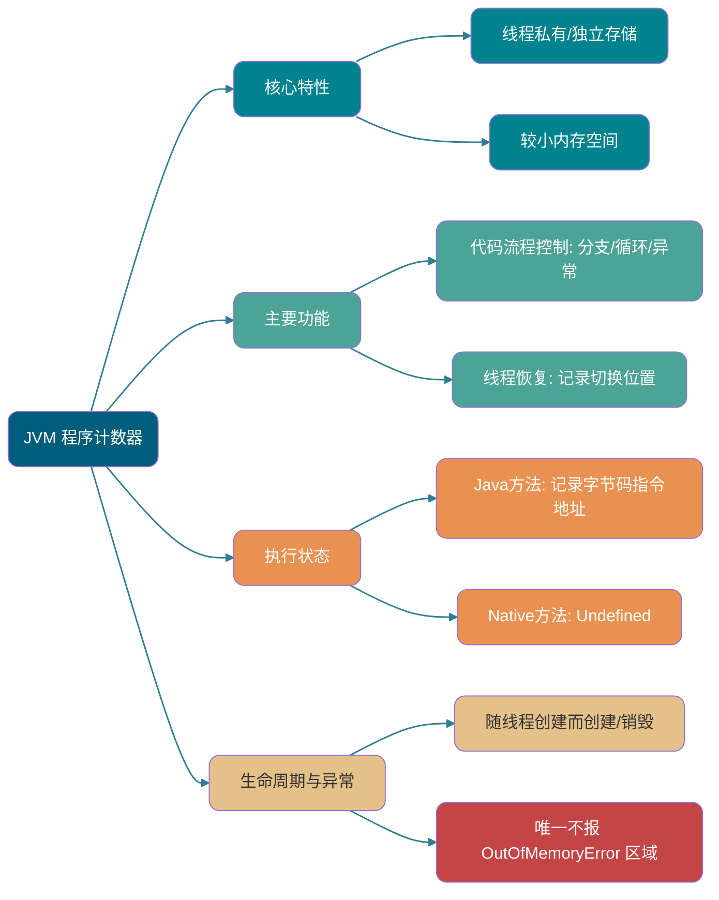
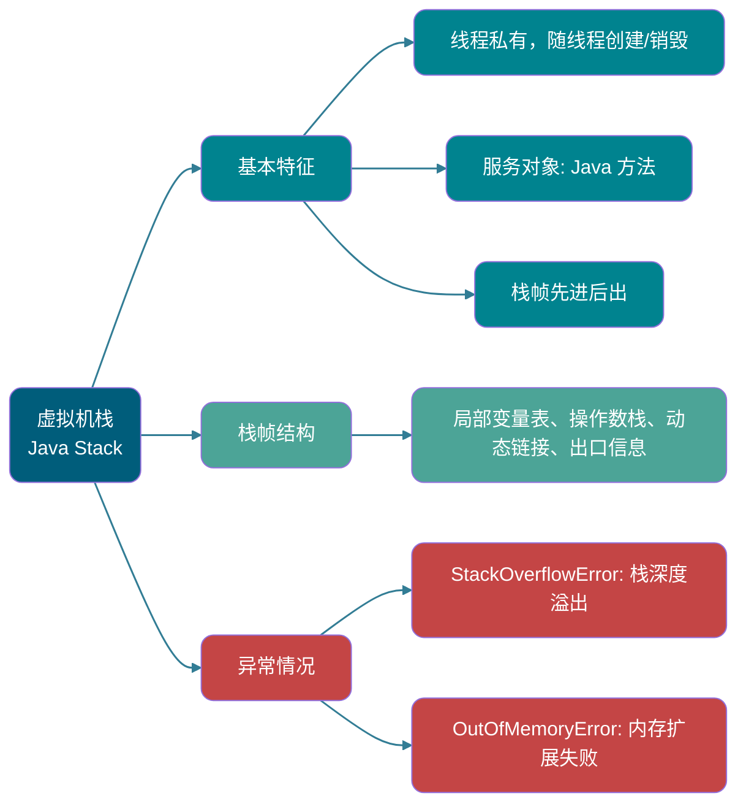
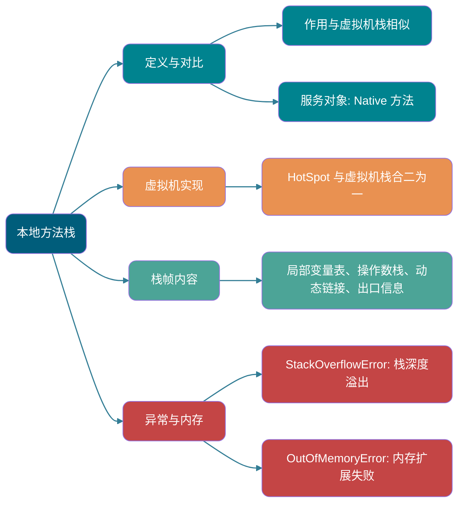
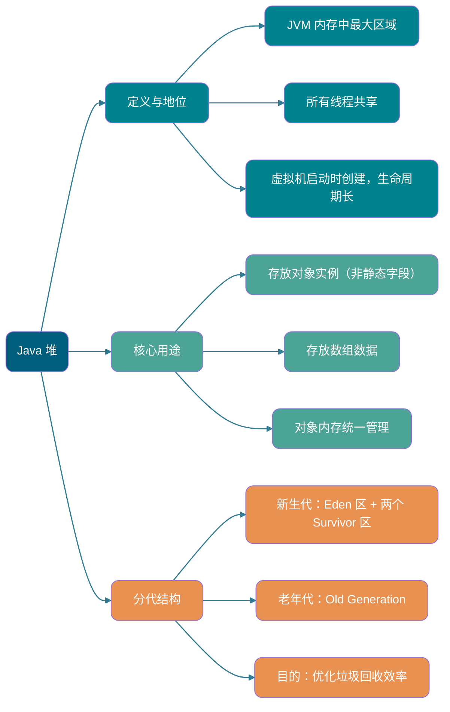
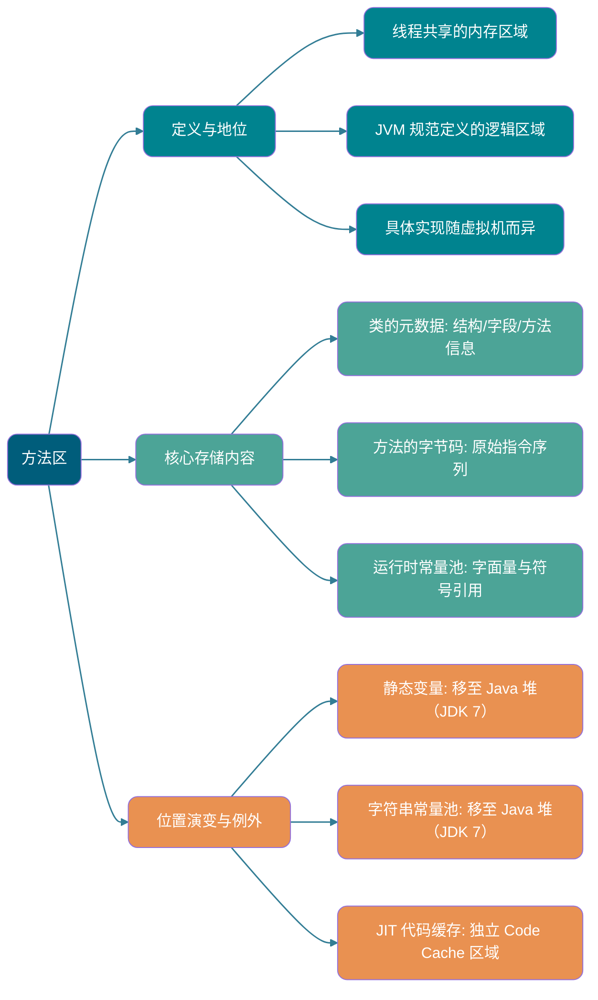
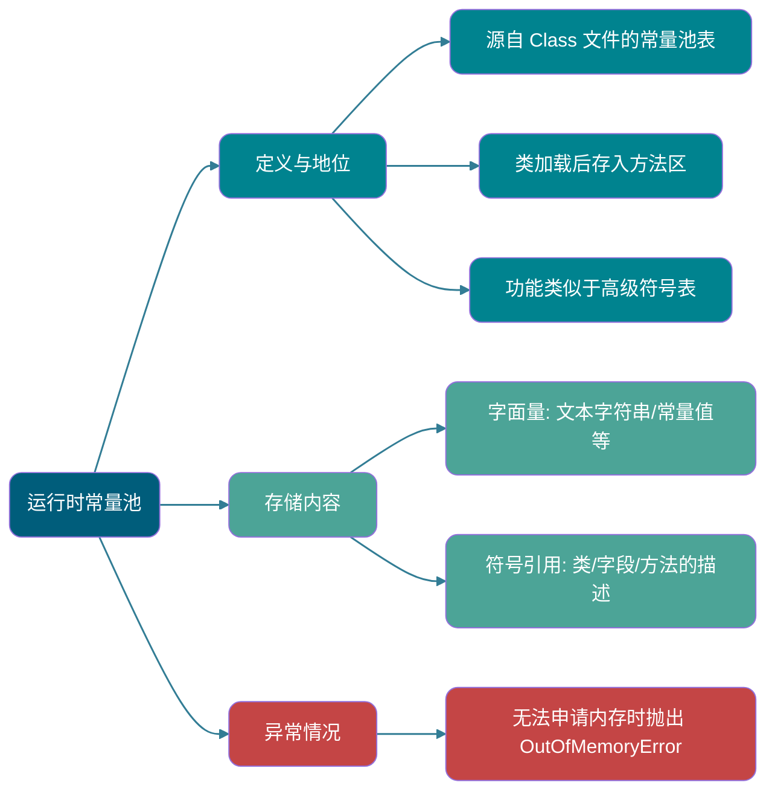
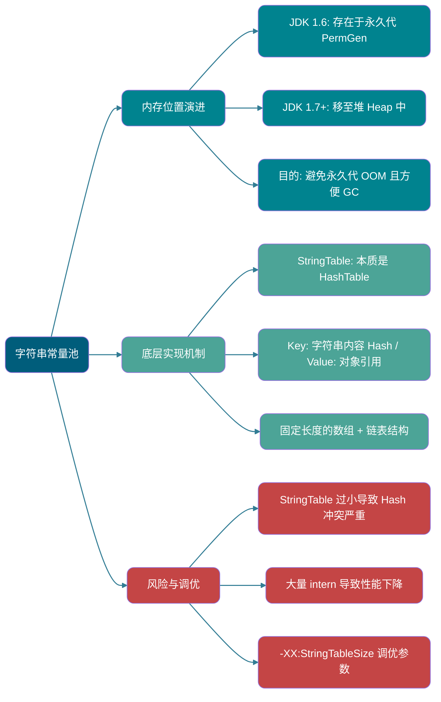
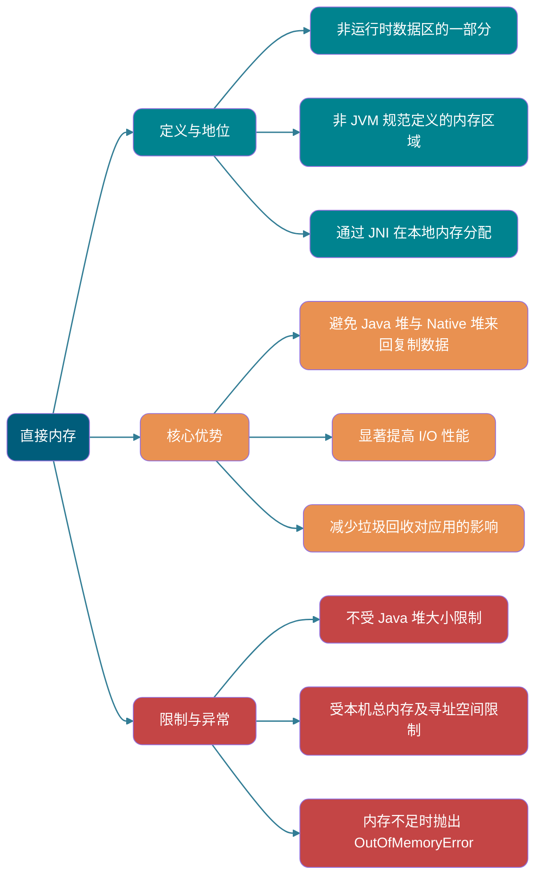
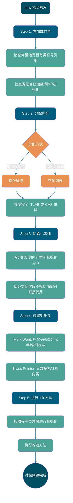

<!-- @include: @small-advertisement.snippet.md -->

> Nếu không có ghi chú đặc biệt, tất cả đều đề cập đến máy ảo HotSpot.
>
> Bài viết này được tổng hợp và bổ sung dựa trên cuốn sách "Hiểu sâu về Java Virtual Machine: Các tính năng nâng cao và thực hành tốt nhất của JVM".
>
> Câu hỏi phỏng vấn thường gặp:
>
> - Giới thiệu về vùng bộ nhớ Java (Runtime Data Areas)
> - Quá trình tạo đối tượng Java (5 bước, nên có thể viết lại từ trí nhớ và biết mỗi bước máy ảo làm gì)
> - Hai cách truy cập định vị đối tượng (handle và direct pointer)

## Lời mở đầu

Đối với lập trình viên Java, dưới cơ chế quản lý bộ nhớ tự động của máy ảo, họ không còn cần phải viết các thao tác delete/free tương ứng cho mỗi thao tác new như lập trình viên C/C++, nên ít gặp các vấn đề memory leak và memory overflow. Chính vì lập trình viên Java trao quyền kiểm soát bộ nhớ cho Java Virtual Machine, nếu có vấn đề về memory leak hoặc overflow xảy ra, nếu không hiểu cách máy ảo sử dụng bộ nhớ thì việc gỡ lỗi sẽ là một nhiệm vụ rất khó khăn.

## Vùng dữ liệu Runtime

Java Virtual Machine chia bộ nhớ mà nó quản lý thành nhiều vùng dữ liệu khác nhau khi thực thi chương trình Java.

JDK 1.8 và các phiên bản trước có một số khác biệt nhỏ, ở đây chúng ta lấy JDK 1.7 và JDK 1.8 làm ví dụ.

**JDK 1.7**:


**JDK 1.8**:


**Riêng theo thread:**

- Program Counter (Bộ đếm chương trình)
- JVM Stack (Ngăn xếp máy ảo)
- Native Method Stack (Ngăn xếp phương thức native)

**Dùng chung giữa các thread:**

- Heap (Vùng nhớ heap)
- Method Area (Vùng phương thức)
- Direct Memory (Bộ nhớ trực tiếp - không phải là một phần của vùng dữ liệu runtime)

Đặc tả Java Virtual Machine quy định khá linh hoạt về vùng dữ liệu runtime. Lấy heap làm ví dụ: heap có thể là không gian liên tục hoặc không liên tục. Kích thước heap có thể cố định hoặc mở rộng theo yêu cầu trong quá trình chạy. Người triển khai máy ảo có thể sử dụng bất kỳ thuật toán thu gom rác nào để quản lý heap, thậm chí hoàn toàn không thu gom rác cũng được.

### Program Counter (Bộ đếm chương trình)



Program Counter là một vùng nhớ nhỏ, có thể xem như chỉ số dòng của bytecode đang được thực thi bởi thread hiện tại. Bộ giải thích bytecode chọn bytecode tiếp theo cần thực thi bằng cách thay đổi giá trị của bộ đếm này, các chức năng như phân nhánh, vòng lặp, nhảy, xử lý ngoại lệ, khôi phục thread đều dựa vào bộ đếm này.

Ngoài ra, để có thể khôi phục về vị trí thực thi chính xác sau khi chuyển đổi thread, mỗi thread cần có một program counter độc lập, các bộ đếm giữa các thread không ảnh hưởng lẫn nhau, lưu trữ độc lập, chúng ta gọi loại vùng nhớ này là vùng nhớ "private theo thread".

Từ phần giới thiệu trên, chúng ta biết program counter chủ yếu có hai tác dụng:

- Bộ giải thích bytecode đọc lần lượt các lệnh bằng cách thay đổi program counter, từ đó thực hiện điều khiển luồng code như: thực thi tuần tự, lựa chọn, vòng lặp, xử lý ngoại lệ.
- Trong trường hợp đa luồng, program counter được dùng để ghi lại vị trí thực thi của thread hiện tại, để khi thread được chuyển trở lại thì biết thread đó đã chạy đến đâu.

Vòng đời của program counter hoàn toàn đồng bộ với thread:

- **Tạo**: được tạo cùng với sự tạo ra của thread.
- **Hủy**: được hủy cùng với sự kết thúc của thread.

Khi thực thi **phương thức Java** (không phải native), program counter ghi lại **địa chỉ của lệnh bytecode JVM đang thực thi hiện tại**. Khi thread thực thi một **phương thức native** (phương thức cục bộ), giá trị của program counter là **Undefined (chưa xác định)**. Điều này là vì phương thức native không thực thi bytecode JVM, mà gọi code nền tảng cục bộ thông qua JNI, JVM không cần theo dõi địa chỉ bytecode nữa.

⚠️ Lưu ý: Program counter là vùng nhớ duy nhất trong đặc tả JVM không quy định bất kỳ trường hợp `OutOfMemoryError` nào. Điều này là vì dung lượng bộ nhớ của nó rất nhỏ và cố định, không xảy ra tình trạng tràn bộ nhớ.

### Java Virtual Machine Stack (Ngăn xếp máy ảo Java)



Giống như program counter, Java Virtual Machine Stack (gọi tắt là Stack) cũng là private theo thread, vòng đời của nó giống với thread, được tạo khi thread được tạo và bị hủy khi thread kết thúc.

Stack thực sự là một phần cốt lõi của vùng dữ liệu runtime JVM. Ngoại trừ một số lời gọi Native method được thực hiện thông qua Native Method Stack (sẽ đề cập sau), tất cả các lời gọi phương thức Java khác đều được thực hiện thông qua Stack (cũng cần phối hợp với các vùng dữ liệu runtime khác như program counter).

Dữ liệu của lời gọi phương thức cần được truyền qua stack, mỗi lời gọi phương thức sẽ có một stack frame tương ứng được đẩy vào stack, sau khi mỗi lời gọi phương thức kết thúc, một stack frame sẽ được lấy ra.

Stack được cấu tạo bởi các stack frame, mỗi stack frame có: bảng biến cục bộ (local variable table), ngăn xếp toán hạng (operand stack), dynamic linking, địa chỉ trả về phương thức. Tương tự với cấu trúc dữ liệu stack, cả hai đều là cấu trúc dữ liệu vào sau ra trước (LIFO), chỉ hỗ trợ hai thao tác pop và push.


**Bảng biến cục bộ** chủ yếu lưu trữ các kiểu dữ liệu đã biết tại thời điểm biên dịch (boolean, byte, char, short, int, float, long, double), tham chiếu đối tượng (kiểu reference, khác với bản thân đối tượng, có thể là một con trỏ tham chiếu trỏ đến địa chỉ đầu của đối tượng, hoặc là một handle đại diện cho đối tượng hoặc vị trí liên quan đến đối tượng này).


**Operand stack** chủ yếu được dùng như trạm trung chuyển của lời gọi phương thức, dùng để lưu trữ kết quả tính toán trung gian được tạo ra trong quá trình thực thi phương thức. Ngoài ra, các biến tạm thời được tạo ra trong quá trình tính toán cũng được đặt trong operand stack.

**Dynamic linking** là một trong những cơ chế quan trọng của Java Virtual Machine để thực hiện lời gọi phương thức. Trong file Class, lời gọi phương thức tồn tại dưới dạng **symbolic reference** trong constant pool. Để thực thi lời gọi, các symbolic reference này phải được chuyển đổi thành **direct reference** trong bộ nhớ. Quá trình chuyển đổi này chia thành hai trường hợp: đối với các phương thức tĩnh, phương thức private, v.v. mà phiên bản có thể xác định tại thời điểm biên dịch, việc chuyển đổi này được hoàn thành trong **giai đoạn giải quyết khi tải class**, gọi là **static resolution**. Còn đối với **virtual method** (là cơ sở để thực hiện tính đa hình) mà việc xác định triển khai cụ thể phụ thuộc vào kiểu thực tế của đối tượng, quá trình chuyển đổi này được trì hoãn đến **thời điểm chạy chương trình**, được thực hiện bởi **dynamic linking**. Do đó, tác dụng cốt lõi của **dynamic linking** là **giải quyết điểm gọi virtual method tại runtime, liên kết nó đến phiên bản phương thức đúng**.


Mặc dù không gian stack không phải là vô hạn, nhưng trong các lời gọi bình thường, thường không có vấn đề gì. Tuy nhiên, nếu lời gọi hàm rơi vào vòng lặp vô hạn, sẽ dẫn đến quá nhiều stack frame được đẩy vào stack và chiếm quá nhiều không gian, gây ra độ sâu stack quá lớn. Khi thread yêu cầu độ sâu stack vượt quá độ sâu tối đa của Java Virtual Machine Stack hiện tại, lỗi `StackOverFlowError` sẽ được ném ra.

**Phương thức Java có hai cách trả về**:

- **Trả về bình thường**: thực thi lệnh return, giá trị trả về được truyền cho người gọi.
- **Trả về bằng ngoại lệ**: trong quá trình thực thi phương thức, ngoại lệ được ném ra và không được bắt.

Dù cách trả về nào cũng sẽ dẫn đến việc stack frame bị lấy ra. Nghĩa là, **stack frame được tạo ra khi phương thức được gọi và bị hủy khi phương thức kết thúc. Dù phương thức hoàn thành bình thường hay bằng ngoại lệ đều được tính là kết thúc phương thức.**

Ngoài lỗi `StackOverFlowError`, stack cũng có thể xuất hiện lỗi `OutOfMemoryError`, điều này là vì nếu kích thước bộ nhớ stack có thể mở rộng động, khi máy ảo không thể xin được đủ không gian bộ nhớ khi mở rộng stack động, ngoại lệ `OutOfMemoryError` sẽ được ném ra.

Tóm tắt ngắn gọn hai lỗi có thể xảy ra trong stack khi chạy chương trình:

- **`StackOverFlowError`:** Nếu kích thước bộ nhớ stack không cho phép mở rộng động, khi thread yêu cầu độ sâu stack vượt quá độ sâu tối đa của Java Virtual Machine Stack hiện tại, lỗi `StackOverFlowError` sẽ được ném ra.
- **`OutOfMemoryError`:** Nếu kích thước bộ nhớ stack có thể mở rộng động, khi máy ảo không thể xin được đủ không gian bộ nhớ khi mở rộng stack động, ngoại lệ `OutOfMemoryError` sẽ được ném ra.


### Native Method Stack (Ngăn xếp phương thức native)



Tác dụng rất tương tự với virtual machine stack, sự khác biệt là: **Virtual machine stack phục vụ cho việc thực thi phương thức Java (tức là bytecode) của máy ảo, còn native method stack phục vụ cho Native method mà máy ảo sử dụng.** Trong máy ảo HotSpot, hai cái này được hợp nhất làm một.

Khi native method được thực thi, một stack frame cũng được tạo trong native method stack, dùng để lưu trữ bảng biến cục bộ, operand stack, dynamic linking, thông tin exit của native method đó.

Sau khi phương thức thực thi xong, stack frame tương ứng cũng được lấy ra và giải phóng không gian bộ nhớ, cũng có thể xảy ra hai lỗi `StackOverFlowError` và `OutOfMemoryError`.

### Heap (Vùng nhớ heap)



Vùng nhớ lớn nhất trong bộ nhớ được quản lý bởi Java Virtual Machine, Java Heap là vùng nhớ được chia sẻ bởi tất cả các thread, được tạo khi máy ảo khởi động. **Mục đích duy nhất của vùng nhớ này là lưu trữ các instance đối tượng, hầu hết tất cả các instance đối tượng và mảng đều được phân bổ bộ nhớ ở đây.**

"Hầu hết" tất cả các đối tượng trong thế giới Java đều được phân bổ trong heap, nhưng với sự phát triển của JIT compiler và kỹ thuật escape analysis ngày càng trưởng thành, kỹ thuật tối ưu hóa stack allocation và scalar replacement sẽ dẫn đến một số thay đổi tinh tế, không còn "tuyệt đối" rằng tất cả đối tượng đều được phân bổ trong heap nữa. Bắt đầu từ JDK 1.7, escape analysis đã được bật theo mặc định, nếu tham chiếu đối tượng trong một số phương thức không được trả về hoặc không được sử dụng bên ngoài (tức là không thoát ra ngoài), thì đối tượng có thể được phân bổ bộ nhớ trực tiếp trên stack.

Java Heap là vùng chính mà garbage collector quản lý, do đó còn được gọi là **GC Heap (Garbage Collected Heap)**. Từ góc độ thu gom rác, vì các collector hiện nay cơ bản đều sử dụng thuật toán thu gom rác phân thế hệ, nên Java Heap có thể được chia nhỏ hơn thành: Young Generation và Old Generation; chi tiết hơn có: Eden, Survivor, Old, v.v. Mục đích của việc phân chia thêm là để thu hồi bộ nhớ tốt hơn hoặc phân bổ bộ nhớ nhanh hơn.

Trong JDK 7 và các phiên bản trước JDK 7, heap thường được chia thành ba phần:

1. Young Generation (Thế hệ trẻ)
2. Old Generation (Thế hệ già)
3. Permanent Generation (Thế hệ vĩnh cửu)

Vùng Eden, hai vùng Survivor S0 và S1 trong hình dưới đây đều thuộc Young Generation, lớp giữa thuộc Old Generation, lớp dưới cùng thuộc Permanent Generation.


**Sau JDK 8, PermGen (Permanent Generation) đã được thay thế bằng Metaspace (không gian meta), Metaspace sử dụng bộ nhớ local.** (Tôi sẽ giới thiệu chi tiết trong phần Method Area).

Trong hầu hết các trường hợp, đối tượng sẽ được phân bổ trước trong vùng Eden, sau một lần thu gom rác Young Generation, nếu đối tượng vẫn còn sống, nó sẽ vào S0 hoặc S1, và tuổi của đối tượng cũng tăng thêm 1 (tuổi ban đầu của đối tượng sau Eden -> Survivor là 1), khi tuổi của nó tăng đến một mức nhất định (mặc định là 15 tuổi), nó sẽ được thăng cấp lên Old Generation. Ngưỡng tuổi để đối tượng thăng cấp lên Old Generation có thể được đặt thông qua tham số `-XX:MaxTenuringThreshold`. Tuy nhiên, giá trị được đặt phải trong khoảng 0-15, nếu không sẽ xuất hiện lỗi sau:

```bash
MaxTenuringThreshold of 20 is invalid; must be between 0 and 15
```

**Tại sao tuổi chỉ có thể là 0-15?**

Vì vùng ghi lại tuổi nằm trong object header, kích thước của vùng này thường là 4 bit. 4 bit này có thể biểu diễn số nhị phân tối đa là 1111, tức là 15 trong thập phân. Do đó, tuổi của đối tượng bị giới hạn từ 0 đến 15.

Ở đây chúng ta kết hợp với bố cục đối tượng để giới thiệu chi tiết hơn.

Trong máy ảo HotSpot, bố cục lưu trữ đối tượng trong bộ nhớ có thể được chia thành 3 vùng: Object Header (tiêu đề đối tượng), Instance Data (dữ liệu instance) và Padding (đệm căn chỉnh). Trong đó, object header gồm hai phần: Mark Word (trường đánh dấu) và Klass Word (con trỏ kiểu). Phần giới thiệu chi tiết về bố cục bộ nhớ đối tượng sẽ được đề cập ở phần sau, ở đây không nhắc lại.

Thông tin tuổi này được lưu trong trường đánh dấu (trường đánh dấu cũng lưu các thông tin khác của bản thân đối tượng như hash code, thông tin trạng thái khóa, v.v.). `markOop.hpp` định nghĩa cấu trúc của mark word:


Có thể thấy kích thước tuổi đối tượng chiếm thực sự là 4 bit.

> **🐛 Hiệu chỉnh (xem: [issue552](https://github.com/Snailclimb/JavaGuide/issues/552))**: "Khi Hotspot duyệt qua tất cả các đối tượng, nó cộng dồn kích thước chiếm dụng của chúng theo tuổi từ nhỏ đến lớn, khi cộng dồn đến một tuổi nào đó, kích thước cộng dồn vượt quá một nửa vùng Survivor, thì lấy giá trị nhỏ hơn giữa tuổi đó và `MaxTenuringThreshold` làm ngưỡng tuổi thăng cấp mới".
>
> **Code tính tuổi động như sau**
>
> ```c++
> uint ageTable::compute_tenuring_threshold(size_t survivor_capacity) {
>  //survivor_capacity是survivor空间的大小
> size_t desired_survivor_size = (size_t)((((double) survivor_capacity)*TargetSurvivorRatio)/100);//TargetSurvivorRatio 为50
> size_t total = 0;
> uint age = 1;
> while (age < table_size) {
> total += sizes[age];//sizes数组是每个年龄段对象大小
> if (total > desired_survivor_size) break;
> age++;
> }
> uint result = age < MaxTenuringThreshold ? age : MaxTenuringThreshold;
>   ...
> }
> ```

Lỗi dễ xảy ra nhất ở heap là `OutOfMemoryError`, và sau khi xảy ra lỗi này, biểu hiện còn có một số dạng, ví dụ:

1. **`java.lang.OutOfMemoryError: GC Overhead Limit Exceeded`**: Lỗi này xảy ra khi JVM mất quá nhiều thời gian thực thi thu gom rác và chỉ có thể thu hồi được rất ít không gian heap.
2. **`java.lang.OutOfMemoryError: Java heap space`**: Nếu khi tạo đối tượng mới, không gian trong heap không đủ để chứa đối tượng mới tạo, lỗi này sẽ xảy ra. (Liên quan đến kích thước heap tối đa được cấu hình, và bị giới hạn bởi kích thước bộ nhớ vật lý. Heap tối đa có thể được cấu hình thông qua tham số `-Xmx`, nếu không cấu hình đặc biệt, giá trị mặc định sẽ được sử dụng, xem chi tiết: [Default Java 8 max heap size](https://stackoverflow.com/questions/28272923/default-xmxsize-in-java-8-max-heap-size))
3. ……

### Method Area (Vùng phương thức)



Method Area là một vùng logic của vùng dữ liệu runtime JVM, là vùng nhớ được chia sẻ bởi các thread.

"Đặc tả Java Virtual Machine" chỉ quy định rằng có khái niệm method area và tác dụng của nó, còn method area được triển khai như thế nào thì là vấn đề của máy ảo. Nghĩa là, trên các triển khai máy ảo khác nhau, triển khai của method area là khác nhau.

Khi máy ảo tải một class, nó sẽ phân tích thông tin tương ứng từ file Class và lưu **metadata** này vào method area. Cụ thể, method area chủ yếu lưu trữ các dữ liệu cốt lõi sau:

1. **Metadata của class**: Bao gồm cấu trúc đầy đủ của class, như tên class, class cha, các interface được triển khai, access modifier, cũng như thông tin chi tiết về các field và method (tên, kiểu, modifier, v.v.).
2. **Bytecode của phương thức**: Chuỗi lệnh gốc của mỗi phương thức.
3. **Runtime Constant Pool**: Duy nhất cho mỗi class, được chuyển đổi từ constant pool table trong file Class, dùng để lưu trữ các literal và symbolic reference cho các kiểu, field, phương thức được tạo ra tại thời điểm biên dịch.

Cần đặc biệt lưu ý rằng, mặc dù về mặt logic các dữ liệu sau liên quan đến class, nhưng trong máy ảo HotSpot, chúng không được lưu trong method area:

- **Static Variables (Biến tĩnh)**: Kể từ JDK 7, biến tĩnh đã được **chuyển từ method area (permanent generation) sang Java Heap**, được lưu cùng với đối tượng `java.lang.Class` của class đó.
- **String Pool (Bộ pool chuỗi)**: Cũng từ JDK 7, string pool cũng đã được **chuyển sang Java Heap**.
- **JIT Code Cache (Bộ nhớ cache code JIT)**: Code máy cục bộ được JIT compiler biên dịch từ bytecode của các hot method, được lưu trong một **vùng nhớ độc lập gọi là "Code Cache"**, không phải trong method area. Điều này nhằm thực hiện quản lý bộ nhớ và thực thi hiệu quả hơn.


**Method Area, Permanent Generation và Metaspace có mối quan hệ như thế nào?** Mối quan hệ giữa Method Area, Permanent Generation và Metaspace giống như mối quan hệ giữa interface và class trong Java, class triển khai interface, ở đây class có thể được coi là Permanent Generation và Metaspace, interface có thể được coi là Method Area. Nghĩa là Permanent Generation và Metaspace là hai cách triển khai Method Area trong đặc tả máy ảo của HotSpot. Và, Permanent Generation là triển khai method area trước JDK 1.8, từ JDK 1.8 trở đi, triển khai method area đã chuyển sang Metaspace.


**Tại sao lại thay thế Permanent Generation (PermGen) bằng Metaspace?**

Hình dưới đây từ "Hiểu sâu về Java Virtual Machine" phiên bản 3, mục 2.2.5


1. Toàn bộ Permanent Generation có một giới hạn kích thước cố định được đặt bởi JVM, không thể điều chỉnh (tức là bị giới hạn bởi bộ nhớ JVM), trong khi Metaspace sử dụng bộ nhớ local, bị giới hạn bởi bộ nhớ khả dụng của máy cục bộ, mặc dù Metaspace vẫn có thể tràn, nhưng xác suất xảy ra sẽ nhỏ hơn trước đây.

> Khi Metaspace tràn sẽ nhận được lỗi sau: `java.lang.OutOfMemoryError: MetaSpace`

Bạn có thể sử dụng cờ `-XX:MaxMetaspaceSize` để đặt kích thước Metaspace tối đa, giá trị mặc định là unlimited, có nghĩa là chỉ bị giới hạn bởi bộ nhớ hệ thống. Cờ điều chỉnh `-XX:MetaspaceSize` định nghĩa kích thước ban đầu của Metaspace, nếu cờ này không được chỉ định, Metaspace sẽ tự động điều chỉnh kích thước động theo yêu cầu ứng dụng khi runtime.

2. Trong Metaspace lưu trữ metadata của class, như vậy số lượng metadata class được tải không còn bị kiểm soát bởi `MaxPermSize` nữa, mà bởi không gian thực tế khả dụng của hệ thống, điều này cho phép tải được nhiều class hơn.

3. Trong JDK8, khi hợp nhất code của HotSpot và JRockit, JRockit chưa bao giờ có thứ gọi là Permanent Generation, sau khi hợp nhất không cần thiết phải đặt thêm một Permanent Generation nữa.

4. Permanent Generation mang lại sự phức tạp không cần thiết cho GC và hiệu quả thu hồi thấp.

**Các tham số thường dùng cho Method Area là gì?**

Trước khi Permanent Generation bị loại bỏ hoàn toàn trong JDK 1.8, thường dùng các tham số sau để điều chỉnh kích thước Method Area.

```java
-XX:PermSize=N //方法区 (永久代) 初始大小
-XX:MaxPermSize=N //方法区 (永久代) 最大大小,超过这个值将会抛出 OutOfMemoryError 异常:java.lang.OutOfMemoryError: PermGen
```

Tương đối mà nói, hành vi thu gom rác xuất hiện khá ít trong vùng này, nhưng không phải dữ liệu vào method area là "tồn tại vĩnh cửu".

Trong JDK 1.8, Method Area (Permanent Generation của HotSpot) đã bị loại bỏ hoàn toàn (JDK1.7 đã bắt đầu), được thay thế bằng Metaspace, Metaspace sử dụng bộ nhớ local. Dưới đây là một số tham số thường dùng:

```java
-XX:MetaspaceSize=N //设置 Metaspace 的初始（和最小大小）
-XX:MaxMetaspaceSize=N //设置 Metaspace 的最大大小
```

Điểm khác biệt lớn so với Permanent Generation là, nếu không chỉ định kích thước, khi nhiều class được tạo hơn, máy ảo sẽ tiêu hết tất cả bộ nhớ hệ thống khả dụng.

### Runtime Constant Pool (Bộ pool hằng số runtime)



Ngoài thông tin về version, field, method, interface trong file Class, còn có **Constant Pool Table (Bảng pool hằng số)** dùng để lưu trữ các literal (Literal) và symbolic reference (Symbolic Reference) được tạo ra tại thời điểm biên dịch.

Literal là cách biểu diễn giá trị cố định trong source code, tức là qua literal chúng ta có thể biết được ý nghĩa của giá trị. Literal bao gồm integer, float và string literal. Symbolic reference thường gặp bao gồm class symbolic reference, field symbolic reference, method symbolic reference, interface method symbol.

Giải thích về symbolic reference và direct reference trong "Hiểu sâu về Java Virtual Machine" mục 7.34, phiên bản thứ ba như sau:


Constant pool table sẽ được lưu vào runtime constant pool của method area sau khi class được tải.

Chức năng của runtime constant pool tương tự như symbol table của ngôn ngữ lập trình truyền thống, mặc dù nó chứa dữ liệu rộng hơn so với symbol table thông thường.

Vì runtime constant pool là một phần của method area, nên tự nhiên bị giới hạn bởi bộ nhớ của method area, khi constant pool không thể xin thêm bộ nhớ sẽ ném lỗi `OutOfMemoryError`.

### String Pool (Bộ pool chuỗi)



**String Pool** là một vùng đặc biệt mà JVM mở ra dành riêng cho chuỗi (class String) nhằm nâng cao hiệu năng và giảm tiêu thụ bộ nhớ, mục đích chính là tránh tạo ra chuỗi trùng lặp.

```java
// 1.在字符串常量池中查询字符串对象 "ab"，如果没有则创建"ab"并放入字符串常量池
// 2.将字符串对象 "ab" 的引用赋值给 aa
String aa = "ab";
// 直接返回字符串常量池中字符串对象 "ab"，赋值给引用 bb
String bb = "ab";
System.out.println(aa==bb); // true
```

Trong máy ảo HotSpot, triển khai của string pool là `src/hotspot/share/classfile/stringTable.cpp`, `StringTable` có thể hiểu đơn giản là một `HashTable` có kích thước cố định với dung lượng `StringTableSize` (có thể đặt thông qua tham số `-XX:StringTableSize`), lưu trữ quan hệ ánh xạ giữa chuỗi (key) và tham chiếu đối tượng chuỗi (value), tham chiếu đối tượng chuỗi trỏ đến đối tượng chuỗi trong heap.

Trước JDK1.7, string pool được đặt trong permanent generation. Trong JDK1.7, string pool và biến tĩnh đã được chuyển từ permanent generation sang Java Heap.


**Tại sao JDK 1.7 lại chuyển string pool sang heap?**

Chủ yếu là vì hiệu quả GC recovery của permanent generation (triển khai method area) quá thấp, chỉ được thực hiện GC khi Full GC. Trong chương trình Java thường có một lượng lớn chuỗi chờ thu hồi, đặt string pool trong heap có thể thu hồi bộ nhớ chuỗi hiệu quả và kịp thời hơn.

Câu hỏi liên quan: [JVM constant pool lưu trữ đối tượng hay tham chiếu? - RednaxelaFX - Zhihu](https://www.zhihu.com/question/57109429/answer/151717241)

Cuối cùng chia sẻ một đoạn lời của thầy Zhou Zhiming trong [issue#112](https://github.com/fenixsoft/jvm_book/issues/112) của kho GitHub [Mã mẫu & Đính chính "Hiểu sâu về Java Virtual Machine (Phiên bản 3)"](https://github.com/fenixsoft/jvm_book):

> **Runtime constant pool, method area, string pool đây đều là những khái niệm logic không thay đổi theo triển khai máy ảo, là công khai và trừu tượng. Metaspace, Heap là các khái niệm vật lý liên quan đến một triển khai máy ảo cụ thể, là riêng tư và cụ thể.**

### Direct Memory (Bộ nhớ trực tiếp)



Direct Memory là một loại bộ nhớ đệm đặc biệt, không được phân bổ trong Java Heap hay Method Area, mà được phân bổ trên bộ nhớ local thông qua JNI.

Direct Memory không phải là một phần của vùng dữ liệu runtime máy ảo, cũng không phải là vùng nhớ được định nghĩa trong đặc tả máy ảo, nhưng phần bộ nhớ này cũng được sử dụng thường xuyên. Và cũng có thể dẫn đến lỗi `OutOfMemoryError`.

**NIO (Non-Blocking I/O, còn được gọi là New I/O)** được thêm vào trong JDK1.4, giới thiệu một phương thức I/O dựa trên **Channel** và **Buffer**, có thể sử dụng trực tiếp thư viện hàm Native để phân bổ bộ nhớ ngoài heap, sau đó thao tác trên vùng nhớ đó thông qua đối tượng DirectByteBuffer được lưu trong Java Heap làm tham chiếu đến vùng nhớ này. Như vậy có thể nâng cao hiệu năng đáng kể trong một số tình huống, vì **tránh được việc sao chép dữ liệu qua lại giữa Java Heap và Native Heap**.

Việc phân bổ Direct Memory không bị giới hạn bởi Java Heap, nhưng vì đây là bộ nhớ nên sẽ bị giới hạn bởi tổng kích thước bộ nhớ của máy cục bộ và không gian địa chỉ của bộ xử lý.

Còn có một khái niệm tương tự là **Off-Heap Memory (bộ nhớ ngoài heap)**. Một số bài viết coi Direct Memory tương đương với Off-Heap Memory, cá nhân tôi cho rằng không hoàn toàn chính xác.

Off-Heap Memory là phân bổ đối tượng bộ nhớ ngoài heap, những bộ nhớ này được quản lý trực tiếp bởi hệ điều hành (chứ không phải máy ảo), kết quả là có thể giảm thiểu tác động của việc thu gom rác đối với ứng dụng ở một mức độ nhất định.

## Khám phá đối tượng của HotSpot Virtual Machine

Qua phần giới thiệu ở trên, chúng ta đã hiểu sơ qua về tình trạng bộ nhớ của máy ảo, tiếp theo chúng ta sẽ tìm hiểu chi tiết toàn bộ quá trình phân bổ, bố cục và truy cập đối tượng trong Java Heap của máy ảo HotSpot.

### Tạo đối tượng

Tôi khuyến nghị nên có thể viết lại quá trình tạo đối tượng Java từ trí nhớ, và phải nắm được mỗi bước đang làm gì.



#### Bước 1: Kiểm tra class loading

Khi máy ảo gặp lệnh new, trước tiên sẽ kiểm tra xem tham số của lệnh này có thể định vị symbolic reference của class này trong constant pool hay không, và kiểm tra xem class được đại diện bởi symbolic reference này đã được tải, giải quyết và khởi tạo chưa. Nếu chưa, phải thực thi quá trình class loading tương ứng trước.

#### Bước 2: Phân bổ bộ nhớ

Sau khi **kiểm tra class loading** thành công, máy ảo sẽ **phân bổ bộ nhớ** cho đối tượng mới. Kích thước bộ nhớ cần thiết cho đối tượng có thể được xác định sau khi class loading hoàn tất, nhiệm vụ phân bổ không gian cho đối tượng tương đương với việc tách một vùng nhớ có kích thước xác định ra từ Java Heap. **Phương thức phân bổ** có hai loại: **"Pointer Bumping"** và **"Free List"**, **việc chọn phương thức nào được quyết định bởi Java Heap có quy tắc hay không, còn Java Heap có quy tắc hay không lại được quyết định bởi garbage collector được sử dụng có tính năng nén sắp xếp hay không**.

**Hai phương thức phân bổ bộ nhớ** (nội dung bổ sung, cần nắm):

- Pointer Bumping (Chạm con trỏ):
  - Phạm vi áp dụng: Khi heap có tổ chức (không có memory fragmentation).
  - Nguyên lý: Tất cả bộ nhớ đã dùng được tập hợp vào một bên, bộ nhớ chưa dùng ở bên kia, ở giữa có một con trỏ ranh giới, chỉ cần di chuyển con trỏ đó về phía bộ nhớ chưa dùng theo kích thước bộ nhớ đối tượng là xong.
  - GC collector sử dụng phương thức phân bổ này: Serial, ParNew
- Free List (Danh sách tự do):
  - Phạm vi áp dụng: Khi heap không có tổ chức.
  - Nguyên lý: Máy ảo duy trì một danh sách, trong đó ghi lại các khối bộ nhớ nào có thể sử dụng, khi phân bổ, tìm một khối bộ nhớ đủ lớn để phân bổ cho instance đối tượng, sau đó cập nhật ghi chú trong danh sách.
  - GC collector sử dụng phương thức phân bổ này: CMS

Việc chọn một trong hai cách trên phụ thuộc vào Java Heap có quy tắc hay không. Còn Java Heap có quy tắc hay không phụ thuộc vào thuật toán của GC collector là "mark-sweep" hay "mark-compact" (cũng gọi là "mark-compress"), đáng chú ý là bộ nhớ sau copy algorithm cũng có tổ chức.

**Vấn đề đồng thời trong phân bổ bộ nhớ (nội dung bổ sung, cần nắm)**

Khi tạo đối tượng có một vấn đề rất quan trọng, đó là thread safety, vì trong quá trình phát triển thực tế, việc tạo đối tượng là việc diễn ra thường xuyên. Đối với máy ảo, phải đảm bảo thread an toàn, thường thì máy ảo sử dụng hai cách để đảm bảo thread safety:

- **CAS + retry on failure:** CAS là một cách triển khai của optimistic lock. Optimistic lock là mỗi lần không khóa mà giả định không có xung đột để thực hiện một thao tác nào đó, nếu thất bại vì xung đột thì retry cho đến khi thành công. **Máy ảo sử dụng CAS kết hợp với retry khi thất bại để đảm bảo tính nguyên tử của thao tác cập nhật.**
- **TLAB:** Phân bổ trước một vùng nhớ trong Eden cho mỗi thread, khi JVM phân bổ bộ nhớ cho đối tượng trong thread, trước tiên phân bổ trong TLAB, khi đối tượng lớn hơn bộ nhớ còn lại trong TLAB hoặc bộ nhớ TLAB đã dùng hết, mới dùng CAS như trên để phân bổ bộ nhớ

#### Bước 3: Khởi tạo về giá trị zero

Sau khi phân bổ bộ nhớ xong, máy ảo cần khởi tạo tất cả không gian bộ nhớ được phân bổ về giá trị zero (không bao gồm object header), bước này đảm bảo rằng các instance field của đối tượng có thể được sử dụng trực tiếp trong code Java mà không cần gán giá trị ban đầu, chương trình có thể truy cập vào giá trị zero tương ứng với kiểu dữ liệu của các field này.

#### Bước 4: Đặt object header

Sau khi hoàn thành khởi tạo giá trị zero, **máy ảo cần thực hiện các thiết lập cần thiết cho đối tượng**, ví dụ đối tượng này là instance của class nào, cách tìm thông tin metadata của class, hash code của đối tượng, GC generation age của đối tượng, v.v. **Những thông tin này được lưu trong object header.** Ngoài ra, tùy thuộc vào trạng thái chạy hiện tại của máy ảo, như liệu có bật biased lock hay không, object header sẽ có các cách đặt khác nhau.

#### Bước 5: Thực thi phương thức init

Sau khi tất cả các công việc trên hoàn tất, từ góc độ của máy ảo, một đối tượng mới đã được tạo ra, nhưng từ góc độ chương trình Java, việc tạo đối tượng mới chỉ mới bắt đầu, phương thức `<init>` chưa được thực thi, tất cả các field vẫn là zero. Vì vậy, thông thường sau khi thực thi lệnh new sẽ tiếp tục thực thi phương thức `<init>`, khởi tạo đối tượng theo ý muốn của lập trình viên, như vậy mới tạo ra được một đối tượng thực sự có thể sử dụng.

### Bố cục bộ nhớ đối tượng

Trong máy ảo HotSpot, bố cục của đối tượng trong bộ nhớ có thể được chia thành 3 vùng: **Object Header (Tiêu đề đối tượng)**, **Instance Data (Dữ liệu instance)** và **Padding (Đệm căn chỉnh)**.

Object header gồm hai phần thông tin:

1. Mark Word (Trường đánh dấu): dùng để lưu trữ dữ liệu runtime của bản thân đối tượng, như hash code (HashCode), GC generation age, lock status flag, lock held by thread, biased thread ID, biased timestamp, v.v.
2. Klass pointer (Con trỏ kiểu): con trỏ của đối tượng trỏ đến metadata của class của nó, máy ảo xác định đối tượng này là instance của class nào thông qua con trỏ này.

**Phần Instance Data là thông tin hiệu quả thực sự được lưu trữ trong đối tượng**, cũng là nội dung các field của các kiểu khác nhau được định nghĩa trong chương trình.

**Phần Padding không nhất thiết phải tồn tại, cũng không có ý nghĩa đặc biệt, chỉ đóng vai trò giữ chỗ.** Vì hệ thống quản lý bộ nhớ tự động của HotSpot yêu cầu địa chỉ bắt đầu của đối tượng phải là bội số nguyên của 8 byte, nói cách khác kích thước của đối tượng phải là bội số nguyên của 8 byte. Trong khi phần object header chính xác là bội số của 8 byte (1 lần hoặc 2 lần), do đó, khi phần instance data của đối tượng chưa được căn chỉnh, cần dùng padding để bổ sung.

### Truy cập định vị đối tượng

Tạo đối tượng là để sử dụng đối tượng, chương trình Java của chúng ta thao tác trên đối tượng cụ thể trong heap thông qua dữ liệu reference trên stack. Phương thức truy cập đối tượng được xác định bởi triển khai máy ảo, hiện nay hai phương thức truy cập chính là: **sử dụng handle** và **direct pointer**.

#### Handle (Tay cầm)

Nếu sử dụng handle, thì trong Java Heap sẽ được tách ra một vùng nhớ làm handle pool, reference lưu trữ địa chỉ handle của đối tượng, và trong handle chứa thông tin địa chỉ cụ thể của cả dữ liệu instance đối tượng và dữ liệu kiểu đối tượng.


#### Direct Pointer (Con trỏ trực tiếp)

Nếu sử dụng direct pointer để truy cập, reference lưu trực tiếp địa chỉ của đối tượng.


Hai phương thức truy cập đối tượng này đều có ưu điểm riêng. Ưu điểm lớn nhất của việc sử dụng handle để truy cập là reference lưu trữ địa chỉ handle ổn định, khi đối tượng bị di chuyển chỉ cần thay đổi con trỏ dữ liệu instance trong handle, còn reference bản thân không cần sửa đổi. Ưu điểm lớn nhất của phương thức truy cập bằng direct pointer là tốc độ nhanh, tiết kiệm được một lần overhead định vị con trỏ.

Máy ảo HotSpot chủ yếu sử dụng phương thức này để truy cập đối tượng.

## Tham khảo

- "Hiểu sâu về Java Virtual Machine: Các tính năng nâng cao và thực hành tốt nhất của JVM (Phiên bản 2)"
- "Tự viết Java Virtual Machine"
- Chapter 2. The Structure of the Java Virtual Machine：<https://docs.oracle.com/javase/specs/jvms/se8/html/jvms-2.html>
- Cấu trúc nội bộ Stack Frame JVM - Dynamic Linking：<https://chenxitag.com/archives/368>
- Trong Java, `new String("literal")` - "literal" được đưa vào string constant pool khi nào? - Trả lời của 木女孩 - Zhihu：<https://www.zhihu.com/question/55994121/answer/147296098>
- JVM constant pool lưu trữ đối tượng hay tham chiếu? - Trả lời của RednaxelaFX - Zhihu：<https://www.zhihu.com/question/57109429/answer/151717241>
- <http://www.pointsoftware.ch/en/under-the-hood-runtime-data-areas-javas-memory-model/>
- <https://dzone.com/articles/jvm-permgen-%E2%80%93-where-art-thou>
- <https://stackoverflow.com/questions/9095748/method-area-and-permgen>

<!-- @include: @article-footer.snippet.md -->
